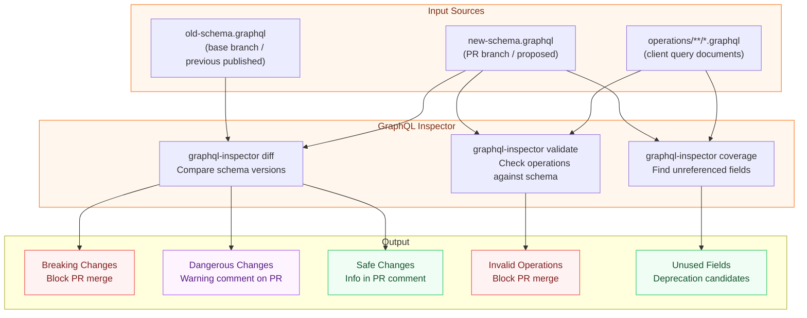

# GraphQL Inspector — Schema Diffing, Change Detection, and Coverage Analysis

> GraphQL Inspector treats your schema as a versioned artifact. Every change between two schema versions is classified, reported, and — if destructive — blocked. Use it in CI to give every pull request an automated schema review that would otherwise require a senior engineer to read a diff manually.

---

## Learning Objectives

- [ ] Understand what GraphQL Inspector does and where it fits in the validation pipeline relative to rover subgraph check
- [ ] Install and use the GraphQL Inspector CLI for schema diffing, operation validation, and coverage analysis
- [ ] Interpret the three change categories: breaking, dangerous, and safe
- [ ] Configure `.graphql-inspector.yml` to tune which change categories block CI
- [ ] Write a complete GitHub Actions workflow that diffs schemas on pull request and posts the diff as a PR comment
- [ ] Use coverage analysis to identify dead schema — types and fields that no recorded client operation references
- [ ] Know when to use GraphQL Inspector versus rover subgraph check

---

## Overview

GraphQL Inspector is an open-source CLI and GitHub Action that provides three independent capabilities: schema diffing, operation document validation, and field coverage analysis. Each capability is independent — you can use any combination of the three without the others.

**Schema diffing** takes two SDL files (or two introspection results) and produces a list of every change between them, classified into three categories. Breaking changes are changes that would cause currently-valid client operations to fail: removing a field, removing a type, making a nullable field non-nullable, changing a field's return type, removing an enum value, or adding a required argument to an existing field. Dangerous changes are structurally valid but risky: changing a field from non-nullable to nullable (which may break clients that assumed non-null), changing a default value, or adding an enum value to an enum used in a switch statement. Safe changes are additions: new types, new fields, new optional arguments, new enum values on enums not used as input.

**Operation validation** takes a set of GraphQL operation documents (`.graphql` files containing queries, mutations, and subscriptions) and validates them against a schema. This catches the case where a schema change has made a previously-valid client query invalid — something that would otherwise be caught only at runtime by the client.

**Coverage analysis** finds the inverse of operation validation: which types and fields in your schema are never referenced by any recorded operation document. Zero-coverage fields are candidates for deprecation and removal.

GraphQL Inspector operates entirely on local files. It does not require a network connection, a schema registry, or any external service. This makes it fast, deterministic, and usable in environments that cannot reach external services. The trade-off is that it cannot use real traffic data to determine whether a breaking change actually matters in production. That capability belongs to rover subgraph check, which consults the Apollo GraphOS operations registry.

---

## Architecture



---

## Core Concepts

### The Three Change Categories

GraphQL Inspector classifies every schema change into one of three categories:

**Breaking** — Any change that causes a currently-valid operation to become invalid. The client does not need to be wrong; the schema changed out from under it.

| Change | Example |
|--------|---------|
| Field removal | `User.email` removed from type `User` |
| Type removal | Type `Address` deleted from schema |
| Argument required | `product(id: ID!)` gains a second required arg `locale: String!` |
| Return type change | `User.age: Int` changed to `User.age: String` |
| Enum value removal | `Status.PENDING` removed from enum `Status` |
| Input field required | `CreateUserInput.phone` becomes required |

**Dangerous** — Structurally valid changes that may cause runtime problems for clients that make assumptions the schema previously guaranteed.

| Change | Example |
|--------|---------|
| Non-null to nullable | `User.email: String!` becomes `User.email: String` |
| Default value changed | `products(limit: Int = 10)` default changes to 100 |
| Enum value added | New value `ARCHIVED` added to `Status` (breaks exhaustive switch) |
| Union member added | New type added to `SearchResult` union |

**Safe** — Purely additive changes. A client that does not use the new field is not affected.

| Change | Example |
|--------|---------|
| Field added | New field `User.phoneNumber` |
| Type added | New type `DeliveryEstimate` |
| Optional argument added | `products` query gains optional `sortBy` argument |

### The Operations Registry Problem

GraphQL Inspector's schema diffing is purely structural: it compares SDL to SDL. It has no knowledge of which operations are actually executed in production. This means it will flag the removal of a field as breaking even if zero clients have ever queried that field.

Rover subgraph check solves this problem by consulting the Apollo GraphOS operations registry, which records every distinct operation (by normalized query hash) that has been executed against your graph in the check window (typically the last seven days). If a field is removed but no recorded operation references that field, rover subgraph check reports the change as a non-breaking removal.

**The practical implication**: use GraphQL Inspector in early development and for local feedback when you do not have an Apollo GraphOS organization. Use rover subgraph check in CI when you have usage data from a deployed graph. Use both together when you want local feedback speed (Inspector) plus usage-aware accuracy (rover).

---

## Installation and CLI Usage

### Installation

```bash
# Install globally
npm install -g @graphql-inspector/cli

# Or use npx for zero-install usage in CI
npx @graphql-inspector/cli --version

# Or install as a dev dependency in your subgraph package
npm install --save-dev @graphql-inspector/cli
```

### Schema Diffing

```bash
# Basic diff: compare old schema to new schema
npx @graphql-inspector/cli diff old-schema.graphql new-schema.graphql

# Output (color coded in terminal):
# ✖  Field `User.email` was removed (BREAKING)
# ⚠  Field `User.name` changed type from `String!` to `String` (DANGEROUS)
# ✔  Field `User.displayName` was added (NON_BREAKING)

# Diff against a live endpoint (fetch introspection schema from URL)
npx @graphql-inspector/cli diff \
  "https://api.staging.example.com/graphql" \
  new-schema.graphql

# Diff with JSON output for CI parsing
npx @graphql-inspector/cli diff old-schema.graphql new-schema.graphql \
  --format json \
  > diff-result.json

# Exit with non-zero code only if BREAKING changes exist
# (default behavior — dangerous changes produce a warning but do not fail)
npx @graphql-inspector/cli diff old-schema.graphql new-schema.graphql \
  --fail-on-all-breaking-changes

# Treat DANGEROUS changes as BREAKING (maximum strictness)
npx @graphql-inspector/cli diff old-schema.graphql new-schema.graphql \
  --fail-on-dangerous-changes
```

### Operation Validation

```bash
# Validate all operation documents against the current schema
npx @graphql-inspector/cli validate \
  './operations/**/*.graphql' \
  --schema schema.graphql

# Validate with a specific rule set
npx @graphql-inspector/cli validate \
  './src/**/*.graphql' \
  --schema schema.graphql \
  --apollo  # Enable Apollo-specific validation rules

# Output:
# ✖  src/queries/UserProfile.graphql: Unknown field "User.legacyId" (line 14)
# ✖  src/queries/ProductList.graphql: Variable "$cursor" is never used (line 1)
```

### Coverage Analysis

```bash
# Analyze which schema fields are referenced by client operations
npx @graphql-inspector/cli coverage \
  './operations/**/*.graphql' \
  --schema schema.graphql

# Output:
# Type: Query
#   ✔ products (3 operations)
#   ✔ user (7 operations)
#   ✖ adminDashboard (0 operations) — UNUSED
#
# Type: User
#   ✔ id (10 operations)
#   ✔ name (9 operations)
#   ✖ legacyExternalId (0 operations) — UNUSED

# Write coverage report to JSON for downstream tooling
npx @graphql-inspector/cli coverage \
  './operations/**/*.graphql' \
  --schema schema.graphql \
  --format json \
  > coverage-report.json
```

---

## Configuration File

The `.graphql-inspector.yml` file controls Inspector's behavior when used as a GitHub App or when invoked via the `check` command (which runs diff, validate, and coverage together).

```yaml
# .graphql-inspector.yml
# Placed in the repository root (or referenced via --config flag)

schema:
  # Where to find the current (new) schema
  # Can be a file path, a glob, or a URL
  path: 'schema.graphql'

documents:
  # Client operation documents to validate and use for coverage
  # Supports glob patterns
  - './operations/**/*.graphql'
  - './src/**/*.{graphql,gql}'
  # Exclude generated files and third-party schemas
  exclude:
    - './src/**/__generated__/**'
    - './node_modules/**'

diff:
  # Whether to fail CI on BREAKING changes (default: true)
  failOnBreaking: true

  # Whether to fail CI on DANGEROUS changes (default: false)
  failOnDangerous: false

  # Rules that mark certain change patterns as approved (will not fail CI
  # even if they would normally be classified as breaking)
  approvedChanges:
    # Adding a non-null field to an input type is breaking in spec,
    # but acceptable if you own all clients
    - INPUT_FIELD_ADDED_NON_NULL_WITHOUT_DEFAULT

  # Custom rules that upgrade SAFE changes to DANGEROUS
  # (e.g., enum additions should be treated as dangerous)
  rules:
    - dangerousBreaking

validate:
  # Fail CI if any operation document is invalid against the schema
  fail: true

  # Additional validation rules
  rules:
    - ExecutableDefinitions
    - FieldsOnCorrectType
    - NoUnusedVariables
    - NoFragmentCycles

coverage:
  # Do NOT fail CI on zero-coverage fields (report only)
  fail: false

  # Include deprecated fields in coverage analysis
  deprecated: true

notifications:
  # Slack webhook for posting diff results
  slack: 'https://hooks.slack.com/services/T00000/B00000/XXXX'

  # GitHub — post schema diff as PR comment (used by GitHub App)
  github:
    enabled: true
    annotations: true  # Add inline PR annotations for breaking changes
```

---

## GitHub Actions Integration

### Complete Workflow: Schema Diff on Pull Request

This workflow runs on every pull request that changes a `.graphql` file. It:

1. Checks out the PR branch and the base branch
2. Diffs the schemas
3. Posts the diff as a PR comment
4. Fails the check if breaking changes are detected

```yaml
# .github/workflows/graphql-schema-check.yml
name: GraphQL Schema Validation

on:
  pull_request:
    paths:
      # Only run when schema or operation files change
      - '**/*.graphql'
      - '**/*.gql'
      - '.graphql-inspector.yml'

permissions:
  # Required to post PR comments
  pull-requests: write
  # Required to read repository contents
  contents: read

jobs:
  schema-diff:
    name: Schema Diff
    runs-on: ubuntu-latest

    steps:
      - name: Checkout PR branch
        uses: actions/checkout@v4
        with:
          fetch-depth: 0  # Full history required to access base branch

      - name: Set up Node.js
        uses: actions/setup-node@v4
        with:
          node-version: '20'
          cache: 'npm'

      - name: Install dependencies
        run: npm ci

      # Export the schema from the PR branch
      # In a real subgraph, this would run your schema generation script
      - name: Export PR branch schema
        run: |
          # If your schema is a static file, just copy it
          cp src/schema.graphql new-schema.graphql

          # If your schema is generated (e.g., from TypeScript decorators):
          # npm run schema:generate -- --output new-schema.graphql

      # Export the schema from the base branch (main or the PR target)
      - name: Export base branch schema
        run: |
          git show origin/${{ github.base_ref }}:src/schema.graphql > old-schema.graphql
        # If the file did not exist on the base branch (new subgraph), create empty
        continue-on-error: true

      - name: Create empty base schema if new subgraph
        run: |
          if [ ! -f old-schema.graphql ]; then
            echo 'type Query { _empty: String }' > old-schema.graphql
          fi

      # Run the schema diff and capture output
      - name: Run schema diff
        id: schema-diff
        run: |
          DIFF_OUTPUT=$(npx @graphql-inspector/cli diff \
            old-schema.graphql \
            new-schema.graphql \
            --format json 2>&1) || DIFF_EXIT=$?

          echo "diff_json=$DIFF_OUTPUT" >> $GITHUB_OUTPUT
          echo "exit_code=${DIFF_EXIT:-0}" >> $GITHUB_OUTPUT

          # Also write to file for the comment step
          echo "$DIFF_OUTPUT" > diff-result.json

      # Validate operation documents against the new schema
      - name: Validate client operations
        id: validate-ops
        run: |
          npx @graphql-inspector/cli validate \
            './operations/**/*.graphql' \
            --schema new-schema.graphql \
            --format json > validate-result.json 2>&1 || VALIDATE_EXIT=$?
          echo "exit_code=${VALIDATE_EXIT:-0}" >> $GITHUB_OUTPUT
        # Don't fail here — we'll fail after posting the comment
        continue-on-error: true

      # Run coverage analysis
      - name: Coverage analysis
        run: |
          npx @graphql-inspector/cli coverage \
            './operations/**/*.graphql' \
            --schema new-schema.graphql \
            --format json > coverage-result.json 2>&1 || true
        continue-on-error: true

      # Format results into a human-readable PR comment
      - name: Format comment
        id: format-comment
        uses: actions/github-script@v7
        with:
          script: |
            const fs = require('fs');

            // Parse diff results
            let diffData = [];
            try {
              diffData = JSON.parse(fs.readFileSync('diff-result.json', 'utf8'));
            } catch (e) {
              diffData = [];
            }

            const breaking = diffData.filter(c => c.criticality.level === 'BREAKING');
            const dangerous = diffData.filter(c => c.criticality.level === 'DANGEROUS');
            const safe = diffData.filter(c => c.criticality.level === 'NON_BREAKING');

            // Build comment body
            let body = '## GraphQL Schema Diff\n\n';

            if (diffData.length === 0) {
              body += '> No schema changes detected.\n\n';
            } else {
              body += `**Summary:** ${breaking.length} breaking, ${dangerous.length} dangerous, ${safe.length} safe\n\n`;
            }

            if (breaking.length > 0) {
              body += '### Breaking Changes\n\n';
              body += '> These changes will break existing client operations.\n\n';
              breaking.forEach(c => {
                body += `- **${c.type}**: ${c.message}\n`;
              });
              body += '\n';
            }

            if (dangerous.length > 0) {
              body += '### Dangerous Changes\n\n';
              body += '> These changes are structurally valid but may cause runtime issues.\n\n';
              dangerous.forEach(c => {
                body += `- **${c.type}**: ${c.message}\n`;
              });
              body += '\n';
            }

            if (safe.length > 0) {
              body += '<details>\n<summary>Safe Changes (' + safe.length + ')</summary>\n\n';
              safe.forEach(c => {
                body += `- ${c.message}\n`;
              });
              body += '\n</details>\n\n';
            }

            // Append validation results
            try {
              const validateData = JSON.parse(fs.readFileSync('validate-result.json', 'utf8'));
              if (validateData.length > 0) {
                body += '### Invalid Client Operations\n\n';
                body += '> These operation files are broken by the proposed schema change.\n\n';
                validateData.forEach(error => {
                  body += `- \`${error.source}\`: ${error.message}\n`;
                });
                body += '\n';
              }
            } catch (e) {
              // No validation errors to report
            }

            body += '---\n*Generated by [GraphQL Inspector](https://graphql-inspector.com)*\n';

            core.setOutput('comment', body);

      # Post the comment on the PR (update existing comment if present)
      - name: Post PR comment
        uses: actions/github-script@v7
        with:
          script: |
            const commentBody = `${{ steps.format-comment.outputs.comment }}`;
            const marker = '<!-- graphql-inspector-diff -->';
            const fullComment = marker + '\n' + commentBody;

            // Find existing comment from previous run
            const { data: comments } = await github.rest.issues.listComments({
              owner: context.repo.owner,
              repo: context.repo.repo,
              issue_number: context.issue.number,
            });

            const existing = comments.find(c =>
              c.body.includes('<!-- graphql-inspector-diff -->')
            );

            if (existing) {
              await github.rest.issues.updateComment({
                owner: context.repo.owner,
                repo: context.repo.repo,
                comment_id: existing.id,
                body: fullComment,
              });
            } else {
              await github.rest.issues.createComment({
                owner: context.repo.owner,
                repo: context.repo.repo,
                issue_number: context.issue.number,
                body: fullComment,
              });
            }

      # Fail the job if breaking changes were found
      - name: Fail on breaking changes
        if: steps.schema-diff.outputs.exit_code != '0'
        run: |
          echo "Breaking schema changes detected. See PR comment for details."
          exit 1

      # Fail the job if client operations are now invalid
      - name: Fail on invalid operations
        if: steps.validate-ops.outputs.exit_code != '0'
        run: |
          echo "Client operations are invalid against the proposed schema."
          exit 1
```

---

## Coverage Analysis in Depth

Coverage analysis is the least-used but often most valuable capability. A schema that has never had a coverage audit is likely to contain dozens of fields that no client ever queries — accumulated from feature work that was never completed, experiments that were rolled back, or API surface that predates the current client architecture.

### Running a Coverage Audit

```bash
# Generate a full coverage report in JSON
npx @graphql-inspector/cli coverage \
  './operations/**/*.graphql' \
  --schema schema.graphql \
  --format json \
  | jq '[.[] | select(.hits == 0) | {type: .type, field: .field}]' \
  > unused-fields.json

# Count unused fields by type
cat unused-fields.json | jq 'group_by(.type) | map({type: .[0].type, count: length})'
```

### Interpreting Coverage Results

A field with zero hits should go through a decision tree before being deprecated:

1. **Is the field queried from a source not captured in your operation files?** Mobile apps, third-party integrations, and partner API consumers may not contribute operation documents. Cross-reference with Apollo GraphOS usage data before deprecating.
2. **Is the field internal infrastructure?** Fields like `_service` (used by Apollo federation router), `_entities`, and introspection fields will not appear in client operation files but are essential.
3. **Has the field been zero-hit for more than six months?** If yes, open a deprecation RFC per the governance process.

---

## Custom Rules for Dangerous Changes

GraphQL Inspector allows you to write custom JavaScript rules that reclassify changes. The following rule treats adding a required argument to any field (not just existing required arguments) as breaking, regardless of whether Inspector's built-in logic would classify it as safe.

```javascript
// inspector-rules/required-arg-addition.js
// Custom rule: adding ANY non-optional argument is dangerous
// (even if it has a default value, clients using dynamic argument
//  construction may break if they do not account for the new argument)

module.exports = {
  id: 'REQUIRED_ARG_ADDITION',
  type: 'DANGEROUS',
  description: 'Adding a new argument to an existing field is dangerous',
  check(change) {
    return (
      change.type === 'FIELD_ARGUMENT_ADDED' &&
      change.path.includes('.')
    );
  },
};
```

Reference the custom rule in your Inspector config:

```yaml
# .graphql-inspector.yml
diff:
  rules:
    - ./inspector-rules/required-arg-addition.js
```

---

## GraphQL Inspector vs rover subgraph check

This is the most common source of confusion for teams adopting both tools.

| Capability | GraphQL Inspector | rover subgraph check |
|------------|-------------------|----------------------|
| Schema diff | Yes (SDL to SDL) | Yes (SDL to registry) |
| Breaking change detection | Structural only | Usage-aware (real traffic) |
| Requires Apollo GraphOS | No | Yes |
| Requires internet connection | No (local files) | Yes |
| Operation document validation | Yes | No (handled separately) |
| Coverage analysis | Yes | No (Apollo Studio has usage metrics) |
| Works in self-hosted setups | Yes | Limited (GraphOS is SaaS) |
| Changelog generation | Yes | No |
| Speed | Fast (local) | Slower (API call) |

**Recommended combination**: Run GraphQL Inspector as the first check in CI for fast local feedback. Run rover subgraph check after linting passes for usage-aware breaking change detection. Both can run in the same workflow as parallel jobs.

---

## Production Considerations

### Performance

GraphQL Inspector is entirely local and fast. A schema with 500 types typically diffs in under two seconds. If your CI runner is slow to install npm packages, pin the Inspector version and cache the npm install:

```yaml
- uses: actions/setup-node@v4
  with:
    node-version: '20'
    cache: 'npm'
- run: npm ci  # Uses package-lock.json, installs from cache when possible
```

### Security

Inspector does not send your schema to any external service unless you configure it to diff against a live URL (`--remote`). The GitHub App integration sends schema content to GraphQL Inspector's hosted service. For schemas containing sensitive type names or field names (e.g., internal data models), use the CLI directly rather than the GitHub App.

### Observability

In addition to posting PR comments, write Inspector output to GitHub Actions job summaries for persistent visibility:

```yaml
- name: Write job summary
  run: |
    echo "## Schema Diff Results" >> $GITHUB_STEP_SUMMARY
    npx @graphql-inspector/cli diff old-schema.graphql new-schema.graphql \
      --format markdown >> $GITHUB_STEP_SUMMARY
```

---

## Best Practices

1. **Run Inspector before rover subgraph check, not instead of it.** Inspector is faster and catches obvious structural problems early. rover subgraph check adds the usage-awareness that Inspector cannot provide. Running both in sequence is more effective than choosing one.

2. **Commit operation documents alongside schemas.** The value of both validation and coverage analysis depends entirely on having complete, up-to-date operation files. Make operation file maintenance a required part of client development. Stale or incomplete operation files produce misleading coverage results.

3. **Treat DANGEROUS changes as warnings, not errors, initially.** When you first introduce Inspector to an existing project, you will likely have many fields that are nullable where they could be non-null and vice versa. Setting `failOnDangerous: true` immediately will make CI unusable. Introduce it incrementally, fixing dangerous changes schema by schema.

4. **Do not use Inspector for live traffic analysis.** Inspector has no knowledge of what operations clients are actually running in production. Use it for what it is designed for: structural analysis of SDL files. Use Apollo GraphOS Studio for runtime usage analysis.

5. **Pin the Inspector version in CI.** The `npx @graphql-inspector/cli` command fetches the latest version unless pinned. A major version upgrade can change which changes are classified as breaking, making CI inconsistent. Pin via `npm install --save-dev @graphql-inspector/cli@5.x.x` and commit `package-lock.json`.

6. **Archive diff results as GitHub Actions artifacts.** For audit purposes, store the JSON diff output as an artifact. This creates a record of every schema change that was reviewed and approved before merge.

---

## Anti-Patterns

**Ignoring dangerous changes without investigation.** Changing a field from `String!` to `String` is dangerous because clients may assume non-null and crash when they receive null. This change often happens accidentally when a schema is refactored without thinking about the nullability implications.

**Running Inspector only on schema files, not operation files.** Operation validation is at least as valuable as schema diffing. A schema can be backward-compatible in structure but still break clients if the client's operation documents use a field in a way that the schema's new validation rules reject.

**Using a URL as the "old schema" in diff.** Diffing against a live endpoint (`--remote`) introduces network dependency into CI. If the live endpoint is down or returns an error, the diff fails for the wrong reason. Always check the base branch schema into the repository or pull it from the schema registry.

**Skipping coverage analysis because "we know what's used."** Teams consistently overestimate how well they know their own schema usage. Coverage analysis regularly surfaces fields that have been unused for years — often added in initial development and never removed.

---

## Operational Notes

- When GraphQL Inspector is run as a GitHub App (the hosted `@graphql-inspector/github-action`), it requires a GitHub App installation and access to your repository. The App sends schema content to Inspector's SaaS backend. For enterprises with data residency requirements, use the CLI-based workflow described in this document instead.
- Inspector supports SDL files, introspection JSON, and live HTTP endpoints as schema sources. In CI, prefer SDL files — they are the fastest and do not require a running service.
- The `--rule` flag accepts multiple rules and supports both built-in rule names and relative paths to custom rule files.
- Inspector's diff output colors are disabled in CI environments (when `NO_COLOR` or `CI` environment variables are set). Force color output with `--force-color` if your CI log viewer supports ANSI colors.

---

## References

- [GraphQL Inspector documentation](https://graphql-inspector.com/docs) — official docs covering all CLI commands, configuration options, and the GitHub App
- [graphql-inspector GitHub repository](https://github.com/graphql-hive/graphql-inspector) — source code, issue tracker, and release notes
- [GraphQL Specification — Type System](https://spec.graphql.org/October2021/#sec-Type-System) — the formal definition of what constitutes a breaking change in the GraphQL type system

---

## Related Topics

- [02-breaking-change-detection.md](./02-breaking-change-detection.md) — rover subgraph check and usage-aware breaking change detection
- [03-linting.md](./03-linting.md) — graphql-eslint for schema style enforcement
- [11-ci-cd-automation/01-ci-pipeline-design.md](../11-ci-cd-automation/01-ci-pipeline-design.md) — how Inspector integrates into the full CI pipeline
