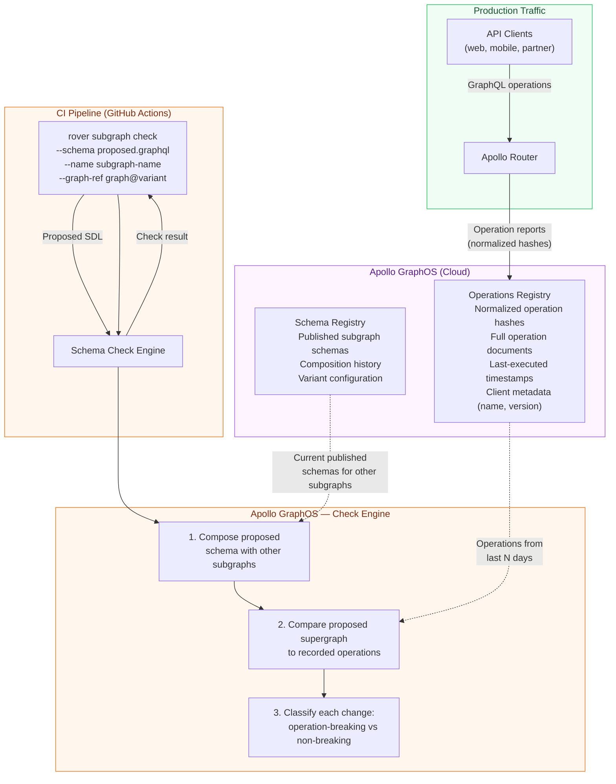

# Breaking Change Detection — rover subgraph check and the Operations Registry

> A field removal is only truly breaking if a client still uses it. rover subgraph check knows the difference because it consults the operations registry — a record of every distinct operation executed against your graph in the past seven days. Blocking a schema change based on real traffic data, not structural analysis alone, is the difference between a governance process that protects production and one that generates false positives until engineers start ignoring it.

---

## Learning Objectives

- [ ] Understand what the Apollo GraphOS operations registry is and how it records operations
- [ ] Run `rover subgraph check` against a real graph variant and interpret the output
- [ ] Distinguish between the four check result types: PASS, FAIL, WARN, and COMPOSITION_FAILURE
- [ ] Configure check settings: excluded clients, check window, ignored operations
- [ ] Parse `rover subgraph check` JSON output in a CI script to extract specific change details
- [ ] Understand usage-aware breaking change detection and why it reduces false positives
- [ ] Know when rover subgraph check is insufficient and when to supplement with GraphQL Inspector

---

## Overview

Every time a GraphQL operation executes against an Apollo-instrumented graph, Apollo Router reports the operation to Apollo GraphOS. GraphOS normalizes the operation (strips whitespace, sorts fields, replaces literal values with variable placeholders) and records the normalized hash alongside the full operation document. Over time, the operations registry accumulates a map of every distinct query, mutation, and subscription that any client has executed.

When you run `rover subgraph check`, Apollo GraphOS does not perform a simple structural SDL diff. It performs a semantics-aware check: for each recorded operation in the check window, it asks "would this operation be valid against the proposed schema?" A field removal that no operation references produces a warning, not a failure. A field removal that five operations reference fails the check, and the check output names each affected operation.

This is a fundamentally different approach from structural diffing tools. It eliminates the category of false positive that makes schema governance processes unworkable: blocking a removal because the field exists in the SDL, even though it has had no traffic for eighteen months.

The trade-off is that the operations registry is only as complete as your instrumentation. Operations from unmonitored clients — mobile apps that call a non-Apollo endpoint, partner integrations using a different HTTP client, admin tools that bypass the router — may not appear in the registry. The check window (typically seven days) also means that infrequently-run operations (monthly batch jobs, quarterly reports) may not appear during any given check even though they are still in use.

A mature validation pipeline uses rover subgraph check as the primary gate for usage-aware detection, supplemented by GraphQL Inspector's structural analysis for fast local feedback and coverage analysis for identifying genuinely unused fields.

---

## Architecture



---

## Core Concepts

### The Operations Registry in Detail

Apollo GraphOS records operations from clients via the Apollo usage reporting protocol. Apollo Router sends operation reports automatically. Apollo Server with the `@apollo/usage-reporting` plugin also sends reports. Clients using Apollo Client with the Apollo Link infrastructure report operations at the client level.

Each operation report contains:
- The normalized query hash (a SHA-256 of the normalized query string)
- The full normalized operation document
- The operation name (if named)
- The client name and client version (from `apollo-client-name` and `apollo-client-version` HTTP headers)
- The HTTP response code
- Whether the operation errored

The normalization step is critical. Two operations that are structurally identical but differ only in whitespace, comment text, or field order produce the same hash and are counted as a single operation. This prevents the registry from accumulating thousands of effectively-duplicate entries from clients that dynamically construct queries.

### The Check Window

By default, rover subgraph check consults operations from the last seven days. You can configure the check window in Apollo GraphOS under your graph's check settings. A longer window catches infrequent operations (monthly batch jobs) but also includes operations from clients that may have been retired. A shorter window reduces false positives from retired clients but may miss infrequent-but-critical operations.

**Recommendation**: Use a 30-day window for production checks. Use a 7-day window for staging checks where you want faster feedback on schema iteration.

### Usage-Aware vs Structural Breaking Changes

The following table illustrates the difference between what a structural tool (GraphQL Inspector) and rover subgraph check report for the same schema change:

| Schema Change | GraphQL Inspector | rover subgraph check (if field has zero traffic) | rover subgraph check (if field has active traffic) |
|---------------|-------------------|--------------------------------------------------|-----------------------------------------------------|
| `User.legacyId` field removed | BREAKING | WARN (no operations affected) | FAIL (N operations affected, lists each) |
| `User.email` type: `String` → `String!` | DANGEROUS | WARN | FAIL if operations use the field |
| `User.displayName` field added | SAFE | PASS | PASS |
| `CreateUserInput.phone` becomes required | BREAKING | WARN (no operations affected) | FAIL if operations use the mutation |

---

## rover subgraph check — Complete Usage

### Prerequisites

```bash
# Install rover CLI
curl -sSL https://rover.apollo.dev/nix/latest | sh

# Authenticate with Apollo GraphOS
rover config auth
# Prompts for your Apollo Studio API key
# API key must have the "Schema Checks: Run" permission

# Verify authentication
rover config list
```

### Basic Check

```bash
# Run a check against the staging variant
rover subgraph check my-graph@staging \
  --schema ./schema.graphql \
  --name products-subgraph

# Output (success):
# ✔ Fetching check result from Apollo Studio...
#
# Schema check results for subgraph 'products-subgraph' → 'my-graph@staging'
# ┌─────────────────────────────────────────────────────────┐
# │ Check Summary                                           │
# ├─────────────────────┬───────────────────────────────────┤
# │ Composition:        │ ✔ Passed                          │
# │ Operation Checks:   │ ✔ Passed (0 affected operations)  │
# └─────────────────────┴───────────────────────────────────┘

# Output (failure):
# ✖ Schema check failed
#
# BREAKING: Field 'User.legacyId' was removed
#   Affected operations:
#   - GetUserLegacyId (clients: ios-app v2.1, android-app v3.4)
#   - AdminUserExport (clients: internal-admin v1.0)
```

### JSON Output for CI Parsing

```bash
# Get full check results as JSON
rover subgraph check my-graph@staging \
  --schema ./schema.graphql \
  --name products-subgraph \
  --format json

# JSON structure (simplified):
# {
#   "data": {
#     "composition": {
#       "checkSchemaResult": {
#         "diffToPrevious": {
#           "changes": [
#             {
#               "description": "Field 'User.legacyId' was removed",
#               "severity": "FAILURE",
#               "affectedClients": [
#                 {"name": "ios-app", "version": "2.1"}
#               ],
#               "affectedQueries": [
#                 {"name": "GetUserLegacyId", "body": "query GetUserLegacyId { user { legacyId } }"}
#               ]
#             }
#           ]
#         }
#       }
#     }
#   }
# }
```

### Complete CI Script with Result Parsing

```yaml
# .github/workflows/schema-check.yml
name: Schema Check

on:
  pull_request:
    paths:
      - 'schema.graphql'
      - 'src/**/*.graphql'

env:
  GRAPH_REF: my-graph@staging
  SUBGRAPH_NAME: products-subgraph

jobs:
  schema-check:
    name: rover subgraph check
    runs-on: ubuntu-latest

    steps:
      - uses: actions/checkout@v4

      - name: Install rover CLI
        run: |
          curl -sSL https://rover.apollo.dev/nix/latest | sh
          echo "$HOME/.rover/bin" >> $GITHUB_PATH

      - name: Run schema check
        id: schema-check
        env:
          APOLLO_KEY: ${{ secrets.APOLLO_KEY }}
        run: |
          set +e  # Do not exit immediately on non-zero exit code

          RESULT=$(rover subgraph check ${{ env.GRAPH_REF }} \
            --schema schema.graphql \
            --name ${{ env.SUBGRAPH_NAME }} \
            --format json 2>&1)

          ROVER_EXIT_CODE=$?
          echo "exit_code=$ROVER_EXIT_CODE" >> $GITHUB_OUTPUT

          # Write result to file for later steps
          echo "$RESULT" > check-result.json

          # Parse and display breaking changes
          echo "=== Schema Check Result ==="
          echo "$RESULT" | jq -r '
            .data.composition.checkSchemaResult.diffToPrevious.changes[]?
            | select(.severity == "FAILURE")
            | "BREAKING: " + .description
          ' || true

          echo "=== Affected Operations ==="
          echo "$RESULT" | jq -r '
            .data.composition.checkSchemaResult.diffToPrevious.changes[]?
            | select(.severity == "FAILURE")
            | .affectedQueries[]?
            | "  - " + .name + " (" + .body[0:80] + "...)"
          ' || true

          # Check for composition failures (different from operation check failures)
          COMPOSITION_ERRORS=$(echo "$RESULT" | jq -r '
            .data.composition.compositionErrors[]?.message // empty
          ' 2>/dev/null)

          if [ -n "$COMPOSITION_ERRORS" ]; then
            echo "=== Composition Errors ==="
            echo "$COMPOSITION_ERRORS"
          fi

          # Re-exit with rover's exit code
          exit $ROVER_EXIT_CODE

      - name: Extract check summary for PR comment
        if: always()
        id: extract-summary
        run: |
          if [ ! -f check-result.json ]; then
            echo "summary=Schema check did not produce output." >> $GITHUB_OUTPUT
            exit 0
          fi

          # Count changes by severity
          BREAKING_COUNT=$(jq '[.data.composition.checkSchemaResult.diffToPrevious.changes[]? | select(.severity == "FAILURE")] | length' check-result.json 2>/dev/null || echo 0)
          WARNING_COUNT=$(jq '[.data.composition.checkSchemaResult.diffToPrevious.changes[]? | select(.severity == "WARNING")] | length' check-result.json 2>/dev/null || echo 0)

          SUMMARY="**Breaking:** $BREAKING_COUNT changes | **Warnings:** $WARNING_COUNT changes"
          echo "summary=$SUMMARY" >> $GITHUB_OUTPUT
          echo "breaking_count=$BREAKING_COUNT" >> $GITHUB_OUTPUT

      - name: Post PR comment with check result
        if: always() && github.event_name == 'pull_request'
        uses: actions/github-script@v7
        with:
          script: |
            const fs = require('fs');
            const summary = '${{ steps.extract-summary.outputs.summary }}';
            const exitCode = '${{ steps.schema-check.outputs.exit_code }}';
            const status = exitCode === '0' ? '✅ Passed' : '❌ Failed';

            let body = `## rover subgraph check — ${status}\n\n${summary}\n\n`;

            try {
              const result = JSON.parse(fs.readFileSync('check-result.json', 'utf8'));
              const changes = result?.data?.composition?.checkSchemaResult
                ?.diffToPrevious?.changes || [];

              const breaking = changes.filter(c => c.severity === 'FAILURE');
              if (breaking.length > 0) {
                body += '### Breaking Changes\n\n';
                breaking.forEach(change => {
                  body += `- **${change.description}**\n`;
                  if (change.affectedQueries?.length > 0) {
                    body += `  - Affected operations: ${change.affectedQueries.map(q => q.name).join(', ')}\n`;
                  }
                });
                body += '\n';
              }

              const compositionErrors = result?.data?.composition?.compositionErrors || [];
              if (compositionErrors.length > 0) {
                body += '### Composition Errors\n\n';
                compositionErrors.forEach(err => {
                  body += `- ${err.message}\n`;
                });
                body += '\n';
              }
            } catch (e) {
              body += '_Could not parse check result JSON._\n\n';
            }

            body += `---\n*[View in Apollo GraphOS](https://studio.apollographql.com/graph/${{ env.GRAPH_REF }}/checks)*\n`;

            // Upsert comment
            const marker = '<!-- rover-schema-check -->';
            const fullBody = marker + '\n' + body;

            const { data: comments } = await github.rest.issues.listComments({
              owner: context.repo.owner,
              repo: context.repo.repo,
              issue_number: context.issue.number,
            });

            const existing = comments.find(c => c.body.includes(marker));

            if (existing) {
              await github.rest.issues.updateComment({
                owner: context.repo.owner,
                repo: context.repo.repo,
                comment_id: existing.id,
                body: fullBody,
              });
            } else {
              await github.rest.issues.createComment({
                owner: context.repo.owner,
                repo: context.repo.repo,
                issue_number: context.issue.number,
                body: fullBody,
              });
            }

      - name: Fail if breaking changes detected
        if: steps.schema-check.outputs.exit_code != '0'
        run: |
          echo "Schema check failed. Breaking changes or composition errors were detected."
          echo "See the PR comment and Apollo GraphOS for details."
          exit 1
```

---

## Configuring Check Settings

Check settings are configured per variant in Apollo GraphOS Studio under the "Checks" tab.

### Excluding Clients

Some clients are not representative of production traffic and should be excluded from check analysis. Common examples:

- Load testing clients that run synthetic operations not used by real users
- Internal admin tools that use fields in ways the public API should not care about
- Deprecated client versions that you know will be sunset before the schema change ships

```yaml
# apollo.config.yml (if using Apollo VS Code extension or local config)
service:
  name: my-graph
  localSchemaFile: ./schema.graphql

checks:
  # Exclude these client names from breaking change analysis
  excludedClients:
    - name: load-testing-client
    - name: admin-tool
      version: 1.0  # Exclude only this version

  # How many days of traffic to consider
  validationPeriod: P7D  # ISO 8601 duration: 7 days

  # Threshold for considering a change breaking:
  # Only fail if the change affects more than 0% of operations
  # (setting to 5% would ignore changes that affect < 5% of operations)
  breakingChangeThreshold:
    requestCountThreshold: 1  # Fail if any operation is affected
```

In Apollo GraphOS Studio (UI), navigate to your graph → Settings → Checks and configure:

- **Check period**: 7, 14, or 30 days
- **Excluded clients**: client name patterns to ignore
- **Threshold**: whether to fail on any affected operation or only above a traffic threshold

### Ignoring Specific Operations

If a specific operation is known to be deprecated and you accept that it will break, you can mark it as excluded in the Studio UI or via the Checks API. This is a one-time exception, not a permanent exclusion — the operation remains in the registry but is excluded from this check run.

---

## Check Result Types

| Result | Meaning | CI Action |
|--------|---------|-----------|
| **PASS** | No operations in the registry are affected by the proposed schema changes | Allow merge |
| **FAIL** | One or more recorded operations would fail against the proposed schema | Block merge |
| **WARN** | Schema changes detected but no operations affected (structural breaking but zero usage) | Allow merge, log warning |
| **COMPOSITION_FAILURE** | The proposed schema does not compose with other subgraphs | Block merge immediately — this is a federated integration error, not just an operation check failure |

The WARN result is particularly important to understand. It means: "This is a breaking change according to the GraphQL specification, but our operations registry shows no client has executed an operation that references the changed field in the past check window. We are allowing this change but flagging it for your awareness."

---

## Local Validation Without Apollo GraphOS

For teams using self-hosted federation or non-Apollo schema registries, rover subgraph check is not available. The alternative is to combine GraphQL Inspector's structural diffing with your own operation document collection.

```bash
# Step 1: Collect operation documents from your clients
# (this is a manual or automated process depending on your setup)

# Step 2: Validate all collected operations against the proposed schema
npx @graphql-inspector/cli validate \
  './collected-operations/**/*.graphql' \
  --schema proposed-schema.graphql

# Step 3: Generate a diff to identify structural breaking changes
npx @graphql-inspector/cli diff \
  current-schema.graphql \
  proposed-schema.graphql

# Step 4: Correlate: which structural breaking changes appear in collected operations?
# This is the manual step that rover automates
```

This approach is labor-intensive and error-prone because collecting operation documents from all clients is difficult. The operations registry's automated approach via usage reporting is significantly more reliable for large ecosystems.

---

## Production Considerations

### Performance

rover subgraph check makes an API call to Apollo GraphOS and typically completes in 5-30 seconds depending on the size of the operations registry and the number of changes being analyzed. This is acceptable in a CI pipeline but is too slow for a tight local development loop. Use GraphQL Inspector locally and reserve rover subgraph check for PR-level CI.

### Security

The `APOLLO_KEY` environment variable must be treated as a secret. This key authorizes writing schema checks to Apollo GraphOS. Use it only from CI; never commit it to source control or log it.

The key should have minimal permissions: "Schema Checks: Run" is sufficient. Do not use a key with "Publish Schema" permissions for the check job — the check job should not be able to publish schema.

### Scaling

In a large monorepo with many subgraphs, rover subgraph check runs for every subgraph whose schema changes in a PR. Use path filters in your GitHub Actions workflow to only run the check for subgraphs whose files have changed:

```yaml
on:
  pull_request:
    paths:
      - 'subgraphs/products/**'
```

And in the workflow, parameterize the subgraph name and check the appropriate schema:

```yaml
env:
  SUBGRAPH_NAME: products
  SCHEMA_PATH: subgraphs/products/schema.graphql
```

### Observability

Track check failure rates over time. A high failure rate indicates either that the schema governance process is producing too many breaking changes, or that client teams are not running checks locally before pushing. Both are signals that the developer experience needs improvement.

---

## Best Practices

1. **Configure a 30-day check window for production variants.** Seven days will miss monthly batch jobs, partner integrations that run weekly reports, and clients that have low traffic but are nonetheless critical. The 30-day window catches significantly more real usage.

2. **Exclude load-testing clients from checks.** Load testing tools often run synthetic operations that explore the full schema surface. Including them in the operations registry will cause rover subgraph check to flag removals as breaking even for fields that no real client uses.

3. **Do not solely rely on the check window to detect infrequent operations.** Supplement with a static inventory of known critical operations. Maintain an `operations/critical/` directory containing operation documents for batch jobs, partner integrations, and admin tools that may not run during every check window.

4. **Treat COMPOSITION_FAILURE differently from FAIL.** A composition failure means the subgraph's schema cannot be integrated into the supergraph. This is a more severe error than a breaking change for clients — it means the entire router cannot be updated. Fix composition errors before investigating operation check failures.

5. **Run rover subgraph check in PR checks, not just on merge.** The purpose of the check is to block the merge, not to detect the problem after it is already in the main branch. The check should be a required GitHub status check that must pass before the PR can be merged.

6. **Archive check result JSON as GitHub Actions artifacts.** For audit trails and incident response, store the full JSON output of every check run. When a breaking change reaches production, you need to know why the check passed — was the field genuinely unused at check time, or did the check fail and someone bypassed it?

---

## Anti-Patterns

**Bypassing the check by passing `--ignore-breaking-changes`.** Rover does not have this flag (intentionally), but teams sometimes work around the check by deleting the check job from the workflow or marking it as a non-required status check. If the governance process has too many false positives (blocking changes that are safe in practice), the correct response is to configure check settings (exclude clients, use usage-based thresholds) rather than bypass the check entirely.

**Using a short check window to get a check to pass.** Reducing the check window to one day so that a "stale" field's operations have aged out of the window is a dangerous practice. It will cause rover subgraph check to approve changes that break real clients who have not made a request in the last 24 hours.

**Not instrumenting all clients.** An operations registry is only as complete as the clients that report to it. A team that manually calls the GraphQL API without Apollo Client, or routes through a proxy that does not forward usage reporting, will not appear in the registry. Their operations will not protect their queries from being broken.

**Running the check only on the staging variant.** Production and staging diverge over time. A field that has no traffic on staging may have active traffic on production. Always run checks against the production variant for production-bound changes.

---

## Operational Notes

- The `APOLLO_KEY` environment variable is the only required secret for rover subgraph check. The `GRAPH_REF` (e.g., `my-graph@staging`) must match a variant that exists in your Apollo GraphOS organization.
- rover subgraph check does not modify anything. It is a read-only operation that consults the schema and operations registries and returns a result. It is safe to run on any branch.
- If Apollo GraphOS is experiencing an outage, rover subgraph check will fail with a network error. Configure your CI workflow with `continue-on-error: true` on the check step if you want the pipeline to continue during Apollo GraphOS outages, or treat the outage as a check failure (the safer option).
- The `--format json` flag changed its output structure between rover major versions. Pin your rover version in CI and test after upgrading.

---

## References

- [rover subgraph check documentation](https://www.apollographql.com/docs/rover/commands/subgraphs/#subgraph-check) — official rover CLI reference for the check command, all flags, and output format
- [Apollo GraphOS Schema Checks](https://www.apollographql.com/docs/graphos/schema-checks/) — conceptual documentation on how the operations registry and usage-aware checks work
- [Apollo usage reporting protocol](https://www.apollographql.com/docs/apollo-server/api/plugin/usage-reporting/) — how to configure Apollo Server to report operations to the registry, and what data is reported

---

## Related Topics

- [01-graphql-inspector.md](./01-graphql-inspector.md) — structural schema diffing for fast local feedback without the operations registry
- [03-linting.md](./03-linting.md) — graphql-eslint for schema style enforcement before the check runs
- [11-ci-cd-automation/02-schema-promotion.md](../11-ci-cd-automation/02-schema-promotion.md) — multi-environment check and publish pipeline using rover
