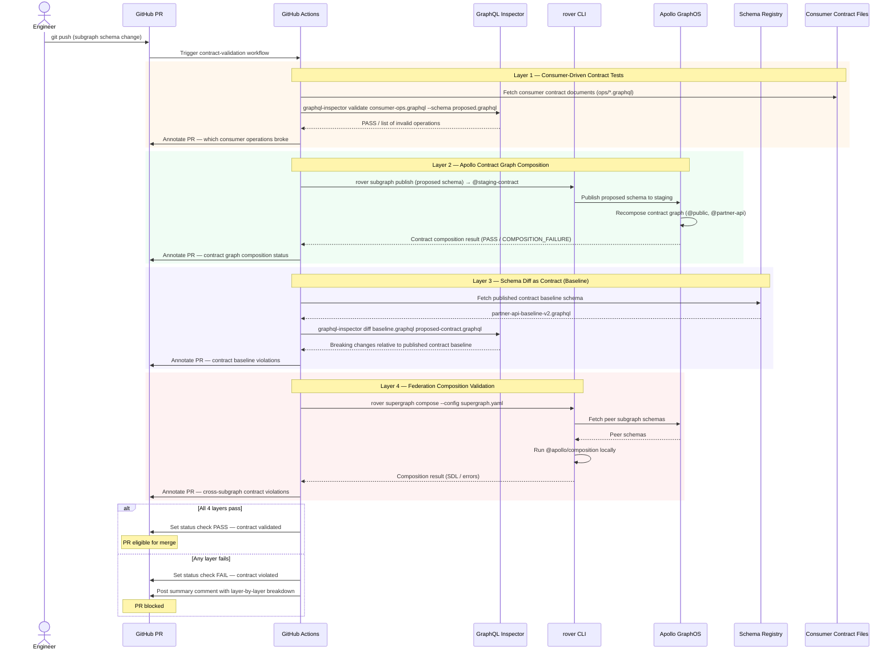

# Contract Validation — Consumer-Driven Contracts, Apollo Contract Graphs, and Federation Composition as Contract

> Schema change detection tells you whether a change is structurally safe. Contract validation tells you whether it honors the promises you have explicitly made to each consuming team. These are different questions, and a mature platform team answers both. A supergraph that composes cleanly and passes all operation checks can still violate a contract: the products team may have promised the mobile client a specific subset of the schema that is now missing a field.

---

## Learning Objectives

- [ ] Understand the distinction between schema validation (structural) and contract validation (promise-based)
- [ ] Implement consumer-driven contract testing using GraphQL-specific tooling
- [ ] Configure Apollo contract graphs using `@tag` and `@inaccessible` directives
- [ ] Validate federation composition as a contract gate in CI
- [ ] Run schema diff as contract enforcement using GraphQL Inspector's `similar` and `validate` commands
- [ ] Design a CI pipeline that runs all four contract validation layers before allowing merge
- [ ] Interpret contract validation failures and route them to the correct owning team

---

## Overview

Contract validation is the practice of verifying that a provider (a subgraph or supergraph) continues to honor explicit agreements with its consumers. In a GraphQL context, a consumer is any client, partner system, or downstream team that depends on specific fields, types, or behaviors of the graph. The agreement — the contract — is an explicit, versioned artifact, not an implicit assumption.

There are three distinct layers of contract validation in a federated GraphQL platform:

**Layer 1 — Consumer-Driven Contract Tests**: Each consumer team owns a file that describes the operations they depend on. The provider runs these operations against the schema on every change and fails the pipeline if any operation is no longer valid. This is the Pact model adapted to GraphQL.

**Layer 2 — Apollo Contract Graphs**: Apollo GraphOS supports tagged contract graphs: a filtered view of the supergraph that exposes only the fields tagged for a specific consumer group (e.g., `@tag(name: "public")`, `@tag(name: "partner-api")`). The composition of a contract graph is itself a validation step — if the contract graph fails to compose or is missing expected types, the contract is broken.

**Layer 3 — Schema Diff as Contract**: Structural diffing (GraphQL Inspector) applied not just to "is this backward-compatible" but to "does this schema still satisfy the contract spec defined in a previous baseline?" This is useful for partner API contracts where you publish a versioned schema document and must not deviate from it.

**Layer 4 — Federation Composition Validation**: Composition itself is a form of contract. A subgraph that extends a type from another subgraph has implicitly contracted that the extended type exists and has the key fields it depends on. Composition failure is a contract violation between subgraphs.

---

## Architecture

### Contract Validation Flow in CI



---

## Core Concepts

### Consumer-Driven Contracts in GraphQL

The consumer-driven contract (CDC) pattern originates from REST API testing via Pact. In GraphQL, the equivalent is: each consumer team maintains a set of operation documents that represent their actual queries. The provider team's CI pipeline validates that every consumer operation remains executable against the current schema.

This is structurally different from the Apollo operations registry approach. The operations registry tracks what clients have executed recently. Consumer contracts track what clients depend on architecturally — including infrequently-run operations (batch jobs, disaster-recovery queries) and future operations the client team is building.

The contract document for a consumer typically lives in the provider's repository and is maintained by the consumer team via pull request. This creates an explicit communication channel: when a consumer team adds a new operation they depend on, they open a PR to the provider's repository. When the provider removes a field, the contract document fails validation before any code ships.

### Apollo Contract Graphs

Apollo GraphOS supports "contract graphs" — variants of a supergraph that expose only fields tagged with specific directives. A field tagged `@tag(name: "public")` appears in the `@public` contract variant. A field tagged `@tag(name: "partner-api")` appears in the `@partner-api` contract variant. Fields not tagged for a contract are automatically marked `@inaccessible` in that contract's composed schema.

Contract graphs address a real problem: large organizations have a public API, partner APIs, and internal APIs — all served by the same supergraph — but each audience should see only the fields intended for them. Contract graphs make this explicit and validated by the composition process.

When a schema change causes a tagged field to no longer compose correctly in a contract variant, the contract variant fails composition. This is caught in CI before the change reaches any environment.

### Schema Diff as Contract (Baseline Comparison)

For partner API contracts where you have published a specific schema version to external consumers, the validation question is: "Does the proposed schema represent a backward-compatible evolution of the baseline I published to partners?"

This is answered by running GraphQL Inspector's diff between the published partner contract baseline and the proposed contract schema. Any breaking changes are contract violations, regardless of whether those fields are used in the operations registry.

The baseline is treated as a versioned artifact — stored in a schema registry (Apollo GraphOS, GraphQL Hive, or a Git tag) and referenced explicitly by version in CI.

### Federation Composition as Contract

In a federated graph, each subgraph that extends a type from another subgraph has a dependency on that type's keys. The `@key` directive creates a contract:

```graphql
# users subgraph: declares User has a key "id"
type User @key(fields: "id") {
  id: ID!
  email: String!
}

# reviews subgraph: depends on User having key "id"
type Review {
  author: User
}

extend type User @key(fields: "id") {
  reviews: [Review!]!
}
```

If the users subgraph removes `@key(fields: "id")` from `User`, the reviews subgraph can no longer extend it. Composition fails. This failure is a contract violation: the reviews subgraph team contracted that users would maintain that key. `rover supergraph compose` enforces this contract locally before any schema is published.

---

## Layer 1 — Consumer-Driven Contract Tests

### Repository Structure for Contract Documents

```
my-graph/
├── contracts/
│   ├── README.md                     # How to add a contract
│   ├── ios-app/
│   │   ├── contract.yaml             # Consumer metadata
│   │   └── operations/
│   │       ├── GetUserProfile.graphql
│   │       ├── SearchProducts.graphql
│   │       └── CreateOrder.graphql
│   ├── android-app/
│   │   ├── contract.yaml
│   │   └── operations/
│   │       ├── GetUserProfile.graphql
│   │       └── GetOrderHistory.graphql
│   └── partner-retailer/
│       ├── contract.yaml
│       └── operations/
│           ├── GetProductCatalog.graphql
│           └── QueryInventory.graphql
```

### Consumer Contract Metadata File

```yaml
# contracts/ios-app/contract.yaml
consumer:
  name: ios-app
  team: mobile-platform
  slack: "#mobile-platform-graphql"
  criticality: critical            # critical | standard | low
  notification:
    on_break: "@mobile-platform-oncall"
    channel: "#mobile-platform-alerts"

schema_tags:
  - public                         # This consumer depends on the @public contract graph

check_window_override: 90d         # ios has infrequent releases; check 90 days of operations

# Operations this consumer owns; validated against the supergraph schema
operation_files:
  - operations/*.graphql
```

### Consumer Operation Documents

```graphql
# contracts/ios-app/operations/GetUserProfile.graphql
# Consumer: ios-app
# Owner: mobile-platform
# Last updated: 2026-03-10
# Description: Displayed on the user profile screen (every session start)

query GetUserProfile($userId: ID!) {
  user(id: $userId) {
    id
    displayName
    email
    avatarUrl
    preferences {
      theme
      notificationsEnabled
      defaultCurrency
    }
    recentOrders(limit: 5) {
      id
      status
      totalAmount {
        value
        currency
      }
      createdAt
    }
  }
}
```

```graphql
# contracts/ios-app/operations/SearchProducts.graphql
# Consumer: ios-app
# Owner: mobile-platform
# Description: Product search screen — runs on every search keystroke (debounced)

query SearchProducts($query: String!, $filters: ProductFilterInput, $after: String) {
  searchProducts(query: $query, filters: $filters, after: $after) {
    edges {
      node {
        id
        name
        slug
        priceRange {
          min { value currency }
          max { value currency }
        }
        primaryImage {
          url
          altText
          width
          height
        }
        rating {
          average
          count
        }
        inStock
      }
      cursor
    }
    pageInfo {
      hasNextPage
      endCursor
    }
    totalCount
  }
}
```

### Validating Consumer Operations in CI

```bash
# Validate all consumer operation documents against the proposed schema
# GraphQL Inspector validates that every operation is syntactically and semantically
# valid against the target schema (all referenced fields exist, types match, etc.)

npx @graphql-inspector/cli validate \
  'contracts/ios-app/operations/**/*.graphql' \
  --schema proposed-supergraph.graphql

# Example output (success):
# ✔ contracts/ios-app/operations/GetUserProfile.graphql (valid)
# ✔ contracts/ios-app/operations/SearchProducts.graphql (valid)
# ✔ contracts/ios-app/operations/CreateOrder.graphql (valid)

# Example output (failure):
# ✖ contracts/ios-app/operations/GetUserProfile.graphql
#   Error: Cannot query field "recentOrders" on type "User". (3:5)
#
#   2 |   user(id: $userId) {
#   3 |     recentOrders(limit: 5) {
#         ^
```

```yaml
# .github/workflows/contract-validation.yml — Layer 1 job
  validate-consumer-contracts:
    name: "Layer 1 — Consumer-Driven Contract Tests"
    runs-on: ubuntu-latest
    needs: compose-supergraph   # Requires the proposed supergraph to be built first

    steps:
      - uses: actions/checkout@v4

      - uses: actions/setup-node@v4
        with:
          node-version: '20'
          cache: 'npm'

      - run: npm ci

      - name: Download proposed supergraph schema
        uses: actions/download-artifact@v4
        with:
          name: proposed-supergraph
          path: .

      - name: Validate all consumer contracts
        id: contract-validate
        run: |
          set +e
          FAILED_CONSUMERS=()
          ALL_RESULTS=""

          for contract_dir in contracts/*/; do
            CONSUMER=$(basename "$contract_dir")
            CONTRACT_YAML="$contract_dir/contract.yaml"
            OPS_DIR="$contract_dir/operations"

            if [ ! -d "$OPS_DIR" ]; then
              echo "No operations directory for $CONSUMER, skipping"
              continue
            fi

            echo "=== Validating consumer: $CONSUMER ==="

            OUTPUT=$(npx @graphql-inspector/cli validate \
              "${OPS_DIR}/**/*.graphql" \
              --schema supergraph-proposed.graphql \
              --format json 2>&1)

            VALIDATE_EXIT=$?

            if [ $VALIDATE_EXIT -ne 0 ]; then
              FAILED_CONSUMERS+=("$CONSUMER")
              echo "FAILED: $CONSUMER"
              echo "$OUTPUT"
            else
              echo "PASSED: $CONSUMER"
            fi

            # Collect results for PR comment
            ALL_RESULTS="$ALL_RESULTS\n### $CONSUMER\n\`\`\`\n$OUTPUT\n\`\`\`\n"
          done

          # Store results for PR comment step
          printf "$ALL_RESULTS" > contract-results.txt
          echo "failed_consumers=${FAILED_CONSUMERS[*]}" >> $GITHUB_OUTPUT

          if [ ${#FAILED_CONSUMERS[@]} -gt 0 ]; then
            echo "CONTRACT VALIDATION FAILED for: ${FAILED_CONSUMERS[*]}"
            exit 1
          fi

      - name: Post contract validation summary to PR
        if: always() && github.event_name == 'pull_request'
        uses: actions/github-script@v7
        with:
          script: |
            const fs = require('fs');
            const failedConsumers = '${{ steps.contract-validate.outputs.failed_consumers }}'.trim();
            const status = failedConsumers.length === 0 ? '✅ All contracts satisfied' : '❌ Contract violations detected';

            let body = `<!-- contract-validation-layer1 -->\n## Consumer-Driven Contract Validation — ${status}\n\n`;

            if (failedConsumers.length > 0) {
              body += `**Failing consumers:** ${failedConsumers}\n\n`;
              body += '> These consumer teams depend on fields that no longer exist in the proposed schema.\n';
              body += '> You must either:\n';
              body += '> 1. Keep the removed fields (deprecate instead of remove), or\n';
              body += '> 2. Coordinate with the consumer team to update their contract and client code.\n\n';
            }

            try {
              const results = fs.readFileSync('contract-results.txt', 'utf8');
              body += '<details><summary>Detailed validation output</summary>\n\n' + results + '\n</details>\n';
            } catch(e) {}

            const { data: comments } = await github.rest.issues.listComments({
              owner: context.repo.owner, repo: context.repo.repo,
              issue_number: context.issue.number,
            });
            const existing = comments.find(c => c.body.includes('<!-- contract-validation-layer1 -->'));
            const method = existing ? 'updateComment' : 'createComment';
            const args = existing
              ? { owner: context.repo.owner, repo: context.repo.repo, comment_id: existing.id, body }
              : { owner: context.repo.owner, repo: context.repo.repo, issue_number: context.issue.number, body };
            await github.rest.issues[method](args);
```

---

## Layer 2 — Apollo Contract Graphs

### Tagging the Supergraph Schema

Contract graphs are built by tagging fields in the subgraph schemas. Tags propagate through composition to the supergraph.

```graphql
# subgraphs/products/schema.graphql

extend schema
  @link(url: "https://specs.apollo.dev/federation/v2.6", import: ["@key", "@tag", "@inaccessible"])

type Query {
  # Available to all audiences — tagged for both public and partner
  product(id: ID!): Product @tag(name: "public") @tag(name: "partner-api")

  # Available only to internal consumers — no public/partner tag
  productAdminDetails(id: ID!): ProductAdminDetails

  # Partner-only catalog endpoint
  bulkProductCatalog(skus: [String!]!): [Product!]! @tag(name: "partner-api")
}

type Product @key(fields: "id") @tag(name: "public") @tag(name: "partner-api") {
  id: ID!
  name: String! @tag(name: "public") @tag(name: "partner-api")
  slug: String! @tag(name: "public") @tag(name: "partner-api")
  description: String @tag(name: "public") @tag(name: "partner-api")

  # Public pricing
  price: Money! @tag(name: "public") @tag(name: "partner-api")

  # Partner-only cost data — not exposed publicly
  costPrice: Money! @tag(name: "partner-api")
  supplierSku: String @tag(name: "partner-api")

  # Internal only — no tags on these fields
  internalNotes: String
  vendorId: ID

  # Image data for display
  primaryImage: Image @tag(name: "public") @tag(name: "partner-api")
  images: [Image!]! @tag(name: "public") @tag(name: "partner-api")

  # Availability
  inStock: Boolean! @tag(name: "public") @tag(name: "partner-api")
  stockCount: Int @tag(name: "partner-api")   # Partners need this; public doesn't
}

type Money @tag(name: "public") @tag(name: "partner-api") {
  value: Float!
  currency: String!
}

type Image @tag(name: "public") @tag(name: "partner-api") {
  url: String!
  altText: String
  width: Int
  height: Int
}

# Internal type — not tagged for any contract; @inaccessible in all contract graphs
type ProductAdminDetails {
  productId: ID!
  fraudFlags: [String!]!
  reviewQueueStatus: String!
}
```

### Contract Graph Configuration in Apollo GraphOS

Contract graphs are configured in Apollo GraphOS Studio under Graphs → Contracts (or via the Contracts API). Each contract specifies which tags to include and which to exclude.

```yaml
# This configuration is set in Apollo GraphOS Studio UI or via the GraphOS Platform API.
# Shown here for documentation — there is no local file equivalent.

# Contract: public-api
# Variant: my-graph@public-api
includeTags:
  - public
excludeTags: []   # Everything not tagged @public is excluded

# Contract: partner-api
# Variant: my-graph@partner-api
includeTags:
  - partner-api
excludeTags: []

# Fields tagged @inaccessible are always excluded from all contract graphs,
# regardless of other tags.
```

### Verifying Contract Graph Composition in CI

```yaml
# .github/workflows/contract-validation.yml — Layer 2 job
  validate-contract-graph-composition:
    name: "Layer 2 — Apollo Contract Graph Composition"
    runs-on: ubuntu-latest
    needs: compose-supergraph

    steps:
      - uses: actions/checkout@v4

      - name: Install rover CLI
        run: |
          curl -sSL https://rover.apollo.dev/nix/latest | sh
          echo "$HOME/.rover/bin" >> $GITHUB_PATH

      - name: Publish proposed schema to contract-check variant
        env:
          APOLLO_KEY: ${{ secrets.APOLLO_KEY }}
        run: |
          # Publish to a dedicated "contract-check" staging variant
          # This variant triggers automatic recomposition of all contract graphs
          rover subgraph publish my-graph@contract-check \
            --schema ${{ env.SCHEMA_PATH }} \
            --name ${{ env.SUBGRAPH_NAME }} \
            --routing-url http://products.internal/graphql

      - name: Wait for contract graph recomposition
        run: sleep 20

      - name: Fetch and verify public-api contract graph
        id: verify-public
        env:
          APOLLO_KEY: ${{ secrets.APOLLO_KEY }}
        run: |
          set +e

          # Fetch the composed public-api contract schema
          rover subgraph introspect my-graph@public-api \
            --format json > public-api-schema.json 2>&1
          FETCH_EXIT=$?

          if [ $FETCH_EXIT -ne 0 ]; then
            echo "public_api_status=COMPOSITION_FAILURE" >> $GITHUB_OUTPUT
            echo "ERROR: public-api contract graph failed to compose:"
            cat public-api-schema.json
            exit 1
          fi

          echo "public_api_status=PASS" >> $GITHUB_OUTPUT
          echo "public-api contract graph composed successfully"

      - name: Fetch and verify partner-api contract graph
        id: verify-partner
        env:
          APOLLO_KEY: ${{ secrets.APOLLO_KEY }}
        run: |
          set +e

          rover subgraph introspect my-graph@partner-api \
            --format json > partner-api-schema.json 2>&1
          FETCH_EXIT=$?

          if [ $FETCH_EXIT -ne 0 ]; then
            echo "partner_api_status=COMPOSITION_FAILURE" >> $GITHUB_OUTPUT
            cat partner-api-schema.json
            exit 1
          fi

          echo "partner_api_status=PASS" >> $GITHUB_OUTPUT

      - name: Verify expected types exist in contract graphs
        run: |
          # Contract assertion: the public-api graph MUST contain Product, Money, Image
          MISSING=""
          for TYPE in Product Money Image Query; do
            COUNT=$(jq --arg type "$TYPE" '
              .data.__schema.types[] | select(.name == $type) | .name
            ' public-api-schema.json 2>/dev/null | wc -l)

            if [ "$COUNT" -eq 0 ]; then
              MISSING="$MISSING $TYPE"
            fi
          done

          if [ -n "$MISSING" ]; then
            echo "ERROR: Types missing from public-api contract graph:$MISSING"
            exit 1
          fi

          echo "All required types present in public-api contract graph"
```

### Asserting @inaccessible Fields Are Excluded

```bash
# Verify that fields NOT tagged for the public contract are not exposed
# This is a security-critical check for multi-tenant graphs

# These fields should NOT be in the public-api contract schema
SENSITIVE_FIELDS=("costPrice" "supplierSku" "internalNotes" "vendorId" "stockCount")

for FIELD in "${SENSITIVE_FIELDS[@]}"; do
  COUNT=$(jq --arg field "$FIELD" '
    .data.__schema.types[].fields[]? | select(.name == $field) | .name
  ' public-api-schema.json 2>/dev/null | wc -l)

  if [ "$COUNT" -gt 0 ]; then
    echo "SECURITY VIOLATION: Field '$FIELD' is exposed in the public-api contract graph"
    echo "This field should be @inaccessible in the public contract."
    exit 1
  fi
done

echo "All sensitive fields correctly excluded from public-api contract graph"
```

---

## Layer 3 — Schema Diff as Contract (Baseline Comparison)

### Publishing and Pinning a Contract Baseline

When a partner API contract is published, the schema at that moment becomes a versioned baseline. All subsequent changes to the partner contract graph must be backward-compatible with this baseline.

```bash
# Publish a contract baseline — run once when a new partner contract version is ratified

# 1. Fetch the current contract graph schema
rover subgraph introspect my-graph@partner-api \
  --format sdl > partner-api-v2.0-baseline.graphql

# 2. Store the baseline in the schema registry as a tagged artifact
#    (Apollo GraphOS does not have a native "baseline" concept;
#     use a dedicated variant or store in S3/Git with a version tag)

# Store in Git with a tag:
git tag partner-api-contract-v2.0
git push origin partner-api-contract-v2.0

# Or store in S3:
aws s3 cp partner-api-v2.0-baseline.graphql \
  s3://my-org-schema-baselines/partner-api/v2.0/schema.graphql \
  --metadata "contract=partner-api,version=2.0,ratified=$(date -u +%Y-%m-%dT%H:%M:%SZ)"
```

### CI Baseline Diff Check

```yaml
# .github/workflows/contract-validation.yml — Layer 3 job
  validate-contract-baseline:
    name: "Layer 3 — Schema Diff vs Contract Baseline"
    runs-on: ubuntu-latest
    needs: validate-contract-graph-composition

    steps:
      - uses: actions/checkout@v4

      - uses: actions/setup-node@v4
        with:
          node-version: '20'
          cache: 'npm'

      - run: npm ci

      - name: Fetch published partner-api contract baseline
        env:
          AWS_ACCESS_KEY_ID: ${{ secrets.SCHEMA_BASELINE_AWS_KEY }}
          AWS_SECRET_ACCESS_KEY: ${{ secrets.SCHEMA_BASELINE_AWS_SECRET }}
          AWS_REGION: us-east-1
        run: |
          # Read the current contract version from contract manifest
          PARTNER_CONTRACT_VERSION=$(cat contracts/partner-retailer/contract.yaml | \
            grep 'baseline_version:' | awk '{print $2}' | tr -d '"')

          echo "Validating against partner-api contract baseline v${PARTNER_CONTRACT_VERSION}"
          echo "contract_version=$PARTNER_CONTRACT_VERSION" >> $GITHUB_ENV

          aws s3 cp \
            "s3://my-org-schema-baselines/partner-api/v${PARTNER_CONTRACT_VERSION}/schema.graphql" \
            partner-api-baseline.graphql

      - name: Fetch proposed partner-api contract schema
        env:
          APOLLO_KEY: ${{ secrets.APOLLO_KEY }}
        run: |
          # Fetch the contract graph schema that was recomposed in Layer 2
          rover subgraph introspect my-graph@contract-check-partner \
            --format sdl > partner-api-proposed.graphql

      - name: Run baseline diff
        id: baseline-diff
        run: |
          set +e

          npx @graphql-inspector/cli diff \
            partner-api-baseline.graphql \
            partner-api-proposed.graphql \
            --format json > baseline-diff-result.json 2>&1

          DIFF_EXIT=$?
          echo "exit_code=$DIFF_EXIT" >> $GITHUB_OUTPUT

          # Count breaking changes
          BREAKING=$(jq '[.[] | select(.criticality.level == "BREAKING")] | length' \
            baseline-diff-result.json 2>/dev/null || echo 0)
          DANGEROUS=$(jq '[.[] | select(.criticality.level == "DANGEROUS")] | length' \
            baseline-diff-result.json 2>/dev/null || echo 0)

          echo "breaking=$BREAKING" >> $GITHUB_OUTPUT
          echo "dangerous=$DANGEROUS" >> $GITHUB_OUTPUT

          if [ "$BREAKING" -gt 0 ]; then
            echo "CONTRACT BASELINE VIOLATION: $BREAKING breaking changes relative to partner-api v${{ env.contract_version }}"
            jq -r '.[] | select(.criticality.level == "BREAKING") | "BREAKING: " + .message' \
              baseline-diff-result.json
            exit 1
          fi

          echo "No breaking changes relative to partner-api contract baseline v${{ env.contract_version }}"

      - name: Post baseline diff to PR
        if: always() && github.event_name == 'pull_request'
        uses: actions/github-script@v7
        with:
          script: |
            const fs = require('fs');
            const breaking = parseInt('${{ steps.baseline-diff.outputs.breaking }}') || 0;
            const dangerous = parseInt('${{ steps.baseline-diff.outputs.dangerous }}') || 0;
            const contractVersion = process.env.contract_version || 'unknown';

            const status = breaking === 0
              ? '✅ Baseline satisfied'
              : `❌ ${breaking} contract violation(s) detected`;

            let body = `<!-- contract-baseline-diff -->\n## Partner API Contract Baseline — ${status}\n\n`;
            body += `Baseline version: \`partner-api v${contractVersion}\`\n\n`;

            let changes = [];
            try { changes = JSON.parse(fs.readFileSync('baseline-diff-result.json', 'utf8')); } catch(e) {}

            const breakingChanges = changes.filter(c => c.criticality?.level === 'BREAKING');
            const dangerousChanges = changes.filter(c => c.criticality?.level === 'DANGEROUS');

            if (breakingChanges.length > 0) {
              body += '### Breaking Contract Violations\n';
              body += '> These changes violate the committed partner API contract. Partner integrations will break.\n\n';
              breakingChanges.forEach(c => { body += `- ${c.message}\n`; });
              body += '\n';
            }

            if (dangerousChanges.length > 0) {
              body += '### Dangerous Changes (Review Required)\n';
              dangerousChanges.forEach(c => { body += `- ${c.message}\n`; });
              body += '\n';
            }

            if (breaking === 0 && dangerous === 0) {
              body += '_No changes to the partner API contract._\n';
            }

            const { data: comments } = await github.rest.issues.listComments({
              owner: context.repo.owner, repo: context.repo.repo,
              issue_number: context.issue.number,
            });
            const existing = comments.find(c => c.body.includes('<!-- contract-baseline-diff -->'));
            const method = existing ? 'updateComment' : 'createComment';
            const args = existing
              ? { owner: context.repo.owner, repo: context.repo.repo, comment_id: existing.id, body }
              : { owner: context.repo.owner, repo: context.repo.repo, issue_number: context.issue.number, body };
            await github.rest.issues[method](args);
```

---

## Layer 4 — Federation Composition Validation

### Local Composition as Cross-Subgraph Contract

```yaml
# .github/workflows/contract-validation.yml — Layer 4 job
  validate-federation-composition:
    name: "Layer 4 — Federation Composition (Cross-Subgraph Contract)"
    runs-on: ubuntu-latest

    steps:
      - uses: actions/checkout@v4

      - name: Install rover CLI
        run: |
          curl -sSL https://rover.apollo.dev/nix/latest | sh
          echo "$HOME/.rover/bin" >> $GITHUB_PATH

      - name: Run rover supergraph compose
        id: compose
        env:
          APOLLO_KEY: ${{ secrets.APOLLO_KEY }}
        run: |
          set +e

          rover supergraph compose \
            --config supergraph.yaml \
            --format json > composition-result.json 2>&1

          COMPOSE_EXIT=$?
          echo "exit_code=$COMPOSE_EXIT" >> $GITHUB_OUTPUT

          if [ $COMPOSE_EXIT -ne 0 ]; then
            echo "=== Composition Errors (Cross-Subgraph Contract Violations) ==="
            jq -r '.data.compositionErrors[]?.message // empty' composition-result.json 2>/dev/null || \
              cat composition-result.json
            exit 1
          fi

          # Extract supergraph SDL
          jq -r '.data.compositionResult.supergraphSdl // empty' \
            composition-result.json > supergraph-proposed.graphql

          echo "Federation composition successful."
          echo "Supergraph SDL lines: $(wc -l < supergraph-proposed.graphql)"

      - name: Upload proposed supergraph
        uses: actions/upload-artifact@v4
        with:
          name: proposed-supergraph
          path: supergraph-proposed.graphql
          retention-days: 1

      - name: Annotate composition errors on PR
        if: failure() && github.event_name == 'pull_request'
        uses: actions/github-script@v7
        with:
          script: |
            const fs = require('fs');
            let errors = [];
            try {
              const result = JSON.parse(fs.readFileSync('composition-result.json', 'utf8'));
              errors = result?.data?.compositionErrors || [];
            } catch(e) {}

            let body = '<!-- federation-composition-contract -->\n';
            body += '## Federation Composition — ❌ Cross-Subgraph Contract Violation\n\n';
            body += '> Composition failure means this subgraph schema breaks the inter-subgraph contract.\n';
            body += '> The supergraph cannot be built with these changes.\n\n';

            if (errors.length > 0) {
              body += '### Composition Errors\n\n';
              errors.forEach(e => {
                body += `- **${e.code || 'ERROR'}**: ${e.message}\n`;
                if (e.nodes) {
                  e.nodes.forEach(n => {
                    if (n.subgraph) body += `  - In subgraph: \`${n.subgraph}\`\n`;
                  });
                }
              });
            }

            const { data: comments } = await github.rest.issues.listComments({
              owner: context.repo.owner, repo: context.repo.repo,
              issue_number: context.issue.number,
            });
            const existing = comments.find(c => c.body.includes('<!-- federation-composition-contract -->'));
            const method = existing ? 'updateComment' : 'createComment';
            const args = existing
              ? { owner: context.repo.owner, repo: context.repo.repo, comment_id: existing.id, body }
              : { owner: context.repo.owner, repo: context.repo.repo, issue_number: context.issue.number, body };
            await github.rest.issues[method](args);
```

---

## Complete Contract Validation Workflow

```yaml
# .github/workflows/contract-validation.yml
# Full four-layer contract validation pipeline
name: Contract Validation

on:
  pull_request:
    paths:
      - 'subgraphs/**'
      - 'contracts/**'
      - 'supergraph.yaml'

env:
  SUBGRAPH_NAME: products
  SCHEMA_PATH: subgraphs/products/schema.graphql

permissions:
  pull-requests: write
  checks: write
  contents: read
  id-token: write    # For OIDC-based AWS credential exchange

concurrency:
  group: contract-validation-${{ github.ref }}
  cancel-in-progress: true

jobs:
  # Layer 4 runs first — composition must succeed before anything else is meaningful
  validate-federation-composition:
    name: "Layer 4 — Federation Composition"
    uses: ./.github/workflows/_compose.yml
    secrets: inherit

  validate-consumer-contracts:
    name: "Layer 1 — Consumer Contracts"
    needs: validate-federation-composition
    uses: ./.github/workflows/_consumer-contracts.yml
    secrets: inherit

  validate-contract-graph-composition:
    name: "Layer 2 — Apollo Contract Graphs"
    needs: validate-federation-composition
    uses: ./.github/workflows/_contract-graph-composition.yml
    secrets: inherit

  validate-contract-baseline:
    name: "Layer 3 — Contract Baseline Diff"
    needs: validate-contract-graph-composition
    uses: ./.github/workflows/_baseline-diff.yml
    secrets: inherit

  contract-validation-summary:
    name: "Contract Validation — Final Status"
    runs-on: ubuntu-latest
    needs:
      - validate-consumer-contracts
      - validate-contract-graph-composition
      - validate-contract-baseline
    if: always()

    steps:
      - name: Evaluate overall contract status
        run: |
          LAYER1="${{ needs.validate-consumer-contracts.result }}"
          LAYER2="${{ needs.validate-contract-graph-composition.result }}"
          LAYER3="${{ needs.validate-contract-baseline.result }}"

          echo "Layer 1 (Consumer Contracts): $LAYER1"
          echo "Layer 2 (Contract Graphs): $LAYER2"
          echo "Layer 3 (Baseline Diff): $LAYER3"

          if [ "$LAYER1" = "failure" ] || [ "$LAYER2" = "failure" ] || [ "$LAYER3" = "failure" ]; then
            echo "CONTRACT VALIDATION FAILED — one or more contract layers failed."
            echo "This PR cannot be merged until all contract violations are resolved."
            exit 1
          fi

          echo "All contract layers passed. Schema change is contract-safe."
```

---

## Production Considerations

### Performance

Contract validation adds time to the CI pipeline because it runs additional validation passes on top of standard schema checks. Optimize by:

- Running Layer 1 (consumer contract validation) in parallel with Layer 2 (contract graph composition) — they are independent after Layer 4 (composition) passes.
- Caching the GraphQL Inspector node_modules installation between runs using `actions/cache` with a key based on `package-lock.json`.
- Limiting Layer 3 (baseline diff) to run only when files in `contracts/partner-*/` change, not on every subgraph schema change.
- Using `@graphql-inspector/cli validate --ignore-deprecated` to avoid noise from deprecated fields that are still technically present.

```yaml
# Optimize with targeted path filters per layer
on:
  pull_request:
    paths:
      - 'subgraphs/**'      # Triggers all layers
      - 'contracts/**'      # Also triggers Layer 1
      - 'supergraph.yaml'   # Triggers Layer 4
```

### Security

Contract graphs have a direct security implication: fields not tagged for a contract variant are excluded from the composed contract schema. An `@inaccessible` field in the public contract is not just a governance decision — it is a security boundary. If a field intended to be internal accidentally receives a `@tag(name: "public")` annotation, it will be exposed to all public API consumers.

Add an explicit assertion step to CI that verifies sensitive fields are absent from the composed public contract schema. This assertion should fail loudly with a clear message:

```bash
SECURITY_CHECK_FAILED=0
for FIELD in costPrice supplierSku internalNotes vendorId fraudFlags; do
  if jq --arg f "$FIELD" '[.data.__schema.types[].fields[]? | select(.name == $f)] | length > 0' \
      public-api-schema.json 2>/dev/null | grep -q 'true'; then
    echo "SECURITY: Field '$FIELD' is exposed in public-api contract — must not be tagged @public"
    SECURITY_CHECK_FAILED=1
  fi
done
[ $SECURITY_CHECK_FAILED -eq 0 ] || exit 1
```

### Scaling

In a large organization with dozens of consumers, running consumer contract validation for every consumer on every PR is expensive. Implement selective validation:

```bash
# Detect which subgraph schemas changed in this PR
CHANGED_SUBGRAPHS=$(git diff --name-only origin/$BASE_REF...HEAD | \
  grep '^subgraphs/' | \
  cut -d'/' -f2 | sort -u)

# Only validate consumers that depend on the changed subgraphs
for CONSUMER_DIR in contracts/*/; do
  CONTRACT_YAML="$CONSUMER_DIR/contract.yaml"
  CONSUMER_DEPS=$(grep 'depends_on_subgraphs:' "$CONTRACT_YAML" -A 10 | \
    grep '^  - ' | awk '{print $2}')

  OVERLAP=$(comm -12 \
    <(echo "$CHANGED_SUBGRAPHS" | sort) \
    <(echo "$CONSUMER_DEPS" | sort))

  if [ -n "$OVERLAP" ]; then
    echo "Validating $(basename $CONSUMER_DIR) — depends on changed: $OVERLAP"
    # Run validation for this consumer
  fi
done
```

Add a `depends_on_subgraphs` field to each consumer's `contract.yaml` to enable this optimization.

### Observability

Track contract validation failure rates over time. A high failure rate on Layer 1 (consumer contracts) indicates that subgraph teams are not consulting consumer contracts before making schema changes. Remediation: require contract owners to be requested as reviewers on schema PRs via GitHub's `CODEOWNERS` file.

```
# .github/CODEOWNERS
# Consumer contract files are owned by the consumer teams
/contracts/ios-app/       @mobile-platform-team
/contracts/android-app/   @mobile-platform-team
/contracts/partner-retailer/ @partner-integrations-team

# Subgraph schemas require review from the platform schema team
/subgraphs/products/schema.graphql  @graphql-platform @products-team
/subgraphs/users/schema.graphql     @graphql-platform @users-team
```

---

## Best Practices

1. **Treat consumer contract documents as owned by the consumer team, not the provider team.** Consumer teams submit PRs to add operations to the contract directory. Provider teams do not modify consumer contract documents. This maintains clear ownership and prevents providers from silently removing operations that consumers depend on.

2. **Use `@tag` consistently from day one of schema design.** Retrofitting tags onto an existing large schema is error-prone and time-consuming. Define your contract graph strategy (public, partner, internal tiers) before the schema grows, and apply tags to every field as it is added.

3. **Store contract baselines in a versioned, immutable store.** Git tags work for small teams. For large organizations, use a dedicated schema registry (Apollo GraphOS historic variants, GraphQL Hive, or S3 with versioning) to ensure baselines cannot be accidentally overwritten.

4. **Run Layer 4 (composition) before any other layer.** Consumer contract validation and baseline diff against a schema that does not compose is meaningless — the composed schema is the artifact that will be served to clients. If composition fails, skip other layers and fail fast.

5. **Include negative contract assertions.** It is not enough to verify that expected fields are present; also verify that fields that should NOT be present are absent. This is especially important for contract graphs where the absence of internal fields is a security requirement.

6. **Version consumer contracts alongside client code.** When a mobile app ships a new version that uses a new query, the corresponding operation should be added to the consumer contract in the same release cycle. A consumer contract that lags behind client code provides incomplete protection.

---

## Anti-Patterns

**Treating contract validation as optional or advisory.** Contract validation must be a required CI gate — a status check that blocks merge. An advisory check that reports violations but allows merge will be ignored under deadline pressure, defeating its purpose entirely.

**Using the same `@tag` for both security-sensitive and access-control purposes.** A field tagged `@tag(name: "public")` should mean "this field is part of the public API contract." Do not also use `@tag` for RBAC enforcement at runtime — that belongs in authorization middleware. Mixing concerns makes it impossible to audit which fields are exposed to which audiences.

**Defining consumer contracts in terms of types, not operations.** A contract that says "consumer A depends on type Product" is too broad and too vague. A contract defined as a set of concrete operation documents is precise, testable, and directly actionable when a change breaks it. Type-based contracts require human interpretation; operation-based contracts fail or pass automatically.

**Skipping Layer 3 (baseline diff) for partner contracts because "partners will adapt."** Partner contracts are legal commitments in many organizations. Violating them unexpectedly has business and legal consequences, not just technical ones. Enforce baseline compliance automatically and require explicit contract version negotiation for breaking changes.

**Committing contract baseline files to the same repository as the schema.** If the baseline can be changed in the same commit as the schema, the baseline check is trivially bypassed. Store baselines in a separate, restricted location (separate Git repo, S3 with limited write access) controlled by the platform team.

---

## Operational Notes

- When a consumer contract fails validation, the PR comment should include the contact information for the consumer team's on-call (from `contract.yaml`). This routes the notification to the team that can decide whether to update the contract or block the schema change — not to the schema author who may not know who to contact.
- Apollo contract graph recomposition happens asynchronously after `rover subgraph publish`. The CI step that fetches the contract graph schema must wait for recomposition to complete before validating. A 20-30 second sleep is reliable for most graph sizes; for very large supergraphs (100+ subgraphs), poll the GraphOS API for recomposition status.
- The `rover subgraph publish` command to a `contract-check` variant (used in Layer 2) will cause the Apollo Router serving that variant to update its configuration. Ensure the `contract-check` variant does not serve production traffic — it is a dedicated validation target.
- GraphQL Hive users can replace Apollo GraphOS contract graph composition (Layer 2) with Hive's schema check and contract feature, which supports similar `@tag`-based filtering via its own composition pipeline.

---

## References

- [Apollo Contract Graphs documentation](https://www.apollographql.com/docs/graphos/schema-management/contracts/) — complete guide to `@tag`, `@inaccessible`, and contract variant configuration in Apollo GraphOS
- [Apollo Federation `@tag` directive specification](https://specs.apollo.dev/federation/v2.6/#@tag) — formal specification for the `@tag` directive in Federation 2
- [GraphQL Inspector validate command](https://the-guild.dev/graphql/inspector/docs/essentials/validate) — validating operation documents against a schema
- [Pact consumer-driven contract testing](https://docs.pact.io/) — the CDC pattern origin; adapted here for GraphQL
- [GraphQL Hive schema contracts](https://the-guild.dev/graphql/hive/docs/management/contracts) — Hive's equivalent to Apollo contract graphs

---

## Related Topics

- [02-breaking-change-detection.md](./02-breaking-change-detection.md) — rover subgraph check and the operations registry for usage-aware breaking change detection
- [01-graphql-inspector.md](./01-graphql-inspector.md) — structural schema diffing used in Layer 3 baseline comparisons
- [../../07-federation/README.md](../../07-federation/README.md) — federation architecture and `@key` directives underlying Layer 4 composition validation
- [../../08-supergraph-architecture/README.md](../../08-supergraph-architecture/README.md) — supergraph design patterns and contract graph organization
- [../../09-schema-governance/README.md](../../09-schema-governance/README.md) — governance processes for schema review and contract ownership
- [../11-ci-cd-automation/01-ci-pipeline-design.md](../11-ci-cd-automation/01-ci-pipeline-design.md) — the full CI pipeline into which contract validation integrates
