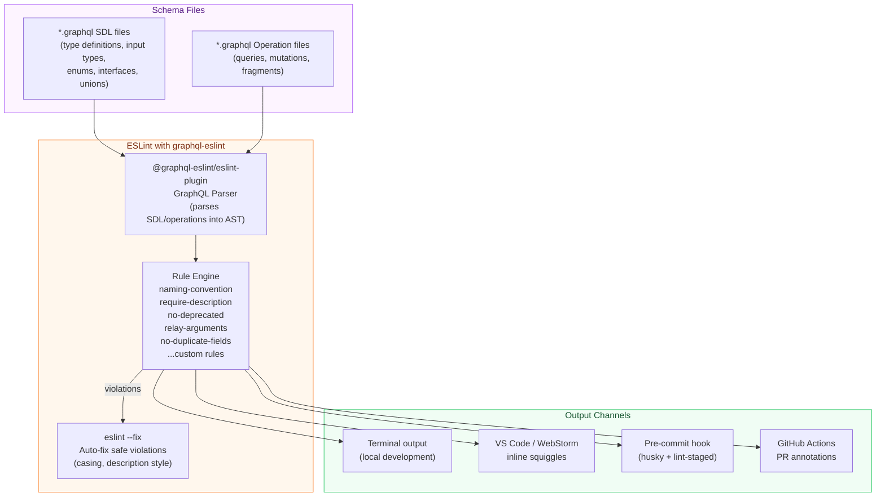

# GraphQL Schema Linting with graphql-eslint

> A GraphQL schema is not just a contract — it is documentation that every client engineer reads. Consistent naming, present descriptions, and coherent nullability patterns make the schema a pleasure to work with. Inconsistent naming, missing descriptions, and arbitrary nullability make every integration a guessing game. graphql-eslint enforces the conventions that make schemas readable and maintainable at scale.

---

## Learning Objectives

- [ ] Understand why linting GraphQL schemas with ESLint is different from linting JavaScript
- [ ] Install and configure graphql-eslint with the correct parser and plugin setup
- [ ] Configure naming convention rules: PascalCase types, camelCase fields, SCREAMING_SNAKE_CASE enum values
- [ ] Enforce required descriptions on types, arguments, and deprecated fields
- [ ] Write a custom ESLint rule that enforces domain-specific conventions (non-nullable ID fields)
- [ ] Integrate graphql-eslint into pre-commit hooks with husky and lint-staged
- [ ] Run graphql-eslint in GitHub Actions CI and surface lint errors as PR annotations

---

## Overview

GraphQL schemas have their own linting concerns that are distinct from JavaScript linting. A GraphQL schema can be syntactically valid, semantically correct, fully composable, and backward-compatible — yet still be a maintenance burden because field names are inconsistent (`userId` in one type, `user_id` in another), types lack descriptions, or nullable fields appear where non-nullable ones would better model the domain.

graphql-eslint is an ESLint plugin that adds a GraphQL-aware parser and a set of rules specifically designed for GraphQL SDL and operation documents. It integrates with the standard ESLint toolchain, which means it uses the same configuration format, the same `eslint --fix` command, the same IDE integrations (VS Code ESLint extension reports GraphQL lint errors inline), and the same CI integration pattern as JavaScript linting.

The rules fall into three categories. **Naming convention rules** enforce consistent casing across the schema: PascalCase for object types, interfaces, unions, enums, and input types; camelCase for field names and argument names; SCREAMING_SNAKE_CASE for enum values. **Schema design rules** catch structural patterns that are almost always wrong: duplicate field names in the same type, fields that reference undefined types, relay pagination shapes that are missing `edges`, `node`, or `pageInfo`. **Documentation rules** enforce that types and arguments have descriptions, that deprecated fields include a deprecation reason, and that the description style is consistent (block strings vs inline strings).

---

## Architecture



---

## Core Concepts

### Why graphql-eslint, Not Just SDL Validation

SDL validation (what `rover subgraph compose` or `graphql.buildSchema()` does) catches syntax errors and type reference errors. It does not care whether `userId` is camelCase or snake_case. It does not care whether `Product` has a description. It does not care whether your enum values are `PENDING` or `pending` or `Pending`.

These are not cosmetic concerns. Inconsistent naming creates:
- **Integration friction**: client engineers have to remember which types follow which convention
- **Documentation debt**: undescribed types require reading resolver code to understand intent
- **Maintenance risk**: `deprecated` fields without reasons leave future engineers uncertain whether the field is safe to remove

graphql-eslint enforces these invariants automatically, turning them from "things we try to remember in code review" into "things CI enforces before code review begins."

### Parser vs Plugin

graphql-eslint uses two npm packages that work together:

- `@graphql-eslint/eslint-plugin`: the ESLint plugin that provides the rules. It also exports the parser.
- The parser is referenced as `parser: '@graphql-eslint/eslint-plugin'` in legacy config format, or as `languageOptions.parser` in flat config.

In ESLint flat config (the modern format, the default since ESLint 9.x), the plugin and parser are referenced differently than in legacy `.eslintrc.js` format. Both are documented below.

---

## Installation

```bash
# Install graphql-eslint plugin (includes the parser)
npm install --save-dev @graphql-eslint/eslint-plugin

# Install ESLint if not already present
npm install --save-dev eslint

# Install graphql peer dependency
npm install --save-dev graphql

# Verify installation
npx eslint --version
```

---

## Complete Configuration

### Legacy Config Format (.eslintrc.js)

The legacy format is still widely used, especially in monorepos using ESLint 8.x.

```javascript
// .eslintrc.js
// Placed in the repository root or subgraph package root

module.exports = {
  // Base config for JavaScript/TypeScript files
  // (graphql-eslint only activates for .graphql files via overrides)
  root: true,

  overrides: [
    // ── GraphQL Schema Files ──────────────────────────────────────────────
    {
      files: ['**/*.graphql', '**/*.gql'],

      // Use graphql-eslint's parser (understands GraphQL SDL and operations)
      parser: '@graphql-eslint/eslint-plugin',

      plugins: ['@graphql-eslint'],

      // Parser options: point to your schema for operation validation
      parserOptions: {
        // Required for operation-related rules (fields-on-correct-type, etc.)
        // Can be a file path, a glob, or an introspection JSON path
        schema: './schema.graphql',

        // Required for fragment-related rules in operation files
        // documents: './src/**/*.graphql',
      },

      rules: {
        // ── Naming Conventions ──────────────────────────────────────────
        '@graphql-eslint/naming-convention': ['error', {
          // Object types, interfaces, unions, input types, enums → PascalCase
          types: 'PascalCase',

          // Fields on object types and interface types → camelCase
          FieldDefinition: 'camelCase',

          // Arguments on fields and directives → camelCase
          InputValueDefinition: 'camelCase',

          // Enum values → SCREAMING_SNAKE_CASE
          EnumValueDefinition: 'SCREAMING_SNAKE_CASE',

          // Named operation definitions (query, mutation, subscription) → PascalCase
          OperationDefinition: 'PascalCase',

          // Fragment names → PascalCase
          FragmentDefinition: 'PascalCase',
        }],

        // ── Descriptions ────────────────────────────────────────────────
        // Require block-style descriptions (""" ... """) not inline (# comment)
        '@graphql-eslint/description-style': ['warn', {
          style: 'block',  // Enforce """ block strings, not # comments
        }],

        // Require descriptions on types and arguments (not individual fields
        // — field descriptions are optional but encouraged)
        '@graphql-eslint/require-description': ['error', {
          ObjectTypeDefinition: true,
          InterfaceTypeDefinition: true,
          EnumTypeDefinition: true,
          UnionTypeDefinition: true,
          InputObjectTypeDefinition: true,
          ScalarTypeDefinition: true,
          // Arguments must have descriptions if the field is a root type field
          FieldDefinition: false,  // Per-field descriptions are recommended, not required
          InputValueDefinition: true,  // Arguments should always be described
        }],

        // ── Deprecation ─────────────────────────────────────────────────
        // Warn when a field is used that is marked @deprecated
        // (useful in operation files — warns that the operation uses a deprecated field)
        '@graphql-eslint/no-deprecated': 'warn',

        // Require a deprecation reason on @deprecated directive usage
        // '@graphql-eslint/deprecation-reason': 'error',
        // (requires @graphql-eslint version that supports this rule)

        // ── Schema Correctness ───────────────────────────────────────────
        // No duplicate field names within a type
        '@graphql-eslint/no-duplicate-fields': 'error',

        // Fields referenced must exist on the type
        '@graphql-eslint/fields-on-correct-type': 'error',

        // ── Relay Pagination ────────────────────────────────────────────
        // Enforce relay-style cursor pagination conventions
        // (connection types must have edges, node, pageInfo)
        '@graphql-eslint/relay-arguments': ['warn', {
          // Require both first/after AND last/before argument pairs
          includeBoth: true,
        }],

        '@graphql-eslint/relay-connection-types': 'warn',
        '@graphql-eslint/relay-edge-types': 'warn',
        '@graphql-eslint/relay-page-info': 'warn',

        // ── Schema Design ────────────────────────────────────────────────
        // Avoid using built-in scalar types for IDs (prefer ID scalar)
        '@graphql-eslint/no-scalar-result-type-on-mutation': 'warn',

        // Input types should be named with 'Input' suffix
        // (custom rule — see Custom Rules section)

        // Limit nesting depth in operation documents
        // '@graphql-eslint/selection-set-depth': ['warn', { maxDepth: 7 }],
      },
    },

    // ── GraphQL Operation Files ────────────────────────────────────────────
    // Separate override for operation files (queries, mutations)
    // if your operations live in a different directory than schema files
    {
      files: ['**/operations/**/*.graphql', '**/queries/**/*.graphql'],
      parser: '@graphql-eslint/eslint-plugin',
      plugins: ['@graphql-eslint'],
      parserOptions: {
        schema: './schema.graphql',
        documents: './**/*.graphql',
      },
      rules: {
        // Operations must be named (anonymous operations are hard to debug)
        '@graphql-eslint/no-anonymous-operations': 'error',

        // Every variable defined must be used
        '@graphql-eslint/no-unused-variables': 'error',

        // Every fragment defined must be used somewhere
        '@graphql-eslint/no-unused-fragments': 'error',

        // Limit selection set depth to prevent deeply nested queries
        '@graphql-eslint/selection-set-depth': ['error', {
          maxDepth: 7,
          // Allow specific fields to be deeper (e.g., nested location data)
          ignore: ['location', 'address'],
        }],

        // Fragments must be used on the correct type
        '@graphql-eslint/fragment-spread-target': 'error',
      },
    },
  ],
};
```

### Flat Config Format (eslint.config.js — ESLint 9.x)

```javascript
// eslint.config.js
import graphqlPlugin from '@graphql-eslint/eslint-plugin';

export default [
  // JavaScript/TypeScript rules (your existing config)
  // ...

  // GraphQL schema files
  {
    files: ['**/*.graphql'],
    languageOptions: {
      parser: graphqlPlugin,
      parserOptions: {
        graphQLConfig: {
          schema: './schema.graphql',
        },
      },
    },
    plugins: {
      '@graphql-eslint': graphqlPlugin,
    },
    rules: {
      '@graphql-eslint/naming-convention': ['error', {
        types: 'PascalCase',
        FieldDefinition: 'camelCase',
        InputValueDefinition: 'camelCase',
        EnumValueDefinition: 'SCREAMING_SNAKE_CASE',
        OperationDefinition: 'PascalCase',
      }],
      '@graphql-eslint/require-description': ['error', {
        ObjectTypeDefinition: true,
        InterfaceTypeDefinition: true,
        EnumTypeDefinition: true,
        InputObjectTypeDefinition: true,
        InputValueDefinition: true,
      }],
      '@graphql-eslint/no-deprecated': 'warn',
      '@graphql-eslint/no-duplicate-fields': 'error',
      '@graphql-eslint/fields-on-correct-type': 'error',
    },
  },
];
```

---

## Custom Rules

graphql-eslint supports custom rules that follow the standard ESLint rule interface, but receive a GraphQL AST node instead of a JavaScript AST node.

### Rule: All ID Fields Must Be Non-Nullable

This rule enforces the convention that any field named `id` or ending in `Id` must be of a non-nullable type (e.g., `ID!`, `String!`). Nullable ID fields are almost always a modeling mistake — if the entity has an ID, it should always have one.

```javascript
// eslint-rules/no-nullable-id-fields.js
// Custom graphql-eslint rule

'use strict';

/**
 * @type {import('@graphql-eslint/eslint-plugin').GraphQLESLintRule}
 */
const noNullableIdFields = {
  meta: {
    type: 'problem',
    docs: {
      category: 'Schema',
      description:
        'Fields named "id" or ending in "Id" must be non-nullable. ' +
        'A nullable ID field indicates that an entity may not have an identity, ' +
        'which is almost always a modeling error.',
      recommended: true,
      url: 'https://your-handbook.internal/graphql/03-linting',
    },
    schema: [],  // No options for this rule
  },

  create(context) {
    return {
      // Visit every FieldDefinition node in the schema AST
      FieldDefinition(node) {
        const fieldName = node.name.value;

        // Check if the field name is 'id' or ends with 'Id'
        const isIdField =
          fieldName === 'id' ||
          fieldName.endsWith('Id') ||
          fieldName.endsWith('ID');

        if (!isIdField) return;

        // Check if the type is nullable (i.e., NOT wrapped in NonNullType)
        const isNullable = node.type.kind !== 'NonNullType';

        if (isNullable) {
          context.report({
            node,
            message:
              `Field "${fieldName}" appears to be an ID field but is nullable. ` +
              `Change the type to non-nullable (e.g., "ID!" instead of "ID"). ` +
              `If this field is intentionally nullable, rename it to avoid the "Id" suffix.`,
          });
        }
      },
    };
  },
};

module.exports = noNullableIdFields;
```

Reference the custom rule in `.eslintrc.js`:

```javascript
// .eslintrc.js
module.exports = {
  overrides: [
    {
      files: ['**/*.graphql'],
      parser: '@graphql-eslint/eslint-plugin',
      plugins: ['@graphql-eslint'],
      rules: {
        '@graphql-eslint/naming-convention': 'error',
        // ... other rules

        // Custom rule: reference via relative path in rulesdir
        // (requires eslint-plugin-local or similar mechanism)
        'local/no-nullable-id-fields': 'error',
      },
    },
  ],
};
```

To load local rules without a plugin wrapper, use `eslint-plugin-local-rules`:

```bash
npm install --save-dev eslint-plugin-local-rules
```

```javascript
// .eslintrc.js
module.exports = {
  plugins: ['@graphql-eslint', 'local-rules'],
  overrides: [
    {
      files: ['**/*.graphql'],
      rules: {
        'local-rules/no-nullable-id-fields': 'error',
      },
    },
  ],
};

// eslint-local-rules.js (in repository root)
module.exports = {
  'no-nullable-id-fields': require('./eslint-rules/no-nullable-id-fields'),
};
```

### Rule: Input Types Must Have 'Input' Suffix

```javascript
// eslint-rules/input-suffix.js
'use strict';

module.exports = {
  meta: {
    type: 'suggestion',
    docs: {
      description: 'Input object types must have an "Input" suffix to distinguish them from output types.',
      category: 'Schema',
    },
    schema: [
      {
        type: 'object',
        properties: {
          suffix: {
            type: 'string',
            default: 'Input',
          },
        },
      },
    ],
  },

  create(context) {
    const suffix = context.options[0]?.suffix ?? 'Input';

    return {
      InputObjectTypeDefinition(node) {
        const name = node.name.value;

        // Exclude pagination-related types that are conventionally named differently
        const excluded = ['PageInfo', 'Edge', 'Connection'];
        if (excluded.some(ex => name.includes(ex))) return;

        if (!name.endsWith(suffix)) {
          context.report({
            node: node.name,
            message:
              `Input type "${name}" must end with "${suffix}". ` +
              `Rename to "${name}${suffix}" to distinguish it from output types of the same concept.`,
          });
        }
      },
    };
  },
};
```

---

## Pre-Commit Hooks with Husky and lint-staged

Pre-commit hooks ensure that lint violations are caught before they enter the git history, where they become harder to fix (either as merge conflicts in lint-fixing commits or as entries in git blame that obscure intent).

### Installation

```bash
# Install husky (git hooks) and lint-staged
npm install --save-dev husky lint-staged

# Initialize husky (creates .husky/ directory, installs git hooks)
npx husky init

# This creates .husky/pre-commit — we'll replace its contents
```

### Configuration

```json
// package.json
{
  "scripts": {
    "lint": "eslint .",
    "lint:graphql": "eslint '**/*.graphql'",
    "lint:fix": "eslint . --fix"
  },
  "lint-staged": {
    "*.graphql": [
      "eslint --fix",
      "git add"
    ],
    "*.{js,ts,jsx,tsx}": [
      "eslint --fix",
      "prettier --write",
      "git add"
    ]
  }
}
```

```bash
# .husky/pre-commit
#!/usr/bin/env sh
. "$(dirname -- "$0")/_/husky.sh"

# Run lint-staged on staged files only
npx lint-staged

# Optionally: run type checking on the full project
# (comment out if too slow for pre-commit)
# npx tsc --noEmit
```

### Make the Hook Executable

```bash
chmod +x .husky/pre-commit
```

---

## GitHub Actions CI Integration

```yaml
# .github/workflows/graphql-lint.yml
name: GraphQL Lint

on:
  pull_request:
    paths:
      - '**/*.graphql'
      - '**/*.gql'
      - '.eslintrc.js'
      - 'eslint.config.js'
      - 'eslint-rules/**'

permissions:
  # Required to post PR annotations (inline lint errors on the diff)
  pull-requests: write
  checks: write
  contents: read

jobs:
  lint:
    name: graphql-eslint
    runs-on: ubuntu-latest

    steps:
      - uses: actions/checkout@v4

      - uses: actions/setup-node@v4
        with:
          node-version: '20'
          cache: 'npm'

      - name: Install dependencies
        run: npm ci

      - name: Run graphql-eslint
        id: lint
        run: |
          # Run ESLint on GraphQL files, output in JSON format for annotation parsing
          npx eslint '**/*.graphql' \
            --format json \
            --output-file lint-results.json || true

          # Also run with the standard formatter for human-readable output in CI logs
          npx eslint '**/*.graphql' || LINT_EXIT=$?
          echo "exit_code=${LINT_EXIT:-0}" >> $GITHUB_OUTPUT
        continue-on-error: true

      - name: Post lint annotations as PR checks
        if: github.event_name == 'pull_request'
        uses: actions/github-script@v7
        with:
          script: |
            const fs = require('fs');

            let results = [];
            try {
              results = JSON.parse(fs.readFileSync('lint-results.json', 'utf8'));
            } catch (e) {
              console.log('No lint results to parse');
              return;
            }

            // Flatten all lint messages into annotations
            const annotations = [];
            for (const fileResult of results) {
              const filePath = fileResult.filePath.replace(process.cwd() + '/', '');

              for (const message of fileResult.messages) {
                annotations.push({
                  path: filePath,
                  start_line: message.line,
                  end_line: message.endLine || message.line,
                  start_column: message.column,
                  end_column: message.endColumn || message.column,
                  annotation_level: message.severity === 2 ? 'failure' : 'warning',
                  message: `[${message.ruleId}] ${message.message}`,
                  title: message.ruleId,
                });
              }
            }

            if (annotations.length === 0) {
              console.log('No lint violations found.');
              return;
            }

            // Post annotations in batches of 50 (GitHub API limit)
            const batchSize = 50;
            for (let i = 0; i < annotations.length; i += batchSize) {
              const batch = annotations.slice(i, i + batchSize);

              await github.rest.checks.create({
                owner: context.repo.owner,
                repo: context.repo.repo,
                name: 'GraphQL Lint',
                head_sha: context.payload.pull_request.head.sha,
                status: 'completed',
                conclusion: annotations.some(a => a.annotation_level === 'failure')
                  ? 'failure'
                  : 'neutral',
                output: {
                  title: `GraphQL ESLint: ${annotations.length} violation(s)`,
                  summary: `Found ${annotations.filter(a => a.annotation_level === 'failure').length} errors and ${annotations.filter(a => a.annotation_level === 'warning').length} warnings.`,
                  annotations: batch,
                },
              });
            }

      - name: Fail on lint errors
        if: steps.lint.outputs.exit_code != '0'
        run: |
          echo "GraphQL lint errors found. See annotations on the PR diff for details."
          exit 1
```

---

## Production Considerations

### Performance

ESLint with graphql-eslint is fast on individual files but can be slow when processing a large schema directory. For repositories with hundreds of GraphQL files:

1. Use `lint-staged` in pre-commit hooks to lint only staged files, not the entire repository.
2. In CI, use path filters to only run the lint job when GraphQL files change.
3. Cache the ESLint result cache (`--cache` flag) between CI runs using GitHub Actions cache.

```yaml
- name: Run graphql-eslint with cache
  run: |
    npx eslint '**/*.graphql' \
      --cache \
      --cache-location .eslintcache \
      --format json \
      --output-file lint-results.json || true

- name: Cache ESLint results
  uses: actions/cache@v4
  with:
    path: .eslintcache
    key: eslint-${{ hashFiles('**/*.graphql', '.eslintrc.js') }}
```

### Security

graphql-eslint rules do not require network access and do not send schema content to any external service. Custom rules run as Node.js code in the ESLint process — review custom rules from third parties before installing them.

### Scaling

In a monorepo with multiple subgraph packages, each package may have its own `.eslintrc.js` that extends a shared base configuration:

```javascript
// packages/products-subgraph/.eslintrc.js
module.exports = {
  extends: ['../../.eslintrc.base.js'],
  // Override rules that differ for this specific subgraph
  overrides: [
    {
      files: ['**/*.graphql'],
      rules: {
        // This subgraph uses a different ID convention
        'local-rules/no-nullable-id-fields': 'off',
      },
    },
  ],
};
```

---

## Best Practices

1. **Start with warning-level rules, promote to error-level over time.** Introducing graphql-eslint to an existing schema will initially produce many violations. Setting all rules to `error` immediately makes CI unusable. Start with `warn` on everything, fix violations systematically, then promote rules to `error` once the violation count reaches zero.

2. **Enforce descriptions only on types and arguments, not on every field.** Requiring descriptions on every field is achievable for a small schema but becomes a burden on large schemas with hundreds of fields. Types and arguments are the highest-value description targets: types define the vocabulary of your API, and argument descriptions are read by every client developer who uses autocomplete.

3. **Commit the ESLint cache in CI but not in git.** The ESLint cache dramatically speeds up repeated CI runs by skipping files that have not changed since the last run. Add `.eslintcache` to `.gitignore` but cache it between CI runs via GitHub Actions cache.

4. **Add graphql-eslint to your IDE setup, not just CI.** The most effective lint feedback loop is the one that catches violations as you type, not one that catches them after you push. The ESLint VS Code extension supports graphql-eslint automatically — ensure your team's VS Code workspace settings include the `.graphql` file association.

5. **Write custom rules for your domain's conventions.** The built-in rules cover universal GraphQL conventions. Domain-specific rules (ID fields must be non-nullable, mutation responses must include a `userErrors` field, subscription fields must have rate limit arguments) require custom rules. These are typically 30-50 lines of straightforward AST visitor code.

6. **Use `eslint --fix` for automatically fixable violations.** Several graphql-eslint rules support auto-fix. Naming convention violations where the fix is unambiguous (uppercase an enum value) are auto-fixable. Requiring descriptions is not auto-fixable (the linter cannot write documentation for you). Identify which violations in your ruleset are auto-fixable and run `eslint --fix` before committing.

---

## Anti-Patterns

**Using a comment-suppression pattern to silence lint errors.** In JavaScript, `// eslint-disable-next-line` is sometimes necessary. In GraphQL SDL, using `# eslint-disable-next-line @graphql-eslint/naming-convention` to silence a naming violation is almost always the wrong choice — it means the schema has an inconsistency that everyone who uses the schema must now remember. Fix the violation or configure the rule to exclude the type/field properly.

**Linting generated files.** If your schema is generated from TypeScript decorators or database schema introspection, the generated `.graphql` file should not be linted — the generation tool controls its style, not your team. Add generated files to `.eslintignore`.

**Running the full lint pass in a pre-commit hook.** A pre-commit hook that lints the entire repository (not just staged files) will make commits unbearably slow on large schemas. Use `lint-staged` to lint only the files you are committing.

**Configuring different naming conventions in different subgraphs.** In a federated schema, naming inconsistencies in one subgraph create inconsistencies in the supergraph. All subgraphs should share the same naming convention ruleset. Use a shared ESLint config in a monorepo (`extends: '../../.eslintrc.graphql-base.js'`), or publish the shared config as a private npm package in a polyrepo setup.

---

## Operational Notes

- graphql-eslint requires `graphql` as a peer dependency. Ensure your project's installed `graphql` version is compatible with the installed `@graphql-eslint/eslint-plugin` version. Check the plugin's peer dependency range in its `package.json` before upgrading.
- The `parser` field in `.eslintrc.js` and the `languageOptions.parser` field in flat config must reference the plugin package (`'@graphql-eslint/eslint-plugin'`), not a separate parser package. The plugin bundles the parser.
- graphql-eslint rules that validate operations against a schema (such as `fields-on-correct-type`) require `parserOptions.schema` to point to a valid schema. If the schema path is wrong, these rules silently skip validation rather than erroring. Verify by introducing a deliberate field reference error.
- ESLint 9.x (flat config) changes the plugin reference format. If you upgrade ESLint, update your config format. The plugin supports both formats, but mixing them (legacy config with flat config settings) does not work.

---

## References

- [graphql-eslint documentation](https://the-guild.dev/graphql/eslint/docs) — rule reference, configuration options, flat config and legacy config examples from The Guild
- [graphql-eslint GitHub repository](https://github.com/dimaMachina/graphql-eslint) — source code, issue tracker, rule implementations for understanding AST structure
- [ESLint custom rules documentation](https://eslint.org/docs/latest/extend/custom-rules) — the standard ESLint custom rule API, which graphql-eslint custom rules implement using GraphQL AST nodes

---

## Related Topics

- [01-graphql-inspector.md](./01-graphql-inspector.md) — structural schema diffing (catches breaking changes, not style violations)
- [02-breaking-change-detection.md](./02-breaking-change-detection.md) — rover subgraph check (catches client-breaking changes, not style violations)
- [09-schema-governance](../09-schema-governance/) — the RFC process that produces the naming conventions and design rules that linting enforces
- [11-ci-cd-automation/01-ci-pipeline-design.md](../11-ci-cd-automation/01-ci-pipeline-design.md) — how linting fits as Layer 1 in the full CI pipeline
