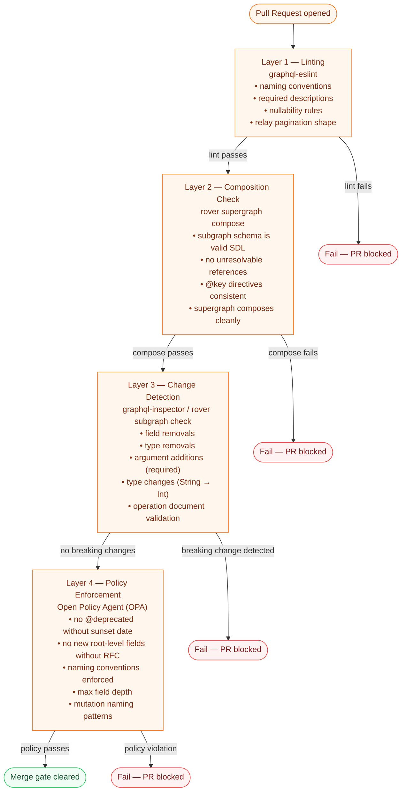

# Schema Validation

> Catching a breaking change in CI costs nothing. Catching it in production costs hours of incident response, customer trust, and engineer sleep. Schema validation is the automated enforcement layer that makes schema governance a reality instead of a policy document that everyone ignores.

Schema validation is not a single tool or a single step — it is a pipeline of four complementary layers, each catching a distinct class of error. No single layer is sufficient on its own. Linting catches style violations that a schema that composes and passes checks can still contain. Composition checks catch integration errors that no amount of per-subgraph linting will find. Change detection catches the subset of structurally valid changes that break running client queries. Policy enforcement catches the subset of technically correct, backward-compatible changes that violate organizational standards.

Together, these four layers create a feedback loop that returns errors to the developer within minutes, before the change ever reaches a shared environment.

---

## The Four-Layer Validation Pipeline

---

## What Each Layer Catches

| Layer | Tool | Catches | Does Not Catch |
|-------|------|---------|----------------|
| 1 — Linting | graphql-eslint | Naming violations, missing descriptions, bad nullability patterns | Whether schema composes or breaks clients |
| 2 — Composition | rover supergraph compose | Federation integration errors, unresolvable references | Client-facing breaking changes |
| 3 — Change Detection | graphql-inspector, rover subgraph check | Field removals, type renames, argument changes, broken client operations | Policy violations, style issues |
| 4 — Policy | OPA + Rego policies | Organizational standards, deprecation hygiene, governance violations | Structural errors, client breakage |

---

## Prerequisites

Before working through this section, you should be familiar with:

- **Federation fundamentals** — how subgraphs compose into a supergraph, what `@key` and `@external` directives do, and how the router routes queries. See [07-federation](../07-federation/) and [08-supergraph-architecture](../08-supergraph-architecture/).
- **Schema governance** — why a governance process exists and what organizational standards look like. See [09-schema-governance](../09-schema-governance/).
- **Rover CLI basics** — authentication with Apollo GraphOS (`rover config auth`), the difference between a graph and a variant, and how `rover subgraph publish` works.

---

## Content Files

| File | Topic |
|------|-------|
| [01-graphql-inspector.md](./01-graphql-inspector.md) | Schema diffing, breaking change detection CLI, coverage analysis, GitHub Actions integration |
| [02-breaking-change-detection.md](./02-breaking-change-detection.md) | rover subgraph check, operations registry, usage-aware breaking change detection, check settings |
| [03-linting.md](./03-linting.md) | graphql-eslint configuration, naming conventions, custom rules, pre-commit hooks |

---

## Related Topics

- [11-ci-cd-automation](../11-ci-cd-automation/) — how to wire these four layers into a GitHub Actions pipeline
- [13-policy-as-code](../13-policy-as-code/) — OPA and Rego policies for GraphQL governance (Layer 4 in depth)
- [09-schema-governance](../09-schema-governance/) — the RFC process and schema review board that produce the policies Layer 4 enforces
