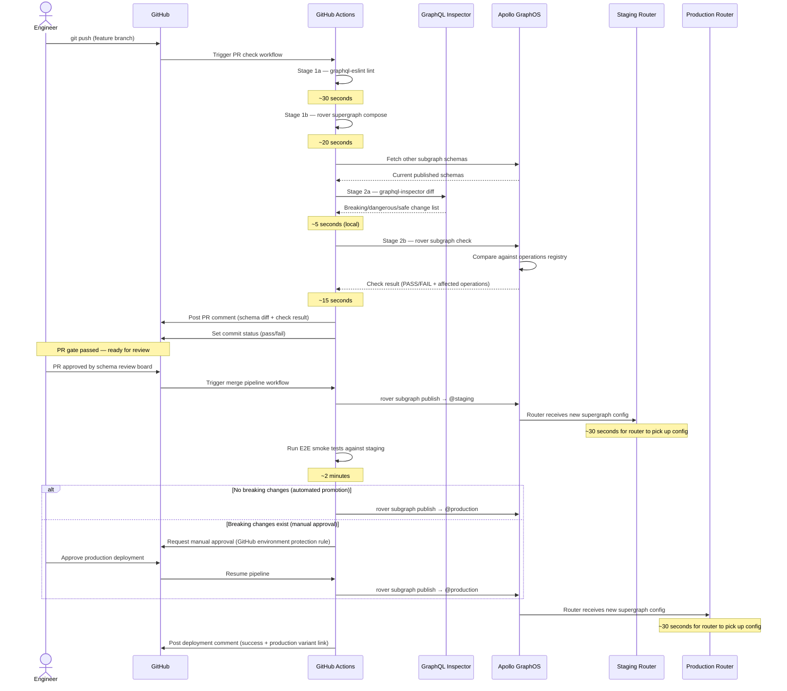

# GraphQL CI Pipeline Design — PR Gates, Merge Pipelines, and Schema Promotion

> The CI pipeline is the most important piece of infrastructure a GraphQL platform team can build. A schema change that passes through a well-designed pipeline arrives in production verified, tested, and reversible. A schema change that bypasses the pipeline — or that passes through a poorly designed one — arrives in production as a future incident.

---

## Learning Objectives

- [ ] Understand the two-phase pipeline: PR gate (must pass before merge) and merge pipeline (runs after merge)
- [ ] Design a PR gate that provides fast feedback without creating unnecessary bottlenecks
- [ ] Understand the schema promotion flow: feature branch → PR → staging → production
- [ ] Configure path-based CI triggers for monorepos to avoid running the full pipeline on unrelated changes
- [ ] Implement preview environments as ephemeral Apollo GraphOS variants
- [ ] Define a rollback strategy using rover subgraph publish with a previous schema version
- [ ] Interpret the complete sequence diagram of a PR lifecycle through the pipeline

---

## Overview

A GraphQL CI pipeline has a different structure from a typical application deployment pipeline because the artifact being versioned — the schema — is a shared contract between the server (subgraph team) and all clients (every application that queries the graph). A broken deployment of a web application affects users immediately and is noticed immediately. A broken schema change may not be noticed until a client that queries a specific field returns an error to a user, which may be minutes or hours after the deployment depending on client caching and user traffic patterns.

This means the GraphQL CI pipeline must be conservative where typical application pipelines can be fast. Every schema change to a shared graph must be checked against all known client operations before it reaches any environment that real clients query. The PR gate is not a formality — it is the primary safety mechanism.

The pipeline is divided into two phases. The **PR gate phase** runs on every push to a pull request branch. All PR gate checks must pass before the PR can be merged. The PR gate is fast (under five minutes total) and deterministic. It does not deploy anything. The **merge pipeline phase** runs after the PR is merged. It publishes the schema to the staging variant, verifies composition, and either automatically or manually promotes the schema to the production variant.

---

## Architecture

### Complete PR Lifecycle Sequence



---

## Core Concepts

### The Two-Phase Pipeline

**Phase 1: PR Gate**

The PR gate runs on every push to a pull request. It consists of two stages that run sequentially:

- **Stage 1 — Validate**: graphql-eslint linting followed by `rover supergraph compose`. If the schema does not lint cleanly or does not compose with other subgraphs, Stage 2 does not run. Composing early catches federation integration errors before wasting time on operation checks.

- **Stage 2 — Check**: graphql-inspector diff for fast structural feedback followed by `rover subgraph check` for usage-aware breaking change detection. Both tools report to the PR comment. Both must pass to allow merge.

The PR gate does not publish anything to any registry. It reads from the schema registry (to fetch other subgraph schemas for composition) but never writes.

**Phase 2: Merge Pipeline**

The merge pipeline runs once, when the PR is merged to the main branch. It consists of two stages:

- **Stage 3 — Publish (Staging)**: Publishes the merged schema to the staging variant. The Apollo Router in staging automatically picks up the new supergraph config. E2E smoke tests run against staging.

- **Stage 4 — Deploy (Production)**: Publishes the schema to the production variant. This step is automated if no breaking changes were detected (all changes are backward-compatible additions), or requires manual approval via a GitHub environment protection rule if breaking changes exist.

### Schema Promotion Flow

```
feature/add-product-reviews branch
         │
         │ rover subgraph check @staging (PR gate)
         ↓
    Pull Request
         │
         │ merge (after PR gate passes + review approved)
         ↓
      main branch
         │
         │ rover subgraph publish @staging (auto)
         ↓
    staging variant ──→ staging router ──→ staging clients
         │
         │ E2E tests pass + (manual approval or auto-promote)
         ↓
    production variant ──→ production router ──→ production clients
```

### Monorepo vs Polyrepo Pipeline Strategy

**Monorepo**: All subgraph schemas live in the same repository. Use GitHub Actions path filters to trigger the relevant CI workflow only when a subgraph's files change.

```yaml
# In a monorepo: each subgraph has its own workflow file
# .github/workflows/products-subgraph.yml
on:
  push:
    paths:
      - 'subgraphs/products/**'
      - 'shared-types/**'  # Shared type library used by this subgraph
  pull_request:
    paths:
      - 'subgraphs/products/**'
      - 'shared-types/**'
```

The composition check must still fetch schemas for all other subgraphs, not just the one being changed. This is handled by `rover supergraph compose` with a `supergraph.yaml` file that references all subgraph schema paths.

**Polyrepo**: Each subgraph lives in its own repository. The CI pipeline in each repository is identical in structure but configured with that subgraph's specific name and schema path. Coordination between subgraphs is handled by the operations registry — changes in one subgraph can be checked against operations that include fields from other subgraphs.

---

## Complete Pipeline Implementation

### Repository Structure (Monorepo)

```
my-graph/
├── .github/
│   └── workflows/
│       ├── products-subgraph-pr.yml     # PR gate for products subgraph
│       ├── products-subgraph-merge.yml  # Merge pipeline for products subgraph
│       ├── users-subgraph-pr.yml
│       └── users-subgraph-merge.yml
├── subgraphs/
│   ├── products/
│   │   ├── schema.graphql
│   │   └── src/
│   └── users/
│       ├── schema.graphql
│       └── src/
├── supergraph.yaml                      # rover supergraph compose config
├── .eslintrc.js                         # Shared graphql-eslint config
└── operations/                          # Collected client operation documents
    ├── ios/
    ├── android/
    └── web/
```

### supergraph.yaml

```yaml
# supergraph.yaml
# Used by rover supergraph compose to assemble the full supergraph for local composition

federation_version: =2.6.0

subgraphs:
  products:
    routing_url: http://products.internal/graphql
    schema:
      file: ./subgraphs/products/schema.graphql

  users:
    routing_url: http://users.internal/graphql
    schema:
      file: ./subgraphs/users/schema.graphql

  inventory:
    routing_url: http://inventory.internal/graphql
    schema:
      # For subgraphs in external repos, fetch from the registry
      subgraph_url: https://my-graph.api.apollographql.com/api/graphql
      graphref: my-graph@staging
      subgraph_name: inventory
```

### Stage 1: PR Gate — Validate Workflow

```yaml
# .github/workflows/products-subgraph-pr.yml
name: Products Subgraph — PR Gate

on:
  pull_request:
    paths:
      - 'subgraphs/products/**'
      - 'supergraph.yaml'
      - '.eslintrc.js'
      - '.github/workflows/products-subgraph-pr.yml'

env:
  SUBGRAPH_NAME: products
  SCHEMA_PATH: subgraphs/products/schema.graphql
  GRAPH_REF: my-graph@staging

permissions:
  pull-requests: write
  checks: write
  contents: read

jobs:
  # ── Stage 1: Validate ────────────────────────────────────────────────────
  lint:
    name: "Stage 1a — graphql-eslint"
    runs-on: ubuntu-latest
    steps:
      - uses: actions/checkout@v4

      - uses: actions/setup-node@v4
        with:
          node-version: '20'
          cache: 'npm'

      - run: npm ci

      - name: Run graphql-eslint
        run: npx eslint '${{ env.SCHEMA_PATH }}' --max-warnings 0

  compose:
    name: "Stage 1b — rover supergraph compose"
    runs-on: ubuntu-latest
    needs: lint  # Only compose if lint passes

    steps:
      - uses: actions/checkout@v4

      - name: Install rover CLI
        run: |
          curl -sSL https://rover.apollo.dev/nix/latest | sh
          echo "$HOME/.rover/bin" >> $GITHUB_PATH

      - name: Compose supergraph locally
        env:
          APOLLO_KEY: ${{ secrets.APOLLO_KEY }}
        run: |
          rover supergraph compose \
            --config supergraph.yaml \
            --output supergraph-schema.graphql

          echo "Composition successful. Supergraph schema size:"
          wc -l supergraph-schema.graphql

      - name: Upload composed schema as artifact
        uses: actions/upload-artifact@v4
        with:
          name: supergraph-schema
          path: supergraph-schema.graphql
          retention-days: 1

  # ── Stage 2: Check ───────────────────────────────────────────────────────
  inspector-diff:
    name: "Stage 2a — graphql-inspector diff"
    runs-on: ubuntu-latest
    needs: compose  # Only diff if composition passes

    steps:
      - uses: actions/checkout@v4
        with:
          fetch-depth: 0

      - uses: actions/setup-node@v4
        with:
          node-version: '20'
          cache: 'npm'

      - run: npm ci

      - name: Get base branch schema
        run: |
          git show origin/${{ github.base_ref }}:${{ env.SCHEMA_PATH }} \
            > old-schema.graphql 2>/dev/null || \
            echo 'type Query { _empty: String }' > old-schema.graphql

      - name: Run schema diff
        id: diff
        run: |
          npx @graphql-inspector/cli diff \
            old-schema.graphql \
            ${{ env.SCHEMA_PATH }} \
            --format json > diff-result.json 2>&1 || DIFF_EXIT=$?
          echo "exit_code=${DIFF_EXIT:-0}" >> $GITHUB_OUTPUT

      - name: Post diff comment
        uses: actions/github-script@v7
        with:
          script: |
            const fs = require('fs');
            let changes = [];
            try { changes = JSON.parse(fs.readFileSync('diff-result.json', 'utf8')); } catch(e) {}

            const breaking = changes.filter(c => c.criticality?.level === 'BREAKING');
            const dangerous = changes.filter(c => c.criticality?.level === 'DANGEROUS');
            const safe = changes.filter(c => c.criticality?.level === 'NON_BREAKING');

            let body = '<!-- graphql-inspector-diff -->\n## GraphQL Inspector Diff\n\n';
            body += `**${breaking.length}** breaking | **${dangerous.length}** dangerous | **${safe.length}** safe\n\n`;

            if (breaking.length > 0) {
              body += '### Breaking Changes\n';
              breaking.forEach(c => { body += `- ${c.message}\n`; });
              body += '\n';
            }
            if (dangerous.length > 0) {
              body += '### Dangerous Changes\n';
              dangerous.forEach(c => { body += `- ${c.message}\n`; });
              body += '\n';
            }

            const { data: comments } = await github.rest.issues.listComments({
              owner: context.repo.owner, repo: context.repo.repo,
              issue_number: context.issue.number,
            });
            const existing = comments.find(c => c.body.includes('<!-- graphql-inspector-diff -->'));
            const method = existing ? 'updateComment' : 'createComment';
            const args = existing
              ? { owner: context.repo.owner, repo: context.repo.repo, comment_id: existing.id, body }
              : { owner: context.repo.owner, repo: context.repo.repo, issue_number: context.issue.number, body };
            await github.rest.issues[method](args);

      - name: Fail on breaking changes
        if: steps.diff.outputs.exit_code != '0'
        run: exit 1

  rover-check:
    name: "Stage 2b — rover subgraph check"
    runs-on: ubuntu-latest
    needs: compose  # Run in parallel with inspector-diff

    steps:
      - uses: actions/checkout@v4

      - name: Install rover CLI
        run: |
          curl -sSL https://rover.apollo.dev/nix/latest | sh
          echo "$HOME/.rover/bin" >> $GITHUB_PATH

      - name: Run rover subgraph check
        id: rover-check
        env:
          APOLLO_KEY: ${{ secrets.APOLLO_KEY }}
        run: |
          set +e
          RESULT=$(rover subgraph check ${{ env.GRAPH_REF }} \
            --schema ${{ env.SCHEMA_PATH }} \
            --name ${{ env.SUBGRAPH_NAME }} \
            --format json 2>&1)
          ROVER_EXIT=$?

          echo "$RESULT" > rover-check-result.json
          echo "exit_code=$ROVER_EXIT" >> $GITHUB_OUTPUT

          # Print human-readable summary to CI logs
          echo "$RESULT" | jq -r '
            "Check result: " + (.data.composition.checkSchemaResult.result // "UNKNOWN"),
            (.data.composition.checkSchemaResult.diffToPrevious.changes[]?
              | select(.severity == "FAILURE")
              | "BREAKING: " + .description)
          ' 2>/dev/null || true

          exit $ROVER_EXIT
        continue-on-error: true

      - name: Post rover check comment
        uses: actions/github-script@v7
        with:
          script: |
            const fs = require('fs');
            const exitCode = '${{ steps.rover-check.outputs.exit_code }}';
            const status = exitCode === '0' ? '✅ Passed' : '❌ Failed';

            let result = {};
            try { result = JSON.parse(fs.readFileSync('rover-check-result.json', 'utf8')); } catch(e) {}
            const changes = result?.data?.composition?.checkSchemaResult?.diffToPrevious?.changes || [];
            const breaking = changes.filter(c => c.severity === 'FAILURE');

            let body = `<!-- rover-subgraph-check -->\n## rover subgraph check — ${status}\n\n`;
            if (breaking.length > 0) {
              body += '### Operations Affected\n';
              breaking.forEach(c => {
                body += `- **${c.description}**\n`;
                (c.affectedQueries || []).forEach(q => { body += `  - \`${q.name}\`\n`; });
              });
            } else if (exitCode === '0') {
              body += '_No operations affected by this schema change._\n';
            }

            const { data: comments } = await github.rest.issues.listComments({
              owner: context.repo.owner, repo: context.repo.repo,
              issue_number: context.issue.number,
            });
            const existing = comments.find(c => c.body.includes('<!-- rover-subgraph-check -->'));
            const method = existing ? 'updateComment' : 'createComment';
            const args = existing
              ? { owner: context.repo.owner, repo: context.repo.repo, comment_id: existing.id, body }
              : { owner: context.repo.owner, repo: context.repo.repo, issue_number: context.issue.number, body };
            await github.rest.issues[method](args);

      - name: Fail on breaking changes in registry
        if: steps.rover-check.outputs.exit_code != '0'
        run: |
          echo "rover subgraph check failed. See PR comment for affected operations."
          exit 1
```

### Stage 3 & 4: Merge Pipeline

```yaml
# .github/workflows/products-subgraph-merge.yml
name: Products Subgraph — Merge Pipeline

on:
  push:
    branches:
      - main
    paths:
      - 'subgraphs/products/**'

env:
  SUBGRAPH_NAME: products
  SCHEMA_PATH: subgraphs/products/schema.graphql

jobs:
  # ── Stage 3: Publish to Staging ──────────────────────────────────────────
  publish-staging:
    name: "Stage 3 — Publish to Staging"
    runs-on: ubuntu-latest
    environment: staging

    steps:
      - uses: actions/checkout@v4

      - name: Install rover CLI
        run: |
          curl -sSL https://rover.apollo.dev/nix/latest | sh
          echo "$HOME/.rover/bin" >> $GITHUB_PATH

      - name: Publish to staging
        env:
          APOLLO_KEY: ${{ secrets.APOLLO_KEY }}
        run: |
          rover subgraph publish my-graph@staging \
            --schema ${{ env.SCHEMA_PATH }} \
            --name ${{ env.SUBGRAPH_NAME }} \
            --routing-url ${{ secrets.STAGING_ROUTING_URL }}

      - name: Wait for router to pick up new config
        run: sleep 15

      - name: Run smoke tests against staging
        run: |
          # Run a set of known-good operations against the staging router
          # to verify the new schema is serving correctly
          npm run test:smoke -- --target=staging
        env:
          STAGING_GRAPHQL_URL: ${{ secrets.STAGING_GRAPHQL_URL }}

  # ── Stage 4: Publish to Production ───────────────────────────────────────
  check-breaking-for-prod:
    name: "Stage 4 — Check for breaking changes against production"
    runs-on: ubuntu-latest
    needs: publish-staging
    outputs:
      has_breaking: ${{ steps.check.outputs.has_breaking }}

    steps:
      - uses: actions/checkout@v4

      - name: Install rover CLI
        run: |
          curl -sSL https://rover.apollo.dev/nix/latest | sh
          echo "$HOME/.rover/bin" >> $GITHUB_PATH

      - name: Check against production operations registry
        id: check
        env:
          APOLLO_KEY: ${{ secrets.APOLLO_KEY }}
        run: |
          set +e
          RESULT=$(rover subgraph check my-graph@production \
            --schema ${{ env.SCHEMA_PATH }} \
            --name ${{ env.SUBGRAPH_NAME }} \
            --format json 2>&1)

          BREAKING=$(echo "$RESULT" | jq '[
            .data.composition.checkSchemaResult.diffToPrevious.changes[]?
            | select(.severity == "FAILURE")
          ] | length' 2>/dev/null || echo 0)

          echo "has_breaking=$([ $BREAKING -gt 0 ] && echo 'true' || echo 'false')" >> $GITHUB_OUTPUT

  publish-production-auto:
    name: "Stage 4 — Publish to Production (automated)"
    runs-on: ubuntu-latest
    needs: check-breaking-for-prod
    if: needs.check-breaking-for-prod.outputs.has_breaking == 'false'

    steps:
      - uses: actions/checkout@v4
      - name: Install rover CLI
        run: |
          curl -sSL https://rover.apollo.dev/nix/latest | sh
          echo "$HOME/.rover/bin" >> $GITHUB_PATH
      - name: Publish to production
        env:
          APOLLO_KEY: ${{ secrets.APOLLO_KEY }}
        run: |
          rover subgraph publish my-graph@production \
            --schema ${{ env.SCHEMA_PATH }} \
            --name ${{ env.SUBGRAPH_NAME }} \
            --routing-url ${{ secrets.PROD_ROUTING_URL }}

  publish-production-manual:
    name: "Stage 4 — Publish to Production (manual approval)"
    runs-on: ubuntu-latest
    needs: check-breaking-for-prod
    if: needs.check-breaking-for-prod.outputs.has_breaking == 'true'
    environment: production  # GitHub environment with required reviewers

    steps:
      - uses: actions/checkout@v4
      - name: Install rover CLI
        run: |
          curl -sSL https://rover.apollo.dev/nix/latest | sh
          echo "$HOME/.rover/bin" >> $GITHUB_PATH
      - name: Publish to production (after manual approval)
        env:
          APOLLO_KEY: ${{ secrets.APOLLO_KEY }}
        run: |
          rover subgraph publish my-graph@production \
            --schema ${{ env.SCHEMA_PATH }} \
            --name ${{ env.SUBGRAPH_NAME }} \
            --routing-url ${{ secrets.PROD_ROUTING_URL }}
```

---

## Rollback Strategy

If a schema publication causes problems in production, the rollback is to re-publish the previous schema version. The Apollo Router will update its supergraph configuration within 30 seconds of a new schema publication.

```bash
# Rollback: retrieve the previous schema version from git history
# and republish it to the production variant

# Find the last commit that changed the schema
LAST_GOOD_COMMIT=$(git log --oneline subgraphs/products/schema.graphql | head -2 | tail -1 | cut -d' ' -f1)

# Extract the schema from that commit
git show $LAST_GOOD_COMMIT:subgraphs/products/schema.graphql > rollback-schema.graphql

# Publish the previous schema to production
rover subgraph publish my-graph@production \
  --schema rollback-schema.graphql \
  --name products \
  --routing-url $PROD_ROUTING_URL
```

For automated rollback in a GitHub Actions workflow triggered by a monitoring alert:

```yaml
# .github/workflows/rollback-schema.yml
name: Schema Rollback

on:
  workflow_dispatch:
    inputs:
      subgraph_name:
        description: 'Subgraph to roll back'
        required: true
        type: choice
        options:
          - products
          - users
          - inventory
      commits_back:
        description: 'How many commits to roll back'
        required: true
        default: '1'
        type: string

jobs:
  rollback:
    runs-on: ubuntu-latest
    environment: production  # Requires approval even for rollback

    steps:
      - uses: actions/checkout@v4
        with:
          fetch-depth: 10

      - name: Install rover CLI
        run: |
          curl -sSL https://rover.apollo.dev/nix/latest | sh
          echo "$HOME/.rover/bin" >> $GITHUB_PATH

      - name: Extract and publish previous schema
        env:
          APOLLO_KEY: ${{ secrets.APOLLO_KEY }}
        run: |
          SUBGRAPH="${{ inputs.subgraph_name }}"
          SCHEMA_PATH="subgraphs/${SUBGRAPH}/schema.graphql"
          COMMITS_BACK="${{ inputs.commits_back }}"

          # Find the previous version
          ROLLBACK_REF=$(git log --oneline "$SCHEMA_PATH" | \
            sed -n "$((COMMITS_BACK + 1))p" | \
            cut -d' ' -f1)

          if [ -z "$ROLLBACK_REF" ]; then
            echo "Could not find a schema version $COMMITS_BACK commits back"
            exit 1
          fi

          echo "Rolling back to commit: $ROLLBACK_REF"
          git show "$ROLLBACK_REF:$SCHEMA_PATH" > rollback-schema.graphql

          rover subgraph publish "my-graph@production" \
            --schema rollback-schema.graphql \
            --name "$SUBGRAPH" \
            --routing-url "${{ secrets.PROD_ROUTING_URL }}"
```

---

## Production Considerations

### Performance

The PR gate should complete in under five minutes. Profile your pipeline if it exceeds this:
- Lint: < 30 seconds
- Compose: < 30 seconds (fetching external subgraph schemas adds latency; consider caching)
- Inspector diff: < 10 seconds
- rover subgraph check: < 30 seconds (GraphOS API response time)

If `rover subgraph compose` is slow due to fetching external subgraph schemas, cache the downloaded schemas between runs:

```yaml
- uses: actions/cache@v4
  with:
    path: ~/.rover/cache
    key: rover-schema-cache-${{ github.run_id }}
    restore-keys: rover-schema-cache-
```

### Security

- Store `APOLLO_KEY` as a GitHub Actions secret with "Repository" scope (not organization-wide)
- Use separate API keys for PR gate jobs (read-only: Schema Checks) and merge pipeline jobs (read-write: Schema Publish)
- Configure GitHub environment protection rules to require approval for production deploys
- Audit access to the `production` environment in GitHub Settings → Environments

### Observability

Add Datadog or PagerDuty notification steps to the merge pipeline:

```yaml
- name: Notify on staging publish failure
  if: failure()
  uses: slackapi/slack-github-action@v1
  with:
    channel-id: 'graphql-schema-alerts'
    slack-message: |
      Schema publish to staging FAILED.
      Subgraph: ${{ env.SUBGRAPH_NAME }}
      Workflow: ${{ github.server_url }}/${{ github.repository }}/actions/runs/${{ github.run_id }}
  env:
    SLACK_BOT_TOKEN: ${{ secrets.SLACK_BOT_TOKEN }}
```

---

## Best Practices

1. **Make the PR gate a required status check in GitHub.** Under Repository Settings → Branches → Branch Protection Rules, add the PR gate workflow jobs as required status checks. This prevents merging without passing validation, regardless of review approvals.

2. **Run Inspector diff and rover check in parallel.** Both are independent checks. Running them concurrently saves 15-30 seconds per PR push, which compounds to minutes per day for active repositories.

3. **Use GitHub Actions environments for deployment gating.** The `environment: production` keyword on a job triggers GitHub's environment protection rules, requiring named reviewers to approve the deployment. This is more reliable than ad-hoc approval workflows.

4. **Store the previous schema version for rollback.** Do not rely solely on the git history for rollback — in an emergency, cloning the repository and running git log takes time. Keep the last five published schemas in a known location (S3 bucket, GitHub release asset) for fast access.

5. **Never use `--force` on `rover subgraph publish` in automated pipelines.** The `--force` flag bypasses composition checks when publishing. There is no scenario in an automated pipeline where bypassing composition checks is correct. If composition fails during publish, the pipeline should fail, not force-publish.

---

## Anti-Patterns

**Using a single API key for all pipeline stages.** A key with both "Schema Check" and "Schema Publish" permissions, if leaked, allows publishing arbitrary schemas to production. Use separate keys with minimum required permissions for each stage.

**Running the full pipeline on every commit, not just on schema changes.** A pipeline that runs on every JavaScript file change wastes CI minutes and creates noise. Use path filters to trigger schema-related workflows only when schema files change.

**Merging to main without required PR gate checks.** GitHub branch protection rules are opt-in. A repository without required status checks relies on engineers to not merge before checks pass. This fails under deadline pressure and always results in a broken production schema eventually.

---

## Operational Notes

- GitHub Actions `workflow_dispatch` is useful for manual retries of individual pipeline stages. Add `workflow_dispatch` as an additional trigger to the merge pipeline workflow to allow re-running a failed publish without pushing a new commit.
- The `paths` filter on a GitHub Actions `push` trigger uses glob patterns. In a monorepo, test your path patterns carefully — a pattern that is too broad triggers pipelines on unrelated changes; a pattern that is too narrow silently skips schema changes in new directories.
- `rover subgraph publish` is idempotent. Publishing the same schema twice has no effect. This means it is safe to re-run the merge pipeline on the same commit.

---

## References

- [GitHub Actions required status checks](https://docs.github.com/en/repositories/configuring-branches-and-merges-in-your-repository/managing-protected-branches/about-protected-branches#require-status-checks-before-merging) — configuring branch protection rules to enforce the PR gate
- [Apollo GraphOS schema checks](https://www.apollographql.com/docs/graphos/schema-checks/) — full documentation on rover subgraph check, check configuration, and operations registry
- [rover CLI documentation](https://www.apollographql.com/docs/rover/) — complete reference for all rover commands used in this pipeline

---

## Related Topics

- [02-schema-promotion.md](./02-schema-promotion.md) — multi-environment publish workflow with staging → production gating
- [03-preview-environments.md](./03-preview-environments.md) — ephemeral Apollo GraphOS variants for PR-scoped testing
- [10-schema-validation](../10-schema-validation/) — the four-layer validation pipeline that runs inside the PR gate
