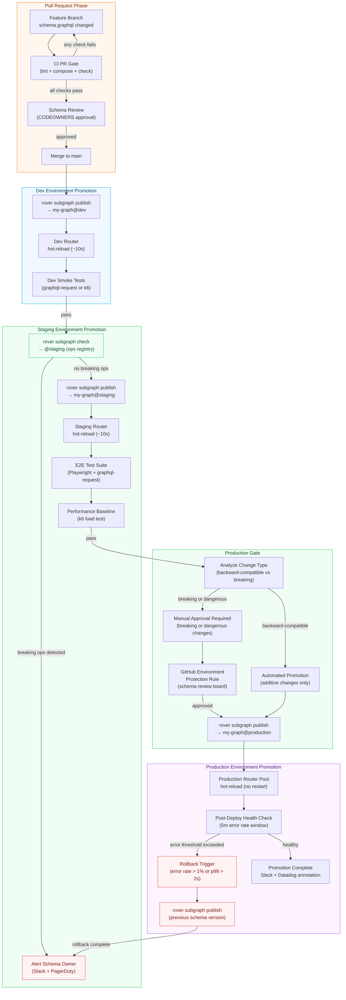

# CD Promotion — Schema Promotion Across Environments, Zero-Downtime Deployments, and Rollback

> Schema promotion is not deployment. Deploying a service replaces running code; promoting a schema tells the router which fields exist and how to plan queries. The Apollo Router hot-reloads supergraph configuration without dropping a single connection. That property changes everything about how you think about GraphQL schema changes in production — if the promotion is safe, it can be continuous.

---

## Learning Objectives

- [ ] Understand the distinction between schema promotion and service deployment, and why they require separate pipelines
- [ ] Design a multi-environment promotion pipeline: dev → staging → production
- [ ] Implement schema-first and service-first deployment coupling strategies and understand when to use each
- [ ] Configure Apollo Router hot-reload for zero-downtime schema promotions
- [ ] Define rollback triggers, rollback detection, and automated rollback workflows
- [ ] Implement promotion gates: automated for backward-compatible changes, human-approval for breaking changes
- [ ] Observe the health of a schema promotion using Apollo GraphOS metrics and router structured logs

---

## Overview

A schema promotion pipeline governs the lifecycle of a GraphQL schema change from a developer's pull request through to production. It is distinct from the CI pipeline (which validates schema changes) and from the service deployment pipeline (which ships resolver implementations). These three pipelines are related but operate on different cadences and artifacts.

The schema promotion pipeline's artifact is the subgraph SDL — a text file. Publishing it to a registry is instantaneous. The router picks up the change in seconds. This speed creates an opportunity that traditional service deployment pipelines lack: schema changes can be promoted through environments without a service restart, a container build, or a load balancer reconfiguration. The promotion pipeline is as fast as you make it.

The challenge is coupling. A schema change that adds a new field `User.loyaltyPoints` is safe to promote before the resolver implementing that field is deployed — clients that request the field will receive `null`, which is a valid response for a nullable field. A schema change that removes a field is only safe to promote after all clients have stopped requesting it. A schema change that changes a field's type must be coordinated with both the resolver implementation and every client that reads that field.

Understanding these coupling patterns and building pipeline logic around them is the core engineering problem of CD promotion for GraphQL.

---

## Architecture

### CD Promotion Pipeline Flowchart



---

## Core Concepts

### Schema Promotion vs Service Deployment

These two pipelines are often confused because in a monolith, they are the same thing. In a federated GraphQL architecture, they are distinct:

| Dimension | Schema Promotion | Service Deployment |
|---|---|---|
| Artifact | Subgraph SDL (text) | Container image |
| Speed | Seconds (router hot-reload) | Minutes (container start) |
| Rollback | Publish previous SDL | Redeploy previous image |
| Impact | All clients using the router | Only traffic to that service |
| Coordination needed | Clients + other subgraphs | Load balancer + health checks |
| Registry | Apollo GraphOS schema registry | Container registry (ECR, GCR) |

Because promotions are fast, you can decouple schema changes from service deployments. This is called **dark launching**: publish a schema change that adds new fields before the resolver code ships, trusting that clients will not request those fields yet. When the service deployment is ready, the fields start resolving with real data.

### Deployment Coupling Strategies

**Schema-First (additive changes)**

Schema is promoted before the implementing resolver is deployed. Safe only for additive changes (new nullable fields, new types, new arguments with defaults). The router will return `null` for unresolved fields — acceptable if the schema change is non-breaking and clients handle nullable fields correctly.

Use when:
- Adding new optional fields
- Adding new query root fields behind a feature flag
- Extending existing types with nullable additions
- Dark launching features before client teams have built the UI

```graphql
# Schema published to @production:
type User {
  id: ID!
  email: String!
  loyaltyPoints: Int  # Nullable — resolves to null until resolver ships
}
```

**Service-First (breaking or type-change)**

Resolver code is deployed and verified before the schema change is promoted. Safe for any change type, required for breaking changes. The implementation exists before clients can query it.

Use when:
- Removing or renaming fields
- Changing field types
- Making nullable fields non-null
- Any change that alters the runtime behavior of existing operations

**Coupled (synchronized)**

Schema promotion and service deployment happen in the same pipeline step. This is the simplest model and appropriate for small teams or single-service architectures. It sacrifices the ability to dark launch but eliminates the coordination overhead.

Use when:
- The resolver and schema are in the same repository
- The team does not need dark launching
- The change is atomic and cannot be safely separated

---

## Apollo Router Hot-Reload

The Apollo Router polls Apollo GraphOS for supergraph configuration updates. When a new schema is published to a variant, the router fetches the updated supergraph SDL and applies it without restarting or dropping connections.

### How Hot-Reload Works

1. `rover subgraph publish` sends the new SDL to Apollo GraphOS.
2. Apollo GraphOS recomposes the supergraph using the new SDL plus all currently-published peer subgraph schemas.
3. Apollo GraphOS makes the new supergraph configuration available at the router's uplink endpoint.
4. Each Apollo Router instance polls the uplink and detects the new configuration version.
5. The router loads the new query plan configuration in memory.
6. Subsequent requests use the new query plan; in-flight requests complete against the previous configuration.

The poll interval is configured in `router.yaml`:

```yaml
# router.yaml
supergraph:
  # Poll Apollo GraphOS for new supergraph config every 10 seconds
  # Default is 10s; reduce for faster propagation, increase for reduced GraphOS API calls
  poll_interval: 10s

  # Alternatively, for managed federation (recommended for production):
  # The router subscribes to a long-polling uplink rather than periodic polling.
  # No configuration needed — managed federation is the default for GraphOS-connected routers.
```

### Verifying Hot-Reload in CI

```bash
# After rover subgraph publish, poll the router's health endpoint until
# it reports the new schema version

EXPECTED_SCHEMA_HASH="<sha256 of new supergraph SDL>"
ROUTER_URL="${STAGING_ROUTER_URL}"
MAX_WAIT=60  # seconds
INTERVAL=5
ELAPSED=0

echo "Waiting for router to pick up new schema..."

while [ $ELAPSED -lt $MAX_WAIT ]; do
  # Query the router's schema hash via the __Schema introspection or a custom header
  CURRENT_HASH=$(curl -s \
    -H "Content-Type: application/json" \
    -H "apollographql-client-name: ci-health-check" \
    -d '{"query":"{ __schema { queryType { name } } }"}' \
    "${ROUTER_URL}/graphql" \
    -D /tmp/response-headers.txt > /dev/null && \
    grep -i 'x-apollo-schema-version' /tmp/response-headers.txt | awk '{print $2}' | tr -d '\r')

  if [ "$CURRENT_HASH" = "$EXPECTED_SCHEMA_HASH" ]; then
    echo "Router has picked up new schema (hash: $CURRENT_HASH)"
    break
  fi

  echo "Router still on previous schema. Waiting ${INTERVAL}s... (${ELAPSED}s elapsed)"
  sleep $INTERVAL
  ELAPSED=$((ELAPSED + INTERVAL))
done

if [ $ELAPSED -ge $MAX_WAIT ]; then
  echo "Router did not pick up new schema within ${MAX_WAIT}s"
  exit 1
fi
```

### Router Configuration for Production Hot-Reload

```yaml
# router.yaml — production configuration
supergraph:
  poll_interval: 10s
  # Managed federation is the default and uses long-polling (more efficient than periodic)

# Expose schema version in response headers for observability
headers:
  all:
    response:
      - insert:
          name: x-apollo-schema-version
          value: "{apollo_router_schema_id}"

# Health check endpoint (used by load balancer and CI post-deploy checks)
health_check:
  enabled: true
  listen: 0.0.0.0:8088
  path: /health

# Readiness endpoint — returns 200 only when the router has a valid supergraph config
# Use this as the Kubernetes readiness probe
# (router returns 503 during initial config fetch)
sandbox:
  enabled: false

telemetry:
  # Structured logs include schema_id for correlation
  tracing:
    common:
      resource:
        "apollo.router.schema.id": "{apollo_router_schema_id}"
```

### Kubernetes Deployment for Zero-Downtime

```yaml
# k8s/apollo-router-deployment.yaml
apiVersion: apps/v1
kind: Deployment
metadata:
  name: apollo-router
  namespace: graphql-platform
spec:
  replicas: 3
  strategy:
    type: RollingUpdate
    rollingUpdate:
      maxSurge: 1
      maxUnavailable: 0   # Never remove a pod until the new one is ready
  selector:
    matchLabels:
      app: apollo-router
  template:
    metadata:
      labels:
        app: apollo-router
    spec:
      containers:
        - name: apollo-router
          image: ghcr.io/apollographql/router:v1.49.0
          env:
            - name: APOLLO_KEY
              valueFrom:
                secretKeyRef:
                  name: apollo-graphos-credentials
                  key: apollo-key
            - name: APOLLO_GRAPH_REF
              value: "my-graph@production"
          args:
            - --config
            - /etc/router/router.yaml
          ports:
            - containerPort: 4000   # GraphQL endpoint
            - containerPort: 8088   # Health check endpoint
          readinessProbe:
            httpGet:
              path: /health
              port: 8088
            initialDelaySeconds: 5
            periodSeconds: 5
            failureThreshold: 3
          livenessProbe:
            httpGet:
              path: /health
              port: 8088
            initialDelaySeconds: 10
            periodSeconds: 10
            failureThreshold: 5
          resources:
            requests:
              cpu: 500m
              memory: 512Mi
            limits:
              cpu: 2000m
              memory: 2Gi
          volumeMounts:
            - name: router-config
              mountPath: /etc/router
      volumes:
        - name: router-config
          configMap:
            name: apollo-router-config
      terminationGracePeriodSeconds: 60   # Allow in-flight requests to complete
```

The key property of this deployment: when a new schema is published to Apollo GraphOS, the router pods hot-reload the configuration. No rolling restart of the deployment is needed. The Kubernetes deployment is only updated when the router binary itself needs to change (version upgrade).

---

## Real-World Implementation

### Complete CD Promotion Workflow

```yaml
# .github/workflows/schema-cd-promotion.yml
name: Schema CD Promotion

on:
  push:
    branches:
      - main
    paths:
      - 'subgraphs/products/**'
      - 'subgraphs/users/**'
      - 'subgraphs/inventory/**'

concurrency:
  # Serialize promotions for the same subgraph to prevent race conditions
  group: schema-promotion-${{ github.ref }}
  cancel-in-progress: false   # Never cancel a promotion already in progress

env:
  ROVER_VERSION: v0.26.0

jobs:
  # ── Detect which subgraphs changed ──────────────────────────────────────────
  detect-changes:
    name: "Detect Changed Subgraphs"
    runs-on: ubuntu-latest
    outputs:
      subgraphs: ${{ steps.changes.outputs.subgraphs }}

    steps:
      - uses: actions/checkout@v4
        with:
          fetch-depth: 2

      - name: Detect changed subgraphs
        id: changes
        run: |
          CHANGED=$(git diff --name-only HEAD~1 HEAD | \
            grep '^subgraphs/' | \
            cut -d'/' -f2 | \
            sort -u | \
            jq -R -s -c 'split("\n") | map(select(length > 0))')
          echo "subgraphs=$CHANGED" >> $GITHUB_OUTPUT
          echo "Changed subgraphs: $CHANGED"

  # ── Stage 1: Dev promotion (always automatic) ────────────────────────────────
  promote-dev:
    name: "Promote to Dev — ${{ matrix.subgraph }}"
    runs-on: ubuntu-latest
    needs: detect-changes
    if: needs.detect-changes.outputs.subgraphs != '[]'
    strategy:
      matrix:
        subgraph: ${{ fromJson(needs.detect-changes.outputs.subgraphs) }}
      fail-fast: false   # Promote all changed subgraphs independently

    steps:
      - uses: actions/checkout@v4

      - name: Install rover
        run: |
          curl -sSL "https://rover.apollo.dev/nix/${{ env.ROVER_VERSION }}" | sh
          echo "$HOME/.rover/bin" >> $GITHUB_PATH

      - name: Publish to dev
        env:
          APOLLO_KEY: ${{ secrets.APOLLO_KEY }}
        run: |
          SUBGRAPH="${{ matrix.subgraph }}"
          SCHEMA_PATH="subgraphs/${SUBGRAPH}/schema.graphql"
          ROUTING_URL="${{ secrets[format('DEV_ROUTING_URL_{0}', matrix.subgraph)] }}"

          rover subgraph publish "my-graph@dev" \
            --schema "$SCHEMA_PATH" \
            --name "$SUBGRAPH" \
            --routing-url "$ROUTING_URL"

          echo "Published $SUBGRAPH to @dev"

      - name: Wait for dev router hot-reload
        run: |
          echo "Waiting 15s for dev router to pick up new schema..."
          sleep 15

      - name: Run dev smoke tests
        env:
          DEV_GRAPHQL_URL: ${{ secrets.DEV_GRAPHQL_URL }}
        run: |
          # Run a lightweight set of smoke tests against the dev router
          npx ts-node scripts/smoke-test.ts \
            --url "$DEV_GRAPHQL_URL" \
            --subgraph "${{ matrix.subgraph }}" \
            --env dev

  # ── Stage 2: Staging promotion (check → publish → E2E → perf) ───────────────
  promote-staging:
    name: "Promote to Staging — ${{ matrix.subgraph }}"
    runs-on: ubuntu-latest
    needs: promote-dev
    strategy:
      matrix:
        subgraph: ${{ fromJson(needs.detect-changes.outputs.subgraphs) }}
      fail-fast: false
    environment: staging

    steps:
      - uses: actions/checkout@v4

      - name: Install rover
        run: |
          curl -sSL "https://rover.apollo.dev/nix/${{ env.ROVER_VERSION }}" | sh
          echo "$HOME/.rover/bin" >> $GITHUB_PATH

      - name: Check against staging operations registry
        id: staging-check
        env:
          APOLLO_KEY: ${{ secrets.APOLLO_KEY }}
        run: |
          SUBGRAPH="${{ matrix.subgraph }}"
          SCHEMA_PATH="subgraphs/${SUBGRAPH}/schema.graphql"

          set +e
          RESULT=$(rover subgraph check "my-graph@staging" \
            --schema "$SCHEMA_PATH" \
            --name "$SUBGRAPH" \
            --format json 2>&1)
          ROVER_EXIT=$?

          BREAKING=$(echo "$RESULT" | jq '[
            .data.composition.checkSchemaResult.diffToPrevious.changes[]?
            | select(.severity == "FAILURE")
          ] | length' 2>/dev/null || echo 0)

          echo "breaking=$BREAKING" >> $GITHUB_OUTPUT
          echo "rover_exit=$ROVER_EXIT" >> $GITHUB_OUTPUT
          echo "$RESULT" > staging-check-result.json

          # Always succeed here — the breaking count gates the next decision
          exit 0

      - name: Fail if breaking changes detected in staging ops
        if: steps.staging-check.outputs.breaking != '0'
        run: |
          echo "Breaking changes detected in staging operations registry."
          echo "Affected operations:"
          jq -r '.data.composition.checkSchemaResult.diffToPrevious.changes[]?
            | select(.severity == "FAILURE")
            | "- " + .description' staging-check-result.json
          echo ""
          echo "Schema cannot be promoted to staging. Coordinate with affected client teams."
          exit 1

      - name: Publish to staging
        env:
          APOLLO_KEY: ${{ secrets.APOLLO_KEY }}
        run: |
          SUBGRAPH="${{ matrix.subgraph }}"
          ROUTING_URL="${{ secrets[format('STAGING_ROUTING_URL_{0}', matrix.subgraph)] }}"

          rover subgraph publish "my-graph@staging" \
            --schema "subgraphs/${SUBGRAPH}/schema.graphql" \
            --name "$SUBGRAPH" \
            --routing-url "$ROUTING_URL"

      - name: Wait for staging router hot-reload
        run: sleep 20

      - name: Run E2E tests against staging
        env:
          STAGING_GRAPHQL_URL: ${{ secrets.STAGING_GRAPHQL_URL }}
        run: |
          npm run test:e2e -- \
            --env staging \
            --subgraph "${{ matrix.subgraph }}"

      - name: Run performance baseline check
        env:
          STAGING_GRAPHQL_URL: ${{ secrets.STAGING_GRAPHQL_URL }}
        run: |
          # k6 load test — fail if p99 latency increases > 15% vs baseline
          k6 run \
            --env GRAPHQL_URL="$STAGING_GRAPHQL_URL" \
            --env SUBGRAPH="${{ matrix.subgraph }}" \
            --env THRESHOLD_P99_INCREASE=15 \
            scripts/k6/smoke-load.js

  # ── Stage 3: Production promotion gate ───────────────────────────────────────
  analyze-production-change:
    name: "Analyze Production Change Type"
    runs-on: ubuntu-latest
    needs: promote-staging
    outputs:
      has_breaking: ${{ steps.analyze.outputs.has_breaking }}
      has_dangerous: ${{ steps.analyze.outputs.has_dangerous }}
      change_summary: ${{ steps.analyze.outputs.change_summary }}

    steps:
      - uses: actions/checkout@v4

      - name: Install rover
        run: |
          curl -sSL "https://rover.apollo.dev/nix/${{ env.ROVER_VERSION }}" | sh
          echo "$HOME/.rover/bin" >> $GITHUB_PATH

      - uses: actions/setup-node@v4
        with:
          node-version: '20'
          cache: 'npm'

      - run: npm ci

      - name: Analyze change type against production
        id: analyze
        env:
          APOLLO_KEY: ${{ secrets.APOLLO_KEY }}
        run: |
          set +e
          BREAKING=0
          DANGEROUS=0
          SUMMARY=""

          for SUBGRAPH in ${{ join(fromJson(needs.detect-changes.outputs.subgraphs), ' ') }}; do
            SCHEMA_PATH="subgraphs/${SUBGRAPH}/schema.graphql"

            # Check against production operations registry
            RESULT=$(rover subgraph check "my-graph@production" \
              --schema "$SCHEMA_PATH" \
              --name "$SUBGRAPH" \
              --format json 2>&1)

            SUB_BREAKING=$(echo "$RESULT" | jq '[
              .data.composition.checkSchemaResult.diffToPrevious.changes[]?
              | select(.severity == "FAILURE")
            ] | length' 2>/dev/null || echo 0)

            # Fetch structural diff (Inspector) for dangerous changes
            git show origin/main~1:"$SCHEMA_PATH" > /tmp/prev-schema.graphql 2>/dev/null || \
              echo 'type Query { _empty: String }' > /tmp/prev-schema.graphql

            DIFF=$(npx @graphql-inspector/cli diff \
              /tmp/prev-schema.graphql "$SCHEMA_PATH" \
              --format json 2>/dev/null || echo '[]')

            SUB_DANGEROUS=$(echo "$DIFF" | jq '[.[] | select(.criticality.level == "DANGEROUS")] | length')

            BREAKING=$((BREAKING + SUB_BREAKING))
            DANGEROUS=$((DANGEROUS + SUB_DANGEROUS))
            SUMMARY="$SUMMARY $SUBGRAPH(breaking:$SUB_BREAKING,dangerous:$SUB_DANGEROUS)"
          done

          echo "has_breaking=$([ $BREAKING -gt 0 ] && echo 'true' || echo 'false')" >> $GITHUB_OUTPUT
          echo "has_dangerous=$([ $DANGEROUS -gt 0 ] && echo 'true' || echo 'false')" >> $GITHUB_OUTPUT
          echo "change_summary=$SUMMARY" >> $GITHUB_OUTPUT

          echo "Production change analysis: $SUMMARY"
          echo "Breaking: $BREAKING | Dangerous: $DANGEROUS"

  # ── Stage 4a: Automated production promotion (additive only) ─────────────────
  promote-production-auto:
    name: "Promote to Production (Automated)"
    runs-on: ubuntu-latest
    needs: [detect-changes, analyze-production-change]
    if: |
      needs.analyze-production-change.outputs.has_breaking == 'false' &&
      needs.analyze-production-change.outputs.has_dangerous == 'false'
    strategy:
      matrix:
        subgraph: ${{ fromJson(needs.detect-changes.outputs.subgraphs) }}

    steps:
      - uses: actions/checkout@v4

      - name: Install rover
        run: |
          curl -sSL "https://rover.apollo.dev/nix/${{ env.ROVER_VERSION }}" | sh
          echo "$HOME/.rover/bin" >> $GITHUB_PATH

      - name: Publish to production
        id: publish-prod
        env:
          APOLLO_KEY: ${{ secrets.APOLLO_KEY }}
        run: |
          SUBGRAPH="${{ matrix.subgraph }}"
          ROUTING_URL="${{ secrets[format('PROD_ROUTING_URL_{0}', matrix.subgraph)] }}"

          rover subgraph publish "my-graph@production" \
            --schema "subgraphs/${SUBGRAPH}/schema.graphql" \
            --name "$SUBGRAPH" \
            --routing-url "$ROUTING_URL"

          echo "subgraph=$SUBGRAPH" >> $GITHUB_OUTPUT
          echo "promoted_at=$(date -u +%Y-%m-%dT%H:%M:%SZ)" >> $GITHUB_OUTPUT

      - name: Wait for production router hot-reload
        run: |
          echo "Waiting 30s for production router to pick up new schema..."
          sleep 30

      - name: Post-deploy health check
        env:
          PROD_GRAPHQL_URL: ${{ secrets.PROD_GRAPHQL_URL }}
          DATADOG_API_KEY: ${{ secrets.DATADOG_API_KEY }}
        run: |
          # Run post-deploy health checks for 5 minutes
          # Fail if error rate exceeds 1% in any 30-second window
          npx ts-node scripts/post-deploy-health-check.ts \
            --url "$PROD_GRAPHQL_URL" \
            --subgraph "${{ matrix.subgraph }}" \
            --duration 300 \
            --error-threshold 0.01 \
            --p99-threshold 2000

      - name: Annotate Datadog with deployment event
        if: success()
        env:
          DATADOG_API_KEY: ${{ secrets.DATADOG_API_KEY }}
        run: |
          curl -s -X POST "https://api.datadoghq.com/api/v1/events" \
            -H "Content-Type: application/json" \
            -H "DD-API-KEY: $DATADOG_API_KEY" \
            -d "{
              \"title\": \"Schema promoted to production: ${{ matrix.subgraph }}\",
              \"text\": \"Subgraph: ${{ matrix.subgraph }}\nCommit: ${{ github.sha }}\nWorkflow: ${{ github.server_url }}/${{ github.repository }}/actions/runs/${{ github.run_id }}\",
              \"tags\": [\"env:production\", \"subgraph:${{ matrix.subgraph }}\", \"schema_promotion:true\"],
              \"alert_type\": \"info\"
            }"

      - name: Notify Slack — promotion complete
        if: success()
        uses: slackapi/slack-github-action@v1
        with:
          channel-id: 'graphql-schema-deployments'
          slack-message: |
            *Schema Promoted to Production* :rocket:
            Subgraph: `${{ matrix.subgraph }}`
            Change: ${{ needs.analyze-production-change.outputs.change_summary }}
            Commit: ${{ github.sha }}
            <${{ github.server_url }}/${{ github.repository }}/actions/runs/${{ github.run_id }}|View workflow>
        env:
          SLACK_BOT_TOKEN: ${{ secrets.SLACK_BOT_TOKEN }}

  # ── Stage 4b: Manual-approval production promotion (breaking/dangerous) ───────
  promote-production-manual:
    name: "Promote to Production (Manual Approval)"
    runs-on: ubuntu-latest
    needs: [detect-changes, analyze-production-change]
    if: |
      needs.analyze-production-change.outputs.has_breaking == 'true' ||
      needs.analyze-production-change.outputs.has_dangerous == 'true'
    environment: production   # GitHub environment with required reviewers (schema review board)
    strategy:
      matrix:
        subgraph: ${{ fromJson(needs.detect-changes.outputs.subgraphs) }}

    steps:
      - uses: actions/checkout@v4

      - name: Install rover
        run: |
          curl -sSL "https://rover.apollo.dev/nix/${{ env.ROVER_VERSION }}" | sh
          echo "$HOME/.rover/bin" >> $GITHUB_PATH

      - name: Display change summary before promotion
        run: |
          echo "=== BREAKING/DANGEROUS SCHEMA CHANGE — MANUAL APPROVAL REQUIRED ==="
          echo "Change summary: ${{ needs.analyze-production-change.outputs.change_summary }}"
          echo "This promotion has been approved by the schema review board."
          echo "Promoting to production now..."

      - name: Publish to production
        env:
          APOLLO_KEY: ${{ secrets.APOLLO_KEY }}
        run: |
          SUBGRAPH="${{ matrix.subgraph }}"
          ROUTING_URL="${{ secrets[format('PROD_ROUTING_URL_{0}', matrix.subgraph)] }}"

          rover subgraph publish "my-graph@production" \
            --schema "subgraphs/${SUBGRAPH}/schema.graphql" \
            --name "$SUBGRAPH" \
            --routing-url "$ROUTING_URL"

      - name: Wait for production router hot-reload
        run: sleep 30

      - name: Post-deploy health check (extended — breaking change)
        env:
          PROD_GRAPHQL_URL: ${{ secrets.PROD_GRAPHQL_URL }}
        run: |
          # Extended health check for breaking changes: 10 minutes, tighter thresholds
          npx ts-node scripts/post-deploy-health-check.ts \
            --url "$PROD_GRAPHQL_URL" \
            --subgraph "${{ matrix.subgraph }}" \
            --duration 600 \
            --error-threshold 0.005 \
            --p99-threshold 1500
```

---

## Rollback Triggers and Implementation

### Automated Rollback Script

```typescript
// scripts/post-deploy-health-check.ts
// Monitors error rate and p99 latency after a schema promotion
// Triggers rollback if thresholds are exceeded

import { parseArgs } from 'util';

interface HealthCheckOptions {
  url: string;
  subgraph: string;
  duration: number;        // seconds to monitor
  errorThreshold: number;  // fraction (0.01 = 1%)
  p99Threshold: number;    // milliseconds
}

const HEALTH_PROBE_QUERY = `
  query HealthCheck {
    __typename
  }
`;

async function measureRequestLatency(url: string): Promise<{
  ok: boolean;
  latencyMs: number;
  statusCode: number;
}> {
  const start = Date.now();
  try {
    const res = await fetch(url, {
      method: 'POST',
      headers: {
        'Content-Type': 'application/json',
        'apollographql-client-name': 'ci-post-deploy-health',
      },
      body: JSON.stringify({ query: HEALTH_PROBE_QUERY }),
      signal: AbortSignal.timeout(5000),
    });
    const latencyMs = Date.now() - start;
    const body = await res.json();
    const hasErrors = body.errors && body.errors.length > 0;
    return { ok: !hasErrors && res.ok, latencyMs, statusCode: res.status };
  } catch (err) {
    return { ok: false, latencyMs: Date.now() - start, statusCode: 0 };
  }
}

async function runHealthCheck(opts: HealthCheckOptions): Promise<void> {
  const endTime = Date.now() + opts.duration * 1000;
  const windowSize = 30; // seconds per rolling window
  const windowRequests: { ok: boolean; latencyMs: number }[] = [];

  console.log(`Starting ${opts.duration}s health check for ${opts.subgraph}`);
  console.log(`Error threshold: ${opts.errorThreshold * 100}% | p99 threshold: ${opts.p99Threshold}ms`);

  while (Date.now() < endTime) {
    const result = await measureRequestLatency(opts.url);
    windowRequests.push({ ok: result.ok, latencyMs: result.latencyMs });

    // Keep only the last windowSize seconds of data
    const cutoff = Date.now() - windowSize * 1000;
    while (windowRequests.length > 100) {
      windowRequests.shift();
    }

    const errorRate = windowRequests.filter(r => !r.ok).length / windowRequests.length;
    const latencies = windowRequests.map(r => r.latencyMs).sort((a, b) => a - b);
    const p99 = latencies[Math.floor(latencies.length * 0.99)] || 0;

    if (errorRate > opts.errorThreshold) {
      console.error(`ERROR THRESHOLD EXCEEDED: ${(errorRate * 100).toFixed(2)}% (threshold: ${opts.errorThreshold * 100}%)`);
      console.error('Triggering rollback...');
      process.exit(1);  // Exit code 1 triggers the rollback job in CI
    }

    if (p99 > opts.p99Threshold) {
      console.error(`P99 THRESHOLD EXCEEDED: ${p99}ms (threshold: ${opts.p99Threshold}ms)`);
      console.error('Triggering rollback...');
      process.exit(1);
    }

    const elapsed = opts.duration - Math.ceil((endTime - Date.now()) / 1000);
    console.log(`[${elapsed}s] OK — error rate: ${(errorRate * 100).toFixed(2)}%, p99: ${p99}ms`);

    await new Promise(r => setTimeout(r, 1000));
  }

  console.log('Health check passed — schema promotion is stable.');
}

const { values } = parseArgs({
  options: {
    url: { type: 'string' },
    subgraph: { type: 'string' },
    duration: { type: 'string', default: '300' },
    'error-threshold': { type: 'string', default: '0.01' },
    'p99-threshold': { type: 'string', default: '2000' },
  },
});

runHealthCheck({
  url: values.url!,
  subgraph: values.subgraph!,
  duration: parseInt(values.duration!),
  errorThreshold: parseFloat(values['error-threshold']!),
  p99Threshold: parseInt(values['p99-threshold']!),
}).catch(err => {
  console.error(err);
  process.exit(1);
});
```

### Automated Rollback Job

```yaml
# .github/workflows/schema-rollback.yml
name: Schema Rollback

on:
  workflow_dispatch:
    inputs:
      subgraph:
        description: 'Subgraph to roll back'
        required: true
        type: choice
        options:
          - products
          - users
          - inventory
          - orders
          - payments
      target_variant:
        description: 'Variant to roll back'
        required: true
        type: choice
        default: 'production'
        options:
          - production
          - staging
      commits_back:
        description: 'How many schema commits to roll back (default: 1)'
        required: false
        default: '1'
        type: string
      reason:
        description: 'Reason for rollback (for audit log)'
        required: true
        type: string

jobs:
  rollback:
    name: "Schema Rollback — ${{ inputs.subgraph }} → ${{ inputs.target_variant }}"
    runs-on: ubuntu-latest
    environment: ${{ inputs.target_variant }}   # Requires approval for production rollbacks

    steps:
      - uses: actions/checkout@v4
        with:
          fetch-depth: 20   # Enough history to find previous schema versions

      - name: Install rover
        run: |
          curl -sSL "https://rover.apollo.dev/nix/${{ env.ROVER_VERSION }}" | sh
          echo "$HOME/.rover/bin" >> $GITHUB_PATH

      - name: Find rollback schema version
        id: find-schema
        run: |
          SUBGRAPH="${{ inputs.subgraph }}"
          SCHEMA_PATH="subgraphs/${SUBGRAPH}/schema.graphql"
          COMMITS_BACK="${{ inputs.commits_back }}"

          # List commits that modified this schema file
          echo "=== Schema Commit History ==="
          git log --oneline "$SCHEMA_PATH" | head -10

          # Find the target commit (N commits back from the most recent change)
          ROLLBACK_REF=$(git log --oneline "$SCHEMA_PATH" | \
            sed -n "${COMMITS_BACK}p" | \
            cut -d' ' -f1)

          if [ -z "$ROLLBACK_REF" ]; then
            echo "Could not find a schema version $COMMITS_BACK commits back"
            exit 1
          fi

          ROLLBACK_MSG=$(git log --oneline "$SCHEMA_PATH" | sed -n "${COMMITS_BACK}p")
          echo "Rolling back to: $ROLLBACK_MSG"

          git show "${ROLLBACK_REF}:${SCHEMA_PATH}" > rollback-schema.graphql

          echo "rollback_ref=$ROLLBACK_REF" >> $GITHUB_OUTPUT
          echo "rollback_msg=$ROLLBACK_MSG" >> $GITHUB_OUTPUT

      - name: Show diff of rollback schema
        run: |
          echo "=== Schema that will be published (rolled back to) ==="
          npx @graphql-inspector/cli diff \
            "subgraphs/${{ inputs.subgraph }}/schema.graphql" \
            rollback-schema.graphql \
            2>/dev/null || true

      - name: Publish rollback schema
        env:
          APOLLO_KEY: ${{ secrets.APOLLO_KEY }}
        run: |
          SUBGRAPH="${{ inputs.subgraph }}"
          VARIANT="${{ inputs.target_variant }}"
          ROUTING_URL="${{ secrets[format('{0}_ROUTING_URL_{1}', upper(inputs.target_variant), inputs.subgraph)] }}"

          rover subgraph publish "my-graph@${VARIANT}" \
            --schema rollback-schema.graphql \
            --name "$SUBGRAPH" \
            --routing-url "$ROUTING_URL"

          echo "Rollback published successfully"

      - name: Wait for router to pick up rollback schema
        run: sleep 30

      - name: Verify rollback health
        env:
          PROD_GRAPHQL_URL: ${{ secrets.PROD_GRAPHQL_URL }}
        run: |
          npx ts-node scripts/post-deploy-health-check.ts \
            --url "$PROD_GRAPHQL_URL" \
            --subgraph "${{ inputs.subgraph }}" \
            --duration 120 \
            --error-threshold 0.01 \
            --p99-threshold 2000

      - name: Audit log rollback
        run: |
          echo "=== ROLLBACK AUDIT LOG ===" >> rollback-audit.log
          echo "Timestamp: $(date -u +%Y-%m-%dT%H:%M:%SZ)" >> rollback-audit.log
          echo "Subgraph: ${{ inputs.subgraph }}" >> rollback-audit.log
          echo "Variant: ${{ inputs.target_variant }}" >> rollback-audit.log
          echo "Rolled back to commit: ${{ steps.find-schema.outputs.rollback_ref }}" >> rollback-audit.log
          echo "Rolled back to: ${{ steps.find-schema.outputs.rollback_msg }}" >> rollback-audit.log
          echo "Initiated by: ${{ github.actor }}" >> rollback-audit.log
          echo "Reason: ${{ inputs.reason }}" >> rollback-audit.log
          echo "Workflow run: ${{ github.server_url }}/${{ github.repository }}/actions/runs/${{ github.run_id }}" >> rollback-audit.log

      - uses: actions/upload-artifact@v4
        with:
          name: rollback-audit-log
          path: rollback-audit.log
          retention-days: 365   # Retain rollback audits for 1 year

      - name: Notify Slack — rollback complete
        if: always()
        uses: slackapi/slack-github-action@v1
        with:
          channel-id: 'graphql-schema-alerts'
          slack-message: |
            *Schema Rollback Completed* :rotating_light:
            Subgraph: `${{ inputs.subgraph }}`
            Variant: `${{ inputs.target_variant }}`
            Rolled back to: `${{ steps.find-schema.outputs.rollback_msg }}`
            Initiated by: ${{ github.actor }}
            Reason: ${{ inputs.reason }}
            <${{ github.server_url }}/${{ github.repository }}/actions/runs/${{ github.run_id }}|View workflow>
        env:
          SLACK_BOT_TOKEN: ${{ secrets.SLACK_BOT_TOKEN }}
```

---

## Production Considerations

### Performance

Schema promotion is fast because the artifact is small (SDL text) and the router hot-reloads without dropping connections. The bottlenecks in the promotion pipeline are:

- **E2E tests in staging**: the slowest gate. Keep the E2E suite under 5 minutes by running tests in parallel (`--workers 4` in Playwright) and selecting a representative subset rather than every test.
- **Post-deploy health check duration**: 5 minutes is the minimum recommended window. For breaking changes, 10 minutes provides more confidence at the cost of pipeline time.
- **Rover CLI startup time**: rover downloads and caches its binary. Cache `~/.rover` between CI runs using `actions/cache` with a key on `${{ env.ROVER_VERSION }}`.

```yaml
- uses: actions/cache@v4
  with:
    path: ~/.rover
    key: rover-bin-${{ env.ROVER_VERSION }}
```

### Security

- Use separate `APOLLO_KEY` secrets for each environment (`APOLLO_KEY_DEV`, `APOLLO_KEY_STAGING`, `APOLLO_KEY_PROD`). If the dev key is compromised, it cannot publish to production.
- Scope production keys to "Subgraph Publish" permission only — not admin or key management permissions.
- Require GitHub environment protection rules for the `production` environment: named approvers (schema review board), deployment branch restrictions (only `main`), and a wait timer (0-30 minutes for last-chance review).
- Store `rover subgraph publish` outputs as GitHub Actions artifacts with 90-day retention for audit trails. Each promotion creates an immutable record of what was published, when, and by whom.

### Scaling

For organizations with 50+ subgraphs in a monorepo, the matrix strategy becomes unwieldy. Migrate to a workflow that dispatches subgraph-specific child workflows:

```yaml
# Dispatch individual promotion workflows per changed subgraph
- name: Dispatch per-subgraph promotions
  uses: actions/github-script@v7
  with:
    script: |
      const subgraphs = JSON.parse('${{ needs.detect-changes.outputs.subgraphs }}');
      for (const subgraph of subgraphs) {
        await github.rest.actions.createWorkflowDispatch({
          owner: context.repo.owner,
          repo: context.repo.repo,
          workflow_id: `promote-subgraph-${subgraph}.yml`,
          ref: 'main',
          inputs: { commit_sha: context.sha },
        });
      }
```

### Observability

Instrument the promotion pipeline with:

1. **Datadog deployment events**: annotate your error rate and latency dashboards with schema promotion events. This makes it trivial to correlate a latency spike with a schema change.

2. **Apollo GraphOS schema history**: every `rover subgraph publish` is recorded in Apollo GraphOS with the publisher identity, timestamp, and SDL. This is your primary audit trail.

3. **Structured CI logs**: emit JSON logs from the post-deploy health check script. Forward them to your log aggregation system (Datadog Logs, Splunk) for trend analysis.

4. **Rollback rate metric**: track how often schema promotions require rollback. A rollback rate above 5% indicates that the staging validation is insufficient. Invest in more comprehensive E2E coverage or longer health check windows.

---

## Best Practices

1. **Never use `--force` with `rover subgraph publish` in any automated pipeline.** The `--force` flag bypasses composition validation. There is no scenario in which bypassing composition is correct in a pipeline — if composition fails, the pipeline should fail loudly, not silently ship a potentially-broken schema.

2. **Separate the promotion pipeline from the deployment pipeline using repository dispatch events.** When a service deployment is complete, it fires a `repository_dispatch` event that triggers the schema promotion pipeline. This keeps the two pipelines decoupled while maintaining a clear dependency signal.

3. **Make rollback a one-click operation.** The `workflow_dispatch` rollback workflow accomplishes this. The on-call engineer should be able to roll back a schema in under 2 minutes, including manual approval. Drill this quarterly — rollback drills are as important as disaster recovery drills.

4. **Serialize concurrent promotions per variant.** Two simultaneous promotions to production (from two different PRs merged within seconds of each other) can cause a race condition where the second promotion overwrites the first. Use `concurrency` with `cancel-in-progress: false` at the variant level.

5. **Record the exact schema hash published to production.** Use `rover subgraph fetch` after publishing to retrieve and hash the schema that is actually in the registry. Compare this hash to the hash of the schema file in git. If they differ, the publication silently changed the schema (extremely rare, but auditable).

---

## Anti-Patterns

**Coupling schema promotion to service deployment as a post-deploy hook.** If the service deployment fails and rolls back, but the schema promotion already ran, the schema is out of sync with the running service. Treat schema promotion as a separate, independently-controllable pipeline with its own success and failure paths.

**Using a single variant for all environments.** A single variant means dev, staging, and prod operations all affect the same operations registry. Dev testing introduces noise into the production operations registry, causing `rover subgraph check` to report false positives (dev operations that use fields no production client uses).

**Not waiting for router hot-reload before running post-deploy health checks.** A health check that runs immediately after `rover subgraph publish` will query the router before it has picked up the new schema. The health check will pass (against the old schema) while the router is still transitioning. Wait at least 15 seconds (dev/staging) or 30 seconds (production) before checking.

**Automatically promoting all changes to production without a health check window.** A schema change that removes a nullable field will not cause immediate errors — it will cause errors when clients that used to receive data for that field now receive `null`. This is not detectable in a health probe; it requires an extended monitoring window against real traffic.

---

## Operational Notes

- The `rover subgraph publish` command is idempotent. Publishing the same schema to the same variant twice is a no-op. This makes it safe to re-run promotion workflows on the same commit without side effects.
- If `rover subgraph publish` succeeds but the router does not pick up the new schema within 60 seconds, check the Apollo GraphOS uplink endpoint (`https://uplink.api.apollographql.com`). Router connectivity issues are the most common cause of delayed hot-reload.
- Apollo GraphOS enforces a rate limit on schema publications: 1,000 publications per hour per graph. For very active monorepos, you may need to request a limit increase or batch multiple subgraph publications using `rover supergraph publish` (publishes the entire composed schema in one operation).
- Use `rover subgraph fetch my-graph@production --name products` to retrieve the currently-published schema for a subgraph. This is the authoritative source — not the schema file in git, which may have uncommitted local changes.

---

## References

- [rover subgraph publish documentation](https://www.apollographql.com/docs/rover/commands/subgraphs/#subgraph-publish) — all flags, authentication, and error handling for the publish command
- [Apollo Router hot-reload configuration](https://www.apollographql.com/docs/router/configuration/overview/) — `poll_interval` and managed federation configuration
- [GitHub Actions environment protection rules](https://docs.github.com/en/actions/managing-workflow-runs-and-deployments/managing-deployments/managing-environments-for-deployment) — configuring required reviewers and deployment branch policies
- [Apollo GraphOS schema management](https://www.apollographql.com/docs/graphos/schema-management/) — schema registry, variant configuration, and publication history
- [k6 GraphQL load testing](https://grafana.com/blog/2020/09/02/how-to-use-k6-to-test-graphql-apis/) — performance baseline checks in the promotion pipeline

---

## Related Topics

- [01-ci-pipeline-design.md](./01-ci-pipeline-design.md) — the PR gate that validates schema changes before they enter the promotion pipeline
- [03-preview-environments.md](./03-preview-environments.md) — ephemeral environments for PR-scoped testing that sit before the dev stage of this pipeline
- [../../07-federation/README.md](../../07-federation/README.md) — federation concepts and `rover supergraph compose` underlying the promotion pipeline
- [../../10-schema-validation/02-breaking-change-detection.md](../../10-schema-validation/02-breaking-change-detection.md) — rover subgraph check and the operations registry consulted at each promotion gate
- [../../10-schema-validation/03-contract-validation.md](../../10-schema-validation/03-contract-validation.md) — contract validation that runs before any promotion stage
