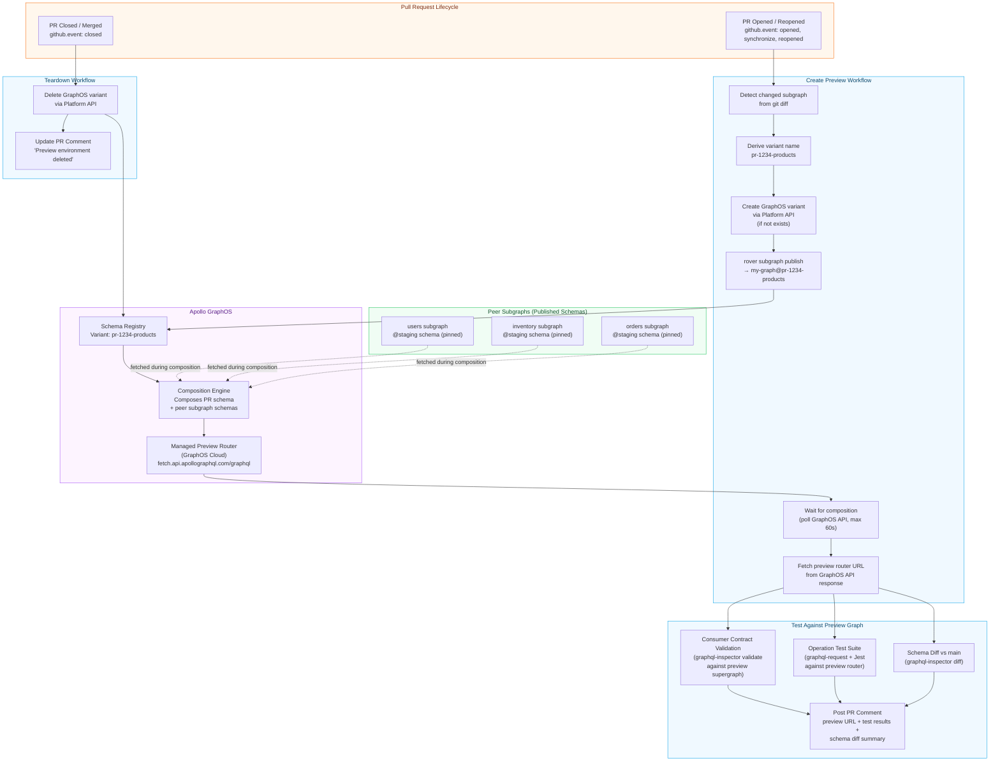

# Preview Environments — Ephemeral Supergraphs per Pull Request

> Every pull request is a hypothesis: "this schema change is safe and correct." A preview environment lets you test that hypothesis against a real, fully-composed supergraph before a single line of the hypothesis touches the main branch. The environment exists for the life of the PR and is destroyed when the PR closes. No shared staging environment, no coordination with other teams, no test pollution.

---

## Learning Objectives

- [ ] Understand the ephemeral graph concept: one Apollo GraphOS variant (or GraphQL Hive target) per pull request
- [ ] Spin up a temporary supergraph using rover, GraphOS managed federation, and GitHub Actions
- [ ] Configure preview schema routing for isolated query testing against the preview graph
- [ ] Run the full operation test suite against the preview supergraph schema
- [ ] Automate teardown via GitHub Actions PR lifecycle events (`closed`, `merged`)
- [ ] Understand the lifecycle, cost, and operational boundaries of preview environments at scale
- [ ] Implement the GraphQL Hive equivalent for teams not using Apollo GraphOS

---

## Overview

A preview environment is a complete, ephemeral supergraph — composed of the proposed subgraph schema from the pull request and the current schemas of all other subgraphs — that exists exclusively for the duration of that PR. It is created on the first push to the PR and destroyed when the PR is merged or closed.

The value proposition is isolation. Without preview environments, every PR that touches a subgraph schema must be tested against a shared staging variant. This creates three problems. First, two concurrent PRs that both change the same subgraph's schema cannot coexist in staging without one overwriting the other. Second, a broken staging environment (from any source) blocks all PR testing. Third, engineers cannot iterate rapidly on schema changes without polluting the staging operations registry with noise.

Preview environments solve all three problems by giving each PR its own graph variant. The preview variant is a full Apollo GraphOS variant: it composes the proposed schema with all peer subgraph schemas, it can be queried by any client that has the preview URL and the appropriate headers, and it participates in Apollo GraphOS's schema check history.

The operational model requires Apollo GraphOS to have variant creation available via API (or a similar feature in GraphQL Hive for self-hosted stacks). The GitHub Actions workflow creates the variant on PR open, publishes schemas on each push, runs tests against the preview graph, and deletes the variant on PR close.

---

## Architecture

### Preview Environment Lifecycle



---

## Core Concepts

### The Ephemeral Variant Model

Apollo GraphOS variants are lightweight. Creating a variant does not provision infrastructure — it creates a named configuration in the schema registry. The Apollo Router instances associated with a variant are either managed (GraphOS Cloud provides a preview endpoint) or self-hosted (you deploy a router container that connects to the variant).

For preview environments, the managed endpoint model is preferable: GraphOS provides a preview query endpoint (`https://graphql.api.apollographql.com/api/graphql`) authenticated with a graph API key scoped to the preview variant. No router infrastructure is needed per PR.

For self-hosted stacks, the alternative is to use a shared preview router that accepts a `X-Graph-Ref` header (or equivalent) to select which variant configuration to use. This requires custom router middleware but avoids the per-PR infrastructure cost.

### Variant Naming Convention

Preview variants must be uniquely named, short enough for URL usage, and parseable for automated teardown. A reliable convention:

```
pr-{PR_NUMBER}-{SUBGRAPH_NAME}

Examples:
  pr-1234-products
  pr-891-users
  pr-2047-inventory
```

This convention allows the teardown workflow to derive the variant name from the PR number and subgraph name without storing any state.

### Peer Subgraph Schema Strategy

A preview variant composes the PR's proposed schema with peer subgraph schemas. The question is: which version of the peer schemas should the preview use?

**Option A — Peer schemas from @staging (recommended)**: The preview variant uses the currently-published staging schemas for all peers. This mirrors what the PR would look like after merging to staging. It is the most realistic test environment.

**Option B — Peer schemas from @production**: More conservative. The preview tests the PR schema against production-state peers. Useful for detecting issues that would affect production even if staging has diverged.

**Option C — Peer schemas from their own PR branches**: If multiple subgraph PRs are open simultaneously and need to be tested together, fetch peer schemas from their respective preview variants. This is the "composed preview" pattern and requires explicit coordination between PRs.

The supergraph.yaml for the preview variant specifies peer subgraphs via `subgraph_url` with the staging variant:

```yaml
# supergraph-preview.yaml (used for preview composition)
federation_version: =2.6.0

subgraphs:
  products:
    routing_url: http://products.internal/graphql
    schema:
      file: ./subgraphs/products/schema.graphql   # PR branch schema

  users:
    routing_url: http://users.internal/graphql
    schema:
      subgraph_url: https://my-graph.api.apollographql.com/api/graphql
      graphref: my-graph@staging                  # Peer schema from staging
      subgraph_name: users

  inventory:
    routing_url: http://inventory.internal/graphql
    schema:
      subgraph_url: https://my-graph.api.apollographql.com/api/graphql
      graphref: my-graph@staging
      subgraph_name: inventory
```

### Query Testing Against the Preview Graph

The preview router endpoint accepts GraphQL operations. The test suite sends operations to the preview endpoint and asserts on the response structure. Because the preview router is composed from real schemas, it validates:

1. That the proposed schema composes correctly with peers.
2. That the proposed schema is structurally valid (all referenced types exist).
3. That consumer contract operations execute without schema validation errors.
4. That introspection returns the expected schema shape.

The preview router does not execute resolvers against real backends — it composes the schema for query planning purposes. For full integration tests that require real data, you need a preview environment that also runs the subgraph service. This is possible (deploy a preview version of the service and connect it to the preview router) but significantly increases the infrastructure cost and complexity of the preview environment.

For schema validation purposes — which is the primary goal of preview environments — a schema-only preview (no resolver execution) is sufficient and dramatically simpler.

---

## Real-World Implementation

### GitHub Actions — Create Preview Environment

```yaml
# .github/workflows/preview-environment-create.yml
name: Preview Environment — Create

on:
  pull_request:
    types: [opened, synchronize, reopened]
    paths:
      - 'subgraphs/**'
      - 'supergraph.yaml'

env:
  ROVER_VERSION: v0.26.0
  GRAPH_ID: my-graph

permissions:
  pull-requests: write
  contents: read

concurrency:
  # Only one preview creation workflow per PR at a time
  group: preview-env-${{ github.event.pull_request.number }}
  cancel-in-progress: true   # Cancel older runs if a new push arrives

jobs:
  detect-changes:
    name: "Detect Changed Subgraphs"
    runs-on: ubuntu-latest
    outputs:
      subgraphs: ${{ steps.changes.outputs.subgraphs }}
      has_changes: ${{ steps.changes.outputs.has_changes }}

    steps:
      - uses: actions/checkout@v4
        with:
          fetch-depth: 0

      - name: Detect changed subgraphs
        id: changes
        run: |
          BASE_REF="origin/${{ github.base_ref }}"
          CHANGED=$(git diff --name-only "$BASE_REF"...HEAD | \
            grep '^subgraphs/' | \
            cut -d'/' -f2 | \
            sort -u | \
            jq -R -s -c 'split("\n") | map(select(length > 0))')

          echo "subgraphs=$CHANGED" >> $GITHUB_OUTPUT
          HAS_CHANGES=$([ "$CHANGED" = "[]" ] && echo "false" || echo "true")
          echo "has_changes=$HAS_CHANGES" >> $GITHUB_OUTPUT
          echo "Changed subgraphs: $CHANGED"

  create-preview:
    name: "Create Preview — ${{ matrix.subgraph }}"
    runs-on: ubuntu-latest
    needs: detect-changes
    if: needs.detect-changes.outputs.has_changes == 'true'
    strategy:
      matrix:
        subgraph: ${{ fromJson(needs.detect-changes.outputs.subgraphs) }}
      fail-fast: false

    outputs:
      preview_url: ${{ steps.publish.outputs.preview_url }}
      variant_name: ${{ steps.derive-name.outputs.variant_name }}

    steps:
      - uses: actions/checkout@v4

      - name: Install rover
        run: |
          curl -sSL "https://rover.apollo.dev/nix/${{ env.ROVER_VERSION }}" | sh
          echo "$HOME/.rover/bin" >> $GITHUB_PATH

      - name: Derive preview variant name
        id: derive-name
        run: |
          # pr-1234-products (max 64 chars for GraphOS variant names)
          PR_NUM="${{ github.event.pull_request.number }}"
          SUBGRAPH="${{ matrix.subgraph }}"
          VARIANT="pr-${PR_NUM}-${SUBGRAPH}"

          # Truncate if needed (GraphOS variant name limit: 64 chars)
          if [ ${#VARIANT} -gt 64 ]; then
            VARIANT="${VARIANT:0:64}"
          fi

          echo "variant_name=$VARIANT" >> $GITHUB_OUTPUT
          echo "Preview variant name: $VARIANT"

      - name: Create GraphOS variant (if not exists)
        id: create-variant
        env:
          APOLLO_KEY: ${{ secrets.APOLLO_KEY }}
        run: |
          VARIANT="${{ steps.derive-name.outputs.variant_name }}"

          # Check if variant already exists
          EXISTING=$(rover graph list --format json 2>/dev/null | \
            jq -r --arg v "$VARIANT" '.data.variants[]? | select(.name == $v) | .name' || echo "")

          if [ -n "$EXISTING" ]; then
            echo "Variant $VARIANT already exists — reusing"
            echo "variant_created=false" >> $GITHUB_OUTPUT
          else
            echo "Creating variant: $VARIANT"
            # GraphOS Platform API: create a new variant
            curl -s -X POST \
              "https://graphql.api.apollographql.com/api/graphql" \
              -H "Content-Type: application/json" \
              -H "x-api-key: $APOLLO_KEY" \
              -d "{
                \"query\": \"mutation CreateVariant(\$graphId: ID!, \$variantName: String!) {
                  graph(id: \$graphId) {
                    createVariant(variantName: \$variantName) {
                      ... on GraphVariant { name }
                      ... on InvalidInputErrors { errors { message } }
                    }
                  }
                }\",
                \"variables\": {
                  \"graphId\": \"${{ env.GRAPH_ID }}\",
                  \"variantName\": \"$VARIANT\"
                }
              }" | tee /tmp/create-response.json

            CREATE_ERROR=$(jq -r '.data.graph.createVariant.errors[]?.message // empty' \
              /tmp/create-response.json)

            if [ -n "$CREATE_ERROR" ]; then
              echo "Failed to create variant: $CREATE_ERROR"
              exit 1
            fi

            echo "variant_created=true" >> $GITHUB_OUTPUT
            echo "Variant created: $VARIANT"
          fi

      - name: Publish proposed subgraph schema to preview variant
        id: publish
        env:
          APOLLO_KEY: ${{ secrets.APOLLO_KEY }}
        run: |
          SUBGRAPH="${{ matrix.subgraph }}"
          VARIANT="${{ steps.derive-name.outputs.variant_name }}"
          SCHEMA_PATH="subgraphs/${SUBGRAPH}/schema.graphql"

          # Determine routing URL (the actual subgraph service URL)
          # For preview, this can be the staging service URL
          ROUTING_URL="${{ secrets[format('STAGING_ROUTING_URL_{0}', matrix.subgraph)] }}"

          rover subgraph publish "${GRAPH_ID}@${VARIANT}" \
            --schema "$SCHEMA_PATH" \
            --name "$SUBGRAPH" \
            --routing-url "$ROUTING_URL"

          echo "Published $SUBGRAPH to variant $VARIANT"

          # Also publish peer subgraph schemas from staging
          for PEER_SUBGRAPH in users inventory orders; do
            if [ "$PEER_SUBGRAPH" = "$SUBGRAPH" ]; then
              continue  # Skip the subgraph we already published
            fi

            # Fetch peer schema from staging
            rover subgraph fetch "${GRAPH_ID}@staging" \
              --name "$PEER_SUBGRAPH" \
              --format sdl > "/tmp/${PEER_SUBGRAPH}-schema.graphql"

            PEER_ROUTING_URL="${{ secrets[format('STAGING_ROUTING_URL_{0}', env.PEER_SUBGRAPH)] }}"

            rover subgraph publish "${GRAPH_ID}@${VARIANT}" \
              --schema "/tmp/${PEER_SUBGRAPH}-schema.graphql" \
              --name "$PEER_SUBGRAPH" \
              --routing-url "${PEER_ROUTING_URL:-http://${PEER_SUBGRAPH}.internal/graphql}"

            echo "Published peer subgraph $PEER_SUBGRAPH to preview variant"
          done

          # Construct the preview router URL
          # GraphOS managed federation provides a query endpoint per variant
          PREVIEW_URL="https://graphql.api.apollographql.com/api/graphql"
          echo "preview_url=$PREVIEW_URL" >> $GITHUB_OUTPUT
          echo "Preview URL: $PREVIEW_URL (authenticated via APOLLO_KEY + variant header)"

      - name: Wait for preview graph composition
        id: wait-compose
        env:
          APOLLO_KEY: ${{ secrets.APOLLO_KEY }}
        run: |
          VARIANT="${{ steps.derive-name.outputs.variant_name }}"
          MAX_WAIT=90  # seconds
          INTERVAL=5
          ELAPSED=0

          echo "Waiting for preview variant ${VARIANT} to compose..."

          while [ $ELAPSED -lt $MAX_WAIT ]; do
            COMPOSE_STATUS=$(curl -s \
              "https://graphql.api.apollographql.com/api/graphql" \
              -H "Content-Type: application/json" \
              -H "x-api-key: $APOLLO_KEY" \
              -d "{
                \"query\": \"query GetVariantCompositionStatus(\$ref: ID!) {
                  variant(ref: \$ref) {
                    ... on GraphVariant {
                      latestPublication { publishedAt }
                      isComposable
                    }
                  }
                }\",
                \"variables\": {
                  \"ref\": \"${{ env.GRAPH_ID }}@${VARIANT}\"
                }
              }" | jq -r '.data.variant.isComposable // "false"')

            if [ "$COMPOSE_STATUS" = "true" ]; then
              echo "Preview variant composed successfully after ${ELAPSED}s"
              echo "composed=true" >> $GITHUB_OUTPUT
              break
            fi

            echo "Composition pending... (${ELAPSED}s elapsed)"
            sleep $INTERVAL
            ELAPSED=$((ELAPSED + INTERVAL))
          done

          if [ "$COMPOSE_STATUS" != "true" ]; then
            echo "Preview variant did not compose within ${MAX_WAIT}s"
            echo "composed=false" >> $GITHUB_OUTPUT
            # Don't exit 1 — post the failure to PR comment instead
          fi

      - name: Upload preview metadata
        run: |
          cat > preview-metadata.json << EOF
          {
            "pr_number": "${{ github.event.pull_request.number }}",
            "subgraph": "${{ matrix.subgraph }}",
            "variant": "${{ steps.derive-name.outputs.variant_name }}",
            "preview_url": "${{ steps.publish.outputs.preview_url }}",
            "composed": "${{ steps.wait-compose.outputs.composed }}",
            "created_at": "$(date -u +%Y-%m-%dT%H:%M:%SZ)",
            "commit_sha": "${{ github.sha }}"
          }
          EOF

      - uses: actions/upload-artifact@v4
        with:
          name: preview-metadata-${{ matrix.subgraph }}
          path: preview-metadata.json
          retention-days: 7

  run-preview-tests:
    name: "Test Against Preview Graph — ${{ matrix.subgraph }}"
    runs-on: ubuntu-latest
    needs: [detect-changes, create-preview]
    strategy:
      matrix:
        subgraph: ${{ fromJson(needs.detect-changes.outputs.subgraphs) }}
      fail-fast: false

    steps:
      - uses: actions/checkout@v4

      - uses: actions/setup-node@v4
        with:
          node-version: '20'
          cache: 'npm'

      - run: npm ci

      - name: Download preview metadata
        uses: actions/download-artifact@v4
        with:
          name: preview-metadata-${{ matrix.subgraph }}
          path: .

      - name: Run consumer contract validation against preview graph
        id: contract-test
        env:
          APOLLO_KEY: ${{ secrets.APOLLO_KEY }}
        run: |
          VARIANT=$(jq -r '.variant' preview-metadata.json)
          PREVIEW_URL=$(jq -r '.preview_url' preview-metadata.json)
          SUBGRAPH=$(jq -r '.subgraph' preview-metadata.json)

          # Fetch the composed preview supergraph schema for static validation
          rover supergraph fetch "${GRAPH_ID}@${VARIANT}" \
            --format sdl > preview-supergraph.graphql 2>/dev/null || {
            echo "Could not fetch preview supergraph schema. Composition may have failed."
            exit 1
          }

          # Validate all consumer contract operations against the preview supergraph
          set +e
          FAILED_CONSUMERS=()

          for CONTRACT_DIR in contracts/*/; do
            CONSUMER=$(basename "$CONTRACT_DIR")
            OPS_DIR="${CONTRACT_DIR}/operations"

            if [ ! -d "$OPS_DIR" ]; then
              continue
            fi

            RESULT=$(npx @graphql-inspector/cli validate \
              "${OPS_DIR}/**/*.graphql" \
              --schema preview-supergraph.graphql \
              --format json 2>&1)

            if echo "$RESULT" | jq -e '[.[] | select(.type == "MISSING_FIELD" or .type == "INVALID_OPERATION")] | length > 0' > /dev/null 2>&1; then
              FAILED_CONSUMERS+=("$CONSUMER")
              echo "Contract FAILED for: $CONSUMER"
              echo "$RESULT" | jq -r '.[] | select(.type != null) | "[" + .type + "] " + .message' | head -10
            else
              echo "Contract PASSED for: $CONSUMER"
            fi
          done

          echo "failed_consumers=${FAILED_CONSUMERS[*]}" >> $GITHUB_OUTPUT

          if [ ${#FAILED_CONSUMERS[@]} -gt 0 ]; then
            echo "Consumer contract validation failed for: ${FAILED_CONSUMERS[*]}"
            exit 1
          fi

      - name: Run operation test suite against preview router
        id: operation-test
        env:
          APOLLO_KEY: ${{ secrets.APOLLO_KEY }}
        run: |
          VARIANT=$(jq -r '.variant' preview-metadata.json)
          PREVIEW_URL=$(jq -r '.preview_url' preview-metadata.json)

          # Run the GraphQL operation test suite against the preview graph
          # These are schema-level tests (does the schema compose correctly,
          # do operations validate against the composed schema?)
          # Not integration tests requiring real resolver execution.
          npm run test:schema -- \
            --preview-url "$PREVIEW_URL" \
            --variant "$VARIANT" \
            --apollo-key "$APOLLO_KEY"

      - name: Generate schema diff summary
        id: schema-diff
        env:
          APOLLO_KEY: ${{ secrets.APOLLO_KEY }}
        run: |
          SUBGRAPH=$(jq -r '.subgraph' preview-metadata.json)
          SCHEMA_PATH="subgraphs/${SUBGRAPH}/schema.graphql"
          BASE_REF="origin/${{ github.base_ref }}"

          # Get base branch schema
          git fetch origin "${{ github.base_ref }}"
          git show "${BASE_REF}:${SCHEMA_PATH}" > base-schema.graphql 2>/dev/null || \
            echo 'type Query { _empty: String }' > base-schema.graphql

          # Run schema diff
          DIFF_OUTPUT=$(npx @graphql-inspector/cli diff \
            base-schema.graphql \
            "$SCHEMA_PATH" \
            --format json 2>/dev/null || echo '[]')

          echo "$DIFF_OUTPUT" > schema-diff.json

          BREAKING=$(echo "$DIFF_OUTPUT" | jq '[.[] | select(.criticality.level == "BREAKING")] | length')
          DANGEROUS=$(echo "$DIFF_OUTPUT" | jq '[.[] | select(.criticality.level == "DANGEROUS")] | length')
          SAFE=$(echo "$DIFF_OUTPUT" | jq '[.[] | select(.criticality.level == "NON_BREAKING")] | length')

          echo "breaking=$BREAKING" >> $GITHUB_OUTPUT
          echo "dangerous=$DANGEROUS" >> $GITHUB_OUTPUT
          echo "safe=$SAFE" >> $GITHUB_OUTPUT

      - name: Post preview environment comment to PR
        if: always()
        uses: actions/github-script@v7
        with:
          script: |
            const fs = require('fs');

            // Load metadata and results
            let metadata = {};
            let diffChanges = [];
            try { metadata = JSON.parse(fs.readFileSync('preview-metadata.json', 'utf8')); } catch(e) {}
            try { diffChanges = JSON.parse(fs.readFileSync('schema-diff.json', 'utf8')); } catch(e) {}

            const composed = metadata.composed === 'true';
            const variant = metadata.variant || 'unknown';
            const previewUrl = metadata.preview_url || '';
            const subgraph = metadata.subgraph || '${{ matrix.subgraph }}';

            const contractResult = '${{ steps.contract-test.outcome }}';
            const opTestResult = '${{ steps.operation-test.outcome }}';
            const breaking = parseInt('${{ steps.schema-diff.outputs.breaking }}') || 0;
            const dangerous = parseInt('${{ steps.schema-diff.outputs.dangerous }}') || 0;
            const safe = parseInt('${{ steps.schema-diff.outputs.safe }}') || 0;

            const overallStatus = (composed && contractResult === 'success' && opTestResult === 'success')
              ? '✅ Preview ready'
              : '❌ Preview has issues';

            let body = `<!-- preview-env-${subgraph} -->\n`;
            body += `## Preview Environment — ${subgraph} — ${overallStatus}\n\n`;

            // Preview graph info
            body += '### Preview Graph\n\n';
            body += `| | |\n|---|---|\n`;
            body += `| **Variant** | \`${variant}\` |\n`;
            body += `| **Composition** | ${composed ? '✅ Composed' : '❌ Composition failed'} |\n`;
            body += `| **Commit** | \`${metadata.commit_sha?.slice(0, 7) || 'unknown'}\` |\n`;
            body += `| **Created** | ${metadata.created_at || 'unknown'} |\n\n`;

            if (composed) {
              body += `**Preview Endpoint**: \`${previewUrl}\`\n`;
              body += `**Headers required**:\n\`\`\`\nx-api-key: <preview-apollo-key>\napollographql-graph-ref: ${variant}\n\`\`\`\n\n`;
            }

            // Schema diff summary
            body += '### Schema Changes\n\n';
            body += `**${breaking}** breaking | **${dangerous}** dangerous | **${safe}** safe\n\n`;

            const breakingChanges = diffChanges.filter(c => c.criticality?.level === 'BREAKING');
            const dangerousChanges = diffChanges.filter(c => c.criticality?.level === 'DANGEROUS');

            if (breakingChanges.length > 0) {
              body += '<details><summary>Breaking Changes</summary>\n\n';
              breakingChanges.forEach(c => { body += `- ${c.message}\n`; });
              body += '\n</details>\n\n';
            }
            if (dangerousChanges.length > 0) {
              body += '<details><summary>Dangerous Changes</summary>\n\n';
              dangerousChanges.forEach(c => { body += `- ${c.message}\n`; });
              body += '\n</details>\n\n';
            }

            // Test results
            body += '### Test Results\n\n';
            body += `| Check | Result |\n|---|---|\n`;
            body += `| Consumer Contract Validation | ${contractResult === 'success' ? '✅ Pass' : '❌ Fail'} |\n`;
            body += `| Operation Test Suite | ${opTestResult === 'success' ? '✅ Pass' : '❌ Fail'} |\n`;

            // GraphOS link
            body += `\n---\n[View in Apollo GraphOS](https://studio.apollographql.com/graph/${{ env.GRAPH_ID }}/variant/${variant}/schema)\n`;
            body += `*Preview environment auto-deletes when PR is closed.*\n`;

            // Upsert comment
            const marker = `<!-- preview-env-${subgraph} -->`;
            const { data: comments } = await github.rest.issues.listComments({
              owner: context.repo.owner, repo: context.repo.repo,
              issue_number: context.issue.number,
            });
            const existing = comments.find(c => c.body.includes(marker));
            const method = existing ? 'updateComment' : 'createComment';
            const args = existing
              ? { owner: context.repo.owner, repo: context.repo.repo, comment_id: existing.id, body }
              : { owner: context.repo.owner, repo: context.repo.repo, issue_number: context.issue.number, body };
            await github.rest.issues[method](args);
```

### GitHub Actions — Teardown Preview Environment

```yaml
# .github/workflows/preview-environment-teardown.yml
name: Preview Environment — Teardown

on:
  pull_request:
    types: [closed]

env:
  GRAPH_ID: my-graph
  ROVER_VERSION: v0.26.0

permissions:
  pull-requests: write
  contents: read

jobs:
  detect-preview-subgraphs:
    name: "Detect Preview Variants to Delete"
    runs-on: ubuntu-latest
    outputs:
      variants: ${{ steps.detect.outputs.variants }}

    steps:
      - name: Detect PR-associated variants
        id: detect
        env:
          APOLLO_KEY: ${{ secrets.APOLLO_KEY }}
        run: |
          PR_NUM="${{ github.event.pull_request.number }}"

          # Fetch all variants for this graph and filter by PR number prefix
          ALL_VARIANTS=$(curl -s \
            "https://graphql.api.apollographql.com/api/graphql" \
            -H "Content-Type: application/json" \
            -H "x-api-key: $APOLLO_KEY" \
            -d "{
              \"query\": \"query GetVariants(\$graphId: ID!) {
                graph(id: \$graphId) {
                  variants { name }
                }
              }\",
              \"variables\": { \"graphId\": \"$GRAPH_ID\" }
            }")

          PR_VARIANTS=$(echo "$ALL_VARIANTS" | \
            jq -c --arg prefix "pr-${PR_NUM}-" '[
              .data.graph.variants[].name | select(startswith($prefix))
            ]')

          echo "variants=$PR_VARIANTS" >> $GITHUB_OUTPUT
          echo "Variants to delete: $PR_VARIANTS"

  teardown-preview:
    name: "Delete Preview Variant — ${{ matrix.variant }}"
    runs-on: ubuntu-latest
    needs: detect-preview-subgraphs
    if: needs.detect-preview-subgraphs.outputs.variants != '[]'
    strategy:
      matrix:
        variant: ${{ fromJson(needs.detect-preview-subgraphs.outputs.variants) }}
      fail-fast: false

    steps:
      - name: Delete preview variant
        id: delete
        env:
          APOLLO_KEY: ${{ secrets.APOLLO_KEY }}
        run: |
          VARIANT="${{ matrix.variant }}"

          echo "Deleting preview variant: $VARIANT"

          RESULT=$(curl -s -X POST \
            "https://graphql.api.apollographql.com/api/graphql" \
            -H "Content-Type: application/json" \
            -H "x-api-key: $APOLLO_KEY" \
            -d "{
              \"query\": \"mutation DeleteVariant(\$graphId: ID!, \$variantName: String!) {
                graph(id: \$graphId) {
                  variant(name: \$variantName) {
                    ... on GraphVariant {
                      delete {
                        deleted
                      }
                    }
                  }
                }
              }\",
              \"variables\": {
                \"graphId\": \"$GRAPH_ID\",
                \"variantName\": \"$VARIANT\"
              }
            }")

          DELETED=$(echo "$RESULT" | jq -r '.data.graph.variant.delete.deleted // false')

          if [ "$DELETED" = "true" ]; then
            echo "Successfully deleted variant: $VARIANT"
          else
            echo "Failed to delete variant: $VARIANT"
            echo "$RESULT" | jq .
            # Don't exit 1 — teardown failures should not block PR close
          fi

      - name: Update PR comment — preview deleted
        uses: actions/github-script@v7
        with:
          script: |
            const variant = '${{ matrix.variant }}';
            const subgraph = variant.split('-').slice(2).join('-');
            const marker = `<!-- preview-env-${subgraph} -->`;

            const { data: comments } = await github.rest.issues.listComments({
              owner: context.repo.owner, repo: context.repo.repo,
              issue_number: context.issue.number,
            });

            const existing = comments.find(c => c.body.includes(marker));
            if (existing) {
              const updatedBody = existing.body
                .replace(/## Preview Environment.*?—.*?\n/, `## Preview Environment — ${subgraph} — 🗑️ Deleted\n`)
                + `\n---\n*Preview environment \`${variant}\` was deleted on PR close.*\n`;

              await github.rest.issues.updateComment({
                owner: context.repo.owner,
                repo: context.repo.repo,
                comment_id: existing.id,
                body: updatedBody,
              });
            }
```

---

## GraphQL Hive Alternative

For teams not using Apollo GraphOS, GraphQL Hive provides an equivalent preview environment workflow using its target system.

```yaml
# .github/workflows/preview-hive.yml
# GraphQL Hive equivalent — uses targets instead of variants

name: Preview Environment (Hive)

on:
  pull_request:
    types: [opened, synchronize, reopened]
    paths:
      - 'subgraphs/**'

jobs:
  create-hive-preview:
    runs-on: ubuntu-latest

    steps:
      - uses: actions/checkout@v4

      - name: Install Hive CLI
        run: npm install -g @graphql-hive/cli

      - name: Derive Hive target name
        id: target
        run: |
          TARGET="pr-${{ github.event.pull_request.number }}-${{ github.event.pull_request.head.ref }}"
          # Hive target names: lowercase alphanumeric and hyphens
          TARGET=$(echo "$TARGET" | tr '[:upper:]' '[:lower:]' | sed 's/[^a-z0-9-]/-/g' | cut -c1-64)
          echo "target=$TARGET" >> $GITHUB_OUTPUT

      - name: Publish schema to Hive preview target
        env:
          HIVE_TOKEN: ${{ secrets.HIVE_TOKEN }}
        run: |
          hive schema:publish \
            --registry.accessToken "$HIVE_TOKEN" \
            --target "${{ steps.target.outputs.target }}" \
            --service products \
            --url http://products.internal/graphql \
            subgraphs/products/schema.graphql

      - name: Check schema on Hive
        env:
          HIVE_TOKEN: ${{ secrets.HIVE_TOKEN }}
        run: |
          hive schema:check \
            --registry.accessToken "$HIVE_TOKEN" \
            --service products \
            --target "${{ steps.target.outputs.target }}" \
            subgraphs/products/schema.graphql

      - name: Validate consumer operations against Hive preview
        env:
          HIVE_TOKEN: ${{ secrets.HIVE_TOKEN }}
        run: |
          # Fetch the composed schema from Hive for the preview target
          hive schema:fetch \
            --registry.accessToken "$HIVE_TOKEN" \
            --target "${{ steps.target.outputs.target }}" \
            --sdl > preview-schema.graphql

          # Validate consumer contracts
          npx @graphql-inspector/cli validate \
            'contracts/ios-app/operations/**/*.graphql' \
            --schema preview-schema.graphql

  teardown-hive-preview:
    runs-on: ubuntu-latest
    if: github.event_name == 'pull_request' && github.event.action == 'closed'

    steps:
      - name: Delete Hive preview target
        env:
          HIVE_TOKEN: ${{ secrets.HIVE_TOKEN }}
        run: |
          TARGET="pr-${{ github.event.pull_request.number }}"
          # Hive CLI delete target (if supported) or via API
          curl -s -X POST \
            "https://app.graphql-hive.com/api/graphql" \
            -H "Authorization: Bearer $HIVE_TOKEN" \
            -H "Content-Type: application/json" \
            -d '{"query":"mutation DeleteTarget($targetId: ID!) { deleteTarget(id: $targetId) { ok } }"}'
```

---

## Operation Test Suite for Preview Graphs

```typescript
// tests/schema/preview-test-suite.ts
// Tests the preview graph schema — validates structure, not resolver behavior

import { buildClientSchema, getIntrospectionQuery, parse, validate } from 'graphql';

interface PreviewTestOptions {
  previewUrl: string;
  variant: string;
  apolloKey: string;
}

async function fetchPreviewSchema(opts: PreviewTestOptions) {
  const response = await fetch(opts.previewUrl, {
    method: 'POST',
    headers: {
      'Content-Type': 'application/json',
      'x-api-key': opts.apolloKey,
      'apollographql-client-name': 'preview-test-suite',
    },
    body: JSON.stringify({ query: getIntrospectionQuery() }),
  });

  const { data } = await response.json();
  return buildClientSchema(data);
}

// Test: all required root types exist
test('Query type has required fields', async () => {
  const schema = await fetchPreviewSchema(testOpts);
  const queryType = schema.getQueryType();
  expect(queryType).toBeDefined();

  const requiredFields = ['user', 'product', 'searchProducts'];
  for (const field of requiredFields) {
    expect(queryType?.getFields()[field]).toBeDefined();
  }
});

// Test: all consumer contract operations are valid against preview schema
test('Consumer contract operations are valid', async () => {
  const schema = await fetchPreviewSchema(testOpts);
  const contractDir = path.join(__dirname, '../../contracts');

  const consumers = fs.readdirSync(contractDir);
  const errors: string[] = [];

  for (const consumer of consumers) {
    const opsDir = path.join(contractDir, consumer, 'operations');
    if (!fs.existsSync(opsDir)) continue;

    const opFiles = fs.readdirSync(opsDir).filter(f => f.endsWith('.graphql'));

    for (const opFile of opFiles) {
      const opContent = fs.readFileSync(path.join(opsDir, opFile), 'utf-8');
      const doc = parse(opContent);
      const validationErrors = validate(schema, doc);

      if (validationErrors.length > 0) {
        errors.push(`${consumer}/${opFile}: ${validationErrors.map(e => e.message).join(', ')}`);
      }
    }
  }

  if (errors.length > 0) {
    fail(`Consumer contract operations invalid against preview schema:\n${errors.join('\n')}`);
  }
});

// Test: preview schema composes (is not an empty or stub schema)
test('Preview schema has sufficient type coverage', async () => {
  const schema = await fetchPreviewSchema(testOpts);
  const typeMap = schema.getTypeMap();

  // Filter out built-in types
  const userDefinedTypes = Object.keys(typeMap).filter(
    name => !name.startsWith('__') && !['String', 'Boolean', 'Int', 'Float', 'ID'].includes(name)
  );

  // At minimum, a composed preview should have more than 10 user-defined types
  expect(userDefinedTypes.length).toBeGreaterThan(10);
});
```

---

## Production Considerations

### Performance

Preview environments are inexpensive at small scale (10-20 open PRs) but can accumulate cost at large scale. Key optimization:

- **Create only when schema files change**: use `paths` filters on the PR trigger. A PR that only changes resolver logic does not need a preview graph (the schema is unchanged).
- **Lazy composition**: publish only the changed subgraph schema in the preview variant; fetch peer schemas from the staging variant on-demand at composition time, rather than copying them into the preview variant.
- **Concurrency cancellation**: use `cancel-in-progress: true` for the create workflow. If an engineer pushes three commits in quick succession, only the last one needs a preview environment. Cancel the first two runs and let the third complete.
- **Variant count monitoring**: set up an alert if the number of active variants exceeds a threshold (e.g., 50). This indicates that teardown is not running correctly (perhaps due to a PR being force-closed instead of merged).

### Security

Preview variants are visible to anyone with access to your Apollo GraphOS organization. The preview endpoint requires the `APOLLO_KEY` to query. Do not use the same key for preview environments and production — use a key scoped to read-only operations on non-production variants.

If the preview graph is connected to real subgraph routing URLs (staging services), it can execute resolvers against staging data. Control this by:

1. Using a dedicated preview routing URL that connects to a read-only or anonymized data source.
2. Setting `APOLLO_PREVIEW_READONLY=true` in the preview subgraph service configuration to disable mutations.
3. Never connecting preview routing URLs to production resolver services.

### Scaling

For organizations with more than 50 subgraphs or 100+ concurrent PRs, the per-PR variant model may exceed Apollo GraphOS variant limits. Options:

1. **Request variant limit increase** from Apollo (enterprise plans support higher limits).
2. **Share preview variants by PR branch** rather than per-subgraph: one variant per PR, not one per (PR, subgraph) combination.
3. **Use GraphQL Hive self-hosted** which has no variant limit by default.
4. **Implement a local rover compose preview** — compose locally in CI and validate consumer contracts against the composed SDL, without creating a persistent GraphOS variant. This loses the queryable endpoint but provides the structural validation benefits.

```yaml
# Local compose alternative (no GraphOS variant creation)
- name: Compose preview schema locally
  run: |
    rover supergraph compose \
      --config supergraph-preview.yaml \
      --output preview-supergraph.graphql

    # Validate consumer contracts against composed schema
    npx @graphql-inspector/cli validate \
      'contracts/**/*.graphql' \
      --schema preview-supergraph.graphql
```

### Observability

Track these metrics for the preview environment system:

- **Preview creation success rate**: failed creations (composition errors) vs successful ones. Track trends per subgraph.
- **Preview creation time**: P50 and P95 of the time from PR push to preview URL available. Alert if P95 exceeds 5 minutes.
- **Orphaned variants**: variants with a `pr-` prefix but no corresponding open PR. These are teardown failures — clean up weekly with a scheduled maintenance workflow.
- **Test pass rate per consumer**: which consumer's contract operations fail most frequently against preview graphs. High failure rates indicate a mismatch in schema evolution expectations.

```yaml
# .github/workflows/preview-env-cleanup.yml
# Scheduled weekly cleanup of orphaned preview variants
name: Preview Environment — Cleanup Orphans

on:
  schedule:
    - cron: '0 6 * * 0'  # Every Sunday at 06:00 UTC
  workflow_dispatch:

jobs:
  cleanup-orphans:
    runs-on: ubuntu-latest
    steps:
      - name: Find and delete orphaned preview variants
        env:
          APOLLO_KEY: ${{ secrets.APOLLO_KEY }}
          GH_TOKEN: ${{ secrets.GITHUB_TOKEN }}
        run: |
          # Fetch all open PR numbers
          OPEN_PRS=$(gh api "repos/${{ github.repository }}/pulls?state=open&per_page=100" \
            --jq '[.[].number]')

          # Fetch all GraphOS variants
          ALL_VARIANTS=$(curl -s "https://graphql.api.apollographql.com/api/graphql" \
            -H "x-api-key: $APOLLO_KEY" \
            -H "Content-Type: application/json" \
            -d '{"query":"query { graph(id: \"my-graph\") { variants { name } } }"}' | \
            jq -r '.data.graph.variants[].name | select(startswith("pr-"))')

          for VARIANT in $ALL_VARIANTS; do
            PR_NUM=$(echo "$VARIANT" | grep -oP '(?<=pr-)\d+')
            IS_OPEN=$(echo "$OPEN_PRS" | jq --arg num "$PR_NUM" 'map(tostring) | index($num) != null')

            if [ "$IS_OPEN" = "false" ]; then
              echo "Deleting orphaned variant: $VARIANT (PR #$PR_NUM is closed)"
              # Call GraphOS Platform API to delete variant
              curl -s -X POST "https://graphql.api.apollographql.com/api/graphql" \
                -H "x-api-key: $APOLLO_KEY" \
                -H "Content-Type: application/json" \
                -d "{\"query\":\"mutation { graph(id: \\\"my-graph\\\") { variant(name: \\\"$VARIANT\\\") { ... on GraphVariant { delete { deleted } } } } }\"}"
            fi
          done
```

---

## Best Practices

1. **Post the preview URL to the PR comment within 5 minutes of the first push.** Engineers and reviewers should be able to query the preview graph as part of their review. A preview that takes 15 minutes to spin up defeats the purpose — reviewers merge before it is ready.

2. **Pin peer subgraph schemas from staging, not from production.** Using staging schemas for peers gives the most realistic preview of what the PR schema will look like when merged to staging. Production schemas diverge from staging over time and produce inaccurate previews.

3. **Never allow preview variants to accumulate indefinitely.** Set a hard retention limit in the teardown workflow: delete preview variants that are more than 14 days old, regardless of PR state. This catches cases where the teardown event was missed (force-close, GitHub webhook delivery failure).

4. **Run consumer contract validation in the preview workflow, not just in the CI PR gate.** The preview workflow runs against the fully-composed supergraph schema (all subgraphs combined). The PR gate may only lint or compose the changed subgraph. Consumer contracts should validate against the complete composed schema.

5. **Gate PR mergeability on the preview composition status.** If the preview variant fails to compose (schema is invalid), the PR should not be mergeable. Configure a required status check for the preview composition result. A preview environment that fails to compose is a composition error that will also fail in staging.

6. **Document the preview endpoint in the PR comment with ready-to-copy curl examples.** Engineers reviewing schema changes should be able to send a query to the preview graph with a single copy-paste. Remove friction from the review process.

---

## Anti-Patterns

**Using the same API key for preview variants and production.** If the preview key is leaked (e.g., logged in CI output), it can be used to query production. Scope preview keys to non-production variants only.

**Creating a preview environment for every commit, including documentation-only changes.** The `paths` filter exists for this reason. A commit that changes only a `README.md` or resolver comment should not trigger preview environment creation. Filter precisely.

**Deleting the preview variant immediately after the test run, within the same job.** The preview variant should exist for the lifetime of the PR so that reviewers can query it at any time during review. Delete it only when the PR is closed or merged.

**Not accounting for composition latency between publish and test.** Publishing a schema to GraphOS and immediately querying the preview endpoint will fail — the composition has not completed yet. Always poll for composition status before running tests. A test that consistently fails with "schema not found" is not a schema problem — it is a missing composition wait.

**Using preview environments as a substitute for integration testing.** Preview environments test schema composition and structure. They do not test resolver behavior, database queries, or service-to-service calls. Preview tests catch schema-level errors; integration tests catch runtime errors. Both are necessary.

---

## Operational Notes

- The Apollo GraphOS Platform API used to create and delete variants is different from the Apollo GraphOS Studio API used by rover CLI. The Platform API is a GraphQL API available at `https://graphql.api.apollographql.com/api/graphql`. Authentication uses an Apollo Studio API key with "Graph Admin" permissions.
- Variant names in Apollo GraphOS are immutable after creation. If a naming convention change is needed, delete and recreate the variant. This is non-destructive for preview environments since they are ephemeral.
- GitHub PR lifecycle events can be missed (webhook delivery failure, network timeout). The scheduled orphan cleanup workflow compensates for missed teardown events. Run it weekly at minimum, daily for active repositories.
- The `concurrency: cancel-in-progress: true` setting in the create workflow is safe because the teardown workflow uses `cancel-in-progress: false`. If a teardown is in progress when a new push to the PR arrives, the teardown will complete before the new preview is created.
- For GitHub Enterprise Server installations without access to external network (air-gapped), replace Apollo GraphOS with a self-hosted GraphQL Hive instance and the rover CLI with Hive CLI. The workflow structure is identical; only the API endpoints and authentication headers change.

---

## References

- [Apollo GraphOS managed federation](https://www.apollographql.com/docs/graphos/cloud-routing/) — the managed router infrastructure underlying preview graph endpoints
- [Apollo GraphOS Platform API](https://www.apollographql.com/docs/graphos/platform-api/) — GraphQL API for creating and managing variants programmatically
- [rover supergraph fetch](https://www.apollographql.com/docs/rover/commands/supergraphs/#supergraph-fetch) — fetching the composed supergraph SDL from a variant for local schema validation
- [GraphQL Hive targets and services](https://the-guild.dev/graphql/hive/docs/management/targets) — Hive's equivalent to Apollo variants for preview environments
- [GitHub Actions concurrency](https://docs.github.com/en/actions/writing-workflows/choosing-what-your-workflow-does/control-the-concurrency-of-workflows-and-jobs) — configuring workflow concurrency for preview environment creation

---

## Related Topics

- [01-ci-pipeline-design.md](./01-ci-pipeline-design.md) — the PR gate that runs alongside preview environment creation
- [02-cd-promotion.md](./02-cd-promotion.md) — the promotion pipeline that a successful PR enters after preview validation
- [../../07-federation/README.md](../../07-federation/README.md) — federation concepts: composition, subgraph keys, and the supergraph schema that preview environments test
- [../../10-schema-validation/03-contract-validation.md](../../10-schema-validation/03-contract-validation.md) — consumer contract validation run against the preview supergraph schema
- [../../12-github-actions/README.md](../../12-github-actions/README.md) — reusable GitHub Actions patterns for the preview environment workflows
