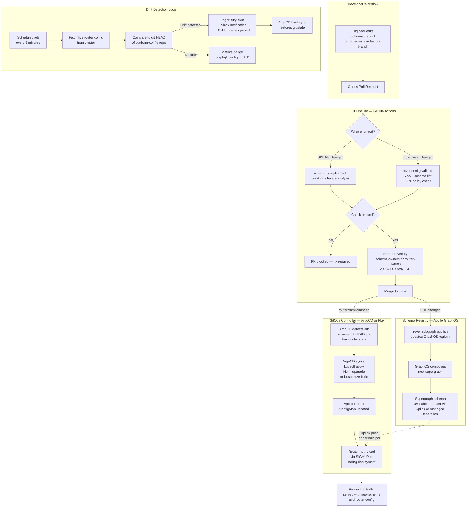

# GitOps for GraphQL: Schema-as-Code and Continuous Router Reconciliation

> Git is the single source of truth for every aspect of your GraphQL platform: subgraph SDL files,
> router configuration, supergraph composition overrides, and launch policies. This document covers
> the full GitOps model for federated GraphQL — from PR-driven schema changes through ArgoCD/Flux
> router reconciliation to drift detection and automated remediation. This is the operational
> backbone that enables zero-downtime schema evolution at scale without manual production deploys.

## Learning Objectives

- [ ] Apply schema-as-code principles so every SDL, router config, and supergraph artifact is
      version-controlled, auditable, and reversible
- [ ] Design a GitOps pipeline where a merged PR is the only mechanism that changes production
      router configuration
- [ ] Configure ArgoCD or Flux to watch a config repository and hot-reload the Apollo Router when
      YAML changes
- [ ] Implement drift detection that alerts when the running router config diverges from the git
      state
- [ ] Build reconciliation loops that automatically correct configuration drift without service
      disruption
- [ ] Separate the schema registry publish path (Apollo GraphOS) from the router config deploy path
      (Kubernetes/ArgoCD) while keeping them causally linked
- [ ] Understand the failure modes of each stage and design for safe degradation

---

## Overview

### The Problem with Manual Router Management

In a federated GraphQL architecture, the Apollo Router sits at the boundary of every client
interaction. Its configuration controls routing, authentication, rate limiting, persisted query
lists, traffic shaping, and telemetry. In organizations that manage router configuration manually
— through direct kubectl applies, Helm value changes merged without review, or configuration
management tools run from engineer laptops — the following failure modes emerge regularly:

**Configuration drift**: The router running in production has settings that do not match anything
in version control. Someone edited a ConfigMap in-place to "quickly fix" a timeout. The fix was
never documented, never reviewed, and is now invisible to the team.

**No audit trail**: When a latency spike appears at 2 AM, the on-call engineer cannot determine
what changed. The router configuration has no commit history because it was last modified through
a Kubernetes dashboard.

**Rollback requires archaeology**: Rolling back a bad configuration change means finding the last
known-good state, which may not be in any system. Rolling forward requires someone with cluster
access at the moment of the incident.

**Environment divergence**: Staging and production router configurations diverge over months as
teams make incremental changes in production that they never backport to staging. When a critical
bug is found in staging, the fix cannot be reliably validated because staging no longer reflects
production.

GitOps eliminates these failure modes by treating git as the authoritative control plane for all
router and schema configuration. No human touches production infrastructure directly. Every change
flows through a pull request, is reviewed, is merged, and is applied automatically by a GitOps
controller.

### Schema-as-Code Principles

**Principle 1: Every schema artifact lives in git.**
Subgraph SDL files, supergraph composition configurations, router YAML, and any hand-crafted
composition overrides are committed to version-controlled repositories. Nothing meaningful about
the GraphQL platform exists only in a running system.

**Principle 2: Git state is always deployable.**
The main branch of every schema repository represents a known-good, composable, deployable state.
Composition validation and schema checks run in CI before merge, so merging to main is a guarantee
of deployability.

**Principle 3: Automation, not humans, applies changes to production.**
Platform engineers review and approve pull requests. ArgoCD or Flux observes the git state and
reconciles running infrastructure to match it. The path from "reviewed and merged" to "running in
production" is automated and does not require human intervention.

**Principle 4: Rollback is a git revert.**
Because every state is in git history, restoring a previous state is `git revert` followed by a
merge. The GitOps controller detects the new state in git and reconciles production to match it
within seconds.

**Principle 5: Drift is an incident, not a background condition.**
When the running router configuration diverges from git state, that is a production anomaly that
triggers an alert. Drift is not silently tolerated; it is detected, reported, and remediated
automatically.

### Repository Layout

A mature GraphQL GitOps implementation uses two repository types:

**Schema repositories** (one per subgraph service, or a monorepo): Contain SDL files alongside
application code. Schema changes flow through CI (rover subgraph check → rover subgraph publish)
when merged to main.

**Platform config repository** (centralized): Contains router YAML configuration, Helm values,
ArgoCD Application manifests, and environment-specific overlays. This is the repository that
ArgoCD or Flux watches to reconcile the running router state.

```
platform-graphql-config/
├── base/
│   ├── router/
│   │   ├── router.yaml              # Core Apollo Router config
│   │   ├── supergraph.yaml          # Managed federation config
│   │   └── ratelimit.yaml           # Rate limiting rules
│   └── kustomization.yaml
├── overlays/
│   ├── staging/
│   │   ├── router-patch.yaml        # Staging-specific overrides
│   │   └── kustomization.yaml
│   └── production/
│       ├── router-patch.yaml        # Production resource limits, replicas
│       └── kustomization.yaml
├── argocd/
│   ├── app-staging.yaml             # ArgoCD Application for staging
│   └── app-production.yaml          # ArgoCD Application for production
└── flux/
    ├── staging/
    │   ├── kustomization.yaml       # Flux Kustomization for staging
    │   └── helmrelease.yaml         # HelmRelease for Apollo Router chart
    └── production/
        ├── kustomization.yaml
        └── helmrelease.yaml
```

---

## Architecture

### Full GitOps Pipeline



### Schema vs. Router Config Separation

The schema publish path and the router config deploy path are causally linked but operationally
independent. Understanding this separation is critical for incident response.

| Dimension | Schema Path | Router Config Path |
|---|---|---|
| Source of truth | Subgraph SDL files in subgraph repos | `platform-graphql-config` repo |
| CI validation | `rover subgraph check` | `rover config validate` + OPA |
| Apply mechanism | `rover subgraph publish` to GraphOS | ArgoCD/Flux syncs to Kubernetes |
| Router pickup | Uplink push or poll (seconds to minutes) | ConfigMap rolling update |
| Rollback | `rover subgraph publish` of prior SDL | `git revert` + auto-sync |
| Who reviews | Schema owners | Platform/SRE team |

---

## Core Concepts

### ArgoCD Application for the Router

The ArgoCD `Application` resource connects the platform config repository to the Kubernetes
cluster. When a commit lands on main in the config repository, ArgoCD detects the diff and
applies it automatically when `automated.selfHeal` and `automated.prune` are enabled.

```yaml
# argocd/app-production.yaml
apiVersion: argoproj.io/v1alpha1
kind: Application
metadata:
  name: graphql-router-production
  namespace: argocd
  labels:
    environment: production
    team: platform-graphql
  annotations:
    # Link back to the platform config repository for traceability
    argocd.argoproj.io/manifest-generate-paths: .
spec:
  project: graphql-platform

  source:
    repoURL: https://github.com/your-org/platform-graphql-config
    targetRevision: main
    path: overlays/production
    # Use Kustomize to build the production overlay
    kustomize:
      # Inject the current image tag from the promotion pipeline
      images:
        - ghcr.io/apollographql/router:1.52.0

  destination:
    server: https://kubernetes.default.svc
    namespace: graphql-production

  syncPolicy:
    automated:
      # Automatically apply changes when git diverges from cluster state
      selfHeal: true
      # Remove resources from the cluster that have been removed from git
      prune: true
    syncOptions:
      # Validate manifests against the Kubernetes API schema before applying
      - Validate=true
      # Pause rollout if any resource is in an error state before proceeding
      - PrunePropagationPolicy=foreground
      # Respect the order of resource creation for dependent resources
      - CreateNamespace=false
      # Replace instead of patch when the resource is immutable
      - RespectIgnoreDifferences=true
    retry:
      limit: 3
      backoff:
        duration: 5s
        factor: 2
        maxDuration: 3m

  ignoreDifferences:
    # Ignore the managed fields that the router operator sets at runtime
    - group: ""
      kind: ConfigMap
      name: graphql-router-config
      jsonPointers:
        - /metadata/annotations/kubectl.kubernetes.io~1last-applied-configuration
    # Ignore replica count if HPA is managing it
    - group: apps
      kind: Deployment
      name: graphql-router
      jsonPointers:
        - /spec/replicas

  # Sync health checks — ArgoCD waits for these before marking sync complete
  info:
    - name: "Schema Registry"
      value: "https://studio.apollographql.com/graph/your-graph-id"
    - name: "Runbook"
      value: "https://wiki.your-org.com/graphql/router-gitops-runbook"
```

### Flux HelmRelease for the Router

For teams using Flux as their GitOps controller, the `HelmRelease` resource drives Apollo Router
deployment via the official Helm chart.

```yaml
# flux/production/helmrelease.yaml
apiVersion: helm.toolkit.fluxcd.io/v2beta2
kind: HelmRelease
metadata:
  name: graphql-router
  namespace: graphql-production
  labels:
    environment: production
    managed-by: flux
spec:
  interval: 5m
  # Timeout for helm upgrade operations
  timeout: 10m

  chart:
    spec:
      chart: router
      version: "1.52.*"
      sourceRef:
        kind: HelmRepository
        name: apollographql
        namespace: flux-system
      # Re-check for new chart versions on this interval
      interval: 60m

  # Values from the versioned config file in the platform-config repo
  valuesFrom:
    - kind: ConfigMap
      name: router-helm-values
      valuesKey: values.yaml

  values:
    # These values override the ConfigMap — use sparingly
    replicaCount: 3

    router:
      # Managed federation: router fetches supergraph from GraphOS Uplink
      managedFederation:
        enabled: true
        # APOLLO_KEY and APOLLO_GRAPH_REF injected from external secret
        apiKeySecret:
          name: apollographql-credentials
          key: APOLLO_KEY

    resources:
      requests:
        cpu: "500m"
        memory: "512Mi"
      limits:
        cpu: "2000m"
        memory: "2Gi"

    autoscaling:
      enabled: true
      minReplicas: 3
      maxReplicas: 20
      targetCPUUtilizationPercentage: 60

    podDisruptionBudget:
      enabled: true
      minAvailable: 2

  # Rollback if the upgrade leaves the release in a degraded state
  rollback:
    enable: true
    timeout: 5m
    cleanupOnFail: true

  # Post-upgrade health check
  test:
    enable: true
```

### Apollo Router Configuration as Code

The router's `router.yaml` is a first-class versioned artifact. Every change is reviewed in a
pull request before ArgoCD or Flux applies it.

```yaml
# base/router/router.yaml
# Apollo Router configuration — version controlled in platform-graphql-config
# Changes to this file require review from @your-org/router-owners (see CODEOWNERS)

# Supergraph source — managed federation via Apollo GraphOS Uplink
supergraph:
  # APOLLO_GRAPH_REF is injected from the Kubernetes secret
  # Format: graph-id@variant-name
  # Do not hardcode — use environment variable substitution
  listen: 0.0.0.0:4000

# Homegrown health check and readiness probe configuration
health_check:
  enabled: true
  path: /health
  listen: 0.0.0.0:8088

sandbox:
  enabled: false  # Never enable in production

homepage:
  enabled: false

# CORS — lock down in production
cors:
  origins:
    - https://app.your-org.com
    - https://admin.your-org.com
  methods:
    - GET
    - POST
  headers:
    - Content-Type
    - Authorization
    - Apollo-Require-Preflight
  credentials: true

# Headers propagation from client to subgraphs
headers:
  all:
    request:
      - propagate:
          named: authorization
      - propagate:
          named: x-request-id
      - propagate:
          named: x-correlation-id
      - insert:
          name: x-router-version
          value: "${ROUTER_VERSION}"

# Authentication — JWT validation at the router
authentication:
  router:
    jwt:
      jwks:
        - url: https://auth.your-org.com/.well-known/jwks.json
          poll_interval: 60s

# Authorization — coarse-grained access control
authorization:
  require_authentication: false  # Unauthenticated queries still allowed; use directives

# Traffic shaping
traffic_shaping:
  all:
    timeout: 30s
  router:
    # Limit request body size to prevent abuse
    max_request_body_size: 2mb

  # Per-subgraph timeout overrides
  subgraphs:
    inventory:
      timeout: 5s
    reporting:
      timeout: 60s  # Long-running aggregations

# Rate limiting — per-client request limiting
limits:
  max_depth: 15
  max_height: 200
  max_root_fields: 20
  max_aliases: 30

# Persisted queries — lock down production to known operations
persisted_queries:
  enabled: true
  safelist:
    enabled: true
    require_id: true
  log_unknown: true

# Telemetry
telemetry:
  exporters:
    metrics:
      prometheus:
        enabled: true
        path: /metrics
        listen: 0.0.0.0:9090
    tracing:
      otlp:
        enabled: true
        endpoint: http://otel-collector.observability:4317
        protocol: Grpc
        grpc:
          metadata:
            x-honeycomb-team:
              - "${HONEYCOMB_API_KEY}"

  instrumentation:
    spans:
      router:
        attributes:
          # Include graph variant in all spans for multi-environment filtering
          graphql.graph.id:
            env: APOLLO_GRAPH_REF
    events:
      router:
        # Log every slow request
        request:
          level: info
          condition:
            gt:
              - request_duration_threshold_ms: 1000
              - 0

# Coprocessor — external authorization and enrichment sidecar
coprocessor:
  url: http://localhost:8081
  timeout: 200ms
  router:
    request:
      headers: true
      body: false
    response:
      headers: true
      body: false
  subgraph:
    all:
      request:
        headers: true
```

### Kustomize Overlay for Production

```yaml
# overlays/production/kustomization.yaml
apiVersion: kustomize.config.k8s.io/v1beta1
kind: Kustomization

namespace: graphql-production

resources:
  - ../../base

# Production-specific ConfigMap for router YAML
configMapGenerator:
  - name: graphql-router-config
    files:
      - router.yaml=router-production.yaml
    options:
      # Append content hash to force rolling update on config change
      disableNameSuffixHash: false

# Production resource patches
patches:
  - target:
      kind: Deployment
      name: graphql-router
    patch: |-
      - op: replace
        path: /spec/replicas
        value: 5
      - op: replace
        path: /spec/template/spec/containers/0/resources/requests/memory
        value: "1Gi"
      - op: replace
        path: /spec/template/spec/containers/0/resources/limits/memory
        value: "4Gi"

# Inject the production graph reference
secretGenerator:
  - name: apollographql-credentials
    envs:
      - .env.production  # Never committed — provided by external secrets operator
    options:
      disableNameSuffixHash: true
```

### Router Hot-Reload Mechanism

The Apollo Router supports two reload mechanisms depending on what changed:

**Schema reload (managed federation)**: When the supergraph schema changes in Apollo GraphOS
Uplink, the router fetches and applies the new schema without restarting. This is the primary
path for subgraph SDL changes. The router polls Uplink on a configurable interval (default 10
seconds) and hot-applies schema changes with zero traffic disruption.

**Config reload (SIGHUP)**: When `router.yaml` changes (timeout values, CORS origins, rate
limits), the router supports hot-reload via SIGHUP. In Kubernetes, this is triggered by the
ConfigMap hash suffix changing, which causes a rolling deployment — not a SIGHUP. The rolling
deployment ensures zero-downtime config application with PodDisruptionBudget enforcement.

```yaml
# base/router/deployment.yaml (relevant section)
spec:
  strategy:
    type: RollingUpdate
    rollingUpdate:
      # Only take down one pod at a time during config updates
      maxUnavailable: 0
      maxSurge: 1
  template:
    spec:
      containers:
        - name: router
          image: ghcr.io/apollographql/router:1.52.0
          env:
            - name: APOLLO_KEY
              valueFrom:
                secretKeyRef:
                  name: apollographql-credentials
                  key: APOLLO_KEY
            - name: APOLLO_GRAPH_REF
              valueFrom:
                secretKeyRef:
                  name: apollographql-credentials
                  key: APOLLO_GRAPH_REF
          volumeMounts:
            - name: router-config
              mountPath: /dist/config
              readOnly: true
          livenessProbe:
            httpGet:
              path: /health
              port: 8088
            initialDelaySeconds: 5
            periodSeconds: 10
          readinessProbe:
            httpGet:
              path: /health
              port: 8088
            initialDelaySeconds: 3
            periodSeconds: 5
            # Wait for router to load schema before accepting traffic
            failureThreshold: 6
      volumes:
        - name: router-config
          configMap:
            # Name includes content hash — changes on every config update
            name: graphql-router-config
```

---

## Real-World Implementation

### The GitOps PR Workflow in Practice

#### Step 1: Engineer opens a PR against the platform-config repository

A platform engineer needs to tighten the `max_depth` limit from 15 to 12 after profiling shows
that deeply nested queries are causing subgraph fan-out. They edit `base/router/router.yaml`
locally and open a pull request.

#### Step 2: CI validates the change

The PR triggers the router-config-check workflow which runs:

```bash
# Validate router YAML syntax and schema
rover config validate --config router.yaml

# OPA policy check — ensure the change doesn't violate platform policies
opa eval \
  --data policies/router-config-policy.rego \
  --input router.yaml \
  --format pretty \
  'data.graphql.router.deny'

# Dry-run: render the Kustomize overlay and validate against Kubernetes API
kubectl kustomize overlays/staging | \
  kubectl apply --dry-run=server -f -
```

#### Step 3: CODEOWNERS routes the PR for review

The `CODEOWNERS` file in the platform-config repository ensures that router config changes
require approval from the `@your-org/router-owners` team before merge.

```
# platform-graphql-config/CODEOWNERS
/base/router/              @your-org/router-owners @your-org/platform-graphql
/overlays/production/      @your-org/router-owners @your-org/sre
/argocd/                   @your-org/sre
/flux/                     @your-org/sre
```

#### Step 4: Merge triggers ArgoCD sync

When the PR merges to main, ArgoCD's polling interval (default 3 minutes, configurable down to
seconds with webhooks) detects the new commit. ArgoCD computes the diff between the current
cluster state and the new git state, then applies the delta.

For Kustomize-managed deployments where the ConfigMap name includes a content hash, the
deployment rolls automatically because the ConfigMap name in the Deployment's volume reference
changes.

#### Step 5: Sync health check gates completion

ArgoCD monitors the health of the Deployment during sync. If pods fail to become Ready within
the timeout, ArgoCD marks the sync as failed and halts — it does not roll back automatically
(that requires the Argo Rollouts controller or a manual sync to the previous revision). The
on-call engineer receives a PagerDuty alert and can initiate rollback.

#### Step 6: Rollback via git revert

```bash
# Find the last known-good commit
git log --oneline -10

# Revert the bad change
git revert abc1234 --no-edit

# Open a PR for the revert (in a real rollback, bypass PR for speed)
# OR merge directly with emergency bypass + post-incident PR review
git push origin main

# ArgoCD detects the new commit and syncs — restores previous router config
# within 3 minutes (or immediately if webhook is configured)
```

### Drift Detection Implementation

Drift detection runs as a Kubernetes CronJob that compares the live cluster state against the
git HEAD of the platform-config repository.

```yaml
# base/drift-detection/cronjob.yaml
apiVersion: batch/v1
kind: CronJob
metadata:
  name: graphql-config-drift-detector
  namespace: graphql-production
spec:
  schedule: "*/5 * * * *"
  concurrencyPolicy: Forbid
  jobTemplate:
    spec:
      template:
        spec:
          serviceAccountName: drift-detector
          containers:
            - name: detector
              image: ghcr.io/your-org/graphql-drift-detector:latest
              env:
                - name: CONFIG_REPO_URL
                  value: https://github.com/your-org/platform-graphql-config
                - name: CONFIG_REPO_BRANCH
                  value: main
                - name: EXPECTED_NAMESPACE
                  value: graphql-production
                - name: PAGERDUTY_INTEGRATION_KEY
                  valueFrom:
                    secretKeyRef:
                      name: alerting-credentials
                      key: PAGERDUTY_INTEGRATION_KEY
                - name: SLACK_WEBHOOK_URL
                  valueFrom:
                    secretKeyRef:
                      name: alerting-credentials
                      key: SLACK_WEBHOOK_URL
                - name: ARGOCD_APP_NAME
                  value: graphql-router-production
                - name: ARGOCD_SERVER
                  value: https://argocd.your-org.com
              command:
                - /bin/sh
                - -c
                - |
                  set -e

                  # Clone the platform config repo at HEAD
                  git clone --depth=1 --branch=${CONFIG_REPO_BRANCH} \
                    ${CONFIG_REPO_URL} /tmp/platform-config

                  # Render the production overlay
                  kubectl kustomize /tmp/platform-config/overlays/production \
                    > /tmp/expected-manifests.yaml

                  # Fetch the live state from the cluster
                  kubectl get configmap graphql-router-config \
                    -n ${EXPECTED_NAMESPACE} \
                    -o yaml > /tmp/live-configmap.yaml

                  # Compare using dyff for structured YAML diffing
                  if ! dyff between \
                    <(yq '.data["router.yaml"]' /tmp/expected-manifests.yaml) \
                    <(yq '.data["router.yaml"]' /tmp/live-configmap.yaml) \
                    --ignore-order-changes; then

                    echo "DRIFT DETECTED: live router config differs from git HEAD"

                    # Emit metric for Prometheus alerting
                    curl -s -X POST http://pushgateway.observability:9091/metrics/job/drift-detector \
                      --data-binary 'graphql_config_drift{environment="production"} 1'

                    # Send PagerDuty alert
                    curl -s -X POST https://events.pagerduty.com/v2/enqueue \
                      -H "Content-Type: application/json" \
                      -d "{
                        \"routing_key\": \"${PAGERDUTY_INTEGRATION_KEY}\",
                        \"event_action\": \"trigger\",
                        \"payload\": {
                          \"summary\": \"GraphQL router config drift detected in production\",
                          \"severity\": \"warning\",
                          \"source\": \"drift-detector\",
                          \"custom_details\": {
                            \"environment\": \"production\",
                            \"config_repo\": \"${CONFIG_REPO_URL}\",
                            \"argocd_app\": \"${ARGOCD_APP_NAME}\"
                          }
                        }
                      }"

                    # Trigger ArgoCD hard sync to restore git state
                    argocd app sync ${ARGOCD_APP_NAME} \
                      --server ${ARGOCD_SERVER} \
                      --force \
                      --prune \
                      --auth-token ${ARGOCD_AUTH_TOKEN}

                    exit 1
                  else
                    echo "No drift detected — cluster state matches git HEAD"

                    # Reset the drift metric to 0
                    curl -s -X POST http://pushgateway.observability:9091/metrics/job/drift-detector \
                      --data-binary 'graphql_config_drift{environment="production"} 0'
                  fi
          restartPolicy: OnFailure
```

### Reconciliation Loop Architecture

The reconciliation loop is not just ArgoCD's sync — it encompasses the full feedback cycle
from detected state to corrected state.

```
Git HEAD (desired state)
        |
        v
ArgoCD/Flux polls or receives webhook
        |
        v
Compute diff: desired vs. actual cluster state
        |
      Diff?
     /     \
   Yes       No
    |         |
    v         v
Apply delta  Record "in sync" metric
    |
    v
Monitor rollout health (pod readiness, error rate)
    |
  Healthy?
  /      \
Yes        No
 |          |
 v          v
Record    Halt sync
success   Alert on-call
metric    Await human decision
```

The reconciliation loop runs continuously. For most teams, ArgoCD polling every 3 minutes is
sufficient. For teams with strict change windows or zero-tolerance for drift, a webhook from
GitHub to ArgoCD ensures sync begins within seconds of a merge.

---

## Production Considerations

### Performance

**ArgoCD sync latency**: Default polling is 3 minutes. Configure a GitHub webhook to push
notifications to ArgoCD on every push to main. With webhooks, sync begins within 5 seconds.

```bash
# Register the ArgoCD webhook in GitHub (via CLI or Terraform)
# Payload URL: https://argocd.your-org.com/api/webhook
# Content type: application/json
# Secret: stored in ArgoCD's argocd-secret under webhook.github.secret
```

**Kustomize build time**: Large overlays with many patches can take 10-30 seconds to render.
Cache the rendered manifests in CI and pass the cached output to ArgoCD via the `--kustomize`
override flag or use ArgoCD's build cache feature.

**Router rolling update duration**: With 5 replicas and `maxSurge: 1`, a rolling update
touches 6 pods sequentially, waiting for each to become Ready (typically 10-30 seconds) before
proceeding. A complete router config rollout takes 1-3 minutes end-to-end. Plan capacity
accordingly during peak traffic windows.

### Security

**Least-privilege service accounts**: The ArgoCD application controller requires read access
to the config repository and write access to the target namespace. It should not have
cluster-admin.

```yaml
# RBAC for ArgoCD application controller in graphql-production namespace
apiVersion: rbac.authorization.k8s.io/v1
kind: Role
metadata:
  name: argocd-application-controller
  namespace: graphql-production
rules:
  - apiGroups: ["", "apps", "networking.k8s.io", "policy"]
    resources:
      - configmaps
      - deployments
      - services
      - ingresses
      - poddisruptionbudgets
      - serviceaccounts
    verbs: ["get", "list", "watch", "create", "update", "patch", "delete"]
```

**Secrets not in git**: Router secrets (APOLLO_KEY, HONEYCOMB_API_KEY) are never committed.
Use the External Secrets Operator to sync from AWS Secrets Manager, HashiCorp Vault, or GCP
Secret Manager into Kubernetes Secrets at runtime.

**Git branch protection**: The `main` branch of the platform-config repository must require
pull request reviews, passing status checks, and no direct pushes — including from
administrators. Emergency changes use a documented break-glass process with post-incident review.

**Signed commits**: Require GPG or SSH commit signing on the platform-config repository.
ArgoCD can be configured to verify commit signatures before syncing, preventing unsigned commits
from affecting the cluster.

### Scaling

**Multi-cluster GitOps**: In a multi-region deployment, each cluster has its own ArgoCD instance
(or shares a hub ArgoCD). The same platform-config repository feeds all clusters using
environment and region-specific overlays.

```
platform-graphql-config/
├── overlays/
│   ├── staging/
│   ├── production-us-east-1/
│   ├── production-us-west-2/
│   ├── production-eu-west-1/
│   └── production-ap-southeast-1/
```

**Subgraph proliferation**: As the number of subgraphs grows, the schema publish pipeline
(not the router config pipeline) becomes the bottleneck. Use the GitHub Actions matrix strategy
to publish changed subgraphs in parallel. The platform-config repository only changes when
router configuration changes — subgraph schema updates flow through GraphOS Uplink without
touching the config repository.

### Observability

Key metrics to instrument:

```yaml
# Prometheus alerting rules for GitOps health
groups:
  - name: graphql-gitops
    rules:
      - alert: GraphQLRouterConfigDrift
        expr: graphql_config_drift{environment="production"} > 0
        for: 5m
        labels:
          severity: warning
          team: platform-graphql
        annotations:
          summary: "Router config in production has drifted from git"
          description: >
            The live router configuration in {{ $labels.environment }} does not match
            git HEAD. ArgoCD should reconcile automatically. If drift persists after
            10 minutes, escalate to the platform team.
          runbook: https://wiki.your-org.com/graphql/runbooks/config-drift

      - alert: ArgoCDSyncFailed
        expr: argocd_app_info{name="graphql-router-production", sync_status!="Synced"} > 0
        for: 10m
        labels:
          severity: critical
          team: platform-graphql
        annotations:
          summary: "ArgoCD failed to sync GraphQL router configuration"
          description: >
            ArgoCD application graphql-router-production has been out of sync for
            more than 10 minutes. A router config change may not have been applied.
          runbook: https://wiki.your-org.com/graphql/runbooks/argocd-sync-failure

      - alert: RouterRolloutStalled
        expr: |
          kube_deployment_status_replicas_unavailable{
            namespace="graphql-production",
            deployment="graphql-router"
          } > 0
        for: 15m
        labels:
          severity: critical
          team: platform-graphql
        annotations:
          summary: "Apollo Router deployment rollout stalled"
```

---

## Best Practices

**Never bypass the GitOps pipeline for production changes.** Even during incidents, apply changes
through a fast-path PR with emergency review, not through direct `kubectl apply`. The 2-minute
cost of a PR is worth the audit trail. If speed is truly critical, document the break-glass
procedure and require a post-incident PR to formalize the change.

**Version-pin the router image in git.** Do not use `latest` or a floating tag. Pin to a specific
image digest (`ghcr.io/apollographql/router@sha256:abc123`) for complete reproducibility. Use
Renovate or Dependabot to open automated PRs when new router versions are available.

**Separate config changes from schema changes.** Router config changes (timeouts, CORS, rate
limits) should go through the platform-config repository and the router-owners review process.
Subgraph schema changes go through the subgraph repository's schema CI pipeline. Mixing both
concerns in a single PR creates ambiguous review responsibilities.

**Test overlays before merging.** Always validate that the Kustomize overlay renders correctly
and that the rendered manifests pass `kubectl apply --dry-run=server`. Add this as a required
CI step on every PR to the platform-config repository.

**Model environment promotion as git operations.** Promote a change from staging to production
by creating a PR that copies the staging overlay change into the production overlay. This makes
the promotion explicit, reviewable, and revertible.

---

## Anti-Patterns

**Anti-pattern: Running `kubectl apply` in CI directly.** CI-driven kubectl apply bypasses the
GitOps controller and creates a split brain: the controller's view of cluster state no longer
matches reality. Use CI only to validate (dry-run) — let ArgoCD/Flux perform the actual apply.

**Anti-pattern: Storing secrets in the config repository.** Kubernetes Secrets encoded as
base64 in a git repository are not secrets — they are plaintext visible to every repository
reader and in the git history forever. Use External Secrets Operator, Sealed Secrets, or SOPS
encryption for any credential that must live near the config repo.

**Anti-pattern: Monolithic ArgoCD Application.** If one Application manages all GraphQL
infrastructure (router, coprocessor, Redis cache, observability stack), a single broken resource
blocks all other updates. Decompose into multiple Applications with explicit dependencies.

**Anti-pattern: Disabling ArgoCD self-heal to "prevent surprises."** Teams sometimes disable
`automated.selfHeal` after ArgoCD reverts a manual change they did not intend to revert. This
is the correct behavior — ArgoCD is protecting git as the source of truth. The fix is to commit
the intended change to git, not to disable self-healing.

**Anti-pattern: Router config as a Helm `--set` flag.** Passing configuration as `--set` flags
at deploy time (e.g., in a CI job) is not GitOps — the configuration lives in the CI job
definition, not in the versioned config repository. All configuration values must be committed
to git in a values file or Kustomize patch.

---

## Operational Notes

### Emergency Rollback Procedure

When a bad router config causes elevated error rates or a schema change breaks clients:

1. Identify the last known-good git commit in the platform-config repository:
   ```bash
   git log --oneline -5
   # abc1234 feat: tighten max_depth to 12
   # def5678 fix: update CORS origins for new marketing domain  ← last good
   ```

2. Create a revert commit:
   ```bash
   git revert abc1234 --no-edit
   git push origin main
   ```

3. ArgoCD detects the new commit and syncs automatically within 3 minutes
   (or immediately if webhooks are configured).

4. Monitor the rollout:
   ```bash
   kubectl rollout status deployment/graphql-router -n graphql-production
   ```

5. Verify error rates return to baseline in Grafana before closing the incident.

### Validating GitOps Pipeline Health

Run this checklist after any change to the GitOps infrastructure itself:

```bash
# 1. Verify ArgoCD app is synced and healthy
argocd app get graphql-router-production

# 2. Confirm the live ConfigMap matches git
kubectl get configmap graphql-router-config -n graphql-production -o yaml | \
  yq '.data["router.yaml"]' | diff - overlays/production/router.yaml

# 3. Check drift detector CronJob history
kubectl get jobs -n graphql-production -l app=drift-detector --sort-by=.metadata.creationTimestamp

# 4. Confirm router is serving traffic
curl -s https://graphql.your-org.com/health | jq .

# 5. Check supergraph schema is current in GraphOS
rover subgraph introspect https://graphql.your-org.com | \
  rover subgraph check your-graph-id@production --schema -
```

---

## References

- [ArgoCD Documentation — Automated Sync Policy](https://argo-cd.readthedocs.io/en/stable/user-guide/auto_sync/)
- [Flux Documentation — HelmRelease](https://fluxcd.io/flux/components/helm/helmreleases/)
- [Apollo Router Configuration Reference](https://www.apollographql.com/docs/router/configuration/overview)
- [Apollo Router Helm Chart](https://github.com/apollographql/router/tree/main/helm/chart/router)
- [External Secrets Operator](https://external-secrets.io/latest/)
- [Kustomize Reference](https://kubectl.docs.kubernetes.io/references/kustomize/)
- [SOPS — Secrets OPerationS](https://github.com/getsops/sops)
- [Renovate — Automated Dependency Updates](https://docs.renovatebot.com/)
- [dyff — YAML Diffing Tool](https://github.com/homeport/dyff)

## Related Topics

- [CI Pipeline Design](./01-ci-pipeline-design.md)
- [Schema Publish Workflow](../12-github-actions/03-schema-publish-workflow.md)
- [Governance Workflows](../12-github-actions/04-governance-workflows.md)
- [Federation Architecture](../../docs/07-federation/README.md)
- [Supergraph Architecture](../../docs/08-supergraph-architecture/README.md)
- [Security](../../docs/05-security/README.md)
