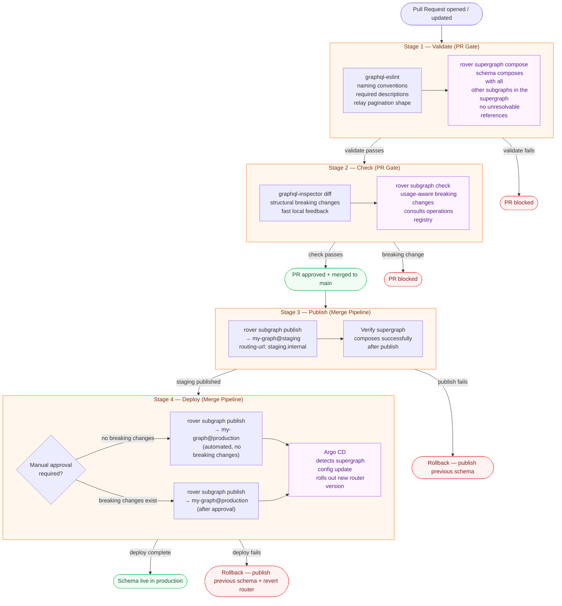

# CI/CD Automation for GraphQL

> The CI pipeline is the governance enforcement mechanism. Policy that exists only in documentation is ignored. Policy that lives in a GitHub Actions workflow that blocks every pull request is followed — not because engineers are compliant, but because the path of least resistance is now the correct path. A GraphQL CI/CD pipeline does not replace governance; it makes governance automatic.

GraphQL CI/CD has a shape that is more complex than a typical application deployment pipeline because a schema change has two distinct audiences: the composition engine (which checks whether the schema integrates correctly with other subgraphs) and the operations registry (which checks whether the schema breaks any client currently running in production). Both must pass before a change is safe to deploy. Neither check can be skipped without accepting risk.

The pipeline described in this section has four stages. The first two stages form the PR gate — checks that must pass before a pull request can be merged. The last two stages form the merge pipeline — actions that execute automatically (or with approval) after merge.

---

## The Complete CI/CD Pipeline

---

## Stage Summary

| Stage | Runs On | Tools | Gates |
|-------|---------|-------|-------|
| 1 — Validate | Every PR push | graphql-eslint, rover supergraph compose | PR merge |
| 2 — Check | Every PR push | graphql-inspector, rover subgraph check | PR merge |
| 3 — Publish (Staging) | Merge to main | rover subgraph publish | Production deploy |
| 4 — Deploy (Production) | After staging publish | rover subgraph publish, Argo CD | Live traffic |

---

## Prerequisites

- [10-schema-validation](../10-schema-validation/) — understanding the four-layer validation pipeline that feeds into Stage 1 and Stage 2
- [07-federation](../07-federation/) and [08-supergraph-architecture](../08-supergraph-architecture/) — how subgraphs, supergraphs, and variants work in Apollo Federation
- Apollo GraphOS organization with at least two variants configured: `staging` and `production`
- GitHub repository with Actions enabled and the following secrets configured:
  - `APOLLO_KEY` — Apollo Studio API key with schema check and publish permissions
  - `STAGING_ROUTING_URL` — the URL the router uses to reach your staging subgraph
  - `PROD_ROUTING_URL` — the URL the router uses to reach your production subgraph

---

## Content Files

| File | Topic |
|------|-------|
| [01-ci-pipeline-design.md](./01-ci-pipeline-design.md) | PR gate design, merge pipeline design, monorepo vs polyrepo, preview environment hooks, rollback strategy |
| [02-schema-promotion.md](./02-schema-promotion.md) | Multi-environment publish workflow, staging → production gating, GitOps with Argo CD, blue-green and canary patterns |
| [03-preview-environments.md](./03-preview-environments.md) | Ephemeral Apollo GraphOS variants per PR, lifecycle automation, E2E testing against preview schemas, teardown |

---

## Related Topics

- [10-schema-validation](../10-schema-validation/) — the validation steps that run inside the CI pipeline
- [12-github-actions](../12-github-actions/) — reusable GitHub Actions workflows for GraphQL operations (if available in your handbook)
- [13-policy-as-code](../13-policy-as-code/) — OPA policies that run as part of Stage 1 validation
- [15-kubernetes-deployment](../15-kubernetes-deployment/) — how the Apollo Router is deployed to Kubernetes and updated by Argo CD
