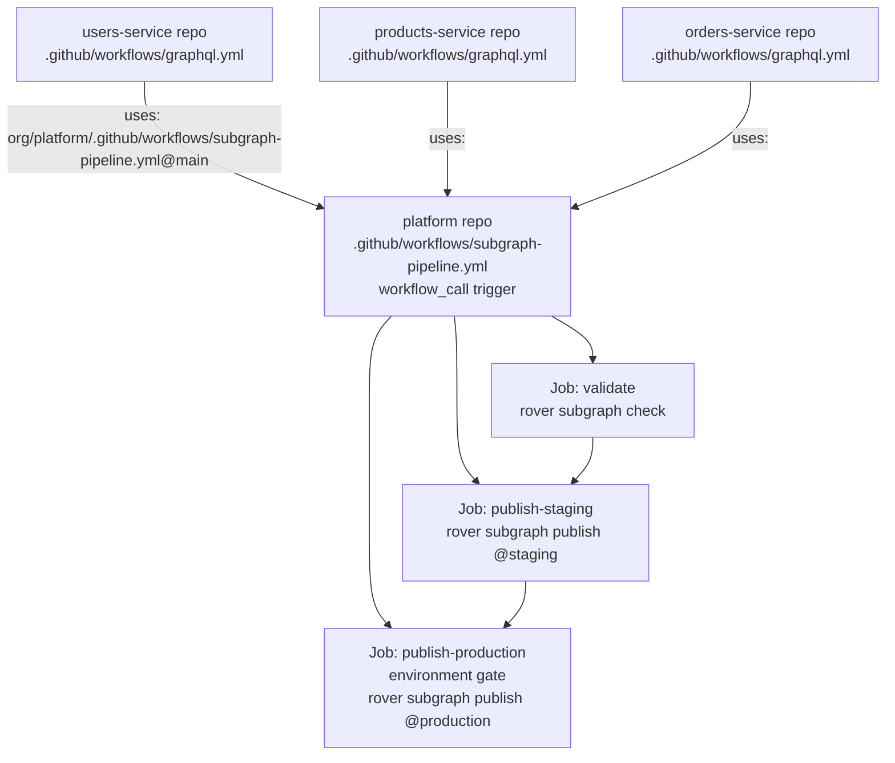

# Reusable GitHub Actions Workflows for GraphQL Schema Operations

> A single reusable workflow definition replaces dozens of duplicated CI YAML files across
> subgraph repositories. This document covers the design, implementation, and maintenance of
> centralized GitHub Actions workflows that standardize schema validation and publishing across
> an entire federated supergraph platform.

## Learning Objectives

- [ ] Understand the `workflow_call` trigger and the difference between reusable workflows and composite actions
- [ ] Define typed inputs, secrets, and outputs for reusable workflows
- [ ] Implement a complete subgraph CI pipeline — lint, check, publish-staging, publish-production
- [ ] Configure path-based triggers so schema CI only runs when SDL files change
- [ ] Cache the rover CLI binary and Node.js dependencies across workflow runs
- [ ] Build a matrix strategy for monorepos that only validates changed subgraphs
- [ ] Call a reusable workflow from a subgraph repository with environment-specific configuration

---

## Overview

### The Copy-Paste Problem

Federated GraphQL architectures typically involve many independently deployed subgraph services.
In a mature platform, 20 or more teams each own their own repository and maintain their own
service code. Every one of those repositories needs GraphQL schema CI: the schema must be linted,
checked against the composed supergraph for breaking changes, and published to Apollo GraphOS when
changes merge.

Without a shared pipeline, each team writes their own CI YAML. The first team copies from an
example, the second team copies from the first, and within six months there are 20 slightly
different versions. Some have caching, some do not. Some use an old version of rover. Some skip
the staging publish step because a developer found it inconvenient. When the platform team adds a
new lint rule or updates the rover install command, they file 20 pull requests and wait for 20
teams to review and merge.

GitHub Actions reusable workflows solve this. The platform team defines the pipeline once in a
central repository. Each subgraph team references it with a single `uses:` line and passes
subgraph-specific values as inputs. When the platform team updates the pipeline, all subgraph
repositories pick up the change on their next CI run without any action from subgraph developers.

### Reusable Workflows vs. Composite Actions

GitHub provides two mechanisms for sharing workflow logic: reusable workflows and composite
actions. Understanding the difference is important for choosing the right tool.

A **reusable workflow** is an entire workflow file that can be called by another workflow using
`jobs.<job-id>.uses`. It runs as a separate workflow in GitHub's infrastructure and can contain
multiple jobs with their own runners. Reusable workflows have their own `workflow_call` trigger
and accept typed inputs and secrets. They appear as a single job in the calling workflow's
summary, with the inner jobs collapsed beneath it.

A **composite action** is defined in an `action.yml` file and contains a sequence of steps — not
jobs. Composite actions run on the same runner as the calling job and cannot span multiple jobs.
They are ideal for encapsulating a repeating sequence of steps (install rover, configure PATH,
authenticate) that needs to appear in many jobs across different workflows.

For the subgraph pipeline pattern, the right answer is a **reusable workflow**: the pipeline
spans multiple jobs (validate, publish-staging, publish-production) with different runners,
environment gates, and conditional execution. Composite actions are used within individual jobs
to avoid repeating setup steps.

### Architecture



---

## Core Concepts

### The `workflow_call` Trigger

A workflow becomes reusable by adding `workflow_call` to its `on:` block. This trigger fires
when another workflow calls it with `jobs.<job-id>.uses`. No other trigger is required, though a
reusable workflow can also have other triggers (such as `workflow_dispatch` for manual testing).

```yaml
on:
  workflow_call:
    inputs:
      subgraph_name:
        required: true
        type: string
        description: "The subgraph name as registered in Apollo GraphOS"
    secrets:
      APOLLO_KEY:
        required: true
        description: "Apollo GraphOS API key"
    outputs:
      schema_check_id:
        description: "The Apollo GraphOS schema check ID for this run"
        value: ${{ jobs.validate.outputs.check_id }}
```

**Typed inputs** support `string`, `boolean`, and `number`. Inputs without defaults are
effectively required when `required: true` is set. Inputs with defaults are optional.

**Secrets** passed from a calling workflow must be explicitly forwarded using the `secrets:`
block. A calling workflow that uses `secrets: inherit` automatically passes all available
secrets, which is convenient but reduces visibility into which secrets are actually needed.

**Outputs** aggregate job outputs into workflow-level outputs that the calling workflow can
consume. The output value is a GitHub Actions expression evaluated in the context of the
reusable workflow.

### Inputs, Variables, and Secrets Strategy

Not all configuration belongs in the same bucket.

| Category | Storage | Example |
|----------|---------|---------|
| API keys and credentials | Secrets | `APOLLO_KEY` |
| Graph ID (not sensitive) | Actions Variables (`vars.`) | `APOLLO_GRAPH_ID` |
| Routing URL per environment | Workflow input | `routing_url_staging` |
| Subgraph name | Workflow input | `subgraph_name` |
| Rover version | Input with default | `rover_version: 0.24.0` |

The graph ID is not a secret — it is visible in the Apollo Studio URL and appears in logs. Storing
it as a variable rather than a secret keeps logs readable and avoids the redaction overhead.

### Rover CLI Installation and Caching

The rover CLI installation script downloads a binary from `rover.apollo.dev`. Without caching,
every workflow run spends 15–30 seconds downloading and installing rover. With caching, subsequent
runs on the same runner restore the binary in under two seconds.

```yaml
- name: Cache rover binary
  id: cache-rover
  uses: actions/cache@v4
  with:
    path: ~/.rover/bin/rover
    key: rover-${{ runner.os }}-${{ inputs.rover_version || 'latest' }}

- name: Install rover
  if: steps.cache-rover.outputs.cache-hit != 'true'
  run: curl -sSL https://rover.apollo.dev/nix/v${{ inputs.rover_version || 'latest' }} | sh
```

The cache key includes the rover version so that a version bump invalidates the cache and
triggers a fresh download.

---

## Real-World Implementation

### The Complete Reusable Workflow

Save this file to the platform repository at `.github/workflows/subgraph-pipeline.yml`.

```yaml
# .github/workflows/subgraph-pipeline.yml
# Platform-owned reusable workflow for all subgraph CI/CD operations.
# Called by each subgraph repository's own graphql.yml workflow.
name: Subgraph CI Pipeline

on:
  workflow_call:
    inputs:
      subgraph_name:
        required: true
        type: string
        description: "Name of the subgraph as registered in Apollo GraphOS"

      schema_path:
        required: true
        type: string
        description: "Path to the schema SDL file, relative to the repo root"

      routing_url_staging:
        required: true
        type: string
        description: "URL of the subgraph service in the staging environment"

      routing_url_production:
        required: true
        type: string
        description: "URL of the subgraph service in the production environment"

      rover_version:
        required: false
        type: string
        default: "0.24.0"
        description: "rover CLI version to install. Pin this for reproducibility."

      graphql_eslint_config:
        required: false
        type: string
        default: ".graphqlrc.yml"
        description: "Path to graphql-eslint config file"

      enable_persisted_queries:
        required: false
        type: boolean
        default: false
        description: "Whether to generate and publish a persisted query manifest"

    secrets:
      APOLLO_KEY:
        required: true
        description: "Apollo GraphOS API key (APOLLO_KEY) with publish permissions"

    outputs:
      check_id:
        description: "Apollo GraphOS schema check ID"
        value: ${{ jobs.validate.outputs.check_id }}
      staging_publish_status:
        description: "'success' or 'skipped'"
        value: ${{ jobs.publish-staging.outputs.status }}

# Concurrency: cancel in-progress runs for the same ref to avoid stale schema publishes.
concurrency:
  group: ${{ github.workflow }}-${{ github.ref }}-${{ inputs.subgraph_name }}
  cancel-in-progress: true

env:
  # Rover respects APOLLO_KEY from the environment.
  APOLLO_KEY: ${{ secrets.APOLLO_KEY }}
  # APOLLO_GRAPH_ID is stored as a repository/organization variable, not a secret.
  APOLLO_GRAPH_ID: ${{ vars.APOLLO_GRAPH_ID }}

jobs:
  # ─────────────────────────────────────────────────────────────────
  # Job 1: Validate
  # Runs on every push and PR. Gates all subsequent jobs.
  # ─────────────────────────────────────────────────────────────────
  validate:
    name: Validate Schema
    runs-on: ubuntu-latest
    outputs:
      check_id: ${{ steps.schema-check.outputs.check_id }}

    steps:
      - name: Checkout
        uses: actions/checkout@v4

      # ── Rover setup ──────────────────────────────────────────────
      - name: Cache rover binary
        id: cache-rover
        uses: actions/cache@v4
        with:
          path: ~/.rover/bin
          key: rover-linux-${{ inputs.rover_version }}
          restore-keys: |
            rover-linux-

      - name: Install rover CLI
        if: steps.cache-rover.outputs.cache-hit != 'true'
        run: |
          curl -sSL https://rover.apollo.dev/nix/v${{ inputs.rover_version }} | sh
          echo "$HOME/.rover/bin" >> $GITHUB_PATH

      - name: Add rover to PATH (cache hit)
        if: steps.cache-rover.outputs.cache-hit == 'true'
        run: echo "$HOME/.rover/bin" >> $GITHUB_PATH

      # ── Node.js and graphql-eslint setup ─────────────────────────
      - name: Setup Node.js
        uses: actions/setup-node@v4
        with:
          node-version: "20"
          cache: "npm"
          cache-dependency-path: "**/package-lock.json"

      - name: Install graphql-eslint
        run: |
          npm install --save-dev \
            @graphql-eslint/eslint-plugin \
            eslint \
            graphql
        env:
          # Suppress funding messages and update notifiers in CI
          NPM_CONFIG_FUND: "false"
          NPM_CONFIG_UPDATE_NOTIFIER: "false"

      # ── Schema SDL validation ─────────────────────────────────────
      - name: Validate SDL syntax
        run: |
          # Use rover graph introspect in subgraph mode to validate SDL is parseable
          ~/.rover/bin/rover subgraph introspect \
            --url "data:text/plain,$(cat ${{ inputs.schema_path }})" 2>&1 | head -20 || true
          # Primary validation via graphql-eslint
          npx eslint --ext .graphql ${{ inputs.schema_path }} \
            --config ${{ inputs.graphql_eslint_config }} \
            --format stylish

      # ── Apollo GraphOS schema check ───────────────────────────────
      - name: Run schema check against staging
        id: schema-check
        run: |
          set -o pipefail

          # Run rover subgraph check and capture output
          CHECK_OUTPUT=$(~/.rover/bin/rover subgraph check \
            "${{ env.APOLLO_GRAPH_ID }}@staging" \
            --name "${{ inputs.subgraph_name }}" \
            --schema "${{ inputs.schema_path }}" \
            --output json 2>&1) || CHECK_EXIT=$?

          echo "$CHECK_OUTPUT"

          # Extract the check ID from JSON output for downstream jobs and PR comments
          CHECK_ID=$(echo "$CHECK_OUTPUT" | jq -r '.data.checkSchemaResult.diffToPrevious.id // empty' 2>/dev/null || echo "")
          echo "check_id=$CHECK_ID" >> $GITHUB_OUTPUT

          # Propagate the exit code so the step fails on breaking changes
          exit ${CHECK_EXIT:-0}

      # ── Annotations for breaking changes ─────────────────────────
      - name: Annotate breaking changes
        if: failure() && steps.schema-check.outcome == 'failure'
        uses: actions/github-script@v7
        with:
          script: |
            core.error(
              `Schema check failed for subgraph '${process.env.SUBGRAPH_NAME}'. ` +
              `Review the check results in Apollo GraphOS and address breaking changes ` +
              `or apply the 'breaking-change-approved' label if this change is intentional.`,
              {
                title: 'GraphQL Schema Check Failed',
                file: process.env.SCHEMA_PATH,
                startLine: 1,
              }
            );
        env:
          SUBGRAPH_NAME: ${{ inputs.subgraph_name }}
          SCHEMA_PATH: ${{ inputs.schema_path }}

  # ─────────────────────────────────────────────────────────────────
  # Job 2: Publish to Staging
  # Only runs on pushes to the main branch (i.e., after merge).
  # ─────────────────────────────────────────────────────────────────
  publish-staging:
    name: Publish to Staging
    needs: validate
    if: github.ref == 'refs/heads/main' && github.event_name == 'push'
    runs-on: ubuntu-latest
    outputs:
      status: ${{ steps.publish.outcome == 'success' && 'success' || 'failed' }}

    steps:
      - name: Checkout
        uses: actions/checkout@v4

      - name: Restore rover from cache
        uses: actions/cache@v4
        with:
          path: ~/.rover/bin
          key: rover-linux-${{ inputs.rover_version }}
          restore-keys: |
            rover-linux-

      - name: Add rover to PATH
        run: echo "$HOME/.rover/bin" >> $GITHUB_PATH

      - name: Publish subgraph schema to @staging
        id: publish
        run: |
          ~/.rover/bin/rover subgraph publish \
            "${{ env.APOLLO_GRAPH_ID }}@staging" \
            --name "${{ inputs.subgraph_name }}" \
            --schema "${{ inputs.schema_path }}" \
            --routing-url "${{ inputs.routing_url_staging }}"

      - name: Record schema version tag
        run: |
          # Tag the git commit with the schema publication metadata
          git config user.name "github-actions[bot]"
          git config user.email "github-actions[bot]@users.noreply.github.com"
          git tag "schema/${{ inputs.subgraph_name }}/staging/$(date -u +%Y%m%dT%H%M%SZ)" \
            --message "Schema published to staging" \
            --force
          git push origin --tags --force 2>/dev/null || true

      - name: Notify on publish failure
        if: failure()
        uses: actions/github-script@v7
        with:
          script: |
            await github.rest.issues.createComment({
              owner: context.repo.owner,
              repo: context.repo.repo,
              issue_number: context.issue.number,
              body: [
                '## Schema Publish Failed — Staging',
                '',
                `Subgraph \`${{ inputs.subgraph_name }}\` could not be published to the staging variant.`,
                '',
                'Check the workflow logs for details. The supergraph composition may have failed,',
                'or the Apollo GraphOS API may be temporarily unavailable.',
              ].join('\n'),
            });

  # ─────────────────────────────────────────────────────────────────
  # Job 3: Publish to Production
  # Requires manual approval via GitHub Environment.
  # ─────────────────────────────────────────────────────────────────
  publish-production:
    name: Publish to Production
    needs: publish-staging
    if: github.ref == 'refs/heads/main' && github.event_name == 'push'
    runs-on: ubuntu-latest
    environment:
      name: production
      url: https://studio.apollographql.com/graph/${{ vars.APOLLO_GRAPH_ID }}/variant/production

    steps:
      - name: Checkout
        uses: actions/checkout@v4

      - name: Restore rover from cache
        uses: actions/cache@v4
        with:
          path: ~/.rover/bin
          key: rover-linux-${{ inputs.rover_version }}
          restore-keys: |
            rover-linux-

      - name: Add rover to PATH
        run: echo "$HOME/.rover/bin" >> $GITHUB_PATH

      - name: Publish subgraph schema to @production
        run: |
          ~/.rover/bin/rover subgraph publish \
            "${{ env.APOLLO_GRAPH_ID }}@production" \
            --name "${{ inputs.subgraph_name }}" \
            --schema "${{ inputs.schema_path }}" \
            --routing-url "${{ inputs.routing_url_production }}"

      - name: Record production schema version tag
        run: |
          git config user.name "github-actions[bot]"
          git config user.email "github-actions[bot]@users.noreply.github.com"
          TIMESTAMP=$(date -u +%Y%m%dT%H%M%SZ)
          TAG="schema/${{ inputs.subgraph_name }}/production/${TIMESTAMP}"
          git tag "$TAG" --message "Schema published to production at ${TIMESTAMP}"
          git push origin "$TAG"
```

### Calling the Reusable Workflow from a Subgraph Repository

Each subgraph team adds a single workflow file to their repository. The entire CI/CD pipeline is
defined by the `uses:` reference plus a handful of inputs.

```yaml
# users-service/.github/workflows/graphql.yml
name: Users Subgraph — GraphQL CI

on:
  push:
    branches: [main]
    paths:
      - "schema.graphql"
      - "schema/**/*.graphql"
  pull_request:
    branches: [main]
    paths:
      - "schema.graphql"
      - "schema/**/*.graphql"

jobs:
  pipeline:
    name: GraphQL Pipeline
    uses: my-org/platform/.github/workflows/subgraph-pipeline.yml@main
    with:
      subgraph_name: users
      schema_path: schema.graphql
      routing_url_staging: https://users.staging.internal/graphql
      routing_url_production: https://users.prod.internal/graphql
      rover_version: "0.24.0"
    secrets:
      APOLLO_KEY: ${{ secrets.APOLLO_KEY }}
```

This is the complete CI definition for a subgraph team. When the platform team updates the
reusable workflow — adding a new lint step, changing rover version behavior, improving error
messages — all subgraph repositories benefit immediately on their next workflow run.

### Composite Action for Rover Setup

Repeated setup steps across multiple jobs within the reusable workflow are extracted into a
composite action stored in the platform repository.

```yaml
# .github/actions/setup-rover/action.yml
name: "Setup rover CLI"
description: "Install and cache the Apollo rover CLI"

inputs:
  rover_version:
    description: "rover version to install"
    required: false
    default: "0.24.0"

runs:
  using: "composite"
  steps:
    - name: Cache rover binary
      id: cache
      uses: actions/cache@v4
      with:
        path: ~/.rover/bin
        key: rover-${{ runner.os }}-${{ inputs.rover_version }}
        restore-keys: |
          rover-${{ runner.os }}-

    - name: Install rover
      if: steps.cache.outputs.cache-hit != 'true'
      shell: bash
      run: |
        curl -sSL https://rover.apollo.dev/nix/v${{ inputs.rover_version }} | sh

    - name: Add rover to PATH
      shell: bash
      run: echo "$HOME/.rover/bin" >> $GITHUB_PATH

    - name: Verify rover installation
      shell: bash
      run: rover --version
```

### Monorepo Matrix Strategy

When all subgraphs live in a single monorepo, a matrix strategy with dynamic detection of changed
subgraphs prevents unnecessary CI runs. Only subgraphs whose SDL files changed get validated and
published.

```yaml
# .github/workflows/monorepo-graphql.yml
name: Monorepo GraphQL CI

on:
  push:
    branches: [main]
    paths: ["subgraphs/**/*.graphql"]
  pull_request:
    branches: [main]
    paths: ["subgraphs/**/*.graphql"]

jobs:
  detect-changes:
    name: Detect changed subgraphs
    runs-on: ubuntu-latest
    outputs:
      matrix: ${{ steps.detect.outputs.matrix }}
      has_changes: ${{ steps.detect.outputs.has_changes }}

    steps:
      - name: Checkout
        uses: actions/checkout@v4
        with:
          fetch-depth: 2  # Need parent commit for diff

      - name: Detect changed subgraphs
        id: detect
        run: |
          # Find all subgraph directories that contain changed .graphql files
          CHANGED=$(git diff --name-only HEAD~1 HEAD -- 'subgraphs/**/*.graphql' \
            | cut -d'/' -f2 \
            | sort -u)

          if [ -z "$CHANGED" ]; then
            echo "has_changes=false" >> $GITHUB_OUTPUT
            echo "matrix={\"subgraph\":[]}" >> $GITHUB_OUTPUT
            exit 0
          fi

          # Build the matrix JSON array
          MATRIX_JSON=$(echo "$CHANGED" | jq -R . | jq -sc '{subgraph: .}')
          echo "matrix=$MATRIX_JSON" >> $GITHUB_OUTPUT
          echo "has_changes=true" >> $GITHUB_OUTPUT
          echo "Changed subgraphs: $CHANGED"

  validate-subgraphs:
    name: Validate — ${{ matrix.subgraph }}
    needs: detect-changes
    if: needs.detect-changes.outputs.has_changes == 'true'
    runs-on: ubuntu-latest
    strategy:
      matrix: ${{ fromJson(needs.detect-changes.outputs.matrix) }}
      fail-fast: false  # Validate all changed subgraphs, don't stop at first failure

    steps:
      - uses: actions/checkout@v4

      - name: Load subgraph config
        id: config
        run: |
          # Each subgraph directory contains a subgraph.json with its metadata
          CONFIG=$(cat subgraphs/${{ matrix.subgraph }}/subgraph.json)
          echo "routing_url_staging=$(echo $CONFIG | jq -r .routing_url_staging)" >> $GITHUB_OUTPUT
          echo "routing_url_production=$(echo $CONFIG | jq -r .routing_url_production)" >> $GITHUB_OUTPUT

      - name: Run pipeline for changed subgraph
        uses: my-org/platform/.github/workflows/subgraph-pipeline.yml@main
        with:
          subgraph_name: ${{ matrix.subgraph }}
          schema_path: subgraphs/${{ matrix.subgraph }}/schema.graphql
          routing_url_staging: ${{ steps.config.outputs.routing_url_staging }}
          routing_url_production: ${{ steps.config.outputs.routing_url_production }}
        secrets:
          APOLLO_KEY: ${{ secrets.APOLLO_KEY }}
```

Each subgraph directory contains a `subgraph.json` metadata file:

```json
{
  "name": "users",
  "routing_url_staging": "https://users.staging.internal/graphql",
  "routing_url_production": "https://users.prod.internal/graphql",
  "schema_path": "schema.graphql",
  "owners": ["@my-org/users-team"]
}
```

---

## Production Considerations

### Performance

**Cache rover aggressively.** The rover install script downloads a ~25MB binary and runs a
checksum verification. Across 20 subgraph repositories with 5 CI runs per day, this is 100
unnecessary downloads per day. Use `actions/cache` keyed on `rover-${{ runner.os }}-${{ version
}}`. The cache hit rate on GitHub-hosted runners is typically above 80% for active repositories.

**Skip unchanged subgraphs.** In monorepos, dynamically detecting changed subgraphs using
`git diff` and combining it with a matrix strategy prevents the pipeline from re-validating
all 20 subgraphs on every push. A PR that only changes the users subgraph schema should only
trigger validation for the users subgraph.

**Use concurrency groups.** If a developer pushes multiple commits to a branch in quick
succession, older workflow runs become irrelevant. Concurrency groups with `cancel-in-progress:
true` ensure only the latest commit is being validated at any given time, freeing runner capacity.

### Security

**Never log the Apollo API key.** GitHub Actions automatically redacts secrets in log output,
but avoid constructing strings that embed the key in ways that bypass redaction (such as base64
encoding or URL encoding). Always pass `APOLLO_KEY` via the `env:` block rather than as a
shell variable or command-line argument.

**Pin action versions by commit SHA.** Using `uses: actions/checkout@v4` is convenient but
allows the action maintainer to change what `v4` points to. For production pipelines, pin to a
specific commit SHA: `uses: actions/checkout@11bd71901bbe5b1630ceea73d27597364c9af683`.

**Separate production secrets.** The `APOLLO_KEY` used in production should have minimum
necessary permissions (subgraph publish for specific graph IDs only). Use a separate Apollo
service account with scoped permissions for production versus staging.

**Require environment approval.** The production publish job must use a GitHub Environment
configured with required reviewers. This ensures no schema is pushed to production without
human approval, even if a developer accidentally triggers a direct push.

### Scaling

As the number of subgraph repositories grows, the overhead of maintaining even a single `uses:`
line in each repository's workflow file becomes significant. Consider a GitHub App that
automatically creates and updates the calling workflow file in each subgraph repository when the
platform publishes a new reusable workflow version. This approach ensures all repositories are
always up to date without requiring pull requests in each.

---

## Best Practices

1. **Pin the reusable workflow to a release tag, not `@main`** — `uses: org/platform/.github/workflows/subgraph-pipeline.yml@v2.1.0` gives subgraph teams control over when they adopt breaking changes to the pipeline. `@main` means a platform change can break a subgraph team's CI without warning.

2. **Always set `fetch-depth: 2` when diffing commits** — `actions/checkout@v4` defaults to `fetch-depth: 1` (shallow clone). Without depth 2, `git diff HEAD~1 HEAD` fails in monorepo matrix detection steps.

3. **Use `fail-fast: false` in matrix strategies** — When validating multiple changed subgraphs, a failure in one should not prevent the others from running. Teams need to see all failures in a single PR, not one at a time.

4. **Log the rover version at the start of every run** — Add `rover --version` as an early step. This makes it trivially easy to diagnose version-related issues in CI logs.

5. **Use `workflow_call` inputs for routing URLs instead of environment secrets** — Routing URLs are not sensitive. Storing them as inputs rather than secrets keeps logs readable and avoids using up the limited secret namespace.

6. **Document the calling interface in the reusable workflow file** — Every input and secret should have a `description:` field. This documentation appears in GitHub's Actions UI and serves as the API contract between the platform team and subgraph teams.

7. **Add a `workflow_dispatch` trigger to the reusable workflow for testing** — Platform developers need to be able to run the reusable workflow manually to test changes before releasing a new version. Add `workflow_dispatch` with the same inputs as `workflow_call`.

---

## Anti-Patterns

**Hardcoding the graph variant inside the reusable workflow** — If the staging variant name is
hardcoded in the platform workflow, teams with different variant naming conventions cannot use it.
Accept variant names as inputs.

**Using `secrets: inherit` without understanding scope** — `secrets: inherit` passes every secret
available to the calling workflow into the reusable workflow. This works but bypasses the
explicit secrets contract (`secrets:` block with descriptions) and makes security auditing harder.
Prefer explicit secret forwarding.

**Storing subgraph routing URLs as GitHub Secrets** — Routing URLs are internal service addresses,
not credentials. Storing them as secrets hides them from logs (making debugging harder) and
consumes the limited secrets namespace. Use workflow inputs or environment variables instead.

**Running schema checks on every push to every branch** — Schema checks consume Apollo GraphOS
quota and CI minutes. Scope triggers to `branches: [main]` for push events and add `paths:`
filters. Feature branches should only trigger checks when explicitly needed.

---

## Operational Notes

- The `concurrency:` group key includes `inputs.subgraph_name` because reusable workflows share
  the caller's context. Without including the subgraph name, concurrent runs for different
  subgraphs in the same repository would cancel each other.
- GitHub Actions environments configured with required reviewers introduce a wait step before the
  production publish job. Ensure your organization's SLAs allow for this approval window, or
  configure a time-out on the environment.
- The rover CLI respects the `APOLLO_KEY` environment variable and also accepts `--api-key`.
  Always use the environment variable to avoid the key appearing in process listings.
- Reusable workflows inherit the caller's `github` context, including `github.sha`,
  `github.actor`, and `github.event`. This means audit logs in Apollo GraphOS correctly attribute
  publishes to the triggering actor, not a service account.

---

## References

- [GitHub Actions: Reusing workflows](https://docs.github.com/en/actions/using-workflows/reusing-workflows)
- [Apollo rover CLI: subgraph check](https://www.apollographql.com/docs/rover/commands/subgraphs/#subgraph-check)
- [Apollo rover CLI: subgraph publish](https://www.apollographql.com/docs/rover/commands/subgraphs/#subgraph-publish)

---

## Related Topics

- [02-schema-check-workflow.md](./02-schema-check-workflow.md) — PR annotations and comments
- [03-publish-pipeline.md](./03-publish-pipeline.md) — Rollback and deployment verification
- [docs/11-ci-cd-automation/](../11-ci-cd-automation/) — CI/CD strategy and versioning
- [docs/13-policy-as-code/01-opa-schema-policies.md](../13-policy-as-code/01-opa-schema-policies.md) — Policy enforcement in CI
