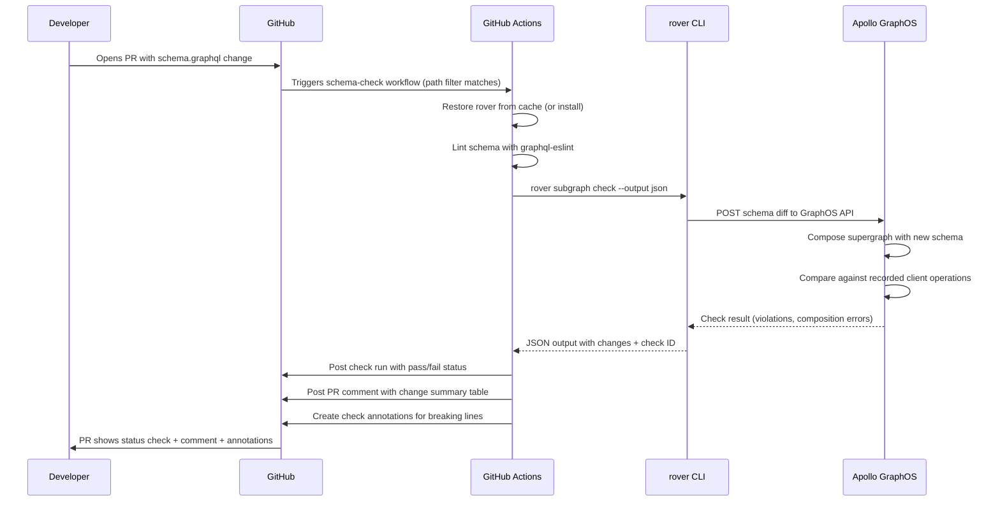

# Schema Check GitHub Actions Workflow

> The schema check workflow is the primary quality gate for every GraphQL schema change. It runs
> automatically on every pull request that touches SDL files, reports breaking changes and
> composition errors directly in the PR interface, integrates with GitHub's required status checks,
> and routes changes to the right reviewers through CODEOWNERS. This document covers the complete
> implementation of a production-grade schema check workflow.

## Learning Objectives

- [ ] Configure rover subgraph check to run as a required PR status check
- [ ] Post structured PR comments with a formatted table of breaking and safe schema changes
- [ ] Annotate specific lines in the SDL file with GitHub check annotations for breaking changes
- [ ] Integrate CODEOWNERS so changes to shared types require schema-owners team review
- [ ] Cache the rover binary across workflow runs using actions/cache with version-keyed cache keys
- [ ] Distinguish between breaking changes, composition errors, and rover authentication errors
- [ ] Handle the `override-breaking-change` workflow for intentional breaking changes

---

## Overview

### What the Schema Check Workflow Does

When a developer opens a pull request that modifies `schema.graphql`, the schema check workflow
fires automatically. It validates the proposed schema change against the supergraph composed from
all current subgraph schemas registered in Apollo GraphOS. The check answers three questions:

1. **Does the SDL parse?** Syntax errors and invalid GraphQL are caught immediately.
2. **Does the supergraph still compose?** If this change breaks federation composition — for
   example, by removing a field that another subgraph's `@requires` directive depends on — the
   composition fails and the check fails.
3. **Does the change break any existing clients?** Apollo GraphOS compares the new schema against
   recorded client operations. If a client operation references a field that is being removed or
   a type that is being renamed, the check reports the specific operations at risk.

The workflow surfaces these results in three ways: as a GitHub Actions status check (pass/fail),
as a PR comment with a human-readable change summary, and as GitHub check annotations that
highlight the specific SDL lines responsible for breaking changes.

### Workflow Architecture



### Handling Different Failure Types

Not all check failures have the same cause or resolution path. The workflow must distinguish
between them and provide actionable messages.

| Failure Type | Cause | Resolution |
|---|---|---|
| SDL parse error | Invalid GraphQL syntax | Fix the SDL |
| Composition error | Federation directive mismatch | Coordinate with owning subgraph team |
| Breaking change (no affected clients) | Removed field with no recorded usage | Apply `override-breaking-change` label |
| Breaking change (with affected clients) | Removed field with active client usage | Migrate clients before removing field |
| rover auth error | Invalid or expired APOLLO_KEY | Rotate the API key secret |
| GraphOS API unavailable | Transient upstream failure | Retry; check GraphOS status page |

---

## Core Concepts

### Required Status Checks

GitHub branch protection rules can require specific status checks to pass before a PR can be
merged. For the schema check workflow, configure the branch protection rule on `main` to require
the `GraphQL / schema-check` status check. The status check name matches the job name in the
workflow YAML (`jobs.schema-check.name`).

With this protection in place, a PR that introduces a breaking change cannot be merged until
either the check passes (after the developer fixes the change) or the check is overridden by
a repository administrator. This is the primary enforcement mechanism for schema governance.

### PR Comments as a Communication Interface

Status checks tell developers whether a check passed or failed. PR comments tell them exactly
what changed and why. The workflow uses the GitHub API to post a structured comment on the PR
showing a table of schema changes organized by severity: breaking changes first, then non-breaking
additions and modifications.

The comment is updated on each push to the PR branch rather than creating a new comment each
time. This keeps the PR timeline clean. The workflow finds the previous bot comment by searching
for a unique marker string in the comment body and updates it in place.

### CODEOWNERS for Schema Review Routing

Certain schema changes require review from the platform schema team regardless of which subgraph
is being changed. Changes to shared enum types, federation directives, or custom scalar
definitions affect all subgraphs and should not merge without schema-owners review.

GitHub's CODEOWNERS file, when combined with branch protection's required reviewers setting,
automatically requests review from the right team and prevents merge until that review is
approved.

```
# .github/CODEOWNERS

# Any change to a schema file requires the schema-owners team
*.graphql @my-org/schema-owners

# Shared type definitions require senior architect review
schema/shared/*.graphql @my-org/schema-owners @my-org/principal-engineers

# The reusable pipeline workflow itself requires platform team review
.github/workflows/subgraph-pipeline.yml @my-org/platform-team
```

### Check Annotations

GitHub check annotations attach messages to specific lines of specific files in a PR. They appear
inline in the Files Changed tab, making it immediately clear which line of the SDL causes a
breaking change. Annotations are created via the GitHub Checks API, which GitHub Actions exposes
through the `actions/github-script` action.

Breaking changes reported by Apollo GraphOS include information about which type and field are
affected. The workflow parses this information and creates an annotation pointing to the relevant
line in the schema file.

---

## Real-World Implementation

### Complete Schema Check Workflow

```yaml
# .github/workflows/schema-check.yml
name: GraphQL Schema Check

on:
  pull_request:
    branches: [main]
    paths:
      - "schema.graphql"
      - "schema/**/*.graphql"
      - ".graphqlrc.yml"

# Only run one schema check at a time per PR branch.
# Cancel older runs when a new commit is pushed.
concurrency:
  group: schema-check-${{ github.head_ref }}
  cancel-in-progress: true

env:
  APOLLO_KEY: ${{ secrets.APOLLO_KEY }}
  APOLLO_GRAPH_ID: ${{ vars.APOLLO_GRAPH_ID }}
  ROVER_VERSION: "0.24.0"
  SCHEMA_PATH: "schema.graphql"
  SUBGRAPH_NAME: ${{ vars.SUBGRAPH_NAME }}

jobs:
  schema-check:
    name: Schema Check
    runs-on: ubuntu-latest
    permissions:
      # Required to post PR comments
      pull-requests: write
      # Required to create check annotations
      checks: write
      # Required to read repository contents
      contents: read

    steps:
      # ── Checkout ──────────────────────────────────────────────────
      - name: Checkout PR branch
        uses: actions/checkout@v4
        with:
          # Fetch two commits so we can diff within the PR
          fetch-depth: 2

      # ── Rover setup ───────────────────────────────────────────────
      - name: Cache rover binary
        id: cache-rover
        uses: actions/cache@v4
        with:
          path: ~/.rover/bin
          key: rover-linux-${{ env.ROVER_VERSION }}
          restore-keys: |
            rover-linux-

      - name: Install rover CLI
        if: steps.cache-rover.outputs.cache-hit != 'true'
        run: |
          curl -sSL https://rover.apollo.dev/nix/v${{ env.ROVER_VERSION }} | sh

      - name: Add rover to PATH
        run: echo "$HOME/.rover/bin" >> $GITHUB_PATH

      - name: Log rover version
        run: rover --version

      # ── Node.js and graphql-eslint ────────────────────────────────
      - name: Setup Node.js
        uses: actions/setup-node@v4
        with:
          node-version: "20"
          cache: "npm"

      - name: Install linting dependencies
        run: |
          npm install --save-dev \
            @graphql-eslint/eslint-plugin \
            eslint \
            graphql \
            graphql-inspector
        env:
          NPM_CONFIG_FUND: "false"

      # ── Lint ──────────────────────────────────────────────────────
      - name: Lint schema with graphql-eslint
        id: lint
        run: |
          npx eslint \
            --ext .graphql \
            --format json \
            --output-file lint-results.json \
            ${{ env.SCHEMA_PATH }} || LINT_EXIT=$?

          # Also output human-readable format to the log
          npx eslint --ext .graphql --format stylish ${{ env.SCHEMA_PATH }} || true

          # Surface lint violations as annotations
          if [ -f lint-results.json ]; then
            node -e "
              const results = require('./lint-results.json');
              results.forEach(file => {
                file.messages.forEach(msg => {
                  const level = msg.severity === 2 ? 'error' : 'warning';
                  console.log('::' + level + ' file=' + file.filePath + ',line=' + msg.line + ',col=' + msg.column + '::' + msg.message);
                });
              });
            "
          fi

          exit ${LINT_EXIT:-0}

      # ── Schema check against staging variant ─────────────────────
      - name: Run rover subgraph check
        id: check
        run: |
          set -o pipefail

          # Run rover and capture both stdout/stderr and exit code
          set +e
          CHECK_OUTPUT=$(~/.rover/bin/rover subgraph check \
            "${{ env.APOLLO_GRAPH_ID }}@staging" \
            --name "${{ env.SUBGRAPH_NAME }}" \
            --schema "${{ env.SCHEMA_PATH }}" \
            --output json 2>&1)
          CHECK_EXIT=$?
          set -e

          # Write the full output for downstream steps
          echo "$CHECK_OUTPUT" > rover-check-output.json

          # Log it for debugging
          echo "rover exit code: $CHECK_EXIT"
          echo "$CHECK_OUTPUT" | jq . 2>/dev/null || echo "$CHECK_OUTPUT"

          # Classify the failure type for downstream steps
          if [ $CHECK_EXIT -ne 0 ]; then
            if echo "$CHECK_OUTPUT" | grep -q "authentication"; then
              echo "failure_type=auth_error" >> $GITHUB_OUTPUT
            elif echo "$CHECK_OUTPUT" | grep -q "composition"; then
              echo "failure_type=composition_error" >> $GITHUB_OUTPUT
            else
              echo "failure_type=breaking_change" >> $GITHUB_OUTPUT
            fi
          else
            echo "failure_type=none" >> $GITHUB_OUTPUT
          fi

          # Extract check ID and changes for PR comment
          CHECK_ID=$(echo "$CHECK_OUTPUT" | jq -r '.data.checkSchemaResult.diffToPrevious.id // "unknown"' 2>/dev/null || echo "unknown")
          echo "check_id=$CHECK_ID" >> $GITHUB_OUTPUT

          # Extract change counts
          BREAKING=$(echo "$CHECK_OUTPUT" | jq '[.data.checkSchemaResult.diffToPrevious.changes[]? | select(.severity == "BREAKING")] | length' 2>/dev/null || echo "0")
          SAFE=$(echo "$CHECK_OUTPUT" | jq '[.data.checkSchemaResult.diffToPrevious.changes[]? | select(.severity != "BREAKING")] | length' 2>/dev/null || echo "0")
          echo "breaking_count=$BREAKING" >> $GITHUB_OUTPUT
          echo "safe_count=$SAFE" >> $GITHUB_OUTPUT

          # Write structured changes for the PR comment step
          echo "$CHECK_OUTPUT" | jq '.data.checkSchemaResult.diffToPrevious.changes // []' > schema-changes.json 2>/dev/null || echo "[]" > schema-changes.json

          exit $CHECK_EXIT

      # ── Create check annotations for breaking changes ─────────────
      - name: Annotate breaking changes
        if: always() && steps.check.outputs.failure_type == 'breaking_change'
        uses: actions/github-script@v7
        with:
          script: |
            const fs = require('fs');
            let changes = [];
            try {
              changes = JSON.parse(fs.readFileSync('schema-changes.json', 'utf8'));
            } catch {
              core.warning('Could not parse schema changes JSON');
            }

            const breaking = changes.filter(c => c.severity === 'BREAKING');

            for (const change of breaking) {
              // Apollo GraphOS provides the affected type and field; map to SDL line numbers
              // by searching the schema file for the relevant definition.
              const schemaContent = fs.readFileSync(process.env.SCHEMA_PATH, 'utf8').split('\n');
              const searchTerm = change.path ? change.path.split('.').pop() : '';
              const lineIndex = searchTerm
                ? schemaContent.findIndex(line => line.includes(searchTerm))
                : 0;
              const lineNumber = lineIndex >= 0 ? lineIndex + 1 : 1;

              core.error(change.description || change.type, {
                title: `Breaking Change: ${change.type}`,
                file: process.env.SCHEMA_PATH,
                startLine: lineNumber,
              });
            }
        env:
          SCHEMA_PATH: ${{ env.SCHEMA_PATH }}

      # ── Post PR comment with change summary ───────────────────────
      - name: Post schema diff comment
        if: always()
        uses: actions/github-script@v7
        with:
          script: |
            const fs = require('fs');
            const checkStep = ${{ toJson(steps.check) }};
            const failureType = checkStep.outputs?.failure_type || 'none';
            const breakingCount = parseInt(checkStep.outputs?.breaking_count || '0');
            const safeCount = parseInt(checkStep.outputs?.safe_count || '0');
            const checkId = checkStep.outputs?.check_id || 'unknown';

            let changes = [];
            try {
              changes = JSON.parse(fs.readFileSync('schema-changes.json', 'utf8'));
            } catch {
              // Changes file may not exist if rover failed before producing output
            }

            const breaking = changes.filter(c => c.severity === 'BREAKING');
            const safe = changes.filter(c => c.severity !== 'BREAKING');

            // Build the comment body
            const lines = [
              '<!-- graphql-schema-check-comment -->',
              '## GraphQL Schema Check Results',
              '',
            ];

            // Status line
            if (failureType === 'auth_error') {
              lines.push('> **Error:** Authentication failed. The `APOLLO_KEY` secret may be invalid or expired.');
            } else if (failureType === 'composition_error') {
              lines.push('> **Composition Error:** The proposed schema change breaks supergraph composition.');
              lines.push('> Review the workflow logs for the full composition error message.');
            } else if (failureType === 'breaking_change') {
              lines.push(`> **${breakingCount} breaking change${breakingCount !== 1 ? 's' : ''} detected.** `
                + `Review the changes below. Apply the \`override-breaking-change\` label if this change is intentional and clients have been migrated.`);
            } else {
              lines.push(`> **Schema check passed.** ${safeCount > 0 ? `${safeCount} safe change${safeCount !== 1 ? 's' : ''} detected.` : 'No schema changes detected.'}`);
            }

            lines.push('');

            // Breaking changes table
            if (breaking.length > 0) {
              lines.push('### Breaking Changes');
              lines.push('');
              lines.push('| Type | Field/Path | Description |');
              lines.push('|------|-----------|-------------|');
              for (const change of breaking) {
                const type = change.type || '';
                const path = change.path || '';
                const description = (change.description || '').replace(/\|/g, '\\|');
                lines.push(`| \`${type}\` | \`${path}\` | ${description} |`);
              }
              lines.push('');
            }

            // Safe changes table
            if (safe.length > 0) {
              lines.push('### Safe Changes');
              lines.push('');
              lines.push('| Type | Field/Path | Description |');
              lines.push('|------|-----------|-------------|');
              for (const change of safe) {
                const type = change.type || '';
                const path = change.path || '';
                const description = (change.description || '').replace(/\|/g, '\\|');
                lines.push(`| \`${type}\` | \`${path}\` | ${description} |`);
              }
              lines.push('');
            }

            // Footer with links
            if (checkId && checkId !== 'unknown') {
              const graphId = process.env.APOLLO_GRAPH_ID;
              lines.push('---');
              lines.push(`[View full check results in Apollo Studio](https://studio.apollographql.com/graph/${graphId}/checks/${checkId})`);
            }

            const body = lines.join('\n');
            const marker = '<!-- graphql-schema-check-comment -->';

            // Find and update existing comment, or create a new one
            const { data: comments } = await github.rest.issues.listComments({
              owner: context.repo.owner,
              repo: context.repo.repo,
              issue_number: context.issue.number,
            });

            const existing = comments.find(c => c.body.includes(marker));

            if (existing) {
              await github.rest.issues.updateComment({
                owner: context.repo.owner,
                repo: context.repo.repo,
                comment_id: existing.id,
                body,
              });
            } else {
              await github.rest.issues.createComment({
                owner: context.repo.owner,
                repo: context.repo.repo,
                issue_number: context.issue.number,
                body,
              });
            }
        env:
          APOLLO_GRAPH_ID: ${{ env.APOLLO_GRAPH_ID }}

      # ── Handle override label ──────────────────────────────────────
      # If a breaking change is detected but the PR has the override label,
      # downgrade the failure to a warning so the PR can still merge.
      - name: Check for breaking change override label
        if: failure() && steps.check.outputs.failure_type == 'breaking_change'
        uses: actions/github-script@v7
        with:
          script: |
            const labels = context.payload.pull_request.labels.map(l => l.name);
            const hasOverride = labels.includes('override-breaking-change');

            if (hasOverride) {
              core.warning(
                'Breaking change detected but overridden by label. ' +
                'Ensure all affected clients have been migrated before merging.'
              );
              // Exit 0 to allow the workflow to succeed despite breaking change
              process.exit(0);
            } else {
              core.setFailed(
                'Breaking changes detected. Fix the breaking changes or apply the ' +
                "'override-breaking-change' label if this is intentional."
              );
            }

      # ── Diff with graphql-inspector (informational) ───────────────
      - name: Generate graphql-inspector diff
        if: always() && steps.check.outcome != 'skipped'
        continue-on-error: true
        run: |
          # graphql-inspector provides a local diff for quick review in the log
          # This is supplementary to the Apollo GraphOS check above.
          # It compares the PR branch schema against the base branch schema.
          git show HEAD~1:${{ env.SCHEMA_PATH }} > /tmp/base-schema.graphql 2>/dev/null || \
            echo "type Query { placeholder: String }" > /tmp/base-schema.graphql

          npx graphql-inspector diff \
            /tmp/base-schema.graphql \
            ${{ env.SCHEMA_PATH }} \
            --format json > /tmp/inspector-diff.json 2>&1 || true

          echo "graphql-inspector diff results:"
          cat /tmp/inspector-diff.json | jq . 2>/dev/null || cat /tmp/inspector-diff.json
```

### graphqlrc Configuration for Linting

The `.graphqlrc.yml` file configures graphql-eslint rules. This file lives in the subgraph
repository root and is committed alongside the schema.

```yaml
# .graphqlrc.yml
schema: ./schema.graphql
extensions:
  customScalars:
    - DateTime
    - JSON
    - UUID

overrides:
  - files: "*.graphql"
    plugins:
      - "@graphql-eslint/eslint-plugin"
    parser: "@graphql-eslint/eslint-plugin"
    parserOptions:
      schema: ./schema.graphql
    rules:
      # Naming conventions
      "@graphql-eslint/naming-convention":
        - error
        - types: PascalCase
          FieldDefinition: camelCase
          InputValueDefinition: camelCase
          EnumValueDefinition: UPPER_CASE
          DirectiveDefinition: camelCase
          Argument: camelCase

      # Descriptions required on all public types
      "@graphql-eslint/require-description":
        - error
        - types: true
          FieldDefinition: true
          InputObjectTypeDefinition: true
          EnumTypeDefinition: true

      # No deprecated fields without a reason
      "@graphql-eslint/no-deprecated":
        - warn

      # Unique type names
      "@graphql-eslint/unique-type-names":
        - error

      # Lone executable document — schema files should not contain operations
      "@graphql-eslint/no-anonymous-operations":
        - error
```

### CODEOWNERS Configuration

```
# .github/CODEOWNERS
#
# Schema files always require review from the schema-owners team.
# This is enforced by GitHub's required reviewers feature when combined
# with branch protection rules.

# All GraphQL schema files — requires schema governance review
*.graphql @my-org/schema-owners

# Shared type library — requires senior architect sign-off
schema/shared/ @my-org/schema-owners @my-org/architecture-review-board

# Federation-specific schema files
schema/federation/ @my-org/schema-owners @my-org/platform-team

# The CI pipeline itself
.github/workflows/schema-check.yml @my-org/platform-team
.graphqlrc.yml @my-org/schema-owners
```

### Branch Protection Configuration (via GitHub CLI)

```bash
# Configure branch protection rules for the main branch
# to require the schema check as a required status check.
gh api repos/my-org/users-service/branches/main/protection \
  --method PUT \
  --field required_status_checks='{"strict":true,"contexts":["GraphQL / schema-check"]}' \
  --field enforce_admins=false \
  --field required_pull_request_reviews='{"required_approving_review_count":1,"require_code_owner_reviews":true}' \
  --field restrictions=null

# Alternatively, set this through the GitHub web UI:
# Settings > Branches > Add rule > Require status checks > Search for "Schema Check"
```

---

## Production Considerations

### Performance

**The PR comment update pattern** (find-and-update rather than always-create) is critical for
performance on long-lived PRs. A PR with 20 commits would accumulate 20 identical bot comments
without this pattern. The `listComments` API call is fast enough (typically under 500ms) to be
acceptable in CI.

**Rover cold installs** take 20–30 seconds. Caching the binary reduces this to under two seconds
for cache hits. On GitHub's hosted runners, cache hit rates are high for stable version keys
because runners in the same region share caches across workflow runs.

**graphql-eslint performance** degrades with very large SDL files. For schemas exceeding 5,000
lines, consider splitting into multiple files and running eslint with `--ext .graphql` on
the directory rather than a single file. The parser performance scales roughly linearly with
schema size.

### Security

**The PR comment step requires `pull-requests: write` permission.** GitHub Actions workflows
triggered by `pull_request` from forks do not have write permissions by default, which is correct
— a fork PR should not be able to post comments that appear as bot comments from your organization.
For internal PRs (same organization, same repo), write permissions are safe.

**The `override-breaking-change` label** should only be createable by the schema-owners team.
Configure label permissions via the GitHub API or organization settings to prevent developers
from self-approving breaking changes.

**Rover output may contain sensitive GraphQL operation names** from recorded client operations
that Apollo GraphOS identified as affected by the change. Ensure workflow logs are not publicly
accessible if client operation names are considered sensitive.

### Observability

Track these metrics over time to understand schema health:

- Number of PRs with breaking changes per week (leading indicator of schema instability)
- Schema check pass rate (high failure rates may indicate insufficient design review)
- Time from PR open to schema check completion (should be under two minutes)
- Override label usage rate (high usage suggests breaking changes are not being caught early enough)

---

## Best Practices

1. **Update the PR comment in place rather than creating new comments** — A PR with many commits should not have many identical bot comments. Find the previous comment by a unique HTML comment marker and update it. This keeps the PR timeline readable.

2. **Classify failures before reporting them** — An "authentication error" requires a different response than a "breaking change." Parse the rover output to determine the failure type and tailor the error message accordingly.

3. **Link directly to Apollo Studio from the PR comment** — A link to the specific check result in Apollo Studio (`https://studio.apollographql.com/graph/{id}/checks/{check_id}`) dramatically reduces the time to diagnose a failure. Include the link in the PR comment footer.

4. **Set `continue-on-error: true` on supplementary steps** — The graphql-inspector diff step provides useful information but is not the authoritative check. Mark it with `continue-on-error: true` so a bug in the supplementary step does not block the PR.

5. **Store the previous schema version in the workflow artifact for comparison** — Use `actions/upload-artifact` to save the schema file from each successful publish. Use `actions/download-artifact` in the check workflow to diff against the last published version rather than the git parent commit.

6. **Run linting before the rover check** — Linting is faster and catches a different class of errors (naming conventions, missing descriptions). Running it first means a developer gets faster feedback on style issues without waiting for the rover round-trip to Apollo GraphOS.

7. **Document the override process in the PR comment itself** — When a breaking change is detected, the comment should explicitly tell the developer how to override it: "Apply the `override-breaking-change` label if this change is intentional and all affected clients have been migrated."

---

## Anti-Patterns

**Failing silently on rover auth errors** — If rover cannot authenticate with Apollo GraphOS,
it exits non-zero but the error is different from a breaking change. Without classifying the
failure, developers see a generic "schema check failed" message and waste time looking for
breaking changes that do not exist.

**Creating a new PR comment on every push** — Without the find-and-update pattern, a developer
who pushes 10 times to address reviewer feedback generates 10 bot comments. This is noise and
makes the PR timeline hard to follow.

**Using `pull_request_target` for schema checks on forks** — `pull_request_target` runs in
the context of the base branch and has access to secrets, which is necessary for posting PR
comments on fork PRs. However, this is a security risk if the workflow runs untrusted code from
the fork. For schema checks, restrict to `pull_request` (no fork PRs) or carefully sandbox
the untrusted steps.

**Requiring schema-owners review on every PR regardless of what changed** — CODEOWNERS applies
the review requirement to any PR that touches a matching file. If a developer updates a comment
in the SDL file, they should not need schema-owners review. Consider whether your governance
policy actually requires this level of oversight or whether the review should be optional.

---

## Operational Notes

- Apollo GraphOS schema checks are rate-limited per graph. For high-frequency repositories with
  many developers opening PRs simultaneously, the checks may queue. The workflow's `concurrency:`
  group with `cancel-in-progress: true` naturally throttles this by ensuring only the latest
  commit per branch is being checked at any time.
- The `check_id` output from `rover subgraph check` is the UUID of the check run in Apollo
  GraphOS. Storing this in the PR comment as a link is valuable for audit trails.
- Schema checks in Apollo GraphOS run against a specific variant (`@staging` in this example).
  Ensure the staging variant's schema is kept in sync with the production variant. A check run
  against an outdated staging schema may miss composition conflicts that would appear in production.
- GitHub's `GITHUB_TOKEN` is automatically available to the workflow and does not need to be
  explicitly passed. Actions that use `actions/github-script` access it via the `github` object
  automatically.

---

## References

- [Apollo GraphOS: Schema checks](https://www.apollographql.com/docs/graphos/delivery/schema-checks)
- [GitHub Actions: Creating check annotations](https://docs.github.com/en/actions/using-workflows/workflow-commands-for-github-actions#setting-an-error-message)
- [graphql-inspector: Schema diff](https://the-guild.dev/graphql/inspector/docs/essentials/diff)

---

## Related Topics

- [01-reusable-workflows.md](./01-reusable-workflows.md) — Reusable pipeline structure
- [03-publish-pipeline.md](./03-publish-pipeline.md) — Publishing after check passes
- [docs/09-schema-governance/](../09-schema-governance/) — CODEOWNERS strategy and review processes
- [docs/10-schema-validation/](../10-schema-validation/) — Schema validation rules and enforcement
