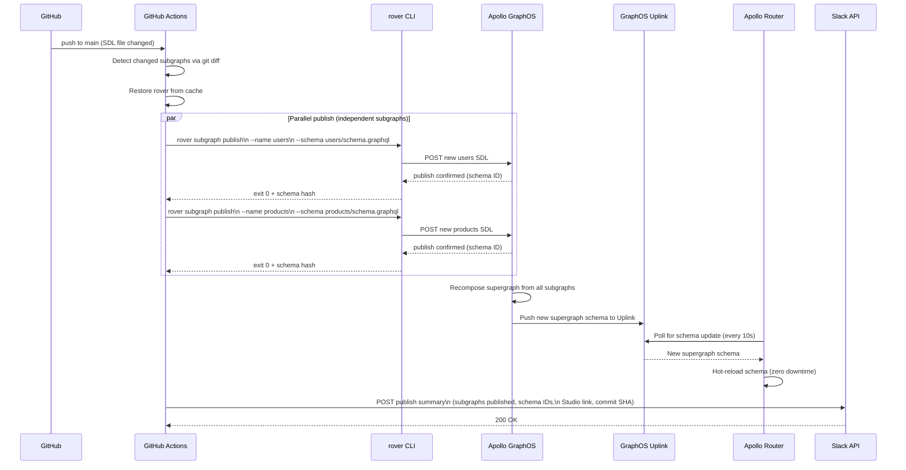

# Schema Publish GitHub Actions Workflow

> The schema publish workflow is the automated bridge between a merged pull request and a live
> supergraph update in Apollo GraphOS. It runs `rover subgraph publish` for every subgraph whose
> SDL changed, manages the sequencing of parallel versus ordered publishes, triggers router
> hot-reload via the GraphOS Uplink, and posts a structured Slack notification with the publish
> summary and a link to the updated supergraph. This document covers the complete implementation
> of a production-grade schema publish pipeline including rollback procedures.

## Learning Objectives

- [ ] Understand the difference between schema check (PR-time) and schema publish (post-merge)
      and why they must be separate workflows
- [ ] Implement a complete `schema-publish.yml` that runs on push to main with SDL path filters
- [ ] Design parallel vs. sequential subgraph publish strategies and choose the right one for
      each dependency topology
- [ ] Build a rollback workflow that re-publishes a previous SDL version from git history
- [ ] Send structured Slack notifications with publish outcome, affected subgraphs, and links
      to Apollo Studio for immediate verification
- [ ] Handle partial publish failures — when one subgraph publish fails mid-pipeline — safely
- [ ] Cache the rover binary across workflow runs to minimize publish latency

---

## Overview

### Why Publish is a Separate Workflow from Check

Schema check and schema publish are operationally distinct concerns that must not be merged into
a single workflow.

**Schema check** runs on every pull request. It is a read-only, non-destructive operation that
validates a proposed schema change without modifying the GraphOS registry. It can run many times,
be re-triggered, and fail safely. Its job is to block bad changes before they merge.

**Schema publish** runs exactly once, after a PR merges to main. It is a write operation that
updates the authoritative subgraph schema in the GraphOS registry, which triggers supergraph
recomposition and — when managed federation is enabled — pushes the new supergraph to the router
via Uplink. Publish is irreversible in the sense that once a new schema is published, the old
schema is superseded. Rollback requires re-publishing the previous version.

Running both in the same workflow creates timing hazards: if a PR is merged while a check is
running on another PR, the two workflows can interleave and publish an intermediate state. Keeping
them separate ensures that publish only runs on the post-merge state of main.

### Publish Sequencing: Parallel vs. Sequential

In a federated supergraph with multiple subgraphs, the order in which subgraphs are published
matters when there are cross-subgraph dependencies.

**Parallel publish** is correct when subgraphs are independent: they do not `@extend` each
other's types, do not `@require` each other's fields, and their SDL changes are isolated. Most
PR merges that touch a single subgraph can publish in parallel because only one subgraph is
changing.

**Sequential publish** is required when:
- A new entity is being added to subgraph A that subgraph B will immediately `@requires`
- A shared type is being moved between subgraphs (requires coordinated old/new publish)
- A federation version upgrade affects composition rules for all subgraphs simultaneously

The workflow detects which subgraphs changed using `git diff` against the merge base and uses
a dependency-aware matrix to schedule publishes correctly.

### Publish Architecture



---

## Core Concepts

### Subgraph Publish vs. Supergraph Composition

`rover subgraph publish` updates one subgraph's SDL in the GraphOS registry. After every
subgraph publish, GraphOS automatically recomposes the full supergraph from all registered
subgraph schemas. If recomposition fails (because the new subgraph SDL is incompatible with
other subgraphs), GraphOS marks the composition as failed and does not update the supergraph
that the router fetches. The router continues serving the last successfully composed supergraph.

This means a publish can "succeed" at the subgraph level (the SDL was stored) but result in a
failed composition. The workflow must check the composition status after publish and alert if
composition fails.

### Schema ID and Launch Tracking

Every publish generates a schema ID (a content hash of the SDL). Apollo GraphOS also creates a
"launch" for every supergraph recomposition — a traceable record of what changed, when, what
was composed, and whether it succeeded. The publish workflow captures the launch URL and includes
it in the Slack notification so engineers can immediately verify the composition outcome.

### Rover Authentication

`rover` authenticates to Apollo GraphOS using an `APOLLO_KEY` environment variable. The key is
a service API key scoped to the graph, stored as a GitHub Actions secret. The workflow never
prints the key value — GitHub Actions automatically masks it in logs, but the workflow also
explicitly avoids echoing the key in any constructed command string.

---

## Real-World Implementation

### Complete `schema-publish.yml`

```yaml
# .github/workflows/schema-publish.yml
#
# Schema publish workflow — runs on every push to main that changes SDL files.
# Publishes updated subgraph schemas to Apollo GraphOS, waits for composition,
# and notifies Slack with the outcome.
#
# Prerequisites:
#   Repository secrets required:
#     APOLLO_KEY              — Apollo service API key with graph write access
#     SLACK_BOT_TOKEN         — Slack bot OAuth token (chat:write scope)
#
#   Repository variables required (Settings → Secrets and variables → Variables):
#     APOLLO_GRAPH_REF        — e.g., your-graph-id@main
#     SLACK_CHANNEL_ID        — e.g., C0123456789 (schema-changes channel)
#     APOLLO_STUDIO_GRAPH_URL — e.g., https://studio.apollographql.com/graph/your-graph-id

name: Schema Publish

on:
  push:
    branches:
      - main
    paths:
      # Trigger only when SDL files or subgraph manifests change
      - "subgraphs/**/schema.graphql"
      - "subgraphs/**/subgraph.yaml"
      # Also trigger on shared type library changes
      - "schema-lib/**/*.graphql"

  # Allow manual trigger for forced re-publish (e.g., after a registry issue)
  workflow_dispatch:
    inputs:
      subgraph_name:
        description: "Specific subgraph to republish (leave empty for auto-detect)"
        required: false
        type: string
      force_all:
        description: "Republish all subgraphs regardless of what changed"
        required: false
        type: boolean
        default: false
      dry_run:
        description: "Dry run — detect and validate without publishing"
        required: false
        type: boolean
        default: false

# Only one publish at a time per branch — prevent interleaved publishes
# when multiple PRs merge in quick succession
concurrency:
  group: schema-publish-${{ github.ref }}
  cancel-in-progress: false  # Do NOT cancel in-progress publishes — let them finish

permissions:
  contents: read
  # Required for posting annotations and GitHub check results
  checks: write
  # Required for commenting on PRs (if the publish workflow opens issues on failure)
  issues: write

env:
  ROVER_VERSION: "0.27.0"
  ROVER_CACHE_KEY: "rover-${{ runner.os }}-0.27.0"

jobs:
  # ─────────────────────────────────────────────────────────────────────────────
  # JOB 1: Detect which subgraphs changed
  # ─────────────────────────────────────────────────────────────────────────────
  detect-changes:
    name: Detect Changed Subgraphs
    runs-on: ubuntu-latest
    outputs:
      # JSON array of subgraph names that changed: e.g., ["users","products"]
      changed_subgraphs: ${{ steps.detect.outputs.changed_subgraphs }}
      # Whether any subgraph changed at all
      has_changes: ${{ steps.detect.outputs.has_changes }}
      # The publish strategy: "parallel" or "sequential"
      publish_strategy: ${{ steps.strategy.outputs.publish_strategy }}
    steps:
      - name: Checkout repository
        uses: actions/checkout@v4
        with:
          # Fetch enough history to compute the diff against the prior commit
          fetch-depth: 2

      - name: Detect changed subgraphs
        id: detect
        run: |
          set -euo pipefail

          # Handle workflow_dispatch with explicit subgraph override
          if [[ "${{ github.event_name }}" == "workflow_dispatch" ]]; then
            if [[ "${{ inputs.force_all }}" == "true" ]]; then
              # Collect all subgraph names from the subgraphs directory
              CHANGED=$(find subgraphs -name "schema.graphql" -printf "%h\n" | \
                        xargs -I{} basename {} | jq -R . | jq -sc .)
            elif [[ -n "${{ inputs.subgraph_name }}" ]]; then
              CHANGED='["${{ inputs.subgraph_name }}"]'
            else
              # Fall through to git diff detection below
              CHANGED=""
            fi
          fi

          if [[ -z "${CHANGED:-}" ]]; then
            # Determine the base commit: for push events, compare HEAD~1
            # For merge commits, compare HEAD^2 (the second parent of the merge)
            BASE_SHA=$(git rev-parse HEAD~1)
            HEAD_SHA=$(git rev-parse HEAD)

            echo "Comparing ${BASE_SHA}..${HEAD_SHA}"

            # Find all SDL files that changed and extract their subgraph directory names
            CHANGED_FILES=$(git diff --name-only "${BASE_SHA}" "${HEAD_SHA}" \
              -- 'subgraphs/**/schema.graphql' 'subgraphs/**/subgraph.yaml')

            if [[ -z "${CHANGED_FILES}" ]]; then
              echo "No subgraph SDL files changed"
              echo "has_changes=false" >> "$GITHUB_OUTPUT"
              echo "changed_subgraphs=[]" >> "$GITHUB_OUTPUT"
              exit 0
            fi

            # Extract unique subgraph directory names
            CHANGED=$(echo "${CHANGED_FILES}" | \
              grep -oP 'subgraphs/\K[^/]+' | \
              sort -u | \
              jq -R . | \
              jq -sc .)
          fi

          echo "Changed subgraphs: ${CHANGED}"
          echo "changed_subgraphs=${CHANGED}" >> "$GITHUB_OUTPUT"
          echo "has_changes=true" >> "$GITHUB_OUTPUT"

      - name: Determine publish strategy
        id: strategy
        if: steps.detect.outputs.has_changes == 'true'
        run: |
          set -euo pipefail

          CHANGED='${{ steps.detect.outputs.changed_subgraphs }}'
          COUNT=$(echo "${CHANGED}" | jq 'length')

          # Check if any of the changed subgraphs are in the "ordered" dependency group.
          # These subgraphs have cross-references and must be published in a specific order.
          # Maintain this list in sync with your federation topology.
          ORDERED_SUBGRAPHS=("accounts" "billing" "notifications")

          NEEDS_SEQUENTIAL=false
          for sg in "${ORDERED_SUBGRAPHS[@]}"; do
            if echo "${CHANGED}" | jq -e --arg name "$sg" 'index($name) != null' > /dev/null; then
              NEEDS_SEQUENTIAL=true
              break
            fi
          done

          if [[ "$NEEDS_SEQUENTIAL" == "true" ]]; then
            echo "publish_strategy=sequential" >> "$GITHUB_OUTPUT"
            echo "One or more changed subgraphs require sequential publish"
          else
            echo "publish_strategy=parallel" >> "$GITHUB_OUTPUT"
            echo "All changed subgraphs can be published in parallel"
          fi

  # ─────────────────────────────────────────────────────────────────────────────
  # JOB 2: Parallel publish (independent subgraphs)
  # ─────────────────────────────────────────────────────────────────────────────
  publish-parallel:
    name: Publish Subgraph (${{ matrix.subgraph }})
    needs: detect-changes
    if: |
      needs.detect-changes.outputs.has_changes == 'true' &&
      needs.detect-changes.outputs.publish_strategy == 'parallel'
    runs-on: ubuntu-latest

    # Expand one job per changed subgraph — all run concurrently
    strategy:
      fail-fast: false  # Continue publishing other subgraphs even if one fails
      matrix:
        subgraph: ${{ fromJSON(needs.detect-changes.outputs.changed_subgraphs) }}

    environment:
      name: graphos-production
      url: ${{ vars.APOLLO_STUDIO_GRAPH_URL }}/schema/sdl

    outputs:
      # Each matrix job contributes to this output — last writer wins in GitHub Actions
      # Use the aggregate job below to collect all results
      publish_result: ${{ steps.publish.outputs.result }}

    steps:
      - name: Checkout repository
        uses: actions/checkout@v4

      - name: Restore rover from cache
        id: rover-cache
        uses: actions/cache@v4
        with:
          path: ~/.rover/bin
          key: ${{ env.ROVER_CACHE_KEY }}

      - name: Install rover
        if: steps.rover-cache.outputs.cache-hit != 'true'
        run: |
          curl -sSL https://rover.apollo.dev/nix/${{ env.ROVER_VERSION }} | sh
          echo "$HOME/.rover/bin" >> "$GITHUB_PATH"

      - name: Add rover to PATH (cache hit)
        if: steps.rover-cache.outputs.cache-hit == 'true'
        run: echo "$HOME/.rover/bin" >> "$GITHUB_PATH"

      - name: Validate subgraph directory exists
        run: |
          if [[ ! -d "subgraphs/${{ matrix.subgraph }}" ]]; then
            echo "ERROR: Subgraph directory 'subgraphs/${{ matrix.subgraph }}' not found"
            echo "Available subgraphs: $(ls subgraphs/)"
            exit 1
          fi

          if [[ ! -f "subgraphs/${{ matrix.subgraph }}/schema.graphql" ]]; then
            echo "ERROR: schema.graphql not found in subgraphs/${{ matrix.subgraph }}"
            exit 1
          fi

      - name: Read subgraph routing URL
        id: config
        run: |
          # Read the subgraph's routing URL from its manifest file
          # This URL is where the router sends queries for this subgraph
          ROUTING_URL=$(yq '.routing_url' "subgraphs/${{ matrix.subgraph }}/subgraph.yaml")
          echo "routing_url=${ROUTING_URL}" >> "$GITHUB_OUTPUT"

          # Read optional publish flags (e.g., --header for authenticated introspection)
          SUBGRAPH_VARIANT=$(yq '.variant // env(APOLLO_GRAPH_REF)' \
            "subgraphs/${{ matrix.subgraph }}/subgraph.yaml")
          echo "variant=${SUBGRAPH_VARIANT}" >> "$GITHUB_OUTPUT"

      - name: Publish subgraph schema to Apollo GraphOS
        id: publish
        env:
          APOLLO_KEY: ${{ secrets.APOLLO_KEY }}
          APOLLO_GRAPH_REF: ${{ vars.APOLLO_GRAPH_REF }}
        run: |
          set -euo pipefail

          SUBGRAPH="${{ matrix.subgraph }}"
          SCHEMA_PATH="subgraphs/${SUBGRAPH}/schema.graphql"
          ROUTING_URL="${{ steps.config.outputs.routing_url }}"

          echo "Publishing subgraph: ${SUBGRAPH}"
          echo "Schema path: ${SCHEMA_PATH}"
          echo "Routing URL: ${ROUTING_URL}"
          echo "Graph ref: ${APOLLO_GRAPH_REF}"

          # Dry-run mode — validate without publishing
          if [[ "${{ inputs.dry_run }}" == "true" ]]; then
            echo "DRY RUN: Would publish ${SUBGRAPH} to ${APOLLO_GRAPH_REF}"
            echo "result=dry-run-success" >> "$GITHUB_OUTPUT"
            exit 0
          fi

          # Run rover subgraph publish with JSON output for structured result parsing
          PUBLISH_OUTPUT=$(rover subgraph publish "${APOLLO_GRAPH_REF}" \
            --name "${SUBGRAPH}" \
            --schema "${SCHEMA_PATH}" \
            --routing-url "${ROUTING_URL}" \
            --output json 2>&1) || PUBLISH_EXIT=$?

          echo "Rover output:"
          echo "${PUBLISH_OUTPUT}" | jq .

          if [[ "${PUBLISH_EXIT:-0}" -ne 0 ]]; then
            echo "ERROR: rover subgraph publish failed for ${SUBGRAPH}"
            echo "result=failed" >> "$GITHUB_OUTPUT"
            # Extract human-readable error from JSON output
            ERROR_MSG=$(echo "${PUBLISH_OUTPUT}" | jq -r '.error.message // "Unknown error"')
            echo "::error title=Publish Failed::Subgraph ${SUBGRAPH}: ${ERROR_MSG}"
            exit 1
          fi

          # Extract schema hash and launch URL from the publish response
          SCHEMA_HASH=$(echo "${PUBLISH_OUTPUT}" | jq -r '.data.graph.publish.schema.hash // "unknown"')
          LAUNCH_URL=$(echo "${PUBLISH_OUTPUT}" | jq -r '.data.graph.publish.launch.url // ""')
          COMPOSITION_SUCCESS=$(echo "${PUBLISH_OUTPUT}" | \
            jq -r '.data.graph.publish.compositionConfig != null')

          echo "Schema hash: ${SCHEMA_HASH}"
          echo "Launch URL: ${LAUNCH_URL}"
          echo "Composition success: ${COMPOSITION_SUCCESS}"

          echo "result=success" >> "$GITHUB_OUTPUT"
          echo "schema_hash=${SCHEMA_HASH}" >> "$GITHUB_OUTPUT"
          echo "launch_url=${LAUNCH_URL}" >> "$GITHUB_OUTPUT"
          echo "composition_success=${COMPOSITION_SUCCESS}" >> "$GITHUB_OUTPUT"

          if [[ "${COMPOSITION_SUCCESS}" != "true" ]]; then
            echo "::warning title=Composition Failed::Subgraph SDL was published but supergraph composition failed. Router will continue serving the previous schema."
          fi

      - name: Annotate job summary
        if: always()
        run: |
          RESULT="${{ steps.publish.outputs.result }}"
          HASH="${{ steps.publish.outputs.schema_hash }}"
          LAUNCH_URL="${{ steps.publish.outputs.launch_url }}"

          {
            echo "## Subgraph Publish: ${{ matrix.subgraph }}"
            echo ""
            echo "| Field | Value |"
            echo "|---|---|"
            echo "| Status | ${RESULT} |"
            echo "| Schema Hash | \`${HASH}\` |"
            echo "| Commit | \`${{ github.sha }}\` |"
            if [[ -n "${LAUNCH_URL}" ]]; then
              echo "| Launch | [View in Apollo Studio](${LAUNCH_URL}) |"
            fi
          } >> "$GITHUB_STEP_SUMMARY"

  # ─────────────────────────────────────────────────────────────────────────────
  # JOB 3: Sequential publish (dependency-ordered subgraphs)
  # Publishes subgraphs in a defined dependency order when cross-subgraph
  # type references require coordinated schema updates.
  # ─────────────────────────────────────────────────────────────────────────────
  publish-sequential:
    name: Sequential Publish (Ordered)
    needs: detect-changes
    if: |
      needs.detect-changes.outputs.has_changes == 'true' &&
      needs.detect-changes.outputs.publish_strategy == 'sequential'
    runs-on: ubuntu-latest
    environment:
      name: graphos-production
      url: ${{ vars.APOLLO_STUDIO_GRAPH_URL }}/schema/sdl

    steps:
      - name: Checkout repository
        uses: actions/checkout@v4

      - name: Restore rover from cache
        id: rover-cache
        uses: actions/cache@v4
        with:
          path: ~/.rover/bin
          key: ${{ env.ROVER_CACHE_KEY }}

      - name: Install rover
        if: steps.rover-cache.outputs.cache-hit != 'true'
        run: |
          curl -sSL https://rover.apollo.dev/nix/${{ env.ROVER_VERSION }} | sh
          echo "$HOME/.rover/bin" >> "$GITHUB_PATH"

      - name: Add rover to PATH (cache hit)
        if: steps.rover-cache.outputs.cache-hit == 'true'
        run: echo "$HOME/.rover/bin" >> "$GITHUB_PATH"

      - name: Publish subgraphs in dependency order
        id: sequential-publish
        env:
          APOLLO_KEY: ${{ secrets.APOLLO_KEY }}
          APOLLO_GRAPH_REF: ${{ vars.APOLLO_GRAPH_REF }}
        run: |
          set -euo pipefail

          CHANGED_SUBGRAPHS='${{ needs.detect-changes.outputs.changed_subgraphs }}'

          # Dependency-ordered list of all subgraphs.
          # Only those present in CHANGED_SUBGRAPHS will be published.
          # Subgraphs earlier in this list are published first.
          ORDERED_SUBGRAPHS=(
            "accounts"      # Must publish before billing (billing @requires accounts.email)
            "billing"       # Depends on accounts entity
            "notifications" # Depends on accounts and billing entities
            "users"
            "products"
            "inventory"
            "orders"
            "search"
            "reviews"
          )

          RESULTS=()
          FAILED=false

          for SUBGRAPH in "${ORDERED_SUBGRAPHS[@]}"; do
            # Skip subgraphs that didn't change
            if ! echo "${CHANGED_SUBGRAPHS}" | jq -e --arg name "${SUBGRAPH}" \
              'index($name) != null' > /dev/null 2>&1; then
              echo "Skipping ${SUBGRAPH} (not in changed set)"
              continue
            fi

            SCHEMA_PATH="subgraphs/${SUBGRAPH}/schema.graphql"
            ROUTING_URL=$(yq '.routing_url' "subgraphs/${SUBGRAPH}/subgraph.yaml")

            echo "=========================================="
            echo "Publishing: ${SUBGRAPH}"
            echo "=========================================="

            PUBLISH_OUTPUT=$(rover subgraph publish "${APOLLO_GRAPH_REF}" \
              --name "${SUBGRAPH}" \
              --schema "${SCHEMA_PATH}" \
              --routing-url "${ROUTING_URL}" \
              --output json 2>&1) || PUBLISH_EXIT=$?

            if [[ "${PUBLISH_EXIT:-0}" -ne 0 ]]; then
              echo "ERROR: publish failed for ${SUBGRAPH}"
              echo "${PUBLISH_OUTPUT}" | jq .
              RESULTS+=("${SUBGRAPH}:FAILED")
              FAILED=true
              # In sequential mode, stop immediately on first failure to prevent
              # publishing downstream subgraphs that depend on this one
              break
            fi

            SCHEMA_HASH=$(echo "${PUBLISH_OUTPUT}" | jq -r '.data.graph.publish.schema.hash')
            RESULTS+=("${SUBGRAPH}:${SCHEMA_HASH}")
            echo "Published ${SUBGRAPH} → ${SCHEMA_HASH}"

            # Small delay between sequential publishes to allow GraphOS to
            # complete partial composition before the next subgraph is pushed.
            # This reduces the chance of intermediate composition errors during
            # a multi-subgraph coordinated update.
            sleep 3
          done

          echo "Publish results: ${RESULTS[*]}"

          if [[ "${FAILED}" == "true" ]]; then
            exit 1
          fi

  # ─────────────────────────────────────────────────────────────────────────────
  # JOB 4: Notify Slack with publish outcome
  # Runs after publish jobs complete, regardless of success or failure
  # ─────────────────────────────────────────────────────────────────────────────
  notify-slack:
    name: Notify Slack
    needs:
      - detect-changes
      - publish-parallel
      - publish-sequential
    # Run if detection ran — even if publish jobs were skipped or failed
    if: |
      always() &&
      needs.detect-changes.result == 'success' &&
      needs.detect-changes.outputs.has_changes == 'true'
    runs-on: ubuntu-latest

    steps:
      - name: Determine overall publish status
        id: status
        run: |
          PARALLEL_RESULT="${{ needs.publish-parallel.result }}"
          SEQUENTIAL_RESULT="${{ needs.publish-sequential.result }}"

          # Determine which publish job ran
          STRATEGY="${{ needs.detect-changes.outputs.publish_strategy }}"

          if [[ "${STRATEGY}" == "parallel" ]]; then
            OVERALL="${PARALLEL_RESULT}"
          else
            OVERALL="${SEQUENTIAL_RESULT}"
          fi

          if [[ "${OVERALL}" == "success" ]]; then
            echo "status=success" >> "$GITHUB_OUTPUT"
            echo "color=#36a64f" >> "$GITHUB_OUTPUT"
            echo "emoji=:white_check_mark:" >> "$GITHUB_OUTPUT"
          elif [[ "${OVERALL}" == "skipped" ]]; then
            echo "status=skipped" >> "$GITHUB_OUTPUT"
            echo "color=#cccccc" >> "$GITHUB_OUTPUT"
            echo "emoji=:white_circle:" >> "$GITHUB_OUTPUT"
          else
            echo "status=failed" >> "$GITHUB_OUTPUT"
            echo "color=#ff0000" >> "$GITHUB_OUTPUT"
            echo "emoji=:x:" >> "$GITHUB_OUTPUT"
          fi

      - name: Post Slack notification
        env:
          SLACK_BOT_TOKEN: ${{ secrets.SLACK_BOT_TOKEN }}
          SLACK_CHANNEL_ID: ${{ vars.SLACK_CHANNEL_ID }}
          STUDIO_URL: ${{ vars.APOLLO_STUDIO_GRAPH_URL }}
        run: |
          set -euo pipefail

          STATUS="${{ steps.status.outputs.status }}"
          COLOR="${{ steps.status.outputs.color }}"
          EMOJI="${{ steps.status.outputs.emoji }}"
          CHANGED='${{ needs.detect-changes.outputs.changed_subgraphs }}'
          STRATEGY="${{ needs.detect-changes.outputs.publish_strategy }}"

          # Build a human-readable list of changed subgraphs
          SUBGRAPH_LIST=$(echo "${CHANGED}" | jq -r '.[] | "• `\(.)`"' | tr '\n' '\n')

          # Construct the Slack Block Kit message
          MESSAGE=$(jq -n \
            --arg channel "${SLACK_CHANNEL_ID}" \
            --arg color "${COLOR}" \
            --arg emoji "${EMOJI}" \
            --arg status "${STATUS}" \
            --arg strategy "${STRATEGY}" \
            --arg subgraphs "${SUBGRAPH_LIST}" \
            --arg graph_ref "${{ vars.APOLLO_GRAPH_REF }}" \
            --arg commit "${{ github.sha }}" \
            --arg commit_short "$(echo '${{ github.sha }}' | cut -c1-8)" \
            --arg actor "${{ github.actor }}" \
            --arg run_url "https://github.com/${{ github.repository }}/actions/runs/${{ github.run_id }}" \
            --arg studio_url "${STUDIO_URL}" \
            --arg pr_title "${{ github.event.head_commit.message }}" \
            '{
              channel: $channel,
              attachments: [{
                color: $color,
                blocks: [
                  {
                    type: "header",
                    text: {
                      type: "plain_text",
                      text: "\($emoji) GraphQL Schema Publish: \($status | ascii_upcase)"
                    }
                  },
                  {
                    type: "section",
                    fields: [
                      {
                        type: "mrkdwn",
                        text: "*Graph Ref:*\n`\($graph_ref)`"
                      },
                      {
                        type: "mrkdwn",
                        text: "*Strategy:*\n\($strategy)"
                      },
                      {
                        type: "mrkdwn",
                        text: "*Commit:*\n<https://github.com/${{ github.repository }}/commit/\($commit)|\`\($commit_short)\`>"
                      },
                      {
                        type: "mrkdwn",
                        text: "*Published by:*\n\($actor)"
                      }
                    ]
                  },
                  {
                    type: "section",
                    text: {
                      type: "mrkdwn",
                      text: "*Subgraphs Published:*\n\($subgraphs)"
                    }
                  },
                  {
                    type: "section",
                    text: {
                      type: "mrkdwn",
                      text: "*Commit Message:*\n\($pr_title | split("\n")[0])"
                    }
                  },
                  {
                    type: "actions",
                    elements: [
                      {
                        type: "button",
                        text: {type: "plain_text", text: "Apollo Studio"},
                        url: $studio_url,
                        style: "primary"
                      },
                      {
                        type: "button",
                        text: {type: "plain_text", text: "GitHub Actions Run"},
                        url: $run_url
                      }
                    ]
                  }
                ]
              }]
            }')

          curl -sSf -X POST \
            -H "Authorization: Bearer ${SLACK_BOT_TOKEN}" \
            -H "Content-Type: application/json" \
            --data "${MESSAGE}" \
            https://slack.com/api/chat.postMessage | \
            jq -e '.ok == true' > /dev/null || {
              echo "WARNING: Slack notification failed — check SLACK_BOT_TOKEN and SLACK_CHANNEL_ID"
            }

  # ─────────────────────────────────────────────────────────────────────────────
  # JOB 5: Verify composition after publish
  # ─────────────────────────────────────────────────────────────────────────────
  verify-composition:
    name: Verify Supergraph Composition
    needs:
      - detect-changes
      - publish-parallel
      - publish-sequential
    if: |
      always() &&
      needs.detect-changes.outputs.has_changes == 'true' &&
      (needs.publish-parallel.result == 'success' || needs.publish-sequential.result == 'success')
    runs-on: ubuntu-latest

    steps:
      - name: Checkout repository
        uses: actions/checkout@v4

      - name: Restore rover from cache
        id: rover-cache
        uses: actions/cache@v4
        with:
          path: ~/.rover/bin
          key: ${{ env.ROVER_CACHE_KEY }}

      - name: Install rover
        if: steps.rover-cache.outputs.cache-hit != 'true'
        run: |
          curl -sSL https://rover.apollo.dev/nix/${{ env.ROVER_VERSION }} | sh
          echo "$HOME/.rover/bin" >> "$GITHUB_PATH"

      - name: Add rover to PATH (cache hit)
        if: steps.rover-cache.outputs.cache-hit == 'true'
        run: echo "$HOME/.rover/bin" >> "$GITHUB_PATH"

      - name: Fetch and verify supergraph schema
        env:
          APOLLO_KEY: ${{ secrets.APOLLO_KEY }}
          APOLLO_GRAPH_REF: ${{ vars.APOLLO_GRAPH_REF }}
        run: |
          set -euo pipefail

          echo "Fetching composed supergraph schema from GraphOS..."

          # Retry up to 3 times — composition may take a few seconds after publish
          for attempt in 1 2 3; do
            SUPERGRAPH=$(rover supergraph fetch "${APOLLO_GRAPH_REF}" 2>&1) && break || {
              echo "Attempt ${attempt} failed — waiting 10 seconds"
              sleep 10
            }
          done

          if [[ -z "${SUPERGRAPH}" ]]; then
            echo "::error::Could not fetch supergraph after 3 attempts — composition may have failed"
            exit 1
          fi

          echo "Supergraph fetch successful"
          echo "Schema size: $(echo "${SUPERGRAPH}" | wc -c) bytes"
          echo "Type count: $(echo "${SUPERGRAPH}" | grep -c '^type ' || true)"
```

### Rollback Workflow

```yaml
# .github/workflows/schema-rollback.yml
#
# Emergency rollback workflow — re-publishes the SDL from a previous git commit.
# Use this when a schema publish causes client errors or composition failures.
# Always file a post-incident review after using this workflow.

name: Schema Rollback (Emergency)

on:
  workflow_dispatch:
    inputs:
      rollback_commit:
        description: "Git SHA to rollback to (must be a commit on main)"
        required: true
        type: string
      subgraph_name:
        description: "Subgraph to rollback (required)"
        required: true
        type: string
      reason:
        description: "Reason for rollback (included in Slack notification and GitHub issue)"
        required: true
        type: string

concurrency:
  group: schema-publish-${{ github.ref }}
  cancel-in-progress: false

permissions:
  contents: read
  issues: write

jobs:
  rollback:
    name: Rollback ${{ inputs.subgraph_name }} to ${{ inputs.rollback_commit }}
    runs-on: ubuntu-latest
    environment:
      name: graphos-production-rollback
      # This environment requires approval from schema-owners before executing

    steps:
      - name: Checkout at rollback commit
        uses: actions/checkout@v4
        with:
          ref: ${{ inputs.rollback_commit }}
          fetch-depth: 1

      - name: Validate rollback commit is an ancestor of main
        run: |
          git fetch origin main --depth=100
          if ! git merge-base --is-ancestor "${{ inputs.rollback_commit }}" origin/main; then
            echo "ERROR: Rollback commit is not an ancestor of main"
            echo "Only commits on the main branch can be rolled back to"
            exit 1
          fi
          echo "Rollback commit is a valid ancestor of main"

      - name: Restore rover from cache
        id: rover-cache
        uses: actions/cache@v4
        with:
          path: ~/.rover/bin
          key: rover-${{ runner.os }}-0.27.0

      - name: Install rover
        if: steps.rover-cache.outputs.cache-hit != 'true'
        run: |
          curl -sSL https://rover.apollo.dev/nix/0.27.0 | sh
          echo "$HOME/.rover/bin" >> "$GITHUB_PATH"

      - name: Add rover to PATH (cache hit)
        if: steps.rover-cache.outputs.cache-hit == 'true'
        run: echo "$HOME/.rover/bin" >> "$GITHUB_PATH"

      - name: Re-publish SDL from rollback commit
        env:
          APOLLO_KEY: ${{ secrets.APOLLO_KEY }}
          APOLLO_GRAPH_REF: ${{ vars.APOLLO_GRAPH_REF }}
        run: |
          set -euo pipefail

          SUBGRAPH="${{ inputs.subgraph_name }}"
          SCHEMA_PATH="subgraphs/${SUBGRAPH}/schema.graphql"
          ROUTING_URL=$(yq '.routing_url' "subgraphs/${SUBGRAPH}/subgraph.yaml")

          echo "Rolling back ${SUBGRAPH} to commit ${{ inputs.rollback_commit }}"
          echo "Schema from: ${SCHEMA_PATH}"

          rover subgraph publish "${APOLLO_GRAPH_REF}" \
            --name "${SUBGRAPH}" \
            --schema "${SCHEMA_PATH}" \
            --routing-url "${ROUTING_URL}"

      - name: Open post-incident tracking issue
        uses: actions/github-script@v7
        with:
          script: |
            const issue = await github.rest.issues.create({
              owner: context.repo.owner,
              repo: context.repo.repo,
              title: `[Post-Incident] Schema Rollback: ${context.payload.inputs.subgraph_name}`,
              labels: ['schema-rollback', 'post-incident', 'needs-review'],
              body: `## Schema Rollback Executed

            | Field | Value |
            |---|---|
            | Subgraph | \`${context.payload.inputs.subgraph_name}\` |
            | Rolled Back To | \`${context.payload.inputs.rollback_commit}\` |
            | Triggered By | @${context.actor} |
            | Timestamp | ${new Date().toISOString()} |
            | Run | ${context.serverUrl}/${context.repo.owner}/${context.repo.repo}/actions/runs/${context.runId} |

            ## Reason

            ${context.payload.inputs.reason}

            ## Required Follow-Up

            - [ ] Identify root cause of the schema change that required rollback
            - [ ] File a PR that re-introduces the intended change correctly
            - [ ] Update schema check policies if the check workflow failed to catch this
            - [ ] Update this issue with root cause analysis
            `,
            });
            console.log(`Created post-incident issue: ${issue.data.html_url}`);
```

---

## Production Considerations

### Performance

**Rover binary caching**: The rover binary is ~25 MB. Without caching, each publish job spends
15-30 seconds downloading and installing rover. With `actions/cache`, subsequent runs restore
from cache in 2-3 seconds. Cache key on `runner.os` and `rover version` to invalidate on
version upgrades.

**Parallel publish throughput**: With 10 independent subgraphs and parallel matrix jobs, all
10 subgraphs can publish concurrently. The critical path is the slowest publish plus the
GraphOS composition time (~5-15 seconds). Without parallelism, 10 sequential publishes at
10 seconds each equals 100 seconds minimum.

**Composition verification timeout**: After publishing, GraphOS may take 5-30 seconds to
recompose the supergraph depending on schema complexity and current platform load. The verify
job uses a retry loop with a 10-second sleep between attempts rather than a fixed delay.

### Security

**APOLLO_KEY scoping**: Create a separate API key for CI with only subgraph publish permissions.
Do not use the graph's admin key. Rotate the key quarterly and after any team member departure.

**Environment gates**: The `publish-parallel` and `publish-sequential` jobs target a
`graphos-production` GitHub Actions environment. This environment requires at least one
designated approver, has a deployment protection rule requiring manual approval for any
workflow_dispatch run, and enforces IP allow-listing from GitHub Actions runner IP ranges.

**Signed commits**: Verify that the commit being published was signed by a known key. Add a
GPG verification step before publish to prevent unsigned commits from updating the schema
registry.

### Scaling

**Monorepo with many subgraphs**: When the monorepo contains 30+ subgraphs, the matrix
strategy can hit GitHub's 256-job limit per workflow run. Partition subgraphs into publishing
groups of 20 and chain the groups using `needs:`.

**Rate limiting**: Apollo GraphOS enforces rate limits on the publish API. If multiple
feature branches merge within seconds of each other, the `concurrency` key (with
`cancel-in-progress: false`) ensures publishes queue rather than run simultaneously. This
prevents rate limit errors but increases end-to-end latency for the second publish.

### Observability

Track these metrics to monitor publish pipeline health:

- `schema_publish_duration_seconds` — time from workflow trigger to publish complete
- `schema_publish_success_total` / `schema_publish_failure_total` — publish success rate
- `schema_composition_failure_total` — publishes that succeeded but left composition broken
- `schema_rollback_total` — frequency of emergency rollbacks (high values signal process issues)

Export these from the workflow via `workflow_run` events to a metrics aggregation endpoint
or use GitHub's REST API to scrape workflow run data into your observability platform.

---

## Best Practices

**Never publish from PR branches.** Schema publish belongs exclusively on the main branch
workflow. Publishing from a PR branch updates the production registry before code review is
complete and creates state that cannot be easily reconciled when the PR is revised.

**Use `--output json` consistently.** The JSON output format from rover is stable across patch
versions and parseable without text scraping. Always parse rover's JSON output for schema
hashes, launch URLs, and composition results.

**Fail-fast: false for parallel matrix.** When multiple subgraphs are publishing in parallel
and one fails, the other subgraphs should still publish. Use `fail-fast: false` in the matrix
strategy. Collect failures at the end and report them all rather than stopping at the first one.

**Always create a post-incident issue for rollbacks.** A rollback indicates a process failure:
either the schema check workflow failed to catch a bad change, or the change was not adequately
reviewed. The post-incident issue ensures root cause analysis happens and the process is
improved.

---

## Anti-Patterns

**Anti-pattern: Publishing on every commit, not just main.** Running publish on every push
(including feature branches) corrupts the GraphOS registry with development SDL that has not
been reviewed. Use the `branches: [main]` trigger without exception.

**Anti-pattern: Ignoring composition status after publish.** A successful `rover subgraph publish`
exit code means the SDL was stored — it does not mean the supergraph composed. Always check the
composition status in the publish output and alert when composition fails.

**Anti-pattern: Hardcoded APOLLO_KEY in workflow YAML.** Any secret in workflow YAML is
committed to git history permanently. Always use `${{ secrets.APOLLO_KEY }}`.

**Anti-pattern: Sequential publish for independent subgraphs.** Teams sometimes use sequential
publish "to be safe" even when subgraphs are truly independent. This extends publish time
unnecessarily. Map your actual federation dependencies and use parallel publish where there
are none.

---

## References

- [Rover CLI — subgraph publish](https://www.apollographql.com/docs/rover/commands/subgraphs#subgraph-publish)
- [Apollo GraphOS — Schema Checks Overview](https://www.apollographql.com/docs/graphos/schema-checks/)
- [GitHub Actions — Matrix Strategy](https://docs.github.com/en/actions/using-jobs/using-a-matrix-for-your-jobs)
- [GitHub Actions — Reusable Workflows](https://docs.github.com/en/actions/sharing-automations/reusing-workflows)
- [GitHub Actions — Environments](https://docs.github.com/en/actions/managing-workflow-runs-and-deployments/managing-deployments/managing-environments-for-deployment)
- [Slack Block Kit Builder](https://app.slack.com/block-kit-builder)
- [Apollo Router — Managed Federation](https://www.apollographql.com/docs/router/managed-federation/overview)

## Related Topics

- [Reusable Workflows](./01-reusable-workflows.md)
- [Schema Check Workflow](./02-schema-check-workflow.md)
- [Governance Workflows](./04-governance-workflows.md)
- [GitOps for GraphQL](../11-ci-cd-automation/04-gitops-for-graphql.md)
- [CI Pipeline Design](../11-ci-cd-automation/01-ci-pipeline-design.md)
- [Federation Architecture](../../docs/07-federation/README.md)
- [Schema Governance](../../docs/09-schema-governance/README.md)
