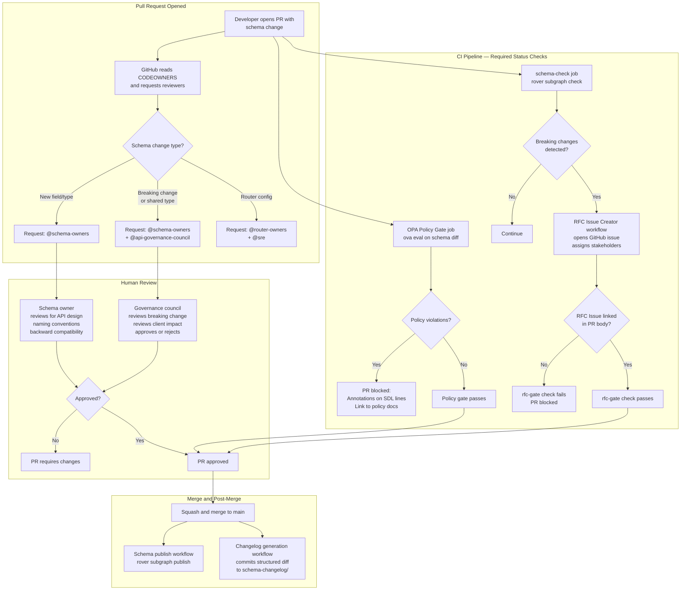

# GraphQL Schema Governance Workflows

> Schema governance is the set of automated and human processes that ensure every schema change
> to your federated supergraph is reviewed, policy-compliant, and traceable. This document covers
> the full governance stack: CODEOWNERS-based required reviewers, OPA policy gates that enforce
> platform-wide schema rules in CI, automatic RFC issue creation for breaking changes that require
> broader stakeholder input, and a changelog generation workflow that produces a structured
> schema evolution record for every release. Together these workflows transform schema governance
> from an ad-hoc review process into an auditable, enforceable, automated system.

## Learning Objectives

- [ ] Configure CODEOWNERS to enforce required reviewers for schema changes at the type, field,
      and subgraph level
- [ ] Write OPA (Open Policy Agent) policies that enforce GraphQL schema governance rules and
      wire them into the CI pipeline as a required status check
- [ ] Implement automatic RFC issue creation when a PR contains breaking changes, with a
      structured template and auto-assigned stakeholders
- [ ] Build a schema changelog generation workflow that extracts the diff between releases and
      commits a structured changelog to the repository
- [ ] Understand where each governance control fits in the review lifecycle and how they
      complement each other

---

## Overview

### The Governance Gap in Schema CI

Most teams implement schema CI that checks for breaking changes and composition errors. Far fewer
implement governance — the policy layer that sits above "does this compose?" and asks "should this
be allowed?"

Schema governance answers questions like:

- Is this field following the platform's naming convention (camelCase, no underscores)?
- Does this mutation return a result type (not a scalar), as required by platform policy?
- Has this breaking change been reviewed by the downstream client teams who will be affected?
- Is there a deprecation notice before removal, respecting the 90-day deprecation window?
- Has this new type been approved by the schema council, or was it added without review?

Without automated governance, these questions are enforced inconsistently — when the right
reviewer happens to notice the violation — or not at all. With automated governance, violations
block merge just like a compilation error, and the policy is the documentation.

### Governance Architecture

The governance stack consists of four layers, each operating at a different point in the
development lifecycle:

**Layer 1 — CODEOWNERS (PR open)**: GitHub routes PR review requests to the correct team
automatically based on what changed. Schema changes require schema-owners approval. Breaking
changes in shared types require additional approval from the API governance council.

**Layer 2 — OPA Policy Gate (CI, PR-time)**: An Open Policy Agent policy runs against the
proposed schema diff in CI. Violations produce structured failure messages that identify the
specific field or type that violated the policy, with a link to the policy documentation.

**Layer 3 — RFC Issue Creation (post-check, PR-time)**: When rover reports breaking changes,
a workflow automatically opens a GitHub issue using the RFC template, tags affected subgraph
owners, and blocks PR merge until the RFC issue is resolved and linked in the PR body.

**Layer 4 — Changelog Generation (post-merge)**: After a merge to main, the changelog workflow
generates a structured entry documenting every type and field that was added, modified, or
removed, and commits it to `schema-changelog/YYYY-MM.md`.

### Governance Review Process



---

## Core Concepts

### CODEOWNERS for Schema Governance

GitHub CODEOWNERS is the first enforcement layer. It runs before any CI job — the moment a PR
is opened, GitHub reads the CODEOWNERS file and automatically requests review from the matching
owners. No manual review assignment is needed.

For GraphQL governance, CODEOWNERS maps schema paths to ownership teams:

```
# .github/CODEOWNERS
#
# Schema ownership for the GraphQL supergraph.
# Changes to SDL files require review from the indicated team.
# All rules below are evaluated — the most specific rule wins
# for automatic review request, but ALL matching rules request review.

# Default: any schema change requires schema-owners review
/subgraphs/**/schema.graphql    @your-org/schema-owners

# Subgraph-specific ownership — each team owns their service's SDL
/subgraphs/users/               @your-org/users-team @your-org/schema-owners
/subgraphs/products/            @your-org/products-team @your-org/schema-owners
/subgraphs/inventory/           @your-org/supply-chain-team @your-org/schema-owners
/subgraphs/orders/              @your-org/orders-team @your-org/schema-owners
/subgraphs/billing/             @your-org/billing-team @your-org/schema-owners
/subgraphs/accounts/            @your-org/identity-team @your-org/schema-owners
/subgraphs/notifications/       @your-org/platform-team @your-org/schema-owners
/subgraphs/search/              @your-org/discovery-team @your-org/schema-owners

# Shared type library — changes require governance council approval
# because shared types affect multiple subgraphs and all consumers
/schema-lib/                    @your-org/api-governance-council @your-org/schema-owners

# Router configuration — platform and SRE team review
/subgraphs/**/subgraph.yaml     @your-org/platform-graphql
/router/                        @your-org/router-owners @your-org/sre

# Federation directives and composition config
/supergraph.yaml                @your-org/platform-graphql @your-org/schema-owners

# CI/CD pipeline changes — platform team + security review
/.github/workflows/schema-*.yml @your-org/platform-graphql @your-org/security
/.github/workflows/governance-*.yml @your-org/api-governance-council

# OPA governance policies — governance council must review changes
# to policies that they are responsible for enforcing
/policies/                      @your-org/api-governance-council @your-org/platform-graphql

# This file itself — changes require two governance council members
/.github/CODEOWNERS             @your-org/api-governance-council
```

### OPA Policy Enforcement

Open Policy Agent evaluates Rego policies against the schema diff. Policies encode the
platform's style guide, naming conventions, and structural requirements as machine-checkable
rules. Each policy violation produces a structured message that identifies the exact field
or type that is non-compliant.

Example policies covering the most common GraphQL governance requirements:

```rego
# policies/schema-governance.rego
#
# OPA policies for GraphQL schema governance.
# These policies are evaluated by the governance-gate CI job against every PR.
# A PR is blocked if any rule in the `deny` set produces a non-empty result.

package graphql.schema

import future.keywords.if
import future.keywords.in
import future.keywords.contains

# ─────────────────────────────────────────────────────────────────────────────
# Helper: extract all type definitions from the schema AST
# ─────────────────────────────────────────────────────────────────────────────
types[name] := typedef if {
    typedef := input.definitions[_]
    typedef.kind in ["ObjectTypeDefinition", "InputObjectTypeDefinition", "InterfaceTypeDefinition"]
    name := typedef.name.value
}

fields[type_name][field_name] := field if {
    typedef := types[type_name]
    field := typedef.fields[_]
    field_name := field.name.value
}

mutations[mutation_name] := mutation if {
    typedef := types["Mutation"]
    mutation := typedef.fields[_]
    mutation_name := mutation.name.value
}

# ─────────────────────────────────────────────────────────────────────────────
# Rule 1: Field names must be camelCase (no underscores)
# Rationale: Consistent naming enables predictable client code generation
# Reference: https://wiki.your-org.com/graphql/schema-style-guide#naming
# ─────────────────────────────────────────────────────────────────────────────
deny contains msg if {
    field := fields[type_name][field_name]
    # Match any field name containing an underscore
    contains(field_name, "_")
    # Exempt: __typename and other introspection fields
    not startswith(field_name, "__")
    msg := sprintf(
        "STYLE001: Field '%s.%s' uses underscores. Use camelCase: '%s'",
        [type_name, field_name, to_camel_case(field_name)]
    )
}

# ─────────────────────────────────────────────────────────────────────────────
# Rule 2: Mutations must return a result type (not a scalar or connection type)
# Rationale: Result types allow adding errors, metadata, and additional data
#            to mutations without breaking changes. Scalar returns are forever.
# Reference: https://wiki.your-org.com/graphql/schema-style-guide#mutations
# ─────────────────────────────────────────────────────────────────────────────
deny contains msg if {
    mutation := mutations[mutation_name]
    return_type := mutation.type
    # Unwrap NonNull wrapper if present
    base_type := unwrap_non_null(return_type)
    # The return type must end in "Result" or "Payload"
    not endswith(base_type.name.value, "Result")
    not endswith(base_type.name.value, "Payload")
    # Exempt the special DeleteResult conventions
    not endswith(base_type.name.value, "DeletedResult")
    msg := sprintf(
        "SCHEMA002: Mutation '%s' returns '%s'. Mutations must return a *Result or *Payload type. See https://wiki.your-org.com/graphql/schema-style-guide#mutations",
        [mutation_name, base_type.name.value]
    )
}

# ─────────────────────────────────────────────────────────────────────────────
# Rule 3: Every type must have a description (docstring)
# Rationale: Descriptions are the public API documentation. They appear in
#            Studio, code generators, and client developer tools.
# Reference: https://wiki.your-org.com/graphql/schema-style-guide#descriptions
# ─────────────────────────────────────────────────────────────────────────────
deny contains msg if {
    typedef := types[type_name]
    typedef.kind == "ObjectTypeDefinition"
    # Exempt relay types, connection types, and introspection types
    not startswith(type_name, "__")
    not endswith(type_name, "Connection")
    not endswith(type_name, "Edge")
    not endswith(type_name, "PageInfo")
    # Description is missing or empty
    not typedef.description
    msg := sprintf(
        "DOCS001: Type '%s' is missing a description. Add a docstring above the type definition.",
        [type_name]
    )
}

# ─────────────────────────────────────────────────────────────────────────────
# Rule 4: Deprecated fields must have a reason
# Rationale: @deprecated without a reason gives clients no migration path.
#            The reason field is the only place to document what to use instead.
# ─────────────────────────────────────────────────────────────────────────────
deny contains msg if {
    field := fields[type_name][field_name]
    directive := field.directives[_]
    directive.name.value == "deprecated"
    # Find the reason argument
    reason_args := [a | a := directive.arguments[_]; a.name.value == "reason"]
    count(reason_args) == 0
    msg := sprintf(
        "COMPAT001: Field '%s.%s' is @deprecated without a reason. Add reason: \"Use fieldName instead.\"",
        [type_name, field_name]
    )
}

# ─────────────────────────────────────────────────────────────────────────────
# Rule 5: ID fields must be non-null
# Rationale: A nullable ID field means clients must null-check before using it,
#            which creates error-prone code. IDs are always present on entities.
# ─────────────────────────────────────────────────────────────────────────────
deny contains msg if {
    field := fields[type_name][field_name]
    field_name == "id"
    # Check if the type is NOT a NonNullType wrapper
    field.type.kind != "NonNullType"
    msg := sprintf(
        "SCHEMA003: Field '%s.id' must be non-null (ID!). Nullable IDs cause client null-check bugs.",
        [type_name]
    )
}

# ─────────────────────────────────────────────────────────────────────────────
# Rule 6: No Input types with more than 20 fields
# Rationale: Large input types are a maintenance burden and often indicate that
#            the mutation is doing too much. Split into multiple focused mutations.
# ─────────────────────────────────────────────────────────────────────────────
deny contains msg if {
    typedef := types[type_name]
    typedef.kind == "InputObjectTypeDefinition"
    count(typedef.fields) > 20
    msg := sprintf(
        "SCHEMA004: InputType '%s' has %d fields (max 20). Split into multiple focused input types.",
        [type_name, count(typedef.fields)]
    )
}

# ─────────────────────────────────────────────────────────────────────────────
# Helper functions
# ─────────────────────────────────────────────────────────────────────────────
unwrap_non_null(t) := t if { t.kind != "NonNullType" }
unwrap_non_null(t) := t.type if { t.kind == "NonNullType" }

to_camel_case(s) := s  # Simplified — real implementation uses string manipulation
```

---

## Real-World Implementation

### Complete Governance Gate Workflow

```yaml
# .github/workflows/governance-gate.yml
#
# GraphQL Schema Governance Gate
#
# This workflow enforces platform-wide schema policies using OPA (Open Policy Agent).
# It runs on every PR that changes SDL files and is configured as a required status
# check — the PR cannot merge if this workflow fails.
#
# Policy violations are reported as:
#   1. A PR comment with a structured table of violations
#   2. GitHub check annotations on the specific SDL lines
#   3. A non-zero exit code that blocks the merge
#
# Required secrets:
#   APOLLO_KEY — for rover subgraph check (to get the schema diff as JSON)
#
# Required repository variables:
#   APOLLO_GRAPH_REF — e.g., your-graph-id@main

name: Schema Governance Gate

on:
  pull_request:
    branches:
      - main
    paths:
      - "subgraphs/**/schema.graphql"
      - "schema-lib/**/*.graphql"
      - "policies/**/*.rego"  # Re-run gate if policies themselves change

  # Allow manual re-trigger (e.g., after updating policies mid-PR)
  workflow_dispatch:
    inputs:
      pr_number:
        description: "PR number to evaluate"
        required: true
        type: number

permissions:
  contents: read
  pull-requests: write    # For posting PR comments with violation details
  checks: write           # For creating check annotations on specific SDL lines
  issues: write           # For creating RFC issues on breaking changes

env:
  OPA_VERSION: "0.68.0"
  ROVER_VERSION: "0.27.0"

jobs:
  # ─────────────────────────────────────────────────────────────────────────────
  # JOB 1: OPA Policy Check
  # ─────────────────────────────────────────────────────────────────────────────
  opa-policy-check:
    name: OPA Policy Gate
    runs-on: ubuntu-latest
    outputs:
      violations_count: ${{ steps.evaluate.outputs.violations_count }}
      violations_json: ${{ steps.evaluate.outputs.violations_json }}
      policy_passed: ${{ steps.evaluate.outputs.policy_passed }}

    steps:
      - name: Checkout PR branch
        uses: actions/checkout@v4
        with:
          fetch-depth: 0

      - name: Install OPA
        run: |
          curl -Lo /usr/local/bin/opa \
            "https://github.com/open-policy-agent/opa/releases/download/v${{ env.OPA_VERSION }}/opa_linux_amd64_static"
          chmod +x /usr/local/bin/opa
          opa version

      - name: Install graphql-inspector (for schema parsing to AST)
        run: |
          npm install -g @graphql-inspector/cli@5.0.0 graphql@16
          graphql-inspector --version

      - name: Install rover
        run: |
          curl -sSL https://rover.apollo.dev/nix/${{ env.ROVER_VERSION }} | sh
          echo "$HOME/.rover/bin" >> "$GITHUB_PATH"

      - name: Detect changed subgraph SDL files
        id: detect
        run: |
          CHANGED_FILES=$(git diff --name-only origin/main...HEAD \
            -- 'subgraphs/**/schema.graphql' 'schema-lib/**/*.graphql')

          if [[ -z "${CHANGED_FILES}" ]]; then
            echo "No SDL files changed — governance gate passes"
            echo "policy_passed=true" >> "$GITHUB_OUTPUT"
            echo "violations_count=0" >> "$GITHUB_OUTPUT"
            echo "violations_json=[]" >> "$GITHUB_OUTPUT"
            exit 0
          fi

          echo "Changed SDL files:"
          echo "${CHANGED_FILES}"
          echo "changed_files<<EOF" >> "$GITHUB_OUTPUT"
          echo "${CHANGED_FILES}" >> "$GITHUB_OUTPUT"
          echo "EOF" >> "$GITHUB_OUTPUT"

      - name: Parse changed schemas to AST (for OPA input)
        id: parse
        if: steps.detect.outputs.changed_files != ''
        run: |
          mkdir -p /tmp/schema-asts

          while IFS= read -r schema_file; do
            [[ -z "$schema_file" ]] && continue

            # Extract subgraph name from path (subgraphs/NAME/schema.graphql)
            SUBGRAPH=$(echo "$schema_file" | grep -oP 'subgraphs/\K[^/]+' || echo "shared")

            echo "Parsing: $schema_file (subgraph: $SUBGRAPH)"

            # Use graphql-inspector to parse the SDL to a JSON AST
            # OPA policies work against this structured JSON representation
            npx graphql-inspector \
              introspect "$schema_file" \
              --write "/tmp/schema-asts/${SUBGRAPH}.json" 2>/dev/null || {

              # Fallback: use graphql-js to parse just the SDL AST
              node -e "
                const { parse, buildASTSchema } = require('graphql');
                const fs = require('fs');
                const sdl = fs.readFileSync('$schema_file', 'utf8');
                const ast = parse(sdl);
                fs.writeFileSync('/tmp/schema-asts/${SUBGRAPH}.json', JSON.stringify(ast, null, 2));
              "
            }

            echo "Generated AST: /tmp/schema-asts/${SUBGRAPH}.json"
          done <<< "${{ steps.detect.outputs.changed_files }}"

      - name: Run OPA policy evaluation
        id: evaluate
        if: steps.detect.outputs.changed_files != ''
        run: |
          set -euo pipefail

          ALL_VIOLATIONS=()
          TOTAL_VIOLATIONS=0
          POLICY_PASSED=true

          for AST_FILE in /tmp/schema-asts/*.json; do
            SUBGRAPH=$(basename "${AST_FILE}" .json)
            echo "Evaluating policies for subgraph: ${SUBGRAPH}"

            # Run OPA against the schema AST with all governance policies
            OPA_RESULT=$(opa eval \
              --data policies/schema-governance.rego \
              --input "${AST_FILE}" \
              --format json \
              'data.graphql.schema.deny' 2>&1) || OPA_EXIT=$?

            if [[ "${OPA_EXIT:-0}" -ne 0 ]]; then
              echo "::error::OPA evaluation error for ${SUBGRAPH}: ${OPA_RESULT}"
              POLICY_PASSED=false
              continue
            fi

            # Extract violations from OPA result
            VIOLATIONS=$(echo "${OPA_RESULT}" | jq -r '.result[0].expressions[0].value[]')

            if [[ -n "${VIOLATIONS}" ]]; then
              VIOLATION_COUNT=$(echo "${VIOLATIONS}" | wc -l)
              TOTAL_VIOLATIONS=$((TOTAL_VIOLATIONS + VIOLATION_COUNT))
              POLICY_PASSED=false
              echo "::error file=subgraphs/${SUBGRAPH}/schema.graphql::${VIOLATION_COUNT} policy violation(s) in ${SUBGRAPH}"

              # Add subgraph context to each violation message
              while IFS= read -r violation; do
                ALL_VIOLATIONS+=("${SUBGRAPH}: ${violation}")
                echo "  VIOLATION: ${violation}"
              done <<< "${VIOLATIONS}"
            else
              echo "  No violations in ${SUBGRAPH}"
            fi
          done

          # Encode violations as JSON for downstream jobs
          VIOLATIONS_JSON=$(printf '%s\n' "${ALL_VIOLATIONS[@]}" | \
            jq -R . | jq -sc . || echo '[]')

          echo "violations_count=${TOTAL_VIOLATIONS}" >> "$GITHUB_OUTPUT"
          echo "violations_json=${VIOLATIONS_JSON}" >> "$GITHUB_OUTPUT"
          echo "policy_passed=${POLICY_PASSED}" >> "$GITHUB_OUTPUT"

          echo "Total violations: ${TOTAL_VIOLATIONS}"
          echo "Policy passed: ${POLICY_PASSED}"

      - name: Post PR comment with violation details
        if: steps.evaluate.outputs.violations_count > 0
        uses: actions/github-script@v7
        with:
          script: |
            const violationsJson = '${{ steps.evaluate.outputs.violations_json }}';
            const violations = JSON.parse(violationsJson);
            const count = ${{ steps.evaluate.outputs.violations_count }};

            // Build a markdown table of violations
            const rows = violations.map(v => {
              const [code] = v.match(/[A-Z]+\d{3}/) || ['UNKNOWN'];
              return `| \`${code}\` | ${v.replace(/^[^:]+: /, '')} |`;
            }).join('\n');

            const body = `## Schema Governance Gate: ${count} Policy Violation(s)

            The following policy violations were found in the changed SDL files.
            Each violation must be resolved before this PR can merge.

            | Policy Code | Violation |
            |---|---|
            ${rows}

            ### How to Fix

            - **STYLE001** (camelCase): Rename fields to remove underscores
            - **SCHEMA002** (mutation result type): Create a \`*Result\` or \`*Payload\` type
            - **DOCS001** (missing description): Add a docstring \`"""\` above the type
            - **COMPAT001** (deprecated reason): Add \`reason: "...\"\` to \`@deprecated\`
            - **SCHEMA003** (nullable ID): Change \`id: ID\` to \`id: ID!\`
            - **SCHEMA004** (large input): Split the input type into smaller focused types

            See the [Schema Style Guide](https://wiki.your-org.com/graphql/schema-style-guide)
            for complete policy documentation.

            > This check is automated. Re-push to re-run after fixing violations.`;

            // Find and update existing governance comment, or create new one
            const comments = await github.rest.issues.listComments({
              owner: context.repo.owner,
              repo: context.repo.repo,
              issue_number: context.issue.number,
            });

            const existingComment = comments.data.find(c =>
              c.body.includes('Schema Governance Gate')
            );

            if (existingComment) {
              await github.rest.issues.updateComment({
                owner: context.repo.owner,
                repo: context.repo.repo,
                comment_id: existingComment.id,
                body,
              });
            } else {
              await github.rest.issues.createComment({
                owner: context.repo.owner,
                repo: context.repo.repo,
                issue_number: context.issue.number,
                body,
              });
            }

      - name: Post success comment (clear previous failures)
        if: |
          steps.evaluate.outputs.policy_passed == 'true' &&
          steps.detect.outputs.changed_files != ''
        uses: actions/github-script@v7
        with:
          script: |
            const comments = await github.rest.issues.listComments({
              owner: context.repo.owner,
              repo: context.repo.repo,
              issue_number: context.issue.number,
            });

            const existingComment = comments.data.find(c =>
              c.body.includes('Schema Governance Gate')
            );

            if (existingComment) {
              await github.rest.issues.updateComment({
                owner: context.repo.owner,
                repo: context.repo.repo,
                comment_id: existingComment.id,
                body: `## Schema Governance Gate: All Policies Passed ✓

                All OPA policy checks passed for the changed SDL files.
                This PR is clear to merge from a governance perspective.`,
              });
            }

      - name: Fail if policy violations found
        if: steps.evaluate.outputs.policy_passed == 'false'
        run: |
          echo "::error::Schema governance gate failed with ${{ steps.evaluate.outputs.violations_count }} violation(s)"
          echo "Review the PR comment and the violation details above"
          exit 1

  # ─────────────────────────────────────────────────────────────────────────────
  # JOB 2: Breaking Change RFC Gate
  # Opens an RFC issue for breaking changes and blocks merge until it is resolved
  # ─────────────────────────────────────────────────────────────────────────────
  breaking-change-rfc:
    name: Breaking Change RFC Gate
    runs-on: ubuntu-latest
    outputs:
      has_breaking_changes: ${{ steps.check.outputs.has_breaking_changes }}
      rfc_issue_url: ${{ steps.create-rfc.outputs.rfc_issue_url }}
      rfc_issue_number: ${{ steps.create-rfc.outputs.rfc_issue_number }}

    steps:
      - name: Checkout repository
        uses: actions/checkout@v4

      - name: Restore rover from cache
        id: rover-cache
        uses: actions/cache@v4
        with:
          path: ~/.rover/bin
          key: rover-${{ runner.os }}-${{ env.ROVER_VERSION }}

      - name: Install rover
        if: steps.rover-cache.outputs.cache-hit != 'true'
        run: |
          curl -sSL https://rover.apollo.dev/nix/${{ env.ROVER_VERSION }} | sh
          echo "$HOME/.rover/bin" >> "$GITHUB_PATH"

      - name: Add rover to PATH (cache hit)
        if: steps.rover-cache.outputs.cache-hit == 'true'
        run: echo "$HOME/.rover/bin" >> "$GITHUB_PATH"

      - name: Run rover subgraph check and detect breaking changes
        id: check
        env:
          APOLLO_KEY: ${{ secrets.APOLLO_KEY }}
          APOLLO_GRAPH_REF: ${{ vars.APOLLO_GRAPH_REF }}
        run: |
          set -euo pipefail

          # Find all changed subgraphs in this PR
          CHANGED_FILES=$(git diff --name-only origin/main...HEAD \
            -- 'subgraphs/**/schema.graphql')

          if [[ -z "${CHANGED_FILES}" ]]; then
            echo "has_breaking_changes=false" >> "$GITHUB_OUTPUT"
            exit 0
          fi

          ALL_BREAKING_CHANGES=()

          while IFS= read -r schema_file; do
            [[ -z "$schema_file" ]] && continue
            SUBGRAPH=$(echo "$schema_file" | grep -oP 'subgraphs/\K[^/]+')

            echo "Checking ${SUBGRAPH}..."

            CHECK_OUTPUT=$(rover subgraph check "${APOLLO_GRAPH_REF}" \
              --name "${SUBGRAPH}" \
              --schema "${schema_file}" \
              --output json 2>&1) || true

            # Extract breaking changes from rover output
            BREAKING=$(echo "${CHECK_OUTPUT}" | \
              jq -r '.data.diff.changes[]? | select(.severity == "BREAKING") | 
                "[\(.code)] \(.description)"' 2>/dev/null || echo "")

            if [[ -n "${BREAKING}" ]]; then
              while IFS= read -r change; do
                ALL_BREAKING_CHANGES+=("${SUBGRAPH}: ${change}")
              done <<< "${BREAKING}"
            fi
          done <<< "${CHANGED_FILES}"

          if [[ ${#ALL_BREAKING_CHANGES[@]} -gt 0 ]]; then
            echo "has_breaking_changes=true" >> "$GITHUB_OUTPUT"
            # Encode for downstream use
            BREAKING_JSON=$(printf '%s\n' "${ALL_BREAKING_CHANGES[@]}" | \
              jq -R . | jq -sc .)
            echo "breaking_changes_json=${BREAKING_JSON}" >> "$GITHUB_OUTPUT"
            echo "breaking_count=${#ALL_BREAKING_CHANGES[@]}" >> "$GITHUB_OUTPUT"
          else
            echo "has_breaking_changes=false" >> "$GITHUB_OUTPUT"
          fi

      - name: Check for existing RFC issue linked in PR body
        id: check-rfc-linked
        if: steps.check.outputs.has_breaking_changes == 'true'
        uses: actions/github-script@v7
        with:
          script: |
            const pr = await github.rest.pulls.get({
              owner: context.repo.owner,
              repo: context.repo.repo,
              pull_number: context.issue.number,
            });

            // Check if PR body contains a link to an open RFC issue
            // Convention: RFC issues are tagged with the 'schema-rfc' label
            // and linked in the PR body as "RFC: #<number>"
            const rfcPattern = /RFC:\s*#(\d+)/i;
            const match = pr.data.body?.match(rfcPattern);

            if (match) {
              const issueNumber = parseInt(match[1]);
              const issue = await github.rest.issues.get({
                owner: context.repo.owner,
                repo: context.repo.repo,
                issue_number: issueNumber,
              });

              const isRfc = issue.data.labels.some(l => l.name === 'schema-rfc');
              const isApproved = issue.data.labels.some(l => l.name === 'rfc-approved');

              core.setOutput('rfc_linked', 'true');
              core.setOutput('rfc_number', issueNumber.toString());
              core.setOutput('rfc_approved', isApproved.toString());
              console.log(`Found RFC issue #${issueNumber}, approved: ${isApproved}`);
            } else {
              core.setOutput('rfc_linked', 'false');
              console.log('No RFC issue linked in PR body');
            }

      - name: Create RFC issue for breaking changes
        id: create-rfc
        if: |
          steps.check.outputs.has_breaking_changes == 'true' &&
          steps.check-rfc-linked.outputs.rfc_linked != 'true'
        uses: actions/github-script@v7
        with:
          script: |
            const breakingChangesJson = '${{ steps.check.outputs.breaking_changes_json }}';
            const breakingChanges = JSON.parse(breakingChangesJson);
            const count = ${{ steps.check.outputs.breaking_count }};

            const changesList = breakingChanges
              .map(c => `- ${c}`)
              .join('\n');

            const prUrl = `https://github.com/${context.repo.owner}/${context.repo.repo}/pull/${context.issue.number}`;

            const issueBody = `## Breaking Change RFC

            This RFC was automatically created because PR #${context.issue.number} contains
            ${count} breaking schema change(s). This RFC must be resolved and linked in the
            PR body before the PR can merge.

            ## Breaking Changes

            ${changesList}

            ## Related PR

            ${prUrl}

            ## RFC Process

            Breaking changes affect downstream clients. Before this PR can merge:

            1. **Document the impact**: List all client applications that use the affected
               fields/types and describe how they will need to update their queries.
            2. **Coordinate migration**: Reach out to affected client teams. Give them at
               least the platform's standard deprecation window (90 days) to migrate, or
               confirm they are ready for the immediate breaking change.
            3. **Get approval**: The @your-org/api-governance-council must approve this RFC
               by adding the \`rfc-approved\` label.
            4. **Link the RFC in the PR**: Add \`RFC: #${context.issue.number + 1}\` to the PR
               description (replace with this issue's actual number).

            ## Client Impact Analysis

            <!-- Fill in this section before requesting RFC approval -->

            | Client Application | Affected Operation(s) | Migration Ready? |
            |---|---|---|
            | _List affected clients here_ | _Which queries/mutations break?_ | Yes / No / Unknown |

            ## Migration Plan

            <!-- Describe the migration path for affected clients -->

            ## Rollout Plan

            <!-- How will this breaking change be deployed? Canary? Feature flag? Coordinated cutover? -->

            ---
            *This issue was automatically created by the governance gate workflow.*
            *Close this issue only after all affected clients have migrated or confirmed readiness.*`;

            const issue = await github.rest.issues.create({
              owner: context.repo.owner,
              repo: context.repo.repo,
              title: `[Schema RFC] Breaking changes in PR #${context.issue.number}`,
              body: issueBody,
              labels: ['schema-rfc', 'breaking-change', 'needs-review'],
              assignees: ['@your-org/api-governance-council'],
            });

            core.setOutput('rfc_issue_url', issue.data.html_url);
            core.setOutput('rfc_issue_number', issue.data.number.toString());

            // Post a comment on the PR pointing to the RFC
            await github.rest.issues.createComment({
              owner: context.repo.owner,
              repo: context.repo.repo,
              issue_number: context.issue.number,
              body: `## Breaking Change Detected — RFC Required

            This PR contains **${count} breaking schema change(s)**. An RFC issue has been
            automatically created to track stakeholder review and client impact analysis.

            **RFC Issue**: ${issue.data.html_url}

            ### What You Need to Do

            1. Fill in the client impact analysis in the RFC issue
            2. Coordinate with affected client teams
            3. Get \`rfc-approved\` label from @your-org/api-governance-council
            4. Add the following to this PR's description:
               \`\`\`
               RFC: #${issue.data.number}
               \`\`\`

            The \`breaking-change-rfc\` check will pass once the RFC is linked and approved.`,
            });

      - name: Block merge if RFC not linked or not approved
        if: steps.check.outputs.has_breaking_changes == 'true'
        run: |
          RFC_LINKED="${{ steps.check-rfc-linked.outputs.rfc_linked }}"
          RFC_APPROVED="${{ steps.check-rfc-linked.outputs.rfc_approved }}"

          if [[ "${RFC_LINKED}" != "true" ]]; then
            echo "::error::This PR contains breaking changes and requires an RFC issue."
            echo "An RFC issue has been created. Link it in the PR body with 'RFC: #<number>'"
            exit 1
          fi

          if [[ "${RFC_APPROVED}" != "true" ]]; then
            echo "::error::The linked RFC issue has not been approved yet."
            echo "The api-governance-council must add the 'rfc-approved' label to the RFC issue."
            exit 1
          fi

          echo "RFC is linked and approved — breaking change gate passes"

  # ─────────────────────────────────────────────────────────────────────────────
  # JOB 3: Schema Changelog Generation (post-merge)
  # ─────────────────────────────────────────────────────────────────────────────
  generate-changelog:
    name: Generate Schema Changelog
    # Only runs after merge to main, not on PRs
    if: github.event_name == 'push' && github.ref == 'refs/heads/main'
    runs-on: ubuntu-latest
    permissions:
      contents: write  # For committing the changelog
      pull-requests: read

    steps:
      - name: Checkout repository
        uses: actions/checkout@v4
        with:
          fetch-depth: 0
          # Use a PAT or GitHub App token to allow committing back to main
          # (GITHUB_TOKEN cannot push to branches protected by branch rules)
          token: ${{ secrets.PLATFORM_GITHUB_APP_TOKEN }}

      - name: Configure git for changelog commit
        run: |
          git config user.name "graphql-governance-bot[bot]"
          git config user.email "graphql-governance-bot[bot]@users.noreply.github.com"

      - name: Install graphql-inspector
        run: |
          npm install -g @graphql-inspector/cli@5.0.0 graphql@16

      - name: Detect changed subgraph schemas in this push
        id: detect
        run: |
          CHANGED_FILES=$(git diff --name-only HEAD~1..HEAD \
            -- 'subgraphs/**/schema.graphql' 'schema-lib/**/*.graphql')

          if [[ -z "${CHANGED_FILES}" ]]; then
            echo "No SDL changes in this push — no changelog entry needed"
            echo "has_changes=false" >> "$GITHUB_OUTPUT"
            exit 0
          fi

          echo "has_changes=true" >> "$GITHUB_OUTPUT"
          echo "changed_files<<EOF" >> "$GITHUB_OUTPUT"
          echo "${CHANGED_FILES}" >> "$GITHUB_OUTPUT"
          echo "EOF" >> "$GITHUB_OUTPUT"

      - name: Generate changelog entry
        id: generate
        if: steps.detect.outputs.has_changes == 'true'
        run: |
          set -euo pipefail

          YEAR_MONTH=$(date +%Y-%m)
          CHANGELOG_FILE="schema-changelog/${YEAR_MONTH}.md"
          COMMIT_SHA=$(git rev-parse --short HEAD)
          COMMIT_MESSAGE=$(git log -1 --format="%s" HEAD)
          COMMIT_DATE=$(date -u +"%Y-%m-%d %H:%M UTC")
          MERGE_AUTHOR=$(git log -1 --format="%an" HEAD)

          mkdir -p schema-changelog

          # Create the changelog file if it doesn't exist yet this month
          if [[ ! -f "${CHANGELOG_FILE}" ]]; then
            cat > "${CHANGELOG_FILE}" << HEADER
          # Schema Changelog — ${YEAR_MONTH}

          This file documents all GraphQL schema changes merged to main during ${YEAR_MONTH}.
          It is automatically generated by the governance gate workflow.
          Each entry corresponds to a merge commit and includes the structured diff
          between the previous SDL and the new SDL for each changed subgraph.

          HEADER
          fi

          # Build the changelog entry for this commit
          ENTRY_PARTS=()
          ENTRY_PARTS+=("## ${COMMIT_DATE} — \`${COMMIT_SHA}\`")
          ENTRY_PARTS+=("")
          ENTRY_PARTS+=("**Merged by**: ${MERGE_AUTHOR}")
          ENTRY_PARTS+=("**Commit**: ${COMMIT_MESSAGE}")
          ENTRY_PARTS+=("")

          while IFS= read -r schema_file; do
            [[ -z "$schema_file" ]] && continue

            SUBGRAPH=$(echo "$schema_file" | grep -oP 'subgraphs/\K[^/]+' || echo "shared")

            # Get the previous version of the schema from git history
            git show "HEAD~1:${schema_file}" > /tmp/schema-old.graphql 2>/dev/null || \
              echo "" > /tmp/schema-old.graphql

            # Compare old vs new using graphql-inspector
            DIFF_OUTPUT=$(graphql-inspector diff \
              /tmp/schema-old.graphql \
              "${schema_file}" \
              --format json 2>/dev/null || echo '{"changes": []}')

            # Count changes by category
            BREAKING=$(echo "${DIFF_OUTPUT}" | jq '[.changes[]? | select(.criticality.level == "BREAKING")] | length')
            DANGEROUS=$(echo "${DIFF_OUTPUT}" | jq '[.changes[]? | select(.criticality.level == "DANGEROUS")] | length')
            SAFE=$(echo "${DIFF_OUTPUT}" | jq '[.changes[]? | select(.criticality.level == "NON_BREAKING")] | length')

            ENTRY_PARTS+=("### Subgraph: \`${SUBGRAPH}\`")
            ENTRY_PARTS+=("")
            ENTRY_PARTS+=("|  | Count |")
            ENTRY_PARTS+=("|---|---|")
            ENTRY_PARTS+=("| Breaking changes | ${BREAKING} |")
            ENTRY_PARTS+=("| Dangerous changes | ${DANGEROUS} |")
            ENTRY_PARTS+=("| Non-breaking additions | ${SAFE} |")
            ENTRY_PARTS+=("")

            if [[ $((BREAKING + DANGEROUS + SAFE)) -gt 0 ]]; then
              ENTRY_PARTS+=("<details>")
              ENTRY_PARTS+=("<summary>Change details (${SUBGRAPH})</summary>")
              ENTRY_PARTS+=("")

              # Add breaking changes
              if [[ ${BREAKING} -gt 0 ]]; then
                ENTRY_PARTS+=("#### Breaking Changes")
                while IFS= read -r change; do
                  ENTRY_PARTS+=("- **[BREAKING]** ${change}")
                done < <(echo "${DIFF_OUTPUT}" | \
                  jq -r '.changes[]? | select(.criticality.level == "BREAKING") | .message')
                ENTRY_PARTS+=("")
              fi

              # Add dangerous changes
              if [[ ${DANGEROUS} -gt 0 ]]; then
                ENTRY_PARTS+=("#### Dangerous Changes")
                while IFS= read -r change; do
                  ENTRY_PARTS+=("- **[DANGEROUS]** ${change}")
                done < <(echo "${DIFF_OUTPUT}" | \
                  jq -r '.changes[]? | select(.criticality.level == "DANGEROUS") | .message')
                ENTRY_PARTS+=("")
              fi

              # Add non-breaking changes
              if [[ ${SAFE} -gt 0 ]]; then
                ENTRY_PARTS+=("#### Non-Breaking Additions")
                while IFS= read -r change; do
                  ENTRY_PARTS+=("- ${change}")
                done < <(echo "${DIFF_OUTPUT}" | \
                  jq -r '.changes[]? | select(.criticality.level == "NON_BREAKING") | .message')
                ENTRY_PARTS+=("")
              fi

              ENTRY_PARTS+=("</details>")
              ENTRY_PARTS+=("")
            fi
          done <<< "${{ steps.detect.outputs.changed_files }}"

          ENTRY_PARTS+=("---")
          ENTRY_PARTS+=("")

          # Prepend the new entry to the changelog (newest first)
          ENTRY=$(printf '%s\n' "${ENTRY_PARTS[@]}")
          EXISTING_CONTENT=$(cat "${CHANGELOG_FILE}")
          HEADER_LINE=$(head -1 "${CHANGELOG_FILE}")

          {
            echo "${HEADER_LINE}"
            echo ""
            echo "${ENTRY}"
            tail -n +2 "${CHANGELOG_FILE}"
          } > "${CHANGELOG_FILE}.tmp"

          mv "${CHANGELOG_FILE}.tmp" "${CHANGELOG_FILE}"
          echo "changelog_file=${CHANGELOG_FILE}" >> "$GITHUB_OUTPUT"

      - name: Commit and push changelog
        if: steps.detect.outputs.has_changes == 'true'
        run: |
          CHANGELOG_FILE="${{ steps.generate.outputs.changelog_file }}"

          git add "${CHANGELOG_FILE}"

          # Only commit if there are actual changes
          if git diff --staged --quiet; then
            echo "No changelog changes to commit"
            exit 0
          fi

          git commit -m "docs(changelog): schema changes in $(git rev-parse --short HEAD~1)

          Auto-generated by governance gate workflow.
          Source commit: $(git rev-parse HEAD~1)
          Changed files: $(git diff --name-only HEAD~1..HEAD -- 'subgraphs/**/schema.graphql' | wc -l) SDL file(s)

          [skip ci]"

          git push origin main
```

---

## Production Considerations

### Performance

**OPA evaluation speed**: OPA evaluates Rego policies against JSON in milliseconds. The bottleneck
is the SDL-to-JSON parsing step (graphql-inspector or the custom Node.js parser). For large schemas
(5,000+ lines), parsing takes 3-10 seconds. Cache parsed ASTs by schema content hash to avoid
re-parsing unchanged schemas in PR update cycles.

**RFC check latency**: The RFC gate calls the GitHub API to check PR body content and label state.
GitHub Actions network egress to the GitHub API is fast (<1s) but counts against rate limits.
Use the `actions/github-script` action which batches requests and respects rate limits.

**Changelog generation overhead**: Generating a diff via graphql-inspector and committing back to
main adds 30-60 seconds to the post-merge workflow. Use `[skip ci]` in the changelog commit message
to prevent the commit from triggering another CI run. The commit is from the bot account, not from
a PR, so CODEOWNERS review is not triggered.

### Security

**OPA policy repository access**: The `policies/` directory is governed by CODEOWNERS. Changes
to Rego policies require `@api-governance-council` approval. This prevents a developer from
modifying the policy to exempt their own violation.

**RFC auto-creation permissions**: The workflow requires `issues: write` permission to create
the RFC issue. Scope this permission to only the jobs that need it, not the entire workflow.

**Bot token for changelog commits**: Committing back to a protected branch (main) from a workflow
requires a GitHub App token or a PAT from a service account. Never use the default `GITHUB_TOKEN`
for this — it cannot bypass branch protection rules. Create a dedicated GitHub App for the
governance bot with minimal permissions: `contents: write` and `issues: write` scoped to the
specific repository.

**Governance bypass prevention**: The OPA gate and the RFC gate are configured as required status
checks in the branch protection settings. They cannot be bypassed by PR authors — only by
repository administrators with documented justification. Log all bypass events.

### Scaling

**Policy as a monorepo**: As the organization grows, individual teams may want to add custom
policies on top of the platform-wide policies. Structure the OPA policies as a package hierarchy:
`data.graphql.schema.deny` for platform policies, `data.graphql.subgraph.<name>.deny` for
subgraph-specific policies. The CI job evaluates all applicable policy packages and aggregates
violations.

**Changelog per-subgraph**: In a large monorepo, a single monthly changelog file becomes large
and hard to read. Consider partitioning by subgraph: `schema-changelog/users/2026-05.md`,
`schema-changelog/products/2026-05.md`. The changelog job detects which subgraphs changed and
writes to the subgraph-specific file.

### Observability

```yaml
# Prometheus alerting for governance gate health
groups:
  - name: graphql-governance
    rules:
      - alert: GovernanceGateBypassDetected
        expr: increase(graphql_governance_bypass_total[1h]) > 0
        labels:
          severity: warning
          team: api-governance-council
        annotations:
          summary: "A schema governance gate was bypassed"
          description: >
            A required governance check was bypassed on the GraphQL schema repository.
            Review the commit history and file a post-incident review.

      - alert: PolicyViolationRateHigh
        expr: |
          rate(graphql_governance_violations_total[24h]) > 10
        labels:
          severity: info
          team: platform-graphql
        annotations:
          summary: "High rate of schema policy violations in PRs"
          description: >
            More than 10 governance policy violations per day may indicate that the
            policies are too strict, insufficiently documented, or that developer
            education on schema style is needed.
```

---

## Best Practices

**Treat policies as code with the same review bar as production code.** Policy changes go through
CODEOWNERS-enforced review, have their own tests (OPA's `opa test` command runs unit tests for
Rego policies), and are versioned in git. A policy that is not tested is a policy that will have
bugs.

**Write policy violation messages that teach, not just reject.** Each `deny` message should
include the policy code, the exact violation, and a link to the documentation explaining why the
policy exists and how to fix the violation. Engineers should be able to resolve a violation
without opening a separate ticket.

**Use non-breaking policy rollouts.** When introducing a new policy, start with a `warn` rule
(report but don't block) for 30 days. After engineers have had time to see and understand the
new rule through PR warnings, promote it to `deny`. This prevents the governance gate from
becoming adversarial.

**Keep the RFC process lightweight.** The RFC issue template must be completable in under an hour
for a typical breaking change. If the RFC process requires weeks of meetings for every breaking
change, teams will find ways to avoid introducing breaking changes — including using workarounds
that make the schema worse. Reserve heavyweight RFC review for truly impactful changes.

**Automate the changelog; do not maintain it manually.** A manually maintained changelog diverges
from reality within months. The automated changelog generation provides a factual, verifiable
record of every schema change. Augment it with human context in PR descriptions, not in the
changelog file itself.

---

## Anti-Patterns

**Anti-pattern: Using only CODEOWNERS without OPA policies.** CODEOWNERS ensures the right
human reviews the change, but humans miss things. OPA policies catch structural violations
consistently. Both layers are needed.

**Anti-pattern: Blocking merges on every RFC forever.** The RFC gate should block merge until
the RFC is approved, not until all client migrations are complete. Once the governance council
approves the breaking change (confirming impact is understood and a migration plan exists),
the merge should be unblocked. Client migration is tracked in the RFC issue post-merge.

**Anti-pattern: Governance bot with admin access.** The governance bot that commits changelogs
needs `contents: write` on the specific repository. It should not have organization admin,
repository admin, or the ability to bypass branch protection. Use a GitHub App with minimal
scopes.

**Anti-pattern: OPA policies that check runtime behavior.** OPA governance policies check the
static SDL structure — naming, types, required directives. They cannot and should not check
whether the schema is correctly implemented by the resolver. That is the job of integration tests
and contract testing.

**Anti-pattern: Changelogs as the only audit trail.** The auto-generated changelog supplements
the git history — it does not replace it. For legal or compliance audits, the git history
(commit SHA, author, timestamp, signed commit) is the authoritative record. The changelog is
a human-readable summary.

---

## Operational Notes

### Policy Testing

Test OPA policies locally before committing:

```bash
# Install OPA locally
brew install opa  # macOS

# Run unit tests for governance policies
opa test policies/ -v

# Evaluate a specific policy against a test schema AST
opa eval \
  --data policies/schema-governance.rego \
  --input /tmp/test-schema-ast.json \
  --format pretty \
  'data.graphql.schema.deny'
```

### Viewing the Governance Audit Trail

Every governance event is auditable through multiple sources:

```bash
# View all RFC issues opened by the governance bot
gh issue list \
  --label schema-rfc \
  --state all \
  --json number,title,createdAt,state,labels

# View all approved RFCs
gh issue list \
  --label rfc-approved \
  --state all

# View changelog for a specific month
cat schema-changelog/2026-05.md

# Search git history for all governance bypass events
git log --all --grep="[governance-bypass]" --format="%H %ai %an %s"
```

### Adding a New Governance Policy

1. Write the Rego rule in `policies/schema-governance.rego` using the existing rule structure
2. Write unit tests in `policies/schema-governance_test.rego`
3. Run `opa test policies/ -v` locally to verify
4. Open a PR — the CODEOWNERS rule routes it to `@api-governance-council`
5. During the 30-day warning period, monitor for violations in PR comments
6. Promote from `warn` to `deny` after engineer awareness is established

---

## References

- [Open Policy Agent — Rego Language Reference](https://www.openpolicyagent.org/docs/latest/policy-language/)
- [OPA — GraphQL Policy](https://www.openpolicyagent.org/docs/latest/policy-reference/#graphql)
- [graphql-inspector — CLI Reference](https://the-guild.dev/graphql/inspector/docs/installation)
- [GitHub Actions — CODEOWNERS Syntax](https://docs.github.com/en/repositories/managing-your-repositorys-settings-and-features/customizing-your-repository/about-code-owners)
- [GitHub Actions — Required Status Checks](https://docs.github.com/en/repositories/configuring-branches-and-merges-in-your-repository/managing-protected-branches/about-protected-branches#require-status-checks-before-merging)
- [GitHub Apps — Creating a GitHub App](https://docs.github.com/en/apps/creating-github-apps/about-creating-github-apps/about-creating-github-apps)
- [Apollo GraphOS — Schema Checks](https://www.apollographql.com/docs/graphos/schema-checks/)
- [Rover CLI — subgraph check](https://www.apollographql.com/docs/rover/commands/subgraphs#subgraph-check)

## Related Topics

- [Reusable Workflows](./01-reusable-workflows.md)
- [Schema Check Workflow](./02-schema-check-workflow.md)
- [Schema Publish Workflow](./03-schema-publish-workflow.md)
- [GitOps for GraphQL](../11-ci-cd-automation/04-gitops-for-graphql.md)
- [Schema Governance](../../docs/09-schema-governance/README.md)
- [Schema Validation](../../docs/10-schema-validation/README.md)
- [Security](../../docs/05-security/README.md)
- [Federation Architecture](../../docs/07-federation/README.md)
