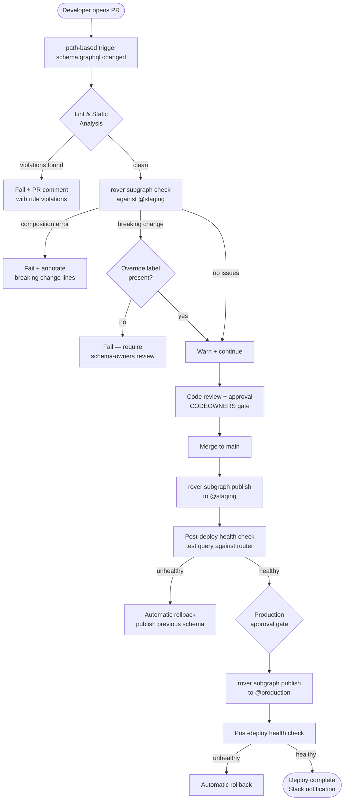

# GitHub Actions for GraphQL CI/CD

> This section covers automating GraphQL schema operations using GitHub Actions — from pull request
> validation through multi-environment publishing. The workflows here are designed to support
> federated supergraph architectures where dozens of independent subgraph teams need consistent,
> reliable CI/CD without duplicating pipeline logic across repositories.

## Contents

| File | Topic |
|------|-------|
| [01-reusable-workflows.md](./01-reusable-workflows.md) | Reusable workflow patterns for subgraph teams |
| [02-schema-check-workflow.md](./02-schema-check-workflow.md) | Schema check on PRs — annotations, comments, CODEOWNERS |
| [03-publish-pipeline.md](./03-publish-pipeline.md) | Multi-environment publish with rollback automation |

---

## Pipeline Architecture

Every schema change in a federated supergraph follows the same lifecycle: a developer opens a pull
request, the platform validates the change against the composed supergraph, a reviewer approves,
and the schema is published to each environment in sequence. GitHub Actions orchestrates each phase
of this lifecycle.

---

## Key Design Principles

### Reusable Workflows Over Copy-Paste

A supergraph with 20 subgraph teams cannot afford 20 copies of the same CI YAML. Any improvement
— a new lint rule, a faster caching strategy, an updated rover version — would require 20 pull
requests. Instead, define pipeline logic once as a reusable workflow (`workflow_call` trigger) in
a central platform repository. Subgraph teams reference the workflow by path and pass
subgraph-specific values as inputs.

### Path-Based Triggers

Schema CI should only run when schema files change. Broad triggers (`push`, `pull_request` without
path filters) waste CI minutes and create noise. Use `paths:` filters scoped to `schema.graphql`
and any SDL fragments. In monorepos, combine path filters with matrix builds that dynamically
detect which subgraphs changed.

### Composite Actions for Shared Steps

Steps that repeat across multiple jobs — installing rover, authenticating with Apollo GraphOS,
setting up Node.js with the right cache key — belong in composite actions. Composite actions live
in `.github/actions/` within the platform repository and can be referenced by relative path or
the `uses: org/platform/.github/actions/setup-rover@main` syntax.

### Environment Gates for Production

GitHub Environments provide manual approval gates, deployment history, and environment-scoped
secrets. The production publish job should require an environment with required reviewers
configured. This integrates cleanly with existing change management processes.

---

## Relationship to Other Sections

- Schema validation rules that the CI pipeline enforces are defined in
  [docs/10-schema-validation/](../10-schema-validation/).
- The broader CI/CD automation strategy, including versioning and promotion workflows, is covered
  in [docs/11-ci-cd-automation/](../11-ci-cd-automation/).
- Policy-as-code enforcement that runs inside these pipelines is documented in
  [docs/13-policy-as-code/](../13-policy-as-code/).
- Apollo GraphOS graph variants, API keys, and schema check configuration are explained in
  [docs/09-schema-governance/](../09-schema-governance/).

---

## Prerequisites

All workflows in this section assume:

1. An Apollo GraphOS account with a supergraph configured.
2. `APOLLO_KEY` stored as a GitHub Actions secret (organization-level recommended).
3. `APOLLO_GRAPH_ID` stored as a GitHub Actions variable (not a secret — it is not sensitive).
4. Branch protection rules configured so the `GraphQL / schema-check` status check is required
   before merge.
5. A `schema-owners` team in your GitHub organization defined in CODEOWNERS.
