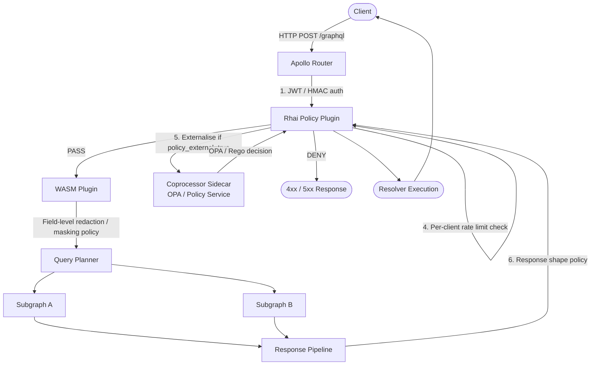

# 03 — Runtime Query Policy Enforcement

> **Purpose**
> This document covers production-grade runtime policy enforcement for GraphQL APIs: complexity budgets, depth limits, allow-list gating, per-client policies, dynamic policy reloading, rate limiting as a first-class policy primitive, and federation-aware enforcement via the Apollo Router coprocessor pattern. It is written for platform engineers and SREs who own the GraphQL gateway layer and must enforce SLA-level controls without blocking product teams.

---

## Learning Objectives

After reading this document you will be able to:

1. Configure complexity and depth limits that protect resolvers from denial-of-service queries without blocking legitimate workloads.
2. Write Apollo Router Rhai scripts and WASM plugins that enforce per-client, per-operation, and per-field policies at request time.
3. Design a coprocessor sidecar that externalizes policy decisions to OPA or a custom policy service.
4. Implement allow-list enforcement for production traffic while keeping development permissive.
5. Propagate policies across a federated supergraph so subgraph-level controls remain consistent with router-level controls.
6. Update policies at runtime without router restart using dynamic configuration and hot-reload mechanisms.
7. Instrument policy enforcement so violations are visible in dashboards before they become incidents.

---

## Overview — Runtime Policy Evaluation Flow

Every GraphQL request passes through a layered decision pipeline before resolvers execute. Understanding the pipeline is required before configuring any individual control.



The pipeline is **not** a monolith. Each stage is independently configurable. A Rhai plugin at the `router_service` phase runs before parsing; a plugin at the `subgraph_service` phase runs per-subgraph fetch. WASM plugins run in a separate sandbox and are loaded at startup or hot-reloaded on `SIGHUP`.

---

## Core Concepts

### 1. Query Complexity Scoring

Complexity is a heuristic that approximates the compute and data volume a query will consume. Every field contributes a base cost; list fields multiply that cost by an estimated cardinality factor.

**Naive approach (additive, field count only):**

```
complexity = sum(1 for each field selection)
```

**Cardinality-weighted approach (production standard):**

```
complexity(field) = field_base_cost + estimated_items * sum(complexity(child))
```

Where `estimated_items` is sourced from:
- A schema directive (`@complexity(value: 5, multipliers: ["limit"])`)
- A static default per type (10 for list fields, 1 for scalar)
- A machine-learned estimator trained on historical resolver latencies

**Schema directive declaration:**

```graphql
directive @complexity(
  value: Int!
  multipliers: [String!]
) on FIELD_DEFINITION

type Query {
  products(limit: Int = 20): [Product!]!
    @complexity(value: 1, multipliers: ["limit"])

  productSearch(query: String!, first: Int = 10): ProductConnection!
    @complexity(value: 3, multipliers: ["first"])

  auditLog(tenantId: ID!, days: Int = 7): [AuditEvent!]!
    @complexity(value: 10, multipliers: ["days"])
}
```

### 2. Query Depth Limits

Depth limits prevent pathologically nested selections that traverse association graphs without bound.

```graphql
# Depth = 4 — triggers limit of 3
query DeepNest {
  user {          # depth 1
    orders {      # depth 2
      lineItems { # depth 3
        product { # depth 4 — BLOCKED
          reviews { ... }
        }
      }
    }
  }
}
```

Depth is measured from the first non-root selection set. Fragment spreads are inlined before measurement.

### 3. Allow-List Enforcement

In production, only pre-approved, persisted operations should execute. Allow-list enforcement rejects any operation whose normalized document hash is not in the registry.

Two modes:

| Mode | Behavior |
|------|----------|
| `audit` | Log violations, pass the request |
| `enforce` | Block unapproved operations with `403` |

Persisted operations are registered via the Apollo Schema Registry CLI, Hive CLI, or a custom registry backed by a KV store (Redis, DynamoDB).

### 4. Per-Client Policies

Clients are identified by a combination of:

- `x-client-id` header (required for production clients)
- `x-client-name` + `x-client-version` (Apollo client default headers)
- JWT `sub` claim (for authenticated queries)
- API key hash

Each client receives a **policy bundle** specifying:

- Complexity budget (absolute ceiling)
- Depth limit
- Rate limit (operations per minute)
- Allow-listed operations (superset of global allow-list)
- Denied fields or types

### 5. Dynamic Policy Updates Without Restart

Apollo Router supports hot-reload of `router.yaml` on `SIGHUP`. For Rhai scripts, changes are picked up on the next request cycle when `rhai.scripts` points to a watched directory. For WASM plugins, the `hot_reload: true` flag must be set and the WASM binary is reloaded atomically.

For external policy (OPA), the Rego bundle is pushed via the OPA Bundle API and takes effect within the configured `bundle.polling.min_delay_seconds`.

### 6. Rate Limiting as Policy

Rate limiting is a runtime policy, not an infrastructure concern. It must be:

- Operation-aware (different limits for `mutation` vs `query`)
- Client-aware (trusted internal clients vs anonymous public clients)
- Complexity-weighted (cost-based rate limiting: each request consumes `complexity` tokens from a bucket)

### 7. Federation-Aware Policy Enforcement

In a federated supergraph, the router enforces global policies; subgraphs enforce domain policies. The contract is:

- Router: allow/deny before query planning
- Router: inject policy context into subgraph headers (`x-policy-tier`, `x-complexity-remaining`)
- Subgraph: honour `x-policy-tier` for field-level access control
- Subgraph: report back `x-complexity-consumed` in response headers for accounting

---

## Real-World Implementation

### Apollo Router Configuration — Base Policy Layer

File: `/etc/apollo-router/router.yaml`

```yaml
# router.yaml — production policy configuration
# Apollo Router >= 1.40.0

supergraph:
  listen: 0.0.0.0:4000
  introspection: false          # disable in production

limits:
  # Hard parser-level limits — enforced before any plugin
  max_depth: 15
  max_height: 200               # total field selections across all levels
  max_aliases: 30
  max_root_fields: 20
  parser_max_tokens: 15000
  parser_max_recursion: 500

preview_persisted_queries:
  enabled: true
  log_unknown: true
  safelist:
    enabled: true               # enforce = block unknown hashes
    require_id: true

traffic_shaping:
  router:
    global_rate_limit:
      capacity: 1000            # token bucket capacity
      interval: 1s              # refill interval
  all:
    timeout: 45s
    compression: gzip

rhai:
  scripts: /etc/apollo-router/rhai
  main: main.rhai

cors:
  origins:
    - https://app.example.com
    - https://admin.example.com
  methods:
    - GET
    - POST
  headers:
    - Content-Type
    - Authorization
    - x-client-id
    - x-client-name
    - x-client-version
    - x-request-id

headers:
  all:
    request:
      - insert:
          name: x-router-version
          value: "1.40.0"

telemetry:
  exporters:
    tracing:
      otlp:
        endpoint: http://otel-collector:4317
        grpc:
          metadata:
            x-api-key: "${env.OTEL_API_KEY}"
    metrics:
      prometheus:
        enabled: true
        listen: 0.0.0.0:9090
        path: /metrics
  instrumentation:
    spans:
      router:
        attributes:
          graphql.operation.name: true
          graphql.operation.type: true
          graphql.document: false    # never log raw documents in production
          http.client_id:
            request_header: x-client-id
      subgraph:
        attributes:
          subgraph.name: true
          graphql.operation.name: true

# Coprocessor for external policy decisions
coprocessor:
  url: http://policy-sidecar:8080
  timeout: 30ms
  router:
    request:
      headers: true
      body: true
      context: true
      sdl: false
    response:
      headers: true
      body: false
      context: true
```

### Rhai Policy Script — Main Entry Point

File: `/etc/apollo-router/rhai/main.rhai`

```rhai
// main.rhai — orchestrates all policy checks
// Loaded by Apollo Router Rhai plugin

fn router_service(service) {
    let request_callback = |request| {
        // Stage 1: Extract and validate client identity
        let client_id = extract_client_id(request);
        if client_id == () {
            return unauthorized("Missing x-client-id header");
        }

        // Stage 2: Load per-client policy bundle
        let policy = load_policy(client_id);

        // Stage 3: Allow-list check (fast path — hash comparison)
        if policy.enforce_allowlist {
            let op_id = request.headers["x-persisted-query-id"];
            if op_id == () {
                return forbidden("Persisted query ID required for this client");
            }
        }

        // Stage 4: Parse document and run static analysis
        let doc = request.body.query;
        if doc != () {
            // Dynamic query allowed only for development clients
            if !policy.allow_dynamic_queries {
                return forbidden("Dynamic queries not permitted; use persisted operations");
            }

            let depth = measure_depth(doc);
            if depth > policy.max_depth {
                return too_complex(`Query depth ${depth} exceeds limit ${policy.max_depth}`);
            }

            let complexity = compute_complexity(doc, request.body.variables);
            if complexity > policy.max_complexity {
                return too_complex(`Query complexity ${complexity} exceeds budget ${policy.max_complexity}`);
            }

            // Store complexity for downstream use
            request.context["x-query-complexity"] = complexity;
        }

        // Stage 5: Rate limit check against Redis-backed token bucket
        let rate_result = check_rate_limit(client_id, policy);
        if !rate_result.allowed {
            return rate_limited(rate_result.retry_after_ms);
        }

        // Stage 6: Inject policy context headers for subgraphs
        request.headers["x-policy-tier"] = policy.tier;
        request.headers["x-complexity-budget"] = `${policy.max_complexity}`;
        request.headers["x-client-id"] = client_id;

        // Pass through
        request
    };

    service.map_request(request_callback);
}

fn subgraph_service(service, subgraph_name) {
    let response_callback = |response| {
        // Accumulate complexity consumed across all subgraph fetches
        let consumed = response.headers["x-complexity-consumed"];
        if consumed != () {
            let current = response.context["x-complexity-consumed"] ?? 0;
            response.context["x-complexity-consumed"] = current + parse_int(consumed);
        }
        response
    };

    service.map_response(response_callback);
}
```

### Rhai Helper Functions — Complexity and Depth Measurement

File: `/etc/apollo-router/rhai/complexity.rhai`

```rhai
// complexity.rhai — static analysis helpers

// Measure maximum depth of a GraphQL document
// Fragments are inlined before measurement
fn measure_depth(document) {
    // Apollo Router exposes parsed AST introspection via __ast__ context
    // For custom depth measurement, use the AST visitor API
    let max_depth = 0;
    let current_depth = 0;

    fn visit_selection_set(selections, depth) {
        if depth > max_depth {
            max_depth = depth;
        }
        for selection in selections {
            if selection.kind == "Field" && selection.selection_set != () {
                visit_selection_set(selection.selection_set.selections, depth + 1);
            } else if selection.kind == "InlineFragment" {
                visit_selection_set(selection.selection_set.selections, depth);
            }
            // Named fragment spreads are pre-resolved by the router
        }
    }

    for definition in document.definitions {
        if definition.kind == "OperationDefinition" {
            visit_selection_set(definition.selection_set.selections, 1);
        }
    }

    max_depth
}

// Compute weighted complexity score
// Uses static cost map sourced from schema directives
fn compute_complexity(document, variables) {
    let FIELD_COSTS = #{
        "Query.products": #{ base: 1, multiplier_arg: "limit", default_multiplier: 20 },
        "Query.productSearch": #{ base: 3, multiplier_arg: "first", default_multiplier: 10 },
        "Query.auditLog": #{ base: 10, multiplier_arg: "days", default_multiplier: 7 },
        "Query.user": #{ base: 2, multiplier_arg: (), default_multiplier: 1 },
        "Mutation.createOrder": #{ base: 15, multiplier_arg: (), default_multiplier: 1 },
        "Mutation.bulkImport": #{ base: 50, multiplier_arg: "count", default_multiplier: 1 },
    };

    let total = 0;

    fn score_field(parent_type, field_name, args) {
        let key = `${parent_type}.${field_name}`;
        let cost_def = FIELD_COSTS[key];

        if cost_def == () {
            return 1;  // default cost for unmapped fields
        }

        let base = cost_def.base;
        if cost_def.multiplier_arg != () {
            let arg_val = args[cost_def.multiplier_arg];
            let multiplier = if arg_val != () { parse_int(arg_val) } else { cost_def.default_multiplier };
            return base * multiplier;
        }

        base
    }

    // Walk the document AST
    for definition in document.definitions {
        if definition.kind == "OperationDefinition" {
            let op_type = definition.operation;  // "query" | "mutation" | "subscription"
            let root_type = if op_type == "mutation" { "Mutation" } else { "Query" };

            fn walk(selections, parent_type) {
                for sel in selections {
                    if sel.kind == "Field" {
                        total += score_field(parent_type, sel.name.value, sel.arguments ?? #{});
                        if sel.selection_set != () {
                            // Resolve child type from schema — simplified here
                            walk(sel.selection_set.selections, sel.name.value);
                        }
                    }
                }
            }

            walk(definition.selection_set.selections, root_type);
        }
    }

    total
}
```

### Rhai Helper Functions — Client Policy and Rate Limiting

File: `/etc/apollo-router/rhai/policy.rhai`

```rhai
// policy.rhai — client identity, policy loading, and rate limiting

fn extract_client_id(request) {
    // Priority: explicit header > JWT sub > API key hash
    let explicit = request.headers["x-client-id"];
    if explicit != () {
        return explicit;
    }

    let jwt = request.headers["authorization"];
    if jwt != () && jwt.starts_with("Bearer ") {
        // Router decodes the JWT; the sub claim is available in context
        // after the JWT authentication plugin runs
        return request.context["jwt.sub"];
    }

    // Fall back to API key hash (first 12 chars of SHA-256)
    let api_key = request.headers["x-api-key"];
    if api_key != () {
        return sha256(api_key).substring(0, 12);
    }

    ()  // no identity found
}

fn load_policy(client_id) {
    // Policy bundles are loaded from router context, which is populated
    // by the coprocessor at startup or via the hot-reload mechanism.
    // The context key "policy_bundles" is a map of client_id -> policy.

    let bundles = env::get("POLICY_BUNDLE_JSON");
    if bundles != () {
        let parsed = parse_json(bundles);
        let client_policy = parsed[client_id];
        if client_policy != () {
            return client_policy;
        }
    }

    // Return tier-based default policy
    #{
        tier: "standard",
        max_depth: 8,
        max_complexity: 500,
        operations_per_minute: 100,
        allow_dynamic_queries: false,
        enforce_allowlist: true,
    }
}

fn check_rate_limit(client_id, policy) {
    // Apollo Router native rate limiting is configured in router.yaml.
    // This function handles cost-based (complexity-weighted) rate limiting
    // using the router's built-in key-value store (backed by Redis in cluster mode).

    let key = `rl:${client_id}:${timestamp_minute()}`;
    let consumed = router::cache_get(key) ?? 0;
    let budget = policy.operations_per_minute;

    if consumed >= budget {
        let retry_after = 60 - (timestamp_second() % 60);
        return #{ allowed: false, retry_after_ms: retry_after * 1000 };
    }

    router::cache_set(key, consumed + 1, 120);  // TTL 120s (2 minutes window)
    #{ allowed: true, retry_after_ms: 0 }
}

fn unauthorized(message) {
    #{
        status: 401,
        headers: #{ "www-authenticate": "Bearer" },
        body: #{ errors: [#{ message: message, extensions: #{ code: "UNAUTHENTICATED" } }] }
    }
}

fn forbidden(message) {
    #{
        status: 403,
        body: #{ errors: [#{ message: message, extensions: #{ code: "FORBIDDEN" } }] }
    }
}

fn too_complex(message) {
    #{
        status: 400,
        body: #{
            errors: [#{
                message: message,
                extensions: #{ code: "QUERY_COMPLEXITY_EXCEEDED" }
            }]
        }
    }
}

fn rate_limited(retry_after_ms) {
    #{
        status: 429,
        headers: #{
            "retry-after": `${retry_after_ms / 1000}`,
            "x-ratelimit-reset": `${timestamp_second() + (retry_after_ms / 1000)}`
        },
        body: #{
            errors: [#{
                message: "Rate limit exceeded",
                extensions: #{ code: "RATE_LIMITED", retry_after_ms: retry_after_ms }
            }]
        }
    }
}
```

### Coprocessor Pattern — External Policy via OPA

The coprocessor is an HTTP sidecar that receives serialized request context from the router and returns a policy decision. This decouples policy logic from the router binary and allows OPA Rego policies to govern GraphQL without modifying Rhai scripts.

File: `policy-sidecar/main.go` (abbreviated for key logic)

```go
package main

import (
    "context"
    "encoding/json"
    "net/http"
    "time"

    "github.com/open-policy-agent/opa/rego"
)

type RouterRequest struct {
    Version    string            `json:"version"`
    Stage      string            `json:"stage"`
    Headers    map[string]string `json:"headers"`
    Body       json.RawMessage   `json:"body"`
    Context    map[string]any    `json:"context"`
    Method     string            `json:"method"`
    Path       string            `json:"path"`
}

type PolicyDecision struct {
    Control  string            `json:"control"`  // "continue" | "break"
    Headers  map[string]string `json:"headers,omitempty"`
    Body     json.RawMessage   `json:"body,omitempty"`
    Status   int               `json:"status,omitempty"`
    Context  map[string]any    `json:"context,omitempty"`
}

var regoQuery rego.PreparedEvalQuery

func init() {
    ctx := context.Background()
    r := rego.New(
        rego.Query("data.graphql.policy.decision"),
        rego.Load([]string{"/etc/opa/policies/"}, nil),
    )
    var err error
    regoQuery, err = r.PrepareForEval(ctx)
    if err != nil {
        panic(err)
    }
}

func handlePolicyRequest(w http.ResponseWriter, r *http.Request) {
    var req RouterRequest
    if err := json.NewDecoder(r.Body).Decode(&req); err != nil {
        http.Error(w, "bad request", 400)
        return
    }

    ctx, cancel := context.WithTimeout(r.Context(), 25*time.Millisecond)
    defer cancel()

    input := map[string]any{
        "headers":    req.Headers,
        "context":    req.Context,
        "stage":      req.Stage,
        "client_id":  req.Headers["x-client-id"],
        "complexity": req.Context["x-query-complexity"],
    }

    results, err := regoQuery.Eval(ctx, rego.EvalInput(input))
    if err != nil || len(results) == 0 {
        // Fail open in degraded mode — log and continue
        json.NewEncoder(w).Encode(PolicyDecision{Control: "continue"})
        return
    }

    decision := results[0].Expressions[0].Value.(map[string]any)
    allowed, _ := decision["allow"].(bool)

    if !allowed {
        reason, _ := decision["reason"].(string)
        errorBody, _ := json.Marshal(map[string]any{
            "errors": []map[string]any{{
                "message": reason,
                "extensions": map[string]any{
                    "code": "POLICY_VIOLATION",
                },
            }},
        })
        json.NewEncoder(w).Encode(PolicyDecision{
            Control: "break",
            Status:  403,
            Body:    errorBody,
        })
        return
    }

    // Inject approved context values for downstream use
    json.NewEncoder(w).Encode(PolicyDecision{
        Control: "continue",
        Context: map[string]any{
            "policy.approved":    true,
            "policy.tier":        decision["tier"],
            "policy.max_fields":  decision["max_fields"],
        },
    })
}
```

### OPA Rego Policy

File: `/etc/opa/policies/graphql.rego`

```rego
package graphql.policy

import future.keywords.if
import future.keywords.in

# Default deny
default decision = {
    "allow": false,
    "reason": "No policy matched",
}

# Decision for known clients with valid complexity budget
decision = result if {
    client_id := input.client_id
    client_id != ""

    policy := data.clients[client_id]

    complexity := to_number(input.complexity)
    complexity <= policy.max_complexity

    result := {
        "allow":      true,
        "tier":       policy.tier,
        "max_fields": policy.max_fields,
    }
}

# Reject over-budget queries even for known clients
decision = result if {
    client_id := input.client_id
    policy := data.clients[client_id]

    complexity := to_number(input.complexity)
    complexity > policy.max_complexity

    result := {
        "allow":  false,
        "reason": sprintf(
            "Complexity %v exceeds client budget %v",
            [complexity, policy.max_complexity]
        ),
    }
}

# Reject anonymous clients in enforce mode
decision = result if {
    input.client_id == ""
    data.config.anonymous_mode == "deny"

    result := {
        "allow":  false,
        "reason": "Anonymous queries not permitted in this environment",
    }
}
```

Client data for OPA (loaded as a bundle):

```json
{
  "clients": {
    "web-v3": {
      "tier": "premium",
      "max_complexity": 2000,
      "max_fields": 500,
      "operations_per_minute": 500
    },
    "mobile-ios": {
      "tier": "standard",
      "max_complexity": 800,
      "max_fields": 200,
      "operations_per_minute": 200
    },
    "internal-reporting": {
      "tier": "internal",
      "max_complexity": 10000,
      "max_fields": 2000,
      "operations_per_minute": 60
    }
  },
  "config": {
    "anonymous_mode": "deny"
  }
}
```

### Dynamic Policy Updates — Hot Reload Mechanism

```yaml
# docker-compose.yml excerpt — OPA bundle server and policy watcher

services:
  opa:
    image: openpolicyagent/opa:0.68.0
    command:
      - run
      - --server
      - --log-level=info
      - --bundle
      - /policies
      - --addr=0.0.0.0:8181
    volumes:
      - ./policies:/policies:ro
    ports:
      - "8181:8181"

  policy-pusher:
    image: curlimages/curl:8.6.0
    # Pushes updated client data bundle every 60s
    command: >
      sh -c 'while true; do
        curl -X PUT http://opa:8181/v1/data/clients \
          -H "Content-Type: application/json" \
          -d @/data/clients.json;
        sleep 60;
      done'
    volumes:
      - ./data:/data:ro

  apollo-router:
    image: ghcr.io/apollographql/router:v1.40.0
    command:
      - --config=/etc/apollo-router/router.yaml
      - --supergraph=/etc/apollo-router/supergraph.graphql
      - --hot-reload
    volumes:
      - ./router.yaml:/etc/apollo-router/router.yaml
      - ./rhai:/etc/apollo-router/rhai
    ports:
      - "4000:4000"
    signals:
      - SIGHUP  # triggers Rhai script reload
```

Router Rhai scripts reload when the router process receives `SIGHUP`:

```bash
# Send hot-reload signal to router
kubectl exec -n graphql deploy/apollo-router -- kill -HUP 1

# Or via the router admin API (if enabled)
curl -X POST http://localhost:8088/reload
```

### WASM Plugin — Field-Level Response Redaction

WASM plugins run in a sandboxed Wasm runtime and are ideal for deterministic, performance-critical logic such as response field redaction.

File: `plugins/field-redaction/src/lib.rs`

```rust
use apollo_router::plugin::Plugin;
use apollo_router::services::*;
use apollo_router::Context;
use schemars::JsonSchema;
use serde::Deserialize;
use tower::BoxError;

#[derive(Debug, Deserialize, JsonSchema)]
struct FieldRedactionConfig {
    // Fields to redact by type.field path for non-privileged clients
    redacted_fields: Vec<String>,
    privileged_tiers: Vec<String>,
}

struct FieldRedactionPlugin {
    config: FieldRedactionConfig,
}

#[async_trait::async_trait]
impl Plugin for FieldRedactionPlugin {
    type Config = FieldRedactionConfig;

    async fn new(init: PluginInit<Self::Config>) -> Result<Self, BoxError> {
        Ok(Self { config: init.config })
    }

    fn supergraph_service(&self, service: supergraph::BoxService) -> supergraph::BoxService {
        let redacted_fields = self.config.redacted_fields.clone();
        let privileged_tiers = self.config.privileged_tiers.clone();

        ServiceBuilder::new()
            .map_response(move |mut response: supergraph::Response| {
                let tier = response
                    .context
                    .get::<_, String>("policy.tier")
                    .unwrap_or_default()
                    .unwrap_or_default();

                if !privileged_tiers.contains(&tier) {
                    redact_response_fields(&mut response, &redacted_fields);
                }
                response
            })
            .service(service)
            .boxed()
    }
}

fn redact_response_fields(
    response: &mut supergraph::Response,
    redacted_fields: &[String],
) {
    if let Some(data) = response.response.body_mut().data.as_mut() {
        redact_value(data, redacted_fields, "");
    }
}

fn redact_value(
    value: &mut serde_json::Value,
    redacted_fields: &[String],
    path: &str,
) {
    match value {
        serde_json::Value::Object(map) => {
            for (key, val) in map.iter_mut() {
                let field_path = if path.is_empty() {
                    key.clone()
                } else {
                    format!("{}.{}", path, key)
                };

                if redacted_fields.iter().any(|f| f == &field_path) {
                    *val = serde_json::Value::String("[REDACTED]".to_string());
                } else {
                    redact_value(val, redacted_fields, &field_path);
                }
            }
        }
        serde_json::Value::Array(arr) => {
            for item in arr.iter_mut() {
                redact_value(item, redacted_fields, path);
            }
        }
        _ => {}
    }
}

register_plugin!("example", "field_redaction", FieldRedactionPlugin);
```

WASM plugin configuration in `router.yaml`:

```yaml
plugins:
  example.field_redaction:
    redacted_fields:
      - "user.ssn"
      - "user.dateOfBirth"
      - "payment.cardNumber"
      - "payment.cvv"
      - "order.billingAddress.raw"
    privileged_tiers:
      - "internal"
      - "compliance"
```

### Federation-Aware Policy — Subgraph Header Propagation

Each subgraph must honour the policy context forwarded by the router. The following shows a Node.js subgraph using `@apollo/subgraph` that reads policy headers and applies field-level access control.

```typescript
// subgraph-products/src/context.ts
import { IncomingHttpHeaders } from 'http';

export interface PolicyContext {
  clientId: string;
  policyTier: 'standard' | 'premium' | 'internal' | 'compliance';
  complexityBudget: number;
  complexityConsumed: number;
}

export function buildPolicyContext(headers: IncomingHttpHeaders): PolicyContext {
  return {
    clientId: (headers['x-client-id'] as string) ?? 'anonymous',
    policyTier: (headers['x-policy-tier'] as PolicyContext['policyTier']) ?? 'standard',
    complexityBudget: parseInt((headers['x-complexity-budget'] as string) ?? '500', 10),
    complexityConsumed: 0,
  };
}
```

```typescript
// subgraph-products/src/resolvers.ts
import { PolicyContext } from './context';

const TIER_FIELD_ACCESS: Record<string, Set<string>> = {
  standard:   new Set(['id', 'name', 'price', 'imageUrl', 'category']),
  premium:    new Set(['id', 'name', 'price', 'imageUrl', 'category', 'costBasis', 'margin']),
  internal:   new Set(['*']),  // wildcard — all fields
  compliance: new Set(['*']),
};

export const productResolvers = {
  Query: {
    products: async (_: unknown, args: { limit: number }, ctx: { policy: PolicyContext }) => {
      const allowedFields = TIER_FIELD_ACCESS[ctx.policy.policyTier] ?? TIER_FIELD_ACCESS.standard;
      // Fetch with field projection to avoid over-fetching
      return fetchProducts({ limit: args.limit, fieldMask: allowedFields });
    },
  },
  Product: {
    costBasis: (product: any, _: unknown, ctx: { policy: PolicyContext }) => {
      const allowed = TIER_FIELD_ACCESS[ctx.policy.policyTier];
      if (!allowed.has('costBasis') && !allowed.has('*')) {
        return null;  // return null rather than throw — prevents partial query failure
      }
      return product.costBasis;
    },
    margin: (product: any, _: unknown, ctx: { policy: PolicyContext }) => {
      const allowed = TIER_FIELD_ACCESS[ctx.policy.policyTier];
      if (!allowed.has('margin') && !allowed.has('*')) {
        return null;
      }
      return product.margin;
    },
  },
};
```

---

## Production Considerations

### Performance

**Policy evaluation latency budget:**

The total latency added by policy enforcement must not exceed 5ms p99 for the synchronous path. Profile each stage:

| Stage | Expected p50 | p99 budget |
|-------|-------------|------------|
| JWT decode (cached) | 0.1ms | 0.5ms |
| Depth measurement | 0.2ms | 1ms |
| Complexity computation | 0.3ms | 1.5ms |
| Redis rate limit check | 0.5ms | 2ms |
| OPA coprocessor call | 2ms | 5ms |

If the OPA coprocessor exceeds its SLO, the router must fail open (log the timeout, continue) to prevent policy enforcement from becoming a reliability risk. Configure `coprocessor.timeout: 30ms` and test failure modes explicitly.

**Complexity computation optimization:**

- Cache computed complexity by `sha256(document + variables_schema)` for persisted operations. TTL 1 hour.
- Skip complexity re-computation for operations in the allow-list that have a pre-computed score stored in the registry.
- Use the Apollo Router's built-in document cache to avoid re-parsing known documents.

### Security

**Complexity limit bypass prevention:**

- Aliases: `a: products(limit: 100) b: products(limit: 100)` multiplies load without increasing apparent depth. Count aliases toward the complexity budget.
- Fragment explosions: deeply nested fragments that recursively reference each other. The router's `max_recursion` parser limit prevents infinite recursion; ensure it is set to ≤ 500.
- Batched HTTP: multiple operations in a single HTTP body. Each operation must be evaluated independently and their complexities summed.
- `__schema` and `__type` introspection: disable in production (`introspection: false`). Introspection queries have unbounded complexity and reveal schema structure.

**Client ID spoofing:**

Do not rely solely on `x-client-id` for security decisions. Validate it against a cryptographic claim in the JWT or use mTLS client certificates for machine-to-machine clients.

**OPA policy bundle integrity:**

Sign OPA bundles with the `opa build --signing-key` flag and configure OPA to verify bundle signatures:

```yaml
# opa-config.yaml
bundles:
  graphql-policies:
    resource: /v1/bundles/graphql-policies
    signing:
      keyid: "graphql-policy-signing-key-v1"
      scope: "read"
```

### Scaling

**Redis rate limiting in multi-replica deployments:**

When Apollo Router runs as multiple replicas, rate limit state must be centralized. Use Redis with the Lua-based atomic token bucket:

```lua
-- rate_limit.lua — atomic token bucket in Redis
local key = KEYS[1]
local capacity = tonumber(ARGV[1])
local refill_rate = tonumber(ARGV[2])
local requested = tonumber(ARGV[3])
local now = tonumber(ARGV[4])

local bucket = redis.call('HMGET', key, 'tokens', 'last_refill')
local tokens = tonumber(bucket[1]) or capacity
local last_refill = tonumber(bucket[2]) or now

local elapsed = now - last_refill
local refilled = math.min(capacity, tokens + elapsed * refill_rate)

if refilled < requested then
    return {0, math.ceil((requested - refilled) / refill_rate * 1000)}
end

redis.call('HMSET', key, 'tokens', refilled - requested, 'last_refill', now)
redis.call('PEXPIRE', key, 60000)
return {1, 0}
```

**OPA performance at scale:**

- Deploy OPA as a sidecar (one per router pod) rather than a shared service to eliminate network hops.
- Pre-compile Rego policies with `rego.PrepareForEval()` at startup, not per-request.
- Use OPA's partial evaluation (`rego.New(...).PartialResult()`) for policies with static inputs to pre-compute decision trees.

### Observability

Instrument policy enforcement with structured logs and metrics. Every policy violation must be auditable.

```yaml
# router.yaml telemetry additions for policy observability

telemetry:
  instrumentation:
    events:
      router:
        request:
          level: info
          attributes:
            x-client-id:
              request_header: x-client-id
            operation.type:
              request_header: x-operation-type
        response:
          level: info
          attributes:
            policy.decision:
              response_context: policy.approved
            query.complexity:
              response_context: x-query-complexity

    custom_instruments:
      - type: counter
        name: graphql.policy.violations
        description: "Number of requests blocked by policy enforcement"
        unit: "{request}"
        attributes:
          - name: violation_type
            event_listener:
              response_context: policy.violation_type
          - name: client_id
            request_header: x-client-id
      - type: histogram
        name: graphql.query.complexity
        description: "Distribution of query complexity scores"
        unit: "{points}"
        attributes:
          - name: client_tier
            response_context: policy.tier
```

Prometheus alerts for policy enforcement:

```yaml
# prometheus/rules/graphql-policy.yaml
groups:
  - name: graphql_policy
    interval: 30s
    rules:
      - alert: GraphQLComplexityViolationsHigh
        expr: |
          rate(graphql_policy_violations_total{violation_type="complexity"}[5m]) > 0.1
        for: 2m
        labels:
          severity: warning
          team: platform
        annotations:
          summary: "GraphQL complexity violations above threshold"
          description: "{{ $value | humanize }} complexity violations/sec from client {{ $labels.client_id }}"

      - alert: GraphQLRateLimitViolationsSpike
        expr: |
          rate(graphql_policy_violations_total{violation_type="rate_limit"}[1m]) > 1
        for: 1m
        labels:
          severity: warning
        annotations:
          summary: "Rate limit violations spiking — possible client misconfiguration or abuse"

      - alert: GraphQLPolicySidecarLatencyHigh
        expr: |
          histogram_quantile(0.99,
            rate(graphql_coprocessor_duration_seconds_bucket[5m])
          ) > 0.030
        for: 3m
        labels:
          severity: critical
        annotations:
          summary: "Policy sidecar p99 latency > 30ms — approaching timeout threshold"
```

---

## Best Practices

1. **Set complexity limits empirically, not arbitrarily.** Instrument production traffic for two weeks before setting limits. Use the 99th percentile of observed complexity * 3x as the initial ceiling.

2. **Use persisted operations in production.** Allow-list enforcement is only effective if clients register their operations. Make the registration step part of the CI pipeline so that unregistered operations never reach production.

3. **Separate audit mode from enforce mode.** Run new policy rules in audit mode (log-only) for at least one full traffic cycle (24 hours) before switching to enforce. This catches false positives.

4. **Keep policy logic out of resolvers.** Resolvers should not contain allow/deny logic. Policy belongs at the gateway layer. Subgraph field guards are a last line of defense, not the primary enforcement point.

5. **Test policies with property-based tests.** Use hypothesis (Python) or fast-check (TypeScript) to generate random GraphQL documents and verify that the policy engine correctly classifies them.

6. **Version policy bundles.** Each policy bundle version must be traceable to a Git commit. Use semantic versioning: breaking policy changes increment the major version.

7. **Document per-client policy decisions.** Maintain a policy registry (Git-backed) that records each client's budget, the justification, and the approval trail. Use this as the source of truth for the OPA client data bundle.

8. **Fail open for policy sidecar unavailability.** A policy engine outage must not take down the API. Configure the router to log, alert, and continue if the coprocessor is unreachable. Pair this with a circuit breaker on the coprocessor client.

9. **Use mTLS between router and policy sidecar.** The coprocessor receives raw request bodies and headers. Secure the channel with mutual TLS and authenticate the router with a client certificate.

10. **Test complexity bypass vectors in your CI pipeline.** Include test cases for alias multipliers, fragment explosions, introspection, and batch operations. Block deployment if any bypass succeeds.

---

## Anti-Patterns

**Hardcoded limits in resolver code:**

```typescript
// WRONG — policy scattered in business logic
async function products(_: unknown, { limit }: { limit: number }) {
  if (limit > 100) throw new Error('Too many products');
  return fetchProducts(limit);
}
```

This is unauditable, inconsistent, and bypasses the gateway. All limits belong in the policy layer.

**Using depth limit as the only protection:**

Depth limit alone does not prevent complexity attacks. A query with depth 3 but 50 list fields each with `limit: 1000` is catastrophic. Always combine depth + complexity + rate limiting.

**Policy evaluation on every field:**

Evaluating OPA on every field resolution is catastrophically slow. Evaluate once per operation at the router level. Subgraph guards for field-level rules must use pre-computed policy context, not make remote calls.

**Ignoring subscription complexity:**

Subscription operations establish long-lived connections. A subscription that delivers high-complexity data on every event can saturate downstream systems. Apply complexity limits to the subscription payload type, not just the initial operation document.

**Allowing unbounded `first`/`limit` arguments:**

Even with complexity scoring, an unguarded `first: 9999` bypasses cardinality-weighted complexity if the multiplier is not connected to the argument. Always validate list arguments against an absolute maximum in the resolver or via a schema directive.

**Silent policy failures:**

Returning `null` for a policy violation without an error extension makes debugging impossible. Always include `extensions.code` in error responses and log the client ID, operation name, and complexity score.

---

## Operational Notes

### Runbook: Responding to Complexity Violation Surge

1. Check `graphql_policy_violations_total{violation_type="complexity"}` — identify the client by label.
2. Inspect the client's recent operations in Apollo GraphOS Studio or Hive: look for a new query that regressed complexity.
3. If the client is a product team: contact them with the specific operation name and computed complexity.
4. If the client is external / unknown: temporarily throttle by setting their rate limit to 0 in the OPA client data bundle and push the bundle.
5. Escalate to the security team if the pattern resembles intentional abuse (automated, distributed source IPs).

### Runbook: Policy Sidecar Degradation

1. Check `graphql_coprocessor_duration_seconds` — if p99 > 25ms, the sidecar is approaching timeout.
2. Check OPA memory (`process_resident_memory_bytes` on the OPA pod) — policy bundle reload can cause GC pressure.
3. If OPA is healthy but slow: check for a large new bundle that caused re-compilation. Roll back to the previous bundle version.
4. If OPA is crashing: the router is failing open (logging "coprocessor timeout, continuing"). This is safe for availability but means policy is not being enforced. Page the on-call engineer.

### Policy Update Checklist

```
[ ] New policy rule authored in Rego
[ ] Unit tests written with opa test
[ ] Integration tests run against staging router
[ ] Audit mode enabled on production (at least 1 traffic cycle)
[ ] Violation count reviewed — no false positives above 0.1%
[ ] Enforce mode enabled
[ ] Bundle version incremented and tagged in Git
[ ] Runbook updated if new violation type introduced
[ ] Client notification sent if their budget changes
```

---

## References

- [Apollo Router Configuration Reference](https://www.apollographql.com/docs/router/configuration/overview)
- [Apollo Router Rhai Scripting](https://www.apollographql.com/docs/router/customizations/rhai)
- [Apollo Router Coprocessor](https://www.apollographql.com/docs/router/customizations/coprocessor)
- [Apollo Router Native Query Planner](https://www.apollographql.com/docs/router/query-planning/overview)
- [OPA REST API](https://www.openpolicyagent.org/docs/latest/rest-api/)
- [OPA Bundle API](https://www.openpolicyagent.org/docs/latest/management-bundles/)
- [graphql-query-complexity (npm)](https://github.com/slicknode/graphql-query-complexity)
- [Apollo Persisted Queries](https://www.apollographql.com/docs/apollo-server/performance/apq/)
- [OWASP GraphQL Cheat Sheet](https://cheatsheetseries.owasp.org/cheatsheets/GraphQL_Cheat_Sheet.html)

---

## Related Topics

- [02-build-time-policies.md](./02-build-time-policies.md) — Schema linting and CI-time policy enforcement
- [01-schema-registry-policies.md](./01-schema-registry-policies.md) — Registry-level governance
- [Security Overview](../../05-security/README.md) — Authentication, authorization, and threat model
- [Performance and Scaling](../../06-performance-and-scaling/README.md) — Caching, query planning, and load management
- [Federation](../../07-federation/README.md) — Subgraph architecture and entity resolution
- [Observability README](../../14-observability/README.md) — Tracing, metrics, and alerting for GraphQL
- [SLOs and Alerting](../../14-observability/05-slos-and-alerting.md) — Alert rules for policy enforcement signals
