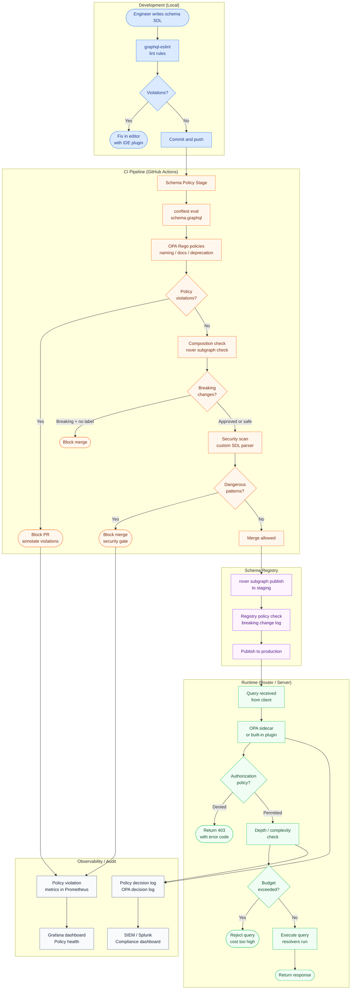

# 13 — Policy as Code for GraphQL

> **Purpose:** Policy as code transforms ad-hoc schema review comments and verbal conventions
> into machine-enforceable rules that run in CI, at deploy time, and at runtime. This section
> explains why GraphQL APIs need a dedicated policy layer, how to choose the right enforcement
> mechanism for each policy type, and how policies integrate across the entire GraphQL lifecycle —
> from schema authoring through query execution in production.

---

## Learning Objectives

After completing this section you will be able to:

- Articulate why GraphQL APIs need policy enforcement beyond linting and code review
- Distinguish between schema design policies, runtime enforcement policies, and CI gate policies
- Choose between OPA, custom scripts, and lint rule frameworks for a given policy requirement
- Design a policy evaluation pipeline that spans the full GraphQL lifecycle
- Integrate policy evaluation into existing CI/CD pipelines without blocking developer velocity
- Measure policy coverage and track policy violations over time

---

## Why Policy as Code for GraphQL

GraphQL APIs have a fundamentally different surface area than REST APIs. A single type system
serves as the contract between dozens of teams. One schema field can be queried in thousands
of combinations. A naming convention violation in a type definition propagates to every client
that introspects the schema.

Without automated policy enforcement, teams rely on:

- Pull request comments that repeat the same feedback across every PR
- Style guides in wikis that are read once and forgotten
- Senior engineer reviews that become bottlenecks as the team grows
- Verbal agreements that drift when engineers change teams

Policy as code solves each of these problems. Rules are written once, stored in version control,
reviewed like any other code change, and enforced automatically. Policy violations surface in CI
before code review begins. Reviewers focus on architecture and correctness rather than formatting
and naming.

### The GraphQL Policy Problem Space

GraphQL introduces policy requirements that do not exist in REST APIs:

**Schema Design Policies** enforce how the type system is structured — naming conventions,
documentation requirements, field complexity limits, and deprecation timelines. These policies
run during development and in CI against SDL (Schema Definition Language) files.

**Runtime Enforcement Policies** control what queries can execute in production — query depth
limits, field-level authorization, operation allowlists, and rate limiting based on estimated
cost. These policies run in the GraphQL server or router on every request.

**CI Gate Policies** block merges or deploys based on schema-level checks — breaking change
detection, registry compliance, security scanning for dangerous field patterns, and federation
composition validation. These policies run in CI pipelines and are the final check before a
schema change reaches production.

**Audit and Compliance Policies** capture evidence that policies were evaluated and record
which queries were permitted or denied. These policies produce logs and structured output
consumed by SIEM systems and compliance dashboards.

---

## Policy Evaluation Across the GraphQL Lifecycle



---

## Core Concepts

### Policy Types and Enforcement Points

| Policy Type | When It Runs | Tools | Blocks What |
|---|---|---|---|
| Naming convention | CI, pre-commit | OPA + conftest, graphql-eslint | Merge |
| Documentation required | CI | OPA + conftest | Merge |
| Deprecation age | CI, registry webhook | OPA + conftest, custom script | Merge / deploy |
| Breaking change | CI | rover, graphql-inspector | Merge |
| Field complexity budget | CI, runtime | OPA + conftest, graphql-query-complexity | Merge / execution |
| Query depth limit | Runtime | graphql-depth-limit, Router plugin | Execution |
| Field authorization | Runtime | OPA sidecar, custom directive | Execution |
| Forbidden patterns | CI | OPA + conftest, semgrep | Merge |
| Operation allowlist | Runtime | Persisted queries, Router plugin | Execution |
| Audit logging | Runtime | OPA decision log | N/A (observability) |

### Policy Scopes

**Schema Design Scope** covers SDL files — `.graphql`, `.graphqls`, and SDL-over-code
generated from type definitions. Policies at this scope check the structure and metadata of
types, fields, directives, and arguments without executing any queries.

**Operation Scope** covers GraphQL queries, mutations, and subscriptions before or during
execution. Policies at this scope inspect the parsed AST of an incoming document: field
selections, fragment usage, variable types, and directives applied.

**Response Scope** covers the data returned from resolvers before it reaches the client.
Policies at this scope can mask fields, redact sensitive values, or inject audit metadata.
Response-scope enforcement is expensive and should be reserved for high-sensitivity data.

### Policy Decision Records

Every policy evaluation should produce a structured record: what was evaluated, which policy
applied, the decision (permit/deny), and the reason. OPA emits this as the decision log format.
Custom scripts should produce equivalent structured output and ship it to the same pipeline.

---

## OPA vs Custom Scripts vs Lint Rules

These are not mutually exclusive. A mature policy system uses all three, each covering the
scope it handles best.

### Open Policy Agent (OPA)

OPA is the de facto standard for declarative policy evaluation in cloud-native systems.
Its policy language, Rego, is purpose-built for structured data evaluation. OPA's strengths
for GraphQL enforcement:

- **Composable rules:** policies decompose into helper functions, reused across rule definitions
- **Testable:** `opa test` runs unit tests against policy files, with coverage reporting
- **Bundleable:** policies are distributed as bundles through an OPA Bundle API, allowing
  centralized management and versioning
- **Conftest integration:** the `conftest` CLI wraps OPA for file-based policy evaluation
  in CI, with native support for GraphQL SDL through custom parsers
- **Sidecar deployment:** OPA runs as a sidecar to the GraphQL router or server, handling
  runtime authorization decisions with sub-millisecond latency when used with the OPA
  in-process Go library

OPA works best for: naming conventions, documentation requirements, field-level authorization,
audit logging, and any policy that needs to be shared across multiple services or teams.

### Custom Scripts

Custom scripts — in Python, Node.js, or Go — work best when a policy requires logic that
Rego makes verbose: calling external APIs, comparing against dynamic data from a schema
registry or usage analytics platform, or producing formatted reports for non-engineering
stakeholders.

Examples of custom script policies:

- Query a schema registry API to check if a deprecated field's usage has dropped below
  threshold before allowing removal
- Call GraphOS Usage Reporting API to find which clients query a specific field
- Diff two schema versions and produce a human-readable migration guide
- Validate that a new type is covered by at least one integration test

Custom scripts integrate into CI as standard shell steps or Docker-based actions. They produce
exit codes and structured output that CI interprets as pass/fail.

### Lint Rules (graphql-eslint)

`graphql-eslint` integrates ESLint with the GraphQL type system. Rules run on SDL and
GraphQL operation files using the parsed AST directly. Lint rules handle:

- Per-file formatting and structure checks
- IDE integration — violations appear inline in VS Code and other editors before code
  is committed
- Auto-fixable issues — `eslint --fix` can automatically correct simple naming or
  formatting violations
- Operation-level checks — `unique-operation-name`, `no-anonymous-operations`,
  `require-selections`, `no-unused-variables`

Lint rules are the first line of enforcement: they run locally in the editor and in pre-commit
hooks. They do not replace OPA for cross-file or registry-aware policies.

### Decision Framework

```
Is the policy about file structure or syntax?      → graphql-eslint rule
Is the policy about structured data comparison?   → OPA + Rego
Does the policy need to call an external API?      → Custom script
Does the policy enforce at runtime per-request?   → OPA sidecar or router plugin
Does the policy need audit output for compliance? → OPA decision log
Is the policy auto-fixable?                       → graphql-eslint rule with fixer
```

---

## Real-World Implementation

### Repository Structure

```
policy/
├── rego/
│   ├── graphql/
│   │   ├── naming.rego              # Naming convention policies
│   │   ├── naming_test.rego         # Unit tests for naming policies
│   │   ├── documentation.rego       # Required documentation policies
│   │   ├── documentation_test.rego
│   │   ├── deprecation.rego         # Deprecation age and lifecycle policies
│   │   ├── deprecation_test.rego
│   │   ├── complexity.rego          # Field complexity budget policies
│   │   ├── complexity_test.rego
│   │   ├── security.rego            # Forbidden pattern policies
│   │   └── security_test.rego
│   └── runtime/
│       ├── authz.rego               # Runtime authorization policies
│       ├── authz_test.rego
│       ├── ratelimit.rego           # Cost-based rate limiting
│       └── ratelimit_test.rego
├── conftest.toml                    # conftest configuration
├── .opa/
│   └── config.yaml                  # OPA configuration for bundle distribution
└── bundles/
    └── graphql-policies-v1.2.3.tar.gz  # Published bundle artifact
```

### conftest Configuration

```toml
# policy/conftest.toml
policy = ["policy/rego"]
output = "github"   # GitHub Actions annotation format

[[runner]]
  name = "graphql-schema"
  files = ["**/*.graphql", "**/*.graphqls"]
  policy = ["policy/rego/graphql"]
```

### OPA Bundle Configuration

```yaml
# policy/.opa/config.yaml
services:
  bundle-server:
    url: https://opa-bundles.internal.example.com
    credentials:
      bearer:
        token_path: /var/run/secrets/opa-bundle-token

bundles:
  graphql-policies:
    service: bundle-server
    resource: /bundles/graphql-policies.tar.gz
    polling:
      min_delay_seconds: 60
      max_delay_seconds: 300

decision_logs:
  console: true
  plugin: kafka-decision-log

plugins:
  kafka-decision-log:
    topic: opa-decisions
    brokers:
      - kafka.internal.example.com:9092

status:
  plugin: prometheus-status

plugins:
  prometheus-status:
    prometheus_addr: :9090
```

---

## Production Considerations

### Performance

**Schema policy evaluation** in CI completes in under 5 seconds for schemas with up to 2,000
types when conftest evaluates compiled Rego bundles. Pre-compile bundles in the CI pipeline
rather than compiling from source on each run.

**Runtime OPA latency** depends on deployment model:
- OPA in-process (Go library): sub-millisecond, no network hop
- OPA sidecar (local Unix socket): 0.5–2ms, minimal network overhead
- OPA centralized (HTTP): 5–20ms, unacceptable for synchronous request paths

Use the OPA in-process library or sidecar model for any runtime authorization that happens
synchronously in the request path. Reserve centralized OPA for asynchronous audit and
compliance queries.

**Rego evaluation caching:** OPA caches compiled policy and data. Hot-path policies evaluated
on every request should use `data` documents rather than making external calls inside Rego.
Pre-load the data (field permissions, allowlists, rate limit budgets) into OPA's data API
and reference it from Rego.

### Security

**Policy as a trust boundary:** Policy code must be treated as security-critical code.
Rego files should require approval from the security team in CODEOWNERS. Policy bundle
serving endpoints must require mTLS or signed tokens. Policy bundle artifacts should be
signed and their signatures verified by OPA at load time.

**Rego injection:** OPA evaluates Rego at load time, not runtime, so traditional injection
attacks do not apply. However, if any input to a Rego rule comes from user-controlled data
(query variables, headers), ensure that comparisons use equality rather than string
interpolation that could match unintended patterns.

**Secret management:** OPA sidecar configurations reference token paths, not inline secrets.
Mount secrets from a secrets manager (Vault, AWS Secrets Manager) into the pod at runtime.
Never store OPA bundle credentials in ConfigMaps.

### Scaling

**Bundle distribution:** As the number of OPA instances grows (one sidecar per router pod),
bundle distribution load grows proportionally. Use an object store (S3, GCS) fronted by
a CDN for bundle serving rather than a custom HTTP server. OPA's bundle polling interval
creates a thundering-herd risk on restart — use jitter in the `min_delay_seconds` and
`max_delay_seconds` configuration.

**Policy evaluation at scale:** At 10,000 requests/second through a router, every additional
millisecond of OPA evaluation cost adds 10 seconds of cumulative latency per second of traffic.
Profile Rego policies with `opa bench` before deploying to production. Eliminate `walk`
and `object.keys` over large documents in hot-path policies.

**Horizontal policy authority:** Federated supergraphs often have 20–50 subgraphs. Centralize
policy definitions in a single repository and distribute via bundles. Subgraph teams should
consume policies, not own them. Schema design policies are owned by the platform team;
authorization policies are owned jointly by the security and platform teams.

### Observability

**Decision logging:** Enable OPA decision logging for all runtime authorization decisions.
Each decision record includes: input document, matched rule, decision (allow/deny), timestamp,
and evaluation time. Ship these logs to your SIEM or data warehouse for compliance reporting.

**Policy violation metrics:** Export policy violation counts from CI as build metadata and
from runtime as Prometheus metrics. Track trends:
- `graphql_policy_violations_total{type="naming", severity="error"}` — CI violations
- `graphql_policy_decisions_total{decision="deny", policy="authz"}` — runtime denials
- `graphql_policy_evaluation_seconds{percentile="p99"}` — evaluation latency

**Policy drift detection:** Schedule a nightly job that evaluates all current production
schemas against all current policies and reports any violations that exist in production
but were not caught by CI. This detects schema drift from manual registry edits or
policy rule changes that are stricter than the rules in place when a schema was published.

---

## Best Practices

1. **Write policies before writing schemas.** Define naming conventions, documentation
   requirements, and complexity budgets before the first type is written. Retroactive
   enforcement creates a large backlog of violations that teams resist fixing.

2. **Test every policy.** Use `opa test` with `--coverage` and require 100% branch coverage
   for policies that block CI. Untested policies drift and produce false positives that erode
   trust.

3. **Version policies independently of schemas.** Policies are code with their own lifecycle.
   Use semantic versioning for policy bundles: breaking policy changes (that will fail
   previously-passing schemas) are major versions.

4. **Distinguish error vs. warning.** Not every policy violation should block CI. Use OPA's
   `deny` set for blocking rules and a separate `warn` set for advisory violations that are
   reported but do not block the merge. Graduate warnings to errors with a deprecation notice
   period.

5. **Provide actionable violation messages.** Every `deny` rule should produce a message that
   explains what is wrong, what the policy requires, and how to fix it. Developers should be
   able to resolve a violation without reading the policy source.

6. **Centralize policy ownership, decentralize execution.** Policy bundle distribution lets
   you update policies globally without touching subgraph CI pipelines. Subgraph teams run
   conftest locally and in CI, but the policies they evaluate come from the central bundle.

7. **Use conftest for CI, OPA SDK for runtime.** conftest provides a ready-made CLI and
   output format for file-based policy evaluation. The OPA Go SDK or sidecar provides the
   performance characteristics needed for per-request evaluation.

---

## Anti-Patterns

**Treating policy as audit-only.** A policy that reports violations but never blocks anything
is not enforced. Start with a reasonable grace period, then flip the policy to blocking.
Advisory-only policies accumulate violations indefinitely.

**Encoding business logic in Rego.** Rego is a policy language, not a general-purpose
programming language. Complex business logic — pricing calculations, query planning, resolver
chain analysis — belongs in application code. Rego should express *whether* something is
permitted, not *how* to process it.

**Per-team policy forks.** If every team customizes their policy bundle, policy enforcement
becomes inconsistent and comparison across teams becomes impossible. Use a single canonical
bundle with per-team overrides scoped to specific exception patterns, reviewed by the
platform team.

**Evaluating policies in resolvers.** Authorization policy evaluation belongs at the
router or server gateway layer, not inside individual resolvers. Resolver-level authorization
means the same field can be checked differently across resolvers, and authorization logic
is scattered across a codebase that may span multiple services.

**Skipping policy tests.** Rego logic is as complex and error-prone as application code.
A false-negative in an authorization policy is a security vulnerability. A false-positive
in a naming policy breaks CI for every team. Both require thorough unit testing.

**Hardcoding policies in CI YAML.** Policy logic embedded in YAML `run:` steps cannot be
tested, versioned, or reused. Policy logic belongs in Rego files or versioned scripts.
CI YAML should only invoke policy evaluation tools, not contain policy logic.

---

## Operational Notes

### Rolling Out a New Policy

1. Write the policy and its unit tests. Ensure `opa test` passes with full coverage.
2. Deploy the policy in warn-only mode to production CI for two weeks. Measure the violation
   count and identify teams with the most violations.
3. Notify affected teams with specific violations and a remediation deadline.
4. Switch the policy to blocking mode on a scheduled date. Monitor for false positives
   in the first 48 hours.
5. Document exceptions: if a team has a legitimate reason to violate a naming convention,
   encode the exception in the policy (`exceptions` set) rather than disabling the policy.

### Incident: Policy False-Positive Blocks All CI

When a policy change causes widespread false positives:

1. Immediately revert the policy bundle version via the bundle distribution API — all OPA
   instances will pick up the rollback within their polling interval.
2. In CI, pin the conftest policy version explicitly in the affected workflows so they
   evaluate against the previous bundle version while the fix is prepared.
3. Add the case that caused the false positive as a unit test before shipping the fix.

### Exception Management

Maintain an `exceptions.json` data document in the OPA bundle for tracking approved
policy exceptions:

```json
{
  "naming_exceptions": [
    {
      "type": "LegacyUserID",
      "field": "userID",
      "reason": "Maintained for mobile client backward compatibility",
      "approved_by": "platform-team",
      "expires": "2027-01-01",
      "jira": "PLAT-1234"
    }
  ]
}
```

Rego rules reference `data.exceptions.naming_exceptions` when evaluating violations,
skipping fields that have an active approved exception. Exceptions with past expiry dates
are flagged as violations in a separate `expired_exceptions` rule that blocks CI until
the exception is either renewed or the code is fixed.

---

## References

- [Open Policy Agent Documentation](https://www.openpolicyagent.org/docs/latest/)
- [Conftest Documentation](https://www.conftest.dev/)
- [graphql-eslint Rules Reference](https://the-guild.dev/graphql/eslint/rules)
- [OPA Rego Language Reference](https://www.openpolicyagent.org/docs/latest/policy-language/)
- [OPA Bundle API](https://www.openpolicyagent.org/docs/latest/management-bundles/)
- [OPA Decision Log Format](https://www.openpolicyagent.org/docs/latest/management-decision-logs/)
- [CNCF Policy Working Group](https://tag-security.cncf.io/community/working-groups/policy/)
- [GraphQL Security Working Group Best Practices](https://github.com/graphql/graphql-wg)

---

## Contents

| File | Topic |
|---|---|
| [01-opa-integration.md](./01-opa-integration.md) | OPA architecture, Rego patterns, conftest CI integration, bundle distribution |
| [02-schema-policies.md](./02-schema-policies.md) | Naming, documentation, deprecation, complexity, and security policies in Rego |

---

## Related Topics

- [Schema Governance](../../09-schema-governance/README.md)
- [Schema Validation](../../10-schema-validation/README.md)
- [CI/CD Automation](../../11-ci-cd-automation/README.md)
- [GitHub Actions](../../12-github-actions/README.md)
- [Security](../../05-security/README.md)
