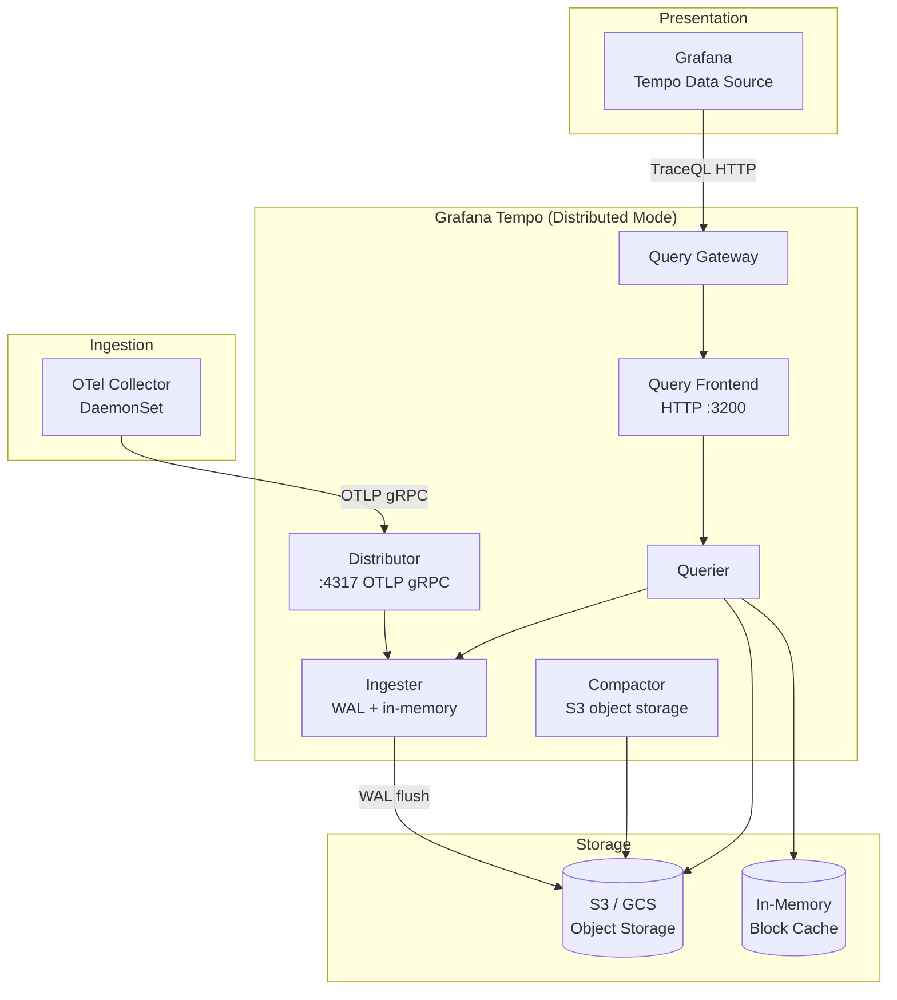
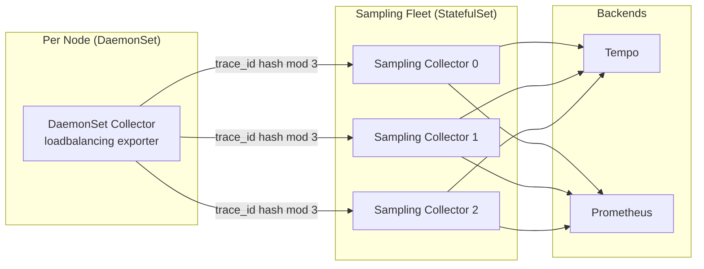

# 02 — Distributed Tracing for GraphQL

> **Purpose**
> This document covers the design and operation of distributed tracing for a federated GraphQL platform: span naming conventions, attribute schemas, resolver span design, DataLoader instrumentation, TraceQL query examples for GraphQL-specific investigations, Grafana Tempo deployment with object storage, trace-to-log correlation via Loki derived fields, and sampling decision propagation. Written for platform engineers and SREs diagnosing latency incidents and N+1 regressions.

---

## Learning Objectives

After reading this document you will be able to:

1. Define the span taxonomy for a federated GraphQL request and explain what each span represents.
2. Write TraceQL queries that isolate slow resolver spans, error traces, and N+1 DataLoader patterns.
3. Deploy Grafana Tempo with S3 or GCS as the object storage backend for production-scale trace retention.
4. Configure Loki derived fields so that clicking a `trace_id` in a log line opens the trace in Tempo.
5. Explain how sampling decisions propagate from the router to subgraphs and why head-based vs tail-based decisions are made at different points.
6. Instrument DataLoaders and batch resolvers to produce meaningful batch-size span attributes.

---

## Trace Structure for a Federated GraphQL Request

### Span Taxonomy

A single federated GraphQL query produces the following span hierarchy:

```
[Router] graphql.operation: GetProductWithReviews       (root span, ~180ms)
│
├── [Router] graphql.parse                               (~0.2ms)
├── [Router] graphql.validate                            (~0.3ms)
├── [Router] graphql.query_plan                          (~2ms)
│
├── [Router → Products] subgraph.fetch: products         (~45ms)
│   └── [Products Subgraph] HTTP POST /graphql
│       ├── resolver Query.products                      (~10ms)
│       │   └── dataloader.batch: ProductLoader [n=20]   (~35ms)
│       │       └── db.query SELECT * FROM products      (~30ms)
│       └── resolver Product.category                    (~0.1ms, scalar)
│
├── [Router → Reviews] subgraph.fetch: reviews           (~130ms)
│   └── [Reviews Subgraph] HTTP POST /graphql
│       ├── resolver Query._entities                     (~125ms)
│       │   └── dataloader.batch: ReviewLoader [n=20]    (~120ms)
│       │       └── http.client GET /reviews-api/v2      (~115ms)
│       └── resolver Review.author                       (~0.5ms)
│
└── [Router] graphql.serialize_response                  (~1ms)
```

### Span Naming Conventions

Consistent span names enable TraceQL pattern matching and Grafana dashboard grouping.

| Span | Name Pattern | Example |
|------|-------------|---------|
| Root operation | `graphql.operation: {operationName}` | `graphql.operation: GetProductWithReviews` |
| Parse stage | `graphql.parse` | `graphql.parse` |
| Validate stage | `graphql.validate` | `graphql.validate` |
| Query plan | `graphql.query_plan` | `graphql.query_plan` |
| Subgraph fetch | `subgraph.fetch: {subgraphName}` | `subgraph.fetch: products` |
| Resolver | `resolver {ParentType}.{fieldName}` | `resolver Query.products` |
| DataLoader batch | `dataloader.batch: {loaderName} [n={batchSize}]` | `dataloader.batch: ProductLoader [n=20]` |
| Database query | `db.query {operation} {table}` | `db.query SELECT products` |
| External HTTP call | `http.client {method} {host}{path}` | `http.client GET /reviews-api/v2` |
| Cache operation | `cache.{operation} {keyPattern}` | `cache.get product:*` |

---

## Span Attribute Schema

### Root Operation Span Attributes

```
graphql.operation.name         string    "GetProductWithReviews"
graphql.operation.type         string    "query" | "mutation" | "subscription"
graphql.document.hash          string    sha256 of normalized document (no variables)
graphql.complexity             int       calculated query cost score
graphql.depth                  int       max nesting depth of the query
graphql.persisted_query_id     string    persisted operation ID (if used)
http.request.method            string    "POST"
http.response.status_code      int       200
http.url                       string    "/graphql"
client.id                      string    "web-app-v4"
client.version                 string    "4.2.1"
user.id                        string    hashed or anonymized
network.peer.address           string    client IP (hashed in prod)
```

### Subgraph Fetch Span Attributes

```
subgraph.name                  string    "products"
subgraph.operation.name        string    "GetProductsForReview"
subgraph.operation.type        string    "query"
http.request.method            string    "POST"
http.response.status_code      int       200
http.url                       string    "http://products-svc/graphql"
graphql.error.count            int       0 (errors in subgraph response)
subgraph.response.size_bytes   int       4096
```

### Resolver Span Attributes

```
graphql.field.name             string    "products"
graphql.field.path             string    "Query.products"  (or "Product.reviews.0.author")
graphql.parent_type            string    "Query"
graphql.return_type            string    "[Product!]!"
graphql.operation.name         string    inherited from root span via baggage
graphql.result.count           int       20  (for list resolvers)
graphql.cache.hit              bool      false
```

### DataLoader Span Attributes

```
dataloader.name                string    "ProductLoader"
dataloader.batch_size          int       20
dataloader.cache_hit_count     int       3   (items resolved from in-memory cache)
dataloader.miss_count          int       17  (items that required DB/API fetch)
dataloader.keys_sample         string    "prod_1,prod_2,prod_3,..."  (first 10 keys)
db.system                      string    "postgresql"
db.name                        string    "products_db"
db.operation                   string    "SELECT"
db.statement                   string    "SELECT * FROM products WHERE id = ANY($1)"
```

### Span Events for Errors

Use span events (structured logs attached to a span) to record detailed error information without adding noise to span attributes:

```typescript
// Node.js — record a structured error event
span.addEvent('graphql.error', {
  'error.type': 'VALIDATION_ERROR',
  'error.message': 'Field "deletedAt" does not exist on type "Product"',
  'graphql.field.path': 'Query.products.deletedAt',
  'error.code': 'GRAPHQL_VALIDATION_FAILED',
});

// For exceptions (also captured by recordException):
span.recordException(error, {
  'graphql.operation.name': operationName,
  'graphql.field.path': fieldPath,
});
span.setStatus({ code: SpanStatusCode.ERROR, message: error.message });
```

---

## TraceQL Query Examples

TraceQL is Grafana Tempo's query language for trace search and aggregation. The following examples address common GraphQL investigation workflows.

### Find All Error Traces for a Specific Operation

```traceql
{
  span.graphql.operation.name = "GetProductWithReviews"
  && span.status = error
}
| select(span.graphql.error.count, resource.service.name)
```

### Find Slow Resolver Spans (> 500ms)

```traceql
{
  span.graphql.field.name != ""
  && duration > 500ms
}
| select(
    span.graphql.field.name,
    span.graphql.parent_type,
    span.graphql.operation.name,
    resource.service.name
  )
```

### Detect N+1 DataLoader Patterns (Batch Size = 1)

A DataLoader batch of size 1 is a strong indicator that N+1 resolution is occurring — the DataLoader was never able to accumulate multiple keys before flushing.

```traceql
{
  span.dataloader.name != ""
  && span.dataloader.batch_size = 1
}
| select(
    span.dataloader.name,
    span.graphql.operation.name,
    resource.subgraph.name,
    duration
  )
```

### Traces Touching a Specific Subgraph with Errors

```traceql
{
  span.subgraph.name = "reviews"
  && span.graphql.error.count > 0
}
| select(span.subgraph.operation.name, span.http.response.status_code)
```

### Find High-Complexity Queries

```traceql
{
  span.graphql.operation.type = "query"
  && span.graphql.complexity > 1000
}
| select(
    span.graphql.operation.name,
    span.graphql.complexity,
    span.client.id,
    duration
  )
| sort(span.graphql.complexity, desc)
```

### Root-Cause Latency Attribution — Which Subgraph is Slowest?

```traceql
{ span.name =~ "subgraph.fetch:.*" }
| rate()
| select(span.subgraph.name, duration)
```

Then use TraceQL aggregation (Tempo 2.4+):

```traceql
{ span.name =~ "subgraph.fetch:.*" }
| avg(duration) by(span.subgraph.name)
```

### Find Traces with Mutation Errors in the Last Hour

```traceql
{
  span.graphql.operation.type = "mutation"
  && status = error
  && nestedSetParent < 0   # Root spans only
}
| select(span.graphql.operation.name, span.client.id)
```

---

## Grafana Tempo Deployment

### Architecture Overview



### Helm Values — Production Tempo Deployment

```yaml
# helm/tempo-values.yaml
tempo:
  image:
    tag: "2.5.0"

  storage:
    trace:
      backend: s3
      s3:
        bucket: "my-org-tempo-traces"
        endpoint: "s3.us-east-1.amazonaws.com"
        region: "us-east-1"
        # Use IRSA (IAM Roles for Service Accounts) — no static credentials
      wal:
        path: /var/tempo/wal

  # Retention
  retention: "168h"   # 7 days — adjust based on budget

  # Query performance
  querier:
    max_concurrent_queries: 20

  # Compaction
  compactor:
    compaction:
      block_retention: "168h"
      compacted_block_retention: "1h"

# Tempo distributed mode
tempoDistributed:
  enabled: true

  distributor:
    replicas: 3
    resources:
      requests:
        cpu: 500m
        memory: 512Mi

  ingester:
    replicas: 5
    resources:
      requests:
        cpu: 1000m
        memory: 2Gi
    config:
      max_block_duration: 30m

  querier:
    replicas: 3
    resources:
      requests:
        cpu: 500m
        memory: 1Gi

  queryFrontend:
    replicas: 2

  compactor:
    replicas: 1
    resources:
      requests:
        cpu: 500m
        memory: 1Gi
```

### Tempo `tempo.yaml` — Full Backend Configuration

```yaml
# configmap: tempo-config
stream_over_http_enabled: true
server:
  http_listen_port: 3200
  log_level: info

distributor:
  receivers:
    otlp:
      protocols:
        grpc:
          endpoint: 0.0.0.0:4317
        http:
          endpoint: 0.0.0.0:4318

ingester:
  max_block_bytes: 1_000_000
  max_block_duration: 5m
  complete_block_timeout: 15m

compactor:
  compaction:
    block_retention: 168h

storage:
  trace:
    backend: s3
    s3:
      bucket: my-org-tempo-traces
      endpoint: s3.us-east-1.amazonaws.com
      region: us-east-1
      forcepathstyle: false
    pool:
      max_workers: 100
      queue_depth: 10000

querier:
  frontend_worker:
    frontend_address: tempo-query-frontend:9095

query_frontend:
  search:
    duration_slo: 5s
    throughput_bytes_slo: 1.073741824e+09
  max_retries: 3

metrics_generator:
  enabled: true
  registry:
    external_labels:
      source: tempo
      cluster: prod-us-east-1
  storage:
    path: /var/tempo/generator/wal
    remote_write:
      - url: http://mimir.observability.svc.cluster.local:9009/api/v1/push
        send_exemplars: true
  processors:
    - service-graphs
    - span-metrics

overrides:
  defaults:
    metrics_generator:
      processors:
        - service-graphs
        - span-metrics
    ingestion:
      rate_limit_bytes: 15_000_000   # 15MB/s per tenant
      burst_size_bytes:  20_000_000
    read:
      max_bytes_per_trace: 5_000_000  # 5MB max trace size
```

---

## Trace-to-Log Correlation

### Log Format Requirements

Every structured log line must include `trace_id` and `span_id` in the same format that Tempo uses. This enables Loki's derived fields to create clickable links.

**Node.js — pino configuration:**

```typescript
// src/logger.ts
import pino from 'pino';
import { trace } from '@opentelemetry/api';

function addTraceContext() {
  const span = trace.getActiveSpan();
  if (!span) return {};
  const ctx = span.spanContext();
  return {
    trace_id: ctx.traceId,
    span_id: ctx.spanId,
    trace_flags: ctx.traceFlags.toString(16).padStart(2, '0'),
  };
}

export const logger = pino({
  level: process.env.LOG_LEVEL ?? 'info',
  formatters: {
    log(object) {
      return { ...object, ...addTraceContext() };
    },
  },
  messageKey: 'message',
});
```

**Java — Logback with MDC:**

```xml
<!-- src/main/resources/logback-spring.xml -->
<configuration>
  <appender name="JSON" class="ch.qos.logback.core.ConsoleAppender">
    <encoder class="net.logstash.logback.encoder.LogstashEncoder">
      <customFields>{"service":"orders-subgraph"}</customFields>
      <includeMdcKeyName>trace_id</includeMdcKeyName>
      <includeMdcKeyName>span_id</includeMdcKeyName>
    </encoder>
  </appender>
  <root level="INFO">
    <appender-ref ref="JSON"/>
  </root>
</configuration>
```

The OTel Java agent automatically populates `trace_id` and `span_id` MDC fields.

**Go — zap with OTel context:**

```go
// internal/observability/logger.go
package observability

import (
    "context"
    "go.opentelemetry.io/otel/trace"
    "go.uber.org/zap"
    "go.uber.org/zap/zapcore"
)

func TraceFields(ctx context.Context) []zap.Field {
    span := trace.SpanFromContext(ctx)
    if !span.IsRecording() {
        return nil
    }
    sc := span.SpanContext()
    return []zap.Field{
        zap.String("trace_id", sc.TraceID().String()),
        zap.String("span_id", sc.SpanID().String()),
    }
}

// Usage:
// logger.Info("Resolver called", append(TraceFields(ctx),
//     zap.String("field", "products"),
//     zap.Int("result_count", len(products)),
// )...)
```

### Loki Derived Fields Configuration (Grafana)

Configure Loki in Grafana to auto-link `trace_id` values in log lines to Tempo:

```yaml
# grafana/provisioning/datasources/loki.yaml
apiVersion: 1
datasources:
  - name: Loki
    type: loki
    url: http://loki.observability.svc.cluster.local:3100
    jsonData:
      derivedFields:
        - matcherRegex: '"trace_id":"([a-f0-9]{32})"'
          name: TraceID
          url: "$${__value.raw}"
          datasourceUid: tempo   # Must match Tempo data source UID
          urlDisplayLabel: "View trace in Tempo"
```

With this configuration, any log line containing `"trace_id":"<32-hex-chars>"` will display a clickable link that opens the trace in Tempo's Explore view.

### Grafana Explore — Log-to-Trace Navigation Example

```
LogQL query to find all error logs for a specific operation:

{service_name="products-subgraph"} 
  |= "error"
  | json
  | graphql_operation_name = "GetProductWithReviews"
  | line_format "{{.message}} trace={{.trace_id}}"

→ Click any trace_id → Opens Tempo trace view for that exact request
```

---

## Sampling Decision Propagation

### The Propagation Problem

When the router makes a sampling decision (head-based), it encodes this decision in the `traceparent` header's flags byte:
- `01` = sampled (export this trace)
- `00` = not sampled (drop this trace)

Subgraphs must **respect** the upstream sampling decision. They must not independently decide to sample or drop a trace that the router has already decided to keep.

The `ParentBased` sampler in all OTel SDKs handles this correctly: it uses the parent's sampling flag to determine whether the current span should be sampled.

### Configuration — Ensuring Correct Propagation

**Node.js subgraph:**
```typescript
// Correct: ParentBased respects upstream sampling decision
const sdk = new NodeSDK({
  sampler: new ParentBasedSampler({
    root: new TraceIdRatioBasedSampler(0.0),  // Root = 0% if no parent
    // If parent is sampled, always sample. If parent is not sampled, never sample.
    remoteParentSampled: new AlwaysOnSampler(),
    remoteParentNotSampled: new AlwaysOffSampler(),
  }),
});
```

**Java (via OTEL_TRACES_SAMPLER env var):**
```bash
OTEL_TRACES_SAMPLER=parentbased_always_on  # Respect parent, always sample as root
```

**Go:**
```go
sdktrace.WithSampler(
    sdktrace.ParentBased(sdktrace.NeverSample()),  // Never sample without a parent
)
```

### Tail Sampling and Multi-Collector Deployments

When using tail-based sampling in the OTel Collector, all spans for a given trace **must arrive at the same Collector instance**. Otherwise the tail sampler cannot assemble the complete trace to make a decision.

Use one of these strategies:

**Strategy 1: DaemonSet with consistent routing**
All pods on the same node send to the local DaemonSet Collector. For a given trace, the router and subgraph pods may be on different nodes, sending to different Collectors. Use a **Load Balancing Exporter** in front of a Collector fleet to route by trace ID:

```yaml
# Front-tier Collector (DaemonSet): route by trace ID
exporters:
  loadbalancing:
    protocol:
      otlp:
        tls:
          insecure: true
    resolver:
      k8s:
        service: otel-collector-sampling.observability
        ports: [4317]
        timeout: 2s

service:
  pipelines:
    traces:
      receivers: [otlp]
      processors: [memory_limiter, batch]
      exporters: [loadbalancing]
```

**Strategy 2: Single Collector Deployment (StatefulSet)**
Use a StatefulSet Collector with a headless service. The load balancing exporter in a DaemonSet Collector routes to the StatefulSet based on trace ID hash. The StatefulSet Collector applies tail sampling.



---

## Resolver Span Conventions — Deep Reference

### When to Create a Resolver Span

Not every field resolution warrants a span. Creating spans for every scalar field produces enormous trace volume. Apply these rules:

| Condition | Create Span? | Reason |
|-----------|-------------|--------|
| Resolver performs a database query | Yes | High latency contribution |
| Resolver calls DataLoader | Yes | Batch behavior is important to observe |
| Resolver calls an external API | Yes | External dependency |
| Resolver does non-trivial business logic | Yes | Logic errors are hard to debug otherwise |
| Resolver is a scalar field computed from parent | No | O(1) CPU, no I/O |
| Resolver is `__typename` | No | Intrinsic, no cost |
| Resolver is a trivial field access | No | `user.id` returning `parent.id` |

### Resolver Span Sampling — Selective Instrumentation

For subgraphs with very high throughput (>10k RPS), creating spans for all resolver calls can saturate the Collector. Use conditional span creation:

```typescript
const tracer = trace.getTracer('resolvers');

function tracedResolver<T>(
  info: GraphQLResolveInfo,
  fn: () => Promise<T>,
  options: { minDurationMs?: number } = {}
): Promise<T> {
  const span = tracer.startSpan(`resolver ${info.parentType.name}.${info.fieldName}`);

  return fn().then(
    (result) => {
      span.end();
      return result;
    },
    (error) => {
      span.recordException(error);
      span.setStatus({ code: SpanStatusCode.ERROR });
      span.end();
      throw error;
    }
  );
}
```

---

## Production Considerations

### Trace Volume Estimation

At 1000 RPS, a federated query touching 3 subgraphs with 5 resolvers each produces:
- 1 root span
- 3 query planning spans (parse, validate, plan)
- 3 subgraph fetch spans
- 15 resolver spans
- ~5 DataLoader spans
- ~5 database query spans

Total: ~33 spans per request × 1000 RPS = 33,000 spans/second

At ~500 bytes per span (average with attributes): **~16 MB/second of uncompressed trace data**

With gzip compression (~4:1 ratio) and 5% head-based sampling: **~200 KB/second** to Tempo — easily manageable.

With 100% tail-based sampling (no pre-filter): **~4 MB/second** to Tempo — budget ~350 GB/day at 7-day retention.

### Trace Search Performance

Tempo's trace search performance depends on tag index configuration. Configure the most-queried attributes as dedicated columns:

```yaml
# tempo-config.yaml
parquet_config:
  schema_version: v3
  bloom_filter_false_positive: 0.005
  dedicated_columns:
    - scope: span
      name: graphql.operation.name
      type: string
    - scope: span
      name: graphql.operation.type
      type: string
    - scope: span
      name: subgraph.name
      type: string
    - scope: span
      name: client.id
      type: string
    - scope: span
      name: graphql.error.count
      type: int
    - scope: resource
      name: service.name
      type: string
    - scope: resource
      name: deployment.environment
      type: string
```

---

## Validation Checklist

```
[ ] Root span has graphql.operation.name and graphql.operation.type attributes
[ ] Each subgraph fetch appears as a child of the router root span (verify trace_id match)
[ ] Resolver spans include graphql.field.path attribute
[ ] DataLoader spans include dataloader.batch_size attribute
[ ] Error spans have span.status = ERROR and an exception event
[ ] trace_id appears in every structured log line
[ ] Loki derived field links log trace_ids to Tempo correctly
[ ] Tempo query for trace ID returns the complete trace (all spans present)
[ ] Tail sampling: error traces are always retained (100% policy active)
[ ] Slow traces (>2s) are retained (latency policy active)
[ ] PII: graphql.variables not present in any exported span
[ ] Tempo retention policy set and compactor is running
[ ] S3 bucket lifecycle policy aligns with Tempo retention
```

---

## Related Topics

- [01-opentelemetry.md](./01-opentelemetry.md) — OTel SDK setup and Collector configuration
- [03-metrics.md](./03-metrics.md) — Metric exemplars linking histograms to traces
- [05-slos-and-alerting.md](./05-slos-and-alerting.md) — Alert rules that use trace exemplars
- [Federation](../07-federation/README.md) — Subgraph topology determines span hierarchy
- [Security Overview](../05-security/README.md) — PII in trace attributes

---

## References

- [Grafana Tempo Documentation](https://grafana.com/docs/tempo/latest/)
- [TraceQL Language Reference](https://grafana.com/docs/tempo/latest/traceql/)
- [OpenTelemetry Trace Semantic Conventions](https://opentelemetry.io/docs/specs/semconv/general/trace/)
- [W3C TraceContext — Sampling Flags](https://www.w3.org/TR/trace-context/#sampled-flag)
- [OTel Collector Tail Sampling Processor](https://github.com/open-telemetry/opentelemetry-collector-contrib/tree/main/processor/tailsamplingprocessor)
- [OTel Collector Load Balancing Exporter](https://github.com/open-telemetry/opentelemetry-collector-contrib/tree/main/exporter/loadbalancingexporter)
- [Grafana Loki Derived Fields](https://grafana.com/docs/grafana/latest/datasources/loki/#derived-fields)
- [pino — Node.js JSON Logger](https://getpino.io/)
- [Tempo Parquet Schema](https://grafana.com/docs/tempo/latest/operations/schema/)
