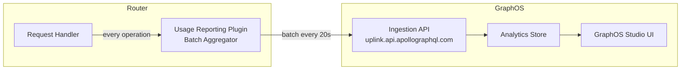

# 04 — Query Analytics for GraphQL

> **Purpose**
> This document covers GraphQL-specific query analytics: Apollo GraphOS usage reporting plugin configuration, Hive open-source deployment architecture (Docker Compose and Kubernetes), field usage analysis workflows for safe schema evolution, schema check CI integration with GitHub Actions, deprecation management using field usage data, and a cross-platform comparison of GraphOS versus Hive. Written for platform engineers, API governance leads, and senior engineers who own the schema evolution lifecycle.

---

## Learning Objectives

After reading this document you will be able to:

1. Configure the Apollo Router usage reporting plugin to send telemetry to GraphOS and/or Hive.
2. Deploy Hive (open-source GraphQL analytics) on Kubernetes as an alternative to GraphOS for organizations with data residency requirements.
3. Use field usage data to determine which clients depend on a field before deprecating or removing it.
4. Integrate schema checks into a GitHub Actions CI pipeline so that breaking changes are blocked before merge.
5. Design a deprecation workflow that uses analytics data to manage the full lifecycle of a deprecated field.
6. Choose between GraphOS and Hive based on organizational requirements.

---

## Why Query Analytics Is a Distinct Observability Pillar

Prometheus metrics and distributed traces answer system-level questions: latency, error rate, saturation. They cannot answer the application-level question that is unique to GraphQL:

**"Which clients are using field X, and how often?"**

This question is essential for:

- **Safe schema evolution**: You cannot remove a field without knowing which clients will break.
- **Deprecation management**: You cannot enforce a deprecation timeline without knowing which clients are still using the deprecated field.
- **Capacity planning by feature**: The GraphQL query shape population tells you which features drive load — not request count, but field traversal count.
- **Security auditing**: You can identify which clients are requesting sensitive fields (e.g., `user.socialSecurityNumber`) that should be restricted.

---

## Apollo GraphOS — Usage Reporting

### Architecture

Apollo Router sends a compact representation of each operation to the GraphOS ingestion endpoint. This is called a "trace report" and contains:
- The operation document hash (not the raw document)
- The operation name
- Per-field latency and error data
- Client identity (`x-apollo-client-name`, `x-apollo-client-version` headers)
- No variable values (PII-safe by design)



### Router Configuration — GraphOS Usage Reporting

```yaml
# router.yaml
telemetry:
  apollo:
    # Obtain key from GraphOS Studio → Settings → API Keys
    apollo_key: "${APOLLO_KEY}"
    apollo_graph_ref: "${APOLLO_GRAPH_REF}"   # my-graph@production

    # Usage reporting configuration
    usage_reporting:
      enabled: true
      # Send 100% of operation signatures (not individual traces)
      # GraphOS aggregates per signature — no sampling needed here
      field_level_instrumentation_sampler: "0.1"   # 10% of ops get field-level timing
      send_variables_via_report: false               # Never send variable values (PII)
      send_headers: false                            # Suppress headers from reports
      include_details_in_reports: true

    # Client identity — required for per-client analytics
    client_name_header: "apollographql-client-name"
    client_version_header: "apollographql-client-version"
```

### Registering the Schema with GraphOS

Before usage reports are meaningful, the schema must be registered with the correct variant:

```bash
# Register the supergraph schema with the production variant
rover supergraph publish my-graph@production \
  --schema ./supergraph.graphql \
  --convert   # Convert from subgraph schema format if needed

# Register an individual subgraph
rover subgraph publish my-graph@production \
  --name products \
  --schema ./products.graphql \
  --routing-url https://products.internal/graphql
```

### Client Identity Headers — Web Application

```typescript
// Apollo Client configuration — always send client identity headers
import { ApolloClient, InMemoryCache, HttpLink } from '@apollo/client';

const client = new ApolloClient({
  link: new HttpLink({
    uri: '/graphql',
    headers: {
      'apollographql-client-name': 'web-app',
      'apollographql-client-version': process.env.NEXT_PUBLIC_APP_VERSION ?? '0.0.0',
    },
  }),
  cache: new InMemoryCache(),
});
```

### Client Identity Headers — Mobile Applications

```swift
// iOS — ApolloClient configuration
let store = ApolloStore()
let provider = DefaultInterceptorProvider(store: store)
let transport = RequestChainNetworkTransport(
    interceptorProvider: provider,
    endpointURL: URL(string: "https://api.example.com/graphql")!,
    additionalHeaders: [
        "apollographql-client-name": "ios-app",
        "apollographql-client-version": Bundle.main.infoDictionary?["CFBundleShortVersionString"] as? String ?? "0.0.0"
    ]
)
```

---

## Hive — Open-Source GraphQL Analytics

Hive is the open-source self-hosted alternative to Apollo GraphOS. It provides schema registry, usage reporting, and field analytics without sending data to a third-party cloud.

### When to Choose Hive over GraphOS

| Requirement | GraphOS | Hive |
|-------------|---------|------|
| Data residency (no external endpoints) | No | Yes |
| Self-hosted full control | No | Yes |
| Open-source license | No | MIT |
| Managed cloud with SLA | Yes | No (self-managed) |
| GitHub/GitLab native SSO | Enterprise tier | Built-in |
| Built-in CDN for schema delivery | Yes | Yes |
| Slack alerts | Yes | Yes |

### Docker Compose Deployment — Development / Small Teams

```yaml
# docker-compose.yaml
version: "3.9"

services:
  db:
    image: postgres:16-alpine
    environment:
      POSTGRES_USER: hive
      POSTGRES_PASSWORD: hive_secret
      POSTGRES_DB: hive
    volumes:
      - postgres_data:/var/lib/postgresql/data
    healthcheck:
      test: ["CMD-SHELL", "pg_isready -U hive"]
      interval: 10s

  redis:
    image: redis:7-alpine
    command: redis-server --maxmemory 256mb --maxmemory-policy allkeys-lru

  clickhouse:
    image: clickhouse/clickhouse-server:23.12
    environment:
      CLICKHOUSE_DB: hive
      CLICKHOUSE_USER: hive
      CLICKHOUSE_PASSWORD: hive_secret
    volumes:
      - clickhouse_data:/var/lib/clickhouse
    ulimits:
      nofile:
        soft: 262144
        hard: 262144

  hive:
    image: ghcr.io/kamilkisiela/graphql-hive/app:latest
    ports:
      - "3000:3000"
    environment:
      APP_BASE_URL: "http://localhost:3000"
      DATABASE_URL: "postgresql://hive:hive_secret@db:5432/hive"
      REDIS_HOST: redis
      REDIS_PORT: 6379
      CLICKHOUSE_PROTOCOL: http
      CLICKHOUSE_HOST: clickhouse
      CLICKHOUSE_PORT: 8123
      CLICKHOUSE_USERNAME: hive
      CLICKHOUSE_PASSWORD: hive_secret
      CLICKHOUSE_DATABASE: hive
      # JWT secret for authentication
      AUTH_SECRET: "${HIVE_AUTH_SECRET}"
      # Email configuration (for invitations)
      EMAIL_FROM: "hive@example.com"
      EMAIL_PROVIDER: "smtp"
      SMTP_HOST: "${SMTP_HOST}"
      SMTP_PORT: "587"
      SMTP_USER: "${SMTP_USER}"
      SMTP_PASSWORD: "${SMTP_PASSWORD}"
    depends_on:
      db:
        condition: service_healthy
      redis:
        condition: service_started
      clickhouse:
        condition: service_started

  hive-usage-ingestor:
    image: ghcr.io/kamilkisiela/graphql-hive/usage-ingestor:latest
    environment:
      DATABASE_URL: "postgresql://hive:hive_secret@db:5432/hive"
      REDIS_HOST: redis
      REDIS_PORT: 6379
      CLICKHOUSE_PROTOCOL: http
      CLICKHOUSE_HOST: clickhouse
      CLICKHOUSE_PORT: 8123
      CLICKHOUSE_USERNAME: hive
      CLICKHOUSE_PASSWORD: hive_secret
      CLICKHOUSE_DATABASE: hive
    depends_on:
      - db
      - redis
      - clickhouse

volumes:
  postgres_data:
  clickhouse_data:
```

### Kubernetes Deployment — Production Hive

For production, deploy Hive components as separate Deployments with appropriate resource limits and PodDisruptionBudgets.

```yaml
# kubernetes/hive-namespace.yaml
apiVersion: v1
kind: Namespace
metadata:
  name: hive
  labels:
    app.kubernetes.io/name: hive

---
# kubernetes/hive-app-deployment.yaml
apiVersion: apps/v1
kind: Deployment
metadata:
  name: hive-app
  namespace: hive
spec:
  replicas: 2
  selector:
    matchLabels:
      app: hive-app
  template:
    metadata:
      labels:
        app: hive-app
    spec:
      containers:
        - name: hive-app
          image: ghcr.io/kamilkisiela/graphql-hive/app:0.36.0
          ports:
            - containerPort: 3000
          env:
            - name: APP_BASE_URL
              value: "https://hive.internal.example.com"
            - name: DATABASE_URL
              valueFrom:
                secretKeyRef:
                  name: hive-secrets
                  key: database-url
            - name: REDIS_HOST
              value: "redis-master.hive.svc.cluster.local"
            - name: CLICKHOUSE_HOST
              value: "clickhouse.hive.svc.cluster.local"
            - name: CLICKHOUSE_USERNAME
              valueFrom:
                secretKeyRef:
                  name: hive-secrets
                  key: clickhouse-username
            - name: CLICKHOUSE_PASSWORD
              valueFrom:
                secretKeyRef:
                  name: hive-secrets
                  key: clickhouse-password
          resources:
            requests:
              cpu: 500m
              memory: 512Mi
            limits:
              cpu: 2000m
              memory: 1Gi
          livenessProbe:
            httpGet:
              path: /api/health
              port: 3000
            initialDelaySeconds: 30

---
# kubernetes/hive-usage-ingestor-deployment.yaml
apiVersion: apps/v1
kind: Deployment
metadata:
  name: hive-usage-ingestor
  namespace: hive
spec:
  replicas: 3   # Scale independently from the app for high usage volume
  selector:
    matchLabels:
      app: hive-usage-ingestor
  template:
    metadata:
      labels:
        app: hive-usage-ingestor
    spec:
      containers:
        - name: ingestor
          image: ghcr.io/kamilkisiela/graphql-hive/usage-ingestor:0.36.0
          resources:
            requests:
              cpu: 1000m
              memory: 1Gi
            limits:
              cpu: 4000m
              memory: 2Gi

---
# PodDisruptionBudget for the ingestor
apiVersion: policy/v1
kind: PodDisruptionBudget
metadata:
  name: hive-usage-ingestor
  namespace: hive
spec:
  minAvailable: 2
  selector:
    matchLabels:
      app: hive-usage-ingestor
```

### Apollo Router Configuration — Sending Reports to Hive

```yaml
# router.yaml — configure usage reporting to Hive instead of GraphOS
# Hive provides an Apollo-compatible usage reporting endpoint.

telemetry:
  apollo:
    # Hive usage reporting endpoint (mimics GraphOS API)
    apollo_key: "${HIVE_TOKEN}"   # From Hive project settings
    # Override the reporting endpoint to point to your Hive instance
    usage_reporting:
      enabled: true
```

For Hive-native reporting, use the `hive` section instead:

```yaml
# router.yaml — Hive native configuration (preferred)
# Install the Hive Router plugin from the Hive documentation
plugins:
  hive.usage_reporting:
    token: "${HIVE_TOKEN}"
    endpoint: "https://app.hive.dev/usage"  # Or your self-hosted Hive endpoint
    buffer_size: 1000
    include_client_headers:
      - "apollographql-client-name"
      - "apollographql-client-version"
```

### Hive CLI — Schema Publishing

```bash
# Install Hive CLI
npm install -g @graphql-hive/cli

# Authenticate
hive auth:login --token "${HIVE_TOKEN}"

# Publish a subgraph schema
hive schema:publish \
  --service "products" \
  --url "https://products.internal/graphql" \
  ./products.graphql

# Check for breaking changes before publishing
hive schema:check \
  --service "products" \
  ./products-proposed.graphql
```

---

## Field Usage Analysis — Safe Schema Evolution

### Accessing Field Usage Data

**In GraphOS Studio:**
1. Navigate to your graph → Schema
2. Select a type → field
3. View "Field usage" tab: requests by client, by time, by operation

**In Hive:**
1. Navigate to your project → Insights → Fields
2. Filter by time range, client, or operation name
3. Export usage data as CSV for offline analysis

### Field Usage API (GraphOS)

GraphOS exposes field usage data via its own GraphQL API for programmatic access:

```graphql
# GraphOS Platform API — query field usage
query GetFieldUsage($graphId: ID!, $variant: String!, $fromDate: Timestamp!, $toDate: Timestamp!) {
  service(id: $graphId) {
    statsWindow(from: $fromDate, to: $toDate) {
      fieldStats(variant: $variant) {
        groupBy {
          field
          parentType
          clientName
        }
        metrics {
          fieldHistogram {
            serviceTimeMs(percentile: 0.99)
          }
          requestsCountTotal
          errorCountTotal
        }
      }
    }
  }
}
```

### Field Usage Analysis Workflow — Before Removing a Field

```
Step 1: Mark field as @deprecated in the schema
         Add a sunset date in the deprecation message:
         """@deprecated(reason: "Use `productV2.category`. Removal date: 2026-09-01")"""

Step 2: Publish the schema with the deprecation
         rover subgraph publish my-graph@production --name products --schema ./products.graphql

Step 3: Query field usage to identify impacted clients
         GraphQL query: GetFieldUsage for product.legacyCategory over last 30 days
         Output: List of (clientName, requestCount, lastSeen) tuples

Step 4: Contact impacted clients
         For each client with requestCount > 0:
           - Open ticket with the client team
           - Link to migration guide (use productV2.category instead)
           - Share the removal date

Step 5: Monitor usage decline over time
         Set up a Hive/GraphOS alert if field usage exceeds threshold N days before removal

Step 6: Confirm zero usage before removal
         Run step 3 query. Proceed only if requestCount == 0 for all clients
         and lastSeen > 30 days ago.

Step 7: Remove the field from the schema
         Submit schema change PR. CI schema check will pass (no usage).
         Deploy to staging → verify → deploy to production.
```

### Field Usage Script — Automated Usage Check

```typescript
// scripts/check-field-usage.ts
// Run before merging a schema change that removes fields

import { fetch } from 'node-fetch';

interface FieldUsageResult {
  field: string;
  parentType: string;
  totalRequests: number;
  lastSeenDays: number;
  clients: { name: string; requests: number }[];
}

async function checkFieldUsage(
  graphId: string,
  removedFields: Array<{ type: string; field: string }>,
  lookbackDays: number = 30
): Promise<FieldUsageResult[]> {
  const toDate = Date.now();
  const fromDate = toDate - lookbackDays * 24 * 60 * 60 * 1000;

  const query = `
    query CheckFieldUsage($graphId: ID!, $from: Timestamp!, $to: Timestamp!) {
      service(id: $graphId) {
        statsWindow(from: $from, to: $to) {
          fieldStats(variant: "production") {
            groupBy { field parentType clientName }
            metrics { requestsCountTotal }
          }
        }
      }
    }
  `;

  const response = await fetch('https://graphql.api.apollographql.com/', {
    method: 'POST',
    headers: {
      'Content-Type': 'application/json',
      'x-api-key': process.env.APOLLO_KEY!,
    },
    body: JSON.stringify({ query, variables: { graphId, from: fromDate, to: toDate } }),
  });

  const data = await response.json();
  const fieldStats = data.data.service.statsWindow.fieldStats;

  return removedFields.map(({ type, field }) => {
    const fieldKey = `${type}.${field}`;
    const usageRecords = fieldStats.filter(
      (s: any) => s.groupBy.parentType === type && s.groupBy.field === field
    );

    const totalRequests = usageRecords.reduce(
      (sum: number, r: any) => sum + r.metrics.requestsCountTotal, 0
    );

    const clients = usageRecords.map((r: any) => ({
      name: r.groupBy.clientName,
      requests: r.metrics.requestsCountTotal,
    }));

    return {
      field: fieldKey,
      parentType: type,
      totalRequests,
      lastSeenDays: lookbackDays, // Simplified; real impl tracks last seen date
      clients,
    };
  });
}

// Main — fail CI if any removed field still has active usage
async function main() {
  const removedFields = JSON.parse(process.env.REMOVED_FIELDS ?? '[]');
  if (removedFields.length === 0) {
    console.log('No fields being removed. Skipping usage check.');
    process.exit(0);
  }

  const results = await checkFieldUsage(process.env.APOLLO_GRAPH_ID!, removedFields);
  const fieldsWithUsage = results.filter((r) => r.totalRequests > 0);

  if (fieldsWithUsage.length > 0) {
    console.error('ERROR: Cannot remove fields that are still in use:');
    fieldsWithUsage.forEach((f) => {
      console.error(`  ${f.field}: ${f.totalRequests} requests in last 30 days`);
      f.clients.forEach((c) => {
        console.error(`    - ${c.name}: ${c.requests} requests`);
      });
    });
    process.exit(1);
  }

  console.log('All fields being removed have zero usage. Safe to proceed.');
}

main();
```

---

## Schema Check CI Integration — GitHub Actions

Schema checks prevent breaking changes from reaching production by comparing the proposed schema against the current production schema and the field usage data.

### Apollo GraphOS Schema Check

```yaml
# .github/workflows/schema-check.yaml
name: GraphQL Schema Check

on:
  pull_request:
    paths:
      - 'subgraphs/*/schema.graphql'
      - 'router/supergraph.yaml'

jobs:
  schema-check:
    name: Schema Check — ${{ matrix.subgraph }}
    runs-on: ubuntu-latest

    strategy:
      matrix:
        subgraph: [products, orders, identity, reviews]

    steps:
      - uses: actions/checkout@v4

      - name: Install Rover CLI
        run: |
          curl -sSL https://rover.apollo.dev/nix/latest | sh
          echo "$HOME/.rover/bin" >> $GITHUB_PATH

      - name: Check subgraph schema for breaking changes
        env:
          APOLLO_KEY: ${{ secrets.APOLLO_KEY }}
        run: |
          rover subgraph check ${{ vars.APOLLO_GRAPH_REF }} \
            --name ${{ matrix.subgraph }} \
            --schema ./subgraphs/${{ matrix.subgraph }}/schema.graphql \
            --background   # Do not block PR; post results as GitHub check

      - name: Verify no active usage for removed fields
        if: github.event_name == 'pull_request'
        env:
          APOLLO_KEY: ${{ secrets.APOLLO_KEY }}
          APOLLO_GRAPH_ID: ${{ vars.APOLLO_GRAPH_ID }}
          REMOVED_FIELDS: ${{ steps.detect-removed-fields.outputs.removed_fields }}
        run: |
          npx ts-node ./scripts/check-field-usage.ts

  supergraph-compose-check:
    name: Supergraph Composition Check
    runs-on: ubuntu-latest
    needs: schema-check

    steps:
      - uses: actions/checkout@v4

      - name: Install Rover CLI
        run: |
          curl -sSL https://rover.apollo.dev/nix/latest | sh
          echo "$HOME/.rover/bin" >> $GITHUB_PATH

      - name: Compose supergraph and verify
        run: |
          rover supergraph compose --config ./router/supergraph.yaml \
            --output ./supergraph-proposed.graphql

      - name: Run schema check against composed supergraph
        env:
          APOLLO_KEY: ${{ secrets.APOLLO_KEY }}
        run: |
          rover supergraph check ${{ vars.APOLLO_GRAPH_REF }} \
            --schema ./supergraph-proposed.graphql
```

### Hive Schema Check — GitHub Actions

```yaml
# .github/workflows/hive-schema-check.yaml
name: Hive Schema Check

on:
  pull_request:
    paths:
      - 'subgraphs/*/schema.graphql'

jobs:
  schema-check:
    name: Hive Schema Check
    runs-on: ubuntu-latest

    steps:
      - uses: actions/checkout@v4

      - name: Install Hive CLI
        run: npm install -g @graphql-hive/cli

      - name: Check for breaking changes (Products)
        env:
          HIVE_TOKEN: ${{ secrets.HIVE_TOKEN }}
        run: |
          hive schema:check \
            --service products \
            --github   # Posts results as GitHub status check
            ./subgraphs/products/schema.graphql

      - name: Check for breaking changes (Orders)
        env:
          HIVE_TOKEN: ${{ secrets.HIVE_TOKEN }}
        run: |
          hive schema:check \
            --service orders \
            --github \
            ./subgraphs/orders/schema.graphql
```

### Schema Check Result Interpretation

| Check Result | Meaning | Action |
|-------------|---------|--------|
| `PASSED` | No breaking changes detected | Merge allowed |
| `PASSED` with warnings | Non-breaking changes but field usage detected for changed fields | Review warnings; confirm with client teams |
| `FAILED` — breaking change | Removed field / changed type / removed argument | Block merge; must resolve before proceeding |
| `FAILED` — composition error | Subgraph schema fails to compose into a valid supergraph | Fix schema before merging |

---

## Deprecation Management Workflow

### Schema Annotation

```graphql
type Product {
  id: ID!
  name: String!

  # Current field
  category: ProductCategory!

  # Deprecated field — use category instead
  legacyCategory: String
    @deprecated(
      reason: "Use `category` field which returns a structured ProductCategory type. Will be removed 2026-09-01."
    )
}
```

### Deprecation Lifecycle

```
1. ADD @deprecated annotation
   → Schema check passes (no breaking change; @deprecated is informational)
   → Deploy to production
   → Notify client teams via Slack/email

2. MONITOR usage in GraphOS / Hive
   → Dashboard: field usage trend over time
   → Alert: fire if usage is not declining (client has not migrated)

3. ENFORCE migration deadline
   → 30 days before sunset: if usage > 0, send reminder to client teams
   → 7 days before sunset: if usage > 0, escalate to team leads
   → Day of sunset: verify usage == 0 before removing

4. REMOVE the field
   → Remove @deprecated and the field definition from schema
   → Schema check: if any client is still using the field, check fails with field usage data
   → Deploy to production
```

### Hive Alerts for Deprecated Field Usage

```yaml
# In Hive: configure a conditional breaking change policy
# Settings → Conditional Breaking Changes

# Flag as potentially breaking: if usage > threshold
conditionalBreakingChanges:
  enabled: true
  requestCountThreshold: 10        # More than 10 requests in the period = breaking
  breakingChangePeriod: "30d"      # Look back 30 days
  excludedClients:
    - "integration-test-runner"    # Exclude synthetic traffic
```

---

## Cross-Platform Comparison: GraphOS vs Hive

| Capability | Apollo GraphOS | Hive (Open-Source) |
|------------|---------------|-------------------|
| **Schema registry** | Yes, hosted | Yes, self-hosted |
| **Usage reporting** | Yes | Yes |
| **Field usage analytics** | Yes, per-client per-operation | Yes, per-client per-operation |
| **Schema checks in CI** | Yes (Rover CLI) | Yes (Hive CLI) |
| **Conditional breaking changes** | Yes | Yes |
| **CDN schema delivery** | Yes (Apollo Uplink) | Yes (Hive CDN) |
| **Schema change proposals / review** | Enterprise | Built-in |
| **Persisted operations** | Yes | Yes |
| **Data residency** | US/EU cloud regions | Full self-hosted |
| **SSO integration** | Enterprise tier | GitHub/GitLab built-in |
| **Custom retention** | Limited (free tier) | Full control |
| **Alerting / notifications** | Slack, email | Slack, webhook |
| **Grafana integration** | Plugin (limited) | Plugin (community) |
| **License** | Proprietary | MIT |
| **Pricing model** | Per-operation (usage-based) | Free (self-hosted infra cost) |
| **Support SLA** | Enterprise contract | Community / commercial |

### Decision Framework

Use **GraphOS** when:
- Your organization is already invested in the Apollo ecosystem (Router, Studio)
- You prefer a managed cloud service with guaranteed uptime and support SLA
- The team is small and cannot dedicate engineering time to operating analytics infrastructure
- You need the full Apollo feature set (Variants, Schema change proposals, Checks)

Use **Hive** when:
- Data residency requirements prohibit sending schema/analytics data to a third-party cloud
- Your organization runs on-premises or in a sovereign cloud
- You want to avoid per-operation usage-based pricing at scale
- Your team has capacity to operate ClickHouse, PostgreSQL, and Redis

### Hybrid Architecture

Many teams run both: GraphOS for developer tooling and CI integration (where external data is acceptable), and Hive for the analytics pipeline (where data residency requirements are strictest).

```yaml
# router.yaml — send usage reports to both GraphOS and Hive simultaneously
# using the router's dual reporting configuration

telemetry:
  apollo:
    apollo_key: "${APOLLO_KEY}"
    apollo_graph_ref: "${APOLLO_GRAPH_REF}"
    usage_reporting:
      enabled: true

# Hive usage reporting (via Hive plugin or compatible endpoint)
# Configure as a secondary reporting destination
```

---

## Operational Considerations

### Report Batching and Backpressure

The usage reporting plugin batches operation reports to avoid overwhelming the analytics backend. Configure the batch size and flush interval based on your traffic:

| Traffic Level | Batch Size | Flush Interval |
|--------------|------------|----------------|
| < 100 RPS | 50 | 30s |
| 100–1000 RPS | 200 | 20s |
| > 1000 RPS | 500 | 10s |

If the analytics backend is slow or unavailable, reports are dropped (not buffered indefinitely). This is correct behavior — analytics data is best-effort and must not affect API availability.

### Privacy and Compliance

```
Schema data: Safe to share externally (no user data)
Operation names: Safe (structured, not user-provided values)
Variable values: NEVER send (may contain PII, credentials, PHI)
Client headers: Send only x-apollo-client-name and -version; strip all others
User IDs: Never send; normalize to client_name for analytics purposes
Query documents: Hashed before sending; raw documents never leave the router
```

### Analytics Data Freshness

| Platform | Report Latency | Analytics Update Frequency |
|----------|---------------|---------------------------|
| GraphOS | ~30 seconds | Near real-time |
| Hive (self-hosted) | ~60 seconds | Near real-time (ClickHouse) |

Data in both platforms is approximate — not every operation may be counted if the router process crashes during a batch flush.

---

## Validation Checklist

```
[ ] Router usage reporting plugin enabled and router key is valid
[ ] Schema registered in GraphOS or Hive for all subgraphs and the supergraph
[ ] Apollo client headers (client-name, client-version) present in all client apps
[ ] Schema check runs in CI pipeline for all subgraph schema changes
[ ] Field usage data appears in GraphOS/Hive UI within 60 seconds of load testing
[ ] @deprecated annotations present on all planned-for-removal fields
[ ] Deprecation sunset dates in @deprecated reason strings
[ ] Conditional breaking change policy configured in Hive (threshold > 10 requests)
[ ] Field usage check script integrated into the PR workflow for field removals
[ ] Client teams notified of deprecation timeline for all deprecated fields
```

---

## Related Topics

- [01-opentelemetry.md](./01-opentelemetry.md) — OTel SDK and usage reporting plugin relationship
- [03-metrics.md](./03-metrics.md) — Prometheus metrics complement query analytics
- [05-slos-and-alerting.md](./05-slos-and-alerting.md) — SLO tracking with per-operation data from analytics
- [Schema Governance](../09-schema-governance/README.md) — Schema change proposals and review process
- [Schema Validation](../10-schema-validation/README.md) — Automated schema validation rules
- [CI/CD Automation](../11-ci-cd-automation/README.md) — Schema check pipeline integration
- [GitHub Actions](../12-github-actions/README.md) — Workflow configuration for schema checks

---

## References

- [Apollo GraphOS Schema Checks](https://www.apollographql.com/docs/graphos/schema-checks)
- [Apollo Rover CLI](https://www.apollographql.com/docs/rover/)
- [Apollo GraphOS Usage Reporting](https://www.apollographql.com/docs/router/configuration/telemetry/apollo-telemetry)
- [Hive Documentation](https://the-guild.dev/graphql/hive/docs)
- [Hive GitHub Repository](https://github.com/kamilkisiela/graphql-hive)
- [GraphQL @deprecated Directive](https://spec.graphql.org/October2021/#sec--deprecated)
- [Apollo Client — Client Headers](https://www.apollographql.com/docs/react/api/link/apollo-link-http/#headers)
- [ClickHouse Documentation](https://clickhouse.com/docs/)
