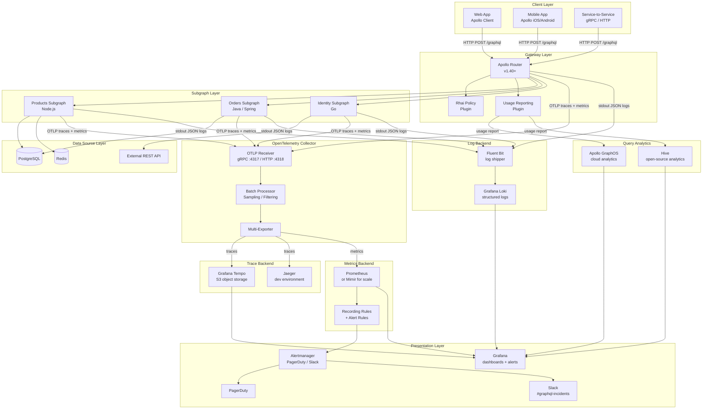

# 14 — Observability for GraphQL

> **Purpose**
> This document establishes the observability framework for enterprise GraphQL systems: the three pillars (traces, metrics, logs), query analytics as a GraphQL-specific fourth pillar, the tool stack that wires them together, and the four golden signals adapted for GraphQL's single-endpoint, variable-query-shape model. It is the entry point for the observability section and links to the five sub-documents that cover each concern in depth. Written for SREs, platform engineers, and senior engineers who own the reliability contract for a GraphQL API platform.

---

## Learning Objectives

After reading this document you will be able to:

1. Explain why GraphQL observability differs from REST observability and why standard APM tooling produces misleading signals without GraphQL-specific instrumentation.
2. Describe the four pillars of GraphQL observability and the role each plays in incident detection, diagnosis, and capacity planning.
3. Map the full observability stack from OpenTelemetry SDK in the application to dashboards and alerts in Grafana, Prometheus, and Apollo GraphOS / Hive.
4. Identify the key signals to instrument at the router layer, resolver layer, subgraph layer, and data-source layer.
5. Apply the four golden signals — latency, traffic, errors, saturation — to a federated GraphQL supergraph and explain how each must be decomposed by operation, field, and client.
6. Navigate the sub-documents in this section to implement each observability concern end to end.

---

## Why GraphQL Observability Is Unique

### The Single-Endpoint Problem

REST APIs expose hundreds or thousands of endpoints. Each endpoint maps to a single resource type, a predictable response shape, and a bounded set of upstream dependencies. APM agents can infer what an endpoint does from its URL and HTTP method. A `GET /orders/{id}` call that is slow implicates the order service database. The signal is legible without query analysis.

GraphQL exposes **one endpoint** (`POST /graphql`) for all operations. Every request arrives at the same URL with the same HTTP method. Without reading the `operationName` field and parsing the document, an APM agent cannot distinguish:

- A lightweight `{ viewer { id name } }` that touches one service
- A complex `{ orders { lineItems { product { reviews { author } } } } }` that fans out across five subgraphs and triggers 40 resolver calls

Standard APM tools that instrument at the HTTP layer see one "endpoint" with wildly varying latency and resource consumption. Percentile aggregations on this endpoint are meaningless. Mean latency is dominated by the shape of the query mix, not by system health.

### The Variable Query Shape Problem

In REST, the shape of a response is determined by the server: `GET /users/{id}` always returns the same fields. In GraphQL, the client specifies the exact shape. Two clients issuing `query { user(id: "1") }` can request completely different field sets. A user query that fetches only `id` and `name` costs one database read. The same query that fetches `id`, `name`, `orders`, and `orders.lineItems.product.reviews` costs five database reads and may cross four subgraph boundaries.

This means:

- **Latency cannot be attributed to an operation type alone.** You must instrument at the field level.
- **Error rates must be decomposed by field and subgraph**, not just by operation name.
- **Capacity planning requires query shape analysis**, not just request count trends.

### The Federated Supergraph Problem

In a federated architecture, a single client query is decomposed into N subgraph fetches by the query planner. A resolver that is slow may belong to a subgraph that the product team does not own. Tracing must be distributed — each subgraph fetch must be represented as a child span of the root operation span — and subgraph spans must be correlated by a trace ID that propagates across service boundaries.

---

## The Four Pillars of GraphQL Observability

### Pillar 1: Distributed Traces

Traces answer: **what happened during this specific request?**

A GraphQL trace must capture:

- The full operation document (hashed for PII compliance) or the `operationName`
- The query plan generated by the router
- Each subgraph fetch as a child span: timing, status, and the sub-query sent
- Each resolver invocation: field path, parent type, duration, error
- DataLoader batch boundaries: N+1 detection lives here
- Cache hits and misses at the resolver level

Traces are the primary diagnostic tool for latency incidents. Without resolver-level spans, it is impossible to determine which field in a complex query caused a p99 regression.

**Tool**: OpenTelemetry SDK (exporter) → Jaeger (development) or Tempo (production) → Grafana (UI).

### Pillar 2: Metrics

Metrics answer: **how is the system behaving in aggregate?**

Metrics are time-series data that enable alerting, SLO tracking, and capacity planning. GraphQL metrics must be labelled by:

- `operation_name` — the named operation from the client
- `operation_type` — `query`, `mutation`, `subscription`
- `client_id` — the originating client application
- `subgraph_name` — for per-subgraph metrics
- `field_path` — for resolver-level latency histograms (sampled, not every field)

**Tool**: OpenTelemetry metrics exporter → Prometheus (scrape) → Grafana (dashboards and alerting).

### Pillar 3: Structured Logs

Logs answer: **what are the details of specific events?**

GraphQL logs must be structured (JSON) and must include:

- `trace_id` and `span_id` for correlation with distributed traces
- `operation_name` and `operation_type`
- `client_id` and `client_version`
- Complexity score and depth
- Error codes and field paths for errors
- Subgraph name for subgraph-level events

Raw query documents must never be logged in production — they may contain PII in variable values. Log the document hash or the persisted operation ID instead.

**Tool**: Structured JSON logs → log shipper (Fluentd / Fluent Bit) → Loki or Elasticsearch → Grafana (LogQL) or Kibana.

### Pillar 4: Query Analytics

Query analytics answer: **what queries are clients sending, and how does the shape of the query population change over time?**

This pillar is unique to GraphQL and has no REST equivalent. Query analytics platforms (Apollo GraphOS Studio, Hive, Stellate) receive operation traces and provide:

- Operation-level latency breakdown across subgraphs
- Field usage statistics: which fields are queried by which clients
- Error rates by operation
- Schema change impact analysis: which clients use the fields you are considering removing
- Anomaly detection: new operation signatures that did not appear before a deployment

**Tool**: Apollo GraphOS (cloud-managed analytics) or Hive (open-source self-hosted) receiving usage reports from the router, aggregated by Apollo Router's built-in usage reporting plugin.

---

## Observability Stack Architecture

The following diagram shows how telemetry data flows from application code through the collection and storage layer to the presentation and alerting layer.



---

## Key Signals to Instrument

### Router Layer Signals

The router is the single chokepoint for all GraphQL traffic. It is the most important instrumentation target.

| Signal | Type | Labels | Use |
|--------|------|--------|-----|
| `graphql.router.request.duration` | Histogram | `operation_name`, `operation_type`, `client_id`, `http.status_code` | Overall API latency SLO |
| `graphql.router.request.total` | Counter | `operation_name`, `operation_type`, `client_id` | Traffic volume, change detection |
| `graphql.router.error.total` | Counter | `operation_name`, `error_code`, `client_id` | Error rate, alert threshold |
| `graphql.router.complexity` | Histogram | `client_id`, `operation_name` | Query cost distribution |
| `graphql.router.policy.violations` | Counter | `violation_type`, `client_id` | Security alerting |
| `graphql.router.cache.hit_ratio` | Gauge | `cache_type` (`document`, `plan`, `response`) | Cache effectiveness |
| `graphql.query_planning.duration` | Histogram | `operation_name` | Query planner cost |

### Subgraph Layer Signals

Each subgraph reports metrics independently, enabling per-domain health tracking.

| Signal | Type | Labels | Use |
|--------|------|--------|-----|
| `graphql.subgraph.request.duration` | Histogram | `subgraph_name`, `operation_name` | Per-subgraph latency |
| `graphql.subgraph.request.total` | Counter | `subgraph_name`, `http.status_code` | Subgraph traffic |
| `graphql.subgraph.error.total` | Counter | `subgraph_name`, `error_code` | Subgraph error rate |
| `graphql.resolver.duration` | Histogram | `parent_type`, `field_name`, `subgraph_name` | Hot field detection |
| `graphql.dataloader.batch_size` | Histogram | `loader_name`, `subgraph_name` | N+1 detection |
| `graphql.dataloader.cache_hit_ratio` | Gauge | `loader_name` | DataLoader efficiency |

### Data Source Layer Signals

Resolvers ultimately call databases or external APIs. Correlating these with resolver spans is critical for root-cause analysis.

| Signal | Type | Labels | Use |
|--------|------|--------|-----|
| `db.query.duration` | Histogram | `db_system`, `db_operation`, `db_name` | Database latency contribution |
| `db.connection_pool.size` | Gauge | `db_name`, `pool_state` (`idle`, `active`, `waiting`) | Connection saturation |
| `http.client.request.duration` | Histogram | `http.url`, `http.method`, `http.status_code` | Downstream API latency |
| `cache.operation.duration` | Histogram | `cache_system`, `operation` (`get`, `set`, `delete`) | Cache layer latency |

### Query Analytics Signals

These signals come from the Apollo GraphOS / Hive usage reporting plugin, not from OpenTelemetry.

| Signal | Platform | Use |
|--------|----------|-----|
| Field usage count by client | GraphOS / Hive | Safe schema evolution: which clients use a field before deprecation/removal |
| Operation latency by percentile | GraphOS / Hive | Long-term latency trends without Prometheus label explosion |
| Error rate by operation | GraphOS / Hive | Correlate errors with schema changes |
| New operation signature detection | GraphOS / Hive | Change management: detect client updates |
| Schema check violation trends | GraphOS / Hive | CI-time feedback loop |

---

## The Four Golden Signals for GraphQL

The four golden signals (latency, traffic, errors, saturation) originate from Google's SRE book. Each must be adapted for GraphQL's unique characteristics.

### Signal 1: Latency

**REST interpretation:** p50/p95/p99 latency for a specific endpoint URL.

**GraphQL adaptation:** Latency must be decomposed by operation name, not by URL. The router-level p99 is a composite of wildly different operation costs. A useful latency dashboard shows:

- p50/p95/p99 per named operation (top 20 by request volume)
- p50/p95/p99 per subgraph fetch (identifies which subgraph is the bottleneck)
- p50/p95/p99 per field resolver (sampled — only for fields with >1000 calls/min)
- Total operation latency broken down by stage: query planning, subgraph A, subgraph B, response serialization

**Key metric:** `graphql.router.request.duration` histogrammed by `operation_name`.

**SLO target example:**
```
p99(graphql.router.request.duration{operation_name!~"bulk.*"}) < 500ms
p99(graphql.router.request.duration{operation_name=~"bulk.*"}) < 5s
```

**Alert:** Fire when the p99 of any top-10 operation (by volume) increases by >50% compared to the same window 7 days ago. This catches regressions introduced by schema changes or infrastructure changes.

### Signal 2: Traffic

**REST interpretation:** Requests per second per endpoint.

**GraphQL adaptation:** Traffic in GraphQL has two relevant dimensions:

1. **Request rate** — operations per second by client and operation type. This drives horizontal scaling decisions for the router.
2. **Query cost rate** — complexity points consumed per second. This drives database and subgraph scaling decisions. Two requests with the same rate can have 10x different cost rates if the operation mix changes.

**Key metrics:**
- `rate(graphql.router.request.total[5m])` — overall request rate
- `rate(graphql.router.request.total[5m]) * avg(graphql.router.complexity)` — effective cost rate (approximate)
- `rate(graphql.subgraph.request.total[5m])` — per-subgraph fetch rate, which tracks fan-out

**SLO target example:** No explicit SLO on traffic, but capacity planning must maintain headroom such that cost rate < 70% of the tested maximum at p95 traffic.

**Alert:** Fire when the request rate increases by >300% in 5 minutes (possible load test, attack, or client loop). Fire when the cost rate exceeds the provisioned ceiling (possible query shape change).

### Signal 3: Errors

**REST interpretation:** HTTP 5xx rate per endpoint.

**GraphQL adaptation:** GraphQL errors are not correlated with HTTP status codes. The HTTP response is almost always `200 OK` even when the query returned errors. Error signals must come from the `errors` array in the response body, not from HTTP status.

There are two categories of GraphQL errors:

| Category | Example | Severity |
|----------|---------|----------|
| **Partial errors** | One field failed but others returned successfully | Lower — client receives partial data |
| **Complete errors** | Top-level `data: null` — no data returned | Higher — client received nothing |

Instrumentation must distinguish these. A partial error in a non-critical field (e.g., `user.avatarUrl`) is cosmetic. A complete error means the entire operation failed.

**Key metrics:**
- `rate(graphql.router.error.total{error_type="complete"}[5m])` — complete failures
- `rate(graphql.router.error.total{error_type="partial"}[5m])` — partial failures
- `rate(graphql.subgraph.error.total[5m])` by `subgraph_name` — root cause attribution
- `rate(graphql.router.error.total{error_code="UNAUTHENTICATED"}[5m])` — auth failures (security signal)

**SLO target example:**
```
error_ratio = rate(graphql.router.error.total{error_type="complete"}[5m])
            / rate(graphql.router.request.total[5m])
error_ratio < 0.001  (< 0.1% complete error rate)
```

**Alert:** Fire when complete error rate exceeds 0.1% for >2 minutes. Fire when any single subgraph error rate exceeds 1% (subgraph degradation).

### Signal 4: Saturation

**REST interpretation:** CPU and memory utilization on the API server.

**GraphQL adaptation:** GraphQL saturation has additional dimensions that REST does not:

1. **Router CPU** — dominated by query planning for complex federated queries. A spike in complex queries causes CPU saturation even at low request rates.
2. **Connection pool exhaustion** — each subgraph fetch opens a connection. Fan-out amplifies connection consumption. A query that touches 5 subgraphs uses 5 connections concurrently.
3. **DataLoader batch queue depth** — when DataLoader batches cannot drain fast enough, resolvers back up. This appears as increased p99 latency before it appears as errors.
4. **Subgraph queue depth** — if a subgraph is processing requests slower than they arrive, its queue grows. The router will hit the subgraph timeout before the subgraph responds.
5. **Persisted query / document cache fill rate** — a cold cache after a deployment causes a burst of cache misses and increased query planning latency.

**Key metrics:**
- `process_cpu_seconds_total` on router pods — query planning CPU
- `db.connection_pool.size{pool_state="waiting"}` — connection pressure
- `container_memory_working_set_bytes` on subgraph pods — memory pressure
- `graphql.dataloader.batch_size` histogram saturation — DataLoader throughput
- `graphql.router.cache.hit_ratio` — document and plan cache fill

**SLO target example:**
```
# Router must not run above 80% CPU at p95 load
avg(rate(process_cpu_seconds_total{app="apollo-router"}[5m])) < 0.80

# Connection pool waiting queue must be near zero at steady state
sum(db_connection_pool_size{pool_state="waiting"}) < 5
```

---

## Tool Stack Overview

### OpenTelemetry (OTel) — Instrumentation Foundation

OpenTelemetry is the vendor-neutral instrumentation layer. All telemetry — traces, metrics, and logs — is emitted in OTLP format and collected by an OTel Collector deployed as a DaemonSet (one per node) or as a sidecar.

Apollo Router has native OTLP support for traces and metrics. Subgraphs use the OTel SDK for their language (`@opentelemetry/sdk-node`, `opentelemetry-java-instrumentation`, `go.opentelemetry.io/otel`).

See [01-opentelemetry.md](./01-opentelemetry.md) for SDK setup, Collector configuration, sampling strategies, and trace context propagation across subgraph boundaries.

### Jaeger / Tempo — Distributed Trace Storage

- **Jaeger** is recommended for development environments and teams new to distributed tracing. Simple deployment, built-in UI, short retention.
- **Grafana Tempo** is recommended for production: scalable object-storage backend (S3 / GCS), deep Grafana integration, TraceQL query language for trace search and aggregation.

Both receive traces from the OTel Collector via OTLP. Tempo integrates with Grafana's "Explore" mode and enables trace-to-log and trace-to-metric correlation.

See [02-distributed-tracing.md](./02-distributed-tracing.md) for trace schema design, sampling strategies (tail-based vs head-based), TraceQL examples, and resolver span conventions.

### Prometheus — Metrics Storage and Alerting

Prometheus scrapes metrics from:
- Apollo Router (`/metrics` endpoint, Prometheus exposition format)
- Subgraph pods (via annotations `prometheus.io/scrape: "true"`)
- OTel Collector (forwarded metrics from OTLP)

For production scale (>1M series), use Grafana Mimir or Thanos as a Prometheus-compatible long-term storage backend.

Recording rules pre-compute expensive aggregations (per-operation latency percentiles) to keep dashboard queries fast. Alert rules fire on SLO burn rate exceeding thresholds.

See [03-metrics.md](./03-metrics.md) for the complete metric taxonomy, recording rules, Prometheus configuration, and Grafana dashboard JSON.

### Apollo GraphOS / Hive — Query Analytics

**Apollo GraphOS** (cloud-managed): The router sends usage reports (field-level traces anonymized for PII) to the GraphOS ingestion endpoint. GraphOS provides operation analytics, schema checks integrated with CI, field usage overlaid on the schema, and variant-level SLO tracking.

**Hive** (open-source, self-hosted): An open-source alternative to GraphOS for organizations that cannot send data to external systems. The Hive CDN serves the supergraph schema; the Hive analytics pipeline ingests usage reports from the router.

Both platforms are complements to Prometheus, not replacements. Prometheus covers system-level signals (latency, CPU, memory). GraphOS/Hive covers application-level signals (field usage, operation shapes, client behaviour).

See [04-query-analytics.md](./04-query-analytics.md) for GraphOS schema check CI integration, Hive deployment architecture, field usage analysis workflows, and deprecation management.

### Grafana — Unified Dashboards and Alerting

Grafana is the presentation layer. It queries all four backends:
- Prometheus (metrics and alerts)
- Tempo (traces, via TraceQL)
- Loki (structured logs, via LogQL)
- GraphOS / Hive (query analytics, via datasource plugins)

Grafana's unified alerting engine replaces the need for a separate Alertmanager in most deployments. Alerts are routed to PagerDuty (pages) and Slack (notifications).

See [05-slos-and-alerting.md](./05-slos-and-alerting.md) for SLO definitions, error budget burn rate alert rules, multi-window multi-burn-rate alerting configuration, and PagerDuty routing policy.

---

## Quick Reference: What to Instrument Where

```
Apollo Router (router.yaml telemetry block)
├── OTLP trace exporter → OTel Collector
├── Prometheus metrics exporter → :9090/metrics
├── Usage reporting plugin → GraphOS / Hive
└── Structured JSON logs → stdout → Fluent Bit → Loki

Each Subgraph (OTel SDK)
├── Auto-instrumentation: HTTP server, DB drivers, Redis client
├── Manual spans: resolver boundaries, DataLoader batch calls
├── OTLP trace exporter → OTel Collector
├── OTLP metrics exporter → OTel Collector → Prometheus
└── Structured JSON logs (pino / log4j2 / zap) → stdout → Fluent Bit → Loki

OTel Collector (DaemonSet)
├── Receivers: OTLP gRPC :4317, OTLP HTTP :4318
├── Processors: batch, memory_limiter, tail_sampling, attributes
└── Exporters: Tempo (traces), Prometheus remote_write (metrics), Loki (logs)
```

---

## Production Considerations

### Cardinality Management

High-cardinality labels in Prometheus cause series explosion. The most dangerous label candidates in GraphQL:

- `operation_name` — can be unbounded if clients use anonymous operations. Enforce `operationName` on all production clients.
- `client_id` — bounded by the number of registered clients. Safe if client registration is gated.
- `field_path` — never use as a Prometheus label for every field. Use query analytics platforms (GraphOS / Hive) for field-level granularity instead.
- `graphql.document` — never log or label with raw query documents. Hash them.

**Mitigation:** Use recording rules to pre-aggregate high-cardinality dimensions. Use exemplars (OTLP trace ID attached to histogram samples) to link aggregate metrics to individual traces without exploding cardinality.

### Tail Sampling for Cost Control

Sampling 100% of traces is expensive at scale. Apply tail-based sampling to capture:
- 100% of error traces
- 100% of traces exceeding the p99 latency threshold
- 100% of traces for new operation signatures (first 24 hours)
- 1% of healthy, low-latency traces (baseline for comparison)

Configure tail sampling in the OTel Collector, not in the application. The Collector sees the full trace before making sampling decisions.

### PII and Compliance

GraphQL variable values may contain PII (user IDs, email addresses, search queries). Policy:

- Never log raw variable values in production.
- Never include `graphql.document` span attributes in production traces if variables are inlined.
- Hash operation documents using SHA-256 and use the hash as the trace attribute.
- Use the persisted operation ID (registered hash) as the primary trace label.
- Scrub variable values in the OTel Collector using the `transform` processor before export to any backend.

### Multi-Region Observability

In a multi-region deployment (active-active or active-passive):
- Each region has its own OTel Collector and Prometheus instance.
- Grafana is deployed centrally and federated across all regional Prometheus instances using Prometheus federation or Mimir.
- Tempo is deployed per-region with cross-region trace search enabled via Tempo's global search API.
- Alerts are evaluated per-region; PagerDuty routing ensures the correct on-call team is paged.

---

## Best Practices

1. **Require `operationName` on all production clients.** Without named operations, traces are unattributable and metrics have no useful labels. Enforce this at the router level with a Rhai script that rejects anonymous operations in production.

2. **Separate SLOs by operation category.** A single latency SLO across all operations is meaningless. Define separate SLOs for: interactive queries (< 500ms p99), background queries (< 5s p99), mutations (< 1s p99), subscriptions (connection establishment < 2s p99).

3. **Instrument DataLoader boundaries explicitly.** Auto-instrumentation does not cross DataLoader batch boundaries. Add manual spans around `dataloader.loadMany()` calls and record batch size as a span attribute. This is the primary N+1 detection mechanism.

4. **Use exemplars to link metrics to traces.** Every histogram metric must have exemplars enabled. Exemplars carry a `trace_id` so that a spike in a Grafana dashboard can be clicked through to a representative trace in Tempo.

5. **Set up trace-to-log correlation.** Inject `trace_id` and `span_id` into every structured log line. Configure Loki derived fields to auto-link trace IDs in log lines to Tempo. This enables one-click navigation from a log line to its parent trace.

6. **Test your observability in the CI pipeline.** Deploy a test environment with the full observability stack (Prometheus, Tempo, Loki) and run contract tests that assert: (a) the router emits the expected metrics, (b) traces are exported to Tempo, (c) error cases produce the expected alert-level metrics.

7. **Budget for observability infrastructure.** At 10k RPS, a full observability stack (OTel Collector, Tempo, Prometheus, Loki, Grafana) requires approximately 50-100GB/day of storage. Budget compute and storage accordingly and set retention policies that match your incident review window (30 days for metrics, 7 days for traces, 14 days for logs).

---

## Anti-Patterns

**Using only HTTP-level metrics from a load balancer:**
A load balancer that reports `POST /graphql` as a single endpoint gives you request rate and p99 latency, but both are uninterpretable. You cannot detect a latency regression in one operation when other operations are masking it.

**Logging the full query document in production:**
Query documents may contain variable values with PII. Even without PII, logging full documents at scale produces enormous log volume. Use the operation name or document hash.

**Using a single Prometheus label for all error types:**
A counter `graphql_errors_total` without a `type` label cannot distinguish authentication failures (security signal) from validation errors (client bug) from resolver errors (infrastructure signal). Each error category requires a separate alert threshold.

**Alerting on every error:**
GraphQL partial errors are expected at low rates and may be cosmetic. Alerting on every `errors[]` response creates alert fatigue. Alert on complete errors (data: null) at a meaningful threshold, and on partial errors only for critical fields.

**Not instrumenting DataLoaders:**
Auto-instrumentation alone misses DataLoader batching. DataLoaders are the primary N+1 mitigation mechanism. Without DataLoader spans, a resolver latency spike caused by N+1 regression is invisible until it affects p99 latency at the operation level — which is too late.

**Deploying Prometheus without recording rules:**
Per-operation latency percentiles in Prometheus require `histogram_quantile()` over high-cardinality histograms. Without recording rules, every Grafana panel that calls this query re-computes it from raw samples. This is slow and expensive. Pre-compute percentiles as recording rules.

---

## Sub-Document Index

This section contains five sub-documents, each covering a specific observability concern in production depth:

| File | Topic |
|------|-------|
| [01-opentelemetry.md](./01-opentelemetry.md) | OTel SDK setup for router and subgraphs, Collector configuration, sampling, context propagation |
| [02-distributed-tracing.md](./02-distributed-tracing.md) | Trace schema, TraceQL, resolver spans, Tempo deployment, trace-to-log correlation |
| [03-metrics.md](./03-metrics.md) | Full metric taxonomy, recording rules, Prometheus configuration, Grafana dashboard JSON |
| [04-query-analytics.md](./04-query-analytics.md) | GraphOS and Hive setup, field usage analysis, schema change impact, CI integration |
| [05-slos-and-alerting.md](./05-slos-and-alerting.md) | SLO definitions, error budget burn rate alerting, PagerDuty routing, runbook links |

---

## Operational Notes

### On-Call Readiness Checklist

Before going on-call for a GraphQL platform, verify:

```
[ ] Grafana dashboards load cleanly (no "No data" panels)
[ ] Tempo trace search returns results for the last hour
[ ] Prometheus targets are all UP (check /targets)
[ ] Alert rules are evaluating (check /rules)
[ ] PagerDuty integration is tested (fire a test alert)
[ ] Runbook links in alerts are accessible
[ ] GraphOS / Hive analytics show current traffic (not stale)
[ ] Log shipper is running and Loki has recent logs
```

### Incident Diagnosis Flow

When an alert fires:

1. **Identify scope**: Is it all operations or one? One subgraph or all? One client or all?
2. **Latency or error?**: Check the router p99 latency dashboard first. If latency is elevated, go to the subgraph latency breakdown. If errors are elevated, go to the error type breakdown.
3. **Correlate with changes**: Check deployment events on the Grafana dashboard. Did a subgraph deploy in the last 30 minutes?
4. **Trace to resolver**: Click an exemplar from the latency histogram to open a representative trace in Tempo. Identify the slow span (subgraph fetch or resolver).
5. **Log correlation**: From the slow span, click through to the correlated log lines in Loki. Look for database query warnings, lock wait events, or external API timeouts.
6. **Confirm and mitigate**: Confirm the root cause, apply mitigation (rollback, scale, circuit break), and update the incident timeline.

---

## References

- [OpenTelemetry Specification](https://opentelemetry.io/docs/specs/otel/)
- [Apollo Router Telemetry Configuration](https://www.apollographql.com/docs/router/configuration/telemetry/overview)
- [Apollo GraphOS Schema Checks](https://www.apollographql.com/docs/graphos/schema-checks)
- [Grafana Tempo Documentation](https://grafana.com/docs/tempo/latest/)
- [Grafana Loki Documentation](https://grafana.com/docs/loki/latest/)
- [Prometheus Operator](https://prometheus-operator.dev/)
- [OpenTelemetry Collector Configuration](https://opentelemetry.io/docs/collector/configuration/)
- [Hive — Open-Source GraphQL Analytics](https://the-guild.dev/graphql/hive)
- [Google SRE Book — Four Golden Signals](https://sre.google/sre-book/monitoring-distributed-systems/)
- [Grafana Mimir](https://grafana.com/docs/mimir/latest/)

---

## Related Topics

- [Security Overview](../../05-security/README.md) — Auth, PII handling, and threat model (relevant to log scrubbing)
- [Performance and Scaling](../../06-performance-and-scaling/README.md) — Caching and query planning (feeds into saturation signal)
- [Federation](../../07-federation/README.md) — Subgraph architecture (defines distributed trace topology)
- [Runtime Policies](../../13-policy-as-code/03-runtime-policies.md) — Complexity limits and rate limiting (policy violation metrics)
- [CI/CD Automation](../../11-ci-cd-automation/README.md) — Schema checks and deployment gates (observability in CI)
- [Incident Management](../../33-incident-management/README.md) — Incident response using observability signals
- [SLOs and Alerting](./05-slos-and-alerting.md) — Detailed SLO definitions and alert rule configuration
