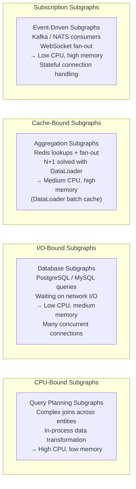

# Subgraph Deployment Patterns

> Each subgraph is an independently deployed service. The deployment manifest for a subgraph is not a copy of the router manifest with different names — subgraphs have different resource profiles, different health check semantics, different scaling behaviors, and different security requirements. This document treats each subgraph as a production microservice deserving its own deployment specification.

---

## Learning Objectives

- [ ] Write a production Kubernetes Deployment manifest for a GraphQL subgraph
- [ ] Size CPU and memory resources correctly for CPU-bound vs I/O-bound subgraph workloads
- [ ] Configure liveness and readiness probes that account for GraphQL's `/_health` vs introspection behavior
- [ ] Apply the OTel sidecar, Vault agent sidecar, and Envoy sidecar patterns
- [ ] Design a namespace strategy that gives each domain team operational autonomy
- [ ] Write NetworkPolicy that allows only the router to reach a subgraph
- [ ] Configure RBAC so a subgraph's ServiceAccount has minimum required Kubernetes permissions

---

## Subgraph Resource Profiles

GraphQL subgraphs are not homogeneous. Two subgraphs in the same supergraph can have radically different resource profiles based on what they do:



| Subgraph Type | CPU Request | CPU Limit | Memory Request | Memory Limit | Notes |
|---------------|-------------|-----------|----------------|--------------|-------|
| Simple CRUD (REST passthrough) | 100m | 500m | 128Mi | 256Mi | Mostly I/O wait |
| Database-heavy (complex joins) | 250m | 1000m | 256Mi | 512Mi | CPU for serialization |
| DataLoader-heavy (N+1 resolution) | 500m | 2000m | 512Mi | 1Gi | Memory for batch cache |
| Subscription handler | 200m | 500m | 512Mi | 2Gi | Memory for open connections |
| In-process transformation | 500m | 4000m | 256Mi | 512Mi | CPU burst for computation |

---

## Base Subgraph Deployment Manifest

This manifest is the canonical template for a production subgraph deployment. The comments explain every non-obvious field.

```yaml
# manifests/subgraphs/products/deployment.yaml
apiVersion: apps/v1
kind: Deployment
metadata:
  name: products-subgraph
  namespace: team-products
  labels:
    app.kubernetes.io/name: products-subgraph
    app.kubernetes.io/component: subgraph
    app.kubernetes.io/part-of: graphql-platform
    app.kubernetes.io/version: "2.14.3"
    # Domain label used by NetworkPolicy to identify subgraph namespaces
    graphql-platform/role: subgraph
    graphql-platform/subgraph: products
  annotations:
    argocd.argoproj.io/sync-wave: "5"   # Deploy subgraphs before router (wave 10)
spec:
  replicas: 3
  selector:
    matchLabels:
      app.kubernetes.io/name: products-subgraph
  strategy:
    type: RollingUpdate
    rollingUpdate:
      maxUnavailable: 1
      maxSurge: 1

  template:
    metadata:
      labels:
        app.kubernetes.io/name: products-subgraph
        app.kubernetes.io/component: subgraph
        graphql-platform/subgraph: products
      annotations:
        prometheus.io/scrape: "true"
        prometheus.io/port: "9090"
        prometheus.io/path: "/metrics"
        checksum/config: "{{ sha256sum (print .Values.config) }}"

    spec:
      serviceAccountName: products-subgraph

      # ── Containers ─────────────────────────────────────────────────────────
      containers:
        - name: products-subgraph
          image: your-registry.io/products-subgraph:2.14.3
          imagePullPolicy: IfNotPresent

          ports:
            - name: http
              containerPort: 4002
              protocol: TCP
            - name: metrics
              containerPort: 9090
              protocol: TCP

          env:
            - name: PORT
              value: "4002"
            - name: NODE_ENV
              value: "production"
            - name: DATABASE_URL
              valueFrom:
                secretKeyRef:
                  name: products-db-credentials
                  key: url
            - name: REDIS_URL
              valueFrom:
                secretKeyRef:
                  name: products-redis-credentials
                  key: url
            # Downward API: inject pod identity for structured logging and tracing
            - name: POD_NAME
              valueFrom:
                fieldRef:
                  fieldPath: metadata.name
            - name: POD_NAMESPACE
              valueFrom:
                fieldRef:
                  fieldPath: metadata.namespace
            - name: NODE_NAME
              valueFrom:
                fieldRef:
                  fieldPath: spec.nodeName
            # OpenTelemetry exporter endpoint
            - name: OTEL_EXPORTER_OTLP_ENDPOINT
              value: "http://otel-collector.observability.svc.cluster.local:4317"
            - name: OTEL_SERVICE_NAME
              value: "products-subgraph"
            - name: OTEL_RESOURCE_ATTRIBUTES
              value: "k8s.pod.name=$(POD_NAME),k8s.namespace.name=$(POD_NAMESPACE),k8s.node.name=$(NODE_NAME)"

          resources:
            requests:
              cpu: "250m"
              memory: "256Mi"
            limits:
              cpu: "1000m"
              memory: "512Mi"

          # ── Readiness Probe ───────────────────────────────────────────────
          # The subgraph is ready when it can serve GraphQL operations.
          # Use a dedicated /_health endpoint rather than the GraphQL endpoint:
          # sending a GraphQL introspection query as a probe has overhead and
          # exposes introspection even when it is disabled in production.
          readinessProbe:
            httpGet:
              path: /_health/ready
              port: http
            initialDelaySeconds: 5
            periodSeconds: 5
            timeoutSeconds: 3
            successThreshold: 1
            failureThreshold: 3

          # ── Liveness Probe ────────────────────────────────────────────────
          # The process is alive if it responds. Use the liveness endpoint
          # (not readiness) so a healthy-but-temporarily-degraded pod is not
          # killed during a database connection pool saturation event.
          livenessProbe:
            httpGet:
              path: /_health/live
              port: http
            initialDelaySeconds: 15
            periodSeconds: 10
            timeoutSeconds: 5
            failureThreshold: 3

          startupProbe:
            httpGet:
              path: /_health/live
              port: http
            initialDelaySeconds: 5
            periodSeconds: 5
            failureThreshold: 18   # 18 * 5s = 90 seconds for slow startup (schema loading)

          lifecycle:
            preStop:
              exec:
                command: ["/bin/sh", "-c", "sleep 10"]

          securityContext:
            allowPrivilegeEscalation: false
            readOnlyRootFilesystem: true
            capabilities:
              drop:
                - ALL
            runAsNonRoot: true
            runAsUser: 1000

          volumeMounts:
            - name: tmp
              mountPath: /tmp
            - name: app-config
              mountPath: /app/config
              readOnly: true

      # ── Affinity ──────────────────────────────────────────────────────────
      affinity:
        podAntiAffinity:
          requiredDuringSchedulingIgnoredDuringExecution:
            - labelSelector:
                matchLabels:
                  app.kubernetes.io/name: products-subgraph
              topologyKey: kubernetes.io/hostname
          preferredDuringSchedulingIgnoredDuringExecution:
            - weight: 100
              podAffinityTerm:
                labelSelector:
                  matchLabels:
                    app.kubernetes.io/name: products-subgraph
                topologyKey: topology.kubernetes.io/zone

      topologySpreadConstraints:
        - maxSkew: 1
          topologyKey: topology.kubernetes.io/zone
          whenUnsatisfiable: ScheduleAnyway   # For subgraphs, prefer spreading but don't block
          labelSelector:
            matchLabels:
              app.kubernetes.io/name: products-subgraph

      securityContext:
        runAsNonRoot: true
        runAsUser: 1000
        fsGroup: 1000
        seccompProfile:
          type: RuntimeDefault

      terminationGracePeriodSeconds: 30

      volumes:
        - name: tmp
          emptyDir: {}
        - name: app-config
          configMap:
            name: products-subgraph-config
```

---

## Health Check Endpoints for GraphQL Services

GraphQL services present a challenge for standard Kubernetes health probes: the GraphQL endpoint (`/graphql`) is designed for operations, not health checks. Using it as a probe has several problems:

1. **Introspection overhead**: If the probe sends an introspection query, it runs the schema introspection algorithm on every probe cycle.
2. **Disabled introspection**: If introspection is disabled in production (it should be), probes using introspection will fail.
3. **Database coupling**: A readiness probe that queries the database couples Kubernetes scheduling decisions to database availability.

The correct pattern is to implement dedicated health endpoints that return quickly and check only what Kubernetes needs to know:

```typescript
// health-check.ts — implement these three endpoints in every GraphQL subgraph

import express from 'express';
import { checkDatabaseConnection } from './database';
import { schema } from './schema';

const healthRouter = express.Router();

// ── Liveness: is the process alive? ────────────────────────────────────────
// Return 200 if the process is running. Never check external dependencies here.
// A liveness failure causes Kubernetes to restart the pod.
// Only fail liveness if the process is in an unrecoverable state.
healthRouter.get('/live', (_req, res) => {
  res.status(200).json({ status: 'pass', timestamp: new Date().toISOString() });
});

// ── Readiness: can the pod serve traffic? ───────────────────────────────────
// Return 200 only when the subgraph is fully initialized and ready.
// A readiness failure removes the pod from the Service endpoint slice.
// Fail readiness if the schema is not loaded or database is unreachable.
healthRouter.get('/ready', async (_req, res) => {
  const checks: Record<string, string> = {};

  // 1. Schema loaded
  checks.schema = schema ? 'pass' : 'fail';

  // 2. Database reachable (lightweight ping, not a full query)
  try {
    await checkDatabaseConnection();
    checks.database = 'pass';
  } catch (err) {
    checks.database = 'fail';
  }

  const allPass = Object.values(checks).every(v => v === 'pass');
  res.status(allPass ? 200 : 503).json({
    status: allPass ? 'pass' : 'fail',
    checks,
    timestamp: new Date().toISOString(),
  });
});

// ── Startup: has the application completed initialization? ──────────────────
// Optional third endpoint for applications with slow startup (schema loading,
// cache warming). Use as the startupProbe target.
let startupComplete = false;

export function markStartupComplete() {
  startupComplete = true;
}

healthRouter.get('/startup', (_req, res) => {
  res.status(startupComplete ? 200 : 503).json({
    status: startupComplete ? 'pass' : 'starting',
    timestamp: new Date().toISOString(),
  });
});

export { healthRouter };
```

Register the health router before the GraphQL endpoint so health checks are always reachable:

```typescript
// server.ts
app.use('/_health', healthRouter);
app.use('/graphql', graphqlHandler);
```

---

## Sidecar Patterns

### OTel Agent Sidecar

For subgraphs that use languages without a robust OpenTelemetry SDK, or for centralized OTel configuration, run the OTel collector as a sidecar:

```yaml
# Add to the containers array in the Deployment spec
- name: otel-agent
  image: otel/opentelemetry-collector-contrib:0.100.0
  args:
    - "--config=/etc/otel/config.yaml"
  ports:
    - containerPort: 4317   # OTLP gRPC (subgraph → agent)
      name: otlp-grpc
    - containerPort: 4318   # OTLP HTTP (subgraph → agent)
      name: otlp-http
  resources:
    requests:
      cpu: "50m"
      memory: "64Mi"
    limits:
      cpu: "200m"
      memory: "128Mi"
  volumeMounts:
    - name: otel-config
      mountPath: /etc/otel
      readOnly: true

# Add to volumes:
- name: otel-config
  configMap:
    name: otel-agent-config
```

OTel agent ConfigMap:

```yaml
apiVersion: v1
kind: ConfigMap
metadata:
  name: otel-agent-config
  namespace: team-products
data:
  config.yaml: |
    receivers:
      otlp:
        protocols:
          grpc:
            endpoint: 0.0.0.0:4317
          http:
            endpoint: 0.0.0.0:4318

    processors:
      batch:
        timeout: 5s
        send_batch_size: 512
      resource:
        attributes:
          - key: k8s.cluster.name
            value: production-us-east-1
            action: upsert

    exporters:
      otlp:
        endpoint: otel-collector.observability.svc.cluster.local:4317
        tls:
          insecure: true

    service:
      pipelines:
        traces:
          receivers: [otlp]
          processors: [batch, resource]
          exporters: [otlp]
        metrics:
          receivers: [otlp]
          processors: [batch, resource]
          exporters: [otlp]
```

### Vault Agent Sidecar

For dynamic secret injection without ExternalSecret Operator:

```yaml
# Pod annotations for Vault Agent injection
metadata:
  annotations:
    vault.hashicorp.com/agent-inject: "true"
    vault.hashicorp.com/agent-inject-status: "update"
    vault.hashicorp.com/role: "products-subgraph"
    vault.hashicorp.com/agent-inject-secret-db-credentials: "secret/team-products/database"
    vault.hashicorp.com/agent-inject-template-db-credentials: |
      {{- with secret "secret/team-products/database" -}}
      DATABASE_URL={{ .Data.data.url }}
      DATABASE_PASSWORD={{ .Data.data.password }}
      {{- end }}
    # The secret is written to /vault/secrets/db-credentials
    # Source it in the container's entrypoint script
```

---

## Subgraph Service Manifest

```yaml
# manifests/subgraphs/products/service.yaml
apiVersion: v1
kind: Service
metadata:
  name: products-subgraph
  namespace: team-products
  labels:
    app.kubernetes.io/name: products-subgraph
    graphql-platform/role: subgraph
    graphql-platform/subgraph: products
spec:
  type: ClusterIP
  selector:
    app.kubernetes.io/name: products-subgraph
  ports:
    - name: http
      port: 4002
      targetPort: http
      protocol: TCP
    - name: metrics
      port: 9090
      targetPort: metrics
      protocol: TCP
```

---

## Namespace Strategy in Detail

### Per-Team Namespace with ResourceQuota

Each team namespace gets a ResourceQuota to prevent runaway pods from consuming cluster resources:

```yaml
# manifests/namespaces/team-products-namespace.yaml
apiVersion: v1
kind: Namespace
metadata:
  name: team-products
  labels:
    kubernetes.io/metadata.name: team-products
    graphql-platform/role: subgraph
    team: products

---
apiVersion: v1
kind: ResourceQuota
metadata:
  name: team-products-quota
  namespace: team-products
spec:
  hard:
    # Compute
    requests.cpu: "4"
    limits.cpu: "16"
    requests.memory: "4Gi"
    limits.memory: "16Gi"
    # Object counts
    pods: "20"
    services: "10"
    secrets: "20"
    configmaps: "20"
    persistentvolumeclaims: "5"

---
# LimitRange sets default resource requests/limits for pods that omit them.
# Prevents subgraph teams from deploying pods with no resource constraints.
apiVersion: v1
kind: LimitRange
metadata:
  name: team-products-limits
  namespace: team-products
spec:
  limits:
    - type: Container
      default:
        cpu: "500m"
        memory: "256Mi"
      defaultRequest:
        cpu: "100m"
        memory: "128Mi"
      max:
        cpu: "4"
        memory: "4Gi"
      min:
        cpu: "50m"
        memory: "64Mi"
    - type: Pod
      max:
        cpu: "8"
        memory: "8Gi"
```

---

## NetworkPolicy for Subgraphs

```yaml
# manifests/subgraphs/products/networkpolicy.yaml
apiVersion: networking.k8s.io/v1
kind: NetworkPolicy
metadata:
  name: products-subgraph
  namespace: team-products
spec:
  podSelector:
    matchLabels:
      app.kubernetes.io/name: products-subgraph

  policyTypes:
    - Ingress
    - Egress

  ingress:
    # ONLY the Apollo Router namespace can reach the subgraph on the GraphQL port.
    # This is the critical isolation boundary — subgraphs must not be reachable
    # from other subgraph namespaces or from the internet.
    - from:
        - namespaceSelector:
            matchLabels:
              kubernetes.io/metadata.name: graphql-platform
          podSelector:
            matchLabels:
              app.kubernetes.io/name: apollo-router
      ports:
        - port: 4002
          protocol: TCP
    # Prometheus scraping from observability namespace
    - from:
        - namespaceSelector:
            matchLabels:
              kubernetes.io/metadata.name: observability
      ports:
        - port: 9090
          protocol: TCP

  egress:
    # Database access (within the same namespace or a dedicated data namespace)
    - to:
        - namespaceSelector:
            matchLabels:
              kubernetes.io/metadata.name: data-platform
      ports:
        - port: 5432   # PostgreSQL
          protocol: TCP
        - port: 6379   # Redis
          protocol: TCP
    # DNS resolution
    - to:
        - namespaceSelector:
            matchLabels:
              kubernetes.io/metadata.name: kube-system
      ports:
        - port: 53
          protocol: UDP
        - port: 53
          protocol: TCP
    # OpenTelemetry export
    - to:
        - namespaceSelector:
            matchLabels:
              kubernetes.io/metadata.name: observability
      ports:
        - port: 4317
          protocol: TCP
    # External API calls (e.g., payment processor, tax service)
    # Be explicit about what external services this subgraph is allowed to reach
    - to:
        - ipBlock:
            cidr: 0.0.0.0/0
            except:
              - 10.0.0.0/8
              - 172.16.0.0/12
              - 192.168.0.0/16
      ports:
        - port: 443
          protocol: TCP
```

---

## RBAC for Subgraph ServiceAccounts

```yaml
# manifests/subgraphs/products/rbac.yaml
apiVersion: v1
kind: ServiceAccount
metadata:
  name: products-subgraph
  namespace: team-products
  labels:
    app.kubernetes.io/name: products-subgraph
  annotations:
    # AWS IRSA — access S3 for product images, Secrets Manager for credentials
    eks.amazonaws.com/role-arn: arn:aws:iam::123456789012:role/team-products-subgraph
    # Vault binding — Vault authenticates this pod via Kubernetes JWT
    vault.hashicorp.com/role: "products-subgraph"

---
# The subgraph needs to read its own ConfigMap at runtime (for hot-reload config).
# It does not need broader cluster access.
apiVersion: rbac.authorization.k8s.io/v1
kind: Role
metadata:
  name: products-subgraph
  namespace: team-products
rules:
  - apiGroups: [""]
    resources: ["configmaps"]
    resourceNames: ["products-subgraph-config"]   # Restrict to specific ConfigMap
    verbs: ["get", "watch", "list"]
  # If using leader election for subscription handlers:
  # - apiGroups: ["coordination.k8s.io"]
  #   resources: ["leases"]
  #   verbs: ["get", "create", "update"]

---
apiVersion: rbac.authorization.k8s.io/v1
kind: RoleBinding
metadata:
  name: products-subgraph
  namespace: team-products
subjects:
  - kind: ServiceAccount
    name: products-subgraph
    namespace: team-products
roleRef:
  kind: Role
  apiGroup: rbac.authorization.k8s.io
  name: products-subgraph
```

---

## Service Mesh Integration

When running Istio or Linkerd as a service mesh, subgraph deployments need small adjustments:

### Istio Sidecar Configuration

```yaml
# Add to Deployment pod template annotations
metadata:
  annotations:
    # Exclude health check port from Envoy proxy to allow direct kubelet access
    traffic.sidecar.istio.io/excludeInboundPorts: "8088"
    # Exclude the OTel sidecar port from Istio's mTLS (OTel sidecar handles its own auth)
    traffic.sidecar.istio.io/excludeOutboundPorts: "4317"
    # Opt in to Istio ambient mesh (if using ambient instead of sidecar mode)
    # ambient.istio.io/redirection: enabled

---
# PeerAuthentication: require mTLS for all inter-pod communication in the namespace
apiVersion: security.istio.io/v1
kind: PeerAuthentication
metadata:
  name: team-products-mtls
  namespace: team-products
spec:
  mtls:
    mode: STRICT

---
# AuthorizationPolicy: only the router ServiceAccount can call the products subgraph
apiVersion: security.istio.io/v1
kind: AuthorizationPolicy
metadata:
  name: products-subgraph-allow-router
  namespace: team-products
spec:
  selector:
    matchLabels:
      app.kubernetes.io/name: products-subgraph
  rules:
    - from:
        - source:
            principals:
              - "cluster.local/ns/graphql-platform/sa/apollo-router"
      to:
        - operation:
            methods: ["POST"]
            paths: ["/graphql"]
    - from:
        - source:
            principals:
              - "cluster.local/ns/observability/sa/prometheus"
      to:
        - operation:
            methods: ["GET"]
            paths: ["/metrics"]
```

---

## Deployment Topology for Subscription Subgraphs

Subscription subgraphs are stateful in one sense: they maintain open WebSocket or SSE connections. This affects their deployment topology:

```yaml
# For a subscription subgraph, prefer fewer replicas with more memory
# rather than many replicas with less memory.
# Each replica holds a set of open subscriptions in memory.
# The router load-balances subscription setup across replicas.

spec:
  replicas: 2   # Start with fewer replicas; scale based on active subscription count
  strategy:
    type: RollingUpdate
    rollingUpdate:
      # Minimize unavailability during rolling updates — each unavailable pod
      # drops its active subscriptions, causing client reconnect events
      maxUnavailable: 0    # Zero-downtime rolling update
      maxSurge: 1          # New pod is ready before old pod is terminated

  template:
    spec:
      containers:
        - name: orders-subscription-subgraph
          resources:
            requests:
              cpu: "200m"
              memory: "512Mi"
            limits:
              cpu: "500m"
              memory: "2Gi"   # Higher memory for in-memory subscription state

          env:
            # Limit concurrent subscriptions per pod to prevent OOM
            - name: MAX_SUBSCRIPTIONS_PER_POD
              value: "5000"
            # Connection timeout for idle subscriptions
            - name: SUBSCRIPTION_IDLE_TIMEOUT_MS
              value: "300000"   # 5 minutes

      # Longer termination grace period to allow subscriptions to drain
      terminationGracePeriodSeconds: 60
```

---

## Best Practices

1. **Never share a ServiceAccount across subgraphs.** Each subgraph's ServiceAccount should have permissions scoped to exactly what that subgraph needs. A compromised products subgraph should not be able to read the orders subgraph's secrets.

2. **Use separate ExternalSecrets per subgraph.** One ExternalSecret per subgraph, referencing that subgraph's Vault path. Do not create a single shared secret that all subgraphs read.

3. **Set `readOnlyRootFilesystem: true`.** Most GraphQL subgraph runtimes (Node.js, Go, JVM) do not need to write to the container filesystem at runtime. Mounting `/tmp` as an `emptyDir` handles any temporary file needs.

4. **Implement both `/live` and `/ready` health endpoints.** The distinction matters: a pod with a full connection pool should fail readiness (remove it from the load balancer) but not liveness (do not restart it). Restarting the pod does not fix connection pool exhaustion; removing it from load balancing does.

5. **Label namespaces with `graphql-platform/role: subgraph`.** The router's NetworkPolicy uses this label to allow egress to all subgraph namespaces. Adding a new subgraph only requires labeling its namespace — no NetworkPolicy update.

---

## References

- [Kubernetes NetworkPolicy](https://kubernetes.io/docs/concepts/services-networking/network-policies/)
- [Kubernetes ResourceQuota](https://kubernetes.io/docs/concepts/policy/resource-quotas/)
- [Istio AuthorizationPolicy](https://istio.io/latest/docs/reference/config/security/authorization-policy/)
- [OpenTelemetry Collector sidecar](https://opentelemetry.io/docs/collector/deployment/agent/)
- [Apollo Router subscription support](https://www.apollographql.com/docs/router/executing-operations/subscription-support/)

---

## Related Topics

- [01-apollo-router-deployment.md](./01-apollo-router-deployment.md) — the router that calls these subgraph Services
- [03-ingress-and-gateway.md](./03-ingress-and-gateway.md) — why subgraphs should not be directly exposed via Ingress
- [04-autoscaling.md](./04-autoscaling.md) — HPA and KEDA for subgraph scaling
