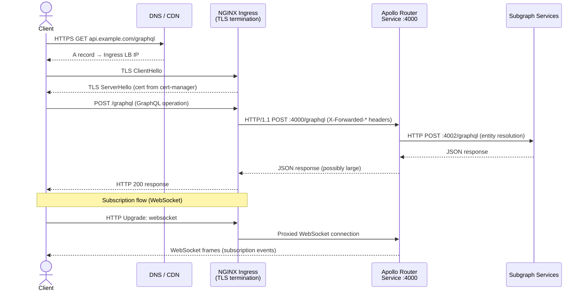
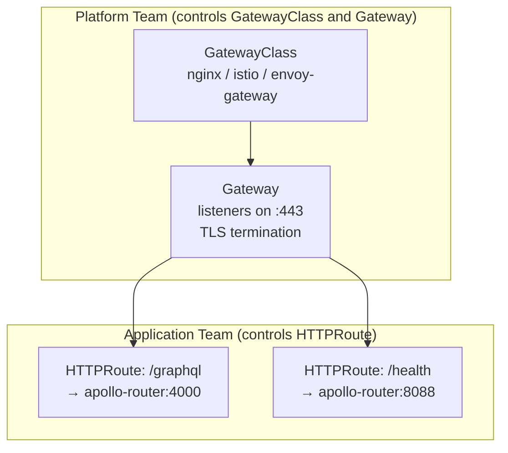

# Ingress and Gateway Configuration for GraphQL

> GraphQL is not REST. The Ingress configuration that works for a JSON API does not work unchanged for GraphQL. Three properties of GraphQL change the ingress calculus: all operations share a single endpoint (path-based routing is not the primary traffic shaper), subscriptions require WebSocket or SSE upgrades (most default ingress configurations reject these), and query planning can produce large payloads that default response size limits reject. Every setting in this document exists because of one of those three properties.

---

## Learning Objectives

- [ ] Configure NGINX Ingress annotations for WebSocket upgrade required by GraphQL subscriptions
- [ ] Set request and response timeouts appropriate for GraphQL long-polling and streaming
- [ ] Implement rate limiting at the ingress layer without breaking the single-endpoint model
- [ ] Terminate TLS with cert-manager and configure HSTS for GraphQL clients
- [ ] Route traffic to router vs Studio vs metrics endpoints via path-based rules
- [ ] Understand the AWS ALB, GCP GLBC, and Azure Application Gateway equivalents
- [ ] Evaluate Kubernetes Gateway API as the forward-compatible alternative to Ingress

---

## Traffic Flow Through Ingress



---

## NGINX Ingress Configuration

### Base GraphQL Ingress

```yaml
# manifests/ingress/graphql-ingress.yaml
apiVersion: networking.k8s.io/v1
kind: Ingress
metadata:
  name: graphql-api
  namespace: graphql-platform
  annotations:
    # ── Ingress class ───────────────────────────────────────────────────────
    kubernetes.io/ingress.class: "nginx"
    # Or using IngressClass resource (Kubernetes 1.18+):
    # ingressClassName: nginx

    # ── TLS and certificate management ─────────────────────────────────────
    cert-manager.io/cluster-issuer: "letsencrypt-production"
    # cert-manager.io/cluster-issuer: "internal-ca"   # For private internal endpoints

    # ── WebSocket support (required for GraphQL subscriptions) ─────────────
    # These two annotations together enable WebSocket proxying through NGINX.
    # Without them, subscription connections are rejected with HTTP 400.
    nginx.ingress.kubernetes.io/proxy-read-timeout: "3600"    # 1 hour for WebSocket
    nginx.ingress.kubernetes.io/proxy-send-timeout: "3600"
    nginx.ingress.kubernetes.io/proxy-http-version: "1.1"
    nginx.ingress.kubernetes.io/configuration-snippet: |
      proxy_set_header Upgrade $http_upgrade;
      proxy_set_header Connection $connection_upgrade;

    # ── Request / Response sizing ───────────────────────────────────────────
    # GraphQL queries can be large (deep fragments, inline variables).
    # GraphQL responses can be very large (list operations over large datasets).
    # Default NGINX client body size is 1MB — too small for many GraphQL operations.
    nginx.ingress.kubernetes.io/proxy-body-size: "10m"
    # Buffer settings for large responses from the router
    nginx.ingress.kubernetes.io/proxy-buffer-size: "128k"
    nginx.ingress.kubernetes.io/proxy-buffers-number: "8"

    # ── Timeouts for standard GraphQL operations ────────────────────────────
    # 30s covers the vast majority of GraphQL operations including slow N+1 resolvers.
    # Long-polling clients (subscriptions over HTTP SSE) use the read timeout above.
    nginx.ingress.kubernetes.io/proxy-connect-timeout: "5"    # Connection to router backend
    nginx.ingress.kubernetes.io/proxy-next-upstream-timeout: "10"

    # ── Rate limiting ───────────────────────────────────────────────────────
    # Rate limiting at the Ingress layer is coarse-grained (per source IP).
    # Fine-grained operation-level rate limiting belongs in the router (router.yaml).
    # Use Ingress rate limiting as a DDoS mitigation layer only.
    nginx.ingress.kubernetes.io/limit-connections: "100"      # Max concurrent connections per IP
    nginx.ingress.kubernetes.io/limit-rps: "50"               # Max requests per second per IP
    nginx.ingress.kubernetes.io/limit-rpm: "1000"             # Max requests per minute per IP
    # Whitelist internal IPs from rate limiting
    nginx.ingress.kubernetes.io/limit-whitelist: "10.0.0.0/8,172.16.0.0/12"

    # ── Security headers ────────────────────────────────────────────────────
    nginx.ingress.kubernetes.io/configuration-snippet: |
      more_set_headers "Strict-Transport-Security: max-age=31536000; includeSubDomains; preload";
      more_set_headers "X-Frame-Options: DENY";
      more_set_headers "X-Content-Type-Options: nosniff";
      more_set_headers "Referrer-Policy: strict-origin-when-cross-origin";
      more_set_headers "Permissions-Policy: geolocation=(), camera=(), microphone=()";
      # Remove server version disclosure
      more_clear_headers "X-Powered-By";
      more_clear_headers "Server";

    # ── Real IP preservation ────────────────────────────────────────────────
    # GraphQL router uses client IP for rate limiting and fraud detection.
    nginx.ingress.kubernetes.io/use-forwarded-headers: "true"
    nginx.ingress.kubernetes.io/forwarded-for-header: "X-Forwarded-For"
    nginx.ingress.kubernetes.io/compute-full-forwarded-for: "true"

spec:
  ingressClassName: nginx

  tls:
    - hosts:
        - api.example.com
      secretName: graphql-api-tls   # Managed by cert-manager

  rules:
    # ── Primary GraphQL endpoint ────────────────────────────────────────────
    - host: api.example.com
      http:
        paths:
          - path: /graphql
            pathType: Prefix
            backend:
              service:
                name: apollo-router
                port:
                  name: http

          # ── Metrics endpoint (internal access only) ─────────────────────
          # Route /metrics to the router metrics port.
          # This path should be protected by network controls — not exposed to the internet.
          - path: /metrics
            pathType: Exact
            backend:
              service:
                name: apollo-router
                port:
                  name: metrics

          # ── Health check endpoint ───────────────────────────────────────
          # Expose /health for external health monitoring (e.g., AWS Route 53 health checks,
          # Pingdom, Datadog Synthetics)
          - path: /health
            pathType: Prefix
            backend:
              service:
                name: apollo-router
                port:
                  name: health
```

### Internal Ingress for Apollo Studio Proxy

For environments where Apollo Studio connects to the router (for schema registry and query planning visualization), create a separate internal-only Ingress:

```yaml
# manifests/ingress/studio-ingress.yaml
apiVersion: networking.k8s.io/v1
kind: Ingress
metadata:
  name: graphql-studio-internal
  namespace: graphql-platform
  annotations:
    kubernetes.io/ingress.class: "nginx-internal"   # Internal NGINX class (no external LB)
    nginx.ingress.kubernetes.io/proxy-read-timeout: "60"
    nginx.ingress.kubernetes.io/proxy-body-size: "5m"
    # Restrict access to the corporate VPN CIDR
    nginx.ingress.kubernetes.io/whitelist-source-range: "10.0.0.0/8,172.16.0.0/12"
spec:
  ingressClassName: nginx-internal
  tls:
    - hosts:
        - graphql-internal.example.com
      secretName: graphql-internal-tls
  rules:
    - host: graphql-internal.example.com
      http:
        paths:
          - path: /
            pathType: Prefix
            backend:
              service:
                name: apollo-router
                port:
                  name: http
```

---

## cert-manager Integration

```yaml
# manifests/ingress/cluster-issuer.yaml
# Production: Let's Encrypt via DNS-01 challenge (works for wildcard certs)
apiVersion: cert-manager.io/v1
kind: ClusterIssuer
metadata:
  name: letsencrypt-production
spec:
  acme:
    server: https://acme-v02.api.letsencrypt.org/directory
    email: platform-engineering@example.com
    privateKeySecretRef:
      name: letsencrypt-production-account-key
    solvers:
      # DNS-01 challenge via Route53 (for wildcard cert *.example.com)
      - dns01:
          route53:
            region: us-east-1
            hostedZoneID: Z1234567890ABC
            role: arn:aws:iam::123456789012:role/cert-manager-route53

---
# Staging: Let's Encrypt staging (unlimited rate, untrusted cert — for testing)
apiVersion: cert-manager.io/v1
kind: ClusterIssuer
metadata:
  name: letsencrypt-staging
spec:
  acme:
    server: https://acme-staging-v02.api.letsencrypt.org/directory
    email: platform-engineering@example.com
    privateKeySecretRef:
      name: letsencrypt-staging-account-key
    solvers:
      - dns01:
          route53:
            region: us-east-1
            hostedZoneID: Z1234567890ABC
            role: arn:aws:iam::123456789012:role/cert-manager-route53

---
# Internal CA for private clusters (no internet access)
apiVersion: cert-manager.io/v1
kind: ClusterIssuer
metadata:
  name: internal-ca
spec:
  ca:
    secretName: internal-ca-key-pair   # Root CA cert and key stored as a Secret
```

### Certificate Resource

```yaml
# manifests/ingress/certificate.yaml
# Explicit Certificate resource for wildcard cert (alternative to annotation-based issuance)
apiVersion: cert-manager.io/v1
kind: Certificate
metadata:
  name: graphql-wildcard-cert
  namespace: graphql-platform
spec:
  secretName: graphql-api-tls
  issuerRef:
    name: letsencrypt-production
    kind: ClusterIssuer
  commonName: "api.example.com"
  dnsNames:
    - "api.example.com"
    - "*.api.example.com"   # Wildcard for environment subdomains (staging.api.example.com)
  duration: 2160h   # 90 days (Let's Encrypt maximum)
  renewBefore: 720h   # Renew 30 days before expiry
```

---

## Timeout Tuning for GraphQL

GraphQL operations have different timeout requirements than REST operations. Configure layered timeouts:

```
Client timeout (browser / mobile SDK)
    │ 60s (set by client)
    ▼
NGINX proxy timeout (proxy-read-timeout)
    │ 35s for REST-style queries
    │ 3600s for WebSocket subscriptions
    ▼
Apollo Router traffic_shaping.router.timeout
    │ 30s (see router.yaml in 01-apollo-router-deployment.md)
    ▼
Apollo Router traffic_shaping.all.timeout (per subgraph fetch)
    │ 15s
    ▼
Subgraph database query timeout
    │ 10s (set in ORM / connection pool)
```

Each layer should be slightly longer than the layer below it. This ensures that the inner timeout fires before the outer timeout, producing a controlled error response rather than an abrupt connection termination.

| Operation Type | Recommended Ingress Timeout | Reason |
|---------------|---------------------------|--------|
| Standard queries | 35s | 30s router + 5s buffer |
| Mutations with side effects | 35s | Same; router handles retries |
| File upload (multipart) | 120s | Large uploads over slow connections |
| WebSocket (subscriptions) | 3600s | Must stay open for hours |
| SSE (subscriptions over HTTP) | 86400s | Persistent stream; set to 24h |
| Health check | 5s | Must be fast |

---

## AWS ALB Configuration

For clusters where NGINX Ingress is replaced by AWS Application Load Balancer (via AWS Load Balancer Controller):

```yaml
# manifests/ingress/alb-ingress.yaml
apiVersion: networking.k8s.io/v1
kind: Ingress
metadata:
  name: graphql-api-alb
  namespace: graphql-platform
  annotations:
    kubernetes.io/ingress.class: alb

    # ── ALB scheme ──────────────────────────────────────────────────────────
    alb.ingress.kubernetes.io/scheme: internet-facing   # or 'internal' for private APIs
    alb.ingress.kubernetes.io/target-type: ip           # Route directly to pod IPs (not node)

    # ── TLS ─────────────────────────────────────────────────────────────────
    alb.ingress.kubernetes.io/listen-ports: '[{"HTTPS": 443}]'
    alb.ingress.kubernetes.io/certificate-arn: arn:aws:acm:us-east-1:123456789012:certificate/abc123
    alb.ingress.kubernetes.io/ssl-policy: ELBSecurityPolicy-TLS13-1-2-2021-06

    # ── Health check ─────────────────────────────────────────────────────────
    alb.ingress.kubernetes.io/healthcheck-path: /health
    alb.ingress.kubernetes.io/healthcheck-port: "8088"
    alb.ingress.kubernetes.io/healthcheck-interval-seconds: "15"
    alb.ingress.kubernetes.io/healthcheck-timeout-seconds: "5"
    alb.ingress.kubernetes.io/healthy-threshold-count: "2"
    alb.ingress.kubernetes.io/unhealthy-threshold-count: "3"

    # ── Timeout ──────────────────────────────────────────────────────────────
    # ALB idle timeout — set higher than router timeout for WebSocket support
    alb.ingress.kubernetes.io/load-balancer-attributes: idle_timeout.timeout_seconds=3600

    # ── WebSocket ─────────────────────────────────────────────────────────────
    # ALB supports WebSocket natively (enabled by default).
    # Sticky sessions are NOT recommended for Apollo Router (stateless).

    # ── WAF integration ───────────────────────────────────────────────────────
    alb.ingress.kubernetes.io/wafv2-acl-arn: arn:aws:wafv2:us-east-1:123456789012:regional/webacl/graphql-api/abc123

    # ── Rate limiting (via WAF rules, not native ALB) ─────────────────────────
    # ALB does not have native rate limiting. Use WAF rate-based rules.
    # See AWS WAF documentation for rate-based rule configuration.

    # ── Access logging ─────────────────────────────────────────────────────────
    alb.ingress.kubernetes.io/load-balancer-attributes: |
      access_logs.s3.enabled=true,
      access_logs.s3.bucket=my-alb-logs,
      access_logs.s3.prefix=graphql-api

spec:
  ingressClassName: alb
  rules:
    - host: api.example.com
      http:
        paths:
          - path: /graphql
            pathType: Prefix
            backend:
              service:
                name: apollo-router
                port:
                  name: http
```

### GCP GLBC (Google Cloud Load Balancer Controller)

```yaml
apiVersion: networking.k8s.io/v1
kind: Ingress
metadata:
  name: graphql-api-gcp
  namespace: graphql-platform
  annotations:
    kubernetes.io/ingress.class: "gce"

    # GCP-managed TLS certificate
    networking.gke.io/managed-certificates: "graphql-api-cert"

    # BackendConfig reference for timeout and security policy
    cloud.google.com/backend-config: '{"default": "graphql-backend-config"}'

    # Enable HTTP/2 between load balancer and NEG (for gRPC if needed)
    cloud.google.com/app-protocols: '{"http": "HTTP2"}'

spec:
  rules:
    - host: api.example.com
      http:
        paths:
          - path: /graphql
            pathType: Prefix
            backend:
              service:
                name: apollo-router
                port:
                  name: http

---
# BackendConfig: GCP-specific load balancer settings
apiVersion: cloud.google.com/v1
kind: BackendConfig
metadata:
  name: graphql-backend-config
  namespace: graphql-platform
spec:
  timeoutSec: 3600   # WebSocket-friendly timeout
  connectionDraining:
    drainingTimeoutSec: 30
  securityPolicy:
    name: graphql-api-armor   # Cloud Armor policy (WAF equivalent)
  healthCheck:
    checkIntervalSec: 15
    timeoutSec: 5
    healthyThreshold: 2
    unhealthyThreshold: 3
    type: HTTP
    requestPath: /health
    port: 8088
```

---

## Kubernetes Gateway API (Modern Alternative)

The [Kubernetes Gateway API](https://gateway-api.sigs.k8s.io/) is the successor to Ingress. It provides more expressive routing, better separation of concerns between infrastructure operators and application teams, and first-class support for advanced traffic patterns. For new deployments, prefer Gateway API over Ingress.



```yaml
# manifests/gateway-api/gateway.yaml
apiVersion: gateway.networking.k8s.io/v1
kind: GatewayClass
metadata:
  name: nginx-gateway
spec:
  controllerName: k8s-gateway.nginx.org/nginx-gateway-controller

---
apiVersion: gateway.networking.k8s.io/v1
kind: Gateway
metadata:
  name: graphql-gateway
  namespace: graphql-platform
spec:
  gatewayClassName: nginx-gateway

  listeners:
    - name: https
      port: 443
      protocol: HTTPS
      hostname: "api.example.com"
      tls:
        mode: Terminate
        certificateRefs:
          - kind: Secret
            name: graphql-api-tls
            namespace: graphql-platform
      allowedRoutes:
        namespaces:
          from: Selector
          selector:
            matchLabels:
              gateway-access: "allowed"

---
# HTTPRoute: defined by the application team in the graphql-platform namespace
apiVersion: gateway.networking.k8s.io/v1
kind: HTTPRoute
metadata:
  name: graphql-route
  namespace: graphql-platform
spec:
  parentRefs:
    - name: graphql-gateway
      namespace: graphql-platform
      sectionName: https

  hostnames:
    - "api.example.com"

  rules:
    # ── GraphQL endpoint ─────────────────────────────────────────────────────
    - matches:
        - path:
            type: PathPrefix
            value: /graphql
      filters:
        # Modify headers on the way to the backend
        - type: RequestHeaderModifier
          requestHeaderModifier:
            set:
              - name: X-Forwarded-Proto
                value: https
      backendRefs:
        - name: apollo-router
          port: 4000
          weight: 100

    # ── Health endpoint ───────────────────────────────────────────────────────
    - matches:
        - path:
            type: Exact
            value: /health
      backendRefs:
        - name: apollo-router
          port: 8088

---
# ReferenceGrant: allows the Gateway in graphql-platform to refer to the TLS Secret
apiVersion: gateway.networking.k8s.io/v1beta1
kind: ReferenceGrant
metadata:
  name: graphql-platform-tls-access
  namespace: graphql-platform
spec:
  from:
    - group: gateway.networking.k8s.io
      kind: Gateway
      namespace: graphql-platform
  to:
    - group: ""
      kind: Secret
      name: graphql-api-tls
```

### WebSocket Support in Gateway API

Gateway API supports WebSocket upgrades through `backendProtocol` configuration (implementation-dependent). With Envoy Gateway:

```yaml
# HTTPRoute with WebSocket support for subscriptions
apiVersion: gateway.networking.k8s.io/v1
kind: HTTPRoute
metadata:
  name: graphql-subscriptions
  namespace: graphql-platform
spec:
  parentRefs:
    - name: graphql-gateway
      sectionName: https
  rules:
    - matches:
        - path:
            type: PathPrefix
            value: /graphql
          headers:
            - name: Upgrade
              value: websocket
      backendRefs:
        - name: apollo-router
          port: 4000
      # Envoy Gateway-specific: extend timeout for WebSocket connections
      # via EnvoyExtensionPolicy (a gateway-specific CRD)
```

---

## Comparison: Ingress vs Gateway API

| Feature | Ingress (annotations) | Gateway API (resources) |
|---------|----------------------|------------------------|
| WebSocket support | Via `configuration-snippet` annotation | Via backend protocol + route filters |
| Timeout configuration | Annotation per Ingress | HTTPRoute filter / ExtensionPolicy |
| Rate limiting | Implementation-specific annotation | HTTPRoute filter (standard in v1.1+) |
| Multi-team support | Single Ingress per namespace | Gateway owned by platform, HTTPRoutes by teams |
| Type safety | No schema — annotation strings | Strongly typed CRDs |
| Portability | Implementation-specific | Standardized across implementations |
| Maturity | Stable (v1 since 1.1) | Beta → GA in 1.28+ |
| Tooling ecosystem | Mature | Growing |

**Recommendation**: Use Ingress for existing clusters with NGINX Ingress Controller already deployed. Use Gateway API for new clusters or when migrating to Istio Ambient / Envoy Gateway.

---

## Production Considerations

### Rate Limiting Strategy for GraphQL

GraphQL's single-endpoint model breaks IP-based rate limiting for operation-level control. Use a layered approach:

| Layer | Tool | Granularity | Best For |
|-------|------|-------------|----------|
| Ingress | NGINX `limit_req` / ALB WAF | Per IP | DDoS mitigation |
| Router | Apollo Router `limits` | Per operation name | Query abuse prevention |
| Router | Apollo Persisted Queries safelist | Per operation hash | Block arbitrary queries |
| Application | Custom Rhai plugin in router | Per client ID / claim | Business-level throttling |

Never rely solely on Ingress rate limiting for GraphQL operation control. A single IP can issue thousands of different operation types, and Ingress cannot distinguish them.

### Connection Upgrade Map (NGINX)

For NGINX Ingress Controller deployed as a DaemonSet or Deployment, the `connection_upgrade` map must be defined in the NGINX ConfigMap:

```yaml
apiVersion: v1
kind: ConfigMap
metadata:
  name: nginx-ingress-controller
  namespace: ingress-nginx
data:
  # Map HTTP Upgrade header to Connection header for WebSocket proxying
  map-hash-bucket-size: "128"
  # This map is usually predefined in the NGINX Ingress controller ConfigMap:
  # map $http_upgrade $connection_upgrade {
  #     default upgrade;
  #     ''      close;
  # }
  # Ensure this map exists before using the configuration-snippet annotation above.
  use-http2: "true"
  keep-alive: "75"
  keep-alive-requests: "100"
  upstream-keepalive-connections: "100"
  upstream-keepalive-time: "1h"
  upstream-keepalive-timeout: "60"
```

---

## References

- [NGINX Ingress WebSocket support](https://kubernetes.github.io/ingress-nginx/examples/websockets/)
- [Kubernetes Gateway API](https://gateway-api.sigs.k8s.io/)
- [AWS Load Balancer Controller annotations](https://kubernetes-sigs.github.io/aws-load-balancer-controller/latest/guide/ingress/annotations/)
- [GCP BackendConfig reference](https://cloud.google.com/kubernetes-engine/docs/how-to/ingress-configuration)
- [cert-manager documentation](https://cert-manager.io/docs/)

---

## Related Topics

- [01-apollo-router-deployment.md](./01-apollo-router-deployment.md) — the Service that Ingress routes traffic to
- [04-autoscaling.md](./04-autoscaling.md) — HPA scaling the router behind this Ingress
- [05-helm-charts.md](./05-helm-charts.md) — templating Ingress configuration per environment
