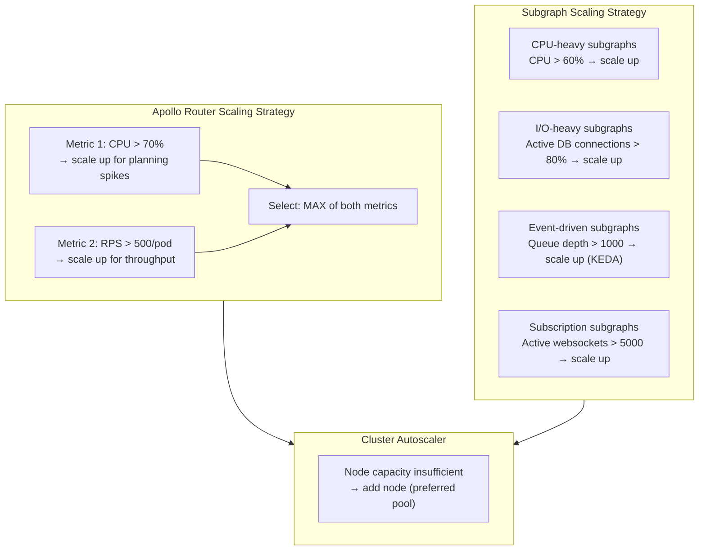
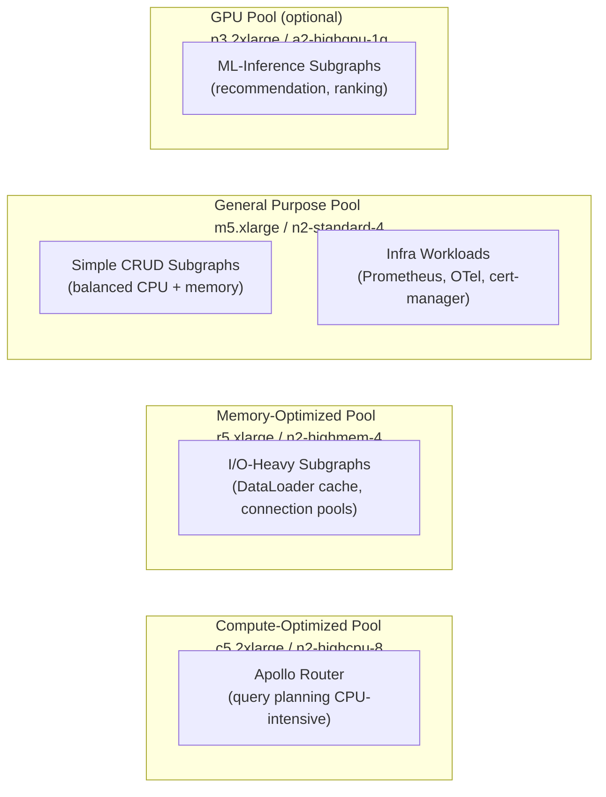

# GraphQL-Specific Autoscaling

> GraphQL traffic patterns are unlike REST traffic patterns in ways that matter for autoscaling. A REST API scales on request count. A GraphQL API scales on query complexity — a single request that resolves a deeply nested entity graph consumes ten times the CPU of a simple field lookup, yet both count as one request. An autoscaling strategy that uses only CPU or only request count will either over-provision (wasting money) or under-provision (causing latency spikes). This document builds an autoscaling model that accounts for GraphQL's complexity profile.

---

## Learning Objectives

- [ ] Configure HPA with custom metrics (Prometheus Adapter) for RPS-based scaling
- [ ] Deploy KEDA ScaledObjects for event-driven subgraph scaling based on queue depth
- [ ] Use VPA to right-size subgraph memory requests without manual tuning
- [ ] Understand how cluster autoscaler interacts with PodDisruptionBudgets and topology constraints
- [ ] Design a node pool strategy that places the router on compute-optimized nodes and subgraphs on memory-optimized nodes
- [ ] Set scaling floors and ceilings that account for query planning CPU spikes
- [ ] Configure scale-to-zero for dev and preview environments

---

## The GraphQL Scaling Problem

Standard Kubernetes HPA scales on CPU utilization, which is a good proxy for load for most services. For GraphQL, it is imprecise for two reasons:

**Query planning is bursty.** When a complex query arrives, the router's query planner runs a CPU-intensive algorithm to determine the optimal subgraph call sequence. This CPU spike is brief (milliseconds) but can push CPU utilization above HPA thresholds even when overall throughput is low. Naive CPU-based HPA thrashes — scaling up, scaling down — in response to planning spikes rather than sustained load.

**Entity resolution is I/O-bound, not CPU-bound.** A subgraph resolving entity references spends most of its time waiting on database or cache I/O. CPU utilization remains low even under heavy load. HPA based purely on CPU will not scale up a database-heavy subgraph until it becomes a bottleneck.

The solution is a multi-metric scaling strategy:



---

## HPA with CPU and Custom Metrics

The HPA for Apollo Router defined in `01-apollo-router-deployment.md` uses CPU utilization and a custom `apollo_router_http_requests_total_per_second` metric. This section documents how to expose that custom metric.

### Prometheus Adapter Configuration

The Prometheus Adapter translates Prometheus metrics into the Kubernetes custom metrics API, making them available to HPA.

```yaml
# manifests/autoscaling/prometheus-adapter-config.yaml
# This ConfigMap is consumed by the prometheus-adapter Deployment
apiVersion: v1
kind: ConfigMap
metadata:
  name: prometheus-adapter-config
  namespace: monitoring
data:
  config.yaml: |
    rules:
      # ── Apollo Router: requests per second ──────────────────────────────
      # Source metric: apollo_router_http_requests_total (counter, per pod)
      # Transform: rate over 2 minutes, per pod (podSelector)
      - seriesQuery: 'apollo_router_http_requests_total{namespace!="",pod!=""}'
        seriesFilters: []
        resources:
          overrides:
            namespace:
              resource: namespace
            pod:
              resource: pod
        name:
          matches: "apollo_router_http_requests_total"
          as: "apollo_router_http_requests_total_per_second"
        metricsQuery: |
          rate(apollo_router_http_requests_total{<<.LabelMatchers>>}[2m])

      # ── Apollo Router: p99 latency ──────────────────────────────────────
      # Use p99 latency as a scaling signal when latency degrades
      - seriesQuery: 'apollo_router_http_request_duration_seconds_bucket{namespace!="",pod!=""}'
        resources:
          overrides:
            namespace:
              resource: namespace
            pod:
              resource: pod
        name:
          matches: "apollo_router_http_request_duration_seconds_bucket"
          as: "apollo_router_http_request_duration_seconds_p99"
        metricsQuery: |
          histogram_quantile(0.99,
            rate(apollo_router_http_request_duration_seconds_bucket{<<.LabelMatchers>>}[5m])
          )

      # ── Subgraph: active database connections ───────────────────────────
      # Used by I/O-heavy subgraphs to scale on connection pool saturation
      - seriesQuery: 'nodejs_active_handles_total{namespace!="",pod!=""}'
        resources:
          overrides:
            namespace:
              resource: namespace
            pod:
              resource: pod
        name:
          matches: "nodejs_active_handles_total"
          as: "nodejs_active_handles_total"
        metricsQuery: 'nodejs_active_handles_total{<<.LabelMatchers>>}'
```

### Verify the custom metric is available:

```bash
# Test that the custom metric is registered with the metrics API
kubectl get --raw "/apis/custom.metrics.k8s.io/v1beta1" | jq '.resources[].name' | grep apollo

# Check current metric value for the router pods
kubectl get --raw \
  "/apis/custom.metrics.k8s.io/v1beta1/namespaces/graphql-platform/pods/*/apollo_router_http_requests_total_per_second" \
  | jq '.items[].value'
```

---

## KEDA ScaledObjects for Event-Driven Subgraphs

[KEDA (Kubernetes Event-Driven Autoscaler)](https://keda.sh/) extends HPA with scalers for external event sources. Use KEDA for:

- **Subscription subgraphs** that consume from Kafka or NATS
- **Background resolver subgraphs** that process async data enrichment jobs
- **Scale-to-zero** for dev and preview environments

### Kafka-Based Subscription Handler

```yaml
# manifests/autoscaling/subscription-scaledobject.yaml
# Scales the orders-subscription-subgraph based on Kafka consumer group lag.
# When subscription events queue up in Kafka, more pods are spawned to process them.
apiVersion: keda.sh/v1alpha1
kind: ScaledObject
metadata:
  name: orders-subscription-scaler
  namespace: team-orders
spec:
  scaleTargetRef:
    apiVersion: apps/v1
    kind: Deployment
    name: orders-subscription-subgraph

  # Scaling bounds
  minReplicaCount: 2    # Never scale below 2 (HA requirement)
  maxReplicaCount: 20

  # Polling interval: check trigger metrics every 15 seconds
  pollingInterval: 15

  # Cooldown: after scaling down, wait 300 seconds before scaling down again
  cooldownPeriod: 300

  # ── Triggers ─────────────────────────────────────────────────────────────
  triggers:
    # Trigger 1: Kafka consumer group lag
    - type: kafka
      metadata:
        bootstrapServers: kafka.data-platform.svc.cluster.local:9092
        consumerGroup: orders-subscriptions-cg
        topic: orders.events
        # Scale up when lag exceeds 1000 messages
        lagThreshold: "1000"
        offsetResetPolicy: latest
        # SASL authentication
        sasl: plaintext
        username: orders-subgraph
      authenticationRef:
        name: kafka-trigger-auth

    # Trigger 2: Active WebSocket connections (Prometheus metric)
    # Scale based on active subscription count regardless of Kafka lag
    - type: prometheus
      metadata:
        serverAddress: http://prometheus.observability.svc.cluster.local:9090
        metricName: orders_active_subscriptions
        query: |
          sum(orders_subgraph_active_subscriptions_total{
            namespace="team-orders"
          })
        # Scale up when total active subscriptions across all pods exceeds 5000
        threshold: "5000"

---
# TriggerAuthentication: Kafka credentials
apiVersion: keda.sh/v1alpha1
kind: TriggerAuthentication
metadata:
  name: kafka-trigger-auth
  namespace: team-orders
spec:
  secretTargetRef:
    - parameter: password
      name: kafka-credentials
      key: password
```

### Scale-to-Zero for Preview Environments

```yaml
# manifests/autoscaling/preview-scaledobject.yaml
# Scales preview (per-PR) subgraph deployments to zero when not in use.
# Preview environments are expensive if left running — scale to zero overnight.
apiVersion: keda.sh/v1alpha1
kind: ScaledObject
metadata:
  name: preview-products-subgraph-scaler
  namespace: preview-pr-1234
  # Annotate with PR number for lifecycle management
  annotations:
    preview.graphql-platform.io/pr: "1234"
    preview.graphql-platform.io/expires: "2025-06-01T00:00:00Z"
spec:
  scaleTargetRef:
    apiVersion: apps/v1
    kind: Deployment
    name: products-subgraph

  # Scale to zero when no traffic for 10 minutes
  minReplicaCount: 0
  maxReplicaCount: 2

  cooldownPeriod: 600   # 10 minutes of no activity before scaling to zero

  triggers:
    # Scale based on HTTP traffic to the preview router
    - type: prometheus
      metadata:
        serverAddress: http://prometheus.observability.svc.cluster.local:9090
        metricName: preview_router_http_requests_total
        query: |
          sum(rate(apollo_router_http_requests_total{
            namespace="preview-pr-1234"
          }[5m]))
        threshold: "0.1"   # Any traffic (> 0.1 RPS) keeps the deployment alive
```

---

## VerticalPodAutoscaler (VPA) for Subgraphs

VPA right-sizes CPU and memory requests by observing actual resource usage over time. It is particularly valuable for subgraphs where memory usage is hard to predict upfront (DataLoader caches, connection pools, JVM heap).

```yaml
# manifests/autoscaling/vpa-products-subgraph.yaml
apiVersion: autoscaling.k8s.io/v1
kind: VerticalPodAutoscaler
metadata:
  name: products-subgraph-vpa
  namespace: team-products
spec:
  targetRef:
    apiVersion: apps/v1
    kind: Deployment
    name: products-subgraph

  updatePolicy:
    # "Off": VPA only recommends, does not apply. Use this initially to gather data.
    # "Initial": VPA applies recommendations only at pod creation (no in-place updates).
    # "Auto": VPA evicts and recreates pods with new resource requests.
    # Recommendation: use "Off" for 2 weeks, review recommendations, then switch to "Initial".
    updateMode: "Off"

  resourcePolicy:
    containerPolicies:
      - containerName: products-subgraph
        # Set bounds on VPA recommendations to prevent pathological values
        minAllowed:
          cpu: "100m"
          memory: "128Mi"
        maxAllowed:
          cpu: "4"
          memory: "4Gi"
        # Which resources VPA is allowed to manage
        controlledResources:
          - cpu
          - memory
        # VPA request/limit behavior:
        # "RequestsAndLimits": adjusts both (maintains the ratio)
        # "RequestsOnly": adjusts only requests (limits stay as-is)
        controlledValues: RequestsAndLimits

      # Do not let VPA touch the OTel sidecar — it has known-stable resource needs
      - containerName: otel-agent
        mode: "Off"
```

### Reading VPA Recommendations

```bash
# After running VPA in "Off" mode for 2 weeks, read the recommendations
kubectl describe vpa products-subgraph-vpa -n team-products

# Example output:
# Recommendation:
#   Container Recommendations:
#     Container Name: products-subgraph
#       Lower Bound:
#         cpu: 150m
#         memory: 300Mi
#       Target:
#         cpu: 300m           # ← Use this value as the new request
#         memory: 512Mi
#       Uncapped Target:
#         cpu: 300m
#         memory: 512Mi
#       Upper Bound:
#         cpu: 1200m
#         memory: 2Gi
```

**Important**: Do not run VPA in `Auto` mode simultaneously with HPA on the same resource. VPA adjusting CPU requests changes the denominator in HPA's utilization calculation, causing oscillation. The safe combination is:
- HPA on CPU for horizontal scaling
- VPA on memory (only) for vertical memory tuning

```yaml
# Safe VPA when HPA is active: only manage memory, not CPU
resourcePolicy:
  containerPolicies:
    - containerName: products-subgraph
      controlledResources:
        - memory   # CPU is managed by HPA — VPA should not touch it
```

---

## Node Pool Strategy

Different GraphQL workloads have different optimal node types. Kubernetes node affinity rules direct workloads to appropriate node pools.



### Node Affinity Rules

```yaml
# In the Apollo Router Deployment spec:
affinity:
  nodeAffinity:
    requiredDuringSchedulingIgnoredDuringExecution:
      nodeSelectorTerms:
        - matchExpressions:
            # Prefer compute-optimized nodes for the router
            - key: node.kubernetes.io/instance-type
              operator: In
              values:
                - c5.2xlarge
                - c5.4xlarge
                - c5d.2xlarge
                - n2-highcpu-8
                - n2-highcpu-16
    preferredDuringSchedulingIgnoredDuringExecution:
      - weight: 100
        preference:
          matchExpressions:
            - key: graphql-platform/node-pool
              operator: In
              values:
                - compute-optimized

---
# In I/O-heavy subgraph Deployment spec:
affinity:
  nodeAffinity:
    preferredDuringSchedulingIgnoredDuringExecution:
      - weight: 80
        preference:
          matchExpressions:
            - key: graphql-platform/node-pool
              operator: In
              values:
                - memory-optimized
```

### Node Taints for Dedicated Pools

```bash
# Label and taint compute-optimized nodes for router-only scheduling
kubectl taint nodes -l graphql-platform/node-pool=compute-optimized \
  graphql-platform/workload=router:NoSchedule

# The router Deployment must include a toleration:
```

```yaml
# In Apollo Router Deployment pod spec:
tolerations:
  - key: "graphql-platform/workload"
    operator: "Equal"
    value: "router"
    effect: "NoSchedule"
```

---

## Scaling Floors and Ceilings

GraphQL has two scaling concerns that require explicit floors and ceilings:

### Scaling Floor: Query Planning Spikes

Query planning is triggered per unique operation. When a large batch of unique operations arrives simultaneously (e.g., after a cache miss storm or a marketing campaign surge), the router experiences a brief but intense CPU spike. Without a scaling floor, HPA may scale the router down to minimum replicas during off-peak hours, leaving insufficient capacity to absorb the next spike.

**Rule**: Set `minReplicas` to the number of availability zones (minimum 3). Never scale below one replica per AZ.

### Scaling Ceiling: Protecting Downstream Subgraphs

Unconstrained router scaling is dangerous. If the router scales to 50 replicas, it will fan out entity resolution requests to each subgraph, potentially overwhelming subgraph connection pools.

**Rule**: Coordinate `maxReplicas` between the router and each subgraph's database connection pool size.

```
Router maxReplicas: 20
  × avg concurrent subgraph requests per router pod: 10
  = max concurrent requests to each subgraph: 200

Products subgraph maxReplicas: 8
  × connection pool size per pod: 30
  = max database connections: 240

Therefore: 200 concurrent requests / 240 pool connections = 83% pool utilization at peak
```

If router maxReplicas × concurrent requests per pod > subgraph maxReplicas × pool size, you risk connection pool exhaustion. Tune `maxReplicas` on the router or increase subgraph connection pool size.

### HPA Stabilization Windows

```yaml
# Anti-thrash settings in the HPA spec:
behavior:
  scaleDown:
    # Do not scale down until CPU has been below threshold for 5 minutes.
    # This prevents scaling down during brief query planning lulls between bursts.
    stabilizationWindowSeconds: 300

  scaleUp:
    # React to scale-up signals within 30 seconds.
    # Query planning spikes are brief; a longer stabilization window misses the window.
    stabilizationWindowSeconds: 30
```

---

## Cluster Autoscaler Integration

The Cluster Autoscaler (CA) adds or removes nodes when pods cannot be scheduled or nodes are underutilized.

```yaml
# Cluster Autoscaler configuration for GraphQL workloads

# ── Node group annotations (applied to node groups in cloud provider) ───────
# AWS Auto Scaling Group tags:
#   k8s.io/cluster-autoscaler/enabled: "true"
#   k8s.io/cluster-autoscaler/my-cluster: "owned"
#   k8s.io/cluster-autoscaler/node-template/label/graphql-platform/node-pool: compute-optimized

# ── CA behavior for router pods ─────────────────────────────────────────────
# The PodDisruptionBudget (minAvailable: 2) interacts with CA:
# CA will not drain a node if doing so would violate the PDB.
# With 3 replicas and minAvailable: 2, CA can drain at most 1 router node at a time.
# Ensure the router's topology spread constraint (maxSkew: 1 across zones) does not
# prevent new pods from being scheduled on the replacement node.
```

### Prevent Cluster Autoscaler from Removing Active Nodes

```yaml
# Annotate nodes that should not be removed by the CA
# (e.g., nodes with long-running subscription connections)
kubectl annotate node my-node \
  "cluster-autoscaler.kubernetes.io/scale-down-disabled=true"

# For subscription subgraph pods: prevent CA from evicting them prematurely
# by setting a PodDisruptionBudget and a generous terminationGracePeriodSeconds
```

---

## Autoscaling Summary Table

| Component | Scaler | Primary Metric | Min | Max | Notes |
|-----------|--------|----------------|-----|-----|-------|
| Apollo Router | HPA | CPU (70%) + RPS (500/pod) | 3 | 20 | Max coordinated with subgraph pool size |
| Products subgraph (CPU) | HPA | CPU (60%) | 2 | 10 | Compute-optimized node pool |
| Orders subgraph (I/O) | HPA | DB connections (80%) | 2 | 8 | Memory-optimized node pool |
| Orders subscriptions | KEDA | Kafka lag (1000 msgs) | 2 | 20 | Scales to 0 not appropriate (subscriptions) |
| Preview environments | KEDA | HTTP RPS (0.1) | 0 | 2 | Scale-to-zero for cost savings |
| All subgraphs (memory) | VPA | Memory usage (observed) | — | — | "Off" → "Initial" after 2-week observation |

---

## References

- [Kubernetes HPA documentation](https://kubernetes.io/docs/tasks/run-application/horizontal-pod-autoscale/)
- [KEDA documentation](https://keda.sh/docs/)
- [Kubernetes VPA documentation](https://github.com/kubernetes/autoscaler/tree/master/vertical-pod-autoscaler)
- [Prometheus Adapter for custom metrics](https://github.com/kubernetes-sigs/prometheus-adapter)
- [Cluster Autoscaler FAQ](https://github.com/kubernetes/autoscaler/blob/master/cluster-autoscaler/FAQ.md)

---

## Related Topics

- [01-apollo-router-deployment.md](./01-apollo-router-deployment.md) — the HPA defined in this document applies to the Deployment defined there
- [02-subgraph-deployment.md](./02-subgraph-deployment.md) — subgraph Deployments that the scalers reference
- [05-helm-charts.md](./05-helm-charts.md) — templating HPA and ScaledObject configuration per environment
