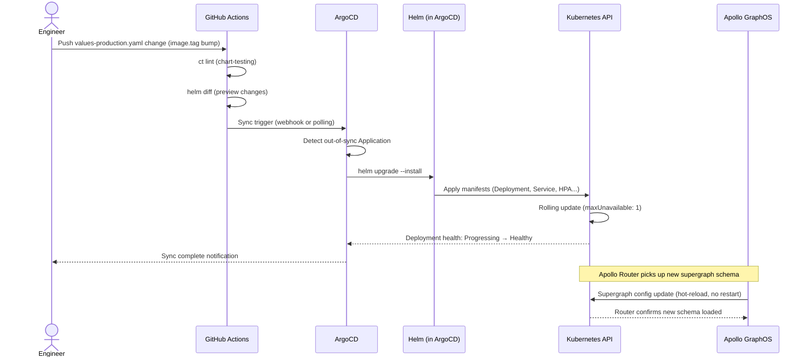

# Helm Charts for the GraphQL Platform

> A Kubernetes manifest is a specification of intent at a point in time. A Helm chart is a parameterized, versioned, testable specification that can be instantiated across many environments without duplication. The difference matters at enterprise scale: ten subgraphs deployed to three environments without Helm means thirty sets of manifests that drift over time. With Helm, it means ten value files and one chart template that stays in sync. The manifests documented in the previous sections become Helm templates in this section.

---

## Learning Objectives

- [ ] Understand the chart dependency model: a platform chart that depends on apollo-router and a subgraph-template chart
- [ ] Design a values.yaml hierarchy that flows global → environment → per-subgraph without repetition
- [ ] Use Helmfile to manage multi-environment promotion as code
- [ ] Test charts with `ct` (chart-testing) before merging
- [ ] Configure ArgoCD ApplicationSet to deploy all subgraphs from a single template
- [ ] Validate values.yaml correctness with JSON Schema before `helm install`

---

## Chart Structure Overview

```
charts/
├── apollo-router/                    ← Router chart (deployable standalone or as dependency)
│   ├── Chart.yaml
│   ├── values.yaml                   ← Defaults (override in environments)
│   ├── values.schema.json            ← JSON Schema validation for values
│   ├── templates/
│   │   ├── _helpers.tpl
│   │   ├── deployment.yaml
│   │   ├── service.yaml
│   │   ├── configmap.yaml
│   │   ├── externalsecret.yaml
│   │   ├── hpa.yaml
│   │   ├── pdb.yaml
│   │   ├── serviceaccount.yaml
│   │   ├── networkpolicy.yaml
│   │   └── NOTES.txt
│   └── tests/
│       └── router-health-check.yaml  ← helm test pod

├── subgraph-template/                ← Generic subgraph chart (one chart, many subgraphs)
│   ├── Chart.yaml
│   ├── values.yaml
│   ├── values.schema.json
│   ├── templates/
│   │   ├── _helpers.tpl
│   │   ├── deployment.yaml
│   │   ├── service.yaml
│   │   ├── hpa.yaml
│   │   ├── pdb.yaml
│   │   ├── networkpolicy.yaml
│   │   ├── serviceaccount.yaml
│   │   └── externalsecret.yaml
│   └── tests/
│       └── subgraph-health-check.yaml

└── graphql-platform/                 ← Umbrella chart (composes router + all subgraphs)
    ├── Chart.yaml
    ├── values.yaml
    ├── values-staging.yaml
    ├── values-production.yaml
    └── charts/                       ← Chart.lock downloads dependencies here
```

---

## apollo-router Chart

### Chart.yaml

```yaml
# charts/apollo-router/Chart.yaml
apiVersion: v2
name: apollo-router
description: Apollo Router production deployment for Kubernetes
type: application
version: 1.4.0          # Chart version — increment on chart changes
appVersion: "1.48.0"    # Apollo Router binary version

keywords:
  - graphql
  - apollo
  - router
  - federation

maintainers:
  - name: Platform Engineering
    email: platform@example.com

annotations:
  # Link to internal runbook
  artifacthub.io/links: |
    - name: runbook
      url: https://wiki.example.com/graphql/router-runbook
```

### values.yaml (Router)

```yaml
# charts/apollo-router/values.yaml
# All values here are defaults — override per environment via -f values-<env>.yaml

# ── Image ───────────────────────────────────────────────────────────────────
image:
  repository: ghcr.io/apollographql/router
  tag: ""                   # Default: Chart.yaml appVersion; override to pin
  pullPolicy: IfNotPresent
  pullSecrets: []           # List of imagePullSecrets for private registries

# ── Replica and scaling ──────────────────────────────────────────────────────
replicaCount: 3

autoscaling:
  enabled: true
  minReplicas: 3
  maxReplicas: 20
  targetCPUUtilizationPercentage: 70
  customMetrics:
    enabled: true
    rpsTarget: "500"        # Requests per second per pod before scaling

pdb:
  enabled: true
  minAvailable: 2

# ── Apollo Graph configuration ───────────────────────────────────────────────
apollo:
  graphRef: ""              # REQUIRED — set in environment values (e.g., my-graph@production)
  keySecretName: "apollo-router-secrets"
  keySecretKey: "apollo-key"

# ── Service ──────────────────────────────────────────────────────────────────
service:
  type: ClusterIP
  port: 4000
  metricsPort: 9090
  healthPort: 8088

serviceAccount:
  create: true
  annotations: {}           # Add AWS IRSA or GCP Workload Identity annotations here
  name: ""                  # Default: release name

# ── Resource sizing ──────────────────────────────────────────────────────────
resources:
  requests:
    cpu: 500m
    memory: 512Mi
  limits:
    cpu: 2000m
    memory: 1Gi

# ── Router configuration (router.yaml content) ───────────────────────────────
routerConfig:
  supergraph:
    listen: "0.0.0.0:4000"
    path: "/graphql"
    introspection: false
  sandbox:
    enabled: false
  health_check:
    listen: "0.0.0.0:8088"
    enabled: true
  cors:
    origins: []             # REQUIRED — set in environment values
    methods:
      - GET
      - POST
      - OPTIONS
  traffic_shaping:
    router:
      timeout: 30s
    all:
      timeout: 15s
  telemetry:
    exporters:
      tracing:
        otlp:
          enabled: true
          endpoint: "http://otel-collector.observability.svc.cluster.local:4317"
          protocol: grpc
      metrics:
        prometheus:
          enabled: true
          listen: "0.0.0.0:9090"
          path: /metrics
  limits:
    max_depth: 15
    max_height: 200
    max_aliases: 30

# ── External secret (ExternalSecret CRD) ────────────────────────────────────
externalSecret:
  enabled: true
  refreshInterval: "1h"
  secretStoreRef:
    kind: ClusterSecretStore
    name: vault-backend
  vaultPath: "secret/graphql-platform/apollo-router"

# ── Probes ───────────────────────────────────────────────────────────────────
probes:
  readiness:
    initialDelaySeconds: 5
    periodSeconds: 5
    timeoutSeconds: 3
    failureThreshold: 3
  liveness:
    initialDelaySeconds: 15
    periodSeconds: 10
    timeoutSeconds: 5
    failureThreshold: 3
  startup:
    initialDelaySeconds: 5
    periodSeconds: 5
    failureThreshold: 12

# ── Network policy ───────────────────────────────────────────────────────────
networkPolicy:
  enabled: true
  ingressNamespaceSelector:
    matchLabels:
      kubernetes.io/metadata.name: ingress-nginx
  subgraphNamespaceSelector:
    matchLabels:
      graphql-platform/role: subgraph

# ── Node placement ───────────────────────────────────────────────────────────
nodeSelector: {}
tolerations: []
affinity: {}              # Default: pod anti-affinity is set in template; override here

# ── Pod annotations ──────────────────────────────────────────────────────────
podAnnotations:
  prometheus.io/scrape: "true"
  prometheus.io/port: "9090"
  prometheus.io/path: "/metrics"

podLabels: {}
```

### values.schema.json (Router)

```json
{
  "$schema": "http://json-schema.org/draft-07/schema",
  "title": "Apollo Router Helm Chart Values",
  "type": "object",
  "required": ["apollo"],
  "properties": {
    "apollo": {
      "type": "object",
      "required": ["graphRef"],
      "properties": {
        "graphRef": {
          "type": "string",
          "pattern": "^[a-zA-Z0-9_-]+@[a-zA-Z0-9_-]+$",
          "description": "Apollo GraphOS graph reference in format 'graph-id@variant'"
        },
        "keySecretName": {
          "type": "string",
          "minLength": 1
        }
      }
    },
    "replicaCount": {
      "type": "integer",
      "minimum": 1,
      "maximum": 100
    },
    "resources": {
      "type": "object",
      "properties": {
        "requests": {
          "type": "object",
          "required": ["cpu", "memory"]
        },
        "limits": {
          "type": "object",
          "required": ["cpu", "memory"]
        }
      }
    },
    "routerConfig": {
      "type": "object",
      "properties": {
        "cors": {
          "type": "object",
          "properties": {
            "origins": {
              "type": "array",
              "items": {
                "type": "string",
                "pattern": "^https?://"
              }
            }
          }
        }
      }
    }
  }
}
```

### _helpers.tpl

```yaml
{{/* charts/apollo-router/templates/_helpers.tpl */}}

{{/*
Expand the name of the chart.
*/}}
{{- define "apollo-router.name" -}}
{{- default .Chart.Name .Values.nameOverride | trunc 63 | trimSuffix "-" }}
{{- end }}

{{/*
Create a default fully qualified app name.
*/}}
{{- define "apollo-router.fullname" -}}
{{- if .Values.fullnameOverride }}
{{- .Values.fullnameOverride | trunc 63 | trimSuffix "-" }}
{{- else }}
{{- $name := default .Chart.Name .Values.nameOverride }}
{{- if contains $name .Release.Name }}
{{- .Release.Name | trunc 63 | trimSuffix "-" }}
{{- else }}
{{- printf "%s-%s" .Release.Name $name | trunc 63 | trimSuffix "-" }}
{{- end }}
{{- end }}
{{- end }}

{{/*
Common labels applied to all resources
*/}}
{{- define "apollo-router.labels" -}}
helm.sh/chart: {{ include "apollo-router.chart" . }}
{{ include "apollo-router.selectorLabels" . }}
{{- if .Chart.AppVersion }}
app.kubernetes.io/version: {{ .Chart.AppVersion | quote }}
{{- end }}
app.kubernetes.io/managed-by: {{ .Release.Service }}
{{- end }}

{{/*
Selector labels (used in matchLabels — must be stable across upgrades)
*/}}
{{- define "apollo-router.selectorLabels" -}}
app.kubernetes.io/name: {{ include "apollo-router.name" . }}
app.kubernetes.io/instance: {{ .Release.Name }}
{{- end }}

{{/*
Router image tag — prefer explicit tag over appVersion
*/}}
{{- define "apollo-router.imageTag" -}}
{{- .Values.image.tag | default .Chart.AppVersion }}
{{- end }}

{{/*
Compute a hash of the router.yaml ConfigMap content for pod restart triggering
*/}}
{{- define "apollo-router.configHash" -}}
{{- .Values.routerConfig | toYaml | sha256sum | trunc 8 }}
{{- end }}

{{/*
ServiceAccount name
*/}}
{{- define "apollo-router.serviceAccountName" -}}
{{- if .Values.serviceAccount.create }}
{{- default (include "apollo-router.fullname" .) .Values.serviceAccount.name }}
{{- else }}
{{- default "default" .Values.serviceAccount.name }}
{{- end }}
{{- end }}
```

---

## subgraph-template Chart

The subgraph-template chart is a generic chart instantiated once per subgraph with different values. This avoids maintaining ten separate charts that are 95% identical.

### values.yaml (Subgraph Template)

```yaml
# charts/subgraph-template/values.yaml

# ── Subgraph identity (REQUIRED) ─────────────────────────────────────────────
subgraph:
  name: ""              # REQUIRED — unique name (e.g., "products", "orders")
  port: 4000            # GraphQL endpoint port
  metricsPort: 9090

# ── Image ────────────────────────────────────────────────────────────────────
image:
  repository: ""        # REQUIRED — e.g., your-registry.io/products-subgraph
  tag: ""               # REQUIRED — semantic version
  pullPolicy: IfNotPresent

# ── Replica and autoscaling ───────────────────────────────────────────────────
replicaCount: 2

autoscaling:
  enabled: false        # Enable per-subgraph in environment values
  minReplicas: 2
  maxReplicas: 10
  targetCPUUtilizationPercentage: 60

pdb:
  enabled: true
  minAvailable: 1

# ── Resources ─────────────────────────────────────────────────────────────────
resources:
  requests:
    cpu: 250m
    memory: 256Mi
  limits:
    cpu: 1000m
    memory: 512Mi

# ── Environment variables ─────────────────────────────────────────────────────
env: []
# Example:
# env:
#   - name: DATABASE_URL
#     valueFrom:
#       secretKeyRef:
#         name: products-db-credentials
#         key: url

envFrom: []
# Example:
# envFrom:
#   - secretRef:
#       name: products-secrets

# ── Config ────────────────────────────────────────────────────────────────────
configMap:
  enabled: false
  data: {}

# ── External secrets ──────────────────────────────────────────────────────────
externalSecret:
  enabled: false
  refreshInterval: "1h"
  secretStoreRef:
    kind: ClusterSecretStore
    name: vault-backend
  target:
    name: ""            # Defaults to subgraph.name + "-secrets"
  data: []
  # Example:
  # data:
  #   - secretKey: database-url
  #     remoteRef:
  #       key: secret/team-products/database
  #       property: url

# ── ServiceAccount ────────────────────────────────────────────────────────────
serviceAccount:
  create: true
  annotations: {}

# ── Network policy ────────────────────────────────────────────────────────────
networkPolicy:
  enabled: true
  # Namespaces allowed to call this subgraph (only the router namespace by default)
  allowFromNamespaces:
    - matchLabels:
        kubernetes.io/metadata.name: graphql-platform
  # Namespaces this subgraph can call (database namespace, observability)
  egressNamespaces:
    - matchLabels:
        kubernetes.io/metadata.name: data-platform
    - matchLabels:
        kubernetes.io/metadata.name: observability

# ── Health checks ─────────────────────────────────────────────────────────────
healthCheck:
  readinessPath: /_health/ready
  livenessPath: /_health/live
  initialDelaySeconds: 5
  periodSeconds: 5

# ── Sidecars ──────────────────────────────────────────────────────────────────
sidecars: []
# Example (OTel sidecar):
# sidecars:
#   - name: otel-agent
#     image: otel/opentelemetry-collector-contrib:0.100.0
#     args: ["--config=/etc/otel/config.yaml"]
#     resources:
#       requests:
#         cpu: 50m
#         memory: 64Mi

# ── Node placement ────────────────────────────────────────────────────────────
nodeSelector: {}
tolerations: []
affinity: {}

podAnnotations:
  prometheus.io/scrape: "true"
  prometheus.io/port: "9090"
  prometheus.io/path: "/metrics"
```

---

## Helmfile for Multi-Environment Promotion

[Helmfile](https://helmfile.readthedocs.io/) manages multiple Helm releases as a single declarative file. It handles environment-specific values, release ordering, and diff-based upgrades.

```yaml
# helmfile.yaml — root Helmfile for the GraphQL platform
environments:
  staging:
    values:
      - environments/staging/globals.yaml
  production:
    values:
      - environments/production/globals.yaml

---
# helmfile.d/01-infra.yaml — infrastructure charts (ExternalSecrets, cert-manager)
releases:
  - name: external-secrets-operator
    namespace: external-secrets
    chart: external-secrets/external-secrets
    version: "0.9.18"
    values:
      - values/external-secrets-operator.yaml

  - name: cert-manager
    namespace: cert-manager
    chart: jetstack/cert-manager
    version: "v1.14.5"
    values:
      - values/cert-manager.yaml
    set:
      - name: installCRDs
        value: true

---
# helmfile.d/02-router.yaml — Apollo Router
releases:
  - name: apollo-router
    namespace: graphql-platform
    chart: ./charts/apollo-router
    version: "1.4.0"
    values:
      - charts/apollo-router/values.yaml
      - environments/{{ .Environment.Name }}/router-values.yaml
    set:
      - name: apollo.graphRef
        value: "my-graph@{{ .Environment.Name }}"
    needs:
      - external-secrets/external-secrets-operator

---
# helmfile.d/03-subgraphs.yaml — all subgraph deployments
releases:
  - name: products-subgraph
    namespace: team-products
    chart: ./charts/subgraph-template
    version: "2.1.0"
    values:
      - charts/subgraph-template/values.yaml
      - environments/{{ .Environment.Name }}/subgraphs/products.yaml
    needs:
      - graphql-platform/apollo-router   # Router deploys before subgraphs are exposed

  - name: orders-subgraph
    namespace: team-orders
    chart: ./charts/subgraph-template
    version: "2.1.0"
    values:
      - charts/subgraph-template/values.yaml
      - environments/{{ .Environment.Name }}/subgraphs/orders.yaml
    needs:
      - graphql-platform/apollo-router

  - name: users-subgraph
    namespace: team-users
    chart: ./charts/subgraph-template
    version: "2.1.0"
    values:
      - charts/subgraph-template/values.yaml
      - environments/{{ .Environment.Name }}/subgraphs/users.yaml
    needs:
      - graphql-platform/apollo-router
```

### Environment Values Files

```yaml
# environments/staging/router-values.yaml
replicaCount: 2           # Fewer replicas in staging

apollo:
  graphRef: "my-graph@staging"

autoscaling:
  enabled: false          # No autoscaling in staging (fixed cost)

resources:
  requests:
    cpu: 250m
    memory: 256Mi
  limits:
    cpu: 1000m
    memory: 512Mi

routerConfig:
  supergraph:
    introspection: true   # Enable introspection in staging for developer tooling
  sandbox:
    enabled: true         # Enable sandbox in staging
  cors:
    origins:
      - https://staging.example.com
      - https://studio.apollographql.com
      - http://localhost:3000   # Local development
```

```yaml
# environments/production/router-values.yaml
replicaCount: 3           # Minimum 3 (one per AZ)

apollo:
  graphRef: "my-graph@production"

autoscaling:
  enabled: true
  minReplicas: 3
  maxReplicas: 20

resources:
  requests:
    cpu: 500m
    memory: 512Mi
  limits:
    cpu: 2000m
    memory: 1Gi

routerConfig:
  supergraph:
    introspection: false  # Never expose introspection in production
  sandbox:
    enabled: false
  cors:
    origins:
      - https://app.example.com
      - https://admin.example.com
```

```yaml
# environments/staging/subgraphs/products.yaml
subgraph:
  name: products
  port: 4002

image:
  repository: your-registry.io/products-subgraph
  tag: "2.14.3"

replicaCount: 1

resources:
  requests:
    cpu: 100m
    memory: 128Mi
  limits:
    cpu: 500m
    memory: 256Mi

env:
  - name: NODE_ENV
    value: staging
  - name: DATABASE_URL
    valueFrom:
      secretKeyRef:
        name: products-db-credentials
        key: url
```

### Helmfile Commands

```bash
# Preview changes for staging without applying
helmfile -e staging diff

# Apply all releases to staging
helmfile -e staging apply

# Apply only the router release
helmfile -e staging apply --selector name=apollo-router

# Verify all releases are healthy
helmfile -e staging status

# Destroy a preview environment
helmfile -e preview-pr-1234 destroy
```

---

## chart-testing (ct) Integration

[chart-testing](https://github.com/helm/chart-testing) runs lint and install tests for Helm charts in CI.

```yaml
# .github/workflows/chart-testing.yml
name: Chart Testing

on:
  pull_request:
    paths:
      - 'charts/**'

jobs:
  lint-test:
    runs-on: ubuntu-latest
    steps:
      - uses: actions/checkout@v4
        with:
          fetch-depth: 0   # ct needs full git history to detect changed charts

      - uses: azure/setup-helm@v4
        with:
          version: v3.14.0

      - uses: helm/chart-testing-action@v2

      - name: Run chart-testing lint
        run: ct lint --config ct.yaml

      - name: Create kind cluster (for install test)
        uses: helm/kind-action@v1
        if: steps.list-changed.outputs.changed == 'true'

      - name: Run chart-testing install
        run: ct install --config ct.yaml
```

```yaml
# ct.yaml — chart-testing configuration
chart-dirs:
  - charts

chart-repos:
  - name: external-secrets
    url: https://charts.external-secrets.io

validate-maintainers: true
validate-chart-schema: true   # Validates values.schema.json

# Helm extra arguments for install test
helm-extra-set-args:
  - "--set=apollo.graphRef=test-graph@staging"
  - "--set=routerConfig.cors.origins[0]=https://test.example.com"

# Chart version check: fail if chart version was not bumped for changed charts
check-version-increment: true
```

---

## ArgoCD ApplicationSet for Multi-Subgraph GitOps

ArgoCD ApplicationSet generates one ArgoCD Application per subgraph from a single template. When a new subgraph values file is added to `environments/production/subgraphs/`, ArgoCD automatically creates the Application and deploys it.

```yaml
# argocd/applicationset-subgraphs.yaml
apiVersion: argoproj.io/v1alpha1
kind: ApplicationSet
metadata:
  name: graphql-subgraphs
  namespace: argocd
spec:
  # ── Generator: discover subgraphs from git directory ─────────────────────
  generators:
    - git:
        repoURL: https://github.com/example/graphql-platform
        revision: main
        directories:
          - path: environments/production/subgraphs/*
        # Each subdirectory name becomes a subgraph name
        # e.g., environments/production/subgraphs/products → name=products

  # ── Application template ──────────────────────────────────────────────────
  template:
    metadata:
      # Application name: team-<subgraph-name> (e.g., team-products)
      name: "team-{{path.basename}}"
      namespace: argocd
      labels:
        graphql-platform/component: subgraph
        graphql-platform/subgraph: "{{path.basename}}"
      finalizers:
        - resources-finalizer.argocd.argoproj.io

    spec:
      project: graphql-platform

      source:
        repoURL: https://github.com/example/graphql-platform
        targetRevision: main
        # Use the shared subgraph-template chart
        path: charts/subgraph-template
        helm:
          releaseName: "{{path.basename}}-subgraph"
          valueFiles:
            - charts/subgraph-template/values.yaml
            - "../../environments/production/subgraphs/{{path.basename}}/values.yaml"

      destination:
        server: https://kubernetes.default.svc
        namespace: "team-{{path.basename}}"

      syncPolicy:
        automated:
          prune: true     # Remove resources deleted from Git
          selfHeal: true  # Revert manual kubectl changes
        syncOptions:
          - CreateNamespace=true   # Create the team namespace if it doesn't exist
          - ApplyOutOfSyncOnly=true   # Only sync resources that differ

        retry:
          limit: 3
          backoff:
            duration: 5s
            factor: 2
            maxDuration: 3m

---
# Separate ApplicationSet for the Apollo Router
apiVersion: argoproj.io/v1alpha1
kind: ApplicationSet
metadata:
  name: apollo-router
  namespace: argocd
spec:
  generators:
    - list:
        elements:
          - env: staging
            graphRef: my-graph@staging
          - env: production
            graphRef: my-graph@production

  template:
    metadata:
      name: "apollo-router-{{env}}"
      namespace: argocd
    spec:
      project: graphql-platform
      source:
        repoURL: https://github.com/example/graphql-platform
        targetRevision: main
        path: charts/apollo-router
        helm:
          releaseName: apollo-router
          valueFiles:
            - values.yaml
            - "../../environments/{{env}}/router-values.yaml"
          set:
            - name: apollo.graphRef
              value: "{{graphRef}}"
      destination:
        server: https://kubernetes.default.svc
        namespace: graphql-platform
      syncPolicy:
        automated:
          prune: true
          selfHeal: true
```

---

## Values Validation with JSON Schema

JSON Schema in `values.schema.json` is validated automatically by `helm install`, `helm upgrade`, and `helm lint`. This catches configuration errors before they reach the cluster.

```json
{
  "$schema": "http://json-schema.org/draft-07/schema",
  "title": "Subgraph Template Values",
  "type": "object",
  "required": ["subgraph", "image"],
  "additionalProperties": false,
  "properties": {
    "subgraph": {
      "type": "object",
      "required": ["name", "port"],
      "additionalProperties": false,
      "properties": {
        "name": {
          "type": "string",
          "pattern": "^[a-z][a-z0-9-]*$",
          "description": "Subgraph name — lowercase alphanumeric and hyphens only"
        },
        "port": {
          "type": "integer",
          "minimum": 1024,
          "maximum": 65535
        },
        "metricsPort": {
          "type": "integer",
          "minimum": 1024,
          "maximum": 65535
        }
      }
    },
    "image": {
      "type": "object",
      "required": ["repository", "tag"],
      "properties": {
        "repository": {
          "type": "string",
          "minLength": 1,
          "description": "Container image repository — must not be empty"
        },
        "tag": {
          "type": "string",
          "pattern": "^[0-9]+\\.[0-9]+\\.[0-9]+$",
          "description": "Semantic version tag — pattern enforces X.Y.Z"
        },
        "pullPolicy": {
          "type": "string",
          "enum": ["Always", "IfNotPresent", "Never"]
        }
      }
    },
    "replicaCount": {
      "type": "integer",
      "minimum": 0,
      "maximum": 50
    },
    "resources": {
      "type": "object",
      "required": ["requests", "limits"],
      "properties": {
        "requests": {
          "type": "object",
          "required": ["cpu", "memory"],
          "properties": {
            "cpu": { "type": "string" },
            "memory": { "type": "string" }
          }
        },
        "limits": {
          "type": "object",
          "required": ["cpu", "memory"]
        }
      }
    },
    "autoscaling": {
      "type": "object",
      "properties": {
        "enabled": { "type": "boolean" },
        "minReplicas": {
          "type": "integer",
          "minimum": 1
        },
        "maxReplicas": {
          "type": "integer",
          "minimum": 1
        }
      },
      "if": {
        "properties": { "enabled": { "const": true } }
      },
      "then": {
        "required": ["minReplicas", "maxReplicas"]
      }
    },
    "networkPolicy": {
      "type": "object",
      "properties": {
        "enabled": { "type": "boolean" }
      }
    }
  }
}
```

Test that schema validation works:

```bash
# This should fail with a clear error (tag is not a semantic version):
helm install products-subgraph ./charts/subgraph-template \
  --set subgraph.name=products \
  --set subgraph.port=4002 \
  --set image.repository=your-registry.io/products-subgraph \
  --set image.tag=latest    # ← Should fail: pattern requires X.Y.Z

# Error: values don't meet the specifications of the schema(s) in the following chart(s):
# subgraph-template:
#   - (root).image.tag: Does not match pattern '^[0-9]+\.[0-9]+\.[0-9]+$'
```

---

## Helm Release Lifecycle



---

## Production Considerations

**Pin chart versions in environments.** Never use `version: "*"` or `version: latest` for chart dependencies. A chart update should be an explicit, reviewed change. Use `helmfile deps` to lock chart versions in `helmfile.lock`.

**Separate chart versions from app versions.** `Chart.yaml` has both `version` (chart template version) and `appVersion` (application version). Change `appVersion` when the router binary version changes. Change `version` when the chart templates change. Both changes require a version bump — but they change at different frequencies.

**Store rendered manifests in Git (optional).** Some organizations render Helm templates to plain manifests (`helm template`) and commit the output. This makes it easy to audit exactly what Kubernetes objects exist in each environment. ArgoCD supports this pattern via the "plain YAML" source type alongside Helm.

**Use Helm secrets for values encryption.** If values files contain sensitive data (API keys that cannot be moved to ExternalSecrets), use [helm-secrets](https://github.com/jkroepke/helm-secrets) with SOPS to encrypt values at rest in Git.

---

## References

- [Helm documentation](https://helm.sh/docs/)
- [Helmfile documentation](https://helmfile.readthedocs.io/)
- [chart-testing (ct)](https://github.com/helm/chart-testing)
- [ArgoCD ApplicationSet](https://argo-cd.readthedocs.io/en/stable/operator-manual/applicationset/)
- [Helm JSON Schema validation](https://helm.sh/docs/topics/charts/#schema-files)
- [helm-secrets](https://github.com/jkroepke/helm-secrets)

---

## Related Topics

- [01-apollo-router-deployment.md](./01-apollo-router-deployment.md) — the manifests that apollo-router chart templates
- [02-subgraph-deployment.md](./02-subgraph-deployment.md) — the manifests that subgraph-template chart templates
- [04-autoscaling.md](./04-autoscaling.md) — HPA and KEDA resources that Helm manages
- [11-ci-cd-automation](../11-ci-cd-automation/) — how schema publish triggers the Helm upgrade via ArgoCD
