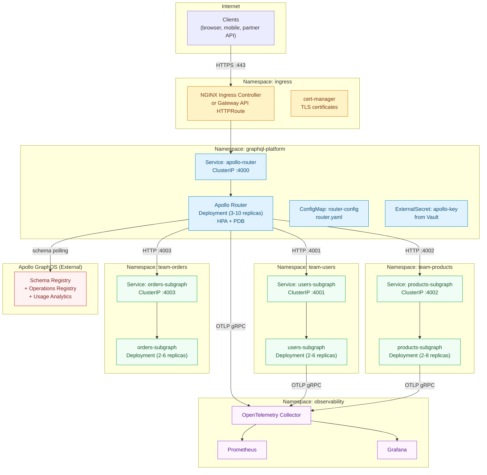

# 15 — Kubernetes Deployment

> Kubernetes is not optional infrastructure for an enterprise GraphQL platform. It is the deployment substrate that makes every other operational property achievable: horizontal scaling of the router without schema changes, independent lifecycle management for each subgraph, declarative rollout strategies that prevent breaking deploys, and network isolation between components. A GraphQL platform deployed on virtual machines will spend engineering time solving problems that Kubernetes solves by default.

This chapter documents the complete Kubernetes deployment model for a production Apollo Federation supergraph. It covers the Apollo Router as a first-class Kubernetes workload, per-subgraph deployment patterns, ingress configuration for GraphQL's unusual protocol requirements (WebSocket upgrades, long-polling, large response bodies), autoscaling strategies that account for GraphQL's unique traffic patterns (query planning CPU spikes, subscription fan-out), and the Helm chart structure that makes the entire platform manageable as code.

---

## Why Kubernetes for Enterprise GraphQL

GraphQL changes the deployment calculus in ways that favor Kubernetes over simpler deployment targets.

**The router is stateless and horizontally scalable.** Apollo Router holds no per-request state between client calls. Every replica is identical. Kubernetes HPA can scale router replicas up in seconds based on CPU or request-per-second metrics, and scale back down during off-peak hours. A VM-based router deployment requires manual intervention or custom autoscaling scripts to achieve the same result.

**Subgraphs have independent release cadences.** In a federation with ten subgraphs owned by ten teams, each subgraph is deployed independently. Kubernetes Deployments with separate rollout strategies for each subgraph mean a payments team can deploy a new resolver without touching the orders or users deployment. Without Kubernetes (or an equivalent container orchestrator), per-subgraph isolation requires either a microservices platform with significant operational overhead or co-deployment that creates release coupling.

**GraphQL schema changes do not require pod restarts.** Apollo Router's hot-reload mechanism fetches supergraph config updates from Apollo GraphOS without restarting. Kubernetes health probes, rolling updates, and PodDisruptionBudgets protect traffic during the rare cases when a router restart is required (binary upgrades, configuration changes that cannot be hot-reloaded).

**Observability integrates natively.** OpenTelemetry collector sidecars, Prometheus scraping via annotations, and Grafana Loki log aggregation all have first-class Kubernetes integration. The telemetry pipeline described in Chapter 14 assumes Kubernetes as the runtime.

---

## Deployment Topology



---

## Router: Deployment vs DaemonSet

The default topology runs Apollo Router as a **Deployment** with a configurable replica count managed by HPA. This is correct for the majority of organizations.

| Topology | When to Use | Tradeoffs |
|----------|-------------|-----------|
| **Deployment + HPA** | Standard production setup. Traffic enters through a Service and load balances across replicas. | Replicas may be on any node. Network hop from ingress to router pod adds ~1ms latency. |
| **DaemonSet** | When router latency is the critical constraint and co-locating the router with the client-facing node (e.g., at the edge of a Kubernetes-managed CDN node pool) reduces hops. | Every node runs a router replica regardless of traffic. Wastes resources on lightly loaded nodes. More complex node affinity required. |
| **StatefulSet** | Not recommended for Apollo Router. Router is stateless. | N/A — do not use. |

For most organizations: use a Deployment with a minimum of 3 replicas (one per availability zone) and HPA scaling to 10+ replicas under peak load.

---

## Kubernetes-Native Features Used

| Feature | Used By | Purpose |
|---------|---------|---------|
| **Deployment** | Router, each subgraph | Declarative pod management, rolling updates |
| **HorizontalPodAutoscaler** | Router, high-traffic subgraphs | Scale on CPU, RPS, or custom metrics |
| **VerticalPodAutoscaler** | Subgraphs | Right-size memory requests without manual tuning |
| **PodDisruptionBudget** | Router, subgraphs | Guarantee minimum availability during node drain |
| **NetworkPolicy** | All namespaces | Restrict subgraph traffic to router only |
| **ServiceAccount** | Router, each subgraph | RBAC identity for Vault, AWS IRSA, Workload Identity |
| **ConfigMap** | Router (router.yaml) | Declarative router configuration without secret values |
| **ExternalSecret / SecretStore** | Router (Apollo key, signing keys) | Vault / AWS Secrets Manager integration |
| **PodAntiAffinity** | Router, subgraphs | Spread replicas across AZs |
| **Ingress / HTTPRoute** | Ingress layer | TLS termination, WebSocket upgrade, path routing |
| **ResourceQuota** | Team namespaces | Prevent a single subgraph from consuming cluster resources |
| **LimitRange** | Team namespaces | Set default request/limit if subgraph team omits them |

---

## Namespace Strategy

Two patterns are common. Choose based on your organization's team topology:

**Option A: Shared platform namespace + per-team subgraph namespaces**

```
graphql-platform/    ← Apollo Router, shared infra
team-users/          ← users-subgraph owned by the Identity team
team-products/       ← products-subgraph owned by the Catalog team
team-orders/         ← orders-subgraph owned by the Commerce team
```

NetworkPolicy allows the router namespace to reach each subgraph namespace. Subgraph namespaces cannot reach each other. Each team has RBAC access only to their own namespace.

**Option B: Single namespace per environment**

```
graphql-staging/     ← all components, staging environment
graphql-production/  ← all components, production environment
```

Simpler to operate. Appropriate for smaller engineering orgs or when subgraph teams are the same people as the platform team. Loses per-team isolation — a misconfigured subgraph can affect the resource quota of unrelated subgraphs.

**Recommendation**: Start with Option B and migrate to Option A when you have three or more subgraph teams with independent deployment cadences and SLAs.

---

## Content Files

| File | Topic |
|------|-------|
| [01-apollo-router-deployment.md](./01-apollo-router-deployment.md) | Production Kubernetes manifests for Apollo Router: Deployment, Service, ConfigMap, ExternalSecret, HPA, PDB, init containers, probes |
| [02-subgraph-deployment.md](./02-subgraph-deployment.md) | Per-subgraph Deployment patterns, resource sizing by workload type, sidecar patterns, RBAC, namespace strategy |
| [03-ingress-and-gateway.md](./03-ingress-and-gateway.md) | NGINX Ingress annotations for WebSocket and GraphQL, TLS with cert-manager, cloud load balancer equivalents, Gateway API |
| [04-autoscaling.md](./04-autoscaling.md) | HPA with custom metrics, KEDA ScaledObjects, VPA, cluster autoscaler integration, node pool strategy |
| [05-helm-charts.md](./05-helm-charts.md) | Helm chart structure, values hierarchy, Helmfile multi-environment promotion, ArgoCD ApplicationSet, chart testing |

---

## Prerequisites

This chapter assumes familiarity with:

- Kubernetes core concepts: Deployment, Service, ConfigMap, Secret, Namespace, RBAC
- Apollo Router and Apollo Federation (Chapter 08 — Supergraph Architecture)
- Helm v3 basics: chart structure, values, templating
- CI/CD pipeline structure (Chapter 11 — CI/CD Automation)

Kubernetes version assumed: **1.28+** (for stable Gateway API CRDs and HPA v2 with custom metrics).

---

## Related Chapters

- Chapter 08 — Supergraph Architecture (router configuration, schema hot-reload, multi-variant)
- Chapter 11 — CI/CD Automation (Argo CD integration, schema promotion triggering router updates)
- Chapter 14 — Observability (OpenTelemetry collector deployment, Prometheus scraping)
- Chapter 04 — Autoscaling (graphql-specific autoscaling patterns referenced in depth here)
