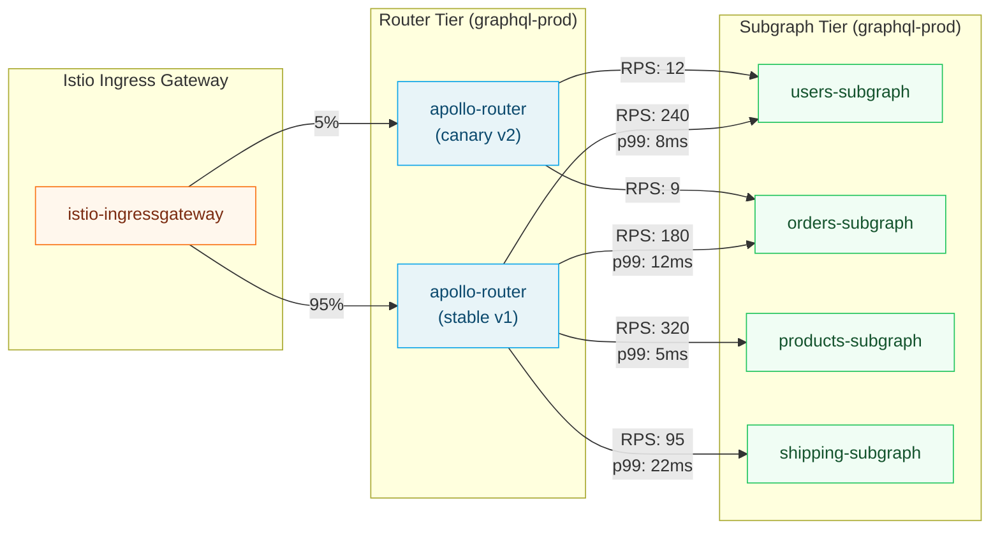

# 01 — Istio + Apollo Router Integration

> **Purpose:** This document is the complete integration guide for running Apollo Router and
> federated subgraphs inside an Istio service mesh. It covers every Istio resource type relevant
> to GraphQL deployments — VirtualService for traffic shaping and canary rollouts, DestinationRule
> for connection pool tuning and circuit breaking, PeerAuthentication for mTLS enforcement,
> AuthorizationPolicy for zero-trust access control, telemetry integration with OTel, and Kiali
> for service graph visualization enriched with GraphQL operation context.

---

## Namespace and Injection Setup

All router and subgraph workloads must run in a namespace with Istio sidecar injection enabled.
Label the namespace before deploying any pods:

```bash
kubectl create namespace graphql-prod
kubectl label namespace graphql-prod istio-injection=enabled
```

For namespaces that already have pods without sidecars, rolling restart picks up injection:

```bash
kubectl rollout restart deployment -n graphql-prod
```

Verify injection is active:

```bash
kubectl get pods -n graphql-prod -o jsonpath='{range .items[*]}{.metadata.name}{"\t"}{range .spec.containers[*]}{.name}{" "}{end}{"\n"}{end}'
# Every pod should list: apollo-router istio-proxy
```

---

## Sidecar Injection Annotations

For workloads that require specific sidecar configuration, use pod-level annotations. The Apollo
Router requires HTTP/2 upstream connections to subgraphs; Istio's Envoy sidecar handles this
automatically when the subgraph service uses `appProtocol: h2c` or when the router declares
the port protocol.

```yaml
# router-deployment.yaml
apiVersion: apps/v1
kind: Deployment
metadata:
  name: apollo-router
  namespace: graphql-prod
spec:
  replicas: 3
  selector:
    matchLabels:
      app: apollo-router
      version: v1
  template:
    metadata:
      labels:
        app: apollo-router
        version: v1
      annotations:
        # Exclude metrics port from Envoy interception so Prometheus can scrape directly
        traffic.sidecar.istio.io/excludeInboundPorts: "9090"
        # Set Envoy proxy resource limits
        sidecar.istio.io/proxyCPU: "100m"
        sidecar.istio.io/proxyMemory: "128Mi"
        # Enable access logging for audit (uses OTel OTLP format)
        sidecar.istio.io/userVolumeMount: '[{"name":"router-config","mountPath":"/app/config"}]'
    spec:
      containers:
        - name: apollo-router
          image: ghcr.io/apollographql/router:v1.40.0
          ports:
            - containerPort: 4000
              name: http-graphql
            - containerPort: 9090
              name: metrics
          env:
            - name: APOLLO_GRAPH_REF
              valueFrom:
                secretKeyRef:
                  name: apollo-keys
                  key: graph-ref
            - name: APOLLO_KEY
              valueFrom:
                secretKeyRef:
                  name: apollo-keys
                  key: router-key
          readinessProbe:
            httpGet:
              path: /health/ready
              port: 4000
            initialDelaySeconds: 5
            periodSeconds: 10
          livenessProbe:
            httpGet:
              path: /health/live
              port: 4000
            initialDelaySeconds: 10
            periodSeconds: 30
```

```yaml
# users-subgraph-deployment.yaml
apiVersion: apps/v1
kind: Deployment
metadata:
  name: users-subgraph
  namespace: graphql-prod
spec:
  replicas: 2
  selector:
    matchLabels:
      app: users-subgraph
      version: v1
  template:
    metadata:
      labels:
        app: users-subgraph
        version: v1
      annotations:
        # Tell Envoy this service speaks HTTP/2 cleartext upstream
        sidecar.istio.io/userVolume: '[]'
        traffic.sidecar.istio.io/excludeInboundPorts: "9090"
    spec:
      containers:
        - name: users-subgraph
          image: your-registry/users-subgraph:1.5.0
          ports:
            - containerPort: 4001
              name: http-graphql
```

---

## VirtualService for Traffic Splitting (Canary Router Deployments)

When deploying a new Apollo Router version, split traffic between the stable and canary versions
using a `VirtualService`. This enables 5%/95% canary validation before full promotion.

```yaml
# router-virtualservice.yaml
apiVersion: networking.istio.io/v1beta1
kind: VirtualService
metadata:
  name: apollo-router
  namespace: graphql-prod
spec:
  hosts:
    - apollo-router          # Matches the Kubernetes Service name
  http:
    # Route based on client header for internal testing (highest priority)
    - match:
        - headers:
            x-router-canary:
              exact: "true"
      route:
        - destination:
            host: apollo-router
            subset: canary
          weight: 100
      timeout: 30s
      retries:
        attempts: 0          # Disable retries for header-matched canary (test path)

    # Default traffic: 95% stable, 5% canary
    - route:
        - destination:
            host: apollo-router
            subset: stable
          weight: 95
        - destination:
            host: apollo-router
            subset: canary
          weight: 5
      timeout: 30s
      retries:
        attempts: 2
        perTryTimeout: 10s
        retryOn: "connect-failure,refused-stream,gateway-error"
        # IMPORTANT: Do not retry on 5xx — GraphQL returns 200 for errors.
        # Retrying on gateway-error catches Envoy-level failures (502, 503, 504)
        # which indicate the router pod itself is not reachable.
```

The two router subsets are defined in the `DestinationRule`:

```yaml
# router-destinationrule.yaml
apiVersion: networking.istio.io/v1beta1
kind: DestinationRule
metadata:
  name: apollo-router
  namespace: graphql-prod
spec:
  host: apollo-router
  trafficPolicy:
    connectionPool:
      http:
        http2MaxRequests: 2000
        maxRequestsPerConnection: 100
        h2UpgradePolicy: UPGRADE     # Upgrade to HTTP/2 when the server supports it
      tcp:
        maxConnections: 500
        connectTimeout: 5s
        tcpKeepalive:
          interval: 30s
          time: 300s
    outlierDetection:
      consecutive5xxErrors: 5
      interval: 10s
      baseEjectionTime: 30s
      maxEjectionPercent: 50        # Never eject more than half the pool
  subsets:
    - name: stable
      labels:
        version: v1
      trafficPolicy:
        connectionPool:
          http:
            http2MaxRequests: 1800
    - name: canary
      labels:
        version: v2
      trafficPolicy:
        connectionPool:
          http:
            http2MaxRequests: 200    # Lower limit for canary subset
```

---

## VirtualService for Subgraph Traffic

The Apollo Router calls subgraphs directly. Configure `VirtualService` for each subgraph to
apply per-subgraph timeouts and retry policies. GraphQL queries are safe to retry; mutations
are not — configure accordingly at the subgraph level.

```yaml
# users-subgraph-virtualservice.yaml
apiVersion: networking.istio.io/v1beta1
kind: VirtualService
metadata:
  name: users-subgraph
  namespace: graphql-prod
spec:
  hosts:
    - users-subgraph
  http:
    # Match mutation-equivalent paths — in Federation, all requests are POST
    # to /graphql. Mutations are not idempotent: disable retries.
    # The Apollo Router sets x-graphql-operation-type: mutation for mutation subgraph fetches.
    - match:
        - headers:
            x-graphql-operation-type:
              exact: "mutation"
      route:
        - destination:
            host: users-subgraph
            subset: current
      timeout: 15s
      retries:
        attempts: 0          # Zero retries for mutations

    # Query and subscription fetches: retries are safe
    - route:
        - destination:
            host: users-subgraph
            subset: current
      timeout: 10s
      retries:
        attempts: 3
        perTryTimeout: 3s
        retryOn: "connect-failure,refused-stream,retriable-status-codes"
        retryRemoteStatuses: "503,504"   # Only retry on explicitly retriable HTTP codes
```

> Note: The `x-graphql-operation-type` header must be set by the Apollo Router using a custom
> plugin or Rhai script. This is not set automatically. See the traffic management section in
> [04-traffic-management.md](./04-traffic-management.md) for the Rhai implementation.

---

## DestinationRule for Subgraph Connection Pool Tuning

Each subgraph has different resource characteristics. Tune connection pools per-subgraph rather
than relying on global defaults.

```yaml
# subgraph-destinationrules.yaml
apiVersion: networking.istio.io/v1beta1
kind: DestinationRule
metadata:
  name: users-subgraph
  namespace: graphql-prod
spec:
  host: users-subgraph
  trafficPolicy:
    connectionPool:
      http:
        http2MaxRequests: 500         # Max concurrent HTTP/2 requests in flight
        maxRequestsPerConnection: 50  # Force connection recycling to spread load
        h2UpgradePolicy: UPGRADE
      tcp:
        maxConnections: 100
        connectTimeout: 3s
    outlierDetection:
      consecutiveGatewayErrors: 3    # Eject after 3 consecutive 502/503/504 responses
      consecutive5xxErrors: 0        # Disabled: GraphQL returns 200 with errors in body
      interval: 10s
      baseEjectionTime: 60s
      maxEjectionPercent: 33         # Never eject more than 1 of 3 replicas
      minHealthPercent: 67           # Keep at least 67% of endpoints healthy
  subsets:
    - name: current
      labels:
        version: v1
---
apiVersion: networking.istio.io/v1beta1
kind: DestinationRule
metadata:
  name: orders-subgraph
  namespace: graphql-prod
spec:
  host: orders-subgraph
  trafficPolicy:
    connectionPool:
      http:
        http2MaxRequests: 300         # Orders is write-heavy, lower concurrency
        maxRequestsPerConnection: 25
        h2UpgradePolicy: UPGRADE
      tcp:
        maxConnections: 75
        connectTimeout: 3s
    outlierDetection:
      consecutiveGatewayErrors: 3
      interval: 15s
      baseEjectionTime: 90s          # Longer ejection for write-path subgraph
      maxEjectionPercent: 25
  subsets:
    - name: current
      labels:
        version: v1
```

---

## PeerAuthentication for mTLS Enforcement

Enable strict mTLS across the entire `graphql-prod` namespace. This means all pod-to-pod
communication requires valid mesh certificates — no plaintext HTTP is permitted.

```yaml
# graphql-peer-authentication.yaml
apiVersion: security.istio.io/v1beta1
kind: PeerAuthentication
metadata:
  name: graphql-prod-mtls
  namespace: graphql-prod
spec:
  mtls:
    mode: STRICT    # Reject all non-mTLS connections within the namespace
```

Exception for health check ports (kubelets and load balancers send plain HTTP):

```yaml
# router-health-port-permissive.yaml
apiVersion: security.istio.io/v1beta1
kind: PeerAuthentication
metadata:
  name: apollo-router-health
  namespace: graphql-prod
spec:
  selector:
    matchLabels:
      app: apollo-router
  mtls:
    mode: STRICT      # Default: strict mTLS
  portLevelMtls:
    "4000":
      mode: PERMISSIVE  # Allow Kubernetes health probes (plain HTTP from kubelet)
```

> Using `PERMISSIVE` only on port 4000 for the router means GraphQL traffic from clients
> through the Istio Ingress Gateway — which already terminates TLS and re-establishes mTLS
> to the router sidecar — is not affected. Permissive mode on a port does not weaken
> service-to-service mTLS; it only allows the non-mesh health probe traffic.

---

## AuthorizationPolicy for Zero-Trust Access Control

Enforce that only the Apollo Router may call subgraph endpoints. All other sources — including
other subgraphs calling each other directly — are denied. This prevents subgraph bypasses and
enforces the router as the single query execution entry point.

```yaml
# subgraph-authz-policy.yaml

# Deny all traffic to subgraphs by default
apiVersion: security.istio.io/v1beta1
kind: AuthorizationPolicy
metadata:
  name: deny-all-subgraphs
  namespace: graphql-prod
spec:
  selector:
    matchLabels:
      tier: subgraph
  action: DENY
  rules:
    - {}   # Deny all (no conditions = match everything)

---
# Allow only the Apollo Router service account to reach subgraphs
apiVersion: security.istio.io/v1beta1
kind: AuthorizationPolicy
metadata:
  name: allow-router-to-subgraphs
  namespace: graphql-prod
spec:
  selector:
    matchLabels:
      tier: subgraph
  action: ALLOW
  rules:
    - from:
        - source:
            principals:
              # SPIFFE identity of the router's service account
              - "cluster.local/ns/graphql-prod/sa/apollo-router"
      to:
        - operation:
            methods: ["POST"]
            paths: ["/graphql", "/_service", "/_entities"]
      when:
        - key: "request.headers[content-type]"
          values: ["application/json", "application/graphql+json"]
```

Subgraphs are labeled with `tier: subgraph`:

```yaml
# Add to each subgraph's pod template labels:
labels:
  app: users-subgraph
  tier: subgraph
  version: v1
```

Verify authorization policy enforcement:

```bash
# This should be DENIED (curl from a non-router pod)
kubectl exec -n graphql-prod deploy/orders-subgraph -- \
  curl -s -o /dev/null -w "%{http_code}" \
  http://users-subgraph:4001/graphql \
  -H "Content-Type: application/json" \
  -d '{"query":"{ _service { sdl } }"}'
# Expected: 403

# This should be ALLOWED (curl with router service account token)
# In practice: the router's Envoy sidecar presents the SVID automatically.
```

---

## Istio Telemetry Integration with OTel

Istio generates Envoy sidecar spans for every proxied request. The Apollo Router OTel plugin
generates spans with GraphQL-specific attributes (operation name, field paths, etc.). Both must
be exported to the same trace backend without creating duplicate root spans.

The key: Envoy propagates the W3C TraceContext (`traceparent` / `tracestate`) headers downstream.
The Apollo Router reads these headers and creates a child span — the router span becomes a child
of the Envoy ingress span. Configure both to use W3C TraceContext:

```yaml
# istio-telemetry.yaml — configure Envoy to use W3C TraceContext propagation
apiVersion: telemetry.istio.io/v1alpha1
kind: Telemetry
metadata:
  name: graphql-tracing
  namespace: graphql-prod
spec:
  tracing:
    - providers:
        - name: otel-tracing    # References the mesh-level OTel provider
      randomSamplingPercentage: 10.0    # 10% sampling at mesh level
      customTags:
        # Propagate these request headers as span tags for correlation
        graphql_operation_name:
          header:
            name: "x-graphql-operation-name"
            defaultValue: "unknown"
        graphql_operation_type:
          header:
            name: "x-graphql-operation-type"
            defaultValue: "unknown"
```

Configure the Istio mesh-level OTel provider in `IstioOperator` or `MeshConfig`:

```yaml
# meshconfig-otel-provider.yaml
apiVersion: install.istio.io/v1alpha1
kind: IstioOperator
metadata:
  namespace: istio-system
spec:
  meshConfig:
    extensionProviders:
      - name: otel-tracing
        opentelemetry:
          service: otel-collector.observability.svc.cluster.local
          port: 4317
          resource_detectors:
            environment: {}
    defaultConfig:
      tracing:
        sampling: 10.0
        zipkin:
          address: ""     # Clear the default Zipkin config
      # Use W3C TraceContext propagation (not B3)
      proxyStatsMatcher:
        inclusionRegexps:
          - ".*graphql.*"
```

Apollo Router OTel configuration (in `router.yaml`) to participate in the same trace:

```yaml
# router.yaml — OTel section
telemetry:
  tracing:
    common:
      sampler: 0.1             # 10% sampling, matches Istio mesh sampling rate
      propagation:
        trace_context: true    # W3C TraceContext — matches Istio Envoy config
        b3: false              # Disable B3 to avoid conflicting headers
      resource:
        service.name: "apollo-router"
        service.namespace: "graphql-prod"
    exporters:
      otlp:
        enabled: true
        endpoint: http://otel-collector.observability.svc.cluster.local:4317
        protocol: grpc
  metrics:
    common:
      attributes:
        graphql.operation.name: true
        graphql.operation.type: true
    exporters:
      prometheus:
        enabled: true
        listen: 0.0.0.0:9090
        path: /metrics
```

### Avoiding Double-Counting Traces

The risk: if both the Envoy sidecar and the Apollo Router export spans with `sampler: always`,
every request produces two root-level spans in your trace backend — one from Envoy, one from
the router application.

The correct model:

```
Envoy Ingress Span (Istio, W3C propagated)
  └── Apollo Router Span (router OTel plugin, child of Envoy span)
        ├── Subgraph Fetch: users (router span)
        │     └── Envoy Egress Span (Istio, child of router fetch span)
        │           └── Users Subgraph App Span (subgraph OTel plugin)
        └── Subgraph Fetch: orders (router span)
              └── Envoy Egress Span (Istio)
                    └── Orders Subgraph App Span
```

This hierarchy is automatic when:
1. Istio Envoy uses W3C TraceContext propagation
2. Apollo Router reads `traceparent` from incoming requests
3. Apollo Router passes `traceparent` on outgoing subgraph fetch requests
4. Subgraph applications read `traceparent` and create child spans

---

## Kiali Service Graph for GraphQL Operation Flow

Kiali reads Istio telemetry and builds a service graph. By default, it shows traffic by
service and HTTP method — which for GraphQL is always `POST /graphql` with no useful
differentiation.

Enrich Kiali with GraphQL operation names by injecting them as request headers from the
Apollo Router. Istio picks up these headers via `Telemetry` custom tags (shown above),
and Kiali displays them in its workload detail panels.

```yaml
# kiali-config.yaml — additional Kiali configuration
apiVersion: kiali.io/v1alpha1
kind: Kiali
metadata:
  name: kiali
  namespace: istio-system
spec:
  external_services:
    prometheus:
      url: "http://prometheus.observability:9090"
    grafana:
      url: "http://grafana.observability:3000"
      in_cluster_url: "http://grafana.observability:3000"
    tracing:
      url: "http://jaeger.observability:16686"
      in_cluster_url: "http://jaeger.observability:16686"
  auth:
    strategy: "openid"
  deployment:
    # Label graph nodes with GraphQL operation context via custom metric labels
    custom_dashboards:
      enabled: true
```

Kiali shows the graphql-prod namespace service graph:



---

## Gateway Configuration for External Traffic

The Istio `Gateway` and `VirtualService` for the public-facing Apollo Router endpoint:

```yaml
# router-gateway.yaml
apiVersion: networking.istio.io/v1beta1
kind: Gateway
metadata:
  name: graphql-gateway
  namespace: graphql-prod
spec:
  selector:
    istio: ingressgateway
  servers:
    - port:
        number: 443
        name: https
        protocol: HTTPS
      tls:
        mode: SIMPLE
        credentialName: graphql-tls-cert    # Kubernetes Secret with TLS cert
      hosts:
        - "graphql.api.example.com"
    - port:
        number: 80
        name: http
        protocol: HTTP
      tls:
        httpsRedirect: true    # Redirect all HTTP to HTTPS
      hosts:
        - "graphql.api.example.com"
---
apiVersion: networking.istio.io/v1beta1
kind: VirtualService
metadata:
  name: graphql-gateway-routing
  namespace: graphql-prod
spec:
  hosts:
    - "graphql.api.example.com"
  gateways:
    - graphql-gateway
  http:
    - match:
        - uri:
            exact: "/graphql"
        - uri:
            exact: "/health/ready"
        - uri:
            exact: "/health/live"
      route:
        - destination:
            host: apollo-router
            port:
              number: 4000
      corsPolicy:
        allowOrigins:
          - exact: "https://app.example.com"
          - regex: "https://.*\\.example\\.com"
        allowMethods: ["POST", "GET", "OPTIONS"]
        allowHeaders:
          - "Authorization"
          - "Content-Type"
          - "Apollo-Require-Preflight"
        maxAge: "24h"
```

---

## Troubleshooting Common Istio + GraphQL Issues

### Issue: mTLS handshake failures after enabling STRICT mode

Symptom: subgraph calls return `ECONNRESET` or `upstream connect error`. Diagnosis:

```bash
# Check if the destination workload has a sidecar injected
kubectl get pods -n graphql-prod -o wide
kubectl describe pod <users-subgraph-pod> -n graphql-prod | grep -A5 "Containers:"

# Check effective PeerAuthentication for the pod
istioctl x describe pod <users-subgraph-pod-name>.graphql-prod

# Check Envoy sidecar config for the router
istioctl proxy-config listener <apollo-router-pod>.graphql-prod

# Check for plaintext traffic attempts
kubectl logs <apollo-router-pod> -c istio-proxy -n graphql-prod | grep -i "tls"
```

Resolution: pods deployed before injection was enabled lack sidecars. Rolling restart:

```bash
kubectl rollout restart deployment/users-subgraph -n graphql-prod
```

### Issue: AuthorizationPolicy denies legitimate router traffic

Symptom: subgraph calls return HTTP 403. Diagnosis:

```bash
# Check which policy is denying
kubectl get authorizationpolicy -n graphql-prod
istioctl analyze -n graphql-prod

# Check Envoy access log on the subgraph sidecar
kubectl logs <users-subgraph-pod> -c istio-proxy -n graphql-prod | tail -50 | grep "403\|RBAC"

# Verify the router's service account SVID
kubectl exec <apollo-router-pod> -c istio-proxy -n graphql-prod -- \
  pilot-agent request GET /certs | jq '.ca_cert[0].identity'
```

### Issue: Duplicate spans in Jaeger/Tempo

Symptom: every request shows two root spans. Diagnosis: the router's OTel exporter and Istio's
Envoy are both exporting root spans because `traceparent` propagation is not configured
consistently.

Verify propagation format:

```bash
# Check Istio mesh config propagation
kubectl get configmap -n istio-system istio -o jsonpath='{.data.mesh}' | grep -i "tracing\|propagation"

# Check Apollo Router router.yaml
kubectl get configmap -n graphql-prod apollo-router-config -o yaml | grep -A10 "propagation"
```

Both must use `trace_context: true` (W3C) and `b3: false`. See the OTel section above.

---

## References

- [Istio VirtualService Reference](https://istio.io/latest/docs/reference/config/networking/virtual-service/)
- [Istio DestinationRule Reference](https://istio.io/latest/docs/reference/config/networking/destination-rule/)
- [Istio Security API Reference](https://istio.io/latest/docs/reference/config/security/)
- [Istio Telemetry API](https://istio.io/latest/docs/reference/config/telemetry/)
- [Apollo Router OTel Configuration](https://www.apollographql.com/docs/router/configuration/telemetry/tracing/)
- [Kiali Documentation](https://kiali.io/docs/)
- [SPIFFE/SPIRE Documentation](https://spiffe.io/docs/latest/)
