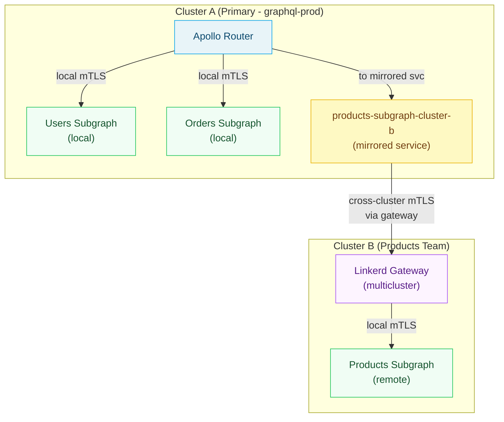

# 02 — Linkerd + GraphQL Integration

> **Purpose:** This document covers the complete integration of Linkerd with Apollo Router and
> federated subgraphs. Linkerd's zero-configuration mTLS, per-route ServiceProfile metrics, and
> retry budgets make it an operationally simpler choice than Istio for teams that want mesh
> security and observability without Istio's configuration complexity. This document explains
> how ServiceProfile CRDs map to GraphQL operations, how to configure retries safely for
> idempotency-aware GraphQL traffic, and how Linkerd multicluster enables federated subgraphs
> spanning Kubernetes clusters.

---

## Why Linkerd for GraphQL

Linkerd makes three architectural decisions that align well with GraphQL deployments:

**mTLS by default.** Every injected workload gets automatic mTLS without any `PeerAuthentication`
or policy resources. The Linkerd control plane issues certificates from its built-in CA and
rotates them on a 24-hour cycle. Zero configuration means zero misconfiguration risk.

**Retry budgets over retry counts.** Linkerd retries are governed by a budget (e.g., allow up to
20% of requests to be retries) rather than a fixed count per request. This prevents retry storms
when a subgraph degrades: if many requests are failing simultaneously, retries are throttled
automatically rather than amplifying load.

**ServiceProfile per-route metrics.** The `ServiceProfile` CRD tells Linkerd how to decompose
HTTP traffic into named routes. For a GraphQL endpoint that receives all traffic as `POST /graphql`,
this means using `x-graphql-operation-name` or the request body to classify traffic — enabling
per-operation success rates, latency histograms, and effective retry configuration.

---

## Namespace Injection

Label namespaces for automatic proxy injection:

```bash
kubectl create namespace graphql-prod
kubectl annotate namespace graphql-prod linkerd.io/inject=enabled

# Verify injection
kubectl get namespace graphql-prod -o jsonpath='{.metadata.annotations}'
```

Pod-level injection annotation (if namespace-level is not used):

```yaml
# In pod template metadata:
annotations:
  linkerd.io/inject: enabled
  # Optional: set proxy resource limits
  config.linkerd.io/proxy-cpu-request: "50m"
  config.linkerd.io/proxy-memory-request: "64Mi"
  config.linkerd.io/proxy-cpu-limit: "200m"
  config.linkerd.io/proxy-memory-limit: "256Mi"
  # Exclude metrics port from proxy interception
  config.linkerd.io/skip-inbound-ports: "9090"
```

Verify the sidecar is injected and mTLS is active:

```bash
# Check injection status
linkerd check --proxy -n graphql-prod

# Verify mTLS between router and users-subgraph
linkerd viz edges pod -n graphql-prod
# Output shows: apollo-router -> users-subgraph [mTLS]
```

---

## ServiceProfile for Per-Operation Metrics

A `ServiceProfile` is a Linkerd CRD that defines the expected routes for a service. Linkerd
uses ServiceProfiles to generate per-route metrics (success rate, request volume, latency
histogram) and to configure retries and timeouts per route.

For GraphQL, all requests arrive as `POST /graphql`. The raw Linkerd metrics without a
ServiceProfile show only `POST /graphql` — no operation-level visibility. With a ServiceProfile
and request-body-aware route classification (via Linkerd's `TrafficSpec` extension or header
matching), you get per-operation metrics.

The practical approach: inject the GraphQL operation name into an HTTP header from the Apollo
Router (using a Rhai script or coprocessor), then match on that header in the ServiceProfile.

**Step 1: Apollo Router injects operation name header (router.yaml Rhai script):**

```yaml
# router.yaml
plugins:
  rhai:
    scripts: /app/scripts

# scripts/inject-operation-header.rhai
fn supergraph_service(service) {
  let request_callback = |request| {
    let body = request.body;
    if body != () {
      let op_name = body["operationName"];
      if op_name != () && op_name != "" {
        request.headers["x-graphql-operation-name"] = op_name;
      }
      let query = body["query"];
      if query != () {
        // Detect mutation vs query from query string (simplified)
        if query.contains("mutation ") || query.starts_with("mutation{") {
          request.headers["x-graphql-operation-type"] = "mutation";
        } else {
          request.headers["x-graphql-operation-type"] = "query";
        }
      }
    }
  };
  service.map_request(request_callback);
}
```

**Step 2: ServiceProfile for users-subgraph with named routes:**

```yaml
# users-subgraph-serviceprofile.yaml
apiVersion: linkerd.io/v1alpha2
kind: ServiceProfile
metadata:
  name: users-subgraph.graphql-prod.svc.cluster.local
  namespace: graphql-prod
spec:
  # Routes define how Linkerd classifies incoming requests
  routes:
    # Each GraphQL operation becomes a named route
    - name: "GetUser"
      condition:
        method: POST
        pathRegex: /graphql
        any:
          - headers:
              x-graphql-operation-name:
                exact: "GetUser"
      timeout: 5s
      isRetryable: true    # Queries are safe to retry

    - name: "GetUserOrders"
      condition:
        method: POST
        pathRegex: /graphql
        any:
          - headers:
              x-graphql-operation-name:
                exact: "GetUserOrders"
      timeout: 8s
      isRetryable: true

    - name: "UpdateUserProfile"
      condition:
        method: POST
        pathRegex: /graphql
        any:
          - headers:
              x-graphql-operation-name:
                exact: "UpdateUserProfile"
      timeout: 10s
      isRetryable: false   # Mutations are NOT safe to retry

    - name: "CreateUser"
      condition:
        method: POST
        pathRegex: /graphql
        any:
          - headers:
              x-graphql-operation-name:
                exact: "CreateUser"
      timeout: 10s
      isRetryable: false

    # Federation internal routes
    - name: "_entities"
      condition:
        method: POST
        pathRegex: /graphql
        any:
          - headers:
              x-graphql-operation-name:
                exact: "_entities"
      timeout: 5s
      isRetryable: true    # Entity fetches are idempotent

    - name: "_service"
      condition:
        method: POST
        pathRegex: /_service
      timeout: 3s
      isRetryable: true

    # Default catch-all for unclassified operations
    - name: "graphql-unknown"
      condition:
        method: POST
        pathRegex: /graphql
      timeout: 10s
      isRetryable: false   # Conservative default for unknown operations

  # Retry budget: allow up to 20% of requests to be retries
  # over a 10-second window, with a minimum of 10 retries/second
  retryBudget:
    retryRatio: 0.2       # 20% of requests can be retries
    minRetriesPerSecond: 10
    ttl: 10s
```

With this ServiceProfile, Linkerd Viz shows per-operation metrics:

```
ROUTE                  SUCCESS   RPS     LATENCY_P50  LATENCY_P95  LATENCY_P99
GetUser                99.8%     145/s   3ms          8ms          22ms
GetUserOrders          98.2%     87/s    12ms         45ms         120ms
UpdateUserProfile      99.5%     23/s    18ms         55ms         140ms
CreateUser             99.1%     8/s     25ms         80ms         200ms
_entities              99.9%     312/s   2ms          5ms          12ms
graphql-unknown        97.3%     12/s    15ms         60ms         180ms
```

---

## ServiceProfile for Apollo Router

The Apollo Router service also benefits from a ServiceProfile — it enables Linkerd to show
per-operation latency for the public-facing endpoint:

```yaml
# router-serviceprofile.yaml
apiVersion: linkerd.io/v1alpha2
kind: ServiceProfile
metadata:
  name: apollo-router.graphql-prod.svc.cluster.local
  namespace: graphql-prod
spec:
  routes:
    - name: "graphql-query"
      condition:
        method: POST
        pathRegex: /graphql
        any:
          - headers:
              x-graphql-operation-type:
                exact: "query"
      timeout: 30s
      isRetryable: false    # Router-level retries are not safe (router already retries internally)

    - name: "graphql-mutation"
      condition:
        method: POST
        pathRegex: /graphql
        any:
          - headers:
              x-graphql-operation-type:
                exact: "mutation"
      timeout: 30s
      isRetryable: false

    - name: "health"
      condition:
        method: GET
        pathRegex: /health/.*
      timeout: 2s
      isRetryable: true

  retryBudget:
    retryRatio: 0.0         # No retries at router service level — router manages its own
    minRetriesPerSecond: 0
    ttl: 10s
```

---

## Linkerd Retries vs Apollo Router Retry Config

Linkerd and Apollo Router each have retry mechanisms. They must not both be active for the same
traffic class simultaneously — double retries amplify load on degraded subgraphs.

**The recommended split:**

| Traffic Type | Retry at Linkerd Level | Retry at Apollo Router Level |
|---|---|---|
| Query subgraph fetches | Disabled (set `isRetryable: false` in ServiceProfile) | Enabled (Apollo Router `traffic_shaping`) |
| Mutation subgraph fetches | Disabled at both layers | Disabled at both layers |
| `_entities` fetches | Can be enabled (idempotent) | Disabled (Apollo Router retries these via query retry) |
| Health checks | Enabled at Linkerd | Not applicable |

Apollo Router traffic shaping configuration for query retries (in `router.yaml`):

```yaml
# router.yaml — traffic shaping for subgraph retries
traffic_shaping:
  all:
    deduplicate_variables: true   # Deduplicate identical subgraph fetches in a single query plan

  subgraphs:
    users:
      apq_enabled: true
      experimental_retry:
        min_per_sec: 5
        ttl: 10s
        retry_mutations: false    # NEVER retry mutations
        backoff:
          min_ms: 100
          max_ms: 2000
      timeout: 10s

    orders:
      apq_enabled: true
      experimental_retry:
        min_per_sec: 3
        ttl: 10s
        retry_mutations: false
        backoff:
          min_ms: 200
          max_ms: 3000
      timeout: 15s

    products:
      apq_enabled: true
      experimental_retry:
        min_per_sec: 10
        ttl: 10s
        retry_mutations: false
        backoff:
          min_ms: 50
          max_ms: 1000
      timeout: 8s
```

---

## TrafficSplit for Canary Subgraph Rollout

Linkerd's `TrafficSplit` (via the SMI specification) enables weighted traffic splitting between
two versions of a subgraph. This is the Linkerd equivalent of Istio's `VirtualService` traffic
splitting — simpler but less expressive (weight-based only, no header matching).

**Canary rollout of users-subgraph v2:**

Step 1: Deploy v2 alongside v1, with a separate service:

```yaml
# users-subgraph-v2-deployment.yaml
apiVersion: apps/v1
kind: Deployment
metadata:
  name: users-subgraph-v2
  namespace: graphql-prod
spec:
  replicas: 1
  selector:
    matchLabels:
      app: users-subgraph
      version: v2
  template:
    metadata:
      labels:
        app: users-subgraph
        version: v2
      annotations:
        linkerd.io/inject: enabled
    spec:
      containers:
        - name: users-subgraph
          image: your-registry/users-subgraph:2.0.0
          ports:
            - containerPort: 4001
---
# Separate service for v2 (needed for TrafficSplit)
apiVersion: v1
kind: Service
metadata:
  name: users-subgraph-v2
  namespace: graphql-prod
spec:
  selector:
    app: users-subgraph
    version: v2
  ports:
    - port: 4001
      targetPort: 4001
```

Step 2: Create the `TrafficSplit`:

```yaml
# users-subgraph-trafficsplit.yaml
apiVersion: split.smi-spec.io/v1alpha1
kind: TrafficSplit
metadata:
  name: users-subgraph-canary
  namespace: graphql-prod
spec:
  service: users-subgraph      # The main service the Apollo Router calls
  backends:
    - service: users-subgraph       # v1 stable
      weight: 900m                  # 90% (millicores notation: 1000m = 100%)
    - service: users-subgraph-v2    # v2 canary
      weight: 100m                  # 10%
```

Step 3: Monitor the canary in Linkerd Viz:

```bash
# Watch per-backend success rates in real time
linkerd viz stat trafficsplit/users-subgraph-canary -n graphql-prod --from deploy/apollo-router

# Output:
# NAME                      WEIGHT   SUCCESS   RPS     LATENCY_P50
# users-subgraph            90%      99.8%     145/s   3ms
# users-subgraph-v2         10%      98.1%     16/s    4ms
```

Step 4: Promote by shifting weight, then remove the split:

```bash
# Shift to 50/50
kubectl patch trafficsplit users-subgraph-canary -n graphql-prod \
  --type merge --patch '{"spec":{"backends":[{"service":"users-subgraph","weight":"500m"},{"service":"users-subgraph-v2","weight":"500m"}]}}'

# Full promotion: remove TrafficSplit and update main Deployment image
kubectl delete trafficsplit users-subgraph-canary -n graphql-prod
kubectl set image deployment/users-subgraph users-subgraph=your-registry/users-subgraph:2.0.0 -n graphql-prod
```

---

## Linkerd mTLS: Automatic vs Istio Configuration

The key operational difference between Linkerd and Istio mTLS:

| Aspect | Linkerd | Istio |
|---|---|---|
| Default mTLS | On for all injected pods — zero config | Off; requires `PeerAuthentication: STRICT` |
| Certificate issuance | Linkerd control plane CA (built-in) | Istiod CA (built-in) or external CA |
| Certificate rotation | 24h by default, configurable | 24h by default |
| Identity | `<service-account>.<namespace>.serviceaccount.identity.<trust-domain>` | SPIFFE URI via Istiod |
| Access control | `Server` + `ServerAuthorization` (Linkerd v2.12+) | `AuthorizationPolicy` |
| External CA (SPIRE) | Supported via cert-manager + SPIRE | Supported natively via `EXTERNAL_CA` |

Verify mTLS is active without any configuration:

```bash
# Check mTLS status for all edges in the namespace
linkerd viz edges -n graphql-prod

# Output — all edges should show 'secured' (mTLS):
# SRC                DEST               SECURED
# apollo-router      users-subgraph     secured
# apollo-router      orders-subgraph    secured
# apollo-router      products-subgraph  secured
# apollo-router      shipping-subgraph  secured
```

### Server and ServerAuthorization for Zero-Trust

Linkerd v2.12+ added `Server` and `ServerAuthorization` policy resources for fine-grained
access control equivalent to Istio's `AuthorizationPolicy`:

```yaml
# users-subgraph-server.yaml
apiVersion: policy.linkerd.io/v1beta1
kind: Server
metadata:
  name: users-subgraph-graphql
  namespace: graphql-prod
spec:
  podSelector:
    matchLabels:
      app: users-subgraph
  port: 4001
  proxyProtocol: HTTP/2
---
apiVersion: policy.linkerd.io/v1beta1
kind: ServerAuthorization
metadata:
  name: allow-router-to-users
  namespace: graphql-prod
spec:
  server:
    name: users-subgraph-graphql
  client:
    # Only the apollo-router service account may call the users-subgraph server
    meshTLS:
      serviceAccounts:
        - name: apollo-router
          namespace: graphql-prod
```

All other clients attempting to connect to port 4001 on users-subgraph pods receive a
TCP reset, regardless of network-level connectivity.

---

## Linkerd Viz Dashboard for GraphQL Service Health

Linkerd Viz provides a built-in dashboard and CLI for real-time service health. For GraphQL,
the most useful views are:

**Namespace-level health:**

```bash
linkerd viz stat deployment -n graphql-prod
# Shows: success rate, RPS, p50/p95/p99 latency for each deployment
```

**Route-level health (from ServiceProfile):**

```bash
linkerd viz routes deploy/users-subgraph -n graphql-prod
# Shows per-route metrics from the ServiceProfile
```

**Traffic flow from the router:**

```bash
linkerd viz top deploy/apollo-router -n graphql-prod
# Shows live request breakdown by route and destination
```

**Tap: live request inspection:**

```bash
# Inspect live traffic from router to users-subgraph (first 10 requests)
linkerd viz tap deploy/apollo-router -n graphql-prod \
  --to deploy/users-subgraph \
  --output json | head -n 10 | jq '.responseInit.http.headers | to_entries[] | select(.key | contains("graphql"))'
```

---

## Linkerd Multicluster for Federated Subgraphs Spanning Clusters

In large organizations, different subgraphs may run in separate Kubernetes clusters — separated
by team, region, or compliance boundary. Linkerd multicluster enables cross-cluster mTLS with
service mirroring, making a remote subgraph appear as a local service to the Apollo Router.



**Setup: Link clusters:**

```bash
# On Cluster A (source), create credentials for Cluster B
linkerd multicluster link --cluster-name cluster-b | kubectl apply -f -

# On Cluster B (target), export the products-subgraph service
kubectl label service products-subgraph -n graphql-prod \
  mirror.linkerd.io/exported=true
```

**Verify the mirrored service appears in Cluster A:**

```bash
kubectl get svc -n graphql-prod | grep cluster-b
# products-subgraph-cluster-b   ClusterIP   10.96.45.12   4003/TCP
```

**Apollo Router supergraph config references the mirrored service:**

```yaml
# supergraph.yaml
subgraphs:
  users:
    routing_url: http://users-subgraph.graphql-prod.svc.cluster.local:4001/graphql
  orders:
    routing_url: http://orders-subgraph.graphql-prod.svc.cluster.local:4002/graphql
  products:
    # Mirrored service — looks local to the router, traffic is proxied cross-cluster by Linkerd
    routing_url: http://products-subgraph-cluster-b.graphql-prod.svc.cluster.local:4003/graphql
```

The Apollo Router does not know that `products-subgraph-cluster-b` is remote. Linkerd handles
cross-cluster routing transparently, including mTLS termination and re-establishment at the
gateway boundary.

---

## Observability: Linkerd Prometheus Metrics for GraphQL

Linkerd automatically exports Prometheus metrics. Key metrics for GraphQL operations:

```promql
# Per-route success rate for users-subgraph queries
rate(response_total{namespace="graphql-prod", deployment="users-subgraph", classification="success", route="GetUser"}[5m])
/
rate(response_total{namespace="graphql-prod", deployment="users-subgraph", route="GetUser"}[5m])

# P99 latency for entity fetches across all subgraphs
histogram_quantile(0.99,
  sum by (le, deployment) (
    rate(response_latency_ms_bucket{
      namespace="graphql-prod",
      route="_entities"
    }[5m])
  )
)

# Retry rate (retries / total requests) — should stay below retryBudget.retryRatio
rate(response_total{namespace="graphql-prod", classification="retried"}[5m])
/
rate(response_total{namespace="graphql-prod"}[5m])

# Circuit breaker proxy unavailability
sum by (deployment) (
  rate(response_total{namespace="graphql-prod", classification="failure"}[5m])
)
```

---

## References

- [Linkerd ServiceProfile Reference](https://linkerd.io/2.14/reference/service-profiles/)
- [Linkerd Traffic Split (SMI)](https://linkerd.io/2.14/tasks/canary-release/)
- [Linkerd Multicluster](https://linkerd.io/2.14/tasks/multicluster/)
- [Linkerd Server and ServerAuthorization](https://linkerd.io/2.14/reference/authorization-policy/)
- [Linkerd Viz Metrics](https://linkerd.io/2.14/reference/proxy-metrics/)
- [SMI Specification](https://smi-spec.io/)
