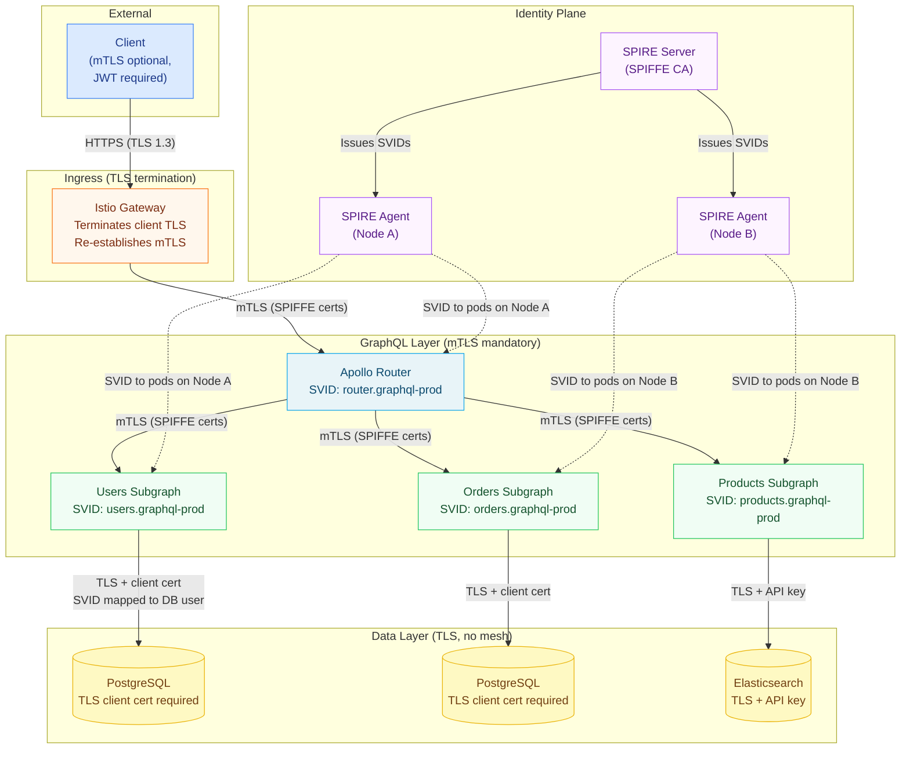

# 03 — mTLS and Zero-Trust Networking for GraphQL

> **Purpose:** This document establishes the zero-trust network architecture for a federated
> GraphQL deployment. It covers mTLS configuration between all components (router, subgraphs,
> and data access layers), SPIFFE/SPIRE for cryptographic workload identity independent of
> the mesh vendor, certificate rotation without downtime, NetworkPolicy as defense-in-depth
> alongside mTLS, egress controls to restrict subgraph outbound traffic to known data sources,
> and audit logging for service-to-service communications at the network layer.

---

## Zero-Trust Principles Applied to GraphQL

Zero-trust networking assumes every network segment is hostile. Traditional perimeter security
("trust inside the cluster, guard the edge") fails in Kubernetes because:

- Pods from different teams share the same cluster network
- Any pod can attempt connections to any other pod by default
- Compromised pods (via CVEs, supply chain attacks) can pivot laterally
- Secret exfiltration often traverses internal cluster networks

For a federated GraphQL deployment, zero-trust means:

1. **Every connection is authenticated.** The Apollo Router authenticates to subgraphs using
   its mesh certificate. Subgraphs verify the router's identity before processing requests.
2. **Every connection is encrypted.** mTLS encrypts all traffic between router and subgraphs,
   even within the same cluster node.
3. **Authorization is explicit.** A `deny-all` default policy blocks all traffic; explicit
   `allow` policies define the permitted communication graph.
4. **Access is least-privilege.** The orders subgraph may only connect to its own database,
   not to the users subgraph database.
5. **Everything is logged.** Every accepted and rejected connection is recorded with the
   workload identities of both parties.

---

## mTLS Architecture for GraphQL



---

## SPIFFE/SPIRE for Workload Identity

SPIFFE (Secure Production Identity Framework for Everyone) provides a standard for workload
identity that is independent of any specific mesh implementation. SPIRE (the SPIFFE Runtime
Environment) is the reference implementation. Using SPIRE alongside Istio or Linkerd decouples
certificate issuance from the mesh vendor, enabling:

- Consistent identity across multiple meshes or non-mesh workloads
- Integration with enterprise PKI (Vault, AWS ACM Private CA, AWS PCA)
- Rotation policies enforced by a central authority rather than per-mesh config
- Identity federation across clusters and clouds

**SPIRE architecture in a GraphQL deployment:**

```yaml
# spire-server-deployment.yaml (abbreviated)
apiVersion: apps/v1
kind: Deployment
metadata:
  name: spire-server
  namespace: spire
spec:
  replicas: 1    # HA: use SPIRE with PostgreSQL backend for multi-replica
  template:
    spec:
      containers:
        - name: spire-server
          image: ghcr.io/spiffe/spire-server:1.9.0
          args:
            - -config
            - /run/spire/config/server.conf
          volumeMounts:
            - name: spire-config
              mountPath: /run/spire/config
              readOnly: true
            - name: spire-data
              mountPath: /run/spire/data
      volumes:
        - name: spire-config
          configMap:
            name: spire-server
        - name: spire-data
          persistentVolumeClaim:
            claimName: spire-data
```

**SPIRE Server configuration:**

```hcl
# spire-server.conf
server {
  bind_address = "0.0.0.0"
  bind_port = "8081"
  socket_path = "/tmp/spire-server/private/api.sock"
  trust_domain = "graphql.example.com"
  data_dir = "/run/spire/data"
  log_level = "INFO"
  audit_log_enabled = true
  ca_ttl = "24h"              # CA certificate lifetime
  default_x509_svid_ttl = "1h"  # SVID lifetime (rotate every hour)
}

plugins {
  DataStore "sql" {
    plugin_data {
      database_type = "postgres"
      connection_string = "host=spire-db.spire.svc port=5432 dbname=spire user=spire sslmode=verify-full"
    }
  }

  KeyManager "disk" {
    plugin_data {
      keys_path = "/run/spire/data/keys.json"
    }
  }

  NodeAttestor "k8s_psat" {
    plugin_data {
      clusters = {
        "production" = {
          service_account_allow_list = ["spire:spire-agent"]
        }
      }
    }
  }

  UpstreamAuthority "aws_pca" {
    plugin_data {
      region = "us-east-1"
      certificate_authority_arn = "arn:aws:acm-pca:us-east-1:123456789012:certificate-authority/xxx"
      ca_signing_template_arn   = "arn:aws:acm-pca:::template/SubordinateCACertificate_PathLen0/V1"
    }
  }
}
```

**SPIRE registration entries for GraphQL workloads:**

```bash
# Register the Apollo Router
kubectl exec -n spire deploy/spire-server -- \
  /opt/spire/bin/spire-server entry create \
  -spiffeID spiffe://graphql.example.com/ns/graphql-prod/sa/apollo-router \
  -parentID spiffe://graphql.example.com/ns/spire/sa/spire-agent \
  -selector k8s:ns:graphql-prod \
  -selector k8s:sa:apollo-router \
  -ttl 3600

# Register users-subgraph
kubectl exec -n spire deploy/spire-server -- \
  /opt/spire/bin/spire-server entry create \
  -spiffeID spiffe://graphql.example.com/ns/graphql-prod/sa/users-subgraph \
  -parentID spiffe://graphql.example.com/ns/spire/sa/spire-agent \
  -selector k8s:ns:graphql-prod \
  -selector k8s:sa:users-subgraph \
  -ttl 3600

# Register orders-subgraph
kubectl exec -n spire deploy/spire-server -- \
  /opt/spire/bin/spire-server entry create \
  -spiffeID spiffe://graphql.example.com/ns/graphql-prod/sa/orders-subgraph \
  -parentID spiffe://graphql.example.com/ns/spire/sa/spire-agent \
  -selector k8s:ns:graphql-prod \
  -selector k8s:sa:orders-subgraph \
  -ttl 3600
```

---

## Certificate Rotation Without Downtime

mTLS certificates must be rotated before they expire. The mesh handles rotation automatically,
but production deployments must validate that rotation does not interrupt GraphQL traffic.

### Rotation Timeline

For a 24-hour certificate TTL (Istio/Linkerd default):

```
Hour 0:    Certificate issued (TTL = 24h)
Hour 22:   Rotation begins (2h before expiry — mesh starts issuing new cert)
Hour 22-23: Both old and new certificates valid simultaneously (overlap window)
Hour 23:   Old certificate retired, new certificate fully propagated
Hour 24:   Old certificate expires (already replaced)
```

The 2-hour overlap window ensures no connection interruption during rotation.

### Configuring Rotation in Istio

```yaml
# istio-operator.yaml
apiVersion: install.istio.io/v1alpha1
kind: IstioOperator
metadata:
  namespace: istio-system
spec:
  meshConfig:
    caCertTTL: 24h            # Certificate lifetime
    caCertGracePeriodRatio: 0.1  # Begin rotation at 10% of TTL remaining (2.4h before expiry)
  components:
    pilot:
      k8s:
        env:
          # Workload certificate lifetime
          - name: CITADEL_WORKLOAD_CERT_TTL
            value: "3600"     # 1 hour
          # Rotation grace period: begin rotation at 20% of TTL remaining (12 min before expiry)
          - name: CITADEL_WORKLOAD_CERT_MIN_GRACE_PERIOD
            value: "600"      # 10 minutes
```

### Validating Rotation Without Downtime

Monitor certificate expiry and rotation events:

```bash
# Check current certificate expiry for all pods
istioctl proxy-config secret <apollo-router-pod>.graphql-prod -o json | \
  jq '.dynamicActiveSecrets[].secret.tlsCertificate.certificateChain.inlineBytes' | \
  base64 -d | openssl x509 -noout -dates

# Monitor Istio cert rotation events
kubectl get events -n istio-system --field-selector reason=CertificateRotation -w

# Linkerd: check certificate expiry
linkerd check --proxy
linkerd identity -n graphql-prod deploy/apollo-router
```

### Rotation Without Downtime: Key Configuration

Three settings prevent downtime during rotation:

1. **Overlap window:** New cert is issued before old cert expires (controlled by grace period ratio).
2. **Hot reload:** The sidecar replaces its certificate without restarting. Both Istio Envoy and
   Linkerd micro-proxy support this by default.
3. **Connection graceful close:** Existing HTTP/2 connections continue on the old certificate
   until naturally closed or after a configurable max connection age. New connections use the
   new certificate.

```yaml
# Istio DestinationRule: limit max connection age to force rotation pickup
apiVersion: networking.istio.io/v1beta1
kind: DestinationRule
metadata:
  name: router-connection-age
  namespace: graphql-prod
spec:
  host: "*.graphql-prod.svc.cluster.local"
  trafficPolicy:
    connectionPool:
      http:
        maxRequestsPerConnection: 1000   # After 1000 requests, recycle connection
        # This ensures connections are periodically rebuilt with fresh certificates
```

---

## NetworkPolicy as Defense-in-Depth

NetworkPolicy operates at the IP/port level and is enforced by the CNI plugin (Cilium, Calico,
etc.) independently of the service mesh. It provides defense-in-depth: even if the mesh policy
layer is misconfigured, NetworkPolicy blocks unauthorized connections at the kernel level.

NetworkPolicy and mesh AuthorizationPolicy are not redundant — they are complementary:

| Layer | Enforced by | Knows about identity | Can inspect L7 |
|---|---|---|---|
| NetworkPolicy (L3/L4) | CNI plugin | No (IP-based only) | No |
| Mesh AuthorizationPolicy (L7) | Sidecar proxy | Yes (SPIFFE identity) | Yes (HTTP headers, paths) |

Both layers together mean an attacker must compromise both the CNI plugin and the mesh proxy
to bypass access controls — a significantly higher bar.

### Default-Deny NetworkPolicy

```yaml
# default-deny-all-graphql-prod.yaml
apiVersion: networking.k8s.io/v1
kind: NetworkPolicy
metadata:
  name: default-deny-all
  namespace: graphql-prod
spec:
  podSelector: {}    # Applies to all pods in namespace
  policyTypes:
    - Ingress
    - Egress
  # No ingress or egress rules = deny all by default
```

### Apollo Router NetworkPolicy

```yaml
# router-networkpolicy.yaml
apiVersion: networking.k8s.io/v1
kind: NetworkPolicy
metadata:
  name: apollo-router
  namespace: graphql-prod
spec:
  podSelector:
    matchLabels:
      app: apollo-router
  policyTypes:
    - Ingress
    - Egress
  ingress:
    # Accept traffic from the Istio Ingress Gateway
    - from:
        - namespaceSelector:
            matchLabels:
              kubernetes.io/metadata.name: istio-system
          podSelector:
            matchLabels:
              app: istio-ingressgateway
      ports:
        - protocol: TCP
          port: 4000
    # Accept Prometheus scraping from the monitoring namespace
    - from:
        - namespaceSelector:
            matchLabels:
              kubernetes.io/metadata.name: monitoring
          podSelector:
            matchLabels:
              app: prometheus
      ports:
        - protocol: TCP
          port: 9090
    # Accept Istio control plane health probes
    - from:
        - namespaceSelector:
            matchLabels:
              kubernetes.io/metadata.name: istio-system
      ports:
        - protocol: TCP
          port: 15090    # Istio Envoy admin port
        - protocol: TCP
          port: 15021    # Istio health check port
  egress:
    # Allow outbound to all subgraphs in graphql-prod
    - to:
        - podSelector:
            matchLabels:
              tier: subgraph
      ports:
        - protocol: TCP
          port: 4001
        - protocol: TCP
          port: 4002
        - protocol: TCP
          port: 4003
        - protocol: TCP
          port: 4004
    # Allow DNS resolution
    - to:
        - namespaceSelector: {}
          podSelector:
            matchLabels:
              k8s-app: kube-dns
      ports:
        - protocol: UDP
          port: 53
        - protocol: TCP
          port: 53
    # Allow outbound to GraphOS schema registry
    - to:
        - ipBlock:
            cidr: 0.0.0.0/0
            except:
              - 10.0.0.0/8
              - 172.16.0.0/12
              - 192.168.0.0/16
      ports:
        - protocol: TCP
          port: 443
    # Allow Istio control plane communication
    - to:
        - namespaceSelector:
            matchLabels:
              kubernetes.io/metadata.name: istio-system
      ports:
        - protocol: TCP
          port: 15010    # xDS (plaintext, only inside cluster)
        - protocol: TCP
          port: 15012    # xDS (mTLS)
```

### Subgraph NetworkPolicy with Egress Controls

Each subgraph must only be able to reach its own database, not other databases:

```yaml
# users-subgraph-networkpolicy.yaml
apiVersion: networking.k8s.io/v1
kind: NetworkPolicy
metadata:
  name: users-subgraph
  namespace: graphql-prod
spec:
  podSelector:
    matchLabels:
      app: users-subgraph
  policyTypes:
    - Ingress
    - Egress
  ingress:
    # Only the Apollo Router may call users-subgraph
    - from:
        - podSelector:
            matchLabels:
              app: apollo-router
      ports:
        - protocol: TCP
          port: 4001
    # Prometheus scraping
    - from:
        - namespaceSelector:
            matchLabels:
              kubernetes.io/metadata.name: monitoring
      ports:
        - protocol: TCP
          port: 9090
    # Istio probes
    - from:
        - namespaceSelector:
            matchLabels:
              kubernetes.io/metadata.name: istio-system
      ports:
        - protocol: TCP
          port: 15090
        - protocol: TCP
          port: 15021
  egress:
    # Only allow outbound to the users PostgreSQL database
    - to:
        - namespaceSelector:
            matchLabels:
              kubernetes.io/metadata.name: databases
          podSelector:
            matchLabels:
              db: users-postgres
      ports:
        - protocol: TCP
          port: 5432
    # DNS
    - to:
        - namespaceSelector: {}
          podSelector:
            matchLabels:
              k8s-app: kube-dns
      ports:
        - protocol: UDP
          port: 53
    # Istio control plane
    - to:
        - namespaceSelector:
            matchLabels:
              kubernetes.io/metadata.name: istio-system
      ports:
        - protocol: TCP
          port: 15010
        - protocol: TCP
          port: 15012
    # OTel collector for traces and metrics
    - to:
        - namespaceSelector:
            matchLabels:
              kubernetes.io/metadata.name: observability
          podSelector:
            matchLabels:
              app: otel-collector
      ports:
        - protocol: TCP
          port: 4317    # OTLP gRPC
```

---

## Egress Controls: Restricting Subgraph Outbound Traffic

Subgraphs should only be allowed to connect to their own data sources. An egress control policy
prevents a compromised subgraph from reaching unrelated databases or exfiltrating data to
external endpoints.

### Istio ServiceEntry for Controlled External Access

For subgraphs that must reach external services (SaaS APIs, cloud services), use Istio
`ServiceEntry` to define allowed egress destinations. Combine with an egress gateway for
centralized outbound traffic control.

```yaml
# products-subgraph-egress.yaml

# Define allowed external services
apiVersion: networking.istio.io/v1beta1
kind: ServiceEntry
metadata:
  name: products-elasticsearch
  namespace: graphql-prod
spec:
  hosts:
    - search.us-east-1.es.amazonaws.com
  ports:
    - number: 443
      name: https
      protocol: HTTPS
  location: MESH_EXTERNAL
  resolution: DNS
---
# Restrict all other external access (requires global outboundTrafficPolicy: REGISTRY_ONLY)
apiVersion: networking.istio.io/v1beta1
kind: Sidecar
metadata:
  name: products-subgraph-sidecar
  namespace: graphql-prod
spec:
  workloadSelector:
    labels:
      app: products-subgraph
  egress:
    - hosts:
        - "./"                                           # Own namespace (for DNS, etc.)
        - "istio-system/"                               # Istio control plane
        - "observability/"                              # OTel collector
        - "*/search.us-east-1.es.amazonaws.com"         # Elasticsearch only
```

Configure Istio global mesh policy to deny all undeclared external traffic:

```yaml
# meshconfig-egress-policy.yaml
apiVersion: install.istio.io/v1alpha1
kind: IstioOperator
spec:
  meshConfig:
    outboundTrafficPolicy:
      mode: REGISTRY_ONLY    # Block all external traffic not in a ServiceEntry
```

With `REGISTRY_ONLY` mode, any subgraph attempting to connect to an undeclared host receives
a `502 Bad Gateway` from its Envoy sidecar. This blocks:
- Data exfiltration to attacker-controlled endpoints
- Supply chain attack callbacks (compromised npm/pip package making outbound calls)
- Accidental cross-environment connections (staging subgraph hitting production database)

---

## Audit Logging for Service-to-Service Calls

All service-to-service calls in the mesh should produce audit log records. These logs answer:
- Which workload called which other workload, at what time, with what result?
- Did any unauthorized connection attempt occur?
- Which operations did the router execute against each subgraph?

### Istio Access Log Configuration

```yaml
# istio-access-logging.yaml
apiVersion: telemetry.istio.io/v1alpha1
kind: Telemetry
metadata:
  name: graphql-access-logging
  namespace: graphql-prod
spec:
  accessLogging:
    - providers:
        - name: envoy    # Use Envoy's access log format
      filter:
        # Log all requests — both successful and failed
        expression: "true"
    - providers:
        - name: otel-logging    # Export to OTel collector for centralized logging
```

Configure the OTel logging provider in the mesh:

```yaml
# meshconfig-logging.yaml
apiVersion: install.istio.io/v1alpha1
kind: IstioOperator
spec:
  meshConfig:
    extensionProviders:
      - name: otel-logging
        envoyOtelAls:
          service: otel-collector.observability.svc.cluster.local
          port: 4317
          logName: "graphql-access-log"
          resourceAttributes:
            cluster: "production"
            environment: "prod"
```

The access log records produced include:

```json
{
  "timestamp": "2026-05-16T14:23:01.847Z",
  "source": {
    "workload": "apollo-router",
    "namespace": "graphql-prod",
    "principal": "spiffe://graphql.example.com/ns/graphql-prod/sa/apollo-router"
  },
  "destination": {
    "workload": "users-subgraph",
    "namespace": "graphql-prod",
    "principal": "spiffe://graphql.example.com/ns/graphql-prod/sa/users-subgraph",
    "port": 4001
  },
  "request": {
    "method": "POST",
    "path": "/graphql",
    "headers": {
      "x-graphql-operation-name": "GetUser",
      "x-graphql-operation-type": "query",
      "traceparent": "00-4bf92f3577b34da6a3ce929d0e0e4736-00f067aa0ba902b7-01"
    }
  },
  "response": {
    "code": 200,
    "duration_ms": 8,
    "bytes": 1842
  },
  "tls": {
    "protocol": "TLSv1.3",
    "cipher": "TLS_AES_128_GCM_SHA256",
    "peer_certificate_subject": "SPIFFE://graphql.example.com/ns/graphql-prod/sa/apollo-router"
  }
}
```

### Shipping Audit Logs to SIEM

```yaml
# otel-collector-pipeline.yaml (audit log pipeline section)
service:
  pipelines:
    logs/audit:
      receivers: [otlp]
      processors:
        - filter/graphql-only          # Only forward graphql-prod namespace logs
        - attributes/add-metadata      # Add cluster, region, environment attributes
        - batch
      exporters:
        - splunk_hec/audit             # Splunk for SIEM
        - elasticsearch/audit          # Elasticsearch for long-term retention
        - logging                      # Console for debugging

processors:
  filter/graphql-only:
    logs:
      include:
        match_type: strict
        resource_attributes:
          - key: "k8s.namespace.name"
            value: "graphql-prod"

  attributes/add-metadata:
    actions:
      - key: "audit.source"
        value: "istio-access-log"
        action: insert
      - key: "audit.type"
        value: "service-to-service"
        action: insert
```

---

## Operational Runbook: Responding to mTLS Certificate Failures

### Scenario: Certificate Expiry Causes P0 Outage

**Detection:**
```bash
# Alert: high rate of TLS handshake failures
kubectl top pods -n graphql-prod
kubectl logs deploy/apollo-router -n graphql-prod | grep -i "certificate\|tls\|handshake" | tail -20

# Check SPIRE certificate status
kubectl exec -n spire deploy/spire-server -- \
  /opt/spire/bin/spire-server agent list
```

**Immediate mitigation — force SVID rotation:**
```bash
# Force all SPIRE agents to re-issue SVIDs immediately
kubectl rollout restart daemonset/spire-agent -n spire

# For Istio: force certificate re-issue for affected workloads
kubectl rollout restart deployment/apollo-router -n graphql-prod
kubectl rollout restart deployment/users-subgraph -n graphql-prod
```

**Verification:**
```bash
# Confirm new certificates are issued and valid
istioctl proxy-config secret <new-apollo-router-pod>.graphql-prod | \
  grep -A5 "Not After"
```

**Prevention:**
- Set certificate TTL alert at 20% of TTL remaining (e.g., alert at 5h if TTL is 24h)
- Monitor `galley_validation_failed_total` (Istio) or `cert_renewal_errors_total` (SPIRE)
- Test rotation in staging before production with: `kubectl delete secret istio-ca-secret -n istio-system`
  (triggers immediate rotation in Istio)

---

## References

- [SPIFFE Specification](https://github.com/spiffe/spiffe/tree/main/standards)
- [SPIRE Documentation](https://spiffe.io/docs/latest/spire-about/)
- [Istio Security Best Practices](https://istio.io/latest/docs/ops/best-practices/security/)
- [Kubernetes NetworkPolicy Reference](https://kubernetes.io/docs/concepts/services-networking/network-policies/)
- [Linkerd mTLS Documentation](https://linkerd.io/2.14/features/automatic-mtls/)
- [Zero Trust Architecture — NIST SP 800-207](https://csrc.nist.gov/publications/detail/sp/800-207/final)
- [Envoy Access Logging](https://www.envoyproxy.io/docs/envoy/latest/configuration/observability/access_log/usage)
