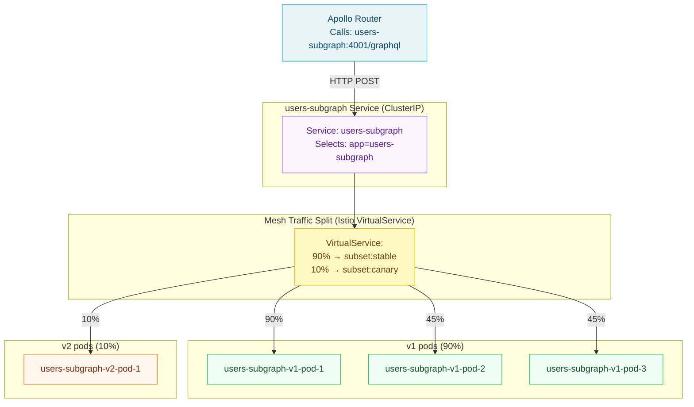
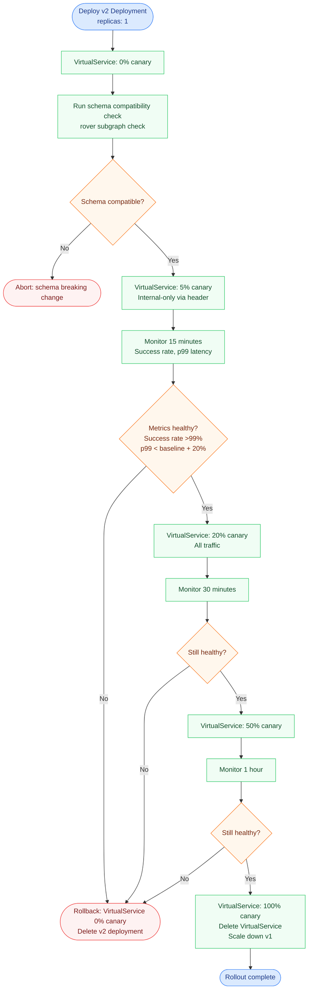

# 04 — Advanced Traffic Management for GraphQL

> **Purpose:** This document covers advanced traffic management patterns for federated GraphQL
> deployments: canary deployments of subgraphs with weighted traffic splitting, header-based
> routing for beta user segmentation, circuit breaker patterns with graceful degradation to
> partial data, retry policy interaction with GraphQL idempotency semantics, load balancing
> algorithm selection for subgraph connections, and connection draining during rolling updates.
> All patterns are backed by concrete Kubernetes and mesh configuration.

---

## Traffic Management in a Federated GraphQL System

Traffic management for GraphQL is more nuanced than for REST APIs because:

1. **All traffic arrives at a single endpoint** (`POST /graphql`). Traditional path-based routing
   provides no differentiation. Operation-level routing requires header injection or body inspection.
2. **Mutations are not idempotent.** Retry logic must account for operation type — retrying a
   `createOrder` mutation creates duplicate orders.
3. **Partial failure is valid.** GraphQL allows returning partial data with errors — a circuit
   breaker that trips a subgraph should degrade gracefully rather than failing the entire request.
4. **Entity fetches are high-volume and idempotent.** The Apollo Router's `_entities` fetches
   are safe to retry and should use aggressive connection pooling.
5. **Schema changes affect routing.** Deploying a new subgraph version may change the schema;
   traffic must be split to validate schema compatibility before full rollout.

---

## Canary Deployments of Subgraphs

A subgraph canary deployment validates a new version against a small percentage of live traffic
before promoting to full rollout. The Apollo Router continues calling the same Kubernetes Service;
the mesh splits traffic between v1 and v2 pods.



### Canary Deployment Workflow

**Phase 1: Deploy the canary pods (no traffic yet):**

```yaml
# users-subgraph-v2-deployment.yaml
apiVersion: apps/v1
kind: Deployment
metadata:
  name: users-subgraph-v2
  namespace: graphql-prod
  labels:
    app: users-subgraph
    version: v2
    channel: canary
spec:
  replicas: 1
  selector:
    matchLabels:
      app: users-subgraph
      version: v2
  template:
    metadata:
      labels:
        app: users-subgraph
        version: v2
      annotations:
        rollout.phase: "canary"
        rollout.timestamp: "2026-05-16T14:00:00Z"
    spec:
      containers:
        - name: users-subgraph
          image: your-registry/users-subgraph:2.1.0
          env:
            - name: SCHEMA_VERSION
              value: "2.1.0"
          readinessProbe:
            httpGet:
              path: /health/ready
              port: 4001
            initialDelaySeconds: 10
            periodSeconds: 5
            failureThreshold: 3
```

**Phase 2: Configure traffic split (5% canary):**

```yaml
# users-subgraph-vs-canary.yaml
apiVersion: networking.istio.io/v1beta1
kind: VirtualService
metadata:
  name: users-subgraph
  namespace: graphql-prod
  annotations:
    rollout.canary-start: "2026-05-16T14:00:00Z"
    rollout.canary-percentage: "5"
spec:
  hosts:
    - users-subgraph
  http:
    - route:
        - destination:
            host: users-subgraph
            subset: stable
          weight: 95
        - destination:
            host: users-subgraph
            subset: canary
          weight: 5
      timeout: 10s
      retries:
        attempts: 2
        perTryTimeout: 4s
        retryOn: "connect-failure,refused-stream"
---
apiVersion: networking.istio.io/v1beta1
kind: DestinationRule
metadata:
  name: users-subgraph
  namespace: graphql-prod
spec:
  host: users-subgraph
  subsets:
    - name: stable
      labels:
        version: v1
    - name: canary
      labels:
        version: v2
```

**Phase 3: Automated canary progression via a promotion script:**

```bash
#!/bin/bash
# canary-promote.sh — progressively shift traffic to canary
# Usage: ./canary-promote.sh users-subgraph 5 10 25 50 100

SERVICE=$1
shift
WEIGHTS=("$@")

for CANARY_WEIGHT in "${WEIGHTS[@]}"; do
  STABLE_WEIGHT=$((100 - CANARY_WEIGHT))
  echo "Shifting: stable=${STABLE_WEIGHT}%, canary=${CANARY_WEIGHT}%"

  kubectl patch virtualservice "${SERVICE}" -n graphql-prod \
    --type merge \
    --patch "{\"spec\":{\"http\":[{\"route\":[{\"destination\":{\"host\":\"${SERVICE}\",\"subset\":\"stable\"},\"weight\":${STABLE_WEIGHT}},{\"destination\":{\"host\":\"${SERVICE}\",\"subset\":\"canary\"},\"weight\":${CANARY_WEIGHT}}]}]}}"

  # Wait for metrics to stabilize (5 minutes)
  sleep 300

  # Check canary success rate via Prometheus
  CANARY_SUCCESS_RATE=$(curl -s "http://prometheus.monitoring:9090/api/v1/query" \
    --data-urlencode "query=sum(rate(response_total{deployment=\"${SERVICE}-v2\",classification=\"success\"}[5m])) / sum(rate(response_total{deployment=\"${SERVICE}-v2\"}[5m]))" \
    | jq '.data.result[0].value[1]' -r)

  if (( $(echo "$CANARY_SUCCESS_RATE < 0.99" | bc -l) )); then
    echo "ERROR: Canary success rate ${CANARY_SUCCESS_RATE} < 99%. Rolling back."
    kubectl patch virtualservice "${SERVICE}" -n graphql-prod \
      --type merge \
      --patch '{"spec":{"http":[{"route":[{"destination":{"host":"'"${SERVICE}"'","subset":"stable"},"weight":100}]}]}}'
    exit 1
  fi

  echo "Canary success rate: ${CANARY_SUCCESS_RATE} — proceeding."
done

echo "Canary promotion complete. Cleaning up v1 pods."
kubectl scale deployment "${SERVICE}-v1" -n graphql-prod --replicas=0
```

---

## Header-Based Routing (Beta User Segmentation)

Route beta users to a v2 subgraph while all other users receive v1. The Apollo Router passes
client request headers to subgraph fetches. Combine with Istio `VirtualService` header matching.

**Apollo Router header propagation (router.yaml):**

```yaml
# router.yaml — propagate x-user-beta header to subgraphs
headers:
  all:
    request:
      - propagate:
          named: "x-user-beta"
      - propagate:
          named: "x-feature-flags"
      - propagate:
          named: "x-user-id"
```

**Istio VirtualService header match:**

```yaml
# users-subgraph-beta-routing.yaml
apiVersion: networking.istio.io/v1beta1
kind: VirtualService
metadata:
  name: users-subgraph
  namespace: graphql-prod
spec:
  hosts:
    - users-subgraph
  http:
    # Beta users → v2 subgraph
    - match:
        - headers:
            x-user-beta:
              exact: "true"
      route:
        - destination:
            host: users-subgraph
            subset: v2
          weight: 100
      timeout: 10s
      retries:
        attempts: 2
        perTryTimeout: 4s
        retryOn: "connect-failure,refused-stream"

    # Internal testing: route by specific user ID prefix to v2
    - match:
        - headers:
            x-user-id:
              prefix: "beta-"
      route:
        - destination:
            host: users-subgraph
            subset: v2
          weight: 100
      timeout: 10s

    # All other users → v1 stable
    - route:
        - destination:
            host: users-subgraph
            subset: v1
          weight: 100
      timeout: 10s
      retries:
        attempts: 3
        perTryTimeout: 3s
        retryOn: "connect-failure,refused-stream"
```

This pattern enables:
- Internal engineers (`x-user-beta: true` set by auth proxy) to validate v2 before any
  external users see it
- Gradual user group expansion by changing the header matching condition in the VirtualService
  without redeploying anything

---

## Circuit Breaker Patterns for GraphQL

A circuit breaker monitors subgraph health and stops routing traffic to a failing subgraph
before it becomes a cascade failure. For GraphQL, circuit breaking has a specific challenge:
**GraphQL returns HTTP 200 even for errors**. A circuit breaker that trips on `5xx` responses
will never trip for GraphQL application errors.

The correct approach: configure circuit breaking on **connection-level failures** (TCP errors,
refused connections, timeouts), not on HTTP status codes. GraphQL application errors are handled
at the resolver level; the circuit breaker handles infrastructure failures.

### Istio Circuit Breaking Configuration

```yaml
# subgraph-circuit-breaker.yaml
apiVersion: networking.istio.io/v1beta1
kind: DestinationRule
metadata:
  name: users-subgraph-circuit-breaker
  namespace: graphql-prod
spec:
  host: users-subgraph
  trafficPolicy:
    connectionPool:
      http:
        http2MaxRequests: 500
        maxRequestsPerConnection: 100
        h2UpgradePolicy: UPGRADE
        # Circuit breaker: pending request limit
        # Requests queued beyond this limit are rejected immediately (fail fast)
        http1MaxPendingRequests: 50    # For HTTP/1.1 fallback paths
      tcp:
        maxConnections: 100
        connectTimeout: 3s

    # Outlier detection — the circuit breaker mechanism in Envoy
    outlierDetection:
      # Eject a host after N consecutive gateway errors (502, 503, 504)
      # Note: NOT 5xx — GraphQL app errors return 200
      consecutiveGatewayErrors: 5
      # Eject a host after N consecutive local origin errors (connection refused, timeout)
      consecutiveLocalOriginFailures: 5
      # Evaluation interval
      interval: 10s
      # Initial ejection duration (doubles with each ejection up to maxEjectionTime)
      baseEjectionTime: 30s
      # Maximum ejection time regardless of ejection count
      maxEjectionTime: 300s            # 5 minutes max
      # Maximum percentage of hosts that can be ejected simultaneously
      maxEjectionPercent: 50
      # Minimum healthy percentage of hosts before ejection is disabled
      # (safety net: do not eject all hosts)
      minHealthPercent: 50
      # Split local origin errors from external errors
      splitExternalLocalOriginErrors: true
```

### Fallback to Partial Data

When a subgraph's circuit breaker is open, the Apollo Router can return partial data to the
client rather than failing the entire request. Configure the router to handle subgraph errors
gracefully:

```yaml
# router.yaml — error handling for partial responses
supergraph:
  # When a subgraph fails, include partial data from successful subgraphs
  # and include errors in the GraphQL errors array
  defer_support: true

# Custom error handling via Rhai script
plugins:
  rhai:
    scripts: /app/scripts

# scripts/partial-error-handling.rhai
fn subgraph_service(service, subgraph_name) {
  let response_callback = |response| {
    // If the subgraph returned no data (connection failure)
    if response.body["data"] == () {
      // Set a custom extension to indicate subgraph unavailability
      let errors = response.body["errors"];
      if errors != () {
        for error in errors {
          error.extensions["subgraphUnavailable"] = true;
          error.extensions["subgraphName"] = subgraph_name;
          error.extensions["retryAfter"] = 30;
        }
      }
      // Set HTTP status to 200 even on subgraph failure
      // (GraphQL partial response — not an HTTP error)
      response.status_code = 200;
    }
  };
  service.map_response(response_callback);
}
```

The client receives a partial response:

```json
{
  "data": {
    "user": {
      "id": "usr_123",
      "name": "Alice",
      "orders": null
    }
  },
  "errors": [
    {
      "message": "Failed to fetch orders from orders-subgraph",
      "path": ["user", "orders"],
      "extensions": {
        "code": "SUBGRAPH_ERROR",
        "subgraphUnavailable": true,
        "subgraphName": "orders",
        "retryAfter": 30
      }
    }
  ]
}
```

---

## Retry Policy and GraphQL Idempotency

GraphQL operations have distinct idempotency characteristics that must inform retry policy:

| Operation Type | Idempotent? | Safe to Retry? | Retry Config |
|---|---|---|---|
| `query` | Yes (read-only) | Yes | Allow 2-3 retries with backoff |
| `mutation` | No (creates/modifies state) | No | Zero retries |
| `subscription` (over WebSocket) | N/A | Reconnect only | Handled by transport |
| `_entities` fetch (Federation internal) | Yes (read-only) | Yes | Allow 2-3 retries |
| `_service` SDL fetch | Yes | Yes | Allow 2-3 retries |

### Detecting Mutation vs Query in Istio

Istio's `VirtualService` cannot inspect GraphQL request bodies to detect operation type. Use
header injection from the Apollo Router (via Rhai script) to mark operation type, then apply
Istio routing rules.

**Apollo Router Rhai script for operation type header:**

```rhai
// scripts/operation-type-header.rhai
fn supergraph_service(service) {
  let request_callback = |request| {
    // The Apollo Router provides operation metadata in the request context
    let ctx = request.context;
    
    // Check if query document indicates mutation
    // Note: in production, use the Apollo Router's built-in operation metadata
    let query = "";
    if request.body != () {
      if request.body["query"] != () {
        query = request.body["query"];
      }
    }
    
    // Simplified mutation detection
    // Production: use GraphQL AST from router context
    if query.starts_with("mutation") || query.contains("\nmutation") {
      request.headers["x-graphql-operation-type"] = "mutation";
    } else if query.starts_with("subscription") || query.contains("\nsubscription") {
      request.headers["x-graphql-operation-type"] = "subscription";
    } else {
      request.headers["x-graphql-operation-type"] = "query";
    }

    // Also propagate operation name if present
    if request.body != () && request.body["operationName"] != () {
      request.headers["x-graphql-operation-name"] = request.body["operationName"];
    }
  };
  service.map_request(request_callback);
}
```

**Istio VirtualService with retry differentiation:**

```yaml
# subgraph-retry-policy.yaml
apiVersion: networking.istio.io/v1beta1
kind: VirtualService
metadata:
  name: users-subgraph-retry
  namespace: graphql-prod
spec:
  hosts:
    - users-subgraph
  http:
    # Mutations: no retries, shorter timeout (fail fast)
    - match:
        - headers:
            x-graphql-operation-type:
              exact: "mutation"
      route:
        - destination:
            host: users-subgraph
            subset: current
      timeout: 15s
      retries:
        attempts: 0

    # Queries and entity fetches: retries with exponential backoff
    - route:
        - destination:
            host: users-subgraph
            subset: current
      timeout: 10s
      retries:
        attempts: 3
        perTryTimeout: 3s
        retryOn: "connect-failure,refused-stream,retriable-status-codes"
        retryRemoteStatuses: "503,504"
```

---

## Load Balancing Algorithms for Subgraph Connections

The default Kubernetes Service load balancing (round-robin at the IP table level) does not
account for in-flight request counts. For GraphQL subgraphs, **least-request** load balancing
is strongly preferred because:

- Subgraph request durations vary widely (simple lookups: 1ms, complex aggregations: 500ms+)
- Round-robin sends new requests to overloaded pods at the same rate as idle pods
- Least-request distributes load based on actual pod capacity, reducing tail latency

### Istio Least-Request Load Balancing

```yaml
# subgraph-load-balancing.yaml
apiVersion: networking.istio.io/v1beta1
kind: DestinationRule
metadata:
  name: users-subgraph-lb
  namespace: graphql-prod
spec:
  host: users-subgraph
  trafficPolicy:
    loadBalancer:
      simple: LEAST_REQUEST     # Send to endpoint with fewest in-flight requests
      # Alternative: ROUND_ROBIN (default, not recommended for GraphQL)
      # Alternative: RANDOM (slightly better than ROUND_ROBIN under load spikes)
      # Alternative: LEAST_CONN (TCP connection count, not HTTP request count)

    # Consistent hashing: route same user to same subgraph pod (useful for caching)
    # Uncomment if subgraph pods cache per-user data in memory:
    # consistentHash:
    #   httpHeaderName: "x-user-id"
    #   minimumRingSize: 1024
```

For subgraphs that maintain in-memory per-user caches (e.g., a users subgraph with a user
session cache), consistent hash load balancing increases cache hit rates by routing the same
user to the same pod:

```yaml
apiVersion: networking.istio.io/v1beta1
kind: DestinationRule
metadata:
  name: users-subgraph-session-lb
  namespace: graphql-prod
spec:
  host: users-subgraph
  trafficPolicy:
    loadBalancer:
      consistentHash:
        httpHeaderName: "x-user-id"    # Route by user ID for cache locality
        minimumRingSize: 1024          # Minimum consistent hash ring size
```

---

## Connection Draining During Rolling Updates

When a subgraph pod is terminated during a rolling update, in-flight GraphQL requests must
complete before the pod is killed. Kubernetes `terminationGracePeriodSeconds` sets the upper
bound; Envoy sidecar `drainDuration` controls how long Envoy waits before closing connections.

```yaml
# users-subgraph-deployment-draining.yaml
apiVersion: apps/v1
kind: Deployment
metadata:
  name: users-subgraph
  namespace: graphql-prod
spec:
  strategy:
    type: RollingUpdate
    rollingUpdate:
      maxUnavailable: 0      # Never reduce capacity below desired during rollout
      maxSurge: 1            # Add one extra pod before removing an old one
  template:
    spec:
      # Give pods 60 seconds to finish in-flight requests before SIGKILL
      terminationGracePeriodSeconds: 60
      containers:
        - name: users-subgraph
          lifecycle:
            preStop:
              exec:
                # Sleep 5 seconds to let the Kubernetes Service stop routing new traffic
                # before the application begins shutdown
                command: ["/bin/sh", "-c", "sleep 5"]
```

Configure Istio Envoy drain duration to match the application's termination period:

```yaml
# meshconfig-draining.yaml
apiVersion: install.istio.io/v1alpha1
kind: IstioOperator
spec:
  meshConfig:
    # Envoy waits this long for existing connections to complete before force-closing
    defaultConfig:
      drainDuration: 45s          # Less than terminationGracePeriodSeconds (60s)
      parentShutdownDuration: 60s # Total time before parent process exits
      terminationDrainDuration: 30s
```

### Rolling Update Sequencing

```
Time 0:   Kubernetes marks pod for termination
           SIGTERM sent to Envoy sidecar
Time 0-5: preStop sleep — Envoy stops accepting NEW connections (draining)
           Kubernetes endpoints controller removes pod from Service endpoints
           (new router requests route to other pods)
Time 5-35: Existing in-flight requests complete normally
            Envoy drainDuration countdown (30s after preStop)
Time 35:  Envoy force-closes remaining connections (if any)
Time 35-60: Application shutdown — database connections closed, caches flushed
Time 60:  SIGKILL if pod has not exited
```

Verify draining is working:

```bash
# Watch connections during a rolling update
watch -n1 "kubectl exec -n graphql-prod deploy/users-subgraph -c istio-proxy -- \
  curl -s localhost:15000/stats | grep 'cx_active\|rq_active'"

# Monitor 502 errors during rollout (should be zero with proper draining)
kubectl logs -n graphql-prod deploy/apollo-router -f | grep -E '"statusCode": 50[234]'
```

---

## Progressive Delivery: Full Subgraph Canary Pipeline

Combining traffic splitting, header-based routing, circuit breaking, and connection draining
into a complete progressive delivery workflow:



---

## References

- [Istio Traffic Management Concepts](https://istio.io/latest/docs/concepts/traffic-management/)
- [Envoy Circuit Breaker](https://www.envoyproxy.io/docs/envoy/latest/intro/arch_overview/upstream/circuit_breaking)
- [Envoy Load Balancing](https://www.envoyproxy.io/docs/envoy/latest/intro/arch_overview/upstream/load_balancing/overview)
- [Apollo Router Traffic Shaping](https://www.apollographql.com/docs/router/configuration/traffic-shaping/)
- [Apollo Router Rhai Scripts](https://www.apollographql.com/docs/router/customizations/rhai/)
- [Kubernetes Rolling Update Strategy](https://kubernetes.io/docs/concepts/workloads/controllers/deployment/#rolling-update-deployment)
- [Kubernetes PreStop Hook](https://kubernetes.io/docs/concepts/containers/container-lifecycle-hooks/)
