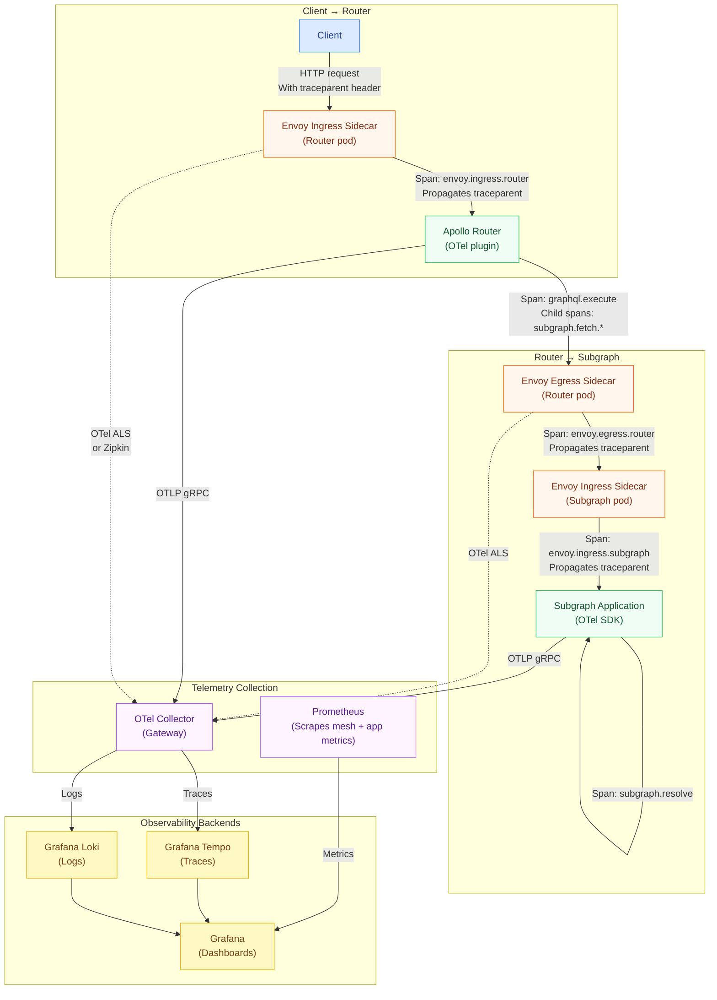

# 05 — Unified Observability: Service Mesh + GraphQL

> **Purpose:** This document establishes the unified observability architecture for a federated
> GraphQL deployment running inside a service mesh. It covers combining Istio/Linkerd telemetry
> with OpenTelemetry traces without span duplication, Prometheus metric sources and their
> distinct coverage gaps, Grafana dashboards that correlate mesh-level and GraphQL-level signals,
> distributed tracing across mesh boundaries with W3C TraceContext propagation, and service
> graph visualization via Kiali and Linkerd Viz enriched with GraphQL operation names.

---

## The Observability Layering Problem

A service mesh adds a new telemetry source alongside the Apollo Router's OTel plugin and
subgraph application instrumentation. Without careful coordination, operators face:

- **Duplicate spans:** Envoy sidecars and the Apollo Router both export spans; a naive setup
  creates two root spans per request in Jaeger/Tempo.
- **Metric double-counting:** Prometheus scrapes mesh metrics and application metrics; request
  rates summed without understanding the sources overcount by 2x.
- **Context fragmentation:** Traces break at mesh boundaries if propagation formats differ
  (Envoy defaults to B3; OTel defaults to W3C TraceContext).
- **Label collision:** Mesh metrics use `destination_service` labels; app metrics use
  `subgraph` labels; Grafana dashboards joining these fail without explicit label alignment.

This document resolves each problem with concrete configuration.

---

## Telemetry Architecture Overview



---

## Distributed Tracing: Avoiding Span Duplication

The most common mistake: both the mesh (Envoy) and the application (Apollo Router OTel plugin)
export spans with their own trace ID, creating two disconnected root spans in the trace backend.

The correct model uses the Envoy-generated `traceparent` header as the parent for all
application-level spans. The trace has one root (the Envoy ingress span), and all router and
subgraph spans are descendants.

### Step 1: Configure Istio to Use W3C TraceContext

Istio Envoy defaults to B3 propagation. Switch to W3C TraceContext to match the OTel default:

```yaml
# meshconfig-tracing.yaml
apiVersion: install.istio.io/v1alpha1
kind: IstioOperator
spec:
  meshConfig:
    # Disable Zipkin (B3) tracing; use OTel instead
    enableTracing: false    # Disable the legacy Zipkin-based tracing

    defaultConfig:
      tracing:
        sampling: 10.0
        # Switch Envoy to W3C TraceContext propagation
        # This requires Istio 1.18+ with Envoy's built-in OTel tracer
        customTags:
          graphql_operation:
            header:
              name: "x-graphql-operation-name"
              defaultValue: ""

    extensionProviders:
      - name: otel-tracing
        opentelemetry:
          service: otel-collector.observability.svc.cluster.local
          port: 4317
          http:
            path: /opentelemetry.proto.collector.trace.v1.TraceService/Export
            timeout: 10s
            headers:
              - name: "x-custom-header"
                value: "graphql-prod"
          resource_detectors:
            environment: {}
            dynatrace: {}
```

Apply the OTel tracing provider to the graphql-prod namespace:

```yaml
# telemetry-tracing-graphql-prod.yaml
apiVersion: telemetry.istio.io/v1alpha1
kind: Telemetry
metadata:
  name: graphql-tracing
  namespace: graphql-prod
spec:
  tracing:
    - providers:
        - name: otel-tracing
      randomSamplingPercentage: 10.0
      disableSpanReporting: false
      customTags:
        graphql.operation.name:
          header:
            name: "x-graphql-operation-name"
        graphql.operation.type:
          header:
            name: "x-graphql-operation-type"
        mesh.component:
          literal:
            value: "envoy"
```

### Step 2: Configure Apollo Router OTel for Child Span Mode

The Apollo Router OTel plugin must read the incoming `traceparent` header and create a child
span, not a new root span:

```yaml
# router.yaml — telemetry configuration
telemetry:
  tracing:
    common:
      sampler: 0.1              # 10% — must match Istio sampling rate
      parent_based_sampler: true  # CRITICAL: respect incoming sampling decision
      propagation:
        trace_context: true     # W3C TraceContext — matches Istio config
        b3: false               # Disable B3 to avoid header conflicts
        baggage: true           # Enable W3C Baggage for cross-service context
      resource:
        service.name: "apollo-router"
        service.version: "${env.APOLLO_ROUTER_VERSION}"
        service.namespace: "graphql-prod"
        deployment.environment: "production"
        k8s.pod.name: "${env.HOSTNAME}"
        k8s.namespace.name: "graphql-prod"

    exporters:
      otlp:
        enabled: true
        endpoint: http://otel-collector.observability.svc.cluster.local:4317
        protocol: grpc
        batch_processor:
          scheduled_delay: 5s
          max_export_batch_size: 512
          max_queue_size: 2048
          max_concurrent_exports: 4

    # Instrument specific GraphQL attributes on spans
    instrument:
      http.request.method: true
      http.response.status_code: true
      url.path: true
      graphql.document: false          # Disable: contains PII in query variables
      graphql.operation.name: true
      graphql.operation.type: true

  metrics:
    common:
      attributes:
        graphql.operation.name:
          default: "unknown"
        graphql.operation.type:
          default: "unknown"
        subgraph.name: true
        http.response.status_code: true
      views:
        - name: graphql.server.request.duration
          aggregation:
            histogram:
              buckets: [0.005, 0.01, 0.025, 0.05, 0.1, 0.25, 0.5, 1.0, 2.5, 5.0, 10.0]
    exporters:
      prometheus:
        enabled: true
        listen: 0.0.0.0:9090
        path: /metrics
        include_labels: true
```

### Step 3: Configure Subgraph OTel for Child Span Mode

Each subgraph application must also use `parent_based_sampler: true` and W3C TraceContext:

```typescript
// Node.js subgraph: OTel SDK setup
import { NodeSDK } from '@opentelemetry/sdk-node';
import { OTLPTraceExporter } from '@opentelemetry/exporter-trace-otlp-grpc';
import { W3CTraceContextPropagator } from '@opentelemetry/core';
import { ParentBasedSampler, TraceIdRatioBasedSampler } from '@opentelemetry/sdk-trace-base';
import { Resource } from '@opentelemetry/resources';
import { SEMRESATTRS_SERVICE_NAME, SEMRESATTRS_SERVICE_VERSION } from '@opentelemetry/semantic-conventions';

const sdk = new NodeSDK({
  resource: new Resource({
    [SEMRESATTRS_SERVICE_NAME]: 'users-subgraph',
    [SEMRESATTRS_SERVICE_VERSION]: process.env.SERVICE_VERSION ?? '1.0.0',
    'service.namespace': 'graphql-prod',
    'deployment.environment': 'production',
  }),
  traceExporter: new OTLPTraceExporter({
    url: 'http://otel-collector.observability.svc.cluster.local:4317',
  }),
  // CRITICAL: ParentBasedSampler respects the sampling decision from the upstream span
  // If the incoming traceparent has sampled=01, this span is sampled.
  // If sampled=00, this span is not sampled (even though the ratio is 10%).
  sampler: new ParentBasedSampler({
    root: new TraceIdRatioBasedSampler(0.1),  // 10% for new traces (no parent)
  }),
  // W3C TraceContext propagation — matches mesh and router config
  textMapPropagator: new W3CTraceContextPropagator(),
});

sdk.start();
```

### Resulting Trace Structure

With all three layers configured correctly, a single GraphQL request produces this trace tree:

```
[TraceID: 4bf92f3577b34da6a3ce929d0e0e4736]

envoy.ingress (router) — 45ms total
  Source: Envoy sidecar on apollo-router pod
  Tags: mesh.component=envoy, destination_workload=apollo-router

  └── graphql.execute — 40ms
        Source: Apollo Router OTel plugin
        Tags: graphql.operation.name=GetUserOrders, graphql.operation.type=query

        ├── subgraph.fetch.users — 8ms
        │     Source: Apollo Router, subgraph fetch span
        │     Tags: subgraph.name=users
        │
        │     └── envoy.egress (router→users) — 7ms
        │           Source: Envoy sidecar egress
        │
        │           └── envoy.ingress (users) — 6ms
        │                 Source: Envoy sidecar on users-subgraph pod
        │
        │                 └── resolver.GetUser — 5ms
        │                       Source: users-subgraph OTel SDK
        │                       Tags: db.system=postgresql, db.operation=SELECT
        │
        └── subgraph.fetch.orders — 35ms
              Source: Apollo Router, subgraph fetch span
              Tags: subgraph.name=orders
              (parallel with users fetch — starts after user ID is resolved)

              └── envoy.egress (router→orders) — 34ms
                    └── envoy.ingress (orders) — 33ms
                          └── resolver.GetOrders — 30ms
                                Tags: db.system=postgresql, db.operation=SELECT
```

---

## Prometheus Metrics: What Each Source Covers

Three Prometheus metric sources are relevant in a mesh + GraphQL deployment. Understanding
their coverage gaps prevents building dashboards on incomplete data.

### Metric Source Coverage Matrix

| Signal | Istio Mesh Metrics | Apollo Router App Metrics | Subgraph App Metrics |
|---|---|---|---|
| Request count | Yes (HTTP level) | Yes (GraphQL level) | Yes (GraphQL level) |
| Request rate | Yes | Yes | Yes |
| Response latency | Yes (E2E per HTTP request) | Yes (per operation) | Yes (per resolver) |
| Error rate | HTTP 4xx/5xx only (misses GraphQL 200+error) | Yes (GraphQL errors in body) | Yes |
| mTLS status | Yes | No | No |
| TCP connections | Yes | Limited | No |
| GraphQL operation name | Via custom tag only | Yes (native label) | Yes |
| Subgraph-level p99 | No | Yes | No |
| Resolver-level p99 | No | No | Yes |
| Schema field latency | No | No | Yes (with OTel) |
| Retry count | Yes (Envoy retries) | Yes (router retries) | No |
| Circuit breaker events | Yes (Envoy outlier ejection) | No | No |

### Istio Mesh Prometheus Metrics

```promql
# Request rate from router to users-subgraph (mesh perspective)
rate(istio_requests_total{
  reporter="source",
  source_workload="apollo-router",
  destination_service_name="users-subgraph",
  namespace="graphql-prod"
}[5m])

# P99 latency from router to users-subgraph
histogram_quantile(0.99,
  sum by (le) (
    rate(istio_request_duration_milliseconds_bucket{
      reporter="source",
      source_workload="apollo-router",
      destination_service_name="users-subgraph"
    }[5m])
  )
)

# mTLS connection percentage (should be 100% in STRICT mode)
sum(istio_requests_total{
  destination_service_namespace="graphql-prod",
  connection_security_policy="mutual_tls"
})
/
sum(istio_requests_total{
  destination_service_namespace="graphql-prod"
})

# Circuit breaker ejection events
sum by (destination_service_name) (
  rate(istio_agent_pilot_k8s_object_events_total{
    type="DestinationRule"
  }[5m])
)

# Envoy outlier detection events
sum by (cluster_name) (
  rate(envoy_cluster_outlier_detection_ejections_active[5m])
)
```

### Apollo Router Prometheus Metrics

```promql
# GraphQL request rate by operation name
rate(apollo_router_graphql_requests_total{
  namespace="graphql-prod",
  graphql_operation_type="query"
}[5m])

# Router P99 latency by operation name
histogram_quantile(0.99,
  sum by (le, graphql_operation_name) (
    rate(apollo_router_graphql_request_duration_seconds_bucket{
      namespace="graphql-prod"
    }[5m])
  )
)

# Subgraph fetch success rate
sum by (subgraph) (
  rate(apollo_router_subgraph_requests_total{
    status="success",
    namespace="graphql-prod"
  }[5m])
)
/
sum by (subgraph) (
  rate(apollo_router_subgraph_requests_total{
    namespace="graphql-prod"
  }[5m])
)

# Router error rate (GraphQL errors, not HTTP errors)
rate(apollo_router_graphql_error_requests_total{namespace="graphql-prod"}[5m])
/
rate(apollo_router_graphql_requests_total{namespace="graphql-prod"}[5m])

# Subgraph P99 latency from router perspective
histogram_quantile(0.99,
  sum by (le, subgraph) (
    rate(apollo_router_subgraph_request_duration_seconds_bucket{
      namespace="graphql-prod"
    }[5m])
  )
)
```

---

## Grafana Dashboards: Mesh + GraphQL Unified View

### Dashboard 1: GraphQL Operations Health (Application Layer)

This dashboard uses Apollo Router metrics for operation-level visibility:

```json
{
  "title": "GraphQL Operations Health",
  "panels": [
    {
      "title": "Request Rate by Operation",
      "type": "timeseries",
      "targets": [{
        "expr": "sum by (graphql_operation_name) (rate(apollo_router_graphql_requests_total{namespace='graphql-prod'}[5m]))",
        "legendFormat": "{{graphql_operation_name}}"
      }]
    },
    {
      "title": "Operation P99 Latency",
      "type": "timeseries",
      "targets": [{
        "expr": "histogram_quantile(0.99, sum by (le, graphql_operation_name) (rate(apollo_router_graphql_request_duration_seconds_bucket{namespace='graphql-prod'}[5m])))",
        "legendFormat": "{{graphql_operation_name}} p99"
      }]
    },
    {
      "title": "Subgraph Availability",
      "type": "stat",
      "targets": [{
        "expr": "sum by (subgraph) (rate(apollo_router_subgraph_requests_total{status='success',namespace='graphql-prod'}[5m])) / sum by (subgraph) (rate(apollo_router_subgraph_requests_total{namespace='graphql-prod'}[5m]))",
        "legendFormat": "{{subgraph}}"
      }],
      "thresholds": {
        "steps": [
          {"value": 0, "color": "red"},
          {"value": 0.99, "color": "yellow"},
          {"value": 0.999, "color": "green"}
        ]
      }
    }
  ]
}
```

### Dashboard 2: Service Mesh Health (Infrastructure Layer)

This dashboard uses Istio Prometheus metrics for network-level visibility:

```json
{
  "title": "Service Mesh Health — GraphQL Namespace",
  "panels": [
    {
      "title": "mTLS Coverage",
      "type": "gauge",
      "targets": [{
        "expr": "sum(istio_requests_total{destination_service_namespace='graphql-prod',connection_security_policy='mutual_tls'}) / sum(istio_requests_total{destination_service_namespace='graphql-prod'})",
        "legendFormat": "mTLS %"
      }],
      "thresholds": {"steps": [{"value": 0,"color":"red"},{"value": 1,"color":"green"}]}
    },
    {
      "title": "TCP Connections Active (Mesh)",
      "type": "timeseries",
      "targets": [{
        "expr": "sum by (destination_service_name) (istio_tcp_connections_opened_total{destination_service_namespace='graphql-prod'} - istio_tcp_connections_closed_total{destination_service_namespace='graphql-prod'})",
        "legendFormat": "{{destination_service_name}}"
      }]
    },
    {
      "title": "Envoy Retry Rate (Mesh)",
      "type": "timeseries",
      "targets": [{
        "expr": "sum by (source_workload, destination_service_name) (rate(envoy_cluster_upstream_rq_retry[5m]))",
        "legendFormat": "{{source_workload}} → {{destination_service_name}}"
      }]
    },
    {
      "title": "Circuit Breaker Ejections",
      "type": "timeseries",
      "targets": [{
        "expr": "sum by (cluster_name) (rate(envoy_cluster_outlier_detection_ejections_detected_consecutive_gateway_failure[5m]))",
        "legendFormat": "{{cluster_name}} — consecutive GW failures"
      }]
    }
  ]
}
```

### Dashboard 3: Correlated View (Mesh + Application Side by Side)

A split panel showing mesh network view alongside GraphQL operation view, with trace links:

```yaml
# grafana-correlation-dashboard-annotations.yaml
# Store in Grafana as a dashboard JSON; key panels:

panels:
  - title: "End-to-End Latency: Client → Router → Subgraph"
    type: timeseries
    description: |
      Top row: Istio mesh P99 (client to router, router to each subgraph).
      Bottom row: Apollo Router P99 per operation and per subgraph.
      Use these together: if mesh latency is low but router latency is high,
      the issue is in query planning or resolver execution, not the network.
    targets:
      - expr: |
          histogram_quantile(0.99,
            sum by (le) (
              rate(istio_request_duration_milliseconds_bucket{
                reporter="destination",
                destination_workload="apollo-router"
              }[5m])
            )
          ) / 1000
        legendFormat: "Mesh: client → router p99 (s)"
      - expr: |
          histogram_quantile(0.99,
            sum by (le, graphql_operation_name) (
              rate(apollo_router_graphql_request_duration_seconds_bucket{
                namespace="graphql-prod"
              }[5m])
            )
          )
        legendFormat: "Router: {{graphql_operation_name}} p99 (s)"

  - title: "Error Detection: HTTP vs GraphQL"
    type: timeseries
    description: |
      HTTP error rate (mesh): catches network-level failures.
      GraphQL error rate (router): catches application-level failures.
      GraphQL errors can be non-zero even when HTTP errors are zero — partial failures.
    targets:
      - expr: |
          sum(rate(istio_requests_total{
            destination_service_namespace="graphql-prod",
            response_code=~"5.."
          }[5m]))
          /
          sum(rate(istio_requests_total{
            destination_service_namespace="graphql-prod"
          }[5m]))
        legendFormat: "HTTP 5xx rate (mesh)"
      - expr: |
          rate(apollo_router_graphql_error_requests_total{namespace="graphql-prod"}[5m])
          /
          rate(apollo_router_graphql_requests_total{namespace="graphql-prod"}[5m])
        legendFormat: "GraphQL error rate (router)"
```

---

## Distributed Tracing Across Mesh Boundaries

For Linkerd multicluster or Istio multi-cluster deployments, traces must propagate across
cluster boundaries. The trace context (`traceparent`) header travels with the HTTP request;
as long as both clusters use W3C TraceContext propagation, the trace is continuous.

### Validating Cross-Cluster Trace Propagation

```bash
# Send a test request with a specific trace context header
curl -X POST https://graphql.api.example.com/graphql \
  -H "Content-Type: application/json" \
  -H "traceparent: 00-4bf92f3577b34da6a3ce929d0e0e4736-00f067aa0ba902b7-01" \
  -d '{"query":"{ products(first: 5) { nodes { id name } } }"}'

# Search for the trace in Tempo (Grafana)
# Query: {.trace_id = "4bf92f3577b34da6a3ce929d0e0e4736"}
# Expected: spans from both clusters appear in a single trace tree

# If the trace is broken (no cross-cluster span), check:
kubectl exec -n graphql-prod deploy/apollo-router -- \
  curl -s localhost:8080/health | jq '.telemetry'
```

### OTel Collector Tail Sampling for Cross-Cluster Traces

When traces span multiple clusters, each cluster's OTel Collector may have only partial trace
data. Use a tail sampling collector deployment that aggregates from both clusters:

```yaml
# otel-collector-tail-sampler.yaml
receivers:
  otlp:
    protocols:
      grpc:
        endpoint: 0.0.0.0:4317

processors:
  tail_sampling:
    decision_wait: 30s          # Wait 30s for all spans before sampling decision
    num_traces: 100000
    expected_new_traces_per_sec: 1000
    policies:
      # Always sample traces with errors
      - name: errors-policy
        type: status_code
        status_code: {status_codes: [ERROR]}
      # Always sample slow traces (p99+)
      - name: slow-traces-policy
        type: latency
        latency: {threshold_ms: 1000}
      # Sample 10% of normal traces
      - name: probabilistic-policy
        type: probabilistic
        probabilistic: {sampling_percentage: 10}

exporters:
  otlp:
    endpoint: tempo.observability.svc.cluster.local:4317
    tls:
      insecure: false
      ca_file: /var/run/secrets/otel/ca.crt
```

---

## Service Graph Visualization Enriched with GraphQL Operations

### Kiali Configuration for GraphQL Operation Labels

Kiali's service graph shows services and edges labeled with request rate and success rate.
By injecting GraphQL operation names as request headers and configuring Istio `Telemetry`
to pick them up as custom tags, Kiali workload detail views show per-operation breakdown.

```yaml
# kiali-custom-dashboards.yaml
apiVersion: kiali.io/v1alpha1
kind: Kiali
metadata:
  name: kiali
  namespace: istio-system
spec:
  external_services:
    custom_dashboards:
      enabled: true
    prometheus:
      custom_metrics_url: "http://prometheus.monitoring:9090"
      url: "http://prometheus.monitoring:9090"
  kiali_feature_flags:
    istio_injection_action: true
    show_inbound_shards: true
```

Access Kiali's service graph enriched with GraphQL context:

```bash
# Port-forward Kiali dashboard
kubectl port-forward -n istio-system svc/kiali 20001:20001

# Access at: http://localhost:20001
# Navigate to: Graph → Namespace: graphql-prod
# Enable: Display → Request Distribution
# Enable: Display → Traffic Animation
```

### Linkerd Viz for Subgraph Health

```bash
# Linkerd Viz dashboard (shows per-service, per-route metrics)
linkerd viz dashboard &

# CLI views for operational response
# 1. Top-level namespace health
linkerd viz stat deployment -n graphql-prod

# 2. Per-route health from ServiceProfile
linkerd viz routes deployment/users-subgraph -n graphql-prod --from deployment/apollo-router

# 3. Live traffic tap (sample 5 requests)
linkerd viz tap deployment/apollo-router -n graphql-prod \
  --to deployment/orders-subgraph \
  --max-rps 5 \
  --output json | jq '{
    path: .requestInit.http.path,
    op: (.requestInit.http.headers[] | select(.name == "x-graphql-operation-name") | .value),
    duration_ms: .responseInit.sinceRequestInit,
    status: .responseInit.http.status
  }'
```

---

## Alerting: Mesh + GraphQL Combined Rules

```yaml
# prometheus-alerts-mesh-graphql.yaml
groups:
  - name: graphql_mesh_alerts
    interval: 30s
    rules:
      # Alert: mTLS coverage drops below 100%
      - alert: GraphQLMeshMTLSNotFullyCovered
        expr: |
          sum(istio_requests_total{
            destination_service_namespace="graphql-prod",
            connection_security_policy="mutual_tls"
          })
          /
          sum(istio_requests_total{destination_service_namespace="graphql-prod"})
          < 1.0
        for: 2m
        labels:
          severity: warning
          team: platform
        annotations:
          summary: "mTLS coverage below 100% in graphql-prod"
          description: "Some requests in graphql-prod are not using mTLS. Check for pods without sidecar injection."

      # Alert: Subgraph circuit breaker active (Envoy ejection)
      - alert: GraphQLSubgraphCircuitBreakerActive
        expr: |
          sum by (cluster_name) (
            envoy_cluster_outlier_detection_ejections_active
          ) > 0
        for: 1m
        labels:
          severity: critical
          team: platform
        annotations:
          summary: "Circuit breaker active on {{ $labels.cluster_name }}"
          description: "Envoy outlier detection has ejected at least one endpoint. Subgraph may be degraded."

      # Alert: GraphQL error rate high (application layer, not HTTP)
      - alert: GraphQLHighErrorRate
        expr: |
          rate(apollo_router_graphql_error_requests_total{namespace="graphql-prod"}[5m])
          /
          rate(apollo_router_graphql_requests_total{namespace="graphql-prod"}[5m])
          > 0.01
        for: 5m
        labels:
          severity: warning
          team: graphql-platform
        annotations:
          summary: "GraphQL error rate > 1% in graphql-prod"
          description: "Over 1% of GraphQL requests are returning errors. This may indicate schema or resolver issues."

      # Alert: Trace export failures (OTel collector issue)
      - alert: OTelCollectorTracesDropped
        expr: |
          rate(otelcol_exporter_send_failed_spans_total[5m]) > 0
        for: 5m
        labels:
          severity: warning
          team: observability
        annotations:
          summary: "OTel collector is dropping spans"
          description: "Traces are being dropped. Check OTel collector capacity and backend connectivity."

      # Alert: Retry rate exceeds budget (indicates subgraph degradation)
      - alert: GraphQLSubgraphRetryRateHigh
        expr: |
          sum by (subgraph) (
            rate(apollo_router_subgraph_requests_total{status="retried",namespace="graphql-prod"}[5m])
          )
          /
          sum by (subgraph) (
            rate(apollo_router_subgraph_requests_total{namespace="graphql-prod"}[5m])
          )
          > 0.05
        for: 3m
        labels:
          severity: warning
          team: platform
        annotations:
          summary: "Subgraph {{ $labels.subgraph }} retry rate > 5%"
          description: "High retry rate may indicate subgraph instability or network issues."
```

---

## References

- [OpenTelemetry Propagation Specification](https://opentelemetry.io/docs/specs/otel/context/api-propagators/)
- [W3C TraceContext Specification](https://www.w3.org/TR/trace-context/)
- [Apollo Router Telemetry Configuration](https://www.apollographql.com/docs/router/configuration/telemetry/overview/)
- [Istio Telemetry API](https://istio.io/latest/docs/reference/config/telemetry/)
- [Istio Prometheus Metrics Reference](https://istio.io/latest/docs/reference/config/metrics/)
- [Linkerd Prometheus Metrics](https://linkerd.io/2.14/reference/proxy-metrics/)
- [Grafana Tempo Trace Backend](https://grafana.com/docs/tempo/latest/)
- [OTel Collector Tail Sampling Processor](https://github.com/open-telemetry/opentelemetry-collector-contrib/tree/main/processor/tailsamplingprocessor)
- [Kiali Documentation](https://kiali.io/docs/configuration/p8s-jaeger-grafana/)
