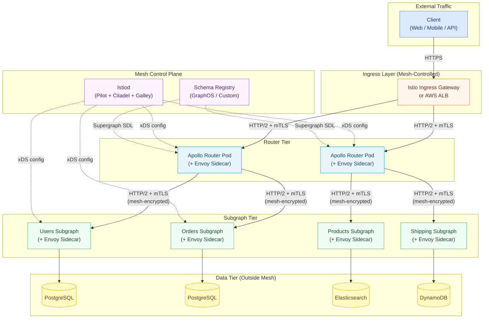

# Chapter 16: Service Mesh Integration

> **Purpose:** This chapter is the authoritative reference for integrating a service mesh with
> an Apollo Federation supergraph in enterprise Kubernetes deployments. It explains precisely
> what the mesh handles versus what Apollo Router handles, why both layers are necessary, and
> how to configure Istio, Linkerd, and AWS App Mesh alongside GraphQL without creating operational
> conflicts or double-counting telemetry. Engineers operating federated GraphQL in production
> should read this chapter before enabling a mesh on a cluster that runs the Apollo Router.

---

## The Core Question: Why Both?

A service mesh and Apollo Router are not competing technologies. They operate at different layers
of the network stack and solve different problems. Treating them as alternatives leads to either
an under-secured network (GraphQL without mTLS) or an over-engineered application (implementing
circuit breaking in resolver code instead of at the infrastructure layer).

The precise division of responsibility:

| Concern | Service Mesh (Istio / Linkerd) | Apollo Router |
|---|---|---|
| mTLS between services | Transparent, zero-code | Not applicable — mesh handles this |
| Service-to-service auth | SPIFFE identity, AuthorizationPolicy | Not applicable |
| Circuit breaking | DestinationRule / ServiceProfile | Subgraph-level via `@connect` timeouts |
| TCP connection pooling | DestinationRule | HTTP connection pool config |
| Retries | VirtualService / ServiceProfile | `traffic_shaping` plugin per subgraph |
| Load balancing | DestinationRule algorithm | Subgraph endpoint list |
| Traffic splitting | VirtualService / TrafficSplit | Not applicable |
| Query planning | Not applicable | Full query plan generation |
| Schema composition | Not applicable | Supergraph SDL composition |
| Field authorization | Not applicable | OPA plugin, coprocessor |
| Operation complexity | Not applicable | Demand control plugin |
| GraphQL error handling | Not applicable — mesh sees HTTP 200 | Partial error, error classification |
| Subscription transport | Passthrough (WebSocket aware in Istio) | Full subscription handling |
| Distributed tracing | Envoy sidecar span generation | OTel plugin with GraphQL context |

The mesh secures, shapes, and observes TCP/HTTP traffic without understanding GraphQL semantics.
The Apollo Router understands GraphQL semantics without caring about the network path packets take.

---

## Architecture Overview

Each arrow in the subgraph tier carries mTLS — enforced by the mesh sidecar, transparent to the
Apollo Router and subgraph application code. The application sees plain HTTP. The sidecar
intercepts all traffic and applies mesh policy.

---

## Mesh Options at a Glance

### Istio

Istio is the most feature-complete mesh and the most commonly deployed in enterprise Kubernetes.
Its data plane uses Envoy proxies as sidecars. The control plane (Istiod) distributes configuration
via the xDS API.

**Strengths for GraphQL:**
- `VirtualService` gives fine-grained traffic shaping including header-based routing useful for
  routing beta users to a v2 subgraph
- `AuthorizationPolicy` enforces that only the router can reach subgraph endpoints
- `PeerAuthentication` enforces mTLS across the mesh with per-namespace or per-workload granularity
- Envoy's HTTP filter chain enables custom WebAssembly filters that can inspect HTTP/2 frames
- Kiali provides a service graph that, when enriched with GraphQL operation names from OTel,
  shows which operations drive which subgraph calls

**Caution for GraphQL:**
- Envoy generates its own spans for every proxied request; the Apollo Router OTel plugin generates
  spans with GraphQL operation context. These must be correlated carefully to avoid duplicate spans
  in your trace backend.
- Istio's default retry policy retries on `5xx` and connection errors. For GraphQL, mutations must
  be excluded from retry (they are not idempotent). Configure per-route retry policy with explicit
  `retryOn` conditions.

### Linkerd

Linkerd is the CNCF graduated, ultra-lightweight mesh focused on simplicity and safety. Its data
plane uses purpose-built micro-proxies written in Rust (not Envoy). Configuration is minimal
compared to Istio.

**Strengths for GraphQL:**
- mTLS is on by default for all injected workloads — zero configuration required
- `ServiceProfile` CRD maps well to GraphQL operations: each route in the ServiceProfile
  can represent a named operation, enabling per-operation success rate and latency metrics
- Linkerd's retry budget (not count) prevents retry storms better than fixed retry counts
- Linkerd multicluster enables federated subgraphs to span Kubernetes clusters with mTLS
  across cluster boundaries

**Caution for GraphQL:**
- Linkerd's traffic splitting (`TrafficSplit`) is less expressive than Istio's `VirtualService`
  — no header-based routing, only weight-based splitting
- Fewer extensibility options for custom filters compared to Istio's Wasm support

### AWS App Mesh

AWS App Mesh is the managed service mesh for workloads running in AWS (EKS, ECS, EC2). It uses
Envoy as its data plane proxy but delegates control plane management to AWS.

**Strengths for GraphQL:**
- Tight integration with AWS services: ACM for certificate management, Cloud Map for service
  discovery, X-Ray for distributed tracing
- Managed control plane — no Istiod to operate
- Works uniformly across EKS, ECS Fargate, and EC2 without separate tooling

**Caution for GraphQL:**
- Fewer custom traffic management features compared to Istio
- X-Ray traces from App Mesh may conflict with OTel traces from Apollo Router; requires
  careful propagation configuration
- Virtual node / virtual router resource model is more verbose for large subgraph fleets

---

## Shared Principles Across All Meshes

Regardless of mesh choice, these principles govern the integration:

**1. Sidecar injection must be enabled before routing GraphQL traffic through the mesh.**
Label the namespace with `istio-injection: enabled` (Istio) or `linkerd.io/inject: enabled`
(Linkerd) before deploying router and subgraph pods. Pods deployed before injection is enabled
will not have sidecars and will bypass mesh policy.

**2. The router and subgraphs must have distinct workload identities.**
SPIFFE/SPIRE or the mesh's built-in certificate authority must issue separate SVIDs (SPIFFE
Verifiable Identity Documents) for the router and each subgraph. This enables
`AuthorizationPolicy` to express "router may call users-subgraph" as a cryptographic identity
assertion, not a network address comparison.

**3. Mesh retries and Apollo Router retries must be configured independently and consistently.**
Double retries — the mesh retrying a request that the router already retried — can create
amplified load on a degraded subgraph. For mutations: disable retries at both layers. For
queries: enable retries at one layer (prefer the router for GraphQL-aware retry decisions).

**4. Trace context propagation must use a consistent format.**
Both the mesh (Envoy) and the Apollo Router OTel plugin generate spans. Both must use the same
propagation format (W3C TraceContext is recommended; B3 is the Envoy default). Configure the
Apollo Router's OTel exporter and Envoy's `tracingConfig` to use the same propagation headers.

**5. Health check paths must be excluded from mTLS enforcement when scraped by non-mesh systems.**
Prometheus scraping, Kubernetes liveness/readiness probes from kubelets, and cloud load balancer
health checks may originate from non-mesh sources. Exclude `/health`, `/healthz`, and
`/metrics` from strict mTLS `PeerAuthentication` or use `PERMISSIVE` mode for those paths.

---

## Prerequisites

Before working through this chapter, ensure you are comfortable with:

- **Apollo Federation v2** — subgraphs, supergraph, Apollo Router deployment. See [Chapter 07](../07-federation/README.md).
- **Kubernetes networking** — Services, Deployments, Namespaces, NetworkPolicy.
- **mTLS fundamentals** — certificate authorities, client certificates, SPIFFE/SPIRE.
- **OpenTelemetry basics** — traces, spans, context propagation. See [Chapter 14](../14-observability/README.md).

Tool versions assumed throughout this chapter:

| Tool | Version |
|---|---|
| Istio | 1.20+ |
| Linkerd | 2.14+ |
| AWS App Mesh | Current (managed) |
| Apollo Router | 1.40+ |
| SPIRE | 1.9+ |
| Kubernetes | 1.28+ |

---

## Chapter Contents

| File | Topic |
|---|---|
| [01-istio-integration.md](./01-istio-integration.md) | VirtualService, DestinationRule, PeerAuthentication, AuthorizationPolicy, Kiali for GraphQL |
| [02-linkerd-integration.md](./02-linkerd-integration.md) | ServiceProfile, retries, TrafficSplit, multicluster, Linkerd Viz |
| [03-mtls-and-zero-trust.md](./03-mtls-and-zero-trust.md) | mTLS enforcement, SPIFFE/SPIRE, certificate rotation, NetworkPolicy, egress controls |
| [04-traffic-management.md](./04-traffic-management.md) | Canary deployments, header-based routing, circuit breakers, retry/idempotency, connection draining |
| [05-observability-integration.md](./05-observability-integration.md) | Unified observability: OTel + mesh telemetry, Prometheus, Grafana, distributed tracing |

---

## Key Terms at a Glance

| Term | Definition |
|---|---|
| **Service mesh** | Infrastructure layer that manages service-to-service communication: mTLS, traffic shaping, observability |
| **Sidecar proxy** | A proxy container (Envoy, Linkerd micro-proxy) injected alongside each application container |
| **SPIFFE** | Secure Production Identity Framework for Everyone — a standard for workload identity |
| **SVID** | SPIFFE Verifiable Identity Document — the X.509 certificate issued to a workload by SPIRE |
| **mTLS** | Mutual TLS — both parties present certificates; the mesh uses this for service-to-service auth |
| **VirtualService** | Istio resource that configures routing rules (retries, timeouts, traffic splitting) for a service |
| **DestinationRule** | Istio resource that configures connection policies (pool size, circuit breaking) for a destination |
| **PeerAuthentication** | Istio resource that enforces mTLS mode (STRICT / PERMISSIVE) for a workload |
| **AuthorizationPolicy** | Istio resource that enforces which workloads may communicate with each other |
| **ServiceProfile** | Linkerd resource that defines per-route metrics, retries, and timeouts |
| **TrafficSplit** | SMI resource (used by Linkerd) for weighted traffic splitting between service versions |
| **xDS** | The API protocol Envoy uses to receive configuration from a control plane (Istiod) |
| **Control plane** | The mesh component that distributes configuration to sidecars (Istiod, Linkerd control plane) |
| **Data plane** | The sidecar proxies that intercept and shape actual traffic |

---

## Related Chapters

- [Chapter 05: Security](../05-security/README.md) — field-level authorization, JWT validation, query allowlists
- [Chapter 07: Apollo Federation](../07-federation/README.md) — federated subgraph architecture
- [Chapter 11: CI/CD Automation](../11-ci-cd-automation/README.md) — mesh configuration in deployment pipelines
- [Chapter 14: Observability](../14-observability/README.md) — OTel, Prometheus, Grafana for GraphQL
- [Chapter 15: Kubernetes Deployment](../15-kubernetes-deployment/README.md) — pod specs, namespaces, health checks
