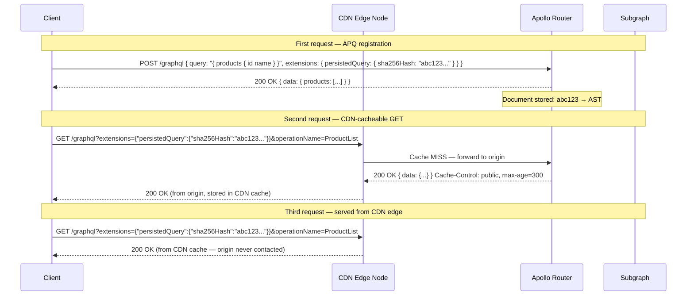

# 01 — CDN and Edge Caching

> CDN caching eliminates origin requests entirely for public, cacheable GraphQL operations. Achieving this requires solving two problems that don't exist in REST: POST requests are not cached by CDNs, and the query document is too large to fit in a URL. This chapter covers the persisted query + GET pattern that unlocks CDN caching, Cloudflare Workers and Fastly VCL implementations for GraphQL-aware cache logic, per-operation TTL via `@cacheControl` headers, and surrogate key / cache tag strategies for targeted invalidation at the CDN layer.

---

## Learning Objectives

- [ ] Explain why HTTP POST requests are not cached by CDNs and why this is the default for GraphQL
- [ ] Implement Automatic Persisted Queries (APQ) with `useGETForHashedQueries` to enable CDN caching
- [ ] Write a Cloudflare Worker that parses GraphQL operation names from POST bodies and uses them as cache keys
- [ ] Configure Fastly VCL to construct stable GraphQL cache keys and set surrogate keys for targeted purging
- [ ] Propagate `Cache-Control` and `Surrogate-Control` headers from Apollo Router to the CDN layer
- [ ] Implement surrogate key (Fastly) and cache tag (Cloudflare) invalidation when mutations change underlying data

---

## Overview

CDNs cache HTTP responses at globally distributed edge nodes. When a client in Frankfurt sends a request, the Frankfurt edge node checks its local cache before forwarding to the origin in us-east-1. On a cache hit, the response travels zero hops to the origin — latency is determined by the Frankfurt-to-client distance, not the Frankfurt-to-us-east-1 distance. For read-heavy public APIs, CDN caching is the highest-leverage optimization available.

The fundamental barrier for GraphQL is HTTP method semantics. The HTTP specification defines POST as non-idempotent: the server is expected to process the request body and potentially create or mutate state. Because CDNs cannot know in advance whether a POST request is safe to cache, they do not cache POST responses. This is correct behavior for REST write endpoints. It is an obstacle for GraphQL queries that happen to use POST for transport convenience.

The solution has two components. First, switch from POST to GET for query operations. GET requests are defined as safe and idempotent by the HTTP specification, and CDNs cache them by default. Second, avoid putting the full query document in the URL. Query documents can easily exceed 1–2KB and some queries (with fragments, multiple operations) can be 10KB or more. URLs have practical limits. Persisted queries solve this: the client registers the query document once and subsequently sends only its SHA-256 hash. The CDN caches the response keyed on a URL containing only the compact hash.



---

## Persisted Queries + GET for CDN Cacheability

### Client Configuration

The Apollo Client `createPersistedQueryLink` handles the full APQ protocol automatically. On first execution it sends the hash; if the server reports the hash is unknown it retries with the full document; on subsequent requests it sends only the hash.

```typescript
// src/apollo-client.ts
import { ApolloClient, InMemoryCache, HttpLink } from '@apollo/client';
import { createPersistedQueryLink } from '@apollo/client/link/persisted-queries';
import { sha256 } from 'crypto-hash';

// Persisted query link: handles APQ protocol and GET switching
const persistedQueryLink = createPersistedQueryLink({
  sha256,
  // Critical: use GET for hashed queries so CDN can cache the response
  useGETForHashedQueries: true,
  // Disable for mutations — mutations must always be POST
  disable: (error) => {
    // If the server is in strict allowlist mode and rejects unknown hashes,
    // don't retry with the full document — fail immediately
    if (error.message === 'PersistedQueryNotSupported') return true;
    return false;
  },
});

const httpLink = new HttpLink({
  uri: 'https://api.acme-corp.com/graphql',
  // Include credentials for authenticated requests (private cache)
  credentials: 'include',
});

export const apolloClient = new ApolloClient({
  link: persistedQueryLink.concat(httpLink),
  cache: new InMemoryCache(),
  // Apollo Client in-memory cache for client-side caching
  defaultOptions: {
    watchQuery: {
      // fetchPolicy: 'cache-and-network' returns cached data immediately,
      // then updates when the network response arrives
      fetchPolicy: 'cache-and-network',
      nextFetchPolicy: 'cache-first',
    },
  },
});
```

### Apollo Router APQ Configuration

```yaml
# router.yaml
supergraph:
  listen: 0.0.0.0:4000
  path: /graphql

# Automatic Persisted Queries configuration
apq:
  enabled: true
  router:
    cache:
      # Use Redis for APQ document storage so all router replicas share the same store
      redis:
        urls:
          - "${REDIS_URL}"
        timeout: 2s
        ttl: 24h  # Documents expire after 24 hours of no use

# Forward cache-control headers upstream so the CDN knows the TTL
headers:
  all:
    response:
      - propagate:
          named: "cache-control"
      - propagate:
          named: "surrogate-control"
      - propagate:
          named: "surrogate-key"
      - propagate:
          named: "cache-tag"
```

### Cache-Control Headers from Apollo Router

Apollo Router computes a `Cache-Control` header from the `@cacheControl` directives on the fields resolved during execution. The router sets the header before the response is returned to the CDN layer. The CDN reads this header to determine whether to cache and for how long.

```yaml
# router.yaml — cacheControl plugin configuration
plugins:
  experimental.cache_control:
    # Emit Cache-Control header based on @cacheControl directive values
    enabled: true

# The resulting Cache-Control header for a fully public query:
# Cache-Control: public, max-age=300
#
# For a query with any PRIVATE field:
# Cache-Control: private, max-age=60
#
# For a query with any maxAge: 0 field:
# Cache-Control: no-store
```

To separate CDN TTL from browser TTL, use `Surrogate-Control` for the CDN and `Cache-Control` for the browser:

```typescript
// Custom header plugin for Apollo Router (Rhai script)
// router.yaml plugin configuration pointing to this script
fn supergraph_service(service) {
  let request = service.router_request;
  let response = service.router_response;

  // After execution, adjust cache headers
  response.headers["surrogate-control"] = response.headers["cache-control"];
  // Prevent browser from caching GraphQL responses directly
  // (the CDN layer handles caching; browser should always check CDN)
  if response.headers["cache-control"].contains("public") {
    response.headers["cache-control"] = "public, max-age=0, must-revalidate";
  }
}
```

---

## Cloudflare Workers for GraphQL-Aware Caching

Cloudflare Workers execute JavaScript at the edge before requests reach the origin. For GraphQL, a Worker can parse the operation name from the request body (POST) or query string (GET), construct a stable cache key, and serve responses from the Cloudflare Cache API — all without forwarding to the origin.

```typescript
// cloudflare-worker/graphql-cache.ts
export default {
  async fetch(request: Request, env: Env, ctx: ExecutionContext): Promise<Response> {
    // Only cache query operations, not mutations or subscriptions
    if (request.method === 'POST') {
      return handlePostRequest(request, env, ctx);
    }
    if (request.method === 'GET') {
      return handleGetRequest(request, env, ctx);
    }
    return fetch(request);
  },
};

async function handleGetRequest(
  request: Request,
  env: Env,
  ctx: ExecutionContext
): Promise<Response> {
  const url = new URL(request.url);
  const extensions = url.searchParams.get('extensions');

  if (!extensions) return fetch(request);

  let parsedExtensions: { persistedQuery?: { sha256Hash: string } };
  try {
    parsedExtensions = JSON.parse(extensions);
  } catch {
    return fetch(request);
  }

  const hash = parsedExtensions.persistedQuery?.sha256Hash;
  if (!hash) return fetch(request);

  // Stable cache key: host + operation hash + variables (sorted)
  const variables = url.searchParams.get('variables') ?? '{}';
  const operationName = url.searchParams.get('operationName') ?? 'anonymous';

  // Sort variables to normalize key regardless of property order
  let sortedVariables = '{}';
  try {
    const parsed = JSON.parse(variables);
    sortedVariables = JSON.stringify(sortedObject(parsed));
  } catch {
    sortedVariables = variables;
  }

  const cacheKey = new Request(
    `https://graphql-cache.internal/${url.hostname}/${operationName}/${hash}/${encodeURIComponent(sortedVariables)}`,
    { method: 'GET' }
  );

  const cache = caches.default;
  const cachedResponse = await cache.match(cacheKey);

  if (cachedResponse) {
    // Return cached response with a header indicating cache hit
    const response = new Response(cachedResponse.body, cachedResponse);
    response.headers.set('X-Cache', 'HIT');
    response.headers.set('X-Cache-Key', `${operationName}/${hash.slice(0, 8)}`);
    return response;
  }

  // Cache miss — fetch from origin
  const originResponse = await fetch(request);

  // Only cache successful responses with Cache-Control: public
  const cacheControl = originResponse.headers.get('cache-control') ?? '';
  if (
    originResponse.status === 200 &&
    cacheControl.includes('public') &&
    !cacheControl.includes('no-store')
  ) {
    // Store in Cloudflare cache — ctx.waitUntil ensures this completes
    // even after the response is returned to the client
    ctx.waitUntil(cache.put(cacheKey, originResponse.clone()));
  }

  const response = new Response(originResponse.body, originResponse);
  response.headers.set('X-Cache', 'MISS');
  return response;
}

async function handlePostRequest(
  request: Request,
  env: Env,
  ctx: ExecutionContext
): Promise<Response> {
  // Read the body to determine operation type
  const body = await request.clone().json<{
    query?: string;
    operationName?: string;
    variables?: Record<string, unknown>;
    extensions?: { persistedQuery?: { sha256Hash: string } };
  }>();

  // Detect mutation — never cache mutations
  const query = body.query ?? '';
  if (query.trimStart().startsWith('mutation')) {
    return fetch(request);
  }

  // If this is an APQ hash-only POST (no full query), don't cache POST
  // The client will retry with GET once the hash is registered
  const hash = body.extensions?.persistedQuery?.sha256Hash;
  if (hash && !body.query) {
    // Unknown hash — server will return PersistedQueryNotFound, client retries with full doc
    return fetch(request);
  }

  // Regular POST query — forward to origin without caching
  // (CDN cannot cache POST — this will only cache on APQ GET retry)
  return fetch(request);
}

// Recursively sort object keys for deterministic JSON serialization
function sortedObject(obj: unknown): unknown {
  if (typeof obj !== 'object' || obj === null) return obj;
  if (Array.isArray(obj)) return obj.map(sortedObject);
  return Object.fromEntries(
    Object.entries(obj as Record<string, unknown>)
      .sort(([a], [b]) => a.localeCompare(b))
      .map(([k, v]) => [k, sortedObject(v)])
  );
}

interface Env {
  ORIGIN_URL: string;
}
```

### Cloudflare Cache Tags for Invalidation

Cloudflare supports cache tags (called Cache-Tag headers) that allow purging all cached responses associated with a tag in a single API call. Tag cache entries with entity IDs at the origin, then purge by tag when data changes.

```typescript
// In Apollo Router or subgraph response processing — add Cache-Tag headers
// These are stripped from the client response by Cloudflare but used for purging

// Cloudflare Workers — extract and forward Cache-Tag from origin
async function addCacheTags(response: Response, entityTags: string[]): Promise<Response> {
  const newResponse = new Response(response.body, response);
  newResponse.headers.set('Cache-Tag', entityTags.join(','));
  return newResponse;
}

// Cache-Tag header example:
// Cache-Tag: product:prod-123,category:electronics,brand:acme
```

```bash
# Purge all cached responses tagged with a specific product ID
# Called from the mutation handler when a product is updated
curl -X POST "https://api.cloudflare.com/client/v4/zones/${ZONE_ID}/purge_cache" \
  -H "Authorization: Bearer ${CLOUDFLARE_API_TOKEN}" \
  -H "Content-Type: application/json" \
  -d '{
    "tags": ["product:prod-123", "category:electronics"]
  }'
```

---

## Fastly VCL for GraphQL Cache Key Construction

Fastly uses VCL (Varnish Configuration Language) for cache logic. Unlike Cloudflare Workers (JavaScript), VCL is a domain-specific language optimized for HTTP cache manipulation. The following VCL constructs a stable GraphQL cache key from the request and sets surrogate keys for targeted purging.

```vcl
// fastly-graphql.vcl
// Place in vcl_recv and vcl_hash

sub vcl_recv {
  #FASTLY recv

  // Only cache GET requests (APQ with useGETForHashedQueries)
  if (req.method == "POST") {
    // Allow POST but bypass cache — mutations and non-APQ queries
    return(pass);
  }

  // Extract the persisted query hash from the extensions parameter
  // URL: /graphql?extensions={"persistedQuery":{"sha256Hash":"abc123"}}
  if (req.url ~ "[?&]extensions=") {
    declare local var.extensions STRING;
    set var.extensions = urldecode(regsub(req.url, "^.*[?&]extensions=([^&]*).*$", "\1"));

    // Extract sha256Hash from the extensions JSON
    // Simple regex extraction — works for the standard APQ format
    if (var.extensions ~ "\"sha256Hash\":\"([a-f0-9]{64})\"") {
      set req.http.X-GQL-Hash = re.group.1;
    }
  }

  // Extract operationName for cache key and logging
  if (req.url ~ "[?&]operationName=([^&]+)") {
    set req.http.X-GQL-Operation = urldecode(re.group.1);
  }

  // If we have a hash and an operation name, this is a cacheable persisted query
  if (req.http.X-GQL-Hash && req.http.X-GQL-Operation) {
    // Pass through — hash and custom headers set, vcl_hash will build the key
    return(hash);
  }

  // No hash — forward to origin without caching
  return(pass);
}

sub vcl_hash {
  #FASTLY hash

  // Build a stable cache key:
  // host + operation name + query hash + variables (sorted, normalized)
  hash_data(req.http.host);
  hash_data("/graphql");
  hash_data(req.http.X-GQL-Operation);
  hash_data(req.http.X-GQL-Hash);

  // Include variables in the key (already URL-decoded by vcl_recv)
  if (req.url ~ "[?&]variables=([^&]*)") {
    hash_data(urldecode(re.group.1));
  }

  // Separate private cache by user — include Authorization header hash
  // This prevents private responses from being served to other users
  if (req.http.Authorization) {
    // Hash the auth token rather than including it raw in the cache key
    // (cache keys may be logged)
    hash_data(digest.hash_sha256(req.http.Authorization));
  }

  return(hash);
}

sub vcl_fetch {
  #FASTLY fetch

  // Set Surrogate-Key from the origin response header
  // The origin sets Surrogate-Key: product:prod-123 category:electronics
  // Fastly stores this association and allows purging by surrogate key

  if (beresp.http.Surrogate-Control) {
    // Parse TTL from Surrogate-Control header
    // Surrogate-Control: max-age=300
    if (beresp.http.Surrogate-Control ~ "max-age=(\d+)") {
      set beresp.ttl = std.integer(re.group.1, 0)s;
    }
  } else if (beresp.http.Cache-Control ~ "public") {
    // Fallback: use Cache-Control max-age for the Fastly TTL
    if (beresp.http.Cache-Control ~ "max-age=(\d+)") {
      set beresp.ttl = std.integer(re.group.1, 0)s;
    }
  } else {
    // No cacheable headers — do not cache
    set beresp.ttl = 0s;
    return(pass);
  }

  // Enable stale-while-revalidate: serve stale content while revalidating
  // This prevents thundering herd on cache expiry
  set beresp.stale_while_revalidate = 60s;
  set beresp.stale_if_error = 300s;

  // Remove Surrogate-Control before sending to client
  // (this is an origin-to-CDN header, not a client header)
  unset beresp.http.Surrogate-Control;

  return(deliver);
}

sub vcl_deliver {
  #FASTLY deliver

  // Add cache status header for debugging
  if (obj.hits > 0) {
    set resp.http.X-Cache = "HIT";
    set resp.http.X-Cache-Hits = obj.hits;
  } else {
    set resp.http.X-Cache = "MISS";
  }

  // Remove internal routing headers before sending to client
  unset resp.http.X-GQL-Hash;
  unset resp.http.X-GQL-Operation;
}
```

### Fastly Surrogate Key Invalidation

Surrogate keys (called `Surrogate-Key` in Fastly) allow purging all cached responses tagged with a specific key in a single API call. The origin sets the surrogate key header; Fastly strips it from the client response but remembers the association.

```typescript
// src/cache/fastly-invalidation.ts
import axios from 'axios';

export class FastlySurrogateKeyInvalidation {
  constructor(
    private readonly serviceId: string,
    private readonly apiToken: string
  ) {}

  /**
   * Purge all Fastly cached responses tagged with the given surrogate keys.
   * Fastly propagates purges globally within ~150ms (Instant Purge API).
   */
  async purgeByKeys(keys: string[]): Promise<void> {
    if (keys.length === 0) return;

    // Fastly supports purging up to 256 surrogate keys per request
    const batches = chunk(keys, 256);

    await Promise.all(
      batches.map((batch) =>
        axios.post(
          `https://api.fastly.com/service/${this.serviceId}/purge`,
          null,
          {
            headers: {
              'Fastly-Key': this.apiToken,
              'Surrogate-Key': batch.join(' '),
              // Instant Purge (vs Soft Purge which only marks as stale)
              'Fastly-Soft-Purge': '0',
            },
          }
        )
      )
    );
  }

  async purgeEntireCache(): Promise<void> {
    // Nuclear option — purge everything (use only in emergencies)
    await axios.post(
      `https://api.fastly.com/service/${this.serviceId}/purge_all`,
      null,
      { headers: { 'Fastly-Key': this.apiToken } }
    );
  }
}

function chunk<T>(arr: T[], size: number): T[][] {
  const result: T[][] = [];
  for (let i = 0; i < arr.length; i += size) {
    result.push(arr.slice(i, i + size));
  }
  return result;
}
```

### Setting Surrogate Keys from Subgraphs

Subgraphs must emit surrogate keys as response headers. The router propagates these headers to the CDN layer. A middleware or plugin at the subgraph level collects entity references during resolver execution and appends them to the response.

```typescript
// src/subgraph/plugins/surrogate-key-plugin.ts
import type { ApolloServerPlugin, BaseContext } from '@apollo/server';

/**
 * Apollo Server plugin that collects entity references during resolver execution
 * and emits Surrogate-Key and Cache-Tag headers on the response.
 *
 * Subgraph resolvers call context.addSurrogateKey('product:prod-123')
 * and this plugin collects them and sets the header.
 */
export function surrogateKeyPlugin(): ApolloServerPlugin<{
  surrogateKeys: Set<string>;
}> {
  return {
    async requestDidStart() {
      return {
        async willSendResponse(requestContext) {
          const keys = requestContext.contextValue.surrogateKeys;
          if (!keys || keys.size === 0) return;

          const keyString = Array.from(keys).join(' ');
          // Fastly surrogate key format: space-separated values
          requestContext.response.http.headers.set('Surrogate-Key', keyString);
          // Cloudflare cache tag format: comma-separated values
          requestContext.response.http.headers.set('Cache-Tag', Array.from(keys).join(','));
        },
      };
    },
  };
}

// Usage in GraphQL context factory
export function createContext(): { surrogateKeys: Set<string> } & GraphQLContext {
  const surrogateKeys = new Set<string>();
  return {
    surrogateKeys,
    addSurrogateKey: (...keys: string[]) => keys.forEach((k) => surrogateKeys.add(k)),
    // ... rest of context
  };
}

// Usage in resolver
export async function productResolver(
  _parent: unknown,
  args: { id: string },
  context: GraphQLContext
): Promise<Product> {
  const product = await context.loaders.product.load(args.id);
  // Tag this response with the product entity key
  context.addSurrogateKey(`product:${args.id}`, `category:${product.categoryId}`);
  return product;
}
```

---

## Per-Operation TTL via @cacheControl

The `@cacheControl` directive controls the TTL that Apollo Router includes in the `Cache-Control` response header. The CDN reads this header to determine how long to cache the response.

```graphql
# products-subgraph/schema.graphql

# Directive definition (provided by Apollo Server automatically,
# but shown here for documentation clarity)
directive @cacheControl(
  maxAge: Int
  scope: CacheControlScope
  inheritMaxAge: Boolean
) on FIELD_DEFINITION | OBJECT | INTERFACE | UNION

enum CacheControlScope {
  PUBLIC
  PRIVATE
}

type Query {
  # Product detail: cacheable for 5 minutes, public
  product(id: ID!): Product @cacheControl(maxAge: 300, scope: PUBLIC)

  # Product catalog: cacheable for 1 hour, public (changes rarely)
  products(first: Int, category: ID): ProductConnection @cacheControl(maxAge: 3600, scope: PUBLIC)

  # Navigation (mega menu): cacheable for 24 hours, public
  navigation: NavigationTree @cacheControl(maxAge: 86400, scope: PUBLIC)

  # Search results: short TTL (5 seconds) — results change frequently
  search(query: String!, filters: SearchFilters): SearchResults @cacheControl(maxAge: 5, scope: PUBLIC)

  # Current user's cart: private, 30 seconds (realtime feel)
  cart: Cart @cacheControl(maxAge: 30, scope: PRIVATE)

  # Live inventory — never cache
  stockLevel(productId: ID!): Int @cacheControl(maxAge: 0)
}

type Product {
  id: ID!
  name: String!         @cacheControl(maxAge: 3600)   # Stable
  slug: String!         @cacheControl(maxAge: 3600)
  description: String   @cacheControl(maxAge: 1800)   # Changes occasionally
  price: Money!         @cacheControl(maxAge: 300)     # Changes with promotions
  compareAtPrice: Money @cacheControl(maxAge: 300)
  images: [Image!]!     @cacheControl(maxAge: 86400, scope: PUBLIC)
  # Stock is live — one uncacheable field poisons the response TTL
  stockCount: Int!      @cacheControl(maxAge: 0)
  category: Category!   @cacheControl(inheritMaxAge: true)  # Inherits from parent
}
```

### TTL Propagation Rules

Apollo Router applies the following rules to compute the effective TTL for a response:

1. **Minimum wins.** The effective maxAge is the minimum across all resolved fields. One `maxAge: 0` field makes the entire response uncacheable.
2. **Scope escalates to private.** If any field has `scope: PRIVATE`, the entire response is PRIVATE — it cannot be stored in a shared cache.
3. **inheritMaxAge.** A field annotated with `inheritMaxAge: true` uses the maxAge of its parent type rather than its own definition. Useful for fields on types that are always resolved in the context of a known entity.
4. **defaultMaxAge.** If a field has no `@cacheControl` annotation, it uses `defaultMaxAge` from the plugin configuration (typically 0 in production — safe default).

```yaml
# router.yaml — enforce strict default caching policy
preview_entity_cache:
  enabled: true
  
plugins:
  # Response cache with strict defaults
  apollo.cache_control:
    # Default maxAge for unannotated fields
    # 0 = uncacheable unless explicitly annotated
    default_max_age: 0
    # Emit Cache-Control header on every response
    calculate_http_headers: true
```

---

## Cache Invalidation Strategies at the CDN Layer

### Strategy 1: TTL-Based Expiry

The simplest approach. Set `maxAge` values that reflect the natural staleness tolerance for each entity type. The CDN serves from cache until TTL expires, then fetches fresh from origin.

- **Pros:** Zero complexity, zero infrastructure.
- **Cons:** Stale data for up to `maxAge` seconds. Not suitable for data that changes on demand (mutations).
- **Use for:** Reference data, navigation, product catalogs, public content.

### Strategy 2: Surrogate Key Purge (Fastly) / Cache Tag Purge (Cloudflare)

Tag cached responses with entity identifiers. When a mutation changes an entity, call the CDN purge API with the entity's tag. All cached responses that include that entity are immediately invalidated.

```typescript
// src/resolvers/mutation/product-mutation.ts
import { FastlySurrogateKeyInvalidation } from '../../cache/fastly-invalidation';

export async function updateProduct(
  _: unknown,
  args: { id: string; input: UpdateProductInput },
  context: GraphQLContext
): Promise<Product> {
  const product = await context.db.products.update(args.id, args.input);

  // Immediately purge all CDN-cached responses that reference this product
  // Fastly's Instant Purge API completes globally within ~150ms
  await context.fastlyPurge.purgeByKeys([
    `product:${args.id}`,
    `category:${product.categoryId}`,
    // Purge the product list page for this category too
    `product-list:${product.categoryId}`,
  ]);

  return product;
}
```

### Strategy 3: Stale-While-Revalidate

The CDN serves a stale (expired) response while asynchronously fetching a fresh response from the origin. The next request after the fresh response arrives gets the updated content. This eliminates the latency spike that occurs when a popular cached response expires.

```vcl
// Fastly VCL — enable stale-while-revalidate
sub vcl_fetch {
  // Serve stale for up to 60 seconds while background refresh runs
  set beresp.stale_while_revalidate = 60s;
  // Serve stale for up to 5 minutes if the origin returns an error
  set beresp.stale_if_error = 300s;
}
```

```typescript
// Cloudflare Workers — stale-while-revalidate via waitUntil
async function handleWithSWR(
  request: Request,
  cacheKey: Request,
  env: Env,
  ctx: ExecutionContext
): Promise<Response> {
  const cache = caches.default;
  const cached = await cache.match(cacheKey);

  if (cached) {
    const age = getAge(cached);
    const maxAge = getMaxAge(cached);

    if (age > maxAge) {
      // Cache is stale — serve it immediately, refresh in background
      ctx.waitUntil(
        fetch(request).then((fresh) => {
          if (fresh.ok) cache.put(cacheKey, fresh);
        })
      );
      const staleResponse = new Response(cached.body, cached);
      staleResponse.headers.set('X-Cache', 'STALE');
      return staleResponse;
    }

    const hitResponse = new Response(cached.body, cached);
    hitResponse.headers.set('X-Cache', 'HIT');
    return hitResponse;
  }

  // Cache miss — fetch from origin
  const fresh = await fetch(request);
  if (fresh.ok) ctx.waitUntil(cache.put(cacheKey, fresh.clone()));
  return fresh;
}

function getAge(response: Response): number {
  const date = response.headers.get('date');
  if (!date) return Infinity;
  return (Date.now() - new Date(date).getTime()) / 1000;
}

function getMaxAge(response: Response): number {
  const cc = response.headers.get('cache-control') ?? '';
  const match = cc.match(/max-age=(\d+)/);
  return match ? parseInt(match[1], 10) : 0;
}
```

---

## Production Considerations

### Security

- **Never cache responses containing authentication tokens.** If a response body includes a JWT, OAuth token, or session identifier, mark that field `@cacheControl(maxAge: 0, scope: PRIVATE)`. A cached response served to the wrong user is a credential leak.
- **Validate operation name at the CDN layer.** Cloudflare Workers can reject requests whose operation name doesn't match a known allowlist — a lightweight WAF that stops scraping operations from reaching the origin.
- **Strip internal headers before returning to clients.** `Surrogate-Key`, `Cache-Tag`, and `X-GQL-Hash` are internal routing headers. Ensure VCL or Worker logic removes them from client responses.

### Performance

- **Monitor CDN hit rate by operation.** Not all operations benefit equally from CDN caching. Track `X-Cache: HIT` vs `MISS` broken down by operation name. Operations with low hit rates either have high variable cardinality (many different `id` values) or have too-short TTLs.
- **Warm the CDN cache after a purge storm.** Surrogate key purges can clear large portions of the cache simultaneously. If a product category update triggers purges for 10,000 product IDs, the next 10,000 requests all hit the origin simultaneously. Implement a cache warm-up step in the mutation handler that asynchronously re-fetches popular queries.
- **Consider operation-level TTL tuning.** Not all operations need the same TTL. `navigation` might be 24 hours; `productDetail` might be 5 minutes; `searchResults` might be 10 seconds. Use `@cacheControl` at the Query field level to set per-operation TTLs.

### Observability

| Metric | Source | Alert |
|--------|--------|-------|
| CDN hit ratio | Cloudflare Analytics / Fastly Dashboard | Alert if < 0.6 for public operations |
| Origin requests/s | CDN analytics | Alert on sudden spike (cache invalidation storm) |
| CDN purge latency | CDN API response time | Alert if > 500ms (Fastly Instant Purge should be < 200ms) |
| Surrogate key count | Custom metric (tags per response) | Alert if any response has > 100 surrogate keys |
| TTL = 0 operation ratio | Apollo Router metrics | Alert if > 20% of public operations are uncacheable |

---

## References

- [Apollo Client Persisted Queries](https://www.apollographql.com/docs/apollo-server/performance/apq/) — APQ protocol, client configuration, and server-side document store setup
- [Cloudflare Workers Cache API](https://developers.cloudflare.com/workers/runtime-apis/cache/) — Programmatic cache control in Cloudflare Workers
- [Fastly Surrogate Keys](https://developer.fastly.com/reference/http/http-headers/Surrogate-Key/) — Surrogate key invalidation API and VCL integration
- [HTTP Caching RFC 7234](https://datatracker.ietf.org/doc/html/rfc7234) — Formal definition of Cache-Control, Surrogate-Control, and cacheability semantics

---

## Related Topics

- [04-persisted-queries.md](./04-persisted-queries.md) — Full APQ deep dive including security allowlist and CI manifest generation
- [02-response-caching.md](./02-response-caching.md) — Apollo Router response cache sitting behind the CDN layer
- [05-cache-invalidation.md](./05-cache-invalidation.md) — Event-driven invalidation pipelines feeding CDN purge calls
- [../05-security/](../05-security/) — GraphQL WAF patterns and persisted query allowlist as a security control
