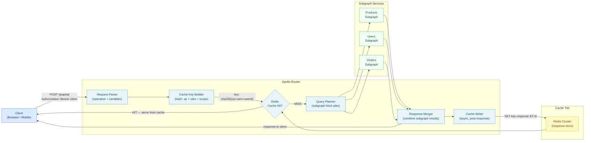

# 02 — Response Caching

> Response caching stores the full serialized result of a GraphQL operation and serves repeat requests without re-executing any resolvers or touching any database. In Apollo Federation, response caching lives at the router layer — between the client and the subgraphs — and is backed by Redis for horizontal scalability. This chapter covers the `@cacheControl` directive hierarchy, Apollo Router's response cache plugin configuration, private vs. public cache separation, TTL composition rules, mutation-triggered invalidation, and Redis cluster configuration for high-traffic deployments.

---

## Learning Objectives

- [ ] Annotate fields, types, and queries with `@cacheControl` and understand how min-wins TTL composition works
- [ ] Configure Apollo Router's response cache plugin with a Redis backend and verify cache headers
- [ ] Separate authenticated (PRIVATE) and unauthenticated (PUBLIC) response cache entries by user identity
- [ ] Implement mutation-triggered cache invalidation using Apollo Router's entity cache invalidation API
- [ ] Configure Redis Cluster for the response cache with TLS, connection timeouts, and eviction policy
- [ ] Build a cache warm-up strategy to pre-populate the response cache after cold starts

---

## Overview

Response caching at the router layer is the highest-leverage server-side caching strategy for a GraphQL federation system. When a cache hit occurs, the router returns the stored response payload without executing the query plan, making no outbound connections to any subgraph or database. The entire cost of an executed operation — query planning, N subgraph fetches, resolver execution, response serialization — is amortized across all subsequent requests that share the same cache key.

Unlike CDN caching (which requires GET semantics and public scope), response caching at the router layer handles authenticated requests, POST operations, and PRIVATE-scoped data. It applies to a broader class of operations at the cost of requiring infrastructure (Redis) and operating inside the origin network rather than at the CDN edge.



---

## The @cacheControl Directive

### Directive Definition

The `@cacheControl` directive is defined in the Apollo schema specification and recognized by Apollo Server and Apollo Router. It can be applied to field definitions, object types, interfaces, and unions.

```graphql
directive @cacheControl(
  # Maximum age in seconds. 0 = do not cache.
  maxAge: Int

  # PUBLIC: response can be stored in a shared cache (CDN, router cache)
  # PRIVATE: response must only be stored in a per-user cache
  scope: CacheControlScope

  # Use the parent type's maxAge instead of a fixed value.
  # Useful for fields on entity types that are always resolved
  # in the context of an already-resolved parent entity.
  inheritMaxAge: Boolean
) on FIELD_DEFINITION | OBJECT | INTERFACE | UNION

enum CacheControlScope {
  PUBLIC
  PRIVATE
}
```

### TTL Composition — How Minimum-Wins Works

Apollo Router collects `@cacheControl` hints from every resolver that executes during a request. The effective TTL for the entire response is the minimum maxAge value across all resolved fields. The scope is the least-permissive scope across all fields.

```graphql
# Schema annotations
type Query {
  product(id: ID!): Product     @cacheControl(maxAge: 300, scope: PUBLIC)
  currentUser: User             @cacheControl(maxAge: 60, scope: PRIVATE)
  stockLevel(productId: ID!): Int @cacheControl(maxAge: 0)
}

type Product {
  id: ID!
  name: String!                 @cacheControl(maxAge: 3600, scope: PUBLIC)
  price: Money!                 @cacheControl(maxAge: 300, scope: PUBLIC)
  stockCount: Int!              @cacheControl(maxAge: 0)  # kills caching
  category: Category            @cacheControl(inheritMaxAge: true)
}
```

For the operation:

```graphql
query ProductDetail($id: ID!) {
  product(id: $id) {
    id        # inherits Product maxAge: 300 from parent field
    name      # maxAge: 3600
    price     # maxAge: 300
    # stockCount NOT selected — doesn't affect TTL
  }
}
```

Effective response: `maxAge = min(300, 3600, 300) = 300`, `scope = PUBLIC`.

For the operation:

```graphql
query ProductWithStock($id: ID!) {
  product(id: $id) {
    name
    stockCount  # maxAge: 0 — poisons the entire response
  }
}
```

Effective response: `maxAge = min(3600, 0) = 0`. Response is not cached.

### Complete Schema Annotation Example

```graphql
# products-subgraph/schema.graphql

# Type-level annotation: default cache policy for all fields on this type
# unless overridden at the field level
type Product @cacheControl(maxAge: 300, scope: PUBLIC) {
  id: ID!
  name: String!
  slug: String!
  description: String           @cacheControl(maxAge: 1800)  # Override: longer TTL
  price: Money!                 @cacheControl(maxAge: 120)   # Override: shorter TTL
  compareAtPrice: Money         @cacheControl(maxAge: 120)
  images: [Image!]!             @cacheControl(maxAge: 86400, scope: PUBLIC)
  stockCount: Int!              @cacheControl(maxAge: 0)      # Never cache
  tags: [String!]!              @cacheControl(inheritMaxAge: true)
  category: Category!           @cacheControl(inheritMaxAge: true)
  relatedProducts: [Product!]   @cacheControl(maxAge: 600, scope: PUBLIC)
}

type Category @cacheControl(maxAge: 3600, scope: PUBLIC) {
  id: ID!
  name: String!
  slug: String!
  # Subcategory tree rarely changes
  children: [Category!]!        @cacheControl(maxAge: 7200, scope: PUBLIC)
}

type User @cacheControl(maxAge: 60, scope: PRIVATE) {
  id: ID!
  name: String!                 @cacheControl(maxAge: 300, scope: PRIVATE)
  email: String!                @cacheControl(maxAge: 300, scope: PRIVATE)
  # Financial data — extra restrictive
  accountBalance: Money!        @cacheControl(maxAge: 0, scope: PRIVATE)
  orders(first: Int): OrderConnection @cacheControl(maxAge: 30, scope: PRIVATE)
}

type Query {
  product(id: ID!): Product     @cacheControl(maxAge: 300, scope: PUBLIC)
  products(first: Int, after: String, category: ID): ProductConnection
                                @cacheControl(maxAge: 600, scope: PUBLIC)
  categories: [Category!]!      @cacheControl(maxAge: 3600, scope: PUBLIC)
  currentUser: User             @cacheControl(maxAge: 60, scope: PRIVATE)
  # Recommendations are user-specific and computed — short TTL, private
  recommendations: [Product!]   @cacheControl(maxAge: 300, scope: PRIVATE)
  # Promotions are public and change on a schedule
  activePromotions: [Promotion!]! @cacheControl(maxAge: 60, scope: PUBLIC)
}
```

---

## Apollo Router Response Cache Configuration

### Basic Configuration

```yaml
# router.yaml

supergraph:
  listen: 0.0.0.0:4000

# Enable the response cache plugin
preview_entity_cache:
  enabled: true

# Response cache plugin configuration
response_cache:
  enabled: true
  
  redis:
    # Single Redis node (use cluster URL for production)
    urls:
      - "redis://:${REDIS_PASSWORD}@redis-cache:6379/1"
    # Separate DB index from other Redis usage (sessions, rate limits)
    # /1 in URL above = SELECT 1
    
    # Connection timeout — fail fast if Redis is unavailable
    connect_timeout: 2s
    # Per-operation timeout
    timeout: 500ms
    
    # TLS for Redis in transit (required in production)
    tls:
      enabled: true
      # CA cert for self-signed certificates (e.g., ElastiCache)
      # certificate_authorities: /etc/ssl/certs/redis-ca.pem
    
    # Reconnect settings
    # ioredis-style retry with exponential backoff
    
  # Behavior when Redis is unavailable:
  # "miss": treat all cache lookups as misses (graceful degradation)
  # "error": return 503 to clients (strict mode)
  on_redis_error: miss
  
  # Separate private cache entries by authenticated user identity.
  # This is a JMESPath expression evaluated against the JWT claims.
  # If null/empty — the request is treated as unauthenticated (PUBLIC cache).
  private_id: "${.claims.sub}"
  
  # TTL for entries where no @cacheControl maxAge is set
  # null = do not cache unless @cacheControl maxAge is explicitly set
  ttl: null
  
  # Subgraph-level entity cache
  # Caches individual entity resolutions from each subgraph
  subgraph:
    all:
      enabled: true
      ttl: 60s
    products:
      enabled: true
      ttl: 300s
    users:
      enabled: true
      ttl: 30s
    orders:
      enabled: true  
      ttl: 10s
```

### Redis Cluster Configuration

For production at scale, use Redis Cluster for horizontal sharding and automatic failover:

```yaml
# router.yaml — Redis Cluster configuration
response_cache:
  enabled: true
  redis:
    # Cluster endpoints — provide at least 3 for quorum
    urls:
      - "redis://redis-cluster-0:6379"
      - "redis://redis-cluster-1:6379"
      - "redis://redis-cluster-2:6379"
    
    # Cluster mode enables automatic hash slot routing
    cluster_mode: true
    
    # Read from replicas for GET operations (reduces primary load)
    read_from_replicas: true
    
    timeout: 500ms
    connect_timeout: 2s
    
    tls:
      enabled: true
    
    # Pool configuration
    pool_size: 20
    min_idle: 5
```

### Cache Key Composition

Apollo Router builds the cache key from three components:

1. **Operation fingerprint:** SHA-256 hash of the normalized operation document + variable values.
2. **User scope:** If the response scope is PRIVATE, the user's stable identifier (from `private_id` JMESPath expression) is included.
3. **Schema hash:** A hash of the current supergraph schema version, ensuring cached entries are invalidated on schema deployment.

```
cache_key = sha256(
  schema_hash +
  operation_name +
  sha256(canonical_query_document) +
  sha256(sorted_variables_json) +
  (scope == PRIVATE ? user_id : "")
)
```

The key is then namespaced: `apollo-response-cache:{key}`.

### Response Cache Headers

Apollo Router emits cache metadata headers on every response for debugging:

```
# Cache HIT response
X-Cache: HIT
X-Cache-Age: 142         # Seconds since the cached entry was written
Cache-Control: public, max-age=300

# Cache MISS response  
X-Cache: MISS
Cache-Control: public, max-age=300

# Uncacheable response (maxAge: 0 or private with PRIVATE scope)
X-Cache: SKIP
Cache-Control: no-store
```

---

## Public vs. Private Cache Separation

### How Private Cache Works

When a response contains any field with `scope: PRIVATE`, the response must be stored per-user, not in the shared public cache. Apollo Router uses the `private_id` configuration to determine the cache partition.

```yaml
# router.yaml
response_cache:
  # JMESPath expression evaluated against the decoded JWT claims
  private_id: "${.claims.sub}"
  
  # Alternative: use a custom header set by the auth layer
  # private_id: "${request.headers['x-user-id']}"
```

The JWT is decoded (but not re-verified — verification happens at the auth plugin) to extract the `sub` claim. This becomes the partition key for private cache entries.

```
# Public cache entry (no user scope)
apollo-response-cache:a8f3b2c1...

# Private cache entry for user "usr_12345"
apollo-response-cache:PRIVATE:usr_12345:a8f3b2c1...
```

### PRIVATE Cache Entry Size Management

PRIVATE cache entries grow linearly with the number of active users. A deployment with 1 million active users, each with 10 cached operations of 5KB average size, requires 50GB of Redis storage just for private cache entries. Manage this with:

```yaml
response_cache:
  redis:
    # Key expiry must be set — private cache entries must self-expire
    # when users become inactive
    ttl: 3600s  # 1 hour default TTL for private entries
    
  # Per-user cache entry limit (requires custom plugin)
  # If a user accumulates more than N cached entries, LRU eviction applies
```

### Separating Public and Private Redis Instances

At scale, PRIVATE and PUBLIC cache entries have very different characteristics:
- PUBLIC entries are read-heavy, shared across all users, and can be large
- PRIVATE entries are write-heavy, user-partitioned, and have shorter useful lifetimes

```yaml
# router.yaml — separate Redis instances per cache scope
response_cache:
  enabled: true
  
  # Public cache: large, read-heavy, long TTL
  public_redis:
    urls:
      - "redis://redis-public-0:6379"
    pool_size: 30
    
  # Private cache: smaller entries, higher write rate, shorter TTL
  private_redis:
    urls:
      - "redis://redis-private-0:6379"
    pool_size: 20
    # Shorter max TTL for private entries
    max_ttl: 3600s
```

---

## Cache Invalidation on Mutation

### Apollo Router Entity Cache Invalidation API

Apollo Router (v1.40+) exposes an HTTP API for programmatic cache invalidation. Mutations can call this API after writing to the database to immediately invalidate affected cache entries.

```typescript
// src/cache/router-invalidation.ts

export class RouterCacheInvalidation {
  constructor(
    private readonly routerAdminUrl: string,
    private readonly adminToken: string
  ) {}

  /**
   * Invalidate cache entries for a specific entity.
   * The router matches entries whose response includes the specified entity.
   */
  async invalidateEntity(
    typename: string,
    id: string
  ): Promise<void> {
    await fetch(`${this.routerAdminUrl}/cache/invalidate`, {
      method: 'POST',
      headers: {
        'Content-Type': 'application/json',
        Authorization: `Bearer ${this.adminToken}`,
      },
      body: JSON.stringify({
        entities: [{ __typename: typename, id }],
      }),
    });
  }

  async invalidateEntities(
    entities: Array<{ __typename: string; id: string }>
  ): Promise<void> {
    await fetch(`${this.routerAdminUrl}/cache/invalidate`, {
      method: 'POST',
      headers: {
        'Content-Type': 'application/json',
        Authorization: `Bearer ${this.adminToken}`,
      },
      body: JSON.stringify({ entities }),
    });
  }

  async invalidateOperation(operationName: string): Promise<void> {
    await fetch(`${this.routerAdminUrl}/cache/invalidate`, {
      method: 'POST',
      headers: {
        'Content-Type': 'application/json',
        Authorization: `Bearer ${this.adminToken}`,
      },
      body: JSON.stringify({ operationName }),
    });
  }
}
```

### Using Invalidation in Mutation Resolvers

```typescript
// src/subgraph/products/resolvers/mutation.ts
import type { GraphQLContext } from '../../../context';

export const Mutation = {
  updateProduct: async (
    _: unknown,
    args: { id: string; input: UpdateProductInput },
    context: GraphQLContext
  ) => {
    // 1. Write to database
    const product = await context.db.products.update(args.id, args.input);

    // 2. Invalidate response cache entries that reference this product
    // Fire-and-forget — do not block the mutation response on cache invalidation
    context.routerInvalidation
      .invalidateEntities([
        { __typename: 'Product', id: args.id },
        { __typename: 'Category', id: product.categoryId },
      ])
      .catch((err) => {
        // Log but don't fail the mutation — stale cache is better than a failed mutation
        context.logger.error({ err, productId: args.id }, 'Failed to invalidate response cache');
      });

    return product;
  },

  createProduct: async (
    _: unknown,
    args: { input: CreateProductInput },
    context: GraphQLContext
  ) => {
    const product = await context.db.products.create(args.input);

    // Invalidate list operations that might include the new product
    context.routerInvalidation
      .invalidateOperation('ProductList')
      .catch((err) => context.logger.error({ err }, 'Failed to invalidate ProductList cache'));

    return product;
  },
};
```

### Redis-Based Invalidation (Alternative to Router API)

If the Router cache invalidation API is not available or insufficient, invalidate Redis keys directly using the same key construction algorithm:

```typescript
// src/cache/redis-invalidation.ts
import Redis from 'ioredis';
import { createHash } from 'crypto';

export class RedisResponseCacheInvalidation {
  constructor(
    private readonly redis: Redis,
    private readonly namespace: string = 'apollo-response-cache'
  ) {}

  /**
   * Scan for and delete all cache entries matching the given pattern.
   * Uses SCAN to avoid blocking Redis with KEYS.
   */
  async invalidatePattern(pattern: string): Promise<number> {
    const fullPattern = `${this.namespace}:${pattern}`;
    let cursor = '0';
    let deleted = 0;

    do {
      const [nextCursor, keys] = await this.redis.scan(
        cursor,
        'MATCH',
        fullPattern,
        'COUNT',
        200
      );
      cursor = nextCursor;

      if (keys.length > 0) {
        // Pipeline DEL commands for efficiency
        const pipeline = this.redis.pipeline();
        for (const key of keys) {
          pipeline.del(key);
        }
        await pipeline.exec();
        deleted += keys.length;
      }
    } while (cursor !== '0');

    return deleted;
  }

  async invalidateByOperationName(operationName: string): Promise<number> {
    // Cache keys include the operation name as a component
    return this.invalidatePattern(`*:${operationName}:*`);
  }
}
```

---

## Cache Warm-Up Strategies

After a cold start (new deployment, Redis flush, Redis failover), the response cache is empty. The first wave of requests after a cold start all become cache misses and hit the subgraphs simultaneously — a thundering herd that can overload the database tier.

### Strategy 1: Pre-Warm Top-N Operations

Before shifting traffic to new pods, execute the top-N operations from production traffic. This populates the cache with the most-accessed entries.

```typescript
// scripts/cache-warmup.ts
import { GraphQLClient } from 'graphql-request';

interface WarmupOperation {
  operationName: string;
  query: string;
  variables: Record<string, unknown>;
  priority: number; // Higher = warm first
}

async function warmResponseCache(
  routerUrl: string,
  operations: WarmupOperation[]
): Promise<void> {
  const client = new GraphQLClient(routerUrl);

  // Sort by priority — warm highest-traffic operations first
  const sorted = [...operations].sort((a, b) => b.priority - a.priority);

  // Warm in parallel batches to avoid overwhelming the subgraphs
  const batchSize = 10;
  for (let i = 0; i < sorted.length; i += batchSize) {
    const batch = sorted.slice(i, i + batchSize);
    await Promise.allSettled(
      batch.map(async (op) => {
        try {
          await client.request(op.query, op.variables, {
            'x-warm-up': 'true', // Custom header for observability
          });
          console.log(`Warmed: ${op.operationName}`);
        } catch (err) {
          console.warn(`Warm-up failed for ${op.operationName}:`, err);
        }
      })
    );
    // Brief pause between batches
    await new Promise((r) => setTimeout(r, 100));
  }
}

// Example warm-up manifest — generated from traffic replay
const WARMUP_OPERATIONS: WarmupOperation[] = [
  {
    operationName: 'NavigationMenu',
    query: `query NavigationMenu { categories { id name slug children { id name } } }`,
    variables: {},
    priority: 100, // Highest: every page load needs this
  },
  {
    operationName: 'FeaturedProducts',
    query: `query FeaturedProducts { products(first: 20, featured: true) { id name price images { url } } }`,
    variables: {},
    priority: 90,
  },
  // ... more operations
];

// Called in deployment pipeline before traffic shift
warmResponseCache(process.env.ROUTER_URL!, WARMUP_OPERATIONS)
  .then(() => console.log('Cache warm-up complete'))
  .catch((err) => {
    console.error('Cache warm-up failed:', err);
    process.exit(1);
  });
```

### Strategy 2: Lazy Warming with Probabilistic Early Expiry

Instead of warming on deployment, use probabilistic early expiry to pre-refresh cache entries before they expire. This eliminates the thundering herd at TTL boundary.

```typescript
// src/cache/probabilistic-early-expiry.ts
// Implements XFetch algorithm for cache stampede prevention

export function shouldRefreshEarly(
  ttl: number,          // Original TTL in seconds
  remainingTTL: number, // Seconds until expiry
  beta: number = 1.0    // Aggressiveness (1.0 = standard)
): boolean {
  // XFetch: P(refresh) increases as TTL countdown approaches 0
  // Specifically: refresh if (now - beta * delta * log(random())) >= expiry
  // Simplified: refresh if remaining_ttl <= beta * compute_time * log(1/random())
  const estimatedComputeMs = 50; // Estimated resolver execution time in ms
  const computeTimeSec = estimatedComputeMs / 1000;
  const random = Math.random();
  
  // As remaining TTL shrinks, probability of early refresh increases
  // This is the XFetch formula
  const threshold = beta * computeTimeSec * -Math.log(random);
  return remainingTTL - threshold <= 0;
}

// Usage in a cache-aside resolver pattern
export async function cachedResolve<T>(
  cacheKey: string,
  ttl: number,
  resolve: () => Promise<T>,
  redis: Redis
): Promise<T> {
  const [cachedValue, remainingTTL] = await Promise.all([
    redis.get(cacheKey),
    redis.ttl(cacheKey),
  ]);

  if (cachedValue !== null) {
    const value = JSON.parse(cachedValue) as T;

    // Probabilistic early refresh
    if (remainingTTL > 0 && shouldRefreshEarly(ttl, remainingTTL)) {
      // Refresh in background — return stale value immediately
      resolve()
        .then((fresh) => redis.setex(cacheKey, ttl, JSON.stringify(fresh)))
        .catch(console.error);
    }

    return value;
  }

  // Cache miss — compute and store
  const value = await resolve();
  await redis.setex(cacheKey, ttl, JSON.stringify(value));
  return value;
}
```

---

## Production Considerations

### Redis Eviction Policy

Configure Redis with `volatile-lru` eviction policy for the response cache database. This evicts the least-recently-used entries that have TTLs set, preserving entries without TTLs (which should not exist in the cache DB).

```
# redis.conf (or ElastiCache parameter group)
maxmemory 8gb
maxmemory-policy volatile-lru
maxmemory-samples 10
```

**Never use `allkeys-lru` for a response cache shared with session data.** Session keys without TTLs would be evicted under memory pressure.

### Circuit Breaker for Cache Reads

If Redis becomes unavailable, the router should degrade gracefully — bypass the cache and hit subgraphs directly — rather than return errors to clients:

```yaml
# router.yaml
response_cache:
  on_redis_error: miss  # Treat Redis errors as cache misses, not fatal errors
  redis:
    timeout: 200ms      # Tight timeout — miss quickly rather than waiting for Redis
    connect_timeout: 1s
```

### Observability

```typescript
// Cache metrics to emit (Prometheus)
const cacheMetrics = {
  hits: new promClient.Counter({
    name: 'graphql_response_cache_hits_total',
    help: 'Total response cache hits',
    labelNames: ['operation_name', 'scope'],
  }),
  misses: new promClient.Counter({
    name: 'graphql_response_cache_misses_total',
    help: 'Total response cache misses',
    labelNames: ['operation_name', 'scope'],
  }),
  invalidations: new promClient.Counter({
    name: 'graphql_response_cache_invalidations_total',
    help: 'Total cache invalidations',
    labelNames: ['entity_type', 'trigger'],
  }),
  redisLatencyMs: new promClient.Histogram({
    name: 'graphql_response_cache_redis_latency_ms',
    help: 'Redis read/write latency in milliseconds',
    buckets: [1, 5, 10, 25, 50, 100, 250],
  }),
};
```

Key operational metrics:

| Metric | Target | Alert |
|--------|--------|-------|
| Cache hit ratio (public) | > 0.7 | Alert if < 0.5 for 5 min |
| Cache hit ratio (private) | > 0.5 | Alert if < 0.3 for 5 min |
| Redis P99 latency | < 5ms | Alert if > 20ms |
| Cache invalidation rate | Baseline | Alert on 5x spike (invalidation storm) |
| Redis memory utilization | < 70% | Alert at > 80% |
| Redis evicted keys/sec | < 100 | Alert if > 1000 |

---

## References

- [Apollo Router Response Cache](https://www.apollographql.com/docs/router/configuration/cache/) — Official configuration reference for Apollo Router's response cache plugin
- [Apollo cacheControl Directive](https://www.apollographql.com/docs/apollo-server/performance/caching/#adding-cache-hints-to-your-schema) — Schema annotation guide for `@cacheControl`
- [Redis Eviction Policies](https://redis.io/docs/manual/eviction/) — Redis memory management and LRU eviction configuration
- [XFetch: Optimal Probabilistic Cache Stampede Prevention](https://cseweb.ucsd.edu/~avattani/papers/cache_stampede.pdf) — Research paper describing the probabilistic early expiry algorithm

---

## Related Topics

- [01-cdn-and-edge-caching.md](./01-cdn-and-edge-caching.md) — CDN layer that sits in front of the router response cache
- [03-resolver-caching.md](./03-resolver-caching.md) — Per-entity resolver cache for partial caching when full response caching is not possible
- [05-cache-invalidation.md](./05-cache-invalidation.md) — Event-driven invalidation pipelines for mutation-driven data changes
- [../06-performance-and-scaling/02-caching-strategies.md](../06-performance-and-scaling/02-caching-strategies.md) — Foundational caching patterns
