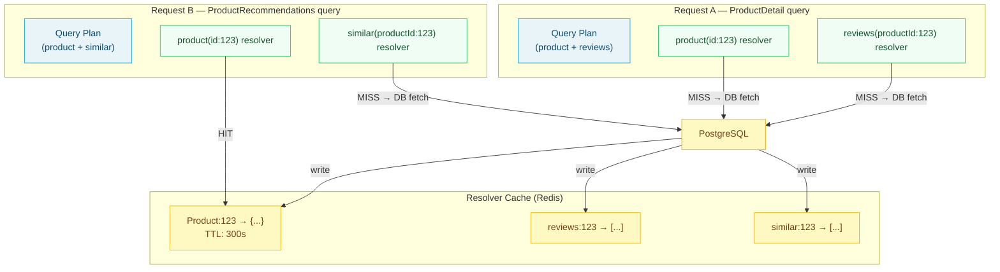

# 03 — Resolver Caching

> Resolver caching operates at the individual field resolution level — below the full response and above the database. DataLoader is the baseline: every entity-type resolver must use DataLoader for per-request batching and memoization. Cross-request resolver caching extends this to Redis for entities whose computation is expensive and whose results can be safely reused across requests. This chapter covers DataLoader's cache semantics, Redis-backed cross-request resolver caches, stale-while-revalidate at the resolver level, cache stampede prevention with distributed locks, and cache consistency patterns for write-through and write-invalidate architectures.

---

## Learning Objectives

- [ ] Implement DataLoader for batch loading with per-request memoization and understand its cache lifetime
- [ ] Design Redis cache keys for entity types that survive across requests
- [ ] Apply stale-while-revalidate in resolver code so clients never wait for a cache refresh
- [ ] Prevent cache stampede using Redis SET NX (distributed mutex) on high-traffic resolvers
- [ ] Implement write-through caching so mutations update both the database and the cache atomically
- [ ] Build a resolver cache decorator that wraps any async function with TTL-based Redis caching

---

## Overview

Response caching (chapter 02) caches the entire operation result. This is effective when the same operation with the same variables is repeated. But many real-world workloads have high query cardinality — many different operations that share common entity lookups. Two operations that both fetch `Product(id: "prod-123")` with different surrounding fields won't share a response cache entry, but they execute the same database query to resolve the product entity.

Resolver caching addresses this by caching at the entity level rather than the operation level. When `Product(id: "prod-123")` is resolved for the first time, the result is stored in a resolver cache keyed by `(Product, prod-123)`. Subsequent resolutions of that entity — regardless of which operation triggered them — are served from the resolver cache.

This creates a multiplicative caching effect. A deployment might have 10,000 unique operations in daily traffic, each with 50 unique variable combinations = 500,000 unique response cache keys, most with very low hit rates. But if those operations all share references to 10,000 products, the resolver cache for those products sees extremely high hit rates.



---

## DataLoader — Per-Request Batching and Memoization

### DataLoader Cache Lifetime

DataLoader's built-in cache is scoped to a single request. A new DataLoader instance is created for each incoming request, populated during that request's resolver execution, and garbage-collected when the request completes. This is intentional and important:

- **Why scoped to one request?** GraphQL resolves fields concurrently within a single request. DataLoader's cache deduplicates identical loads within that concurrent execution. If the cache persisted across requests, it would serve stale data to subsequent requests without a TTL mechanism.
- **The cache is identity-based:** DataLoader uses `===` equality on keys by default. For string IDs this is fine. For object keys, you must provide a `cacheKeyFn`.
- **DataLoader does not replace a database cache.** It prevents N+1 queries within a request. It does not reduce database load across requests.

```typescript
// src/dataloaders/product-loader.ts
import DataLoader from 'dataloader';
import type { Pool } from 'pg';
import type { Product } from '../types';

/**
 * Create a DataLoader for batch-loading products by ID.
 * 
 * A new instance must be created per request — do NOT share across requests.
 * The loader batches all product.load(id) calls that occur within a single
 * tick of the Node.js event loop into a single SELECT IN query.
 */
export function createProductLoader(db: Pool): DataLoader<string, Product | null> {
  return new DataLoader<string, Product | null>(
    async (ids: readonly string[]): Promise<(Product | null)[]> => {
      const { rows } = await db.query<Product>(
        `SELECT * FROM products WHERE id = ANY($1::uuid[]) AND deleted_at IS NULL`,
        [ids]
      );

      // DataLoader requires results in the same order as the input IDs
      // and one result per ID (null if not found)
      const productMap = new Map(rows.map((p) => [p.id, p]));
      return ids.map((id) => productMap.get(id) ?? null);
    },
    {
      // Maximum batch size — prevent oversized IN queries
      maxBatchSize: 500,

      // Cache is per-request by default (cache: true)
      // Set to false only if you're implementing an external cache layer
      // and want DataLoader to be a pure batching mechanism
      cache: true,

      // Custom cache key function — useful when IDs are objects
      // cacheKeyFn: (key) => key.toString(),
    }
  );
}

// src/context.ts — create fresh DataLoader instances per request
export function createContext(db: Pool) {
  return {
    db,
    loaders: {
      product: createProductLoader(db),
      user: createUserLoader(db),
      category: createCategoryLoader(db),
      order: createOrderLoader(db),
    },
  };
}
```

### Disabling DataLoader Cache for Cross-Request Caching

When implementing a Redis-backed cross-request resolver cache, disable DataLoader's internal cache to avoid double-caching:

```typescript
// Cross-request cached DataLoader — Redis is the cache, DataLoader is only the batcher
export function createCachedProductLoader(
  db: Pool,
  redis: Redis
): DataLoader<string, Product | null> {
  return new DataLoader<string, Product | null>(
    async (ids: readonly string[]) => {
      // Check Redis first for each ID
      const cacheKeys = ids.map((id) => `product:${id}`);
      const cached = await redis.mget(...cacheKeys);

      const misses: string[] = [];
      const results = new Map<string, Product | null>();

      cached.forEach((value, i) => {
        if (value !== null) {
          results.set(ids[i], JSON.parse(value) as Product);
        } else {
          misses.push(ids[i]);
        }
      });

      // Fetch misses from database
      if (misses.length > 0) {
        const { rows } = await db.query<Product>(
          `SELECT * FROM products WHERE id = ANY($1::uuid[])`,
          [misses]
        );

        // Write fetched products to Redis
        const pipeline = redis.pipeline();
        const productMap = new Map(rows.map((p) => [p.id, p]));
        for (const id of misses) {
          const product = productMap.get(id) ?? null;
          results.set(id, product);
          if (product !== null) {
            // Cache for 5 minutes
            pipeline.setex(`product:${id}`, 300, JSON.stringify(product));
          }
        }
        await pipeline.exec();
      }

      return ids.map((id) => results.get(id) ?? null);
    },
    {
      // Disable DataLoader's internal cache — Redis is the cache layer
      cache: false,
      maxBatchSize: 200,
    }
  );
}
```

---

## Redis as a Cross-Request Resolver Cache

### Cache Key Design

Cache keys must be stable, deterministic, and unique per entity. The recommended pattern:

```
{entity-type}:{entity-id}
{entity-type}:{entity-id}:{field-name}  (for computed or derived fields)
{entity-type}:list:{sorted-filter-hash}  (for list queries)
```

```typescript
// src/cache/resolver-cache.ts
import Redis from 'ioredis';
import { createHash } from 'crypto';

export class ResolverCache {
  constructor(
    private readonly redis: Redis,
    private readonly defaultTTL: number = 300 // 5 minutes
  ) {}

  // Entity cache key: Product:prod-123
  entityKey(typename: string, id: string): string {
    return `${typename}:${id}`;
  }

  // List cache key: Product:list:a8f3b2c1 (hash of filter args)
  listKey(typename: string, args: Record<string, unknown>): string {
    const argsHash = createHash('sha256')
      .update(JSON.stringify(sortedObject(args)))
      .digest('hex')
      .slice(0, 16);
    return `${typename}:list:${argsHash}`;
  }

  // Computed field cache key: Product:prod-123:recommendations
  fieldKey(typename: string, id: string, field: string): string {
    return `${typename}:${id}:${field}`;
  }

  async get<T>(key: string): Promise<T | null> {
    const value = await this.redis.get(key);
    if (value === null) return null;
    return JSON.parse(value) as T;
  }

  async set<T>(key: string, value: T, ttlSeconds?: number): Promise<void> {
    const ttl = ttlSeconds ?? this.defaultTTL;
    await this.redis.setex(key, ttl, JSON.stringify(value));
  }

  async del(key: string): Promise<void> {
    await this.redis.del(key);
  }

  async delMany(keys: string[]): Promise<void> {
    if (keys.length === 0) return;
    await this.redis.del(...keys);
  }

  // Get the remaining TTL — useful for stale-while-revalidate
  async ttl(key: string): Promise<number> {
    return this.redis.ttl(key);
  }
}

function sortedObject(obj: unknown): unknown {
  if (typeof obj !== 'object' || obj === null) return obj;
  if (Array.isArray(obj)) return obj.map(sortedObject);
  return Object.fromEntries(
    Object.entries(obj as Record<string, unknown>)
      .sort(([a], [b]) => a.localeCompare(b))
      .map(([k, v]) => [k, sortedObject(v)])
  );
}
```

### Resolver Cache Decorator

A higher-order function that wraps any async resolver with cache-aside logic:

```typescript
// src/cache/with-cache.ts
import type { ResolverCache } from './resolver-cache';

interface CacheOptions {
  ttl?: number;         // Override default TTL
  skip?: () => boolean; // Skip cache in certain conditions
}

/**
 * Wraps an async function with cache-aside logic.
 * On cache miss, executes the function and stores the result.
 * On cache hit, returns the stored result without executing the function.
 *
 * Usage:
 *   const getProduct = withCache(cache, (id) => cache.entityKey('Product', id), fetchProduct);
 *   const product = await getProduct('prod-123');
 */
export function withCache<TArgs extends unknown[], TResult>(
  cache: ResolverCache,
  keyFn: (...args: TArgs) => string,
  fn: (...args: TArgs) => Promise<TResult>,
  options: CacheOptions = {}
): (...args: TArgs) => Promise<TResult> {
  return async (...args: TArgs): Promise<TResult> => {
    // Allow bypassing cache (e.g., during testing, or for certain user roles)
    if (options.skip?.()) {
      return fn(...args);
    }

    const key = keyFn(...args);
    const cached = await cache.get<TResult>(key);

    if (cached !== null) {
      return cached;
    }

    // Cache miss — execute and store
    const result = await fn(...args);

    // Don't cache null results (entity not found) to avoid negative caching
    // unless explicitly desired
    if (result !== null) {
      await cache.set(key, result, options.ttl);
    }

    return result;
  };
}

// Usage example in a subgraph resolver
const getCachedProduct = withCache(
  resolverCache,
  (id: string) => resolverCache.entityKey('Product', id),
  async (id: string) => {
    const { rows } = await db.query('SELECT * FROM products WHERE id = $1', [id]);
    return rows[0] ?? null;
  },
  { ttl: 300 }
);

// In resolver:
export const productResolver = async (_: unknown, args: { id: string }, ctx: Context) => {
  return getCachedProduct(args.id);
};
```

---

## Stale-While-Revalidate at the Resolver Level

Stale-while-revalidate serves cached data immediately (even if expired) while asynchronously refreshing the cache. This eliminates latency spikes when popular cache entries expire.

```typescript
// src/cache/swr-resolver.ts
import type { ResolverCache } from './resolver-cache';

interface SWROptions {
  freshTTL: number;   // Seconds before the entry becomes stale
  staleTTL: number;   // Additional seconds to serve stale before forcing refresh
}

/**
 * Stale-While-Revalidate resolver cache.
 *
 * The entry is "fresh" for freshTTL seconds.
 * Between freshTTL and (freshTTL + staleTTL) seconds, the entry is "stale"
 * — served immediately, refreshed in background.
 * After (freshTTL + staleTTL) seconds, the entry is expired — forced synchronous refresh.
 */
export function withSWR<TArgs extends unknown[], TResult>(
  redis: Redis,
  keyFn: (...args: TArgs) => string,
  fn: (...args: TArgs) => Promise<TResult>,
  options: SWROptions
): (...args: TArgs) => Promise<TResult> {
  const { freshTTL, staleTTL } = options;
  const totalTTL = freshTTL + staleTTL;

  return async (...args: TArgs): Promise<TResult> => {
    const key = keyFn(...args);
    const [value, remainingTTL] = await Promise.all([
      redis.get(key),
      redis.ttl(key),
    ]);

    if (value !== null) {
      const age = totalTTL - remainingTTL;
      const isStale = age > freshTTL;

      if (isStale) {
        // Entry is stale — return immediately and refresh in background
        // setImmediate prevents blocking the event loop
        setImmediate(async () => {
          try {
            const fresh = await fn(...args);
            await redis.setex(key, totalTTL, JSON.stringify(fresh));
          } catch (err) {
            // Background refresh failed — entry will expire naturally
            console.error(`SWR background refresh failed for key ${key}:`, err);
          }
        });
      }

      return JSON.parse(value) as TResult;
    }

    // Cache miss — synchronous fetch and store
    const result = await fn(...args);
    await redis.setex(key, totalTTL, JSON.stringify(result));
    return result;
  };
}

// Example: Product recommendations — expensive to compute, can be slightly stale
const getProductRecommendations = withSWR(
  redis,
  (productId: string, userId: string) =>
    `Product:${productId}:recommendations:${userId}`,
  async (productId, userId) => {
    return computeRecommendations(productId, userId); // Expensive ML call
  },
  {
    freshTTL: 300,  // Fresh for 5 minutes
    staleTTL: 600,  // Serve stale for up to 10 additional minutes while refreshing
  }
);
```

---

## Cache Stampede Prevention

A cache stampede (thundering herd) occurs when a popular cache entry expires and multiple concurrent requests all experience a cache miss simultaneously, all fetching from the database at once, all attempting to write back to the cache simultaneously.

### Distributed Mutex with Redis SET NX

```typescript
// src/cache/mutex-resolver.ts
import Redis from 'ioredis';

const LOCK_TTL = 10; // Maximum seconds to hold a lock
const LOCK_RETRY_INTERVAL = 50; // Milliseconds between retry attempts
const LOCK_TIMEOUT = 5000; // Maximum milliseconds to wait for a lock

/**
 * Resolver cache with distributed mutex to prevent stampede.
 *
 * When a cache miss occurs:
 * 1. One request acquires the lock and fetches from the database.
 * 2. All other concurrent requests wait for the lock.
 * 3. When the lock is released (write complete), waiting requests
 *    read from the now-populated cache.
 *
 * This limits database load to 1 concurrent fetch per cache key
 * regardless of how many clients miss simultaneously.
 */
export async function cachedWithMutex<T>(
  redis: Redis,
  cacheKey: string,
  ttl: number,
  fetchFn: () => Promise<T>
): Promise<T> {
  // Check cache first (fast path)
  const cached = await redis.get(cacheKey);
  if (cached !== null) {
    return JSON.parse(cached) as T;
  }

  // Cache miss — attempt to acquire lock
  const lockKey = `lock:${cacheKey}`;
  const lockValue = `${Date.now()}-${Math.random()}`;

  const lockAcquired = await redis.set(
    lockKey,
    lockValue,
    'EX', LOCK_TTL,
    'NX' // Only set if not exists
  );

  if (lockAcquired === 'OK') {
    // This request owns the lock — fetch and populate cache
    try {
      const result = await fetchFn();
      await redis.setex(cacheKey, ttl, JSON.stringify(result));
      return result;
    } finally {
      // Release lock using Lua script for atomicity
      // (prevents releasing a lock owned by another process)
      const releaseLockScript = `
        if redis.call("get", KEYS[1]) == ARGV[1] then
          return redis.call("del", KEYS[1])
        else
          return 0
        end
      `;
      await redis.eval(releaseLockScript, 1, lockKey, lockValue);
    }
  } else {
    // Another request holds the lock — wait and retry
    const deadline = Date.now() + LOCK_TIMEOUT;

    while (Date.now() < deadline) {
      await sleep(LOCK_RETRY_INTERVAL);

      // Check if the cache was populated while we waited
      const populated = await redis.get(cacheKey);
      if (populated !== null) {
        return JSON.parse(populated) as T;
      }

      // Check if the lock was released (lock holder failed)
      const lockExists = await redis.exists(lockKey);
      if (!lockExists) {
        // Lock released without populating cache — retry acquisition
        return cachedWithMutex(redis, cacheKey, ttl, fetchFn);
      }
    }

    // Timeout waiting for lock — fall through to database directly
    // (better to hit the DB once than to fail the request)
    return fetchFn();
  }
}

function sleep(ms: number): Promise<void> {
  return new Promise((resolve) => setTimeout(resolve, ms));
}

// Usage: high-traffic resolver
export async function productResolver(
  _: unknown,
  args: { id: string },
  ctx: Context
): Promise<Product | null> {
  return cachedWithMutex(
    ctx.redis,
    `Product:${args.id}`,
    300, // 5 minute TTL
    async () => {
      const { rows } = await ctx.db.query(
        'SELECT * FROM products WHERE id = $1',
        [args.id]
      );
      return rows[0] ?? null;
    }
  );
}
```

### Probabilistic Early Expiry (Alternative to Mutex)

The mutex approach adds lock contention. An alternative is probabilistic early expiry: individual requests independently decide whether to refresh the cache before it expires, with probability increasing as the TTL countdown approaches zero. This requires no coordination between requests.

```typescript
// XFetch algorithm — see chapter 02 for implementation details
// Appropriate for high-traffic read paths where some cache staleness is acceptable
// and the occasional concurrent refresh is tolerable
```

---

## Write-Through Caching

In write-through caching, mutations update both the database and the cache atomically. The cache always reflects the latest database state, eliminating the window of staleness that exists with write-invalidate patterns.

```typescript
// src/resolvers/mutation/update-product.ts

export async function updateProduct(
  _: unknown,
  args: { id: string; input: UpdateProductInput },
  ctx: Context
): Promise<Product> {
  // 1. Update database (source of truth)
  const { rows } = await ctx.db.query<Product>(
    `UPDATE products
     SET name = COALESCE($2, name),
         price = COALESCE($3, price),
         description = COALESCE($4, description),
         updated_at = NOW()
     WHERE id = $1
     RETURNING *`,
    [args.id, args.input.name, args.input.price, args.input.description]
  );

  const updatedProduct = rows[0];
  if (!updatedProduct) {
    throw new Error(`Product ${args.id} not found`);
  }

  // 2. Write updated entity to resolver cache (write-through)
  // Run concurrently with no blocking — if cache write fails, DB is still updated
  await Promise.allSettled([
    // Update the entity cache
    ctx.resolverCache.set(
      ctx.resolverCache.entityKey('Product', args.id),
      updatedProduct,
      300
    ),

    // Invalidate list caches that might include this product
    // (we can't update them without knowing all the list variants)
    deleteByPattern(ctx.redis, `Product:list:*`),

    // Invalidate the category's product list cache
    deleteByPattern(ctx.redis, `Category:${updatedProduct.categoryId}:products:*`),
  ]);

  return updatedProduct;
}

async function deleteByPattern(redis: Redis, pattern: string): Promise<void> {
  let cursor = '0';
  do {
    const [next, keys] = await redis.scan(cursor, 'MATCH', pattern, 'COUNT', 100);
    cursor = next;
    if (keys.length > 0) {
      await redis.del(...keys);
    }
  } while (cursor !== '0');
}
```

### Write-Through vs. Write-Invalidate Tradeoffs

| Approach | Pros | Cons | Use When |
|----------|------|------|----------|
| Write-through | No stale window, cache always current | Extra write latency, all mutations touch cache | Low write rate, high read rate, freshness critical |
| Write-invalidate | Simpler, no extra write overhead | Brief stale window (next read populates cache) | High write rate, staleness acceptable |
| TTL-only | No invalidation infrastructure | Stale for up to maxAge | Reference data, rarely-changed content |
| Stale-while-revalidate | Always fast reads, eventual freshness | Serves stale data by design | Recommendations, feeds, non-critical freshness |

---

## Cache Consistency Patterns

### The Cache-Database Consistency Problem

Without careful ordering, cache and database can diverge in concurrent write scenarios:

```
Thread A: UPDATE product SET price=20 WHERE id='prod-123'
Thread B: UPDATE product SET price=30 WHERE id='prod-123'
Thread A: SET cache:Product:prod-123 → {price: 20}   # Wrong! B committed after A
Thread B: SET cache:Product:prod-123 → {price: 30}   # Correct
```

The cache ends up with Thread A's stale value after Thread B's write, because Thread A's cache write arrived after Thread B's.

**Fix:** Use database `updated_at` timestamp as a cache update guard:

```typescript
async function updateCacheGuarded(
  redis: Redis,
  cacheKey: string,
  entity: { id: string; updatedAt: Date },
  ttl: number
): Promise<boolean> {
  // Lua script: only update cache if the stored entity is older
  // than the incoming entity, preventing out-of-order cache writes
  const script = `
    local current = redis.call("get", KEYS[1])
    if current == false then
      redis.call("setex", KEYS[1], ARGV[2], ARGV[1])
      return 1
    end
    local currentData = cjson.decode(current)
    local incomingTs = tonumber(ARGV[3])
    if currentData.updatedAt == nil or tonumber(currentData.updatedAt) < incomingTs then
      redis.call("setex", KEYS[1], ARGV[2], ARGV[1])
      return 1
    end
    return 0
  `;

  const result = await redis.eval(
    script,
    1,
    cacheKey,
    JSON.stringify(entity),
    ttl,
    entity.updatedAt.getTime()
  );

  return result === 1;
}
```

---

## Production Considerations

### Cache Key Namespacing

Namespace cache keys by environment to prevent production and staging from sharing cache entries when pointing to the same Redis instance:

```typescript
const cacheKey = `${process.env.NODE_ENV}:Product:${id}`;
// production:Product:prod-123
// staging:Product:prod-123
```

### Cache Size Estimates

Before deploying a resolver cache, estimate the storage requirements:

```
Cache size ≈ (number of entities) × (average entity size in bytes) × (cache hit ratio)

Example:
- 100,000 products
- Average product JSON: 2KB
- 80% of products accessed within TTL window
- Cache size ≈ 100,000 × 2,000 × 0.8 = 160MB
```

This helps size the Redis instance appropriately before deploying.

### Observability

```typescript
// Resolver cache hit/miss tracking
export class InstrumentedResolverCache extends ResolverCache {
  async get<T>(key: string): Promise<T | null> {
    const start = Date.now();
    const result = await super.get<T>(key);
    const latencyMs = Date.now() - start;

    const entityType = key.split(':')[0];
    const hit = result !== null;

    resolverCacheLatency.observe({ entity_type: entityType, hit: String(hit) }, latencyMs);
    if (hit) {
      resolverCacheHits.inc({ entity_type: entityType });
    } else {
      resolverCacheMisses.inc({ entity_type: entityType });
    }

    return result;
  }
}
```

---

## References

- [DataLoader GitHub](https://github.com/graphql/dataloader) — Source, documentation, and recipes for DataLoader including custom cache implementations
- [Probabilistic Early Expiration (XFetch)](https://cseweb.ucsd.edu/~avattani/papers/cache_stampede.pdf) — Research paper on cache stampede prevention
- [Redis Lua Scripting](https://redis.io/docs/manual/programmability/lua-api/) — Atomic operations using Redis Lua scripts for compare-and-set patterns

---

## Related Topics

- [02-response-caching.md](./02-response-caching.md) — Full response cache that sits above the resolver cache
- [05-cache-invalidation.md](./05-cache-invalidation.md) — Event-driven invalidation for resolver cache entries
- [../04-resolvers-and-execution/](../04-resolvers-and-execution/) — DataLoader implementation and resolver execution model
