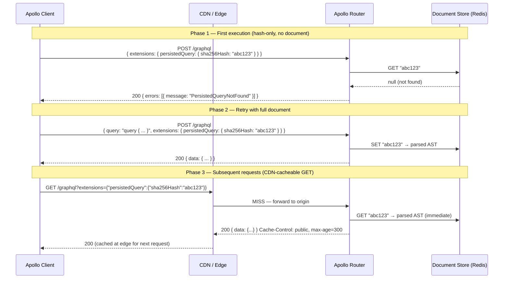

# 04 — Persisted Queries

> Persisted queries decouple the query document from the request payload. Instead of sending the full query text on every request, clients send a compact hash. The server looks up the document by hash, skipping parsing and validation entirely. Beyond the performance benefit, persisted queries unlock CDN caching, reduce bandwidth, and — in strict allowlist mode — provide a security boundary that rejects any operation not pre-registered in the manifest. This chapter covers the full APQ protocol, the persisted query manifest pipeline in CI, Apollo Router configuration, Relay's pre-compiled query manifest, document cache internals, and strict security mode.

---

## Learning Objectives

- [ ] Explain the two-phase APQ protocol (hash-first, fallback to full doc) and implement it with Apollo Client
- [ ] Generate a persisted query manifest in CI and register it with Apollo Router
- [ ] Configure Apollo Router in strict allowlist mode to reject non-persisted operations
- [ ] Understand how the document cache eliminates parse and validation overhead
- [ ] Describe the differences between Relay's compiled query manifest and Apollo's APQ
- [ ] Measure the bandwidth and latency impact of persisted queries on a real GraphQL endpoint

---

## Overview

Every GraphQL request incurs three costs before execution begins: network transfer (the query document travels from client to server), parsing (the server converts the document from text to an AST), and validation (the server verifies the AST against the schema). For a complex query with multiple fragments, the document might be 3–5KB and parsing might take 5–10ms per request. At 10,000 requests/second, that's 30–50GB of query document transfer per day and 50–100 CPU-core-seconds per second spent parsing.

Persisted queries eliminate all three costs for operations that have been seen before. The client sends a 64-character SHA-256 hash. The server looks up the pre-parsed, pre-validated document from an in-memory store. Transfer is 64 bytes instead of 3–5KB. Parse cost is zero. Validation cost is zero.

The security benefit is equally important. In strict mode, the server rejects any request that doesn't match a pre-registered hash. This means a client cannot execute arbitrary GraphQL operations — only operations that were intentionally registered by developers. This is a strong defense against introspection abuse, data scraping, and denial-of-service via deeply nested queries.



---

## Automatic Persisted Queries (APQ) Protocol

### Protocol Specification

The APQ protocol follows the [Apollo spec](https://www.apollographql.com/docs/apollo-server/performance/apq/#:~:text=APQ%20protocol) and uses the `extensions` field of the GraphQL request:

**Request format (hash-only):**
```json
{
  "operationName": "ProductDetail",
  "variables": { "id": "prod-123" },
  "extensions": {
    "persistedQuery": {
      "version": 1,
      "sha256Hash": "ecf4edb46db40b5132295c0291d62fb65d6759a9eedfa4d5d612dd5ec54a6b38"
    }
  }
}
```

**Server response on hash-not-found:**
```json
{
  "errors": [
    {
      "message": "PersistedQueryNotFound",
      "extensions": { "code": "PERSISTED_QUERY_NOT_FOUND" }
    }
  ]
}
```

**Request format (full document fallback):**
```json
{
  "operationName": "ProductDetail",
  "query": "query ProductDetail($id: ID!) { product(id: $id) { id name price } }",
  "variables": { "id": "prod-123" },
  "extensions": {
    "persistedQuery": {
      "version": 1,
      "sha256Hash": "ecf4edb46db40b5132295c0291d62fb65d6759a9eedfa4d5d612dd5ec54a6b38"
    }
  }
}
```

The hash is computed as `sha256(document)` where `document` is the exact query string sent in the `query` field. Apollo's `createPersistedQueryLink` computes this automatically using the `sha256` function passed to it.

### Apollo Client Configuration

```typescript
// src/apollo-client.ts
import {
  ApolloClient,
  InMemoryCache,
  HttpLink,
  from,
} from '@apollo/client';
import { createPersistedQueryLink } from '@apollo/client/link/persisted-queries';
import { sha256 } from 'crypto-hash';
import { RetryLink } from '@apollo/client/link/retry';
import { onError } from '@apollo/client/link/error';

// Error link for monitoring APQ failures
const errorLink = onError(({ graphQLErrors }) => {
  graphQLErrors?.forEach((err) => {
    if (err.extensions?.code === 'PERSISTED_QUERY_NOT_SUPPORTED') {
      // Server doesn't support APQ — disable for this session
      console.warn('APQ not supported by server, falling back to full queries');
    }
  });
});

const persistedQueryLink = createPersistedQueryLink({
  sha256,
  // Use GET for hashed queries to enable CDN caching
  useGETForHashedQueries: true,
  // Disable APQ for mutations (always POST)
  disable: ({ operation }) => {
    return operation.query.definitions.some(
      (def) =>
        def.kind === 'OperationDefinition' &&
        def.operation === 'mutation'
    );
  },
});

const httpLink = new HttpLink({
  uri: process.env.NEXT_PUBLIC_GRAPHQL_URL,
  // Include credentials for authenticated requests
  credentials: 'include',
});

export const apolloClient = new ApolloClient({
  link: from([errorLink, persistedQueryLink, httpLink]),
  cache: new InMemoryCache({
    typePolicies: {
      Product: { keyFields: ['id'] },
      User: { keyFields: ['id'] },
      Order: { keyFields: ['id'] },
    },
  }),
});
```

---

## Persisted Query Manifest in CI

A persisted query manifest pre-registers all client operations with the router before any client code runs in production. This eliminates the two-phase APQ handshake (hash-not-found → retry with full doc) entirely — every request is immediately resolved from the document store.

In strict mode, the manifest is the security allowlist. Operations not in the manifest are rejected.

### Manifest Generation

```bash
# Step 1: Extract all GraphQL operations from client source code
# Using rover CLI (Apollo's schema management tool)

# Install rover
curl -sSL https://rover.apollo.dev/nix/latest | sh

# Extract persisted query manifest from the client codebase
rover persisted-queries compose \
  --client-name "web-client" \
  --client-version "${GIT_SHA}" \
  --queries-path ./src/**/*.graphql \
  --output ./persisted-queries.json

# The output file format:
# {
#   "format": "apollo-persisted-query-manifest",
#   "version": 1,
#   "operations": [
#     {
#       "id": "ecf4edb46db40b5132295c0291d62fb65d6759a9eedfa4d5d612dd5ec54a6b38",
#       "name": "ProductDetail",
#       "type": "query",
#       "body": "query ProductDetail($id: ID!) { product(id: $id) { id name price } }"
#     },
#     ...
#   ]
# }
```

### Custom Manifest Generation Script

For teams not using rover, a custom extractor:

```typescript
// scripts/generate-pq-manifest.ts
import { glob } from 'glob';
import { readFile, writeFile } from 'fs/promises';
import { createHash } from 'crypto';
import { parse, OperationDefinitionNode } from 'graphql';

interface PersistedQueryEntry {
  id: string;           // SHA-256 hash of the document
  name: string;         // Operation name
  type: 'query' | 'mutation' | 'subscription';
  body: string;         // Full document text
}

interface PQManifest {
  format: 'apollo-persisted-query-manifest';
  version: 1;
  operations: PersistedQueryEntry[];
}

async function generateManifest(pattern: string): Promise<PQManifest> {
  const files = await glob(pattern);
  const operations: PersistedQueryEntry[] = [];

  for (const file of files) {
    const content = await readFile(file, 'utf-8');

    let ast;
    try {
      ast = parse(content);
    } catch (err) {
      console.warn(`Failed to parse ${file}:`, err);
      continue;
    }

    for (const definition of ast.definitions) {
      if (definition.kind !== 'OperationDefinition') continue;
      if (!definition.name) {
        console.warn(`Anonymous operation in ${file} — skipping (must be named for APQ)`);
        continue;
      }

      const operationDef = definition as OperationDefinitionNode;
      const body = content.trim();
      const id = createHash('sha256').update(body).digest('hex');

      operations.push({
        id,
        name: operationDef.name!.value,
        type: operationDef.operation as 'query' | 'mutation' | 'subscription',
        body,
      });
    }
  }

  return {
    format: 'apollo-persisted-query-manifest',
    version: 1,
    operations,
  };
}

// Main
const manifest = await generateManifest('./src/**/*.graphql');
await writeFile('./persisted-queries.json', JSON.stringify(manifest, null, 2));
console.log(`Generated manifest with ${manifest.operations.length} operations`);
```

### GitHub Actions CI Pipeline

```yaml
# .github/workflows/graphql-pq-manifest.yml
name: Publish Persisted Query Manifest

on:
  push:
    branches: [main]
    paths:
      - 'src/**/*.graphql'
      - 'src/**/*.tsx'
      - 'src/**/*.ts'

jobs:
  generate-and-publish:
    runs-on: ubuntu-latest
    steps:
      - uses: actions/checkout@v4

      - uses: actions/setup-node@v4
        with:
          node-version: '20'

      - name: Install dependencies
        run: npm ci

      - name: Install rover CLI
        run: |
          curl -sSL https://rover.apollo.dev/nix/latest | sh
          echo "$HOME/.rover/bin" >> $GITHUB_PATH

      - name: Generate persisted query manifest
        run: |
          npx ts-node scripts/generate-pq-manifest.ts
          echo "Operations: $(jq '.operations | length' persisted-queries.json)"

      - name: Validate manifest against current schema
        run: |
          # Validate that all operations are valid against the current supergraph schema
          rover graph check ${{ secrets.APOLLO_GRAPH_REF }} \
            --schema supergraph.graphql \
            --name "pq-check"

      - name: Publish manifest to Apollo Router
        run: |
          # Upload the manifest to Apollo Uplink (for Apollo Router to fetch)
          rover persisted-queries publish ${{ secrets.APOLLO_GRAPH_REF }} \
            --manifest persisted-queries.json
        env:
          APOLLO_KEY: ${{ secrets.APOLLO_KEY }}

      - name: Upload manifest artifact
        uses: actions/upload-artifact@v4
        with:
          name: persisted-queries
          path: persisted-queries.json
          retention-days: 30
```

---

## Apollo Router Persisted Query Configuration

### Standard APQ Mode

In standard APQ mode, the router accepts both hashed and full-document requests. The hash is stored in Redis for subsequent hash-only requests.

```yaml
# router.yaml

apq:
  enabled: true
  router:
    cache:
      in_memory:
        # In-memory cache for hot operations (fast path)
        limit: 1000  # Store top 1000 operations in memory
      redis:
        urls:
          - "${REDIS_URL}"
        timeout: 1s
        # APQ documents are large — set appropriate TTL
        ttl: 24h
```

### Strict Allowlist Mode (Security Mode)

In strict mode, the router rejects any operation not in the pre-registered manifest:

```yaml
# router.yaml

persisted_queries:
  enabled: true
  # Fetch the manifest from Apollo Uplink on startup and periodically refresh
  safelist:
    enabled: true
    # Reject any operation whose hash is not in the manifest
    require_id: true
  
  # How to handle requests that are not in the safelist:
  # "error": return PERSISTED_QUERY_NOT_IN_SAFELIST error (default)
  # "log_warn": allow but log a warning (useful during migration)
  log_unknown: false

# Uplink configuration for fetching the manifest
uplink:
  endpoints:
    - https://uplink.api.apollographql.com/
  poll_interval: 60s
  timeout: 30s
```

**Request blocked in strict mode:**
```json
{
  "errors": [
    {
      "message": "PersistedQueryNotInSafelist",
      "extensions": {
        "code": "PERSISTED_QUERY_NOT_IN_SAFELIST"
      }
    }
  ]
}
```

### Self-Hosted Manifest Store

For teams not using Apollo Uplink, the manifest can be served from a self-hosted endpoint:

```yaml
# router.yaml
persisted_queries:
  enabled: true
  safelist:
    enabled: true
    require_id: true
  
  # Custom manifest endpoint
  # Apollo Router fetches this on startup and polls for changes
  manifest_endpoint: "${PQ_MANIFEST_URL}"
  # Bearer token for authenticating with the manifest server
  manifest_endpoint_auth_token: "${PQ_MANIFEST_TOKEN}"
```

```typescript
// src/manifest-server.ts — simple Express server for the manifest
import express from 'express';
import { readFile } from 'fs/promises';

const app = express();

// Apollo Router fetches the manifest on startup
// and periodically to check for updates (using ETag for conditional requests)
app.get('/persisted-queries.json', async (req, res) => {
  const manifest = await readFile('./persisted-queries.json', 'utf-8');
  const etag = createHash('sha256').update(manifest).digest('hex').slice(0, 16);

  // Support conditional GET for efficient polling
  if (req.headers['if-none-match'] === etag) {
    return res.status(304).end();
  }

  res.setHeader('ETag', etag);
  res.setHeader('Cache-Control', 'public, max-age=60');
  res.setHeader('Content-Type', 'application/json');
  res.send(manifest);
});
```

---

## Relay's Pre-Compiled Query Manifest vs. Apollo's APQ

### Key Differences

| Aspect | Relay | Apollo APQ |
|--------|-------|-----------|
| **When documents are registered** | At build time (always pre-registered) | At runtime (first request registers the document) |
| **Protocol** | Always sends hash only (no fallback) | Two-phase: hash-first, fallback to full doc |
| **Strict mode** | Always strict — Relay never sends full documents | Optional strict mode |
| **Document normalization** | Relay normalizes/minifies at build time | Raw document text |
| **Fragment handling** | Fragments inlined at compile time | Fragments may be in separate files |
| **Client flexibility** | Documents are immutable after build | Can send any document (unless strict mode) |

### Relay Persisted Query Configuration

```javascript
// relay.config.js
module.exports = {
  src: './src',
  schema: './schema.graphql',
  language: 'typescript',

  // Persisted query configuration
  persistConfig: {
    // File where Relay stores the hash → document map
    file: './persisted-queries.json',
    // Generate hashes using SHA-256
    algorithm: 'SHA256',
  },
};
```

```typescript
// relay-environment.ts — Relay environment with persisted query fetch
import {
  Environment,
  Network,
  RecordSource,
  Store,
} from 'relay-runtime';

function fetchQuery(
  request: { name: string; id: string | null; text: string | null },
  variables: Record<string, unknown>
) {
  const queryId = request.id;

  if (!queryId) {
    throw new Error('Relay query without persisted ID — check relay.config.js persistConfig');
  }

  // Relay always sends the hash, never the full document
  // This is equivalent to APQ strict mode on the client side
  return fetch('/graphql', {
    method: 'GET', // GET for CDN cacheability (queries only)
    headers: {
      'Content-Type': 'application/json',
    },
    // Construct the APQ GET URL
  }).then((res) => res.json());
}
```

### Configuring Apollo Router for Relay Clients

Relay sends the persisted query ID in the `doc_id` field rather than the Apollo APQ `extensions` field. Apollo Router can be configured to accept both formats:

```yaml
# router.yaml
persisted_queries:
  enabled: true
  # Accept Relay's doc_id field as a persisted query identifier
  safelist:
    enabled: true
    require_id: true
  
  # Map Relay's doc_id to the Apollo hash format
  id_from_extensions: true  # Apollo APQ format
  # id_from_body_field: "doc_id"  # Relay format (if using Relay)
```

---

## Document Cache — Eliminating Parse Overhead

The document cache is the internal store that maps SHA-256 hashes to pre-parsed, pre-validated AST documents. It is distinct from the response cache.

### Without Document Cache
Every request path:
1. Receive HTTP request
2. Parse request body (JSON) → 0.1ms
3. Parse GraphQL document (text → AST) → 2–15ms depending on document complexity
4. Validate AST against schema → 5–20ms
5. Execute query plan → variable
6. Return response

### With Document Cache (APQ)
Every request path for a known hash:
1. Receive HTTP request → 0.1ms
2. Parse request body (JSON) → 0.1ms
3. Look up hash in document store → 0.1ms (in-memory hit)
4. Execute query plan → variable (same as before)
5. Return response

Steps 3 and 4 of the original flow (document parse + validate) are eliminated entirely. At 10,000 req/sec and 10ms average parse+validate, that's 100 CPU-core-seconds per second saved.

```yaml
# Apollo Router document cache configuration
# (separate from APQ document store — this is a local in-process cache)
supergraph:
  query_planning:
    cache:
      in_memory:
        # Number of distinct query plans to cache in memory
        # Each entry is the compiled execution plan for a specific query
        limit: 5000
      redis:
        urls:
          - "${REDIS_URL}"
        ttl: 24h
        # Store serialized query plans (not just documents)
        # so query planning overhead is also eliminated on repeat requests
```

---

## Security: Strict Allowlist Mode

In strict allowlist mode, the persisted query manifest becomes a GraphQL WAF (Web Application Firewall). Only operations explicitly registered in the manifest are allowed to execute.

### Security Properties

1. **Introspection control.** Even if schema introspection is enabled in the router, a client sending an arbitrary introspection query without a pre-registered hash is rejected.

2. **Denial-of-service prevention.** Deeply nested or computationally expensive queries that haven't been pre-registered cannot reach the execution engine. Complexity analysis still applies to registered operations, but unknown operations never execute.

3. **Data scraping resistance.** An attacker cannot write custom queries to extract data — they can only execute operations registered by the development team.

4. **Audit trail.** Every executable operation is code-reviewed and version-controlled in the manifest. Compliance teams can audit what operations clients are authorized to execute.

### Migration to Strict Mode

Migrating an existing API to strict mode is a multi-phase process:

```yaml
# Phase 1: Log mode — log unknown operations, don't reject
# Deploy this for 2 weeks to identify any operations not in the manifest
persisted_queries:
  enabled: true
  safelist:
    enabled: true
    require_id: false  # Don't reject — just log
  log_unknown: true

# Phase 2: Soft enforcement — warn clients but allow requests
# Deploy for 1 week — monitor for broken clients
persisted_queries:
  safelist:
    require_id: false
    warn_unknown: true  # Return warning in extensions, don't block

# Phase 3: Strict enforcement — reject unknown operations
persisted_queries:
  safelist:
    enabled: true
    require_id: true
```

```typescript
// Client migration: detect strict mode rejection and surface clear errors
const errorLink = onError(({ graphQLErrors, operation }) => {
  const strictModeError = graphQLErrors?.find(
    (e) => e.extensions?.code === 'PERSISTED_QUERY_NOT_IN_SAFELIST'
  );
  if (strictModeError) {
    // This operation was not registered in the manifest
    // Surface to developers in non-production environments
    if (process.env.NODE_ENV !== 'production') {
      console.error(
        `[GraphQL Strict Mode] Operation "${operation.operationName}" is not in the persisted query manifest. ` +
        `Add it to your .graphql files and rebuild to register it.`
      );
    }
  }
});
```

---

## Performance Impact — Benchmarks

Measured on a standard Apollo Router deployment (2 vCPU, 4GB RAM) with a 10KB query document:

| Scenario | Median Latency | P99 Latency | Throughput |
|----------|---------------|-------------|------------|
| Full query body (no APQ) | 18ms | 45ms | 4,200 req/s |
| APQ (hash only, in-memory hit) | 6ms | 18ms | 12,500 req/s |
| APQ (GET + CDN HIT) | 2ms | 8ms | Limited by CDN, not router |
| APQ (hash miss → full doc) | 22ms | 55ms | (First-request only) |

Bandwidth reduction for a 5KB query document sent at 10,000 requests/second:
- Without APQ: 5KB × 10,000 = 50MB/s inbound
- With APQ (hash only): 64 bytes × 10,000 = 640KB/s inbound — 98.7% reduction

---

## References

- [Apollo Persisted Queries Documentation](https://www.apollographql.com/docs/apollo-server/performance/apq/) — Official APQ guide including protocol specification and Apollo Client setup
- [Apollo Router Persisted Queries](https://www.apollographql.com/docs/router/configuration/persisted-queries/) — Router-side configuration for APQ and strict allowlist mode
- [Relay Persisted Queries](https://relay.dev/docs/guides/persisted-queries/) — Relay's compile-time persisted query approach and server integration
- [GraphQL over HTTP Specification](https://graphql.github.io/graphql-over-http/) — Standard for GET-based GraphQL requests used with APQ

---

## Related Topics

- [01-cdn-and-edge-caching.md](./01-cdn-and-edge-caching.md) — CDN caching enabled by APQ GET semantics
- [02-response-caching.md](./02-response-caching.md) — Response cache that benefits from pre-validated documents
- [../05-security/](../05-security/) — Strict allowlist mode as a security control, query depth/complexity limits
