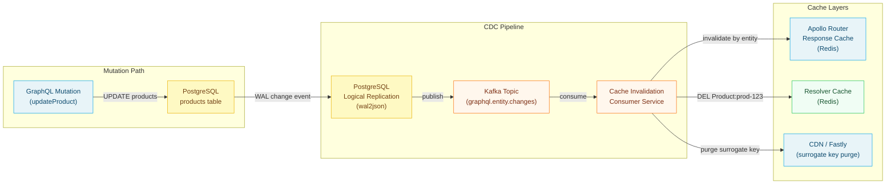

# 05 — Cache Invalidation

> Cache invalidation is the hardest problem in distributed caching. For GraphQL, it is harder than for REST: a single cached response can depend on data from multiple subgraphs and multiple database tables. Changing one row can make dozens of cached responses stale. This chapter covers the fundamental dependency problem, entity-based invalidation using surrogate keys, event-driven invalidation pipelines driven by database CDC (Change Data Capture), optimistic UI patterns for stale data, cache poisoning prevention, and integration testing strategies for invalidation correctness.

---

## Learning Objectives

- [ ] Map response cache dependencies to database entities using the entity-response dependency graph
- [ ] Implement surrogate key tagging so cache entries can be invalidated by entity ID
- [ ] Build a CDC-driven invalidation pipeline using PostgreSQL logical replication → Kafka → cache invalidation service
- [ ] Prevent cache stampede after a bulk invalidation event using rate-limited warm-up
- [ ] Identify and prevent cache poisoning through input validation and scope enforcement
- [ ] Write integration tests that verify stale cache entries are invalidated after mutations

---

## Overview

Time-To-Live (TTL) is the simplest cache invalidation strategy: set an expiry time and let entries expire naturally. It requires no infrastructure, no event plumbing, and no coordination. The tradeoff is that clients see stale data until the TTL expires.

For many workloads, TTL-based invalidation is the right answer. Product names, category hierarchies, and navigation trees change infrequently. A 5-minute TTL means at most 5 minutes of staleness — acceptable for most business use cases and simple to reason about.

Event-driven invalidation is required when:
- **Mutations demand immediate consistency.** A user updates their profile and expects to see the new value immediately, not 5 minutes later.
- **Financial or inventory data changes.** A price change or a stock depletion should be visible within seconds, not minutes.
- **Regulatory requirements.** GDPR right-to-erasure requires that deleted personal data is not served from cache after deletion.

The complexity of event-driven invalidation scales with the number of cache layers and the cardinality of the cache-entity dependency graph. A simple deployment (one response cache, simple entity types) can use direct mutation-triggered invalidation. A complex deployment (CDN + response cache + resolver cache, entities referenced by hundreds of operations) requires a CDC-driven pipeline with entity-aware invalidation.



---

## The Entity-Response Dependency Problem

The fundamental challenge is that a GraphQL response is composite — it contains data from multiple entities across multiple subgraphs. The cache system needs to know: "when entity X changes, which cached responses need to be invalidated?"

For REST, this is straightforward: a response from `GET /products/123` depends on product 123. When product 123 changes, invalidate that cache entry.

For GraphQL, consider this operation:

```graphql
query ProductDetailPage($id: ID!) {
  product(id: $id) {
    id
    name
    price
    category {
      id
      name
    }
    reviews(first: 5) {
      id
      rating
      author {
        id
        name
      }
    }
  }
}
```

This response depends on:
- The product entity (products subgraph)
- The product's category entity (products subgraph)
- Multiple review entities (reviews subgraph)
- Multiple user entities for review authors (users subgraph)

Changing a review's rating, a user's display name, or the category's name should invalidate this cached response. Without entity tagging, the only option is TTL-based expiry.

### Entity Tagging at the Resolver Level

```typescript
// src/subgraph/products/resolvers/query.ts

export const Query = {
  product: async (
    _: unknown,
    args: { id: string },
    context: GraphQLContext
  ) => {
    const product = await context.loaders.product.load(args.id);
    if (!product) return null;

    // Tag this response with the entities it depends on
    context.addEntityTag('Product', args.id);
    return product;
  },
};

export const Product = {
  category: async (
    parent: ProductParent,
    _: unknown,
    context: GraphQLContext
  ) => {
    const category = await context.loaders.category.load(parent.categoryId);
    if (!category) return null;

    // This response now also depends on the category entity
    context.addEntityTag('Category', category.id);
    return category;
  },

  reviews: async (
    parent: ProductParent,
    args: { first: number },
    context: GraphQLContext
  ) => {
    const reviews = await context.loaders.reviewsByProduct.load(parent.id);
    const sliced = reviews.slice(0, args.first);

    // Tag with each review entity
    for (const review of sliced) {
      context.addEntityTag('Review', review.id);
      context.addEntityTag('User', review.authorId);
    }

    return sliced;
  },
};
```

```typescript
// src/context.ts — entity tag collection

export interface GraphQLContext {
  loaders: DataLoaders;
  entityTags: Map<string, Set<string>>; // typename → Set<id>
  addEntityTag: (typename: string, id: string) => void;
  getSurrogatKeys: () => string[];
}

export function createContext(): GraphQLContext {
  const entityTags = new Map<string, Set<string>>();

  const addEntityTag = (typename: string, id: string) => {
    if (!entityTags.has(typename)) {
      entityTags.set(typename, new Set());
    }
    entityTags.get(typename)!.add(id);
  };

  const getSurrogateKeys = (): string[] => {
    const keys: string[] = [];
    for (const [typename, ids] of entityTags) {
      for (const id of ids) {
        keys.push(`${typename}:${id}`);
      }
    }
    return keys;
  };

  return {
    loaders: createDataLoaders(),
    entityTags,
    addEntityTag,
    getSurrogateKeys,
  };
}
```

---

## Direct Mutation-Triggered Invalidation

The simplest event-driven invalidation: the mutation resolver explicitly invalidates cache entries after writing to the database.

```typescript
// src/subgraph/products/resolvers/mutation.ts

export const Mutation = {
  updateProduct: async (
    _: unknown,
    args: { id: string; input: UpdateProductInput },
    context: GraphQLContext
  ): Promise<Product> => {
    // 1. Write to database (source of truth first)
    const product = await context.db.products.update(args.id, args.input);

    // 2. Invalidate all cache layers in parallel
    // Using allSettled — cache invalidation failure should not fail the mutation
    const invalidationResults = await Promise.allSettled([
      // Resolver cache (Redis entity cache)
      context.resolverCache.del(`Product:${args.id}`),

      // Response cache (Apollo Router entity invalidation API)
      context.routerCache.invalidateEntity('Product', args.id),

      // CDN surrogate key purge (Fastly / Cloudflare)
      context.cdnInvalidation.purgeByKeys([
        `Product:${args.id}`,
        `Category:${product.categoryId}`,
      ]),
    ]);

    // Log failures without blocking
    for (const result of invalidationResults) {
      if (result.status === 'rejected') {
        context.logger.error(
          { error: result.reason, productId: args.id },
          'Cache invalidation failed — stale data may persist until TTL expiry'
        );
      }
    }

    return product;
  },

  deleteProduct: async (
    _: unknown,
    args: { id: string },
    context: GraphQLContext
  ): Promise<boolean> => {
    await context.db.products.delete(args.id);

    // Invalidation is critical for delete — stale cached data
    // would show a deleted product as still available
    await Promise.allSettled([
      context.resolverCache.del(`Product:${args.id}`),
      context.routerCache.invalidateEntity('Product', args.id),
      context.cdnInvalidation.purgeByKeys([`Product:${args.id}`]),

      // Also invalidate product list caches — the deleted product
      // must not appear in paginated results
      context.resolverCache.deleteByPattern(`Product:list:*`),
    ]);

    return true;
  },
};
```

---

## CDC-Driven Invalidation Pipeline

Direct mutation-triggered invalidation works when GraphQL is the only write path. In enterprise deployments, databases are often written to by multiple services, batch jobs, admin tools, and data pipelines. The GraphQL mutation layer cannot know about these writes.

CDC (Change Data Capture) captures every write to the database at the WAL (Write-Ahead Log) level and publishes change events to a message bus. A cache invalidation consumer subscribes to these events and invalidates the appropriate cache entries.

### PostgreSQL Logical Replication Setup

```sql
-- Enable logical replication (requires PostgreSQL 10+)
-- postgresql.conf: wal_level = logical

-- Create a replication slot
SELECT pg_create_logical_replication_slot(
  'graphql_cache_invalidation',
  'wal2json'  -- JSON-formatted WAL output plugin
);

-- Create a publication for tables that have cached data
CREATE PUBLICATION graphql_cache_pub FOR TABLE
  products,
  categories,
  users,
  orders,
  reviews;
```

### Debezium Connector Configuration

[Debezium](https://debezium.io/) reads from the PostgreSQL replication slot and publishes change events to Kafka:

```json
{
  "name": "graphql-cache-invalidation-connector",
  "config": {
    "connector.class": "io.debezium.connector.postgresql.PostgresConnector",
    "database.hostname": "${PG_HOST}",
    "database.port": "5432",
    "database.user": "replication_user",
    "database.password": "${PG_REPLICATION_PASSWORD}",
    "database.dbname": "production",
    "database.server.name": "production",
    "slot.name": "graphql_cache_invalidation",
    "plugin.name": "wal2json",
    "table.include.list": "public.products,public.categories,public.users,public.orders,public.reviews",
    "transforms": "route",
    "transforms.route.type": "org.apache.kafka.connect.transforms.ReplaceField$Value",
    "topic.prefix": "graphql.entity.changes",
    "heartbeat.interval.ms": "10000",
    "snapshot.mode": "never"
  }
}
```

**Kafka topic message format (Debezium):**
```json
{
  "before": {
    "id": "prod-123",
    "name": "Widget",
    "price": 19.99,
    "updated_at": "2024-01-15T10:30:00Z"
  },
  "after": {
    "id": "prod-123",
    "name": "Premium Widget",
    "price": 24.99,
    "updated_at": "2024-01-15T10:35:00Z"
  },
  "source": {
    "table": "products",
    "db": "production",
    "schema": "public",
    "op": "u"  // u=update, c=create, d=delete
  },
  "op": "u",
  "ts_ms": 1705315000000
}
```

### Cache Invalidation Consumer

```typescript
// src/cache-invalidation/consumer.ts
import { Kafka, Consumer } from 'kafkajs';
import type { CacheInvalidationService } from './service';

// Table → GraphQL type name mapping
const TABLE_TO_TYPENAME: Record<string, string> = {
  products: 'Product',
  categories: 'Category',
  users: 'User',
  orders: 'Order',
  reviews: 'Review',
};

// When an entity changes, which related entities should also be invalidated?
// (Propagation rules for entity dependency graph)
const INVALIDATION_PROPAGATION: Record<string, string[]> = {
  // When a product changes, also invalidate its category's product list
  products: ['category_products'],
  // When a review changes, also invalidate the product's review aggregate
  reviews: ['product_reviews'],
  // User display name change affects reviews they authored
  users: ['user_reviews'],
};

export class CacheInvalidationConsumer {
  private consumer: Consumer;

  constructor(
    kafka: Kafka,
    private readonly invalidationService: CacheInvalidationService
  ) {
    this.consumer = kafka.consumer({
      groupId: 'graphql-cache-invalidation',
      sessionTimeout: 30000,
      heartbeatInterval: 3000,
    });
  }

  async start(): Promise<void> {
    await this.consumer.connect();
    await this.consumer.subscribe({
      topics: [/^graphql\.entity\.changes\..*/],
      fromBeginning: false,
    });

    await this.consumer.run({
      // Process messages one at a time per partition to maintain order
      eachMessage: async ({ topic, message }) => {
        if (!message.value) return;

        const event = JSON.parse(message.value.toString());
        await this.processChangeEvent(topic, event);
      },
    });

    console.log('Cache invalidation consumer started');
  }

  private async processChangeEvent(
    topic: string,
    event: DebeziumChangeEvent
  ): Promise<void> {
    // Determine table name from topic: graphql.entity.changes.public.products → products
    const tableName = topic.split('.').pop()!;
    const typename = TABLE_TO_TYPENAME[tableName];

    if (!typename) {
      console.warn(`No typename mapping for table: ${tableName}`);
      return;
    }

    // Get the entity ID from the change event
    const record = event.after ?? event.before; // after is null for deletes
    const entityId = record?.id;

    if (!entityId) {
      console.error('Change event missing entity ID:', event);
      return;
    }

    // Invalidate the entity across all cache layers
    await this.invalidationService.invalidateEntity(typename, entityId, {
      operation: event.op,
      oldRecord: event.before,
      newRecord: event.after,
    });
  }
}

interface DebeziumChangeEvent {
  before: Record<string, unknown> | null;
  after: Record<string, unknown> | null;
  source: {
    table: string;
    db: string;
    schema: string;
    op: 'c' | 'u' | 'd' | 'r'; // create, update, delete, read (snapshot)
  };
  op: 'c' | 'u' | 'd' | 'r';
  ts_ms: number;
}
```

```typescript
// src/cache-invalidation/service.ts
import type { ResolverCache } from '../cache/resolver-cache';
import type { RouterCacheInvalidation } from '../cache/router-invalidation';
import type { FastlySurrogateKeyInvalidation } from '../cache/fastly-invalidation';

export class CacheInvalidationService {
  constructor(
    private readonly resolverCache: ResolverCache,
    private readonly routerCache: RouterCacheInvalidation,
    private readonly cdnInvalidation: FastlySurrogateKeyInvalidation
  ) {}

  async invalidateEntity(
    typename: string,
    id: string,
    context: {
      operation: 'c' | 'u' | 'd' | 'r';
      oldRecord: Record<string, unknown> | null;
      newRecord: Record<string, unknown> | null;
    }
  ): Promise<void> {
    const surrogateKey = `${typename}:${id}`;

    // Invalidate all cache layers in parallel
    await Promise.allSettled([
      // Layer 1: Resolver cache (individual entity)
      this.resolverCache.del(surrogateKey),

      // Layer 2: Apollo Router response cache
      this.routerCache.invalidateEntity(typename, id),

      // Layer 3: CDN edge cache
      this.cdnInvalidation.purgeByKeys([surrogateKey]),
    ]);

    // For deletes, also invalidate list caches
    if (context.operation === 'd') {
      await this.invalidateListCaches(typename, id, context.oldRecord);
    }

    // For creates, invalidate list caches (new entity should appear)
    if (context.operation === 'c') {
      await this.invalidateListCaches(typename, id, context.newRecord);
    }
  }

  private async invalidateListCaches(
    typename: string,
    _id: string,
    record: Record<string, unknown> | null
  ): Promise<void> {
    // Invalidate list caches that might contain this entity
    await Promise.allSettled([
      this.resolverCache.deleteByPattern(`${typename}:list:*`),
      this.routerCache.invalidateOperation(`${typename}List`),
    ]);

    // Type-specific list cache invalidation
    if (typename === 'Product' && record?.category_id) {
      await Promise.allSettled([
        this.resolverCache.del(`Category:${record.category_id}:products`),
        this.cdnInvalidation.purgeByKeys([
          `Category:${record.category_id}:products`,
        ]),
      ]);
    }
  }
}
```

---

## Bulk Invalidation and Cache Stampede Prevention

A price update affecting 10,000 products, or a deployment that flushes the entire cache, causes a bulk invalidation event. If all 10,000 product cache entries expire simultaneously, the next wave of requests causes 10,000 concurrent database fetches.

### Rate-Limited Invalidation with Warm-Up

```typescript
// src/cache-invalidation/bulk-invalidation.ts

interface BulkInvalidationOptions {
  // Maximum entities to invalidate per second
  maxPerSecond: number;
  // Whether to trigger a warm-up after invalidation
  warmUp: boolean;
  // Top-N entities to pre-warm by traffic rank
  warmUpTopN?: number;
}

export class BulkInvalidationController {
  constructor(
    private readonly invalidationService: CacheInvalidationService,
    private readonly trafficRanker: EntityTrafficRanker
  ) {}

  async invalidateBulk(
    entities: Array<{ typename: string; id: string }>,
    options: BulkInvalidationOptions
  ): Promise<void> {
    const { maxPerSecond, warmUp, warmUpTopN = 100 } = options;
    const delayBetweenBatches = 1000 / maxPerSecond;

    // Sort by traffic rank — invalidate most-requested entities last
    // so they are available in cache the longest during the sweep
    const sortedByRank = await this.trafficRanker.sortByFrequency(entities);

    // Rate-limited invalidation sweep
    for (const entity of sortedByRank) {
      await this.invalidationService.invalidateEntity(entity.typename, entity.id, {
        operation: 'u',
        oldRecord: null,
        newRecord: null,
      });
      await sleep(delayBetweenBatches);
    }

    // Post-invalidation warm-up: pre-populate cache for top-N entities
    if (warmUp) {
      const topEntities = sortedByRank.slice(-warmUpTopN); // Top N by traffic
      await this.warmUpEntities(topEntities);
    }
  }

  private async warmUpEntities(
    entities: Array<{ typename: string; id: string }>
  ): Promise<void> {
    // Execute the most common operations that reference these entities
    // to pre-populate the cache before organic traffic arrives
    for (const entity of entities) {
      // Type-specific warm-up queries
      if (entity.typename === 'Product') {
        await this.executeWarmUpQuery('ProductDetail', { id: entity.id });
      }
    }
  }

  private async executeWarmUpQuery(
    operationName: string,
    variables: Record<string, unknown>
  ): Promise<void> {
    // Internal HTTP call to the router — warm-up request
    // Uses a special header to identify warm-up traffic in analytics
    await fetch(process.env.ROUTER_INTERNAL_URL!, {
      method: 'POST',
      headers: {
        'Content-Type': 'application/json',
        'X-Warm-Up': 'true',
      },
      body: JSON.stringify({ operationName, variables }),
    });
  }
}

function sleep(ms: number): Promise<void> {
  return new Promise((resolve) => setTimeout(resolve, ms));
}
```

---

## Cache Poisoning Prevention

Cache poisoning occurs when an attacker or a bug causes an incorrect response to be stored in the cache and subsequently served to other users.

### Injection Attack Prevention

```typescript
// Never use user-controlled input directly in cache keys
// WRONG:
const cacheKey = `Product:${req.headers['x-product-id']}`;

// RIGHT: validate and sanitize input before using in cache key
const productId = validateUUID(req.headers['x-product-id']);
if (!productId) throw new Error('Invalid product ID');
const cacheKey = `Product:${productId}`;

function validateUUID(input: unknown): string | null {
  if (typeof input !== 'string') return null;
  const uuidRegex = /^[0-9a-f]{8}-[0-9a-f]{4}-[0-9a-f]{4}-[0-9a-f]{4}-[0-9a-f]{12}$/i;
  return uuidRegex.test(input) ? input : null;
}
```

### Scope Enforcement

```typescript
// Ensure PRIVATE-scoped responses are never stored in the public cache
// WRONG: caching a user-specific response in the shared cache
const cachePlugin = responseCachePlugin({
  sessionId: () => null, // All requests share the same cache key
});

// RIGHT: derive session ID from authentication context
const cachePlugin = responseCachePlugin({
  sessionId: (requestContext) => {
    const userId = requestContext.request.http?.headers.get('x-user-id');
    if (!userId) return null; // Unauthenticated — public cache
    
    // Validate the user ID before using it as a cache key partition
    const validatedId = validateUserId(userId);
    if (!validatedId) {
      // Invalid user ID — do not cache (fail safe)
      return '__invalid__'; // Non-null means PRIVATE but unique
    }
    return validatedId;
  },
});
```

### Response Validation Before Caching

```typescript
// Validate responses before writing to cache
// Prevents caching of error responses or partial data
const cachePlugin = responseCachePlugin({
  shouldWriteToCache: async (requestContext) => {
    if (requestContext.response.body.kind !== 'single') return false;
    const { data, errors } = requestContext.response.body.singleResult;

    // Never cache responses with errors
    if (errors && errors.length > 0) return false;

    // Never cache null/empty responses
    if (!data || Object.keys(data).length === 0) return false;

    // Never cache responses that contain security-sensitive error codes
    const responseStr = JSON.stringify(data);
    if (responseStr.includes('UNAUTHENTICATED') || responseStr.includes('FORBIDDEN')) {
      return false;
    }

    return true;
  },
});
```

---

## Integration Testing for Cache Invalidation

Cache invalidation bugs are silent — stale data is returned without any error signal. Integration tests are the primary defense.

```typescript
// tests/integration/cache-invalidation.test.ts
import { describe, it, expect, beforeAll, afterAll } from 'vitest';
import { ApolloClient, InMemoryCache, gql, HttpLink } from '@apollo/client';
import { createServer } from '../test-helpers/server';
import { TestDatabase } from '../test-helpers/database';
import { Redis } from 'ioredis';

describe('Cache Invalidation Integration Tests', () => {
  let client: ApolloClient<unknown>;
  let db: TestDatabase;
  let redis: Redis;

  beforeAll(async () => {
    db = await TestDatabase.create();
    redis = new Redis(process.env.TEST_REDIS_URL!);

    const server = await createServer({ db, redis });

    client = new ApolloClient({
      cache: new InMemoryCache(),
      link: new HttpLink({ uri: `http://localhost:${server.port}/graphql` }),
      defaultOptions: {
        watchQuery: { fetchPolicy: 'no-cache' }, // Don't use Apollo Client cache
        query: { fetchPolicy: 'no-cache' },
      },
    });
  });

  afterAll(async () => {
    await db.destroy();
    await redis.quit();
  });

  it('should serve fresh product data after update mutation', async () => {
    // 1. Create test product
    const { id: productId } = await db.products.create({
      name: 'Original Name',
      price: 19.99,
    });

    // 2. First query — populates the response cache
    const GET_PRODUCT = gql`
      query GetProduct($id: ID!) {
        product(id: $id) {
          id
          name
          price
        }
      }
    `;

    const firstResponse = await client.query({
      query: GET_PRODUCT,
      variables: { id: productId },
    });

    expect(firstResponse.data.product.name).toBe('Original Name');

    // 3. Mutation — updates product and should invalidate cache
    const UPDATE_PRODUCT = gql`
      mutation UpdateProduct($id: ID!, $name: String!) {
        updateProduct(id: $id, input: { name: $name }) {
          id
          name
        }
      }
    `;

    await client.mutate({
      mutation: UPDATE_PRODUCT,
      variables: { id: productId, name: 'Updated Name' },
    });

    // 4. Second query — must return fresh data, not cached stale data
    const secondResponse = await client.query({
      query: GET_PRODUCT,
      variables: { id: productId },
    });

    // This is the assertion that catches cache invalidation bugs
    expect(secondResponse.data.product.name).toBe('Updated Name');
    expect(secondResponse.data.product.name).not.toBe('Original Name');
  });

  it('should not return deleted entity from cache', async () => {
    const { id: productId } = await db.products.create({ name: 'To Delete' });

    const GET_PRODUCT = gql`
      query GetProduct($id: ID!) {
        product(id: $id) { id name }
      }
    `;

    // Cache the product
    await client.query({ query: GET_PRODUCT, variables: { id: productId } });

    // Delete the product
    const DELETE_PRODUCT = gql`
      mutation DeleteProduct($id: ID!) {
        deleteProduct(id: $id)
      }
    `;
    await client.mutate({ mutation: DELETE_PRODUCT, variables: { id: productId } });

    // Query should return null after deletion
    const afterDelete = await client.query({
      query: GET_PRODUCT,
      variables: { id: productId },
    });

    expect(afterDelete.data.product).toBeNull();
  });

  it('should propagate user data changes to private cache', async () => {
    // Test that PRIVATE cache entries are correctly invalidated
    const userId = 'test-user-123';
    const headers = { 'x-user-id': userId };

    // ... similar pattern: cache user data, mutate, verify fresh data returned
  });
});
```

---

## Operational Runbook

### Diagnosing Stale Cache

```bash
# 1. Check cache hit/miss ratio for a specific operation
# (Apollo Router Prometheus metrics)
curl http://apollo-router:9090/metrics | grep graphql_cache

# 2. Check specific Redis key
redis-cli -n 1 get "apollo-response-cache:Product:prod-123"
redis-cli -n 1 ttl "apollo-response-cache:Product:prod-123"

# 3. Manually invalidate a specific entity (emergency)
curl -X POST http://apollo-router-admin:8088/cache/invalidate \
  -H "Authorization: Bearer ${ADMIN_TOKEN}" \
  -d '{"entities": [{"__typename": "Product", "id": "prod-123"}]}'

# 4. Check CDC pipeline health
kafka-consumer-groups.sh --bootstrap-server kafka:9092 \
  --describe --group graphql-cache-invalidation
# Look for: consumer lag > 0 means invalidation is behind

# 5. Nuclear option: flush entire response cache (use in emergencies only)
redis-cli -n 1 FLUSHDB
# This causes a cold start — monitor database load spike after this command
```

### Invalidation Lag Monitoring

```yaml
# Prometheus alert: CDC pipeline lag
- alert: GraphQLCacheInvalidationLag
  expr: kafka_consumer_group_lag{group="graphql-cache-invalidation"} > 1000
  for: 5m
  labels:
    severity: warning
  annotations:
    summary: "Cache invalidation consumer is lagging behind"
    description: "Consumer lag {{ $value }} messages — cache may be serving stale data"

- alert: GraphQLCacheStaleDataRisk
  expr: kafka_consumer_group_lag{group="graphql-cache-invalidation"} > 10000
  for: 2m
  labels:
    severity: critical
  annotations:
    summary: "Cache invalidation consumer critically lagged"
    description: "Lag {{ $value }} — significant stale data risk. Consider flushing cache."
```

---

## References

- [Debezium PostgreSQL Connector](https://debezium.io/documentation/reference/stable/connectors/postgresql.html) — CDC connector documentation for PostgreSQL logical replication to Kafka
- [Apollo Router Cache Invalidation API](https://www.apollographql.com/docs/router/configuration/cache/) — Router admin API for programmatic cache invalidation
- [Cache Poisoning OWASP](https://owasp.org/www-community/attacks/Cache_Poisoning) — Web cache poisoning attack patterns and mitigations
- [Surrogate Keys RFC](https://www.fastly.com/documentation/guides/vcl/using-surrogate-keys/) — Fastly surrogate key documentation for targeted cache purging

---

## Related Topics

- [01-cdn-and-edge-caching.md](./01-cdn-and-edge-caching.md) — CDN surrogate key and cache tag purge APIs
- [02-response-caching.md](./02-response-caching.md) — Apollo Router entity invalidation API
- [03-resolver-caching.md](./03-resolver-caching.md) — Resolver-level cache key patterns and write-through invalidation
- [../14-observability/](../14-observability/) — Cache metrics dashboards, lag monitoring, and invalidation storm alerts
