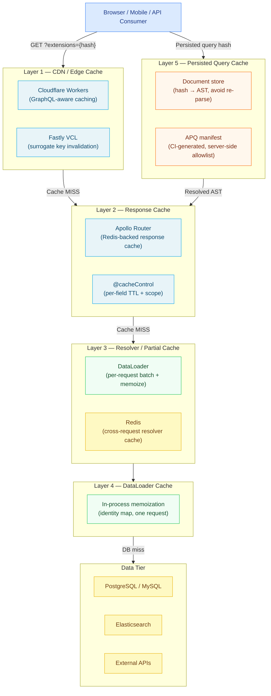

# 17 — Caching Strategies

> GraphQL breaks the assumptions that REST caching is built on. There are no canonical URLs to use as cache keys, POST requests are not cached by default, and a single query document can produce radically different response payloads depending on its variables. This section covers the full caching stack for production GraphQL systems: from CDN edge caching through response cache, partial resolver cache, DataLoader per-request memoization, and persisted query manifests. Each chapter is a deep reference for engineers who need to understand not just what to configure, but why each layer exists and when to use it.

---

## Contents

| # | File | Topic |
|---|------|-------|
| 01 | [01-cdn-and-edge-caching.md](./01-cdn-and-edge-caching.md) | CDN caching, persisted query GET pattern, Cloudflare Workers, Fastly VCL, cache-control headers, surrogate keys |
| 02 | [02-response-caching.md](./02-response-caching.md) | Apollo Router response cache, `@cacheControl` directive, Redis backend, TTL hierarchy, cache invalidation on mutation |
| 03 | [03-resolver-caching.md](./03-resolver-caching.md) | DataLoader batching and memoization, cross-request resolver cache, stale-while-revalidate, cache stampede prevention |
| 04 | [04-persisted-queries.md](./04-persisted-queries.md) | APQ flow, security allowlist mode, manifest generation in CI, Relay vs Apollo, document cache, bandwidth reduction |
| 05 | [05-cache-invalidation.md](./05-cache-invalidation.md) | Entity-based invalidation, surrogate keys, CDC-driven invalidation, cache poisoning prevention, invalidation testing |

---

## The GraphQL Caching Challenge

REST APIs benefit from a decades-old HTTP caching infrastructure. A GET request to `/products/42` has a stable, deterministic cache key. CDNs cache it transparently. Browsers cache it with `Cache-Control`. Varnish and Nginx sit in front and absorb repeat traffic without it ever touching the application layer.

GraphQL shatters these assumptions in three specific ways:

**1. POST requests are not cacheable by default.**
Almost every GraphQL client — Apollo Client, urql, Relay, raw `fetch` — sends queries as HTTP POST with the document in the request body. The HTTP specification defines POST as non-idempotent and non-cacheable. CDNs do not cache POST responses. Browser caches ignore them. Every request reaches the origin.

**2. URL alone is insufficient as a cache key.**
Two POST requests to `https://api.example.com/graphql` may carry completely different query documents and expect completely different responses. Even if you force GET requests, the full query document in the URL creates URLs that exceed browser and CDN limits (typically 2–8KB).

**3. Responses are compound — different fields have different cache lifetimes.**
A single query might fetch a product name (cacheable for 24 hours), the current stock level (never cacheable), and the current user's cart (private to that user). The entire response cannot be cached with a single TTL policy.

The engineering response to these challenges is a layered caching architecture. No single layer solves all three problems. The layers work together.

---

## The Five Caching Layers

### Layer 1 — CDN / Edge Cache

**What it is:** A globally distributed network of cache nodes that intercept HTTP requests before they reach your origin servers. Cloudflare, Fastly, AWS CloudFront, and Akamai are the major providers.

**Why GraphQL makes this hard:** CDNs cache GET requests, not POST. GraphQL clients send POST by default.

**How to unlock it:** Use persisted queries with GET semantics. The client sends the operation hash in a GET request parameter. The CDN caches the response keyed on the hash. On subsequent requests the CDN serves the response from the edge without touching the origin.

**When to use it:** Public, unauthenticated queries with stable results — product pages, content feeds, navigation menus, public APIs. Not suitable for authenticated or user-specific queries.

**Traffic reduction potential:** 70–95% reduction in origin requests for read-heavy public APIs.

---

### Layer 2 — Response Cache

**What it is:** A full-operation response cache at the router or server layer. Apollo Router has a built-in response cache plugin backed by Redis. Apollo Server has the `@apollo/server-plugin-response-cache` plugin.

**What it solves:** Absorbs repeated identical operations that cannot be served from CDN (authenticated users, POST operations, private data).

**Key concepts:** The `@cacheControl(maxAge, scope)` directive annotates fields with their cache lifetime and privacy scope. The router computes the minimum maxAge across all resolved fields to determine the response TTL. PRIVATE responses are segregated by user identifier.

**When to use it:** Authenticated queries that are identical across repeated requests from the same user. Heavy read operations (dashboard queries, analytics) that execute the same resolvers repeatedly.

---

### Layer 3 — Resolver / Partial Cache

**What it is:** A cache at the individual resolver level, typically backed by Redis, that stores the result of resolving a specific entity or field. Unlike response cache (which caches the whole operation), resolver cache operates on individual data fetches.

**What it solves:** Two different queries that both fetch the same `Product(id: "prod-123")` can share a single cached result, even if the surrounding operations are different.

**When to use it:** Expensive resolver computations (aggregations, external API calls, complex joins) that are referenced by many different operations. Entity lookups that are stable across operations.

---

### Layer 4 — DataLoader Cache (Per-Request Memoization)

**What it is:** DataLoader's built-in in-memory cache that deduplicates identical loads within a single request. Not a distributed cache — it exists only for the lifetime of one request and is garbage-collected when the request completes.

**What it solves:** The N+1 problem. A query that resolves 50 products and their categories does not trigger 50 category fetches — DataLoader batches them into one.

**When to use it:** Always. DataLoader is the baseline and should be used for all entity-typed resolvers in production systems.

---

### Layer 5 — Persisted Query Cache

**What it is:** A server-side store mapping operation hashes to pre-parsed, pre-validated AST documents. When a client sends a hash, the server skips parsing and validation entirely, jumping directly to execution.

**What it solves:** Parse and validation overhead on every request. At scale, parsing a complex query document for 10,000 requests/second is measurable CPU cost. The document cache eliminates this entirely for known operations.

**When to use it:** Always in production. The CPU savings are significant at scale. In strict allowlist mode, it also provides a security boundary — only known, approved operations can execute.

---

## When to Apply Each Layer

| Layer | Traffic Type | Auth Required? | Implementation Effort | Traffic Reduction |
|-------|-------------|----------------|----------------------|-------------------|
| CDN / Edge Cache | Public GET queries | No | Medium (APQ + GET config) | 70–95% |
| Response Cache | Any query (public or private) | Optional | Low (plugin + Redis) | 30–70% |
| Resolver Cache | Any operation | Optional | High (custom key design) | Varies |
| DataLoader Cache | Any operation | N/A | Low (always use DataLoader) | Eliminates N+1 |
| Persisted Query Cache | All operations | N/A | Low (manifest + CI) | CPU, not traffic |

---

## Prerequisites

Before working through this section, ensure you are familiar with:

- GraphQL execution model (resolver chain, field resolution order) — see [04-resolvers-and-execution](../04-resolvers-and-execution/)
- Apollo Federation architecture (router, subgraphs) — see [07-federation](../07-federation/)
- Redis fundamentals (key-value TTL, Keyv adapter, pub/sub, Cluster)
- HTTP caching headers (`Cache-Control`, `Surrogate-Control`, `Surrogate-Key`)
- Apollo Router configuration (`router.yaml`) — see [08-supergraph-architecture](../08-supergraph-architecture/)

---

## Related Topics

- [06-performance-and-scaling](../06-performance-and-scaling/) — Foundational performance chapter including caching basics, N+1, and scaling
- [04-resolvers-and-execution](../04-resolvers-and-execution/) — DataLoader implementation and resolver execution model
- [05-security](../05-security/) — Cache scope misconfiguration as a security vulnerability; persisted query allowlist as a WAF
- [14-observability](../14-observability/) — Cache hit rate metrics, Redis monitoring, CDN analytics
- [18-api-gateway-vs-federation](../18-api-gateway-vs-federation/) — Where caching lives when Kong or AWS API Gateway sits in front of the router
