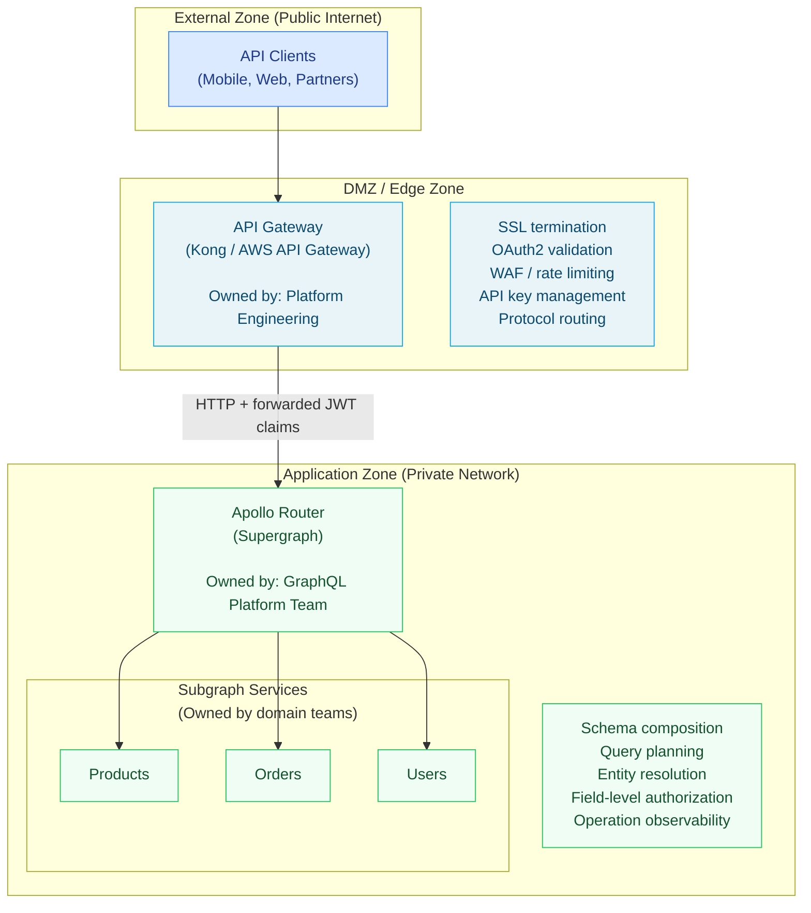

# 01 — API Gateway vs. Federation: Structured Comparison

> This chapter defines the responsibilities of an API gateway and GraphQL federation clearly, establishes a decision matrix for what to implement at each layer, and identifies the anti-patterns that emerge when teams conflate the two. Understanding the separation of concerns is necessary before designing the integration between Kong, AWS API Gateway, or Nginx and Apollo Router.

---

## Learning Objectives

- [ ] Enumerate the six core responsibilities of an API gateway and explain why none of them require GraphQL awareness
- [ ] Enumerate the six core responsibilities of GraphQL federation and explain why a generic HTTP proxy cannot fulfill them
- [ ] Use the decision matrix to determine which concerns belong at which layer
- [ ] Identify anti-patterns when teams over-invest in gateway-layer GraphQL logic or duplicate auth in both layers

---

## API Gateway Responsibilities

An API gateway is an infrastructure component that sits at the network perimeter between the public internet and internal services. It is designed to handle cross-cutting concerns that apply to all APIs regardless of their protocol, schema, or data model.

### 1. TLS Termination

The gateway terminates inbound TLS connections from clients. Internal traffic between the gateway and the federation layer travels over HTTP on a private network, avoiding the overhead of re-encryption at every hop.

```
Internet (HTTPS :443) → [Gateway: TLS termination] → Internal network (HTTP :80)
```

**Why not the router?** Apollo Router should not be exposed to the public internet directly — it lacks the battle-tested TLS optimization, certificate rotation automation, and FIPS compliance that dedicated gateway infrastructure provides.

### 2. OAuth2 Token Exchange and JWT Validation

The gateway performs the first line of token validation: signature verification, expiry check, issuer validation. It translates opaque OAuth2 access tokens to JWT claims by calling the identity provider's token introspection endpoint and forwards the validated claims to upstream services as headers.

```
Client: Authorization: Bearer opaque-token
Gateway: POST /introspect → { sub: "user-123", scope: "read:products" }
Gateway → Router: X-User-Id: user-123, X-User-Scope: read:products
```

**Why not the router?** Apollo Router can validate JWTs (and has a JWT authentication plugin), but it should not make outbound calls to identity providers for token introspection — that is high-latency, I/O-bound work that belongs in a dedicated authentication proxy layer.

### 3. Rate Limiting

Global rate limiting — enforced consistently across all consumers, all API products, all IP addresses — requires centralized state. The gateway maintains rate limit counters in Redis and enforces limits before requests reach the application layer.

```
Consumer A sends 1001 requests/minute → Gateway returns 429 Too Many Requests
Consumer A's request never reaches Apollo Router
```

**Why not the router?** Apollo Router can enforce per-operation complexity limits, but it cannot track global consumer-level rate limits across multiple router replicas without shared infrastructure. The gateway has this infrastructure and should own it.

### 4. WAF / DDoS Protection

Web Application Firewall rules (OWASP Top 10, bot detection, SSRF prevention, SQL injection detection) run at the gateway before any application-level processing. These rules are maintained by the security team, updated independently of application deployments, and do not require knowledge of the GraphQL schema.

### 5. Routing and Protocol Translation

The gateway routes requests to different upstream services based on path, headers, or request properties. It can translate between protocols — REST to gRPC, HTTP/1.1 to HTTP/2, WebSocket upgrades. It load-balances across service instances.

```
/graphql → Apollo Router cluster
/rest/v1/* → REST API cluster
/grpc/* → gRPC service
```

### 6. API Monetization and Usage Plans

Enterprise API platforms bill consumers based on usage. The gateway tracks API call counts, enforces quota limits per API key or subscription tier, and feeds data to billing systems. This is entirely separate from GraphQL semantics.

---

## GraphQL Federation Responsibilities

Apollo Router and the federation layer handle concerns that are GraphQL-specific and cannot be delegated to a generic HTTP proxy.

### 1. Schema Composition

The supergraph schema is the composition of all subgraph schemas. Apollo Router holds the composed supergraph schema and makes it the single contract between clients and the data mesh. No API gateway understands SDL, `@key` directives, or `@provides`/`@requires` relationships.

```graphql
# Products subgraph contributes:
type Product @key(fields: "id") {
  id: ID!
  name: String!
}

# Reviews subgraph extends Product:
extend type Product @key(fields: "id") {
  reviews: [Review!]!  # Cross-subgraph extension
}

# Apollo Router composes this into a unified supergraph schema
# A Kong plugin cannot do this
```

### 2. Query Planning

When a client sends a complex query that spans multiple subgraphs, the router builds a query plan: a directed acyclic graph of subgraph fetch operations. The plan determines which subgraphs to call, in what order, with what arguments, and how to merge results.

```
Query: { product(id: "123") { name reviews { rating author { name } } } }

Query Plan:
  1. Fetch product.name from Products subgraph
  2. Fetch product.reviews from Reviews subgraph (parallel with step 1)
  3. For each review, fetch review.author from Users subgraph (requires review.authorId)
  4. Merge and return
```

This requires understanding the GraphQL execution semantics, entity key relationships, and the cost model of subgraph fetches. No HTTP proxy can produce this plan.

### 3. Entity Resolution

The `@key` directive defines how entities are resolved across subgraph boundaries. The router uses the `representations` argument on the `_entities` query to batch-load entities by their key fields. This is a GraphQL-specific protocol that no API gateway implements.

```graphql
# Router generates this query to fetch authors from Users subgraph:
query {
  _entities(representations: [
    { __typename: "User", id: "usr-1" },
    { __typename: "User", id: "usr-2" }
  ]) {
    ... on User { id name }
  }
}
```

### 4. Field-Level Authorization

Authorization in GraphQL cannot be reduced to URL-based access control. Whether a user can access `User.email` depends on the schema structure, the authentication context, and potentially the relationship between the requesting user and the requested user. Apollo Router's authorization plugin applies field-level directives:

```graphql
type User {
  id: ID!
  name: String!                       # Public
  email: String! @requiresScopes(scopes: [["read:users"]])   # Requires scope
  salary: Float! @authenticated       # Requires any authenticated user
}
```

### 5. Subgraph Ownership and Contracts

Federation formalizes the contract between subgraph teams. Schema checks, changelog tracking, and breaking change detection are federation-layer concerns enforced by the Apollo schema registry. The gateway has no awareness of these ownership boundaries.

### 6. Operation-Level Observability

Apollo Router emits traces keyed by `operationName`, field-level resolver timings, and subgraph fetch durations. This granularity — resolver X in subgraph Y took 200ms for this operation — is only possible in the federation layer that understands the query structure.

---

## Decision Matrix

Use this matrix to decide where each concern belongs:

| Concern | API Gateway | Apollo Router | Subgraph | Notes |
|---------|-------------|---------------|----------|-------|
| SSL/TLS termination | Yes | No | No | TLS at the edge only |
| OAuth2 token introspection | Yes | No | No | Expensive outbound call |
| JWT signature verification | Yes | Optional | No | Gateway preferred; router as secondary |
| JWT claim forwarding | Yes | — | — | Gateway extracts, forwards as headers |
| Field-level authorization | No | Yes | Yes | Requires schema awareness |
| Global rate limiting (consumer) | Yes | No | No | Requires centralized state |
| Per-operation complexity limit | No | Yes | No | Requires query parsing |
| WAF / bot detection | Yes | No | No | Layer 7 inspection |
| Schema composition | No | Yes | — | Federation-only concern |
| Query planning | No | Yes | — | Federation-only concern |
| Entity resolution (`@key`) | No | Yes | Yes | Federation protocol |
| Response caching (full operation) | No | Yes | No | Requires operation fingerprint |
| CDN caching | Yes (edge) | No | No | CDN lives outside both layers |
| Distributed tracing | Yes (headers) | Yes (spans) | Yes (spans) | Gateway starts the trace; router/subgraphs continue it |
| Request logging | Yes | Yes | Optional | Both emit logs; gateway logs raw HTTP, router logs operations |
| API key management | Yes | No | No | Gateway-native feature |
| Subscription (WebSocket) | Yes (passthrough) | Yes | Yes | Gateway passes WebSocket through; router manages the protocol |

---

## Anti-Patterns

### Anti-Pattern 1: Implementing GraphQL Query Planning in the Gateway

**Symptom:** A team writes a Kong Lua plugin or AWS API Gateway request transformer that parses the GraphQL document body to extract the operation name, detect mutations, or validate query structure.

**Why it fails:**
- GraphQL document parsing is complex — fragments, inline fragments, aliases, directives, multi-operation documents all require a full parser
- The plugin must be updated whenever the schema changes
- Query validation requires the full schema SDL — maintaining this in the gateway creates a dual schema ownership problem
- The gateway is now blocking on CPU-intensive parsing for every request

**Correct approach:** Parse the GraphQL document only in Apollo Router. Use the operation name header (`x-graphql-operation-name`) that the router emits downstream as a stable identifier for routing decisions. If the gateway needs to know the operation type, the router can set a response header that the gateway reads for logging.

```lua
-- WRONG: Kong plugin parsing GraphQL body
local body = kong.request.get_raw_body()
local ok, decoded = pcall(cjson.decode, body)
local query = decoded.query or ""
if query:match("^%s*mutation") then
  -- Block mutations on this route
end

-- RIGHT: Trust the router's classification
-- Let the router add X-GraphQL-Operation-Type: mutation
-- Gateway reads this from the upstream response or trusts the router's access control
```

### Anti-Pattern 2: Duplicating Authorization in Both Layers

**Symptom:** JWT validation and role-based access control are implemented in both the Kong JWT plugin and in Apollo Router's authentication plugin. When access control changes, engineers must update both.

**Why it fails:**
- Dual ownership of the same business rule
- The two implementations inevitably drift — one allows access that the other denies, or vice versa
- Security incidents become harder to diagnose when the source of a denial is unclear

**Correct approach:** Divide authorization clearly:
- **Gateway:** Verifies JWT signature, checks `exp` claim, validates issuer. Forwards the raw decoded payload as `X-Forwarded-Claims` or injects individual claim headers.
- **Router:** Uses the forwarded claims for field-level authorization decisions. Does not re-verify the JWT signature (the gateway already did that).

```yaml
# Kong plugin: verify JWT and forward claims
plugins:
  - name: jwt
    config:
      key_claim_name: kid
      claims_to_verify: [exp, nbf]
  - name: request-transformer
    config:
      add:
        headers:
          - "x-user-id:$(jwt.sub)"
          - "x-user-roles:$(jwt.roles)"
          - "x-user-scope:$(jwt.scope)"

# Apollo Router: use forwarded claims for authorization
# (does NOT re-verify JWT — trusts gateway)
authorization:
  preview_directives:
    enabled: true
headers:
  all:
    request:
      - propagate:
          named: x-user-id
      - propagate:
          named: x-user-roles
      - propagate:
          named: x-user-scope
```

### Anti-Pattern 3: Rate Limiting at Both Layers Without Coordination

**Symptom:** Kong enforces 1000 requests/minute per consumer. Apollo Router enforces 100 requests/minute per consumer using a custom Rhai plugin. A consumer hitting 100 req/min sees rate limit errors from the router but Kong's counter shows only 100/1000 used.

**Why it fails:**
- Inconsistent rate limit signals confuse clients
- The effective limit is the minimum of both, but neither layer knows about the other's limit
- Error messages from two different layers use different formats (Kong's 429 vs Router's custom error)

**Correct approach:** Put all consumer-facing rate limiting in the gateway. The router can have a circuit-breaker style emergency limit (e.g., reject if over 10,000 req/sec to a specific subgraph) but this is an operational safety valve, not a business-facing quota.

### Anti-Pattern 4: Exposing Apollo Router Directly to the Internet

**Symptom:** Apollo Router is exposed on a public IP with a `NodePort` Kubernetes service. The team skips the gateway layer to reduce latency and operational complexity.

**Why it fails:**
- Apollo Router's `/admin` endpoint (for cache invalidation, schema updates) is exposed
- No WAF — GraphQL injection attacks, introspection enumeration, and DDoS reach the application layer directly
- TLS certificate management falls on the Router deployment (operational burden)
- No centralized audit log for compliance

**Correct approach:** Always put an API gateway or at minimum an ALB/Nginx in front of Apollo Router. The 1–3ms of gateway overhead is not significant compared to the operational and security benefits.

---

## Summary: The Clean Architecture



Each layer has a single owner, a well-defined responsibility, and does not need to understand the other layer's concerns.

---

## References

- [Kong Gateway Documentation](https://docs.konghq.com/gateway/) — Plugin architecture, routing, JWT plugin, and Lua plugin development
- [Apollo Router Authentication](https://www.apollographql.com/docs/router/configuration/authn-jwt/) — JWT validation in Apollo Router and header propagation
- [Apollo Router Authorization](https://www.apollographql.com/docs/router/configuration/authorization/) — `@requiresScopes`, `@authenticated`, `@policy` field directives

---

## Related Topics

- [02-kong-integration.md](./02-kong-integration.md) — Kong + Apollo Router integration with concrete plugin configurations
- [03-aws-appsync-vs-federation.md](./03-aws-appsync-vs-federation.md) — AWS AppSync vs. Apollo Federation comparison
- [../05-security/](../05-security/) — Field-level authorization implementation in Apollo Router
