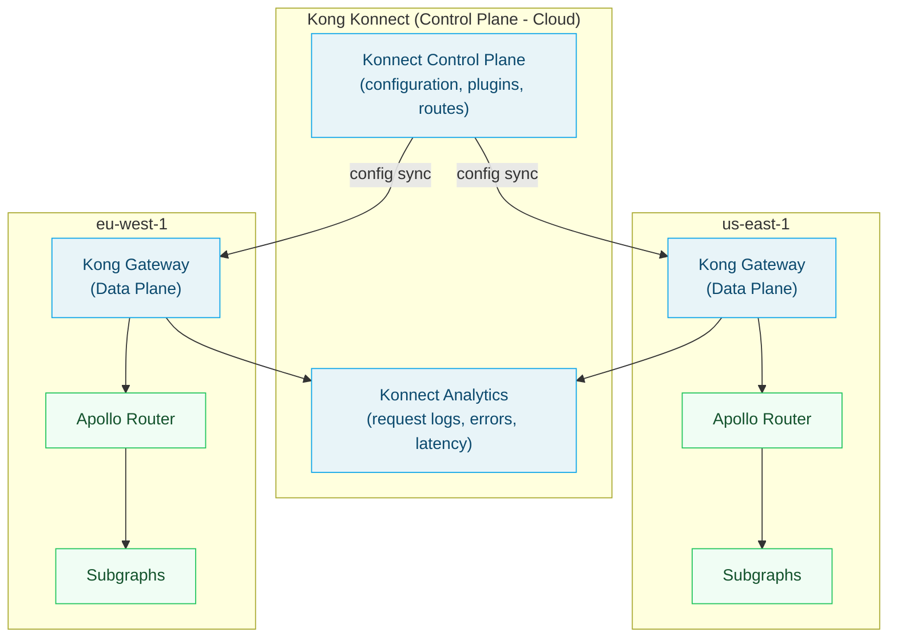

# 02 — Kong + Apollo Router Integration

> Kong is the most widely deployed open-source API gateway in enterprise environments. When an organization with an existing Kong deployment adopts Apollo Federation, Kong sits at the edge handling all infrastructure concerns while Apollo Router handles GraphQL composition. This chapter covers the Kong + Router deployment topology, JWT claim forwarding from Kong to the router, rate limiting by GraphQL operation name using a custom Kong plugin, Kong's gRPC-gateway integration in the context of GraphQL, and Kong Konnect for multi-cluster management.

---

## Learning Objectives

- [ ] Deploy Kong in front of Apollo Router with appropriate upstream routing configuration
- [ ] Configure Kong's JWT plugin to verify tokens and forward decoded claims to the router
- [ ] Write a custom Kong Lua plugin to extract the GraphQL operation name and use it for per-operation rate limiting
- [ ] Understand when to use Kong's gRPC-gateway plugin vs. Apollo Router's GraphQL handling
- [ ] Configure Kong Konnect for multi-region Apollo Router deployments

---

## Overview

Kong Gateway is a Lua-based API gateway built on Nginx + OpenResty. It provides a plugin architecture where pre-built plugins (JWT validation, rate limiting, request/response transformation, logging) are applied to routes. Custom plugins in Lua or Go extend Kong's behavior for organization-specific needs.

In the Kong + Apollo Router architecture, Kong handles all client-facing infrastructure concerns. Apollo Router is configured as a Kong upstream service — Kong proxies all `POST /graphql` and `GET /graphql` traffic to the router's internal endpoint. The router is not publicly accessible; it only receives traffic from Kong.

```mermaid
flowchart LR
    Client["API Client\n(Browser, Mobile, Partner)"]:::clientNode

    subgraph Kong["Kong Gateway (edge)"]
        direction TB
        Route["/graphql route"]:::routerNode
        JWT_Plugin["JWT Plugin\n(verify + decode)"]:::routerNode
        RL_Plugin["Rate Limit Plugin\n(per consumer + operation)"]:::routerNode
        WAF_Plugin["Bot Detection / WAF\n(OAS Plugin)"]:::routerNode
        Transform["Request Transformer\n(inject claim headers)"]:::routerNode
    end

    subgraph FedLayer["Federation Layer (private network)"]
        Router["Apollo Router\n:4000"]:::subgraphNode
        subgraph Subgraphs
            SG1["Products"]:::subgraphNode
            SG2["Orders"]:::subgraphNode
        end
    end

    Client -->|"HTTPS :443\nAuthorization: Bearer token"| Route
    Route --> JWT_Plugin
    JWT_Plugin -->|"validate + decode"| RL_Plugin
    RL_Plugin --> WAF_Plugin
    WAF_Plugin --> Transform
    Transform -->|"HTTP :4000\nX-User-Id + X-User-Roles"| Router
    Router --> SG1 & SG2

    classDef clientNode fill:#dbeafe,stroke:#3B82F6,color:#1e3a8a
    classDef routerNode fill:#e8f4f8,stroke:#0ea5e9,color:#0c4a6e
    classDef subgraphNode fill:#f0fdf4,stroke:#22c55e,color:#14532d
```



---

## Kong Configuration

### Declarative Configuration (deck)

Kong's declarative configuration format allows the entire gateway configuration to be version-controlled and deployed via CI:

```yaml
# kong.yaml — declarative configuration for Apollo Router integration
_format_version: "3.0"
_transform: true

services:
  - name: apollo-router
    # Internal DNS name of the Apollo Router service (Kubernetes Service)
    url: http://apollo-router.graphql.svc.cluster.local:4000
    connect_timeout: 5000   # 5 seconds
    read_timeout: 60000     # 60 seconds (allow for slow queries)
    write_timeout: 60000
    retries: 1
    # Health check for automatic unhealthy upstream removal
    healthchecks:
      active:
        healthy:
          interval: 10
          successes: 1
        unhealthy:
          interval: 5
          http_failures: 3
        http_path: /.well-known/apollo/server-info
        timeout: 2

    routes:
      - name: graphql-api
        paths:
          - /graphql
        methods:
          - GET
          - POST
        # Strip the /graphql prefix before forwarding to the router
        # (Router also listens on /graphql, so don't strip)
        strip_path: false
        # Preserve host header
        preserve_host: false
        # Response timeout
        protocols:
          - https
          - http
        # WebSocket support for GraphQL subscriptions
        # (Kong passes WebSocket upgrades through transparently)

      - name: graphql-subscriptions
        paths:
          - /graphql
        protocols:
          - wss
          - ws
        # WebSocket routes do not support most Kong plugins
        # Subscriptions bypass the plugin chain (except auth)

    plugins:
      # Plugin 1: JWT verification
      - name: jwt
        config:
          # Algorithm: RS256 (public key verification, private key at identity provider)
          key_claim_name: kid
          claims_to_verify:
            - exp
            - nbf
          # Allow requests without a JWT (for public operations)
          # Set to true if all operations require authentication
          anonymous: null  # null = require JWT on all requests to this service
          # URI for fetching JWKS from the identity provider
          # kong-plugin-jwt-keycloak or similar handles JWKS fetch
          cookie_names: []  # Only header-based JWTs

      # Plugin 2: Forward JWT claims as headers
      - name: request-transformer
        config:
          add:
            headers:
              # Extract claims from the validated JWT and inject as headers
              # Apollo Router reads these headers for authorization decisions
              - "x-user-id:$(jwt_claims.sub)"
              - "x-user-email:$(jwt_claims.email)"
              - "x-user-roles:$(jwt_claims.roles)"
              - "x-user-scope:$(jwt_claims.scope)"
              - "x-tenant-id:$(jwt_claims.tenant_id)"
          # Remove the raw Authorization header so the router doesn't attempt
          # to re-verify it (optional — depends on router auth config)
          # remove:
          #   headers:
          #     - Authorization

      # Plugin 3: Rate limiting (basic consumer-level)
      - name: rate-limiting-advanced
        config:
          limit:
            - 1000    # 1000 requests per minute per consumer
          window_size:
            - 60
          window_type: sliding
          sync_rate: -1  # Synchronous (accurate counting)
          identifier: consumer
          strategy: redis
          redis:
            host: redis-kong
            port: 6379
            database: 2
            password: ${REDIS_PASSWORD}

      # Plugin 4: Prometheus metrics
      - name: prometheus
        config:
          per_consumer: true
          # Emit latency histograms
          latency_metrics: true
          # Status code counts
          status_code_metrics: true
          bandwidth_metrics: true

      # Plugin 5: Correlation ID (distributed tracing support)
      - name: correlation-id
        config:
          header_name: x-request-id
          generator: uuid#counter
          echo_downstream: true

consumers:
  - username: web-client
    custom_id: web-client-prod
  - username: mobile-client
    custom_id: mobile-client-prod
  - username: partner-api
    custom_id: partner-api-prod

keyauth_credentials:
  - consumer: partner-api
    key: ${PARTNER_API_KEY}
```

### Apollo Router Configuration for Kong Integration

```yaml
# router.yaml — when running behind Kong

supergraph:
  listen: 0.0.0.0:4000

# Trust Kong's forwarded headers
# Kong has already validated the JWT — the router uses the extracted claim headers
headers:
  all:
    request:
      # Propagate claim headers from Kong to all subgraphs
      - propagate:
          named: x-user-id
      - propagate:
          named: x-user-email
      - propagate:
          named: x-user-roles
      - propagate:
          named: x-user-scope
      - propagate:
          named: x-tenant-id
      - propagate:
          named: x-request-id
      # Forward client IP for logging (Kong sets this from X-Real-IP)
      - propagate:
          named: x-forwarded-for

# Authorization using forwarded claims from Kong
# The router does NOT re-verify the JWT — it trusts Kong's validation
authorization:
  preview_directives:
    enabled: true

# JWT plugin in the router: disabled (Kong handles JWT validation)
# If you need the router to also validate JWTs independently (defense in depth):
# authentication:
#   router:
#     jwt:
#       jwks:
#         url: "${JWKS_URI}"
#       # Only validate if Kong missed the header (should not happen in production)

# Trust Kong's X-Forwarded-For header for client IP
server:
  experimental_http1_request_timeout_secs: 60
```

---

## Per-Operation Rate Limiting with a Custom Kong Plugin

Standard Kong rate limiting operates at the HTTP request level — it counts requests per consumer per minute without knowing anything about the GraphQL operation inside the request. For GraphQL, per-operation rate limiting is more accurate: a `search` query that scans the entire product catalog should have a tighter limit than a `product(id: "123")` lookup.

### Custom Plugin: GraphQL Operation Rate Limiter

```lua
-- kong/plugins/graphql-operation-ratelimit/handler.lua

local cjson = require "cjson"
local redis = require "kong.enterprise_edition.redis"

-- Plugin priority: run after JWT plugin (priority 1005) but before proxying
local GraphQLOperationRateLimit = {
  PRIORITY = 900,
  VERSION = "1.0.0",
}

-- Extract the GraphQL operation name from the request body or query string
local function get_operation_name(body, method, query_string)
  if method == "GET" then
    -- APQ GET request: operationName is a query parameter
    return query_string and query_string.operationName or nil
  end

  if not body or body == "" then
    return nil
  end

  local ok, decoded = pcall(cjson.decode, body)
  if not ok or type(decoded) ~= "table" then
    return nil
  end

  -- Return the explicit operationName field from the request body
  return decoded.operationName
end

-- Get the consumer identifier for rate limit key
local function get_consumer_id()
  local consumer = kong.client.get_consumer()
  if consumer then
    return consumer.id
  end
  -- Unauthenticated request: use IP address as identifier
  return kong.client.get_forwarded_ip()
end

function GraphQLOperationRateLimit:access(conf)
  local method = kong.request.get_method()
  local body = nil

  -- Only parse body for POST requests
  if method == "POST" then
    body = kong.request.get_raw_body()
  end

  local query_string = kong.request.get_query()
  local operation_name = get_operation_name(body, method, query_string)

  if not operation_name then
    -- No operation name — apply default limit
    operation_name = "__anonymous__"
  end

  local consumer_id = get_consumer_id()

  -- Check if this operation has a specific rate limit configured
  local limit = conf.operation_limits[operation_name] or conf.default_limit
  if not limit then
    return -- No limit configured — allow through
  end

  -- Build the Redis rate limit key
  local window = math.floor(ngx.time() / conf.window_size) * conf.window_size
  local key = string.format(
    "graphql:ratelimit:%s:%s:%d",
    consumer_id,
    operation_name,
    window
  )

  -- Increment the counter
  local red, err = redis.connect(conf.redis_host, conf.redis_port)
  if err then
    kong.log.warn("Redis connection failed, skipping rate limit: ", err)
    return
  end

  local count, err = red:incr(key)
  if err then
    kong.log.err("Redis INCR failed: ", err)
    return
  end

  -- Set expiry on first increment
  if count == 1 then
    red:expire(key, conf.window_size * 2)
  end

  -- Emit rate limit headers
  kong.response.set_header("X-RateLimit-Limit-GraphQL-Operation", limit)
  kong.response.set_header("X-RateLimit-Remaining-GraphQL-Operation", math.max(0, limit - count))
  kong.response.set_header("X-GraphQL-Operation", operation_name)

  if count > limit then
    return kong.response.error(429, "GraphQL operation rate limit exceeded", {
      ["Content-Type"] = "application/json",
      ["Retry-After"] = tostring(conf.window_size - (ngx.time() - window)),
      ["X-GraphQL-Operation"] = operation_name,
    })
  end
end

return GraphQLOperationRateLimit
```

```lua
-- kong/plugins/graphql-operation-ratelimit/schema.lua

local typedefs = require "kong.db.schema.typedefs"

return {
  name = "graphql-operation-ratelimit",
  fields = {
    { consumer = typedefs.no_consumer },
    { config = {
      type = "record",
      fields = {
        { redis_host = { type = "string", required = true } },
        { redis_port = { type = "integer", default = 6379 } },
        { window_size = { type = "integer", default = 60 } },  -- seconds
        -- Default limit for operations not in the operation_limits map
        { default_limit = { type = "integer", default = 1000 } },
        -- Per-operation overrides: { SearchProducts: 100, ProductDetail: 5000 }
        { operation_limits = {
          type = "map",
          keys = { type = "string" },
          values = { type = "integer" },
          default = {},
        }},
      },
    }},
  },
}
```

```yaml
# Kong declarative config — apply the custom plugin to the GraphQL route
services:
  - name: apollo-router
    routes:
      - name: graphql-api
        plugins:
          - name: graphql-operation-ratelimit
            config:
              redis_host: redis-kong
              redis_port: 6379
              window_size: 60
              default_limit: 1000
              # Per-operation limits
              operation_limits:
                # Expensive search operation: tighter limit
                SearchProducts: 100
                SearchOrders: 50
                # Bulk export operation: very tight limit
                ExportOrderHistory: 10
                # Standard CRUD: generous limit
                ProductDetail: 5000
                CreateOrder: 2000
```

---

## JWT Claim Forwarding Deep Dive

### Kong JWT Plugin Configuration with JWKS

```yaml
# Kong JWT plugin using JWKS (JSON Web Key Sets) for key rotation
plugins:
  - name: jwt
    service: apollo-router
    config:
      # Fields in the JWT to verify
      claims_to_verify:
        - exp  # Token expiry
        - nbf  # Not before
      
      # The JWT key ID claim — matches against pre-registered JWT credentials
      key_claim_name: kid
      
      # Allow anonymous access (no JWT) for public operations
      # Set a consumer to use for anonymous requests
      # anonymous: <consumer-id>  # Remove to require JWT on all requests
      
      # Maximum allowed clock skew in seconds
      maximum_expiration: 3600
      
      # JWT is in Authorization: Bearer <token> header
      cookie_names: []
      header_names:
        - authorization
```

```bash
# Register a JWKS URL as a Kong consumer credential
# (for RS256 tokens from an OIDC provider like Keycloak or Auth0)

# 1. Create a consumer for the identity provider
curl -X POST http://kong-admin:8001/consumers \
  -d username=auth0-provider

# 2. Register the JWKS public key
curl -X POST http://kong-admin:8001/consumers/auth0-provider/jwt \
  -d algorithm=RS256 \
  -d rsa_public_key="$(cat /certs/jwks-public-key.pem)" \
  -d key="https://your-tenant.auth0.com/"  # Matches JWT `iss` claim
```

### Enriching Claims in the Router

Once Kong forwards the claims as headers, Apollo Router uses them for authorization:

```yaml
# router.yaml — field-level authorization using forwarded Kong claims

authorization:
  preview_directives:
    enabled: true
  
  # The header containing the decoded JWT claims (set by Kong's request-transformer)
  # Format: base64-encoded JSON of the claims object
  # Alternative: use individual claim headers (x-user-id, x-user-roles, etc.)

# Rhai plugin to inject claims into the context for field-level auth directives
plugins:
  rhai:
    scripts:
      - path: /etc/router/scripts/extract-claims.rhai

# extract-claims.rhai
fn supergraph_service(service) {
  let request = service.router_request;
  
  // Read claim headers forwarded by Kong
  let user_id = request.headers["x-user-id"] ?? "";
  let user_roles = request.headers["x-user-roles"] ?? "";
  let tenant_id = request.headers["x-tenant-id"] ?? "";
  
  // Construct a synthetic JWT claims object for the authorization plugin
  // This allows @requiresScopes and @authenticated to work correctly
  if user_id != "" {
    // Set a synthetic Authorization header that the router's JWT plugin
    // can recognize as pre-validated (using a known internal format)
    request.headers["x-graphql-user-id"] = user_id;
    request.headers["x-graphql-user-roles"] = user_roles;
    request.headers["x-graphql-tenant"] = tenant_id;
  }
}
```

---

## Kong Konnect for Multi-Cluster Management

Kong Konnect is the managed control plane for Kong Gateway. In a multi-region Apollo Router deployment, Konnect manages Kong configuration consistently across all regions.



```bash
# Deploy Kong data plane connected to Konnect
docker run -d \
  -e "KONG_ROLE=data_plane" \
  -e "KONG_CLUSTER_CONTROL_PLANE=${KONNECT_CLUSTER_ENDPOINT}:443" \
  -e "KONG_CLUSTER_SERVER_NAME=${KONNECT_SERVER_NAME}" \
  -e "KONG_CLUSTER_TELEMETRY_ENDPOINT=${KONNECT_TELEMETRY_ENDPOINT}:443" \
  -e "KONG_CLUSTER_TELEMETRY_SERVER_NAME=${KONNECT_TELEMETRY_SERVER_NAME}" \
  -e "KONG_CLUSTER_MTLS=pki" \
  -e "KONG_CLUSTER_CERTIFICATE=$(cat /certs/cluster-cert.pem)" \
  -e "KONG_CLUSTER_CERTIFICATE_KEY=$(cat /certs/cluster-key.pem)" \
  -e "KONG_LUA_SSL_TRUSTED_CERTIFICATE=system" \
  -p 443:8443 \
  kong/kong-gateway:latest
```

### Multi-Region Apollo Router Configuration via Konnect

Each Konnect data plane points to its regional Apollo Router:

```yaml
# Konnect service configuration: region-specific Apollo Router upstreams

# us-east-1 control plane group
services:
  - name: apollo-router-use1
    url: http://apollo-router.graphql.svc.cluster.local:4000  # us-east-1 k8s DNS
    tags:
      - region:us-east-1
    routes:
      - name: graphql-use1
        paths: [/graphql]
        methods: [GET, POST]

# eu-west-1 control plane group  
services:
  - name: apollo-router-euw1
    url: http://apollo-router.graphql.svc.cluster.local:4000  # eu-west-1 k8s DNS
    tags:
      - region:eu-west-1
    routes:
      - name: graphql-euw1
        paths: [/graphql]
        methods: [GET, POST]
```

---

## Kong gRPC-Gateway vs. GraphQL

Kong's `grpc-gateway` plugin translates REST/JSON requests to gRPC. Teams sometimes ask whether they should use gRPC for subgraph communication (exposing gRPC services through Kong) or GraphQL Federation. These are orthogonal choices:

| Concern | gRPC + Kong gRPC-Gateway | GraphQL Federation |
|---------|-------------------------|-------------------|
| **Primary purpose** | Protocol translation (REST → gRPC) | Schema composition + query planning |
| **Client protocol** | REST/JSON (converted by Kong) | GraphQL |
| **Schema** | Protobuf | SDL |
| **Code generation** | Yes (protoc, buf) | Yes (graphql-codegen) |
| **Entity relationships** | No (each service is independent) | Yes (@key federation) |
| **Browser-friendly** | After gRPC-gateway translation | Native |
| **Real-time** | gRPC streaming | GraphQL subscriptions |

**When to use gRPC internally and GraphQL externally:**

Some enterprise systems use gRPC for internal microservice communication (high performance, type-safe, streaming) and GraphQL as the external API layer (developer experience, flexible queries). In this topology:

```
External clients → Kong → Apollo Router → [GraphQL-aware subgraphs]
                                         ↓ (internal gRPC calls)
                                      gRPC microservices
```

The subgraphs are thin GraphQL translation layers that call internal gRPC services. The subgraph resolver calls a gRPC client, converts the protobuf response to a GraphQL object, and returns it. Kong handles external GraphQL traffic; gRPC is an internal implementation detail.

```typescript
// Subgraph resolver calling an internal gRPC service
import { ProductServiceClient } from '../generated/product_service_grpc_pb';
import { GetProductRequest } from '../generated/product_service_pb';

const grpcClient = new ProductServiceClient(
  'product-service.internal:50051',
  credentials.createInsecure()
);

export const Query = {
  product: (_: unknown, args: { id: string }) => {
    return new Promise((resolve, reject) => {
      const request = new GetProductRequest();
      request.setId(args.id);

      grpcClient.getProduct(request, (err, response) => {
        if (err) return reject(err);
        // Convert protobuf response to GraphQL-compatible object
        resolve({
          id: response.getId(),
          name: response.getName(),
          price: response.getPrice(),
        });
      });
    });
  },
};
```

---

## Production Considerations

### Kong Plugin Execution Order

Kong plugins execute in a specific priority order. Ensure the custom GraphQL operation rate limiter runs after the JWT plugin (which authenticates the consumer) but before the request reaches the upstream:

| Plugin | Priority | Purpose |
|--------|----------|---------|
| Bot Detection | 2500 | Block bots before any processing |
| ACL | 950 | Consumer group access control |
| JWT | 1005 | Token verification, consumer authentication |
| Rate Limiting Advanced | 910 | Consumer-level rate limiting |
| GraphQL Operation Rate Limit (custom) | 900 | Per-operation rate limiting |
| Request Transformer | 801 | Inject claim headers |
| Prometheus | 13 | Metrics (runs late, after all processing) |
| Correlation ID | 1 | Request ID injection |

### Health Checks and Circuit Breaking

```yaml
# Kong upstream health check configuration for Apollo Router
upstreams:
  - name: apollo-router-upstream
    algorithm: round-robin
    targets:
      - target: apollo-router-0.apollo-router:4000
        weight: 100
      - target: apollo-router-1.apollo-router:4000
        weight: 100
      - target: apollo-router-2.apollo-router:4000
        weight: 100
    
    healthchecks:
      active:
        type: http
        http_path: /.well-known/apollo/server-info
        healthy:
          interval: 10
          successes: 2
          http_statuses: [200]
        unhealthy:
          interval: 5
          http_failures: 3
          http_statuses: [500, 503]
      
      passive:
        # Mark upstream unhealthy if it returns 5xx errors
        unhealthy:
          http_failures: 5
          http_statuses: [500, 502, 503, 504]
```

### Observability Integration

```yaml
# Kong OpenTelemetry plugin for distributed tracing
plugins:
  - name: opentelemetry
    config:
      # OTLP exporter endpoint (Jaeger, Tempo, or OTLP collector)
      endpoint: http://otel-collector:4318/v1/traces
      resource_attributes:
        service.name: kong-gateway
        deployment.environment: production
      header_type: b3  # B3 tracing headers for compatibility with Jaeger/Zipkin
      # Also supports: w3c (W3C Trace Context)
      propagation:
        default_format: w3c
      sampling_rate: 1.0  # 100% sampling (reduce in high-traffic production)
```

---

## References

- [Kong Plugin Development Guide](https://docs.konghq.com/gateway/latest/plugin-development/) — Lua plugin development, schema definition, and handler lifecycle
- [Kong JWT Plugin](https://docs.konghq.com/hub/kong-inc/jwt/) — JWT validation configuration, JWKS support, and consumer credential management
- [Kong Konnect Documentation](https://docs.konghq.com/konnect/) — Control plane management, data plane deployment, and analytics
- [Kong Rate Limiting Advanced](https://docs.konghq.com/hub/kong-inc/rate-limiting-advanced/) — Sliding window, consumer-level rate limiting with Redis backend

---

## Related Topics

- [01-comparison.md](./01-comparison.md) — Responsibility matrix: what Kong owns vs. what Apollo Router owns
- [04-migration-patterns.md](./04-migration-patterns.md) — Migrating existing Kong REST routes to GraphQL Federation
- [../05-security/](../05-security/) — Field-level authorization in Apollo Router using Kong-forwarded claims
- [../14-observability/](../14-observability/) — Distributed tracing from Kong through Apollo Router to subgraphs
