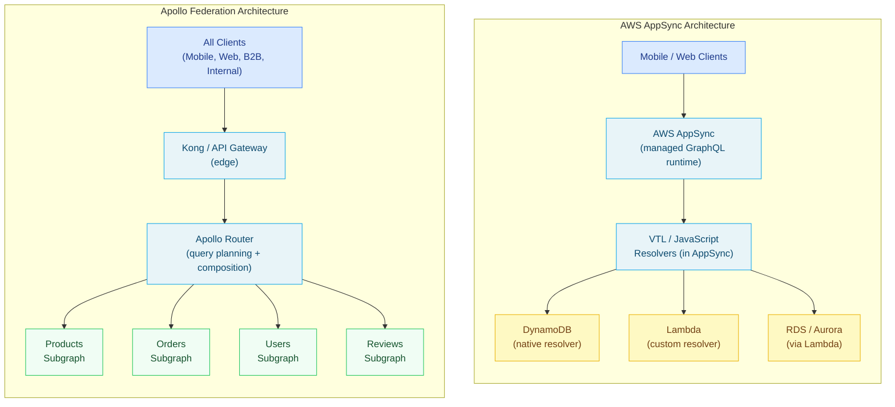

# 03 — AWS AppSync vs. Apollo Federation

> AWS AppSync is AWS's managed GraphQL service. Apollo Federation is a self-hosted, open-source framework for composing a distributed GraphQL API from microservices. Both expose a GraphQL API to clients, but their architectures, capabilities, operational models, and enterprise trade-offs are fundamentally different. This chapter provides a structured comparison, identifies where AppSync falls short for enterprise use cases, and covers migration paths and hybrid deployment patterns that combine both.

---

## Learning Objectives

- [ ] Identify the scenarios where AWS AppSync is the right choice and where Apollo Federation is required
- [ ] Explain AppSync's built-in features (Cognito auth, DynamoDB resolvers, WebSocket subscriptions) and why they don't scale to complex backends
- [ ] Describe the three primary limitations of AppSync for enterprise federation use cases
- [ ] Design a hybrid architecture where AppSync serves mobile clients and Apollo Federation serves complex backend consumers
- [ ] Outline the incremental migration path from AppSync to Apollo Federation

---

## Overview

AWS AppSync and Apollo Federation represent two philosophically different approaches to enterprise GraphQL:

- **AppSync** is a **managed service** with a vertical integration model. AWS owns the infrastructure, the resolver runtime (VTL or JavaScript), the WebSocket tier, the Cognito integration, and the caching layer. You pay for compute time; you don't manage servers.

- **Apollo Federation** is a **framework** with a horizontal integration model. You own the infrastructure (EKS, EC2, or Lambda), the schema composition tooling, the router, and each subgraph. You maintain the servers; you own the operational complexity.

Neither is universally better. The choice depends on team maturity, workload complexity, cross-service data requirements, and organizational investment in AWS vs. open-source toolchains.



---

## AWS AppSync Built-In Features

### 1. Amazon Cognito Integration

AppSync has native integration with Amazon Cognito User Pools and Identity Pools. Authentication and authorization directives are applied in the SDL and evaluated by the AppSync runtime without any custom resolver code.

```graphql
# AppSync schema with Cognito-based authorization
type Query {
  # Any authenticated Cognito user can call this
  myOrders: [Order!]! @aws_cognito_user_pools

  # Only users in the admin group can call this
  allOrders: [Order!]! @aws_cognito_user_pools(cognito_groups: ["admin"])

  # Public — no authentication required
  products: [Product!]! @aws_api_key
}

type Mutation {
  createOrder(input: CreateOrderInput!): Order @aws_cognito_user_pools
  updateProduct(id: ID!, input: UpdateProductInput!): Product
    @aws_cognito_user_pools(cognito_groups: ["admin", "catalog-team"])
}
```

**Limitation:** Cognito-based authorization is coarse-grained (user pools + groups). Fine-grained authorization ("User A can only read their own orders") requires Lambda resolvers with custom authorization logic, which eliminates the "zero code" benefit.

### 2. DynamoDB Resolvers with VTL

AppSync can connect directly to DynamoDB without a Lambda function using Velocity Template Language (VTL) or JavaScript resolvers. For simple CRUD on DynamoDB tables, this is zero-infrastructure, zero-cold-start, and extremely low operational overhead.

```javascript
// AppSync JavaScript resolver: DynamoDB GetItem (no Lambda required)
// PIPELINE: Request → DynamoDB resolver → Response

export function request(ctx) {
  return {
    operation: "GetItem",
    key: {
      pk: { S: `PRODUCT#${ctx.args.id}` },
      sk: { S: "METADATA" },
    },
  };
}

export function response(ctx) {
  if (!ctx.result) {
    return null;
  }
  return {
    id: ctx.result.pk.S.replace("PRODUCT#", ""),
    name: ctx.result.name.S,
    price: parseFloat(ctx.result.price.N),
    categoryId: ctx.result.categoryId.S,
  };
}
```

**Limitation:** VTL and the AppSync resolver JavaScript environment are sandboxed. You cannot import external libraries, make arbitrary HTTP calls, or run complex business logic. Anything beyond simple DynamoDB operations requires a Lambda.

### 3. Real-Time Subscriptions via WebSocket

AppSync manages WebSocket connections for GraphQL subscriptions. Clients connect to AppSync's WebSocket endpoint, subscribe to operations, and AppSync pushes updates when mutations trigger. The infrastructure (WebSocket connection management, message routing) is fully managed.

```graphql
type Subscription {
  onOrderStatusChanged(orderId: ID!): Order
    @aws_subscribe(mutations: ["updateOrderStatus"])
}
```

```javascript
// AppSync subscription client (Amplify)
import { API, graphqlOperation } from 'aws-amplify';
import { onOrderStatusChanged } from './graphql/subscriptions';

const subscription = API.graphql(
  graphqlOperation(onOrderStatusChanged, { orderId: 'ord-123' })
).subscribe({
  next: ({ value }) => console.log('Order updated:', value.data.onOrderStatusChanged),
  error: (error) => console.error('Subscription error:', error),
});
```

**Limitation:** AppSync subscriptions use a simple filter model: a subscription fires when a specified mutation occurs. They do not support custom subscription resolution logic or cross-service event aggregation.

### 4. Built-In Caching

AppSync has a server-side caching feature that caches resolver responses using ElastiCache Memcached under the hood. Cache TTL is set per-resolver in the AppSync console or CloudFormation.

**Limitation:** Caching operates at the resolver level, not the operation level. There is no equivalent of Apollo Router's response cache or `@cacheControl` directive TTL hierarchy.

---

## Where AppSync Falls Short for Enterprise

### Limitation 1: No Cross-Service Entity Resolution

The defining capability of GraphQL Federation is entity resolution: a `Product` type defined in the Products subgraph can be extended by the Reviews subgraph to add `reviews: [Review!]!`. The router handles the cross-service fetch transparently.

AppSync does not have this capability. If your `Order` type needs to include data from a `User` service and a `Payment` service, you must:
- Write a Lambda resolver that calls both services synchronously
- Or use AppSync pipeline resolvers (sequential, not federated)
- Or maintain a denormalized DynamoDB table that pre-joins the data

This creates tight coupling between services, duplicated data, and a Lambda resolver that becomes a bottleneck for every order query.

```graphql
# Apollo Federation: clean cross-service entity relationship
# Orders subgraph:
type Order @key(fields: "id") {
  id: ID!
  userId: ID!
  total: Money!
}

# Users subgraph extends Order transparently:
extend type Order @key(fields: "id") {
  customer: User!  # Resolved by Users subgraph — no Orders code change needed
}

# AppSync equivalent requires a Lambda that calls both services:
# (tight coupling, single point of failure, harder to test independently)
```

### Limitation 2: Limited Custom Resolver Logic

AppSync VTL resolvers are sandboxed and have no access to:
- External HTTP endpoints (beyond DynamoDB, Elasticsearch, HTTP datasources with fixed URLs)
- NPM packages
- File system
- Node.js native modules

JavaScript resolvers (AppSync's newer resolver runtime) support a broader subset of JavaScript but remain sandboxed — no `require()`, no `fetch()`, no external dependencies.

Any sophisticated business logic requires a Lambda resolver. Lambda introduces cold starts, timeout limits, and deployment complexity. The "serverless" advantage of AppSync disappears when most resolvers are Lambda-backed.

### Limitation 3: Vendor Lock-In

AppSync uses:
- VTL / AppSync JavaScript (not standard Node.js)
- AppSync-specific directives (`@aws_subscribe`, `@aws_cognito_user_pools`)
- AppSync pipeline resolvers (not standard Apollo Server plugins)
- Amplify DataStore for offline sync (proprietary client SDK)

Migrating from AppSync to Apollo Federation requires rewriting all resolvers (VTL → TypeScript/Node.js), replacing AppSync directives, and replacing Amplify client libraries. There is no incremental path.

### Capability Comparison

| Capability | AWS AppSync | Apollo Federation |
|------------|-------------|------------------|
| Managed infrastructure | Yes (fully) | No (self-hosted) |
| Cross-service entity resolution | No | Yes (core feature) |
| Schema composition across services | No | Yes |
| Query planning (multi-service joins) | No | Yes |
| Cognito authentication | Native | Via JWT plugin |
| Custom auth (ABAC) | Lambda required | Yes (directives + plugins) |
| DynamoDB native resolvers | Yes | No (via DataSource) |
| WebSocket subscriptions | Native (managed) | Yes (self-managed) |
| Custom resolver logic | Limited (VTL/JS sandbox) | Full Node.js |
| Plugin/extension ecosystem | AWS plugins only | Open plugin system |
| Multi-region | AWS Global Tables + regional AppSync | Multi-cluster deployment |
| Observability | CloudWatch (basic) | OpenTelemetry (full) |
| Local development | Limited (SAM + simulator) | Apollo Sandbox |
| Schema registry | No | Apollo Studio |
| Breaking change detection | No | Apollo schema checks |
| Persisted queries / allowlist | No | Yes |
| Response caching | Basic (ElastiCache) | Redis-backed, `@cacheControl` |
| Cost model | Pay per request | Fixed infrastructure cost |

---

## Decision Guide

**Choose AWS AppSync when:**
- Primary data source is DynamoDB and data access patterns are simple
- Team is small, operational overhead must be minimal
- Real-time subscriptions are needed with minimal infrastructure investment
- Clients are exclusively mobile apps using Amplify
- Schema is simple and data lives in a single service domain
- AWS lock-in is acceptable or desired

**Choose Apollo Federation when:**
- Data spans multiple microservices with entity relationships
- Schema is owned by multiple teams (domain ownership)
- Complex resolver logic is required (business rules, external API integration)
- Non-AWS infrastructure is involved (on-prem, GCP, Azure)
- Enterprise observability is required (field-level latency, distributed tracing)
- Schema governance is required (breaking change detection, changelog)
- Persisted query allowlist is a security requirement
- Consumer base includes B2B partners with complex data access patterns

---

## Hybrid Pattern: AppSync for Mobile, Federation for Backend

For organizations heavily invested in AWS Amplify for mobile development, a hybrid architecture can avoid full migration:

```mermaid
flowchart LR
    subgraph Clients
        Mobile["iOS / Android\n(Amplify)"]:::clientNode
        Web["Web App"]:::clientNode
        Partner["B2B Partners\n(REST / GraphQL)"]:::clientNode
        Internal["Internal Services"]:::clientNode
    end

    subgraph MobileLayer["Mobile API (AppSync)"]
        AS["AWS AppSync\n(Cognito auth, offline sync)"]:::routerNode
        DDB["DynamoDB\n(mobile-optimized schemas)"]:::dbNode
        Lambda_AS["Lambda resolvers\n(AppSync-specific)"]:::dbNode
        AS --> DDB & Lambda_AS
    end

    subgraph BackendLayer["Backend API (Apollo Federation)"]
        Kong["Kong Gateway"]:::routerNode
        Router["Apollo Router"]:::routerNode
        SG1["Products"]:::subgraphNode
        SG2["Orders"]:::subgraphNode
        SG3["Inventory"]:::subgraphNode
        Router --> SG1 & SG2 & SG3
        Kong --> Router
    end

    subgraph DataBridge["Data Synchronization"]
        EventBridge["AWS EventBridge"]:::ciNode
        SQS["SQS Queues"]:::ciNode
    end

    Mobile --> AS
    Web & Partner & Internal --> Kong

    Lambda_AS -->|"events"| EventBridge
    EventBridge --> SQS
    SQS -->|"consume"| SG2  # Orders sync from AppSync to Federation

    classDef clientNode fill:#dbeafe,stroke:#3B82F6,color:#1e3a8a
    classDef routerNode fill:#e8f4f8,stroke:#0ea5e9,color:#0c4a6e
    classDef subgraphNode fill:#f0fdf4,stroke:#22c55e,color:#14532d
    classDef dbNode fill:#fef9c3,stroke:#eab308,color:#713f12
    classDef ciNode fill:#fff7ed,stroke:#f97316,color:#7c2d12
```

In this pattern:
- **AppSync** serves mobile clients using Amplify DataStore for offline sync and Cognito for authentication. DynamoDB is the primary data store for mobile-specific schemas (notification preferences, device tokens, user profile).
- **Apollo Federation** serves web clients, B2B API partners, and internal microservices. It owns the complex domain model (products, orders, inventory, pricing) with entity relationships across subgraphs.
- **Data synchronization** is handled through EventBridge and SQS. When a mobile client creates an order via AppSync → Lambda, the Lambda publishes an event to EventBridge. The Orders subgraph consumes this event via SQS and writes it to the Federation data store.

### Shared Authentication

Both AppSync and Apollo Federation can validate the same JWTs issued by Cognito, avoiding dual identity management:

```typescript
// AppSync: uses @aws_cognito_user_pools directive natively

// Apollo Router: validate the same Cognito JWT
// router.yaml
authentication:
  router:
    jwt:
      jwks:
        # Cognito JWKS endpoint for the same User Pool
        url: "https://cognito-idp.us-east-1.amazonaws.com/${COGNITO_USER_POOL_ID}/.well-known/jwks.json"
      header_value_prefix: "Bearer"
      claims:
        # Map Cognito claims to standard JWT claims
        sub: sub
        iss: iss
        cognito_groups: "cognito:groups"
```

---

## Migration Path: AppSync to Apollo Federation

### Phase 1: Schema Extraction and Analysis

```bash
# Export AppSync schema
aws appsync get-introspection-schema \
  --api-id ${APPSYNC_API_ID} \
  --format JSON \
  --output text > appsync-schema.json

# Convert to SDL format
npx graphql-code-generator \
  --config codegen-schema-extraction.yml

# Analyze for cross-service relationships that need federation entities
npx ts-node scripts/analyze-federation-opportunities.ts
```

### Phase 2: Identify Federation Boundaries

Map AppSync resolvers to subgraph ownership boundaries:

```typescript
// scripts/analyze-federation-opportunities.ts
// Identifies types that are referenced from multiple resolvers
// and would benefit from @key federation

interface TypeAnalysis {
  typename: string;
  resolvers: string[];       // Which resolvers reference this type
  datasources: string[];     // Which AppSync data sources it uses
  candidateKey: string[];    // Fields that could be @key
}

function analyzeSchema(schema: GraphQLSchema): TypeAnalysis[] {
  // ... traverse type system, identify cross-datasource references
}

// Output:
// Product: referenced by ProductResolver (DynamoDB), ReviewResolver (Lambda), OrderResolver (Lambda)
// → Federation candidate: type Product @key(fields: "id")
//   - Products subgraph owns: id, name, price, category
//   - Reviews subgraph extends: reviews
//   - Orders subgraph extends: orderCount, totalSpend
```

### Phase 3: Parallel Deployment with Traffic Split

```yaml
# AWS ALB weighted target groups for gradual traffic migration
# Route 10% to Apollo Router, 90% to AppSync initially

LoadBalancer:
  Type: AWS::ElasticLoadBalancingV2::Listener
  Properties:
    DefaultActions:
      - Type: forward
        ForwardConfig:
          TargetGroups:
            - TargetGroupArn: !Ref AppSyncTargetGroup
              Weight: 90
            - TargetGroupArn: !Ref ApolloRouterTargetGroup
              Weight: 10
```

### Phase 4: Deprecate AppSync Operations

```graphql
# Mark AppSync-only operations as deprecated in the Federation schema
# to guide clients to migrate

type Query {
  # Deprecated: use product(id: ID!) instead
  # Will be removed after 2025-06-01
  getProduct(id: ID!): Product @deprecated(reason: "Use product(id: ID!) — removing 2025-06-01")

  # New federation-native operation
  product(id: ID!): Product
}
```

### Approximate Migration Timeline

| Phase | Duration | Risk | Rollback |
|-------|----------|------|---------|
| Schema analysis + planning | 2–4 weeks | None | N/A |
| Build subgraphs (parallel to AppSync) | 4–8 weeks | Low | Keep AppSync active |
| Traffic split (10% → 50% → 100%) | 4–6 weeks | Medium | Reduce ALB weight |
| AppSync deprecation and removal | 2–4 weeks | Low | AppSync still running |
| Total | 12–22 weeks | — | — |

---

## Cost Comparison

AppSync pricing (as of 2024):
- **$4.00** per million query and data modification operations
- **$2.00** per million real-time updates (WebSocket)
- **$0.08** per million minutes of connection (WebSocket idle)
- ElastiCache (for caching): additional cost

Apollo Federation pricing:
- **Apollo Router:** Free (open-source) + Apollo Studio subscription for schema registry and metrics ($0–$2,000+/month depending on usage)
- **Infrastructure:** EC2/EKS cost (2 vCPU, 4GB per router replica × N replicas)
- **Redis:** ElastiCache Redis for response cache and APQ store

Break-even calculation (rough):
- At 10M GraphQL operations/month, AppSync costs ~$40/month
- Apollo Federation infrastructure (2 router replicas on t3.medium + Redis cache.t3.micro): ~$150/month
- **AppSync is cheaper at low scale; Federation is cheaper at high scale**

At 1 billion operations/month:
- AppSync: ~$4,000/month
- Federation (horizontal scaling to 10 router replicas): ~$600/month

The break-even point is typically around 200–500M operations/month depending on instance types and regions.

---

## References

- [AWS AppSync Documentation](https://docs.aws.amazon.com/appsync/latest/devguide/what-is-appsync.html) — Official AppSync guide covering resolvers, VTL, Cognito integration, and subscriptions
- [Apollo Federation Documentation](https://www.apollographql.com/docs/federation/) — Federation architecture, `@key` directives, and router configuration
- [AWS AppSync Pricing](https://aws.amazon.com/appsync/pricing/) — Current AppSync pricing model
- [Amplify GraphQL API](https://docs.amplify.aws/javascript/build-a-backend/graphqlapi/) — Amplify client integration with AppSync

---

## Related Topics

- [01-comparison.md](./01-comparison.md) — General API gateway vs. federation comparison
- [04-migration-patterns.md](./04-migration-patterns.md) — Broader REST-to-federation migration patterns including AppSync
- [../07-federation/](../07-federation/) — Apollo Federation architecture reference
- [../15-kubernetes-deployment/](../15-kubernetes-deployment/) — Deploying Apollo Router on AWS EKS
