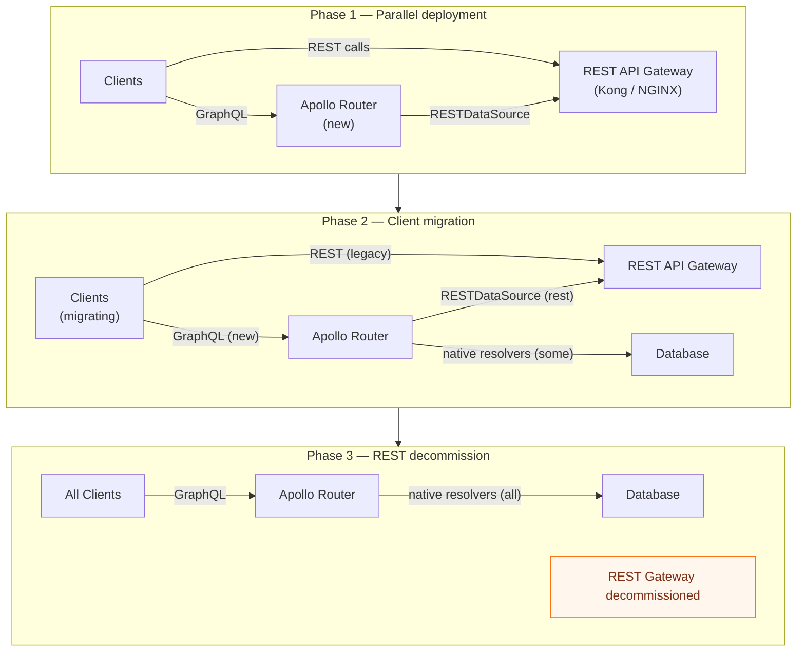

# 04 — Migration Patterns: REST Gateway to GraphQL Federation

> Migrating from a REST API gateway topology to GraphQL Federation does not require a big-bang rewrite. The strangler fig pattern — putting GraphQL in front of existing REST backends and gradually replacing REST-backed resolvers with native subgraph implementations — is the recommended approach for production systems. This chapter covers the strangler fig pattern in detail, using RESTDataSource in Federation subgraphs to wrap existing endpoints, using the Federation layer as a Backend for Frontend (BFF), incremental client adoption with field deprecation, and the operational playbook for migrating without downtime.

---

## Learning Objectives

- [ ] Implement the strangler fig pattern: stand up a GraphQL Federation layer in front of existing REST APIs
- [ ] Use `RESTDataSource` in a Federation subgraph to proxy existing REST endpoints as GraphQL resolvers
- [ ] Design a BFF (Backend for Frontend) using Apollo Federation that aggregates multiple REST backends
- [ ] Deprecate REST endpoints incrementally while GraphQL adoption grows
- [ ] Apply GraphQL field deprecation directives to guide client migration from old to new operations

---

## Overview

The strangler fig pattern, coined by Martin Fowler, describes a migration approach where a new system grows around the old system, gradually replacing it while both run in parallel. The old system is not immediately decommissioned — it is "strangled" as the new system absorbs its responsibilities one feature at a time.

For a REST API gateway migration to GraphQL Federation:

1. **Deploy the Federation layer** (Apollo Router + initial subgraphs) alongside the existing REST API gateway. Both accept traffic.
2. **Wrap existing REST endpoints** using `RESTDataSource` in subgraph resolvers. The GraphQL layer delegates to REST internally.
3. **Migrate clients** from REST to GraphQL operations, operation by operation.
4. **Replace REST-backed resolvers** with native database resolvers as capacity allows, operation by operation.
5. **Decommission the REST gateway** when no clients call it directly.

At no point is there a "cutover" with a window of unavailability. The migration is entirely incremental.



---

## Phase 1: Strangler Fig Setup

### REST API Inventory

Before building subgraphs, map the existing REST API to GraphQL concepts. This mapping drives the initial schema design:

```
REST Endpoint                     GraphQL Mapping
─────────────────────────────     ────────────────────────────────────────
GET  /products                 → Query.products: [Product!]!
GET  /products/:id             → Query.product(id: ID!): Product
POST /products                 → Mutation.createProduct(input: ...): Product
PUT  /products/:id             → Mutation.updateProduct(id: ID!, ...): Product
DELETE /products/:id           → Mutation.deleteProduct(id: ID!): Boolean

GET  /users/:id                → Query.user(id: ID!): User
GET  /users/:id/orders         → User.orders: [Order!]!
POST /orders                   → Mutation.createOrder(input: ...): Order

GET  /orders/:id               → Query.order(id: ID!): Order
PUT  /orders/:id/status        → Mutation.updateOrderStatus(id: ID!, status: OrderStatus!): Order
```

### Initial Schema Design (Schema-First)

```graphql
# products-subgraph/schema.graphql
# Initial schema — backed by REST, will be replaced with native resolvers over time

type Product @key(fields: "id") {
  id: ID!
  name: String!
  description: String
  price: Money!
  sku: String!
  categoryId: ID!
  status: ProductStatus!
  createdAt: DateTime!
  updatedAt: DateTime!
}

enum ProductStatus {
  ACTIVE
  INACTIVE
  DISCONTINUED
}

type Money {
  amount: Float!
  currency: String!
}

input CreateProductInput {
  name: String!
  description: String
  price: MoneyInput!
  sku: String!
  categoryId: ID!
}

input UpdateProductInput {
  name: String
  description: String
  price: MoneyInput
  status: ProductStatus
}

type Query {
  products(
    first: Int
    after: String
    status: ProductStatus
    categoryId: ID
  ): ProductConnection!
  product(id: ID!): Product
}

type Mutation {
  createProduct(input: CreateProductInput!): Product!
  updateProduct(id: ID!, input: UpdateProductInput!): Product!
  deleteProduct(id: ID!): Boolean!
}
```

---

## Using RESTDataSource in Federation Subgraphs

`RESTDataSource` is Apollo's class for making HTTP requests to REST backends from within a GraphQL subgraph. It provides automatic request deduplication, in-memory caching, and a clean interface for defining REST API calls.

### Products Subgraph with RESTDataSource

```typescript
// src/subgraphs/products/datasources/ProductsRestApi.ts
import { RESTDataSource, type RequestOptions } from '@apollo/datasource-rest';
import type { Product, ProductConnection, CreateProductInput, UpdateProductInput } from '../types';

export class ProductsRestApi extends RESTDataSource {
  // The base URL of the existing REST API (behind Kong or directly accessible)
  override baseURL = process.env.PRODUCTS_REST_API_URL!;

  // Shared request interceptor: add authentication headers
  override willSendRequest(_path: string, request: RequestOptions) {
    request.headers['Authorization'] = `Bearer ${process.env.INTERNAL_SERVICE_TOKEN}`;
    request.headers['X-Service-Name'] = 'products-subgraph';
    request.headers['Accept'] = 'application/json';
  }

  async getProduct(id: string): Promise<Product | null> {
    try {
      const response = await this.get<RestProduct>(`/products/${id}`);
      return this.transformProduct(response);
    } catch (error) {
      if (error instanceof Error && 'extensions' in error) {
        // Apollo RESTDataSource throws on non-2xx — check for 404
        const apolloError = error as { extensions?: { response?: { status: number } } };
        if (apolloError.extensions?.response?.status === 404) return null;
      }
      throw error;
    }
  }

  async getProducts(args: {
    first?: number;
    after?: string;
    status?: string;
    categoryId?: string;
  }): Promise<ProductConnection> {
    const params = new URLSearchParams();
    if (args.first) params.set('limit', String(args.first));
    if (args.after) params.set('cursor', args.after);
    if (args.status) params.set('status', args.status.toLowerCase());
    if (args.categoryId) params.set('category_id', args.categoryId);

    const response = await this.get<RestProductList>(`/products?${params.toString()}`);

    return {
      edges: response.items.map((item) => ({
        node: this.transformProduct(item),
        cursor: item.id,
      })),
      pageInfo: {
        hasNextPage: response.has_more,
        hasPreviousPage: false,
        startCursor: response.items[0]?.id ?? null,
        endCursor: response.items[response.items.length - 1]?.id ?? null,
      },
      totalCount: response.total,
    };
  }

  async createProduct(input: CreateProductInput): Promise<Product> {
    const response = await this.post<RestProduct>('/products', {
      body: {
        name: input.name,
        description: input.description,
        price: {
          amount: input.price.amount,
          currency: input.price.currency,
        },
        sku: input.sku,
        category_id: input.categoryId, // REST API uses snake_case
      },
    });
    return this.transformProduct(response);
  }

  async updateProduct(id: string, input: UpdateProductInput): Promise<Product> {
    const body: Record<string, unknown> = {};
    if (input.name !== undefined) body.name = input.name;
    if (input.description !== undefined) body.description = input.description;
    if (input.price !== undefined) body.price = input.price;
    if (input.status !== undefined) body.status = input.status.toLowerCase();

    const response = await this.patch<RestProduct>(`/products/${id}`, { body });
    return this.transformProduct(response);
  }

  async deleteProduct(id: string): Promise<boolean> {
    await this.delete(`/products/${id}`);
    return true;
  }

  // Transform REST snake_case format to GraphQL camelCase
  private transformProduct(rest: RestProduct): Product {
    return {
      id: rest.id,
      name: rest.name,
      description: rest.description ?? null,
      price: {
        amount: rest.price.amount,
        currency: rest.price.currency,
      },
      sku: rest.sku,
      categoryId: rest.category_id,
      status: rest.status.toUpperCase() as ProductStatus,
      createdAt: rest.created_at,
      updatedAt: rest.updated_at,
    };
  }
}

// REST API response types (snake_case)
interface RestProduct {
  id: string;
  name: string;
  description?: string;
  price: { amount: number; currency: string };
  sku: string;
  category_id: string;
  status: string;
  created_at: string;
  updated_at: string;
}

interface RestProductList {
  items: RestProduct[];
  total: number;
  has_more: boolean;
}
```

### Subgraph Server Setup

```typescript
// src/subgraphs/products/server.ts
import { ApolloServer } from '@apollo/server';
import { buildSubgraphSchema } from '@apollo/subgraph';
import { startStandaloneServer } from '@apollo/server/standalone';
import { readFileSync } from 'fs';
import gql from 'graphql-tag';
import { resolvers } from './resolvers';
import { ProductsRestApi } from './datasources/ProductsRestApi';

const typeDefs = gql(readFileSync('./schema.graphql', 'utf-8'));

const server = new ApolloServer({
  schema: buildSubgraphSchema({ typeDefs, resolvers }),
});

const { url } = await startStandaloneServer(server, {
  context: async () => ({
    dataSources: {
      productsApi: new ProductsRestApi(),
    },
  }),
  listen: { port: 4001 },
});

console.log(`Products subgraph ready at ${url}`);
```

```typescript
// src/subgraphs/products/resolvers.ts
import type { Resolvers } from './__generated__/resolvers';
import type { ProductsContext } from './context';

export const resolvers: Resolvers<ProductsContext> = {
  Query: {
    product: (_, args, ctx) => ctx.dataSources.productsApi.getProduct(args.id),
    products: (_, args, ctx) => ctx.dataSources.productsApi.getProducts(args),
  },

  Mutation: {
    createProduct: (_, args, ctx) => ctx.dataSources.productsApi.createProduct(args.input),
    updateProduct: (_, args, ctx) => ctx.dataSources.productsApi.updateProduct(args.id, args.input),
    deleteProduct: (_, args, ctx) => ctx.dataSources.productsApi.deleteProduct(args.id),
  },

  Product: {
    // Federation: resolve entity references from other subgraphs
    __resolveReference: (reference, ctx) => ctx.dataSources.productsApi.getProduct(reference.id),
  },
};
```

---

## GraphQL Federation as a BFF (Backend for Frontend)

A BFF aggregates data from multiple backend services and shapes it for a specific client's needs. Apollo Federation is an excellent foundation for a BFF — the router handles the aggregation (query planning), and subgraphs represent individual backend services.

The key difference from a traditional BFF is that the aggregation is declarative (GraphQL schema) rather than imperative (custom aggregation code). Teams add new backends by adding new subgraphs and extending existing types — without modifying the BFF's aggregation logic.

```typescript
// users-subgraph: wraps the Users REST API and extends Order
// src/subgraphs/users/schema.graphql

type User @key(fields: "id") {
  id: ID!
  name: String!
  email: String!
  phone: String
  address: Address
}

type Address {
  street: String!
  city: String!
  country: String!
  postalCode: String!
}

# BFF-style extension: add user data to orders from the Orders subgraph
# Orders subgraph doesn't need to know about Users
extend type Order @key(fields: "id") {
  id: ID! @external
  customer: User!  # Resolved by this subgraph using Order.userId
}

type Query {
  me: User  # Current authenticated user (from X-User-Id header)
  user(id: ID!): User
}
```

```typescript
// users-subgraph/resolvers.ts
export const resolvers = {
  Query: {
    me: (_, __, ctx) => ctx.dataSources.usersApi.getUser(ctx.userId),
    user: (_, args, ctx) => ctx.dataSources.usersApi.getUser(args.id),
  },

  User: {
    __resolveReference: (ref, ctx) => ctx.dataSources.usersApi.getUser(ref.id),
  },

  Order: {
    // When another subgraph (Orders) contributes an Order and needs the customer,
    // the router calls this resolver to extend the Order type with customer data
    customer: async (order: { id: string }, _, ctx) => {
      // Fetch the userId from the Orders REST API, then fetch the user
      const orderDetail = await ctx.dataSources.ordersApi.getOrder(order.id);
      return ctx.dataSources.usersApi.getUser(orderDetail.userId);
    },
  },
};
```

### Client-Specific Query Shaping

BFF patterns often involve query shaping per client type. In GraphQL Federation, this is achieved through client-side query composition rather than server-side BFF logic:

```graphql
# Mobile app query — minimal fields, optimized for bandwidth
query MobileOrderList {
  me {
    orders(first: 10) {
      edges {
        node {
          id
          total { amount currency }
          status
        }
      }
    }
  }
}

# Dashboard query — full detail, cross-service data
query DashboardOrderDetail($orderId: ID!) {
  order(id: $orderId) {
    id
    total { amount currency }
    status
    customer {      # Resolved by Users subgraph
      name
      email
    }
    lineItems {
      product {    # Resolved by Products subgraph
        name
        price { amount }
      }
      quantity
    }
    shipments {   # Resolved by Shipping subgraph
      trackingNumber
      estimatedDelivery
      status
    }
  }
}
```

Both queries go through the same Apollo Router. The router builds different query plans based on what each query actually requests. Mobile clients pay only for the fields they request; the BFF pattern emerges from the schema design, not custom server logic.

---

## Incremental Client Adoption

### Running REST and GraphQL in Parallel

During migration, both REST and GraphQL endpoints must serve the same data. The REST API remains the source of truth until all clients have migrated.

```yaml
# Kong declarative config: both REST gateway and GraphQL endpoint active simultaneously
services:
  # Original REST backend
  - name: products-rest-api
    url: http://products-service.internal:3000
    routes:
      - name: products-rest
        paths:
          - /api/v1/products
        methods: [GET, POST, PUT, DELETE]

  # New GraphQL Federation endpoint
  - name: apollo-router
    url: http://apollo-router.graphql.svc.cluster.local:4000
    routes:
      - name: graphql-api
        paths:
          - /graphql
        methods: [GET, POST]
```

### GraphQL Field Deprecation

As clients migrate to GraphQL, deprecated REST-mapping fields in the schema guide engineers toward the preferred patterns:

```graphql
type Query {
  # DEPRECATED: Legacy field that maps directly to GET /products/:id
  # Use product(id: ID!) instead — same data, follows federation conventions
  getProductById(productId: String!): Product
    @deprecated(reason: "Use product(id: ID!) — will be removed 2025-Q3")

  # Preferred: standard GraphQL field naming
  product(id: ID!): Product

  # DEPRECATED: Returns untyped JSON — poor type safety
  productData(id: String!): JSON
    @deprecated(reason: "Use product(id: ID!) with explicit fields")

  # DEPRECATED: Inconsistent naming from REST migration
  list_products: [Product!]!
    @deprecated(reason: "Use products(first: Int, after: String) — pagination added")

  # Preferred: paginated list
  products(first: Int, after: String, status: ProductStatus): ProductConnection!
}
```

### Client Migration Tracking

Track client migration progress by monitoring field usage in Apollo Studio:

```typescript
// apollo-studio-metrics.ts — custom field usage tracking
// Apollo Studio automatically tracks @deprecated field usage in the schema

// In Apollo Router router.yaml — enable field usage reporting to Studio
telemetry:
  apollo:
    field_level_instrumentation_sampler: always_on
    # Field usage is reported to Apollo Studio, where you can see
    # which deprecated fields are still being called and by which clients
    send_headers:
      named:
        - x-client-name
        - x-client-version
```

In Apollo Studio, the **Schema** tab shows field usage percentages. Fields with 0% usage over the past 30 days are safe to remove. Deprecated fields with active usage show which client versions are still calling them.

---

## Replacing REST-Backed Resolvers with Native Resolvers

### The Replacement Strategy

RESTDataSource resolvers are a bridge — correct behavior, but higher latency than native database resolvers (one extra HTTP hop to the REST API). Over time, replace them:

```typescript
// Before: REST-backed resolver (RESTDataSource)
export const Query = {
  product: async (_: unknown, args: { id: string }, ctx: Context) => {
    // Makes an HTTP call to the existing REST API
    return ctx.dataSources.productsApi.getProduct(args.id);
  },
};

// After: Native database resolver (DataLoader + PostgreSQL)
export const Query = {
  product: async (_: unknown, args: { id: string }, ctx: Context) => {
    // Direct database query — no extra HTTP hop
    return ctx.loaders.product.load(args.id);
  },
};
```

### Migration Readiness Checklist

Before replacing a REST-backed resolver with a native one:

- [ ] The subgraph owns the database table (or a dedicated read replica)
- [ ] Integration tests cover the resolver's behavior independent of the REST API
- [ ] DataLoader is implemented for batch loading
- [ ] The REST API endpoint has been audited for business logic that must be replicated
- [ ] Cache invalidation is updated to target the subgraph's database directly
- [ ] Monitoring shows the native resolver's latency and error rate match or improve on the REST API

### Canary Replacement

Use a feature flag to gradually shift traffic from REST-backed to native:

```typescript
// Canary resolver — gradually shift to native
export const Query = {
  product: async (_: unknown, args: { id: string }, ctx: Context) => {
    const useNativeResolver = await ctx.featureFlags.get(
      'products-subgraph.native-resolver',
      { defaultValue: 0, rollout: 10 } // 10% → native, 90% → REST
    );

    if (useNativeResolver) {
      return ctx.loaders.product.load(args.id);
    }

    return ctx.dataSources.productsApi.getProduct(args.id);
  },
};
```

---

## REST Gateway Decommission Playbook

### Step 1: Verify Zero REST Traffic

Before decommissioning, confirm no clients are calling REST endpoints directly:

```bash
# Check Kong access logs for direct REST calls
kubectl logs -n kong deployment/kong --since=7d | grep "GET /api/v1/products" | wc -l
# Target: 0 (or only internal health checks)

# Check application metrics in Prometheus
kubectl exec -it prometheus-0 -- curl "localhost:9090/api/v1/query?query=kong_http_requests_total{route='products-rest'}"
# Target: rate approaching 0
```

### Step 2: Remove REST Routes from Kong

```bash
# Declarative: remove REST routes from kong.yaml, apply via deck
deck sync --config kong.yaml

# Or imperative (emergency decommission):
curl -X DELETE http://kong-admin:8001/routes/products-rest
curl -X DELETE http://kong-admin:8001/services/products-rest-api
```

### Step 3: Verify GraphQL Coverage

Confirm all previously REST-served operations are available and tested in GraphQL:

```typescript
// tests/integration/rest-to-graphql-parity.test.ts
// Verify that all REST operations have GraphQL equivalents
// Run this before and after decommission to confirm parity

describe('REST API parity', () => {
  it('product detail (GET /api/v1/products/:id → Query.product)', async () => {
    const { data } = await apolloClient.query({
      query: gql`query { product(id: "prod-123") { id name price { amount } } }`,
    });
    expect(data.product.id).toBe('prod-123');
  });

  it('create product (POST /api/v1/products → Mutation.createProduct)', async () => {
    const { data } = await apolloClient.mutate({
      mutation: gql`mutation CreateProduct($input: CreateProductInput!) {
        createProduct(input: $input) { id name }
      }`,
      variables: { input: { name: 'Test Product', price: { amount: 9.99, currency: 'USD' }, sku: 'TST-001', categoryId: 'cat-1' } },
    });
    expect(data.createProduct.name).toBe('Test Product');
  });

  // ... coverage for all former REST endpoints
});
```

---

## Common Migration Pitfalls

### Pitfall 1: N+1 in REST-Backed Resolvers

When migrating REST endpoints to GraphQL, N+1 patterns are common if DataLoader is not used:

```typescript
// WRONG: REST-backed resolver without DataLoader (N+1)
Product: {
  category: async (product, _, ctx) => {
    // Makes one HTTP call per product — N+1 if products is a list
    return ctx.dataSources.categoriesApi.getCategory(product.categoryId);
  },
}

// RIGHT: DataLoader batches multiple category fetches into one REST call
// Implement a DataLoader-compatible RESTDataSource:
const categoryLoader = new DataLoader<string, Category>(async (ids) => {
  // REST API supports bulk fetch: GET /categories?ids=cat-1,cat-2,cat-3
  const categories = await ctx.dataSources.categoriesApi.getCategories(ids as string[]);
  return ids.map((id) => categories.find((c) => c.id === id) ?? null);
});
```

### Pitfall 2: Exposing REST Pagination as GraphQL Arrays

REST APIs often return offset-based pagination. Exposing this directly as a GraphQL field (returning an array with a `total` count) breaks Relay-compatible cursors and makes it difficult to add pagination later:

```graphql
# WRONG: non-standard pagination
type Query {
  products(page: Int!, pageSize: Int!): ProductList!
}

type ProductList {
  items: [Product!]!
  total: Int!
  page: Int!
}

# RIGHT: Relay-compatible cursor pagination
type Query {
  products(first: Int, after: String, last: Int, before: String): ProductConnection!
}

type ProductConnection {
  edges: [ProductEdge!]!
  pageInfo: PageInfo!
  totalCount: Int!
}
```

### Pitfall 3: Leaking REST Error Formats

REST APIs return HTTP error codes and error bodies that don't map cleanly to GraphQL errors. Always transform REST errors to GraphQL error format in the RESTDataSource:

```typescript
// In RESTDataSource: transform REST errors to GraphQL errors
protected override async errorFromResponse(response: Response): Promise<Error> {
  const body = await response.json() as { error?: string; message?: string };

  const message = body.error ?? body.message ?? `HTTP ${response.status}`;

  // Map REST status codes to GraphQL error codes
  const code = {
    401: 'UNAUTHENTICATED',
    403: 'FORBIDDEN',
    404: 'NOT_FOUND',
    422: 'BAD_USER_INPUT',
    429: 'RATE_LIMITED',
  }[response.status] ?? 'INTERNAL_SERVER_ERROR';

  const error = new GraphQLError(message, {
    extensions: {
      code,
      http: { status: response.status },
    },
  });

  return error;
}
```

---

## References

- [Martin Fowler: Strangler Fig Application](https://martinfowler.com/bliki/StranglerFigApplication.html) — Original description of the strangler fig pattern
- [Apollo RESTDataSource](https://www.apollographql.com/docs/apollo-server/data/fetching-rest/) — Official documentation for `RESTDataSource` including caching and request deduplication
- [Apollo Federation Migration Guide](https://www.apollographql.com/docs/federation/migrating-from-stitching/) — Migration from schema stitching and REST-backed APIs

---

## Related Topics

- [02-kong-integration.md](./02-kong-integration.md) — Kong configuration during the parallel deployment phase
- [03-aws-appsync-vs-federation.md](./03-aws-appsync-vs-federation.md) — AppSync-specific migration path
- [../07-federation/](../07-federation/) — Apollo Federation architecture and `@key` entity definitions
- [../04-resolvers-and-execution/](../04-resolvers-and-execution/) — DataLoader implementation for replacing REST batches with native database queries
- [../17-caching-strategies/03-resolver-caching.md](../17-caching-strategies/03-resolver-caching.md) — Caching native resolvers after replacing RESTDataSource
