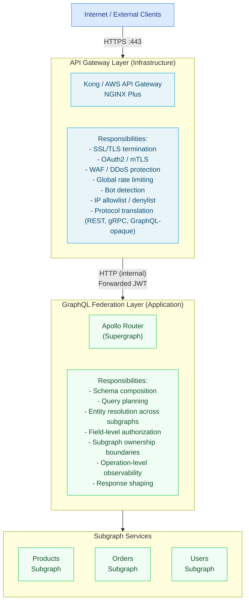

# 18 — API Gateway vs. GraphQL Federation

> API gateways and GraphQL federation are often positioned as competing solutions, but this is a false dichotomy. They solve different problems at different layers of the infrastructure stack. An API gateway handles infrastructure plumbing — SSL termination, WAF, rate limiting, OAuth2 token exchange, routing, and protocol translation. GraphQL federation handles developer experience and data composition — schema stitching, query planning, entity resolution, field-level authorization, and subgraph ownership. This section frames the decision clearly, covers the dominant enterprise combination patterns (Kong + Apollo Router, AWS AppSync in context), and provides concrete migration guidance for teams moving from REST gateway patterns to GraphQL federation.

---

## Contents

| # | File | Topic |
|---|------|-------|
| 01 | [01-comparison.md](./01-comparison.md) | Structured comparison of API gateway vs. federation responsibilities, decision matrix, and anti-patterns |
| 02 | [02-kong-integration.md](./02-kong-integration.md) | Kong as edge layer with Apollo Router behind it: JWT forwarding, operation-level rate limiting, gRPC vs. GraphQL |
| 03 | [03-aws-appsync-vs-federation.md](./03-aws-appsync-vs-federation.md) | AWS AppSync managed features vs. Apollo Federation self-hosted: trade-offs, migration path, hybrid patterns |
| 04 | [04-migration-patterns.md](./04-migration-patterns.md) | Strangler fig pattern, REST DataSource in subgraphs, BFF layer, incremental client adoption |

---

## The Core Distinction

The confusion between API gateways and GraphQL federation arises because they share surface-level vocabulary — both "route" requests, both can "auth" requests, both can "rate limit." But they operate at completely different abstraction levels:



The gateway layer does not need to understand GraphQL. It treats the traffic as opaque HTTP. The federation layer does need to understand GraphQL — it parses the document, builds a query plan, orchestrates subgraph fetches, and merges responses. These are distinct concerns, and combining them in one layer creates operational problems (the gateway team now owns query planning; the GraphQL team now owns rate limiting infrastructure).

---

## Why They Are Complementary

A common enterprise question: "We already have Kong. Do we still need Apollo Router?"

Yes. Here is why:

**Kong cannot:**
- Parse a GraphQL document to determine its operation type, operation name, or fields
- Build a query plan to federate data across microservices
- Resolve `@key`-based entity references across subgraph boundaries
- Apply field-level authorization rules that depend on the schema shape
- Aggregate partial responses from 5 subgraphs into a single JSON response

**Apollo Router cannot (or should not):**
- Terminate TLS from the public internet at scale
- Run WAF rules against inbound traffic (OWASP Top 10)
- Perform OAuth2 token exchange with external identity providers
- Apply IP-based allow/denylists across all API traffic (not just GraphQL)
- Integrate with API monetization / billing systems
- Enforce global rate limits shared across all API products

Both are necessary. Neither replaces the other.

---

## Common Enterprise Patterns

### Pattern 1: Kong at the Edge, Apollo Router Inside

```
Internet → Kong Gateway → Apollo Router → Subgraphs
```

Kong handles all infrastructure concerns. Apollo Router handles GraphQL. This is the most common enterprise pattern for organizations with a mature API platform team that already manages Kong.

See: [02-kong-integration.md](./02-kong-integration.md)

### Pattern 2: AWS API Gateway + Apollo Router on EKS

```
Internet → AWS API Gateway → ALB → Apollo Router (EKS) → Subgraphs (EKS)
```

AWS API Gateway provides the AWS-native edge (WAF, CloudFront integration, usage plans, API keys). Apollo Router runs on Kubernetes inside the VPC. Common in AWS-centric organizations that want managed edge infrastructure without running Kong.

### Pattern 3: Nginx / Envoy as Edge, Apollo Router as Application Layer

```
Internet → Nginx/Envoy → Apollo Router → Subgraphs
```

Lower-overhead option for organizations that don't need the plugin ecosystem of Kong or the managed features of AWS API Gateway. Nginx handles SSL and basic routing; Apollo Router handles all GraphQL concerns.

### Pattern 4: AWS AppSync (Managed GraphQL, No Federation)

```
Internet → AWS AppSync → DynamoDB / Lambda / RDS
```

Fully managed GraphQL — no Kong, no Apollo Router. Appropriate for smaller backends with simple data access patterns and no cross-service entity resolution. Significant limitations at enterprise scale.

See: [03-aws-appsync-vs-federation.md](./03-aws-appsync-vs-federation.md)

### Pattern 5: Hybrid (AppSync for Mobile, Federation for Backend)

```
Mobile clients → AWS AppSync → Lambda resolvers
Internal/Partner clients → Kong → Apollo Router → Subgraphs
```

AppSync serves mobile clients with Cognito auth and offline sync. Apollo Federation serves internal microservices and B2B API partners with complex data access patterns.

See: [03-aws-appsync-vs-federation.md](./03-aws-appsync-vs-federation.md)

---

## Decision Framework

Use this decision framework to determine your architecture:

```
1. Do you have an existing API platform with Kong, NGINX Plus, or AWS API Gateway?
   YES → Put that at the edge. Put Apollo Router behind it.
   NO  → You can use Apollo Router directly exposed behind a load balancer.
         Add an API gateway later when you need WAF, API monetization, or multi-protocol support.

2. Is your backend a single service or a collection of microservices?
   Single service → Consider Apollo Server standalone (no federation needed).
   Multiple services → Apollo Federation (Router + Subgraphs).

3. Do you need cross-service entity relationships (User referenced by Orders and Reviews)?
   YES → Apollo Federation is required. No API gateway can do entity resolution.
   NO  → Simpler alternatives may suffice (API gateway with proxied REST endpoints).

4. Are you on AWS and prefer managed services?
   YES → Evaluate AppSync. If you need cross-service entity resolution or complex resolvers: Federation.
   NO  → Self-hosted Apollo Router on Kubernetes.

5. Do your clients need real-time subscriptions?
   YES with AWS → AppSync (managed WebSocket) or Apollo Router with subscriptions.
   YES self-hosted → Apollo Router with Redis pub/sub subscription support.
   NO → Not a differentiating factor.
```

---

## Prerequisites

Before working through this section, ensure familiarity with:

- Apollo Federation architecture (router, subgraphs, supergraph) — see [07-federation](../07-federation/)
- Apollo Router configuration fundamentals — see [08-supergraph-architecture](../08-supergraph-architecture/)
- HTTP authentication patterns (JWT, OAuth2, mTLS)
- Basic Kubernetes networking (Services, Ingress, LoadBalancer)
- AWS API Gateway concepts (if relevant to your deployment)

---

## Related Topics

- [07-federation](../07-federation/) — Apollo Federation architecture that sits behind the API gateway
- [05-security](../05-security/) — Authentication, authorization, and WAF integration patterns
- [15-kubernetes-deployment](../15-kubernetes-deployment/) — Deploying Apollo Router on Kubernetes with a gateway in front
- [17-caching-strategies](../17-caching-strategies/) — How caching interacts with the gateway-federation boundary
- [14-observability](../14-observability/) — Distributed tracing across the gateway and federation layers
