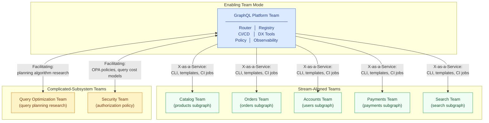
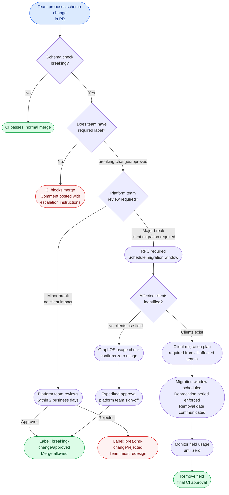

# 01 — Platform Team Model

> **Purpose:** A GraphQL platform team that lacks a clear model operates as a ticket queue
> rather than an enabling team. This document defines the team topology, ownership boundaries,
> charter commitments, RFC governance process, and feedback loops that transform a platform
> team into an internal product organization with measurable impact on engineering velocity.
> Every decision in this document is derived from the principle that the platform team exists
> to reduce cognitive load on product teams, not to gatekeep infrastructure.

---

## Team Topology

The Team Topologies model (Skelton & Pais, 2019) provides the most precise vocabulary for
describing how a platform team relates to the rest of engineering. A GraphQL platform team
is an **enabling team** with platform characteristics:

- It builds and operates a **platform** (the supergraph infrastructure) that other teams
  consume as a service
- It **enables** stream-aligned teams by reducing the cognitive load of GraphQL operations
- It interacts with product teams through **X-as-a-Service** (the scaffold CLI, CI templates,
  monitoring dashboards) rather than through collaboration on every subgraph



### Sizing the Platform Team

A common failure mode is understaffing the platform team relative to the number of
subgraph teams it serves. A useful ratio: one platform engineer for every four to six
subgraph teams, with a minimum platform team size of three engineers regardless of how few
subgraph teams exist (to avoid single-point-of-knowledge problems and maintain an on-call
rotation).

| Subgraph Teams | Recommended Platform Team Size |
|---|---|
| 1–4 | 3 engineers |
| 5–10 | 3–4 engineers |
| 11–20 | 4–5 engineers |
| 21–40 | 5–7 engineers |
| 40+ | 7+ engineers, consider sub-teams |

Beyond forty subgraph teams, consider splitting the platform team into a **core platform
team** (router, registry, policy) and a **developer experience team** (CLI, onboarding,
documentation, metrics) that each operate as distinct products.

---

## Ownership Boundaries

Ownership ambiguity is the most common source of friction between platform and product teams.
The following matrix resolves every major ownership question for a federation platform.

### Platform Team Owns

**Router infrastructure:**
The router binary version, upgrade cadence, and security patching. Router configuration
that affects the entire supergraph (CORS headers, authentication plugins, rate limiting
defaults, subgraph timeout policies). Router Kubernetes Deployment manifests, HPA
configuration, and PodDisruptionBudget.

**Schema registry:**
The GraphOS organization or equivalent schema registry account. Access control (who can
publish schemas). Composition configuration (which subgraphs compose the supergraph).
The schema check CI action definition.

**CI template library:**
The reusable GitHub Actions workflows in the `.github` shared repository. The conftest
and OPA policy bundle. The Rover CLI version pinned in CI. The schema lint configuration.

**Observability infrastructure:**
The OpenTelemetry Collector deployment. The Prometheus scrape configuration for router
and all subgraphs. The Grafana dashboard templates for the router and per-subgraph health.
The SLO recording rules and default alerting rules.

**Developer tooling:**
The `graphql-platform` CLI. The Backstage software template. The local development
`docker-compose.yaml` for the supergraph. The schema mocking library wrapper.

### Product Team Owns

**Subgraph schema (SDL):**
The type definitions, field names, directives, and federation annotations. The product
team is responsible for schema quality, documentation completeness, and deprecation
lifecycle management for their fields.

**Subgraph implementation:**
All resolver code, data loaders, business logic, and integration with upstream services.
The product team selects their language and framework within the constraints the platform
enforces (must expose a GraphQL endpoint, must implement health check routes).

**Subgraph deployment values:**
The `values.yaml` for their Helm chart — the container image, environment variable names
(not secrets), replica count requests, resource limit requests. The platform team reviews
requests that exceed cluster quotas.

**Subgraph on-call:**
Primary responsibility for resolver errors, timeout escalations, and data quality issues.
The platform team is on-call for router and registry failures; product teams are on-call
for their own subgraph's error rates.

---

## The GraphQL Platform Charter

A charter makes implicit commitments explicit and creates accountability. The following
charter template reflects the minimum commitments a mature platform team should publish.

### Reliability SLOs

```
Service: Apollo Router (production)
  Availability:    99.9% (≤ 8.7 hours downtime per year)
  p99 latency:     ≤ 200ms for query planning + routing overhead
  Measurement:     Monthly, reported in #platform-health Slack channel

Service: Schema Registry (composition + publish)
  Availability:    99.5% (≤ 43.8 hours downtime per year)
  Schema publish:  ≤ 30 seconds from rover publish to supergraph update
  Measurement:     Monthly, reported in #platform-health Slack channel

Service: CI Schema Check
  P99 completion:  ≤ 60 seconds from PR open to schema check result
  False positive:  ≤ 1% of schema checks blocked due to platform issues
  Measurement:     Weekly, tracked in platform CI metrics dashboard
```

### Schema Stability Guarantees

```
Breaking change notification: 30-day minimum notice before a field is removed from
  the supergraph SDL that was previously exposed to clients. Measured from when the
  @deprecated directive is applied to when removal is permitted in CI.

Composition stability: Any schema that passed composition check at time of merge
  will continue to compose for 14 days after the merge, giving dependent teams
  time to adapt before router hot-reload picks up the change.

Registry uptime during deploy: Schema check and publish will not be disrupted
  by router binary upgrades or router configuration updates.
```

### Developer Experience SLAs

```
Schema check result:          ≤ 30 seconds
New subgraph scaffold:        ≤ 5 minutes from CLI command to first CI run
Namespace provisioning:       ≤ 10 minutes from scaffold to Kubernetes namespace ready
Onboarding documentation:     Updated within 5 business days of any platform change
Platform team response:       ≤ 4 hours for P1 issues, ≤ 2 business days for P2
```

---

## Escalation Paths for Schema Breaking Changes

Breaking changes are inevitable. The escalation path determines whether they are handled
cleanly or cause production incidents.



### Breaking Change Severity Tiers

| Tier | Examples | Process | Timeline |
|---|---|---|---|
| T1 — No client impact | Remove field with zero usage (GraphOS confirmed) | Platform review, 2-day SLA | Can deploy same sprint |
| T2 — Additive with coordination | Rename type requires client coordination, aliases available | RFC + 30-day notice | 4-6 week window |
| T3 — Breaking with migration | Remove non-nullable field used by multiple clients | RFC + client migration plans + monitoring | 8-12 week window |
| T4 — Supergraph restructure | Federated entity key change, cross-subgraph type merge | Architecture review + RFC + phased rollout | 3-6 month window |

---

## RFC Process for Supergraph-Wide Changes

The RFC (Request for Comments) process gates changes that affect the entire supergraph,
not just one subgraph. An RFC is required when:

- Adding or removing a subgraph from the supergraph composition
- Changing a shared type used by multiple subgraphs (federation `@key` fields, shared interfaces)
- Modifying platform-wide policy (OPA policy changes, CI gate changes)
- Upgrading Apollo Router major version
- Changing the schema registry vendor or migration between registry products
- Any change that affects more than two subgraph teams' CI pipelines

### RFC Template

```markdown
# RFC: [Short Title]

**Status:** Draft | Under Review | Approved | Rejected | Superseded
**Author(s):** [name, team]
**Created:** [date]
**Review Deadline:** [date — 10 business days from creation]
**Affected Teams:** [list all subgraph teams affected]

## Problem Statement
What problem does this change solve? Why is the status quo insufficient?

## Proposed Solution
Describe the change in enough detail that an engineer unfamiliar with the codebase
can understand exactly what will be different after the change is implemented.

## Alternatives Considered
What other solutions were evaluated? Why were they not chosen?

## Impact Assessment

### Breaking changes
Will this change require any subgraph team to modify their schema or code?
If yes, list affected teams and required changes.

### Performance impact
Will this change affect router query planning time, latency, or throughput?
Provide benchmark data or reasoning.

### Rollback plan
How is this change reverted if it causes a production incident?

## Migration Plan
For changes that require product teams to take action:
- Step-by-step instructions for each affected team
- Deadline for migration completion
- What happens to teams that miss the deadline

## Open Questions
Unresolved questions that reviewers should address in comments.

## Decision
[Filled in by platform team after review period]
```

### RFC Review Timeline

```
Day 0:    RFC posted to #platform-rfcs Slack channel + linked in PR
Day 1–5:  Comment period — all affected teams review and post feedback
Day 5:    Platform team synchronous review meeting (if needed)
Day 10:   Review deadline — RFC is either approved, rejected, or extended
Day 10+:  Approved RFCs move to implementation queue
```

---

## Internal Customer Model and Feedback Loops

A platform team that does not measure developer experience will optimize for metrics
that do not reflect actual customer satisfaction. The following feedback loops close
the gap between what the platform team builds and what product teams need.

### Quarterly Developer Experience Survey

Sent to all subgraph team leads, measuring:

| Dimension | Example Questions | Target Score |
|---|---|---|
| Schema governance | "CI feedback is actionable without reading platform docs" | ≥ 4.0 / 5.0 |
| Self-service | "I can provision a new subgraph without filing a ticket" | ≥ 4.5 / 5.0 |
| Local development | "My local supergraph reflects production within one command" | ≥ 4.0 / 5.0 |
| Incident support | "Platform team responds quickly when I'm blocked" | ≥ 4.5 / 5.0 |
| Documentation | "Platform docs answer my questions before I have to ask" | ≥ 3.8 / 5.0 |

Survey results are posted publicly in the engineering wiki and discussed in the quarterly
engineering all-hands. Platform team OKRs include a developer experience score target.

### Platform Office Hours

Weekly 30-minute open Zoom session where any engineer can ask questions about the platform,
propose features, or report friction. Office hours are recorded and linked in the weekly
engineering digest. Questions that surface repeatedly become roadmap items.

### Pain Point Tracking

Every time a product engineer files a platform ticket, opens a Slack thread asking for help,
or encounters a CI false positive, that interaction is tagged and aggregated. Monthly, the
platform team reviews the top five recurring pain points and assigns each one to an
upcoming sprint. This prevents the platform backlog from filling with features while
operational friction accumulates.

### Platform Roadmap Governance

The platform roadmap is public within engineering. Quarterly roadmap planning includes:

1. **Platform-initiated items** — infrastructure upgrades, reliability improvements, security
2. **Customer-requested items** — features submitted through office hours or pain point tracking
3. **RFC backlog** — approved RFCs awaiting implementation capacity

Product teams can see which of their requests are on the roadmap and what their priority is.
When a request is not prioritized, the platform team provides a written explanation. This
prevents the perception that the platform team is a black box that accepts requests and
emits silence.

---

## Platform Team Health Signals

These metrics indicate whether the platform team is functioning as an enabling team
or has drifted into a gatekeeping or infrastructure-only mode.

| Signal | Healthy | Warning | Action Required |
|---|---|---|---|
| Ticket-to-self-service ratio | < 20% of provisioning via ticket | 20–40% via ticket | Identify and automate the ticket cause |
| Time-to-first-schema-check | ≤ 10 minutes median | 10–30 minutes | Profile scaffold and CI provisioning |
| RFC review cycle time | ≤ 10 business days | 10–20 days | Add review bandwidth or streamline RFC scope |
| Platform-caused CI failures | < 1% of schema checks | 1–5% | Investigate CI false positive source |
| DX survey score | ≥ 4.0 average | 3.5–4.0 | Interview low-scoring teams to find root causes |
| On-call escalations to platform | < 5/week | 5–15/week | Improve subgraph team runbooks and tooling |
| Docs update lag | ≤ 5 business days | 5–15 days | Add docs to definition of done for all platform work |

---

## Related Topics

- [Golden Paths](./02-golden-paths.md)
- [Self-Service Infrastructure](./03-self-service-infrastructure.md)
- [Developer Experience](./04-developer-experience.md)
- [Platform Maturity Model](./05-platform-maturity-model.md)
- [Schema Governance](../09-schema-governance/README.md)
- [Policy as Code](../13-policy-as-code/README.md)

## References

- [Team Topologies — Skelton & Pais (2019)](https://teamtopologies.com/)
- [Team Cognitive Load — TeamTopologies.com](https://teamtopologies.com/key-concepts-content/what-is-team-cognitive-load)
- [CNCF Platform Engineering Maturity Model (2023)](https://tag-app-delivery.cncf.io/whitepapers/platform-eng-maturity-model/)
- [Google SRE Book — Chapter 3: Embracing Risk](https://sre.google/sre-book/embracing-risk/)
- [Accelerate — Forsgren, Humble, Kim (2018)](https://itrevolution.com/accelerate-book/)
- [The Enabling Team Pattern — Manuel Pais (2020)](https://medium.com/better-practices/the-enabling-team-pattern-for-devops-and-platform-teams-d8e3ec3e00d5)
