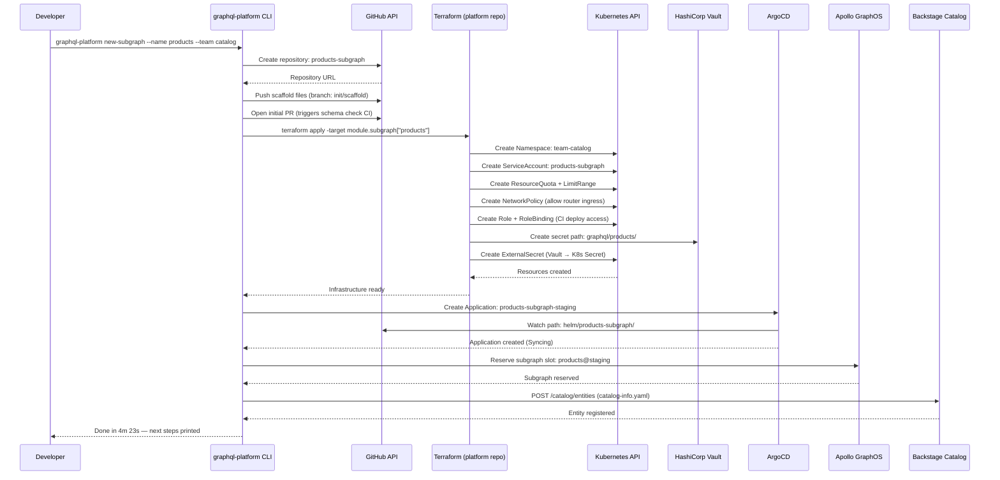

# 03 — Self-Service Infrastructure

> **Purpose:** Self-service infrastructure is the operational core of the golden path. Without
> it, a new subgraph team must file tickets for a Kubernetes namespace, a ServiceAccount, IAM
> roles, secret rotation, and an ArgoCD Application — a process that can take weeks. This
> document defines the full provisioning flow from developer action to running subgraph, the
> Terraform module that creates all required infrastructure, the Backstage catalog integration
> that makes the subgraph discoverable, and the decommission workflow that cleanly removes a
> subgraph without leaving orphaned resources.

---

## Provisioning Flow

The complete path from "developer runs the scaffold command" to "subgraph appears in GraphOS
and accepts traffic in staging" involves six systems coordinating in sequence.



### Prerequisites and Guard Rails

Before provisioning starts, the CLI validates:

| Check | Failure Action |
|---|---|
| Team name exists in Backstage catalog | Error: "Team 'catalog' not found — create it first" |
| Subgraph name not already in registry | Error: "Subgraph 'products' already registered" |
| Namespace quota available in cluster | Error: "Cluster quota exhausted — contact platform team" |
| GraphOS organization connected | Error: "APOLLO_KEY not set or invalid" |
| GitHub org membership for team | Error: "Team 'catalog' does not exist in GitHub org" |

These checks run before any infrastructure is created. They are cheap validation calls
against APIs, not infrastructure operations. Failed checks are safe to retry after fixing
the reported issue.

---

## Terraform Module

The platform team maintains a Terraform module at `terraform/modules/graphql-subgraph/`
in the central infrastructure repository. Each subgraph is instantiated as a module call.

### Module Interface

```hcl
# terraform/modules/graphql-subgraph/variables.tf
variable "subgraph_name" {
  type        = string
  description = "Subgraph name — lowercase, hyphenated (e.g., products)"
  validation {
    condition     = can(regex("^[a-z][a-z0-9-]{2,30}$", var.subgraph_name))
    error_message = "Subgraph name must be lowercase, start with a letter, 3-31 chars."
  }
}

variable "team_name" {
  type        = string
  description = "Team name matching the Backstage catalog Group entity"
}

variable "environments" {
  type        = list(string)
  description = "Environments to provision infrastructure for"
  default     = ["staging", "production"]
}

variable "resource_tier" {
  type    = string
  default = "small"
  validation {
    condition     = contains(["small", "medium", "large"], var.resource_tier)
    error_message = "resource_tier must be small, medium, or large."
  }
}

variable "github_repo" {
  type        = string
  description = "Full GitHub repository name (org/repo)"
}
```

```hcl
# terraform/modules/graphql-subgraph/locals.tf
locals {
  resource_tiers = {
    small = {
      cpu_request    = "100m"
      memory_request = "256Mi"
      cpu_limit      = "500m"
      memory_limit   = "512Mi"
      max_replicas   = 6
    }
    medium = {
      cpu_request    = "500m"
      memory_request = "1Gi"
      cpu_limit      = "1000m"
      memory_limit   = "2Gi"
      max_replicas   = 12
    }
    large = {
      cpu_request    = "1000m"
      memory_request = "2Gi"
      cpu_limit      = "2000m"
      memory_limit   = "4Gi"
      max_replicas   = 20
    }
  }

  tier = local.resource_tiers[var.resource_tier]
}
```

```hcl
# terraform/modules/graphql-subgraph/main.tf

# Kubernetes Namespace per team (not per subgraph — teams share a namespace)
resource "kubernetes_namespace" "team" {
  metadata {
    name = "team-${var.team_name}"
    labels = {
      "platform.myorg.com/team"    = var.team_name
      "platform.myorg.com/managed" = "true"
    }
  }

  lifecycle {
    # Never delete a namespace that may still have running subgraphs
    prevent_destroy = true
  }
}

# ResourceQuota prevents runaway resource consumption
resource "kubernetes_resource_quota" "subgraph" {
  for_each = toset(var.environments)

  metadata {
    name      = "${var.subgraph_name}-quota"
    namespace = kubernetes_namespace.team.metadata[0].name
    labels = {
      "platform.myorg.com/subgraph" = var.subgraph_name
    }
  }

  spec {
    hard = {
      "requests.cpu"    = local.tier.cpu_request
      "requests.memory" = local.tier.memory_request
      "limits.cpu"      = local.tier.cpu_limit
      "limits.memory"   = local.tier.memory_limit
      "pods"            = tostring(local.tier.max_replicas * 2)
    }
  }
}

# ServiceAccount — one per subgraph for IRSA / Workload Identity
resource "kubernetes_service_account" "subgraph" {
  metadata {
    name      = "${var.subgraph_name}-subgraph"
    namespace = kubernetes_namespace.team.metadata[0].name
    annotations = {
      # AWS IRSA annotation — replace with equivalent for GCP/Azure
      "eks.amazonaws.com/role-arn" = aws_iam_role.subgraph.arn
    }
    labels = {
      "platform.myorg.com/subgraph" = var.subgraph_name
      "platform.myorg.com/team"     = var.team_name
    }
  }
}

# IAM Role for the subgraph (AWS example — GCP uses Workload Identity)
resource "aws_iam_role" "subgraph" {
  name = "graphql-subgraph-${var.subgraph_name}"

  assume_role_policy = jsonencode({
    Version = "2012-10-17"
    Statement = [{
      Effect = "Allow"
      Principal = {
        Federated = data.aws_iam_openid_connect_provider.eks.arn
      }
      Action = "sts:AssumeRoleWithWebIdentity"
      Condition = {
        StringEquals = {
          "${data.aws_iam_openid_connect_provider.eks.url}:sub" = "system:serviceaccount:team-${var.team_name}:${var.subgraph_name}-subgraph"
        }
      }
    }]
  })
}

# Vault secret path for subgraph — team owns the path, platform provisions it
resource "vault_mount" "subgraph" {
  path = "graphql/${var.subgraph_name}"
  type = "kv"
  options = {
    version = "2"
  }
}

resource "vault_policy" "subgraph_read" {
  name = "graphql-subgraph-${var.subgraph_name}-read"

  policy = <<EOT
path "graphql/${var.subgraph_name}/data/*" {
  capabilities = ["read"]
}
path "graphql/${var.subgraph_name}/metadata/*" {
  capabilities = ["read", "list"]
}
EOT
}

# ExternalSecret — syncs Vault secrets to Kubernetes Secret
resource "kubernetes_manifest" "external_secret" {
  for_each = toset(var.environments)

  manifest = {
    apiVersion = "external-secrets.io/v1beta1"
    kind       = "ExternalSecret"
    metadata = {
      name      = "${var.subgraph_name}-secrets"
      namespace = kubernetes_namespace.team.metadata[0].name
    }
    spec = {
      refreshInterval = "1h"
      secretStoreRef = {
        kind = "ClusterSecretStore"
        name = "vault-backend"
      }
      target = {
        name            = "${var.subgraph_name}-secrets"
        creationPolicy  = "Owner"
      }
      data = [
        {
          secretKey = "DATABASE_URL"
          remoteRef = {
            key      = "graphql/${var.subgraph_name}/app"
            property = "database_url"
          }
        }
      ]
    }
  }
}

# NetworkPolicy — only allow ingress from the router namespace
resource "kubernetes_network_policy" "subgraph" {
  metadata {
    name      = "${var.subgraph_name}-ingress"
    namespace = kubernetes_namespace.team.metadata[0].name
  }

  spec {
    pod_selector {
      match_labels = {
        "app.kubernetes.io/name" = "${var.subgraph_name}-subgraph"
      }
    }

    ingress {
      from {
        namespace_selector {
          match_labels = {
            "platform.myorg.com/role" = "graphql-router"
          }
        }
      }
      ports {
        protocol = "TCP"
        port     = "4001"
      }
    }

    policy_types = ["Ingress"]
  }
}

# ArgoCD Application — GitOps deployment target
resource "kubernetes_manifest" "argocd_application" {
  for_each = toset(var.environments)

  manifest = {
    apiVersion = "argoproj.io/v1alpha1"
    kind       = "Application"
    metadata = {
      name      = "${var.subgraph_name}-subgraph-${each.key}"
      namespace = "argocd"
      finalizers = ["resources-finalizer.argocd.argoproj.io"]
      annotations = {
        "platform.myorg.com/subgraph" = var.subgraph_name
        "platform.myorg.com/team"     = var.team_name
      }
    }
    spec = {
      project = "graphql-subgraphs"
      source = {
        repoURL        = "https://github.com/${var.github_repo}"
        targetRevision = each.key == "production" ? "main" : "HEAD"
        path           = "helm"
        helm = {
          valueFiles = ["values.${each.key}.yaml"]
        }
      }
      destination = {
        server    = "https://kubernetes.default.svc"
        namespace = "team-${var.team_name}"
      }
      syncPolicy = {
        automated = {
          prune    = true
          selfHeal = true
        }
        syncOptions = ["CreateNamespace=false"]
        retry = {
          limit = 3
          backoff = {
            duration    = "5s"
            maxDuration = "2m"
            factor      = 2
          }
        }
      }
    }
  }
}
```

### Module Instantiation (Root Module)

```hcl
# terraform/subgraphs/main.tf
module "subgraph_products" {
  source         = "../modules/graphql-subgraph"
  subgraph_name  = "products"
  team_name      = "catalog"
  resource_tier  = "medium"
  github_repo    = "myorg/products-subgraph"
  environments   = ["staging", "production"]
}

module "subgraph_orders" {
  source         = "../modules/graphql-subgraph"
  subgraph_name  = "orders"
  team_name      = "orders"
  resource_tier  = "large"
  github_repo    = "myorg/orders-subgraph"
  environments   = ["staging", "production"]
}

# New subgraphs are added here via the automated CLI provisioning
# The CLI runs `terraform apply -target module.subgraph_<name>` on creation
```

---

## Backstage Catalog Entity Auto-Registration

Every scaffolded subgraph includes a `catalog-info.yaml` that registers the service in
Backstage with the GraphQL SDL as the API specification. This makes the schema browsable
from the service catalog without requiring a separate schema registry UI.

```yaml
# catalog-info.yaml (generated by scaffold, committed to subgraph repo)
apiVersion: backstage.io/v1alpha1
kind: Component
metadata:
  name: products-subgraph
  title: Products Subgraph
  description: Product catalog domain — search, details, pricing
  annotations:
    backstage.io/source-location: url:https://github.com/myorg/products-subgraph
    backstage.io/techdocs-ref: dir:.
    github.com/project-slug: myorg/products-subgraph
    prometheus.io/rule: |
      sum(rate(graphql_subgraph_requests_total{subgraph="products"}[5m]))
    graphql-platform.myorg.com/subgraph-name: products
    graphql-platform.myorg.com/registry-variant: staging
  tags:
    - graphql
    - subgraph
    - catalog-domain
  links:
    - url: https://studio.apollographql.com/graph/myorg-supergraph/subgraph/products
      title: Schema in GraphOS
      icon: catalog
    - url: https://grafana.internal.myorg.com/d/subgraph-health?var-subgraph=products
      title: Health Dashboard
      icon: dashboard
spec:
  type: subgraph
  lifecycle: production
  owner: group:catalog-team
  system: graphql-supergraph
  providesApis:
    - products-graphql-api
  dependsOn:
    - resource:products-database
    - component:product-service

---
apiVersion: backstage.io/v1alpha1
kind: API
metadata:
  name: products-graphql-api
  title: Products GraphQL API
  description: Products subgraph schema — types owned by the catalog team
  annotations:
    backstage.io/source-location: url:https://github.com/myorg/products-subgraph/blob/main/src/schema.graphql
spec:
  type: graphql
  lifecycle: production
  owner: group:catalog-team
  system: graphql-supergraph
  # GraphQL SDL is embedded directly — Backstage renders it with syntax highlighting
  definition: |
    type Product @key(fields: "id") {
      id: ID!
      name: String!
      description: String
      price: Money!
      category: Category!
      tags: [String!]!
      """
      Whether this product is currently available for purchase.
      """
      inStock: Boolean!
      """
      @deprecated Use `price` instead.
      """
      priceInCents: Int @deprecated(reason: "Use `price { amount }` instead")
    }

    type Money {
      amount: Float!
      currency: String!
    }

    extend type Query {
      product(id: ID!): Product
      products(
        filter: ProductFilter
        first: Int = 20
        after: String
      ): ProductConnection!
    }
```

### System Entity (Supergraph)

```yaml
# Owned by the platform team — defines the supergraph as a system
apiVersion: backstage.io/v1alpha1
kind: System
metadata:
  name: graphql-supergraph
  title: GraphQL Supergraph
  description: |
    The enterprise GraphQL supergraph — federated API gateway serving all client
    applications. Owned by the GraphQL Platform team.
  annotations:
    graphql-platform.myorg.com/router-url: https://api.internal.myorg.com/graphql
  tags:
    - graphql
    - federation
    - platform
spec:
  owner: group:graphql-platform-team
  domain: platform
```

---

## Decommission Workflow

Removing a subgraph from the supergraph is a multi-step process that must be done in order
to avoid breaking clients and leaving orphaned infrastructure.

```mermaid
flowchart TD
    A(["Team requests decommission\nvia RFC or ticket"]) --> B[Platform team reviews\nfield usage in GraphOS]
    B --> C{Active field usage\nby clients?}
    C -- Yes --> D["Notify client teams\nof planned removal\n30-day minimum notice"]
    C -- No --> E[Skip to deprecation step]
    D --> F["Apply @deprecated to all\nsubgraph root fields\nwith removal date"]
    E --> F
    F --> G[Schema published with\ndeprecations — CI passes]
    G --> H{Monitor usage for\n30 days}
    H -- Usage drops to zero --> I[Create removal PR\nRemove types from SDL]
    H -- Usage remains --> J["Extend deprecation period\nRe-notify affected clients"]
    J --> H
    I --> K[Schema check CI confirms\nno breaking change\n(zero usage confirmed by GraphOS)]
    K --> L[Merge removal PR\nSubgraph removed from registry]
    L --> M[Update router config\nRemove subgraph URL]
    M --> N[Stop routing traffic\nVerify no 5xx errors]
    N --> O["terraform destroy\n-target module.subgraph_products"]
    O --> P[Delete GitHub repository\nor archive it]
    P --> Q[Remove Backstage catalog entity]
    Q --> R(["Decommission complete\nPlatform team closes RFC"])

    style A fill:#dbeafe,stroke:#2563eb,color:#1e3a8a
    style R fill:#dcfce7,stroke:#16a34a,color:#14532d
    style J fill:#fef3c7,stroke:#d97706,color:#78350f
    style D fill:#fef3c7,stroke:#d97706,color:#78350f
```

### Decommission Checklist

```markdown
## Subgraph Decommission Checklist: products

### Pre-Decommission
- [ ] RFC filed and approved by platform team
- [ ] GraphOS usage report shows < 10 requests/day for all fields
- [ ] All affected client teams notified (30-day notice minimum)
- [ ] Deprecation notices applied to all root-level fields in SDL
- [ ] Schema published with deprecations — CI passing

### During Grace Period (30 days minimum)
- [ ] Usage monitoring dashboard shared with client teams
- [ ] Weekly usage report posted in #graphql-platform Slack
- [ ] All usage reaches zero (confirm in GraphOS)

### Removal
- [ ] Schema removal PR created and reviewed
- [ ] Schema check CI confirms zero usage
- [ ] PR merged — subgraph removed from registry
- [ ] Router config updated to remove subgraph URL
- [ ] Verified no 5xx errors for 30 minutes after router config update

### Infrastructure Teardown
- [ ] `terraform destroy -target module.subgraph_products` applied
- [ ] Kubernetes namespace confirmed empty (no running pods)
- [ ] Vault secret path archived (not deleted — retained for audit)
- [ ] GitHub repository archived
- [ ] Backstage catalog entity deleted

### Post-Decommission
- [ ] RFC closed with completion timestamp
- [ ] Platform team removes subgraph from `graphql-platform list-subgraphs`
- [ ] Runbook updated to remove any references to this subgraph
```

---

## Infrastructure State Management

### Tracking Provisioned Subgraphs

The platform team maintains a registry of all provisioned subgraphs in a Terraform state
and a separate metadata store (a YAML file committed to the platform repository):

```yaml
# terraform/subgraphs/registry.yaml — committed to platform infra repo
subgraphs:
  - name: products
    team: catalog
    language: typescript
    template_version: "1.7.2"
    github_repo: myorg/products-subgraph
    environments: [staging, production]
    resource_tier: medium
    provisioned_at: "2024-03-15T10:22:00Z"
    provisioned_by: "graphql-platform-cli@1.5.0"
    status: active

  - name: orders
    team: orders
    language: kotlin
    template_version: "1.6.0"
    github_repo: myorg/orders-subgraph
    environments: [staging, production]
    resource_tier: large
    provisioned_at: "2024-01-08T14:05:00Z"
    provisioned_by: "graphql-platform-cli@1.3.0"
    status: active

  - name: legacy-search
    team: search
    language: typescript
    template_version: "1.2.0"
    github_repo: myorg/legacy-search-subgraph
    environments: [staging, production]
    resource_tier: small
    provisioned_at: "2023-06-20T09:00:00Z"
    provisioned_by: "manual"
    status: decommissioning
    decommission_target_date: "2025-03-01"
```

This file drives the `graphql-platform list-subgraphs` output and the drift detection
workflow. The `template_version` field enables the platform team to identify subgraphs
that are behind the current golden path version and need automated update PRs.

---

## Related Topics

- [Golden Paths](./02-golden-paths.md)
- [Platform Team Model](./01-platform-team-model.md)
- [Developer Experience](./04-developer-experience.md)
- [Kubernetes Deployment](../15-kubernetes-deployment/README.md)
- [CI/CD Automation](../11-ci-cd-automation/README.md)

## References

- [External Secrets Operator Documentation](https://external-secrets.io/latest/)
- [ArgoCD Application Specification](https://argo-cd.readthedocs.io/en/stable/operator-manual/application.yaml/)
- [Backstage Software Catalog Entities](https://backstage.io/docs/features/software-catalog/descriptor-format)
- [Terraform Kubernetes Provider](https://registry.terraform.io/providers/hashicorp/kubernetes/latest/docs)
- [HashiCorp Vault KV Secrets Engine](https://developer.hashicorp.com/vault/docs/secrets/kv/kv-v2)
- [AWS IRSA — IAM Roles for Service Accounts](https://docs.aws.amazon.com/eks/latest/userguide/iam-roles-for-service-accounts.html)
- [Kubernetes NetworkPolicy](https://kubernetes.io/docs/concepts/services-networking/network-policies/)
