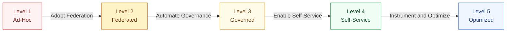

# 05 — Platform Maturity Model

> **Purpose:** GraphQL platform maturity is not a binary — it exists on a spectrum from
> completely ad-hoc (teams run isolated GraphQL APIs with no coordination) to fully optimized
> (the platform evolves itself based on usage data and business metrics). This document defines
> five maturity levels for an enterprise GraphQL platform, describes what each level looks and
> feels like from the developer's perspective, identifies the specific gaps that prevent
> advancement, and provides a concrete migration path with measurable signals for each transition.

---

## Overview



Most organizations entering this maturity model are at Level 1 or 2. The transition from
Level 2 to Level 3 is the highest-leverage investment: it eliminates the most common
categories of production incidents (schema breaking changes, unreviewed breaking queries)
without requiring organizational restructuring. The transition from Level 3 to Level 4
multiplies developer velocity by eliminating the operational bottlenecks created by manual
provisioning. Level 5 is an ongoing optimization state, not a terminal destination.

---

## Level 1 — Ad-Hoc

### What You Have

- Multiple teams have independently implemented GraphQL endpoints
- No shared schema, no shared tooling, no shared deployment model
- Each team uses their own GraphQL server library (some Apollo Server, some Express-GraphQL,
  some custom implementations)
- Client teams query multiple distinct GraphQL endpoints — there is no single API surface
- No schema versioning, no change coordination between teams
- Documentation, if it exists, is in individual team wikis with no cross-team consistency

### What It Feels Like

From a client developer's perspective, Level 1 is exhausting. Building a screen that
shows user profile information, their order history, and their saved products requires
three separate GraphQL queries to three separate endpoints, each with different
authentication mechanisms, different error formats, and different pagination conventions.

From a subgraph team's perspective, Level 1 feels like freedom but produces drift. Each
team solves identical problems (auth, logging, error handling) differently, and those
solutions are never consolidated.

### What's Missing

| Gap | Impact |
|---|---|
| No schema registry | No visibility into what API surface exists across teams |
| No composition | Client teams coordinate multiple endpoints instead of one |
| No breaking change detection | Schema changes break clients silently in production |
| No shared conventions | Every team uses different field naming, pagination, error format |
| No platform ownership | Operational issues fall to individual team members who lack platform expertise |

### Migration Path to Level 2

The primary work at Level 1 is a **federation adoption project**, not a tooling project.
Tooling follows organization; organization follows architecture.

**Step 1: Identify subgraph boundaries.**
Map existing GraphQL endpoints to bounded contexts (DDD terminology). Each endpoint
becomes a candidate subgraph. Where two endpoints expose the same entity (e.g., two
teams both expose a `User` type), plan ownership consolidation.

**Step 2: Form a platform team.**
Even one engineer dedicated to federation infrastructure is better than zero. The platform
team will own the router and registry; product teams will own their subgraphs.

**Step 3: Adopt Apollo Federation (or an equivalent).**
Migrate each GraphQL endpoint to a Federation v2 subgraph. Start with two subgraphs
(the smallest possible federation) to validate the composition model before migrating all teams.

**Step 4: Deploy a router.**
Apollo Router or Apollo Gateway provides the single endpoint that clients query. The router
handles composition and routing; subgraphs handle domain logic.

**Step 5: Register schemas.**
Start using Apollo GraphOS or Hive to publish subgraph schemas. This creates the audit
trail and enables schema check CI in Level 3.

**Signals that you are ready for Level 2:**
- All teams' GraphQL endpoints are registered as federation subgraphs
- Clients query a single router endpoint instead of multiple service endpoints
- The platform team can identify who owns any given type or field

---

## Level 2 — Federated

### What You Have

- Apollo Federation v2 or equivalent adopted across all teams
- A single router endpoint that clients query
- A schema registry (GraphOS or Hive) with all subgraph schemas registered
- Manual schema reviews — breaking changes are caught by engineers reading PRs, not by CI
- No automated policy enforcement — naming conventions and documentation requirements are
  documented but not enforced
- Basic observability — HTTP-level metrics available, no GraphQL-specific telemetry
- Deployment is manual or semi-automated — teams deploy subgraphs independently but
  using inconsistent processes

### What It Feels Like

Level 2 is a significant improvement over Level 1 for client developers — one endpoint,
one authentication mechanism, one pagination convention (if the team agreed on one).
But the federation is fragile. Schema reviews are ad-hoc and inconsistent. Breaking changes
occasionally reach production because a reviewer missed a field removal. Teams that are
moving fast bypass manual review processes.

From a platform perspective, Level 2 feels like managing a supergraph through spreadsheets.
Subgraph team rosters, schema owners, breaking change history, and deprecation timelines
exist only in people's heads or in documents that are perpetually out of date.

### What's Missing

| Gap | Impact |
|---|---|
| No CI schema check | Breaking changes reach production when reviewers miss them |
| No automated policy | Naming drift accumulates; documentation gaps grow |
| No breaking change gate | Teams can merge schema changes that break existing clients |
| No GraphQL-level observability | Cannot identify which fields are slow or unused |
| Inconsistent deployment | Each team deploys differently — operational patterns are not transferable |
| No self-service provisioning | New subgraphs require coordination with the platform team or infra team |

### Migration Path to Level 3

**Step 1: Add schema check CI.**
Configure `rover subgraph check` in GitHub Actions (or equivalent CI) for every subgraph
repository. Schema checks should block merges when breaking changes are detected. Start by
running checks in non-blocking mode for two weeks to identify the baseline violation count
before enforcing.

**Step 2: Implement OPA policy-as-code.**
Write OPA policies for naming conventions, documentation requirements, and deprecation
lifecycle. Deploy with `conftest` in CI. Start in warn-only mode; flip to error mode after
teams have resolved existing violations.

**Step 3: Add GraphQL-native observability.**
Enable the Apollo Router's OpenTelemetry export. Deploy an OpenTelemetry Collector.
Configure Prometheus scraping and create a baseline Grafana dashboard. The minimum
metrics set: request rate, error rate, query planning latency, and resolver latency.

**Step 4: Standardize deployment.**
Create a Helm chart template that all subgraphs use. Deploy via ArgoCD or Flux.
This is the foundation for Level 4's self-service provisioning.

**Signals that you are ready for Level 3:**
- Schema check CI is blocking (not advisory) on every subgraph PR
- Zero breaking changes reached production in the last 90 days
- OPA policies are enforced for naming and documentation
- Every subgraph has a Grafana health dashboard
- New subgraph deployment follows the same process for every team

---

## Level 3 — Governed

### What You Have

- Schema check CI blocking on all subgraph PRs (rover subgraph check)
- OPA policy-as-code enforcing naming conventions, documentation, deprecation lifecycle
- Breaking change gates with formal escalation path (RFC process for supergraph-wide changes)
- GraphQL-native observability: field-level latency, resolver error rates, field usage
  from GraphOS
- Consistent Helm chart deployment for all subgraphs
- SLO definitions for the router and for each subgraph
- A platform team with an internal customer model and a feedback loop

### What It Feels Like

Level 3 is where production reliability stabilizes. Breaking change incidents drop to
near zero because the CI gate catches them before they merge. Schema quality improves
because policy enforcement runs on every PR. Client teams trust the API because the
supergraph's stability guarantees are documented and enforced.

The remaining friction at Level 3 is operational: getting a new subgraph from idea to
production still requires coordination with the platform team. Self-service is aspirational,
not actual. New subgraph teams file tickets for namespaces, secrets, and ArgoCD Applications.

### What's Missing

| Gap | Impact |
|---|---|
| No self-service provisioning | New subgraphs take days to weeks to set up |
| No golden path CLI | Each team starts from scratch or copies from another team |
| Manual onboarding | Platform team spends significant time on setup, not product work |
| No automated template updates | Scaffold drift accumulates silently |
| Basic SLO dashboards | SLOs defined but not tied to customer-facing alerting |

### Migration Path to Level 4

**Step 1: Build the scaffold CLI (or Backstage template).**
The CLI is the single highest-leverage investment at Level 3 → 4. It compresses the
entire provisioning process into one command. Start with the TypeScript scaffold (highest
adoption) and add language variants iteratively.

**Step 2: Automate Terraform provisioning.**
Wire the CLI to Terraform so that running `graphql-platform new-subgraph` creates the
Kubernetes namespace, ServiceAccount, IAM role, ExternalSecret, and ArgoCD Application
without human intervention.

**Step 3: Register subgraphs in Backstage.**
Auto-generate `catalog-info.yaml` in the scaffold. The Backstage catalog becomes the
source of truth for what subgraphs exist, who owns them, and what their API surface is.

**Step 4: Define and publish the SLO dashboard template.**
Every subgraph should get a Grafana SLO dashboard out of the box — not a generic
infrastructure dashboard, but a GraphQL-specific one that shows request rate, error rate,
p99 latency, and field usage. The platform team publishes the dashboard as a template
and provisions it during scaffold.

**Signals that you are ready for Level 4:**
- Any engineer can create a new subgraph without filing a ticket
- Infrastructure is provisioned in < 10 minutes from CLI command
- Every subgraph has an SLO dashboard at provisioning time
- 80%+ of subgraphs are on the current golden path template version
- Platform team spends < 20% of time on provisioning and onboarding

---

## Level 4 — Self-Service

### What You Have

- `graphql-platform` CLI (or Backstage template) for subgraph provisioning
- Fully automated Terraform provisioning triggered by CLI
- Backstage software catalog with all subgraphs registered and schemas exposed as APIs
- Golden path template versioning and automated drift-detection PRs
- SLO dashboards and alerting provisioned for every subgraph at creation time
- Self-service decommission workflow (platform team reviews, not executes)
- Developer experience metrics tracked and published to engineering dashboards
- Platform team operating as a product team: roadmap, office hours, DX survey

### What It Feels Like

Level 4 is where the platform team's investment pays dividends at scale. A new subgraph
team can be operational in under an hour. The platform team's sprint work is about
improving the platform product, not executing operational tasks.

From a client developer's perspective, the supergraph at Level 4 is stable, documented,
and discoverable. The Backstage catalog shows every subgraph, every field, and every team.
GraphOS Studio provides query execution with full schema context. Field deprecations come
with a reliable timeline.

The remaining limitation at Level 4 is that the platform is reactive: it measures what
happened, not what is likely to happen. Query cost estimation is static. Schema evolution
suggestions are manual. Alerting fires after a problem occurs, not before.

### What's Missing

| Gap | Impact |
|---|---|
| Static query cost estimation | Cost limits are set conservatively because dynamic behavior is unpredictable |
| No schema evolution assistance | Breaking change suggestions require senior engineer review |
| Reactive alerting only | Anomaly detection fires after user impact begins |
| No cross-team DX optimization | Each team's experience is optimized individually, not collectively |
| Platform feedback not tied to business metrics | Platform improvements are not connected to revenue or user retention |

### Migration Path to Level 5

**Step 1: Instrument and publish usage data.**
Collect resolver-level execution time, field usage frequency, and query cost histograms
from GraphOS. Make this data available to the platform team and to subgraph teams via
a self-service dashboard.

**Step 2: Build dynamic query cost models.**
Replace static cost configuration (depth and complexity limits) with a data-driven cost
model that adapts to observed resolver performance. Train the model on resolver latency
histograms from production telemetry.

**Step 3: Implement schema evolution recommendations.**
Build a tool that analyzes field usage trends (declining usage, zero usage for 30 days)
and generates deprecation recommendations for subgraph teams. This moves the deprecation
initiative from reactive (team decides to deprecate) to proactive (platform identifies
candidates).

**Step 4: Add anomaly detection.**
Deploy time-series anomaly detection (Grafana Anomaly Detection, or a custom Prophet
model on query patterns) that identifies unusual traffic patterns before they cause
service degradation.

**Signals that you are ready for Level 5:**
- Query cost limits are data-driven, not hand-tuned
- Platform sends proactive deprecation suggestions to subgraph teams
- Anomalies in resolver latency trigger alerts before p99 SLO is breached
- Platform improvements are correlated with measurable developer velocity gains

---

## Level 5 — Optimized

### What You Have

- **ML-driven query cost prediction:** The router predicts query cost from the operation
  AST using a model trained on historical resolver execution data. Cost limits adapt
  automatically as resolver performance changes.

- **Automated schema evolution suggestions:** The platform analyzes field usage trends,
  identifies zero-usage fields, and opens automated deprecation PRs in subgraph repositories
  with usage evidence and suggested timelines.

- **Platform feedback loops tied to business metrics:** DX metrics (time-to-production,
  breaking change rate) are correlated with engineering velocity (DORA metrics) and
  business metrics (feature delivery rate, incident rate). The platform team's roadmap
  is prioritized by demonstrated business impact.

- **Predictive capacity planning:** The router and subgraph autoscaling adapts to predicted
  load based on historical patterns, not just current CPU utilization.

- **Continuous golden path evolution:** The golden path template updates itself based on
  community best practices, security advisories, and performance benchmarks. Subgraph teams
  receive automated PRs for updates within days of a new Node.js security release.

### What It Feels Like

Level 5 is a platform that learns. The developer experience improves without the platform
team needing to explicitly decide to improve it. Schema health improves automatically as
zero-usage fields are deprecated and removed. Performance improves as cost models adapt
to real resolver behavior.

No organization should plan to reach Level 5 within a year. It is the product of several
years of instrumentation data, platform investment, and organizational trust between the
platform team and its customers.

### Maintaining Level 5

Level 5 is not a stable state. It requires ongoing investment:

- ML models for query cost prediction require periodic retraining as the schema evolves
- Automated schema evolution tooling requires human review of its suggestions — it can
  identify candidates but should not remove fields without engineer sign-off
- Anomaly detection requires tuning as traffic patterns change (seasonality, new product launches)
- Platform feedback loops require business stakeholder alignment to remain meaningful

---

## Maturity Assessment

Use this table to self-assess your current maturity level. Check all that apply and
count the checkmarks per level.

```
Level 1 (Ad-Hoc)
□ Teams have independent GraphQL endpoints with no shared routing
□ No schema registry
□ No shared platform team
□ Breaking changes discovered by clients, not CI

Level 2 (Federated)
□ Federation adopted — single router endpoint for all clients
□ Schema registry in use (GraphOS, Hive, or equivalent)
□ Schema reviews happen in PRs but are manual
□ Basic HTTP-level observability available

Level 3 (Governed)
□ Schema check CI blocks breaking changes on all subgraph PRs
□ OPA policies enforce naming and documentation
□ GraphQL-native observability (field-level metrics, resolver latency)
□ Platform team with published charter, SLOs, and RFC process
□ Consistent Helm-based deployment for all subgraphs

Level 4 (Self-Service)
□ CLI or Backstage template for zero-ticket subgraph provisioning
□ Automated Terraform provisioning (namespace, IAM, secrets, ArgoCD)
□ Backstage catalog with all subgraphs and GraphQL SDL
□ SLO dashboards provisioned automatically at scaffold time
□ Developer experience metrics tracked and published

Level 5 (Optimized)
□ ML-driven query cost models (not static configuration)
□ Automated schema evolution suggestions from usage data
□ Anomaly detection on resolver latency before SLO breach
□ Platform investments correlated to measurable business outcomes
□ Golden path self-updates from security and performance signals
```

**Score interpretation:**
- 3–4 checkmarks in a level: you are operating at that level
- 1–2 checkmarks in a level: you are transitioning into that level
- 0 checkmarks in a level: you have not started that level's work

---

## Maturity Timeline Reference

| Transition | Minimum Realistic Duration | Primary Investment |
|---|---|---|
| Level 1 → Level 2 | 3–6 months | Architecture (federation adoption), organization (platform team) |
| Level 2 → Level 3 | 2–4 months | Engineering (CI automation, OPA policies, observability) |
| Level 3 → Level 4 | 3–6 months | Engineering (CLI, Terraform module, Backstage integration) |
| Level 4 → Level 5 | 12–24 months | Data science (ML models), product (feedback loop design) |

The most common failure mode is attempting to skip Level 3 and move directly from Level 2
to Level 4. Self-service provisioning without governance automation creates a platform where
anyone can quickly create a subgraph that violates naming conventions, lacks documentation,
and breaks clients without CI catching it. Governance (Level 3) is the prerequisite for
self-service (Level 4) to remain safe at scale.

---

## Related Topics

- [Platform Team Model](./01-platform-team-model.md)
- [Golden Paths](./02-golden-paths.md)
- [Self-Service Infrastructure](./03-self-service-infrastructure.md)
- [Developer Experience](./04-developer-experience.md)
- [Schema Governance](../09-schema-governance/README.md)
- [Policy as Code](../13-policy-as-code/README.md)
- [Observability](../14-observability/README.md)

## References

- [CNCF Platform Engineering Maturity Model (2023)](https://tag-app-delivery.cncf.io/whitepapers/platform-eng-maturity-model/)
- [DORA State of DevOps Report (2023)](https://dora.dev/research/2023/dora-report/)
- [Team Topologies — Skelton & Pais (2019)](https://teamtopologies.com/)
- [Gartner Platform Engineering Hype Cycle (2023)](https://www.gartner.com/en/infrastructure-and-it-operations-leaders/topics/platform-engineering)
- [Apollo GraphOS Usage Analytics](https://www.apollographql.com/docs/graphos/metrics/)
- [Hive Schema Analytics](https://the-guild.dev/graphql/hive/docs/features/usage-reporting)
- [Accelerate: Building and Scaling High Performing Technology Organizations — Forsgren, Humble, Kim (2018)](https://itrevolution.com/accelerate-book/)
