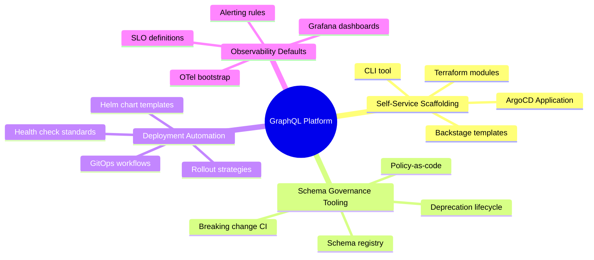
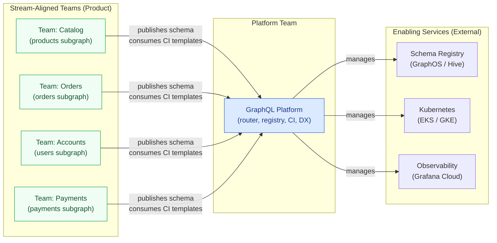

# 19 — Platform Engineering for GraphQL

> **Purpose:** A GraphQL supergraph does not govern itself. The router, schema registry, CI
> tooling, and developer experience all require a dedicated team whose job is to make building
> on the supergraph frictionless and safe. This section explains what "platform engineering"
> means in the context of an enterprise GraphQL platform, establishes the "paved road" philosophy
> that separates it from general infrastructure work, and provides the operational model that
> makes self-service subgraph development possible at scale.

---

## What Platform Engineering Means for GraphQL

Platform engineering for GraphQL is not the same as infrastructure engineering or DevOps.
Infrastructure engineers provision compute and storage. DevOps engineers automate deployment
pipelines. Platform engineers build and operate the **internal product** that other engineers
use to ship GraphQL APIs — the paved road that makes the right thing the easy thing and the
wrong thing visible before it reaches production.

In an enterprise GraphQL context, the platform team owns:

- **The router** — Apollo Router or an equivalent gateway, its configuration, security
  policies, rate limiting, and operational runbooks
- **The schema registry** — GraphOS, Hive, or an equivalent system where subgraph schemas
  are published, composed, and version-controlled
- **CI tooling** — schema check workflows, policy enforcement, composition validation,
  and the GitHub Actions templates that every subgraph team uses
- **Developer experience** — the CLI scaffold tool, IDE integration guides, local
  development environment, and onboarding documentation
- **Observability defaults** — the OTel collector configuration, Grafana dashboards, and
  SLO definitions that every subgraph gets without configuring them

Product teams own their **subgraphs** — the domain data model, resolvers, business logic,
and the services those resolvers call. They consume the platform; they do not operate it.

This ownership boundary is the defining characteristic of a mature GraphQL platform.
When the boundary is blurry, platform concerns leak into product teams (who then solve
them inconsistently), and product teams' operational pain leaks back onto the platform
team (who then become a bottleneck instead of an enabler).

---

## The Paved Road Philosophy

A paved road is an opinionated, well-lit trail. It has four properties:

1. **The right thing is the easy thing.** Following the golden path is less work than
   deviating from it. The scaffold command creates a subgraph with security headers,
   OTel instrumentation, and DataLoader setup already wired — not as optional extras, but
   as the starting state.

2. **The wrong thing is visible.** Deviations from the path surface as CI failures, policy
   violations, or linting errors. They do not fail silently in production weeks later.

3. **Deviation is possible but deliberate.** Engineers can leave the paved road when they
   have a legitimate reason. The process for doing so produces an explicit record: an RFC,
   an approved exception in the policy bundle, a comment in the Terraform override. It is
   never simply "delete this config and move on."

4. **The road is maintained.** Platform standards evolve. When the golden path template is
   updated, automated PRs notify subgraph teams about the change so old paths become
   discoverable debt, not invisible drift.

The paved road concept is borrowed from the Netflix engineering culture (coined by Dianne
Marsh and Greg Orzell in 2017) and maps cleanly to the GraphQL domain because the supergraph
creates exactly the integration surface where inconsistency is most damaging.

---

## The Four Platform Concerns

### Self-Service Scaffolding

A new subgraph team should be able to go from "we have an idea" to "our first schema check is
passing in CI" in under one business day without filing a ticket with the platform team.
Self-service scaffolding makes this possible: a CLI command or Backstage form that generates
a fully-configured subgraph repository, creates the Kubernetes namespace and RBAC, registers
the service in the catalog, and wires up CI — automatically, without human approval for the
infrastructure.

### Schema Governance Tooling

The schema registry is the source of truth for what the supergraph exposes. The platform team
owns the tooling around it: the schema check CI job that runs on every subgraph PR, the OPA
policies that enforce naming conventions and documentation requirements, the breaking change
gates that prevent unannounced removals, and the deprecation lifecycle automation that reminds
teams when fields have overstayed their deprecation window.

### Deployment Automation

Every subgraph follows the same deployment contract: a Helm chart with defined resource
limits, health check endpoints, readiness probe configuration, and PodDisruptionBudget.
The platform team owns the Helm chart templates and the GitOps pipeline. Product teams
supply values files — what image to run, what environment variables to set — not
deployment mechanics.

### Observability Defaults

Observability should not be an opt-in. Every subgraph starts with OpenTelemetry tracing
enabled, structured logging configured, Prometheus metrics scraped, and basic SLO alerts
wired. The platform team provisions these defaults through the scaffold and enforces them
through CI checks that fail if OTel bootstrap code is removed.

---

## Platform Team as Enabling Team

The Team Topologies model distinguishes four team types. Platform engineering teams are
enabling teams with one mandate: **reduce the cognitive load of stream-aligned (product)
teams** by abstracting complexity they should not have to deal with.

The relationship is a service relationship: the platform team has internal customers (product
teams), internal SLAs (CI response time, scaffold reliability), and an internal roadmap
driven by customer feedback. When a platform team operates without this framing, it defaults
to building infrastructure for its own satisfaction rather than developer experience for
its customers.

---

## The Supergraph Ownership Model

| Concern | Platform Team | Product Team |
|---|---|---|
| Router binary and version | Owns | Consumes |
| Router configuration (security, rate limits) | Owns | Requests changes via RFC |
| Router configuration (subgraph URL routing) | Manages | Supplies values via PR |
| Schema registry account and access | Owns | Consumes |
| Schema check CI job | Owns template | Consumes in their CI |
| Schema design policies (OPA rules) | Owns | May propose additions |
| Subgraph schema (SDL) | Reviews | Owns |
| Subgraph resolvers | N/A | Owns |
| Subgraph deployment (Helm chart template) | Owns template | Supplies values |
| Subgraph Kubernetes namespace | Provisions | Operates within |
| Observability dashboard templates | Owns | Extends |
| Alerting thresholds | Defines defaults | Tunes per-subgraph |
| On-call rotation for subgraph errors | Supports | Primary |
| On-call rotation for router/registry errors | Primary | Escalates to |

---

## Navigation Map

| Document | Covers |
|---|---|
| [01-platform-team-model.md](./01-platform-team-model.md) | Team topology, ownership charter, RFC process, SLOs, escalation paths |
| [02-golden-paths.md](./02-golden-paths.md) | Golden path definition, CLI scaffold, Backstage templates, scaffold contents, maintenance |
| [03-self-service-infrastructure.md](./03-self-service-infrastructure.md) | Provisioning flow, Terraform module, catalog registration, decommission workflow |
| [04-developer-experience.md](./04-developer-experience.md) | Local dev setup, IDE integration, schema exploration, onboarding checklist, DX metrics |
| [05-platform-maturity-model.md](./05-platform-maturity-model.md) | Five-level maturity model with migration paths and advancement signals |

---

## Related Topics

- [Schema Governance](../09-schema-governance/README.md)
- [Policy as Code](../13-policy-as-code/README.md)
- [CI/CD Automation](../11-ci-cd-automation/README.md)
- [Kubernetes Deployment](../15-kubernetes-deployment/README.md)
- [Observability](../14-observability/README.md)
- [Internal Developer Platforms](../20-internal-developer-platforms/README.md)

## References

- [Team Topologies — Skelton & Pais (2019)](https://teamtopologies.com/)
- [The Paved Road at Netflix (Dianne Marsh, 2017)](https://netflixtechblog.com/how-we-build-code-at-netflix-c5d9bd727f15)
- [Platform Engineering on Kubernetes — CNCF TAG App Delivery (2023)](https://tag-app-delivery.cncf.io/whitepapers/platform-eng-maturity-model/)
- [Apollo Federation Documentation](https://www.apollographql.com/docs/federation/)
- [Backstage Software Templates](https://backstage.io/docs/features/software-templates/)
