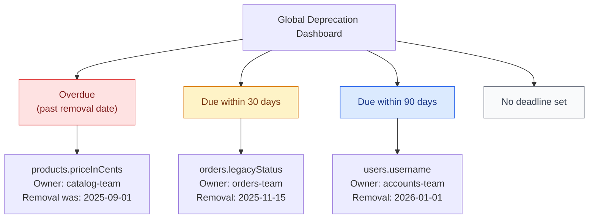
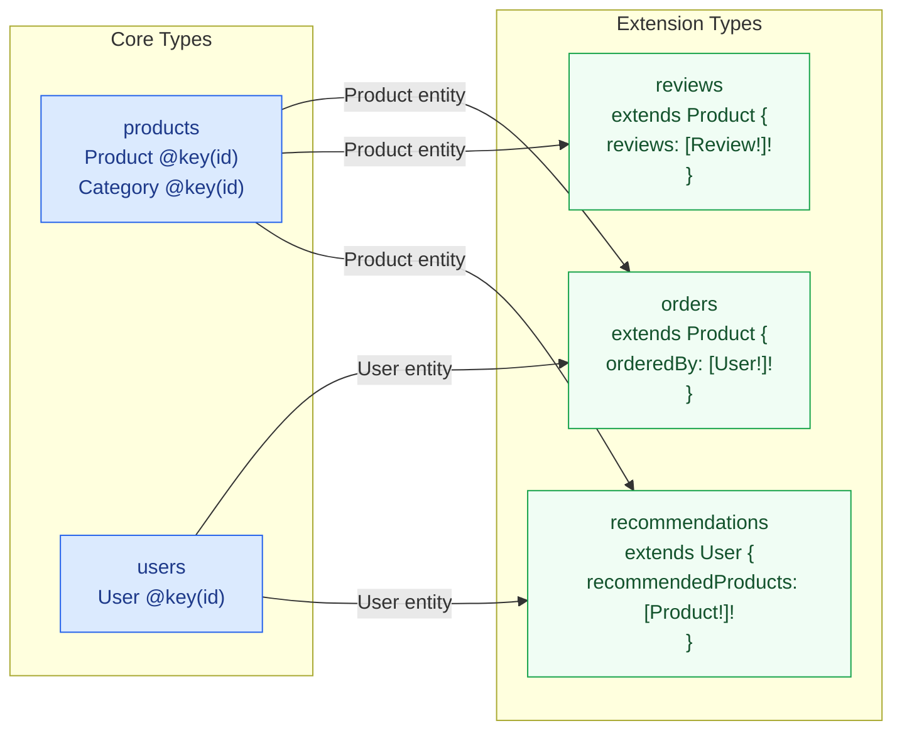
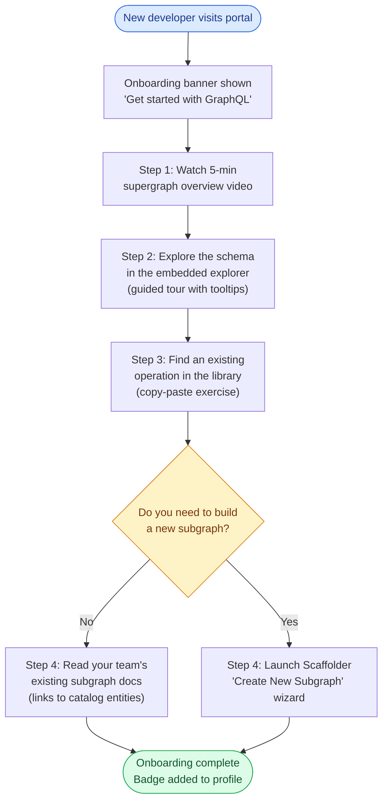
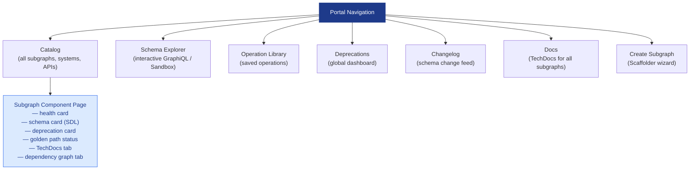

# 02 — Developer Portal Design

> **Purpose:** The developer portal is the face of the GraphQL platform. Done well, it
> replaces the friction of "read the docs, find the schema file, ask in Slack, wait for
> answers" with a self-service experience where a developer can discover the supergraph
> schema, understand which teams own which types, see field-level usage data, track
> deprecations, and review schema changes — all without leaving the portal. This document
> defines the portal's component inventory, the UX patterns that make each component
> effective for a GraphQL audience, and the implementation approach for embedding schema
> tooling directly in the catalog experience.

---

## Portal Component Inventory

A GraphQL developer portal is more than a Backstage skin. It requires a set of components
that are specific to federated schemas, operation lifecycle, and cross-team dependencies.
The table below defines what each component is, what user problem it solves, and where the
data comes from.

| Component | User Problem Solved | Data Source |
|---|---|---|
| Schema Explorer | "I need to understand the supergraph schema interactively" | Supergraph SDL + router endpoint |
| Operation Library | "I want to reuse a query the platform team already tested" | Internal query store (Postgres) |
| Deprecation Notices | "I don't want to learn about a breaking change in production" | Schema registry + usage data |
| Schema Diff Viewer | "What changed between last week and this week?" | Schema registry history |
| Field Usage Heatmap | "Which fields are actually being used, and by whom?" | GraphOS field execution stats / Hive |
| Cross-Team Dependency Graph | "Which other subgraphs does my subgraph depend on?" | Backstage catalog relationships |
| Changelog Feed | "What schema changes happened in the last sprint?" | Schema registry webhooks + GitHub |
| Onboarding Flow | "How do I create my first subgraph without help?" | Scaffolder + guided wizard |

---

## Schema Explorer

The schema explorer gives developers an interactive environment for exploring the supergraph
schema and sending test operations. It must target the **composition-validated supergraph**,
not an individual subgraph endpoint — cross-subgraph queries and entity resolution are the
point of federation, and an explorer that only targets one subgraph creates a misleading
picture of the API.

### Implementation: GraphiQL Iframe with JWT Passthrough

The portal embeds GraphiQL as an iframe, passing the developer's portal session token to
the router so they operate with realistic authorization context.

```typescript
// packages/graphql-explorer-plugin/src/components/SchemaExplorerPage.tsx
import React, { useEffect, useRef } from 'react';
import { useApi, identityApiRef } from '@backstage/core-plugin-api';
import { InfoCard } from '@backstage/core-components';
import { makeStyles } from '@material-ui/core/styles';

const useStyles = makeStyles({
  explorerFrame: {
    width: '100%',
    height: 'calc(100vh - 180px)',
    border: 'none',
    borderRadius: '4px',
  },
});

export function SchemaExplorerPage() {
  const classes = useStyles();
  const identityApi = useApi(identityApiRef);
  const iframeRef = useRef<HTMLIFrameElement>(null);

  useEffect(() => {
    async function injectToken() {
      const { token } = await identityApi.getCredentials();
      if (!token || !iframeRef.current?.contentWindow) return;

      // Post the token to the iframe so GraphiQL can set it as a default header
      iframeRef.current.contentWindow.postMessage(
        { type: 'SET_AUTHORIZATION_TOKEN', token },
        process.env.GRAPHQL_ROUTER_URL ?? 'https://api.internal.myorg.com',
      );
    }
    injectToken();
  }, [identityApi]);

  const explorerUrl = new URL('https://api.internal.myorg.com/graphql');
  explorerUrl.searchParams.set('embedded', 'true');
  explorerUrl.searchParams.set('theme', 'light');

  return (
    <InfoCard title="Supergraph Explorer" noPadding>
      <iframe
        ref={iframeRef}
        className={classes.explorerFrame}
        src={explorerUrl.toString()}
        title="GraphQL Supergraph Explorer"
        allow="clipboard-write"
      />
    </InfoCard>
  );
}
```

### Apollo Sandbox Alternative

For organizations using GraphOS, Apollo Sandbox can be embedded instead of a self-hosted
GraphiQL. Sandbox includes built-in schema documentation, operation collections, and response
history — features that would otherwise require custom development.

```html
<!-- Embedded Apollo Sandbox — paste into a Backstage custom page component -->
<div style="width: 100%; height: 100vh;">
  <iframe
    src="https://sandbox.apollo.dev/?endpoint=https://api.internal.myorg.com/graphql&shared=true"
    style="width: 100%; height: 100%; border: none;"
    title="Apollo Sandbox — Supergraph Explorer"
  />
</div>
```

The `shared=true` parameter enables Sandbox to persist operations in the URL, allowing
engineers to share deep links to specific queries with their team.

---

## Operation Library

The operation library is a catalog of GraphQL operations (queries, mutations, subscriptions)
contributed by teams across the organization. It serves three audiences:

1. **New developers** learning the supergraph — they can browse real operations to understand
   how different types connect
2. **Frontend engineers** building new features — they can search for existing operations
   rather than writing from scratch
3. **Platform engineers** validating schema changes — they can test proposed changes against
   the library of known-good operations

### Data Model

```typescript
// Operation library schema — stored in Postgres, exposed via platform API
interface SavedOperation {
  id: string;
  name: string;
  description: string;
  operationType: 'query' | 'mutation' | 'subscription';
  sdl: string;                      // The operation text
  variables: Record<string, unknown>; // Example variables
  owner: string;                    // Backstage group name
  subgraphsUsed: string[];          // Which subgraphs this operation touches
  tags: string[];
  createdAt: string;
  updatedAt: string;
  usageCount: number;               // How many times fetched from library
  testedAgainstVersion: string;     // Schema version this was last validated against
  status: 'active' | 'deprecated' | 'draft';
}
```

### Operation Library UI Component

```typescript
// packages/graphql-explorer-plugin/src/components/OperationLibrary.tsx
import React, { useState } from 'react';
import {
  Table, TableColumn, Progress, ResponseErrorPanel,
} from '@backstage/core-components';
import { useApi } from '@backstage/core-plugin-api';
import { graphqlPlatformApiRef } from '../api/graphqlPlatformApi';
import { useAsync } from 'react-use';
import Button from '@material-ui/core/Button';
import Chip from '@material-ui/core/Chip';

const columns: TableColumn[] = [
  { title: 'Name', field: 'name', highlight: true },
  { title: 'Type', field: 'operationType', width: '80px' },
  {
    title: 'Subgraphs',
    render: (row: any) =>
      row.subgraphsUsed.map((s: string) => (
        <Chip key={s} label={s} size="small" style={{ marginRight: 4 }} />
      )),
  },
  { title: 'Owner', field: 'owner' },
  { title: 'Uses', field: 'usageCount', type: 'numeric', width: '60px' },
  {
    title: 'Actions',
    render: (row: any) => (
      <Button
        size="small"
        variant="outlined"
        onClick={() => window.open(
          `/graphql-explorer?operation=${encodeURIComponent(row.sdl)}`,
          '_blank',
        )}
      >
        Open in Explorer
      </Button>
    ),
  },
];

export function OperationLibrary() {
  const platformApi = useApi(graphqlPlatformApiRef);
  const [filter, setFilter] = useState<string>('');

  const { value: operations, loading, error } = useAsync(
    () => platformApi.listOperations({ filter }),
    [filter],
  );

  if (loading) return <Progress />;
  if (error) return <ResponseErrorPanel error={error} />;

  return (
    <Table
      title="Operation Library"
      columns={columns}
      data={operations ?? []}
      options={{
        search: true,
        paging: true,
        pageSize: 20,
        filtering: true,
      }}
    />
  );
}
```

---

## API Deprecation Notices

Deprecation notices surface in three locations in the portal, ensuring that engineers are
informed before a breaking change reaches them at runtime.

### Location 1 — Subgraph Component Entity Page

A `DeprecationSummaryCard` renders in every subgraph's entity page, showing the count of
actively deprecated fields and the nearest removal deadline.

```typescript
// packages/graphql-subgraph-plugin/src/components/DeprecationSummaryCard.tsx
import React from 'react';
import {
  InfoCard, StructuredMetadataTable, StatusWarning, StatusOK,
} from '@backstage/core-components';
import { useEntity } from '@backstage/plugin-catalog-react';
import { useApi } from '@backstage/core-plugin-api';
import { graphqlPlatformApiRef } from '../api';
import { useAsync } from 'react-use';

export function DeprecationSummaryCard() {
  const { entity } = useEntity();
  const platformApi = useApi(graphqlPlatformApiRef);
  const subgraphName = entity.metadata.annotations?.[
    'graphql-platform.myorg.com/subgraph-name'
  ];

  const { value, loading } = useAsync(
    () => platformApi.getDeprecationSummary(subgraphName!),
    [subgraphName],
  );

  if (loading || !value) return null;

  const nearestRemoval = value.deprecations
    .filter(d => d.removalDate)
    .sort((a, b) => new Date(a.removalDate!).getTime() - new Date(b.removalDate!).getTime())[0];

  const metadata = {
    'Deprecated Fields': value.deprecations.length,
    'Nearest Removal': nearestRemoval
      ? `${nearestRemoval.fieldPath} — ${nearestRemoval.removalDate}`
      : 'No removal dates set',
    'Status': value.deprecations.length === 0
      ? <StatusOK>Clean</StatusOK>
      : <StatusWarning>{value.deprecations.length} active deprecations</StatusWarning>,
  };

  return (
    <InfoCard title="Schema Deprecations">
      <StructuredMetadataTable metadata={metadata} />
    </InfoCard>
  );
}
```

### Location 2 — Global Deprecation Dashboard

A dedicated portal page lists all deprecated fields across the entire supergraph, grouped by
removal deadline. Teams can filter by "affects my team" using their Backstage group membership.



### Location 3 — Operation Library Warning Banner

When a developer opens a saved operation that uses a deprecated field, the operation library
displays an inline warning showing the deprecation reason and removal date.

---

## Schema Diff Viewer

The schema diff viewer lets engineers compare two schema versions — typically the current
production schema versus the proposed schema in a PR — and understand what changed in
human-readable form.

```typescript
// The platform API provides a diff endpoint; the portal renders the result
interface SchemaDiff {
  addedTypes: TypeChange[];
  removedTypes: TypeChange[];
  addedFields: FieldChange[];
  removedFields: FieldChange[];
  deprecatedFields: FieldChange[];
  undeprecatedFields: FieldChange[];
  changedArguments: ArgumentChange[];
  breakingChanges: BreakingChange[];
}

interface BreakingChange {
  type: 'FIELD_REMOVED' | 'TYPE_REMOVED' | 'ARGUMENT_REMOVED'
      | 'TYPE_CHANGED' | 'ARGUMENT_TYPE_CHANGED';
  description: string;
  path: string;          // e.g., "Product.priceInCents"
  severity: 'breaking' | 'dangerous' | 'safe';
  affectedOperations: string[];  // operation IDs from the operation library
}
```

The diff view renders as a side-by-side SDL comparison with color coding (green for
additions, red for removals, yellow for modifications) and a separate "Breaking Changes"
panel that lists each breaking change with severity and a count of affected operations from
the library.

---

## Field Usage Heatmap

Field usage heatmaps come from the analytics layer of the schema registry. GraphOS provides
field-level execution statistics via its API; WunderGraph Cosmo and Hive provide equivalent
data through their analytics APIs.

```typescript
// packages/graphql-subgraph-plugin/src/components/FieldUsageHeatmap.tsx
// Renders a table of fields sorted by request count, with a heat-coded bar

interface FieldUsageRow {
  fieldPath: string;     // "Product.name"
  requestCount30d: number;
  errorRate30d: number;
  p99LatencyMs: number;
  uniqueClients: number;
  isDeprecated: boolean;
}

// Color thresholds for the usage heat bar
function usageColor(count: number, max: number): string {
  const ratio = count / max;
  if (ratio > 0.8) return '#16a34a';  // green — high usage
  if (ratio > 0.4) return '#ca8a04';  // yellow — moderate
  if (ratio > 0.1) return '#2563eb';  // blue — low
  return '#9ca3af';                    // gray — minimal
}
```

The heatmap surfaces a critical operational insight: **deprecated fields that still have
high usage counts cannot be safely removed**, even if a removal date has passed. The
platform enforces this connection by blocking schema removal PRs when GraphOS reports
non-zero request counts for the removed fields.

---

## Cross-Team Schema Dependency Graph

The dependency graph shows how subgraphs are interconnected through entity types and type
extensions. It answers questions like "if the Products team changes the `Product` type's
`id` field type, which other subgraphs are affected?"



The dependency graph is computed from the composed supergraph SDL — specifically from the
`@key` directives and type extension patterns. The platform API exposes this as a query
(see section 03) and the portal renders it using a graph visualization library (Cytoscape.js
or D3-force).

---

## Changelog Feed

The changelog feed aggregates schema change events from the schema registry and surfaces
them as a timestamped, PR-linked feed in the portal. It answers "what changed in the
supergraph in the last two weeks?" without requiring engineers to visit GraphOS Studio or
parse CI logs.

### Event Schema

```typescript
interface SchemaChangeEvent {
  id: string;
  timestamp: string;
  subgraphName: string;
  subgraphOwner: string;
  changeType: 'field_added' | 'field_deprecated' | 'field_removed'
            | 'type_added' | 'type_removed' | 'argument_changed' | 'composition_failed';
  summary: string;           // Human-readable description
  breakingChangeCount: number;
  safeChangeCount: number;
  githubPrUrl?: string;
  githubPrNumber?: number;
  schemaVersionBefore: string;
  schemaVersionAfter: string;
}
```

### Feed Implementation — Webhook to Database

The platform subscribes to GraphOS webhooks (or equivalent registry events) and writes
each event to a Postgres table. The portal queries this table via the platform API.

```typescript
// Platform API resolver for changelog feed
// Returns events for a time range, with optional subgraph filter
async function schemaChangelog(
  _: unknown,
  args: { subgraphName?: string; since: string; limit: number },
  ctx: Context,
): Promise<SchemaChangeEvent[]> {
  const query = ctx.db
    .from('schema_change_events')
    .orderBy('timestamp', 'desc')
    .limit(args.limit);

  if (args.subgraphName) {
    query.where('subgraph_name', args.subgraphName);
  }

  if (args.since) {
    query.where('timestamp', '>=', args.since);
  }

  return query.select('*');
}
```

---

## Onboarding Flow for New Developers

The onboarding flow replaces "read five docs" with a guided, interactive wizard embedded in
the portal. It is triggered when a developer without any subgraph entities in the catalog
visits the portal for the first time.



### Onboarding Progress Tracking

The portal tracks onboarding completion per-user and per-team. Team leads can see a
dashboard showing which team members have completed onboarding and who is still in progress.
This data feeds the Developer Experience Score metric described in section 05.

```typescript
interface OnboardingStatus {
  userId: string;
  team: string;
  completedSteps: OnboardingStep[];
  currentStep: OnboardingStep | null;
  startedAt: string;
  completedAt: string | null;
  timeToFirstSchemaCheck: number | null;   // minutes — key DX metric
  timeToFirstSubgraphDeploy: number | null; // minutes — key DX metric
}

type OnboardingStep =
  | 'watched_overview'
  | 'explored_schema'
  | 'ran_first_query'
  | 'found_operation_in_library'
  | 'scaffolded_subgraph'
  | 'passed_first_schema_check'
  | 'deployed_to_staging';
```

---

## Portal Information Architecture



---

## Related Topics

- [Backstage Integration](./01-backstage-integration.md)
- [Platform APIs](./03-platform-apis.md)
- [Schema Governance](../09-schema-governance/README.md)
- [Observability](../14-observability/README.md)
- [Developer Experience](../19-platform-engineering/04-developer-experience.md)

## References

- [GraphiQL — GitHub](https://github.com/graphql/graphiql)
- [Apollo Sandbox Embedding](https://www.apollographql.com/docs/graphos/explorer/sandbox/)
- [GraphOS Field Usage Analytics](https://www.apollographql.com/docs/graphos/metrics/field-usage/)
- [Cytoscape.js — Graph Visualization](https://js.cytoscape.org/)
- [Backstage Home Plugin — Custom Homepage](https://backstage.io/docs/getting-started/homepage/)
- [WunderGraph Hive — Schema Registry Analytics](https://the-guild.dev/graphql/hive/docs)
