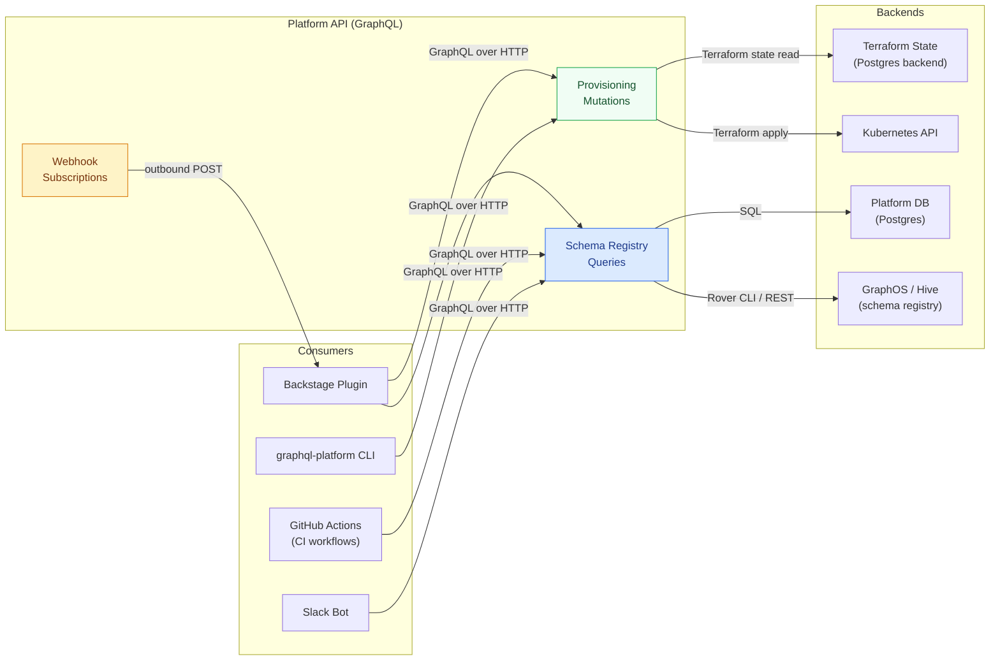

# 03 — Platform APIs

> **Purpose:** The IDP's automation layer is best exposed as a GraphQL API — a meta-layer
> where the platform itself becomes a first-class GraphQL consumer of its own design
> philosophy. This document defines the platform API's schema, covering schema registry
> queries, provisioning mutations, webhook events, service account authentication, and
> versioning strategy. The platform API is the integration surface that the Backstage
> portal, the CLI, GitHub Actions workflows, and Slack bots all call — a single, typed,
> self-documenting contract for all platform automation.

---

## The Meta-GraphQL Pattern

A GraphQL platform that uses GraphQL for its own internal API is practicing what it
preaches — and gaining meaningful technical advantages in doing so.

The platform API SDL is committed to the platform team's repository and published to
the schema registry. This means:

- **The platform API is introspectable.** Backstage plugins use introspection to dynamically
  render forms for provisioning mutations. New mutations become new forms without portal
  code changes.
- **The platform API is type-safe.** The CLI, the Backstage plugin, and GitHub Actions
  scripts all use generated TypeScript types from the same SDL. Type errors are caught
  at codegen time, not at runtime in a production CI check.
- **The platform API is versioned.** The same deprecation lifecycle that governs product
  subgraphs governs the platform API — fields are deprecated with a reason and a removal
  date before they are removed.



---

## Platform API SDL

The complete platform API schema. Types are grouped by domain.

### Root Types and Scalars

```graphql
scalar DateTime
scalar JSON
scalar URL

type Query {
  # Schema Registry
  subgraphs(filter: SubgraphFilter): [Subgraph!]!
  subgraph(name: String!): Subgraph
  schemaVersion(subgraphName: String!, variant: String!): SchemaVersion
  schemaVersionHistory(subgraphName: String!, limit: Int = 20): [SchemaVersion!]!
  compositionStatus(graphRef: String!): CompositionStatus!
  fieldUsage(subgraphName: String!, fieldPath: String!, since: DateTime): FieldUsageStats!
  schemaChangelog(subgraphName: String, since: DateTime!, limit: Int = 50): [SchemaChangeEvent!]!
  schemaDiff(
    subgraphName: String!
    fromVersion: String!
    toVersion: String!
  ): SchemaDiff!

  # Dependency Graph
  subgraphDependencies(name: String!): SubgraphDependencies!
  supergraphDependencyGraph: DependencyGraph!

  # Provisioning State
  provisionedSubgraphs: [ProvisionedSubgraph!]!
  provisioningJob(jobId: ID!): ProvisioningJob

  # Platform Health
  platformHealth: PlatformHealth!
  goldenPathDrift: [GoldenPathDriftReport!]!

  # Operation Library
  operations(filter: OperationFilter): [SavedOperation!]!
  operation(id: ID!): SavedOperation
}

type Mutation {
  # Subgraph Lifecycle
  createSubgraph(input: CreateSubgraphInput!): ProvisioningJob!
  decommissionSubgraph(input: DecommissionSubgraphInput!): ProvisioningJob!
  updateSubgraphMetadata(input: UpdateSubgraphMetadataInput!): Subgraph!

  # Schema Governance
  deprecateField(input: DeprecateFieldInput!): FieldDeprecation!
  undeprecateField(input: UndeprecateFieldInput!): FieldDeprecation!
  requestBreakingChange(input: RequestBreakingChangeInput!): BreakingChangeRequest!
  approveBreakingChange(requestId: ID!): BreakingChangeRequest!
  rejectBreakingChange(requestId: ID!, reason: String!): BreakingChangeRequest!

  # Operation Library
  saveOperation(input: SaveOperationInput!): SavedOperation!
  deprecateOperation(id: ID!, reason: String!): SavedOperation!
  deleteOperation(id: ID!): Boolean!

  # Webhook Registration
  registerWebhook(input: RegisterWebhookInput!): Webhook!
  deleteWebhook(id: ID!): Boolean!
}

type Subscription {
  schemaCheckCompleted(subgraphName: String): SchemaCheckResult!
  subgraphDeployed(subgraphName: String): SubgraphDeploymentEvent!
  compositionFailed(graphRef: String): CompositionFailureEvent!
}
```

### Schema Registry Types

```graphql
type Subgraph {
  name: String!
  title: String!
  description: String!
  owner: String!                      # Backstage group name
  language: SubgraphLanguage!
  lifecycle: Lifecycle!
  currentSchema(variant: String = "current"): SchemaVersion!
  schemaHistory(limit: Int = 20): [SchemaVersion!]!
  fieldCount: Int!
  deprecatedFieldCount: Int!
  goldenPathStatus: GoldenPathStatus!
  templateVersion: String!
  provisionedAt: DateTime!
  lastDeployedAt: DateTime
  sloCompliance: SloComplianceReport!
  dependencies: SubgraphDependencies!
}

type SchemaVersion {
  id: ID!
  subgraphName: String!
  variant: String!
  sdl: String!
  publishedAt: DateTime!
  publishedBy: String!               # Service account or user ID
  gitCommit: String
  gitBranch: String
  githubPrUrl: URL
  compositionResult: CompositionResult!
  breakingChanges: [BreakingChange!]!
  safeChanges: [SafeChange!]!
}

type CompositionResult {
  success: Boolean!
  supergraphSdl: String             # null if composition failed
  errors: [CompositionError!]!
}

type CompositionError {
  message: String!
  code: String!
  subgraphName: String
}

type FieldUsageStats {
  fieldPath: String!                 # e.g., "Product.price"
  requestCount30d: Int!
  requestCount7d: Int!
  errorRate30d: Float!               # 0.0 – 1.0
  p99LatencyMs30d: Int!
  uniqueClientCount30d: Int!
  topClients: [ClientUsage!]!
  usageByDay: [DailyUsage!]!
}

type ClientUsage {
  clientName: String!
  requestCount: Int!
}

type DailyUsage {
  date: String!                      # ISO 8601 date
  requestCount: Int!
  errorCount: Int!
}

enum SubgraphLanguage { TYPESCRIPT KOTLIN GO PYTHON RUBY JAVA }
enum Lifecycle { EXPERIMENTAL PRODUCTION DEPRECATED DECOMMISSIONED }
enum GoldenPathStatus { CURRENT DRIFT UNKNOWN }
```

### Provisioning Types

```graphql
input CreateSubgraphInput {
  name: String!
  teamName: String!
  description: String!
  language: SubgraphLanguage!
  resourceTier: ResourceTier!
  environments: [String!]! = ["staging", "production"]
  dryRun: Boolean = false
}

input DecommissionSubgraphInput {
  name: String!
  reason: String!
  targetDate: DateTime!
  notifyTeams: [String!]! = []       # Additional teams to notify
  dryRun: Boolean = false
}

type ProvisioningJob {
  id: ID!
  status: JobStatus!
  subgraphName: String!
  jobType: JobType!
  startedAt: DateTime!
  completedAt: DateTime
  dryRun: Boolean!
  plan: ProvisioningPlan          # non-null when dryRun: true
  steps: [ProvisioningStep!]!
  errorMessage: String
}

type ProvisioningPlan {
  steps: [PlannedStep!]!
  estimatedDurationSeconds: Int!
  warnings: [String!]!
}

type PlannedStep {
  resource: String!
  action: PlanAction!
  reason: String
}

type ProvisioningStep {
  name: String!
  status: StepStatus!
  startedAt: DateTime
  completedAt: DateTime
  output: String
  errorMessage: String
}

enum JobStatus { PENDING RUNNING SUCCEEDED FAILED CANCELLED }
enum JobType { CREATE_SUBGRAPH DECOMMISSION_SUBGRAPH UPDATE_INFRASTRUCTURE }
enum StepStatus { PENDING RUNNING SUCCEEDED FAILED SKIPPED }
enum PlanAction { CREATE UPDATE DELETE REUSE SKIP }
enum ResourceTier { SMALL MEDIUM LARGE }
```

### Breaking Change Request Flow

The `requestBreakingChange` mutation initiates a formal review process for changes that
would fail the standard schema check CI gate. It creates a time-bounded approval window.

```graphql
input RequestBreakingChangeInput {
  subgraphName: String!
  changeDescription: String!
  affectedFields: [String!]!          # e.g., ["Product.priceInCents", "Query.legacyProducts"]
  clientMigrationPlan: String!        # Required: how will clients migrate?
  targetRemovalDate: DateTime!
  stakeholders: [String!]!            # Backstage group names to notify
}

type BreakingChangeRequest {
  id: ID!
  subgraphName: String!
  changeDescription: String!
  affectedFields: [String!]!
  clientMigrationPlan: String!
  targetRemovalDate: DateTime!
  requestedBy: String!
  requestedAt: DateTime!
  status: BreakingChangeStatus!
  approvedBy: String
  approvedAt: DateTime
  rejectionReason: String
  expiresAt: DateTime!               # Approval window — typically 30 days
}

enum BreakingChangeStatus {
  PENDING_APPROVAL
  APPROVED
  REJECTED
  EXPIRED
  COMPLETED
}
```

---

## Webhook Events

The platform dispatches webhook payloads to registered endpoints when platform events occur.
Webhooks are the integration surface for external tooling: Slack bots, GitHub status checks,
monitoring dashboards, and on-call alerting.

### Webhook Payload Structure

All platform webhook payloads share a common envelope:

```typescript
interface WebhookPayload<T = unknown> {
  id: string;                        // Unique event ID (UUID v4)
  type: WebhookEventType;
  timestamp: string;                 // ISO 8601
  version: '1.0';
  graphRef: string;                  // e.g., "myorg-supergraph@current"
  data: T;
  signature: string;                 // HMAC-SHA256 of payload body, base64
}

type WebhookEventType =
  | 'subgraph.deployed'
  | 'subgraph.schema_check_passed'
  | 'subgraph.schema_check_failed'
  | 'subgraph.composition_failed'
  | 'subgraph.deprecation_deadline_approaching'
  | 'subgraph.slo_violated'
  | 'subgraph.golden_path_drift_detected'
  | 'platform.composition_succeeded'
  | 'platform.router_config_updated';
```

### Event Payloads

```typescript
// subgraph.schema_check_failed
interface SchemaCheckFailedPayload {
  subgraphName: string;
  variant: string;
  githubPrNumber: number;
  githubPrUrl: string;
  checkUrl: string;
  breakingChanges: Array<{
    type: string;
    description: string;
    path: string;
    severity: 'breaking' | 'dangerous';
    affectedOperationCount: number;
  }>;
  safeChanges: Array<{ type: string; description: string; path: string }>;
  checkedAt: string;
}

// subgraph.slo_violated
interface SloViolatedPayload {
  subgraphName: string;
  sloType: 'error_rate' | 'p99_latency' | 'availability';
  threshold: number;
  currentValue: number;
  windowMinutes: number;
  startedAt: string;
  runbookUrl: string;
}

// subgraph.deprecation_deadline_approaching
interface DeprecationDeadlinePayload {
  subgraphName: string;
  fields: Array<{
    fieldPath: string;
    removalDate: string;
    daysRemaining: number;
    currentUsageCount30d: number;
  }>;
}

// subgraph.golden_path_drift_detected
interface GoldenPathDriftPayload {
  subgraphName: string;
  currentTemplateVersion: string;
  latestTemplateVersion: string;
  driftDetails: Array<{
    component: 'package_version' | 'ci_workflow' | 'otel_bootstrap' | 'dockerfile';
    description: string;
    severity: 'blocking' | 'warning' | 'informational';
  }>;
}
```

### Webhook Registration

```graphql
input RegisterWebhookInput {
  url: URL!
  events: [String!]!                 # Subset of WebhookEventType values
  subgraphFilter: [String!]          # If set, only trigger for these subgraphs
  secret: String!                    # Shared secret for HMAC signature verification
  description: String
}

type Webhook {
  id: ID!
  url: URL!
  events: [String!]!
  subgraphFilter: [String!]!
  registeredAt: DateTime!
  registeredBy: String!
  lastDeliveredAt: DateTime
  lastDeliveryStatus: WebhookDeliveryStatus
  deliveryFailureCount: Int!
}

enum WebhookDeliveryStatus { SUCCESS FAILURE PENDING }
```

### Webhook Signature Verification

Consumers must verify the `X-Platform-Signature` header before processing payloads:

```typescript
// Webhook consumer signature verification
import { createHmac, timingSafeEqual } from 'crypto';

function verifyWebhookSignature(
  rawBody: Buffer,
  signatureHeader: string,
  secret: string,
): boolean {
  const expected = createHmac('sha256', secret)
    .update(rawBody)
    .digest('base64');

  const expectedBuf = Buffer.from(expected, 'base64');
  const actualBuf = Buffer.from(signatureHeader, 'base64');

  if (expectedBuf.length !== actualBuf.length) return false;
  return timingSafeEqual(expectedBuf, actualBuf);
}

// Express middleware
function webhookSignatureMiddleware(secret: string) {
  return (req: Request, res: Response, next: NextFunction) => {
    const signature = req.headers['x-platform-signature'] as string;
    if (!signature) return res.status(401).json({ error: 'Missing signature header' });

    const rawBody = (req as any).rawBody as Buffer;
    if (!verifyWebhookSignature(rawBody, signature, secret)) {
      return res.status(401).json({ error: 'Invalid signature' });
    }
    next();
  };
}
```

---

## API Authentication — Service Accounts with Scoped Permissions

The platform API uses service accounts with JWT-based authentication and scope-based
authorization. Service accounts are provisioned for specific consumers (CI systems, the
Backstage plugin, the CLI) and granted only the permissions their use case requires.

### Permission Scopes

| Scope | Allows | Granted to |
|---|---|---|
| `schema:read` | Query schema registry — `subgraphs`, `schemaVersion`, `fieldUsage` | All authenticated callers |
| `schema:check` | Trigger schema checks, read check results | CI service accounts |
| `schema:publish` | Publish subgraph schema to registry | CI service accounts |
| `provisioning:read` | Query `provisionedSubgraphs`, `provisioningJob` | CLI, Backstage plugin |
| `provisioning:write` | Execute `createSubgraph`, `decommissionSubgraph` | CLI (requires MFA), Scaffolder |
| `governance:write` | Execute `deprecateField`, `requestBreakingChange` | Schema owners, platform team |
| `governance:approve` | Execute `approveBreakingChange`, `rejectBreakingChange` | Platform team only |
| `webhook:manage` | Register, delete webhooks | Platform team, CI admins |
| `platform:admin` | All operations including `approveBreakingChange` | Platform team only |

### Service Account JWT Structure

```typescript
interface PlatformServiceAccountJwt {
  iss: 'graphql-platform.myorg.com';
  sub: string;             // Service account ID, e.g., "sa:ci-products-subgraph"
  aud: 'platform-api';
  iat: number;
  exp: number;             // Short-lived: 1 hour for interactive, 15 min for CI
  scopes: string[];        // e.g., ["schema:check", "schema:publish"]
  subgraphName?: string;   // If scoped to a single subgraph
  teamName?: string;       // If scoped to a single team
}
```

### Authorization Enforcement in Resolvers

```typescript
// Server-side scope enforcement using a directive
// schema definition:
directive @auth(scopes: [String!]!) on FIELD_DEFINITION

type Mutation {
  createSubgraph(input: CreateSubgraphInput!): ProvisioningJob!
    @auth(scopes: ["provisioning:write"])

  approveBreakingChange(requestId: ID!): BreakingChangeRequest!
    @auth(scopes: ["governance:approve"])
}

// Directive implementation
import { mapSchema, getDirective, MapperKind } from '@graphql-tools/utils';
import { GraphQLSchema } from 'graphql';
import { AuthenticationError, ForbiddenError } from 'apollo-server-errors';

function authDirectiveTransformer(schema: GraphQLSchema): GraphQLSchema {
  return mapSchema(schema, {
    [MapperKind.OBJECT_FIELD]: (fieldConfig) => {
      const directive = getDirective(schema, fieldConfig, 'auth')?.[0];
      if (!directive) return fieldConfig;

      const requiredScopes: string[] = directive['scopes'];
      const originalResolve = fieldConfig.resolve!;

      return {
        ...fieldConfig,
        resolve(source, args, ctx, info) {
          if (!ctx.serviceAccount) {
            throw new AuthenticationError('Authentication required');
          }

          const missingScopes = requiredScopes.filter(
            s => !ctx.serviceAccount.scopes.includes(s),
          );
          if (missingScopes.length > 0) {
            throw new ForbiddenError(
              `Missing required scopes: ${missingScopes.join(', ')}`,
            );
          }

          return originalResolve(source, args, ctx, info);
        },
      };
    },
  });
}
```

---

## Versioning Strategy for the Platform API

The platform API follows the same schema governance rules it enforces on product subgraphs.
This is both philosophically consistent and practically important: CI workflows that call
the platform API should not break silently when the platform team makes a change.

### Versioning Rules

1. **Never remove a field without first deprecating it** for a minimum of 90 days (three
   sprint cycles). Platform API consumers have slower update cycles than product subgraph
   consumers.

2. **Use `@deprecated` with a reason and a removal date.** The platform team writes the
   migration path in the deprecation reason, not just "use X instead."

3. **Never change an argument type.** Adding optional arguments is safe. Changing or
   removing existing arguments is a breaking change and requires the breaking change
   request flow.

4. **Major breaking changes use schema variants.** When a breaking change to the platform
   API is unavoidable, the new schema is published to a `v2` variant. CI workflows pin
   to a specific variant and migrate on their own schedule.

```graphql
# Example: deprecating a field in the platform API itself
type Subgraph {
  name: String!

  """
  @deprecated Use `goldenPathStatus` instead. `templateStatus` will be removed 2026-03-01.
  Migration: replace `templateStatus { current }` with `goldenPathStatus == CURRENT`.
  """
  templateStatus: TemplateStatus @deprecated(reason: "Use goldenPathStatus. Removal: 2026-03-01.")

  goldenPathStatus: GoldenPathStatus!
}
```

### Schema Version in Response Headers

The platform API includes the current schema version in every response header, allowing
consumers to detect when the schema they were built against has advanced:

```
X-Platform-Api-Version: 2.4.1
X-Platform-Api-Schema-Hash: sha256:a3f2b1c9...
```

CI workflows that pin to a schema version can fail loudly when the schema advances,
prompting a deliberate migration review rather than silent compatibility surprises.

---

## Related Topics

- [Backstage Integration](./01-backstage-integration.md)
- [Developer Portal Design](./02-developer-portal-design.md)
- [Golden-Path Automation](./04-golden-path-automation.md)
- [Schema Governance](../09-schema-governance/README.md)
- [Policy as Code](../13-policy-as-code/README.md)
- [CI/CD Automation](../11-ci-cd-automation/README.md)

## References

- [Apollo Server — Custom Directives](https://www.apollographql.com/docs/apollo-server/schema/directives/)
- [graphql-tools mapSchema](https://the-guild.dev/graphql/tools/docs/schema-directives)
- [GraphOS Webhooks](https://www.apollographql.com/docs/graphos/metrics/notifications/schema-change-integration/)
- [WunderGraph Cosmo Webhooks](https://cosmo-docs.wundergraph.com/studio/webhooks)
- [Node.js crypto.timingSafeEqual](https://nodejs.org/api/crypto.html#cryptotimingsafeequala-b)
- [JWT Best Practices — RFC 8725](https://www.rfc-editor.org/rfc/rfc8725)
