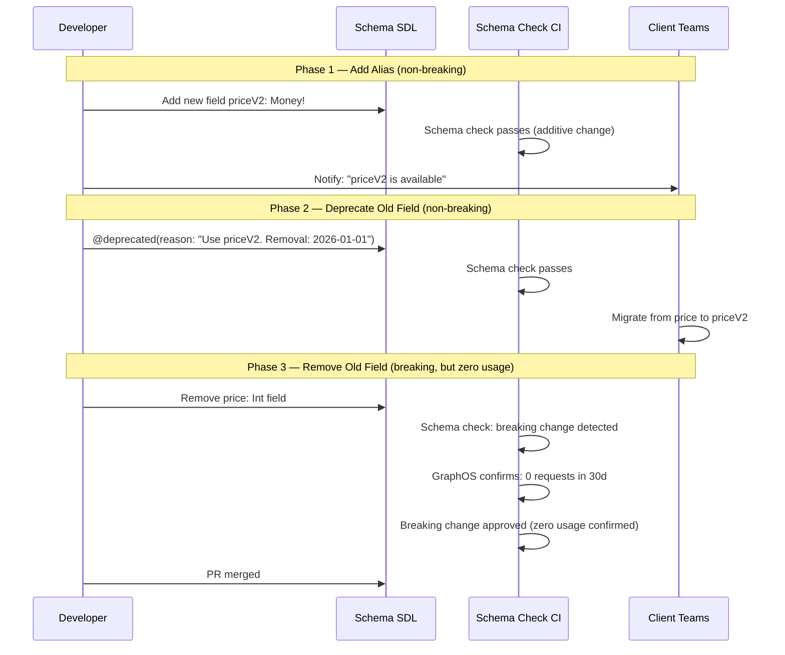

# 04 — Golden-Path Automation

> **Purpose:** A golden path that is only defined once and never maintained becomes stale
> within months. Dependency versions fall behind, CI workflow hashes drift, OTel bootstrap
> code diverges from the current collector configuration, and subgraphs accumulate
> inconsistencies that are expensive to reconcile at audit time. This document defines the
> automation systems that keep subgraphs aligned with the golden path: drift detection that
> compares each subgraph against the current scaffold template, automated PRs that bring
> subgraphs up to standard, schema lint auto-fix in CI, and breaking change auto-remediation
> suggestions delivered as actionable PR comments. The automation systems are the difference
> between a golden path that is a living standard and one that is an archaeology project.

---

## Golden-Path Drift Detection

Drift detection answers a single question: for each subgraph registered in the platform,
how far is it from the current scaffold template? The answer drives automated updates,
compliance reports, and the `goldenPathStatus` field surfaced in the portal.

### What Counts as Drift

Four categories of drift are tracked, with different severity levels:

| Category | Examples | Severity |
|---|---|---|
| **Package versions** | `@apollo/subgraph` is `2.7.3` but scaffold ships `2.9.1`; `graphql` is `16.6.0` but scaffold ships `16.9.0` | Warning |
| **CI workflow content** | Subgraph's `.github/workflows/schema-check.yml` hash differs from the platform template | Blocking (schema check integrity) |
| **OTel bootstrap code** | `src/telemetry.ts` missing `OTEL_EXPORTER_OTLP_ENDPOINT` env binding or uses deprecated `opentelemetry-node` package | Blocking (observability) |
| **Dockerfile base image** | Subgraph uses `node:18-alpine` but current scaffold specifies `node:22-alpine` | Warning |
| **Template version** | `template_version` in `catalog-info.yaml` annotations is more than two minor versions behind | Warning |

Blocking drift items prevent the `goldenPathStatus` from being `CURRENT`. Warning items
flag the subgraph as `DRIFT` in the portal without blocking deployment.

### Drift Detection Implementation

The drift detector runs as a scheduled GitHub Actions workflow in the platform repository,
weekly and on-demand. It checks out the platform scaffold template and compares key
artifacts against each registered subgraph using the platform API.

```yaml
# .github/workflows/drift-detection.yml — in platform repo
name: Golden Path Drift Detection

on:
  schedule:
    - cron: '0 6 * * 1'   # Monday 06:00 UTC
  workflow_dispatch:
    inputs:
      subgraphFilter:
        description: 'Specific subgraph name to check (blank = all)'
        required: false

jobs:
  detect-drift:
    runs-on: ubuntu-latest
    steps:
      - uses: actions/checkout@v4
        with:
          repository: myorg/graphql-platform
          token: ${{ secrets.PLATFORM_GITHUB_TOKEN }}

      - uses: actions/setup-node@v4
        with:
          node-version: '22'

      - name: Install platform CLI
        run: npm install -g @myorg/graphql-platform-cli

      - name: Run drift detection
        env:
          PLATFORM_API_TOKEN: ${{ secrets.PLATFORM_API_TOKEN }}
          GITHUB_TOKEN: ${{ secrets.PLATFORM_GITHUB_TOKEN }}
        run: |
          graphql-platform drift-check \
            --subgraph "${{ github.event.inputs.subgraphFilter }}" \
            --output drift-report.json \
            --open-prs-for-blocking

      - name: Upload drift report
        uses: actions/upload-artifact@v4
        with:
          name: drift-report
          path: drift-report.json

      - name: Post drift summary to Slack
        if: always()
        uses: slackapi/slack-github-action@v1
        with:
          slack-message: "Golden path drift scan complete. See report in ${{ github.run_url }}"
          channel-id: ${{ secrets.SLACK_PLATFORM_CHANNEL }}
        env:
          SLACK_BOT_TOKEN: ${{ secrets.SLACK_BOT_TOKEN }}
```

### Drift Detection Logic

```typescript
// packages/platform-cli/src/commands/driftCheck.ts
import { PlatformApiClient } from '../api/client';
import { ScaffoldTemplate } from '../scaffold/template';
import { GitHubClient } from '../github/client';
import { DriftReport, DriftItem } from '../types';

interface DriftCheckOptions {
  subgraphFilter?: string;
  openPrsForBlocking: boolean;
  output: string;
}

export async function driftCheck(options: DriftCheckOptions): Promise<void> {
  const platformApi = new PlatformApiClient(process.env.PLATFORM_API_TOKEN!);
  const github = new GitHubClient(process.env.GITHUB_TOKEN!);
  const template = await ScaffoldTemplate.loadCurrent(); // loads from ./scaffold directory

  // Fetch all registered subgraphs (or just the filtered one)
  const subgraphs = await platformApi.query(`
    query GetSubgraphs($filter: SubgraphFilter) {
      subgraphs(filter: $filter) {
        name
        templateVersion
        goldenPathStatus
        owner
        dependencies { name }
      }
    }
  `, { filter: options.subgraphFilter ? { name: options.subgraphFilter } : undefined });

  const reports: DriftReport[] = [];

  for (const subgraph of subgraphs.data.subgraphs) {
    const repoFiles = await github.getRepoFiles(
      `myorg/${subgraph.name}-subgraph`,
      [
        'package.json',
        '.github/workflows/schema-check.yml',
        'src/telemetry.ts',
        'Dockerfile',
        'catalog-info.yaml',
      ],
    );

    const driftItems: DriftItem[] = [];

    // Check package versions
    const pkg = JSON.parse(repoFiles['package.json'] ?? '{}');
    for (const [dep, expectedVersion] of Object.entries(template.packages)) {
      const actual = pkg.dependencies?.[dep] ?? pkg.devDependencies?.[dep];
      if (actual && actual !== expectedVersion) {
        driftItems.push({
          category: 'package_version',
          description: `${dep}: found ${actual}, expected ${expectedVersion}`,
          severity: 'warning',
          autoFixable: true,
          fixAction: { type: 'bump_package', package: dep, version: expectedVersion as string },
        });
      }
    }

    // Check CI workflow integrity
    const actualWorkflowHash = sha256(repoFiles['.github/workflows/schema-check.yml'] ?? '');
    if (actualWorkflowHash !== template.ciWorkflowHash) {
      driftItems.push({
        category: 'ci_workflow',
        description: `schema-check.yml hash mismatch — workflow may be outdated or modified`,
        severity: 'blocking',
        autoFixable: true,
        fixAction: { type: 'replace_file', path: '.github/workflows/schema-check.yml' },
      });
    }

    // Check OTel bootstrap
    const telemetry = repoFiles['src/telemetry.ts'] ?? '';
    if (!telemetry.includes('OTEL_EXPORTER_OTLP_ENDPOINT')) {
      driftItems.push({
        category: 'otel_bootstrap',
        description: 'telemetry.ts does not bind OTEL_EXPORTER_OTLP_ENDPOINT',
        severity: 'blocking',
        autoFixable: false,
        fixAction: null,
      });
    }

    reports.push({
      subgraphName: subgraph.name,
      owner: subgraph.owner,
      currentTemplateVersion: subgraph.templateVersion,
      latestTemplateVersion: template.version,
      driftItems,
      hasBlobkingDrift: driftItems.some(i => i.severity === 'blocking'),
    });
  }

  // Write report to file
  await fs.writeFile(options.output, JSON.stringify(reports, null, 2));

  // Open PRs for blocking drift items if flag is set
  if (options.openPrsForBlocking) {
    for (const report of reports.filter(r => r.hasBlockingDrift)) {
      await openGoldenPathUpdatePr(report, template, github);
    }
  }
}
```

---

## Automated PRs to Bring Subgraphs Up to Standard

The GitHub App (`graphql-platform-bot`) opens automated PRs against subgraph repositories
when drift is detected. These PRs are clearly labeled, contain a migration guide in the PR
body, and can be merged by the subgraph team without platform team involvement.

### GitHub App Configuration

```yaml
# .github/apps/graphql-platform-bot/config.yml
name: GraphQL Platform Bot
description: Opens PRs to keep subgraphs on the golden path

permissions:
  contents: write
  pull-requests: write
  issues: write
  checks: read

events:
  - push
  - pull_request
  - schedule
```

### Automated PR Creation

```typescript
// packages/platform-cli/src/github/openGoldenPathUpdatePr.ts
import { Octokit } from '@octokit/rest';
import { DriftReport } from '../types';
import { ScaffoldTemplate } from '../scaffold/template';

export async function openGoldenPathUpdatePr(
  report: DriftReport,
  template: ScaffoldTemplate,
  octokit: Octokit,
): Promise<void> {
  const repo = `${report.subgraphName}-subgraph`;
  const branch = `platform/golden-path-update-${template.version}`;

  // Check if a PR for this update already exists
  const existing = await octokit.pulls.list({
    owner: 'myorg',
    repo,
    head: `myorg:${branch}`,
    state: 'open',
  });
  if (existing.data.length > 0) {
    console.log(`PR already open for ${repo} — skipping`);
    return;
  }

  // Get the default branch SHA to base our branch off
  const { data: ref } = await octokit.git.getRef({
    owner: 'myorg', repo, ref: 'heads/main',
  });
  const baseSha = ref.object.sha;

  // Create the update branch
  await octokit.git.createRef({
    owner: 'myorg', repo,
    ref: `refs/heads/${branch}`,
    sha: baseSha,
  });

  // Apply each auto-fixable drift item as a file change
  for (const item of report.driftItems.filter(d => d.autoFixable && d.fixAction)) {
    if (item.fixAction!.type === 'replace_file') {
      const newContent = template.getFileContent(item.fixAction!.path);
      const { data: existingFile } = await octokit.repos.getContent({
        owner: 'myorg', repo, path: item.fixAction!.path,
      }).catch(() => ({ data: null }));

      await octokit.repos.createOrUpdateFileContents({
        owner: 'myorg', repo,
        path: item.fixAction!.path,
        message: `chore(platform): update ${item.fixAction!.path} to template v${template.version}`,
        content: Buffer.from(newContent).toString('base64'),
        sha: (existingFile as any)?.sha,
        branch,
      });
    }
  }

  // For package version bumps, update package.json and run npm install
  const packageBumps = report.driftItems.filter(
    d => d.autoFixable && d.fixAction?.type === 'bump_package',
  );
  if (packageBumps.length > 0) {
    await applyPackageBumpsToPackageJson(octokit, 'myorg', repo, branch, packageBumps);
  }

  // Open the PR
  const body = buildPrBody(report, template);
  await octokit.pulls.create({
    owner: 'myorg',
    repo,
    title: `chore(platform): update to golden path template v${template.version}`,
    head: branch,
    base: 'main',
    body,
    labels: ['platform-update', 'automated'],
  });
}

function buildPrBody(report: DriftReport, template: ScaffoldTemplate): string {
  const blockingItems = report.driftItems.filter(d => d.severity === 'blocking');
  const warningItems = report.driftItems.filter(d => d.severity === 'warning');

  return `## Golden Path Update — v${template.version}

This automated PR brings **${report.subgraphName}** up to the current golden path template.

### Summary

| Category | Count |
|---|---|
| Blocking issues fixed | ${blockingItems.filter(d => d.autoFixable).length} |
| Warning issues fixed | ${warningItems.filter(d => d.autoFixable).length} |
| Manual action required | ${report.driftItems.filter(d => !d.autoFixable).length} |

### Changes in This PR

${blockingItems.map(i => `- **[BLOCKING]** ${i.description}`).join('\n')}
${warningItems.map(i => `- **[WARNING]** ${i.description}`).join('\n')}

### Template Changelog

${template.changelog}

### Review Checklist

- [ ] CI schema check passes
- [ ] OTel traces visible in staging Grafana dashboard
- [ ] No new breaking changes introduced

---
*Opened by graphql-platform-bot. Questions? → #graphql-platform*
*[View drift report](https://portal.internal.myorg.com/catalog/${report.subgraphName}-subgraph/golden-path)*`;
}
```

---

## Schema Lint Auto-Fix in CI

Schema linting runs on every PR against a subgraph repository. Most linting violations have
deterministic fixes (missing field descriptions, wrong naming convention, missing `@deprecated`
reason text). The CI job produces an auto-fix patch for deterministic violations and posts it
as a PR comment so the author can apply it with one click.

```yaml
# .github/workflows/schema-check.yml (platform-owned template, used by all subgraphs)
name: Schema Check

on:
  pull_request:
    branches: [main]
    paths:
      - 'src/schema.graphql'
      - 'src/**/*.graphql'

jobs:
  schema-lint:
    runs-on: ubuntu-latest
    steps:
      - uses: actions/checkout@v4

      - uses: actions/setup-node@v4
        with:
          node-version: '22'
          cache: 'npm'

      - run: npm ci

      - name: Run schema lint
        id: lint
        run: |
          npx graphql-lint \
            --config .graphqlrc.yml \
            --format json \
            --output lint-results.json \
            src/schema.graphql || true

      - name: Generate auto-fix patch
        id: autofix
        run: |
          npx graphql-lint \
            --config .graphqlrc.yml \
            --fix \
            --dry-run \
            --patch-output autofix.patch \
            src/schema.graphql || true

          if [ -s autofix.patch ]; then
            echo "has_fixes=true" >> $GITHUB_OUTPUT
          else
            echo "has_fixes=false" >> $GITHUB_OUTPUT
          fi

      - name: Post lint results comment
        uses: actions/github-script@v7
        with:
          script: |
            const fs = require('fs');
            const results = JSON.parse(fs.readFileSync('lint-results.json', 'utf8'));
            const hasFixes = '${{ steps.autofix.outputs.has_fixes }}' === 'true';
            const patch = hasFixes ? fs.readFileSync('autofix.patch', 'utf8') : '';

            const errors = results.filter(r => r.severity === 'error');
            const warnings = results.filter(r => r.severity === 'warning');

            let body = `## Schema Lint Results\n\n`;
            body += `| Severity | Count |\n|---|---|\n`;
            body += `| Errors | ${errors.length} |\n`;
            body += `| Warnings | ${warnings.length} |\n\n`;

            if (errors.length > 0) {
              body += `### Errors (must fix)\n\n`;
              for (const e of errors) {
                body += `- **${e.rule}** at \`${e.location}\`: ${e.message}\n`;
              }
              body += '\n';
            }

            if (hasFixes) {
              body += `### Auto-Fix Available\n\n`;
              body += `Apply the fix by running:\n\`\`\`bash\nnpx graphql-lint --fix src/schema.graphql\n\`\`\`\n\n`;
              body += `<details><summary>View patch</summary>\n\n\`\`\`diff\n${patch}\n\`\`\`\n</details>\n`;
            }

            await github.rest.issues.createComment({
              owner: context.repo.owner,
              repo: context.repo.repo,
              issue_number: context.payload.pull_request.number,
              body,
            });

      - name: Fail if lint errors
        run: |
          ERRORS=$(jq '[.[] | select(.severity == "error")] | length' lint-results.json)
          if [ "$ERRORS" -gt 0 ]; then
            echo "Schema lint failed with $ERRORS errors"
            exit 1
          fi
```

### Lint Rules with Auto-Fix Support

```yaml
# .graphqlrc.yml — platform-owned, committed to every subgraph scaffold
schema: src/schema.graphql

rules:
  # Naming conventions — auto-fixable
  naming-convention:
    severity: error
    types: PascalCase
    fields: camelCase
    arguments: camelCase
    inputFields: camelCase
    enumValues: UPPER_CASE

  # Documentation requirements — auto-fixable (generates stub descriptions)
  require-description:
    severity: error
    types: true
    fields: true
    arguments: true
    # Exempt: internal/private types with _ prefix
    ignoredSelectors:
      - "FieldDefinition[parent.name.value=/_/]"

  # Deprecation hygiene — partially auto-fixable
  deprecation-reason:
    severity: error
    # @deprecated with empty reason is an error
    requireReason: true

  # No-schema patterns
  no-typename-prefix:
    severity: warning   # TypeProduct → Product

  # Input type conventions
  input-suffix:
    severity: warning
    # Input types should end with Input
```

---

## Breaking Change Auto-Remediation Suggestions

When a PR introduces a breaking change and the schema check CI job fails, the CI job
posts a structured comment with actionable remediation options. The comment explains the
breaking change, ranks the remediation options by effort, and provides ready-to-apply code
snippets for the recommended path.

### The Rename → Deprecate → Add Alias Pattern

The canonical GraphQL remediation for a breaking field rename is a three-phase process:



### Remediation Comment Generation

```typescript
// packages/platform-cli/src/schema/remediationSuggester.ts
import { BreakingChange } from '../types';

interface RemediationSuggestion {
  breakingChange: BreakingChange;
  options: RemediationOption[];
  recommendedOption: number;  // index into options
}

interface RemediationOption {
  name: string;
  effort: 'low' | 'medium' | 'high';
  description: string;
  codeSnippet?: string;
  estimatedWeeks: number;
}

export function suggestRemediation(change: BreakingChange): RemediationSuggestion {
  switch (change.type) {
    case 'FIELD_REMOVED':
      return {
        breakingChange: change,
        recommendedOption: 0,
        options: [
          {
            name: 'Deprecate first, remove later',
            effort: 'low',
            estimatedWeeks: 6,
            description: `Keep the field, mark it @deprecated, remove after usage drops to zero.`,
            codeSnippet: `# In your schema.graphql:
${change.path.split('.')[1]}: ${change.fieldType}
  @deprecated(reason: "This field will be removed on ${futureDate(90)}. Use [NEW_FIELD] instead.")`,
          },
          {
            name: 'Add alias field (rename pattern)',
            effort: 'medium',
            estimatedWeeks: 4,
            description: `Add a new field with the new name, deprecate the old one, remove after migration.`,
            codeSnippet: buildAliasSnippet(change),
          },
          {
            name: 'Coordinate with client teams for immediate removal',
            effort: 'high',
            estimatedWeeks: 2,
            description: `Get all ${change.affectedOperationCount} affected operations migrated in a coordinated sprint.`,
          },
        ],
      };

    case 'TYPE_CHANGED':
      return {
        breakingChange: change,
        recommendedOption: 0,
        options: [
          {
            name: 'Add new field with new type, deprecate old',
            effort: 'low',
            estimatedWeeks: 6,
            description: 'Never change the type of an existing field. Add a new field instead.',
            codeSnippet: buildTypeChangeAliasSnippet(change),
          },
        ],
      };

    default:
      return {
        breakingChange: change,
        recommendedOption: 0,
        options: [{
          name: 'Review manually',
          effort: 'medium',
          estimatedWeeks: 2,
          description: `This breaking change type (${change.type}) requires manual review.`,
        }],
      };
  }
}

function buildAliasSnippet(change: BreakingChange): string {
  const [typeName, fieldName] = change.path.split('.');
  const newFieldName = `${fieldName}V2`; // Suggest a v2 suffix as a starting point
  return `# Step 1: Add new field (do this first — non-breaking)
type ${typeName} {
  # Keep old field:
  ${fieldName}: ${change.fieldType}
    @deprecated(reason: "Use \`${newFieldName}\` instead. Removal: ${futureDate(90)}.")
  # Add new field:
  ${newFieldName}: ${change.newType ?? 'NewType!'}
}`;
}

function futureDate(daysFromNow: number): string {
  const d = new Date();
  d.setDate(d.getDate() + daysFromNow);
  return d.toISOString().split('T')[0];
}
```

---

## Platform Changelog Notifications via Slack Bot

The Slack bot subscribes to platform webhook events and formats them as structured Slack
messages delivered to team-specific channels. Each team receives only events relevant to
their subgraphs.

### Bot Configuration

```typescript
// packages/platform-slack-bot/src/handlers/schemaCheckFailed.ts
import { App } from '@slack/bolt';
import { SchemaCheckFailedPayload } from '../../types/webhooks';
import { getTeamSlackChannel } from '../catalog';

export function registerSchemaCheckFailedHandler(app: App): void {
  app.event('message', async ({ payload, client }) => {
    // Handler called by webhook receiver, not Slack event API
    // (webhook receiver parses the platform webhook and dispatches to handlers)
  });
}

// The webhook receiver dispatches to formatters per event type
export async function formatSchemaCheckFailedMessage(
  payload: SchemaCheckFailedPayload,
  subgraphOwner: string,
): Promise<object> {
  const channel = await getTeamSlackChannel(subgraphOwner);

  return {
    channel,
    blocks: [
      {
        type: 'header',
        text: {
          type: 'plain_text',
          text: `Schema Check Failed — ${payload.subgraphName}`,
        },
      },
      {
        type: 'section',
        fields: [
          { type: 'mrkdwn', text: `*Subgraph:*\n${payload.subgraphName}` },
          { type: 'mrkdwn', text: `*Variant:*\n${payload.variant}` },
          { type: 'mrkdwn', text: `*Breaking Changes:*\n${payload.breakingChanges.length}` },
          { type: 'mrkdwn', text: `*PR:*\n<${payload.githubPrUrl}|#${payload.githubPrNumber}>` },
        ],
      },
      {
        type: 'section',
        text: {
          type: 'mrkdwn',
          text: payload.breakingChanges
            .slice(0, 3)
            .map(c => `• \`${c.path}\` — ${c.description}`)
            .join('\n') +
            (payload.breakingChanges.length > 3
              ? `\n_...and ${payload.breakingChanges.length - 3} more_`
              : ''),
        },
      },
      {
        type: 'actions',
        elements: [
          {
            type: 'button',
            text: { type: 'plain_text', text: 'View Check Details' },
            url: payload.checkUrl,
            style: 'danger',
          },
          {
            type: 'button',
            text: { type: 'plain_text', text: 'View Remediation Guide' },
            url: `https://portal.internal.myorg.com/schema-check/${payload.subgraphName}/remediation`,
          },
        ],
      },
    ],
  };
}
```

### Notification Routing

```typescript
// packages/platform-slack-bot/src/catalog.ts
// Maps Backstage group names to Slack channels
// Kept in sync with Backstage via a periodic sync job

interface TeamChannelMapping {
  backstageGroup: string;
  slackChannel: string;         // e.g., "#team-catalog-alerts"
  oncallChannel: string;        // e.g., "#team-catalog-oncall"
  escalationChannel: string;    // e.g., "#graphql-platform-escalations"
}

const TEAM_CHANNELS: TeamChannelMapping[] = [
  {
    backstageGroup: 'catalog-team',
    slackChannel: '#team-catalog-graphql',
    oncallChannel: '#team-catalog-oncall',
    escalationChannel: '#graphql-platform-escalations',
  },
  {
    backstageGroup: 'orders-team',
    slackChannel: '#team-orders-graphql',
    oncallChannel: '#team-orders-oncall',
    escalationChannel: '#graphql-platform-escalations',
  },
];

// SLO violations go to on-call channel, not general team channel
export function getChannelForEventType(
  team: string,
  eventType: string,
): string {
  const mapping = TEAM_CHANNELS.find(m => m.backstageGroup === team);
  if (!mapping) return '#graphql-platform-alerts';  // fallback

  switch (eventType) {
    case 'subgraph.slo_violated':
      return mapping.oncallChannel;
    case 'subgraph.composition_failed':
      return mapping.escalationChannel;
    default:
      return mapping.slackChannel;
  }
}
```

---

## Related Topics

- [Platform APIs](./03-platform-apis.md)
- [Backstage Integration](./01-backstage-integration.md)
- [CI/CD Automation](../11-ci-cd-automation/README.md)
- [Schema Governance](../09-schema-governance/README.md)
- [Golden Paths](../19-platform-engineering/02-golden-paths.md)
- [Measuring Platform Success](./05-measuring-platform-success.md)

## References

- [GitHub Apps Documentation](https://docs.github.com/en/apps/creating-github-apps/about-creating-github-apps/about-creating-github-apps)
- [Octokit.js](https://github.com/octokit/octokit.js)
- [Slack Bolt for JavaScript](https://slack.dev/bolt-js/)
- [graphql-lint (graphql-eslint)](https://the-guild.dev/graphql/eslint/docs)
- [Apollo Rover — Schema Check](https://www.apollographql.com/docs/rover/commands/subgraphs/#subgraph-check)
- [Renovate — Automated Dependency Updates](https://docs.renovatebot.com/)
