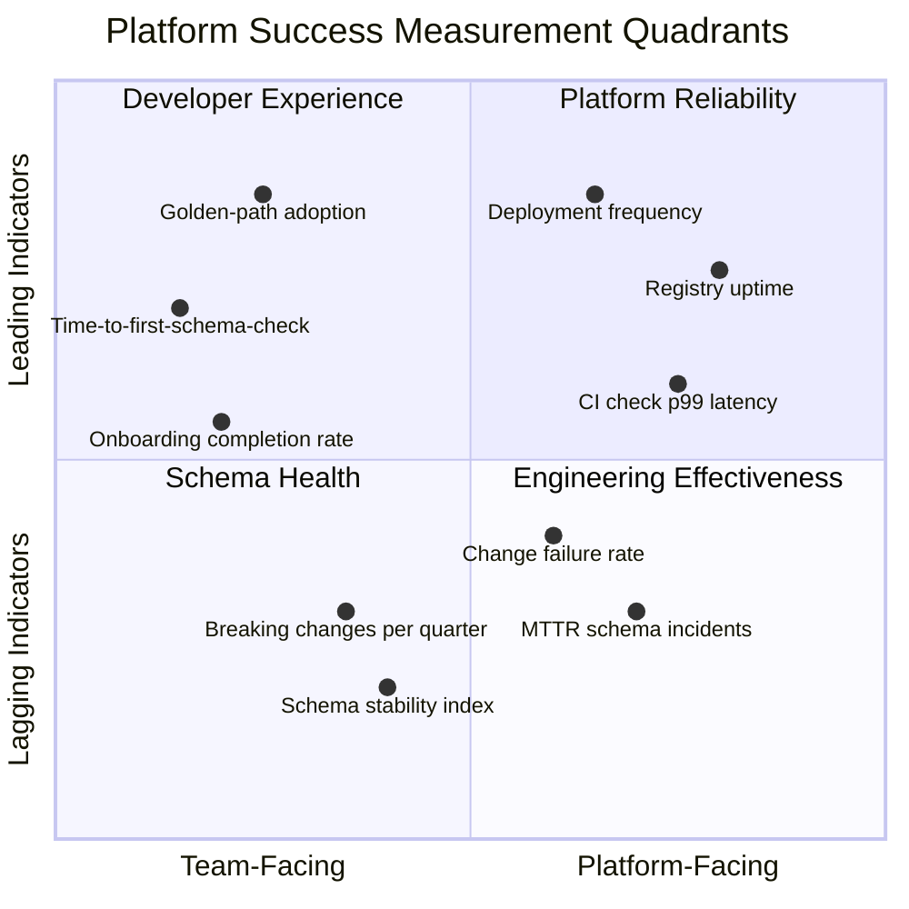
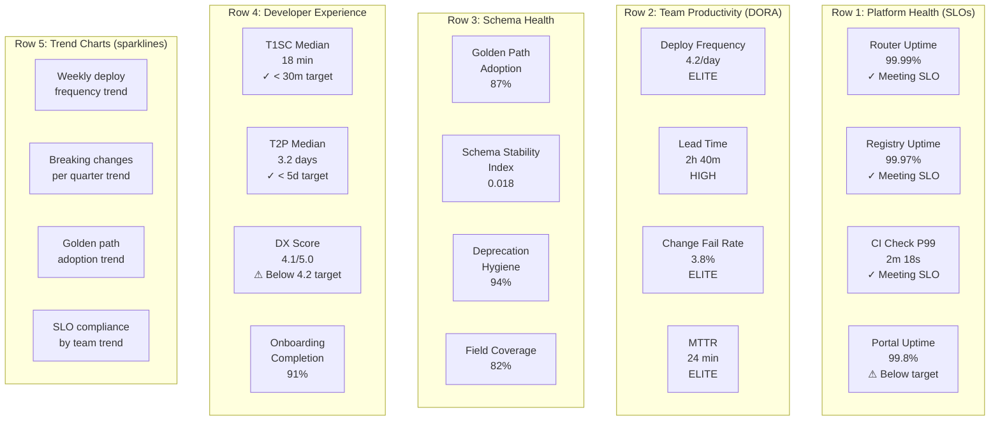
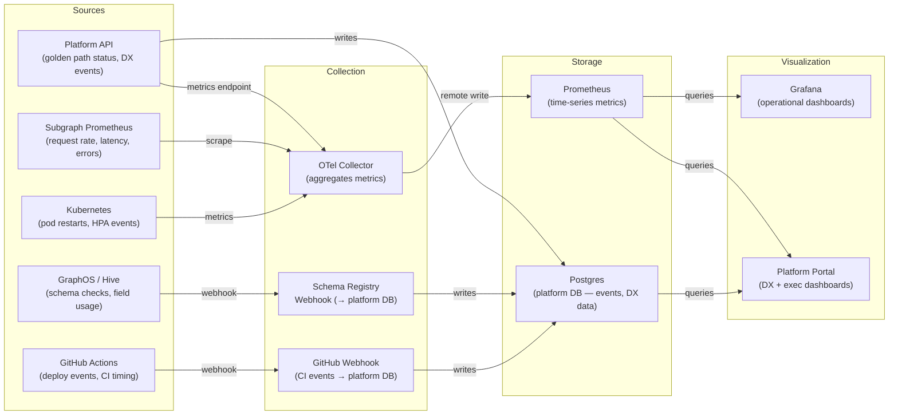

# 05 — Measuring Platform Success

> **Purpose:** A platform team that does not measure its impact cannot defend its existence
> or prioritize its roadmap. Measuring the GraphQL platform requires a combination of
> DORA-style engineering effectiveness metrics, developer experience (DX) indicators specific
> to the supergraph lifecycle, schema health metrics, and platform infrastructure reliability
> metrics. This document defines each metric, the collection mechanism, the target values that
> distinguish effective from ineffective platforms, and the executive dashboard layout that
> makes platform value visible to engineering leadership.

---

## The Measurement Framework

Platform success metrics fall into four quadrants. Measuring only one quadrant produces a
misleading picture: a platform can have perfect SLO compliance but abysmal developer
experience, or excellent DORA metrics but a schema that is degrading in quality over time.



---

## Platform Adoption Metrics

Adoption metrics measure how thoroughly the platform's golden path is being used. An
excellent platform that no one uses is not a successful platform.

### Golden-Path Adoption Rate

**Definition:** The percentage of active subgraphs whose `goldenPathStatus` is `CURRENT`
(i.e., within one minor version of the current scaffold template).

```
goldenPathAdoptionRate = (subgraphs with goldenPathStatus == CURRENT) / (total active subgraphs)
```

| Rating | Value |
|---|---|
| Excellent | >= 90% |
| Good | 75–89% |
| Needs attention | 50–74% |
| Critical | < 50% |

**Collection:** Queried from the platform API (`subgraphs { goldenPathStatus }`) in the weekly
drift detection run. Written to Prometheus as a gauge metric.

```typescript
// Prometheus metric registration in platform API server
import { Gauge, register } from 'prom-client';

const goldenPathAdoptionGauge = new Gauge({
  name: 'platform_golden_path_adoption_ratio',
  help: 'Ratio of subgraphs on the current golden path template',
  labelNames: ['language'] as const,
});

async function updateGoldenPathMetrics(db: Database): Promise<void> {
  const subgraphs = await db.query(`
    SELECT language, golden_path_status, COUNT(*) as count
    FROM subgraphs
    WHERE lifecycle = 'production'
    GROUP BY language, golden_path_status
  `);

  const totals: Record<string, number> = {};
  const current: Record<string, number> = {};

  for (const row of subgraphs.rows) {
    totals[row.language] = (totals[row.language] ?? 0) + row.count;
    if (row.golden_path_status === 'CURRENT') {
      current[row.language] = (current[row.language] ?? 0) + row.count;
    }
  }

  for (const language of Object.keys(totals)) {
    goldenPathAdoptionGauge.set(
      { language },
      (current[language] ?? 0) / totals[language],
    );
  }
}
```

### Schema Registry Coverage

**Definition:** The percentage of production services that have a registered subgraph in the
schema registry. Coverage < 100% means some services are exposing GraphQL endpoints that are
not federated and not governed.

```
schemaRegistryCoverage = registeredSubgraphs / totalGraphqlServices
```

This metric requires cross-referencing the service catalog (Backstage) against the schema
registry. Services with `spec.type: graphql-subgraph` in Backstage that are not in GraphOS
are detected as gaps.

---

## Developer Experience Score

The DX score measures how frictionless the platform is to use. It is composed of time-based
metrics (how long does it take to do common tasks?) and satisfaction metrics (how do engineers
rate the platform?).

### Time-to-First-Schema-Check (T1SC)

**Definition:** The elapsed time between a developer running the scaffold command (or
completing the Backstage Scaffolder wizard) and the first schema check CI run completing
successfully in GitHub Actions.

**Why it matters:** T1SC measures the time the platform costs a developer before they can do
any productive schema work. A platform with a T1SC of 4 hours (because infrastructure
provisioning is slow or the first CI run has configuration errors) imposes a full half-day
tax on every new subgraph.

**Target:** T1SC <= 30 minutes for >= 90% of subgraph provisioning events.

**Collection:** Measured as the difference between the `provisionedAt` timestamp in the
platform registry and the timestamp of the first successful `schema-check` workflow run
in GitHub Actions.

```typescript
interface DxTimeMetric {
  subgraphName: string;
  provisionedAt: string;
  firstSchemaCheckAt: string | null;
  firstSchemaCheckPassedAt: string | null;
  t1scMinutes: number | null;
  firstDeployToStagingAt: string | null;
  timeToFirstDeployMinutes: number | null;
}
```

### Time-to-Production for a New Subgraph (T2P)

**Definition:** The elapsed time from subgraph provisioning to the first successful
deployment to the production Kubernetes cluster, with the subgraph schema composing
cleanly in the production variant of the supergraph.

**Target:** T2P <= 5 business days for >= 80% of new subgraphs.

**Context:** T2P captures the combined friction of schema check setup, first schema design,
CI green, staging deployment, and production promotion. It is the best single metric for
the end-to-end developer experience.

### Developer Satisfaction Score

Quarterly developer survey distributed to all engineers who have used the platform in the
past 90 days. Five questions, scored 1–5:

| Question | Target Mean Score |
|---|---|
| The scaffold creates a working subgraph without manual fixes | >= 4.2 |
| CI schema check failures give me enough information to fix the issue | >= 4.0 |
| I can find what I need in the portal without asking in Slack | >= 3.8 |
| The platform team responds to requests in a reasonable time | >= 4.2 |
| Overall: I would recommend the platform to a new colleague | >= 4.0 |

The overall score (the last question) is the platform's internal NPS proxy.

---

## Schema Health Metrics

Schema health metrics measure the quality and stability of the supergraph schema over time.
They are leading indicators for production incidents caused by schema changes.

### Schema Stability Index

**Definition:** The number of breaking changes that reached production per team per quarter,
normalized by the number of deploys.

```
schemaStabilityIndex = breakingChangesReachingProduction / totalSubgraphDeploys
```

A breaking change "reached production" if it was merged to the production variant of the
supergraph without a prior approved breaking change request.

**Target:** schemaStabilityIndex < 0.02 (fewer than 2 breaking changes per 100 deploys).

**Collection:** Queried from the schema change event log in the platform database. Breaking
changes are tagged as either `approved` (went through the breaking change request flow) or
`unapproved` (bypassed or not caught by CI). Only `unapproved` breaking changes count against
the stability index.

### Deprecation Hygiene Score

**Definition:** The percentage of `@deprecated` fields that have a removal date set in their
deprecation reason.

```
deprecationHygieneScore = fieldsWithRemovalDate / totalDeprecatedFields
```

Fields deprecated without a removal date are effectively permanent deprecations — they
signal intent without commitment. The hygiene score measures whether deprecations are
actionable or decorative.

**Target:** >= 95% of deprecated fields have a removal date.

### Field Documentation Coverage

**Definition:** The percentage of non-internal fields in the supergraph that have a
non-empty description string.

**Target:** >= 80% of fields documented (100% for fields added after a specified cutoff date,
enforced by the `require-description` lint rule).

### Deprecated Field Half-Life

**Definition:** The median time (in days) from when a field is deprecated to when it is
removed, for fields that have completed the full deprecation lifecycle.

**Why it matters:** A very long half-life (> 180 days) indicates that deprecations are
accumulating without resolution. This degrades schema legibility and signals that client
migration paths are unclear or that teams lack ownership of the migration.

**Target:** Deprecated field half-life <= 90 days.

---

## SLO Compliance Per Subgraph Team

SLO compliance measures whether each subgraph team is meeting the operational commitments
they made when they published their SLO definitions. The platform team tracks compliance
at the team level, not just the subgraph level.

### Standard SLO Definitions

Every subgraph starts with these default SLOs, provisioned by the scaffold:

| SLO | Default Target | Measurement Window |
|---|---|---|
| Availability (non-5xx rate) | >= 99.9% | Rolling 30 days |
| P99 Request Latency | <= 500ms | Rolling 7 days |
| P95 Request Latency | <= 200ms | Rolling 7 days |
| Error Budget Burn Rate | <= 2x over 1h | Alert threshold |

### SLO Compliance Dashboard Query (Prometheus)

```promql
# Subgraph availability SLO — 99.9% over 30 days
# Availability = 1 - (5xx errors / total requests)

# Current 30-day availability per subgraph:
1 - (
  sum by (subgraph) (
    increase(graphql_subgraph_requests_total{status_code=~"5.."}[30d])
  )
  /
  sum by (subgraph) (
    increase(graphql_subgraph_requests_total[30d])
  )
)

# Error budget remaining:
# Error budget = 1 - SLO target = 1 - 0.999 = 0.001 (0.1%)
# Budget consumed = actual error rate / budget
(
  sum by (subgraph) (
    increase(graphql_subgraph_requests_total{status_code=~"5.."}[30d])
  )
  /
  sum by (subgraph) (
    increase(graphql_subgraph_requests_total[30d])
  )
) / 0.001
```

### SLO Compliance Summary Table

This table is generated weekly by the platform API and displayed in the executive dashboard:

| Subgraph | Team | Availability (30d) | P99 Latency (7d) | SLO Status |
|---|---|---|---|---|
| products | catalog-team | 99.97% | 312ms | Compliant |
| orders | orders-team | 99.85% | 487ms | Warning (latency) |
| users | accounts-team | 99.92% | 198ms | Compliant |
| payments | payments-team | 99.99% | 145ms | Compliant |
| inventory | warehouse-team | 98.70% | 1,240ms | Breach |

SLO breaches trigger a PagerDuty alert to the subgraph team's on-call rotation and post
a message to the team's Slack channel. Breaches that persist for > 4 hours escalate to
the platform team's on-call.

---

## Platform Infrastructure Reliability

The platform team has its own SLOs for the infrastructure it operates on behalf of subgraph
teams.

| Platform Component | SLO | Measurement |
|---|---|---|
| Schema registry availability | >= 99.95% uptime | GraphOS/Hive availability SLA + synthetic monitoring |
| CI schema check completion time | p99 <= 3 minutes | GitHub Actions run duration metrics |
| Router availability | >= 99.99% | Synthetic health check every 30 seconds |
| Platform API availability | >= 99.9% | Prometheus uptime probe |
| Backstage portal availability | >= 99.5% | Synthetic health check every 60 seconds |
| Scaffold CLI success rate | >= 99% | Platform CLI telemetry |

### Platform API Latency Targets

```promql
# P99 latency of platform API by operation type
histogram_quantile(0.99,
  sum by (operation_name, le) (
    rate(platform_api_request_duration_seconds_bucket[5m])
  )
)
```

Target: P99 <= 500ms for read queries; P99 <= 5s for provisioning mutations.

---

## DORA Metrics Adapted for GraphQL

The four DORA metrics (Deployment Frequency, Lead Time for Changes, Change Failure Rate,
Mean Time to Restore) apply directly to subgraph development with GraphQL-specific
interpretations.

### Deployment Frequency

**Standard DORA definition:** How often does your organization deploy to production?

**GraphQL adaptation:** Deployment frequency is measured at the **subgraph level**. A
subgraph team that deploys schema and resolver changes daily is more effective than one
that deploys monthly.

```typescript
// Deployment frequency query — platform database
interface DeploymentFrequencyStats {
  subgraphName: string;
  team: string;
  deploysLast30d: number;
  deploysLast7d: number;
  doraRating: 'elite' | 'high' | 'medium' | 'low';
}

function classifyDeploymentFrequency(deploysLast30d: number): DeploymentFrequencyStats['doraRating'] {
  const avgPerDay = deploysLast30d / 30;
  if (avgPerDay >= 1) return 'elite';      // Multiple deploys per day
  if (avgPerDay >= (1 / 7)) return 'high'; // At least weekly
  if (avgPerDay >= (1 / 30)) return 'medium'; // At least monthly
  return 'low';
}
```

### Lead Time for Changes

**Standard DORA definition:** The time from code committed to code in production.

**GraphQL adaptation:** Lead time for a schema change is measured from the point when a
`catalog-info.yaml` or `schema.graphql` commit is pushed to a PR branch, to when the
supergraph composition in the production variant reflects that change.

```mermaid
gantt
    dateFormat HH:mm
    title Lead Time for a Schema Change
    section Developer
    Write schema change          :00:00, 30m
    Push to PR branch            :00:30, 5m
    section CI
    Schema check (Rover)         :00:35, 2m
    Composition check            :00:37, 1m
    OPA policy check             :00:38, 1m
    section Review
    PR review + approval         :00:39, 60m
    section Deployment
    Merge to main                :01:39, 2m
    ArgoCD sync to staging       :01:41, 3m
    Publish schema to registry   :01:44, 1m
    Promotion to production      :01:45, 60m
    Composition in prod variant  :02:45, 2m
```



**Target lead time (elite):** < 4 hours from commit to production composition.

### Change Failure Rate

**Standard DORA definition:** What percentage of changes to production result in degraded
service or require remediation?

**GraphQL adaptation:** A "failed schema change" is one that causes any of:

1. A composition failure in the production variant after merging
2. A spike in 5xx errors on the router within 30 minutes of a new subgraph deploy
3. A rollback of a subgraph deployment within 24 hours of release
4. An incident that cites a recent schema change as the root cause

```typescript
interface SchemaChangeFailureEvent {
  subgraphName: string;
  deployedAt: string;
  failureType: 'composition_failure' | 'runtime_error_spike' | 'rollback' | 'incident';
  incidentId?: string;
  resolvedAt?: string;
  rollbackDurationMinutes?: number;
}

// Change failure rate per team over 90 days
function changeFailureRate(
  deploys: number,
  failures: SchemaChangeFailureEvent[],
): number {
  return failures.length / deploys;
}
```

**Target (elite):** Change failure rate < 5%.

### Mean Time to Restore (MTTR) for Schema Incidents

**Standard DORA definition:** How long does it take to recover from a failure?

**GraphQL adaptation:** MTTR for schema incidents is measured from the time the schema
change is identified as the root cause to the time the supergraph is confirmed healthy
(composition succeeds, error rate returns to baseline).

The primary remediation path for a schema incident is a **subgraph schema rollback**:

```bash
# Emergency schema rollback using Rover
rover subgraph publish myorg-supergraph@production \
  --name products \
  --schema ./previous-schema.graphql \
  --routing-url https://products-subgraph.team-catalog.svc.cluster.local:4001
```

**Target (elite):** MTTR < 30 minutes for schema incidents.

### DORA Summary Dashboard

```
┌─────────────────────────────────────────────────────────────────┐
│  DORA Metrics — GraphQL Supergraph Platform                      │
│  Period: Last 90 days                                            │
├──────────────────────────┬──────────────────────────────────────┤
│  Deployment Frequency    │  4.2 deploys/day (supergraph-wide)   │
│  Rating: ELITE           │  18 active subgraph teams            │
├──────────────────────────┼──────────────────────────────────────┤
│  Lead Time for Changes   │  Median: 2h 40m  |  P95: 6h 10m     │
│  Rating: HIGH            │  Target: < 4h (elite)                │
├──────────────────────────┼──────────────────────────────────────┤
│  Change Failure Rate     │  3.8%                                │
│  Rating: ELITE           │  7 failed changes / 186 total        │
├──────────────────────────┼──────────────────────────────────────┤
│  MTTR (Schema Incidents) │  Median: 24m  |  P95: 52m           │
│  Rating: ELITE           │  3 incidents in period                │
└──────────────────────────┴──────────────────────────────────────┘
```

---

## Executive Dashboard Design

The executive dashboard is designed for an audience of engineering directors and VPs. It
surfaces the three questions they care about: Is the platform healthy? Are teams productive?
Is the supergraph schema getting better or worse over time?

### Dashboard Layout



### Grafana Dashboard as Code

```json
{
  "title": "GraphQL Platform — Executive Dashboard",
  "uid": "graphql-platform-exec",
  "refresh": "5m",
  "panels": [
    {
      "title": "Golden Path Adoption",
      "type": "stat",
      "targets": [{
        "expr": "platform_golden_path_adoption_ratio * 100",
        "legendFormat": "% on current golden path"
      }],
      "fieldConfig": {
        "defaults": {
          "unit": "percent",
          "thresholds": {
            "steps": [
              { "value": 0, "color": "red" },
              { "value": 75, "color": "yellow" },
              { "value": 90, "color": "green" }
            ]
          }
        }
      }
    },
    {
      "title": "Schema Stability Index (Lower = Better)",
      "type": "stat",
      "targets": [{
        "expr": "platform_unapproved_breaking_changes_total / platform_subgraph_deploys_total",
        "legendFormat": "Breaking changes per deploy"
      }],
      "fieldConfig": {
        "defaults": {
          "unit": "percentunit",
          "thresholds": {
            "steps": [
              { "value": 0, "color": "green" },
              { "value": 0.02, "color": "yellow" },
              { "value": 0.05, "color": "red" }
            ]
          }
        }
      }
    },
    {
      "title": "SLO Compliance by Team",
      "type": "table",
      "targets": [{
        "expr": "platform_team_slo_compliance_ratio",
        "legendFormat": "{{ team }}"
      }],
      "transformations": [
        { "id": "sortBy", "options": { "fields": [{ "desc": true, "displayName": "Value" }] } }
      ]
    },
    {
      "title": "Subgraph Deploy Frequency (7-day rolling)",
      "type": "timeseries",
      "targets": [{
        "expr": "sum(increase(platform_subgraph_deploys_total[7d])) by (team)",
        "legendFormat": "{{ team }}"
      }]
    }
  ]
}
```

### Weekly Platform Report Template

The platform team publishes a weekly automated report to the engineering leadership Slack
channel (`#engineering-platform-updates`). The report is generated by the platform API and
formatted by the Slack bot.

```
📊 GraphQL Platform — Weekly Report (Week 47, 2025)

HIGHLIGHTS
• 4 new subgraphs onboarded (orders-history, loyalty, notifications, B2B-catalog)
• Golden path adoption: 87% (+3% vs last week)
• Zero SLO breaches in production this week

DORA METRICS
• Deploy frequency: 4.2/day (elite)
• Lead time: 2h 40m median (high)
• Change failure rate: 3.8% (elite)
• MTTR: 24 min (elite)

SCHEMA HEALTH
• 2 breaking change requests filed; both approved
• 8 deprecated fields crossed removal deadline — auto-PRs opened
• 3 subgraphs received golden path update PRs

ACTION ITEMS FOR TEAMS
• [orders-team] inventory-check workflow hash drift — PR #342 opened
• [accounts-team] DX survey score 3.6 — platform team will schedule sync

Full dashboard: https://portal.internal.myorg.com/platform-dashboard
```

---

## Metric Collection Architecture



---

## Related Topics

- [Golden-Path Automation](./04-golden-path-automation.md)
- [Platform APIs](./03-platform-apis.md)
- [Platform Team Model](../19-platform-engineering/01-platform-team-model.md)
- [Observability](../14-observability/README.md)
- [Developer Experience](../19-platform-engineering/04-developer-experience.md)
- [Platform Maturity Model](../19-platform-engineering/05-platform-maturity-model.md)

## References

- [DORA State of DevOps Report 2024](https://dora.dev/research/)
- [DORA Four Key Metrics](https://cloud.google.com/blog/products/devops-sre/using-the-four-keys-to-measure-your-devops-performance)
- [SLO Engineering Handbook (Google SRE)](https://sre.google/workbook/implementing-slos/)
- [Platform Engineering Metrics — Gartner (2024)](https://www.gartner.com/en/information-technology/topics/platform-engineering)
- [SPACE Framework for Developer Productivity (Forsgren et al., 2021)](https://queue.acm.org/detail.cfm?id=3454124)
- [Accelerate — Forsgren, Humble, Kim (2018)](https://itrevolution.com/accelerate-book/)
- [GraphOS Metrics and Reporting](https://www.apollographql.com/docs/graphos/metrics/)
